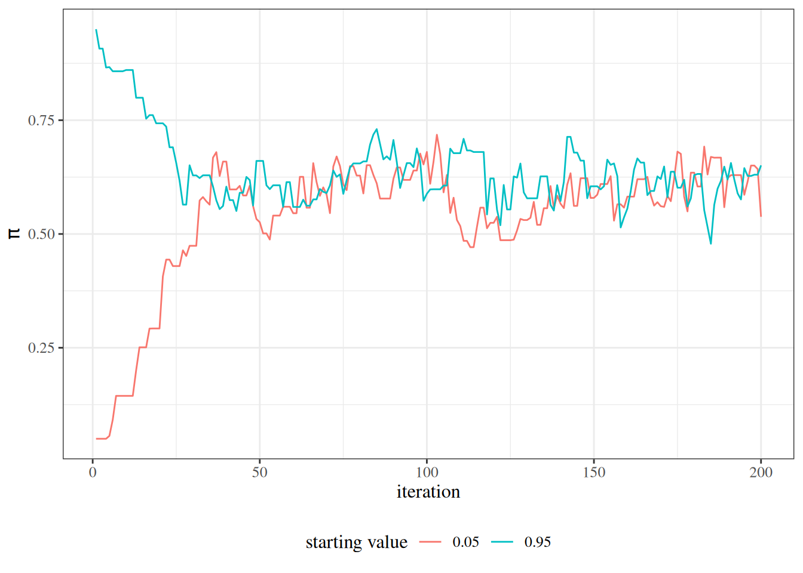

# Markov Chain Monte Carlo

Code

Published

Last modified: 2026-10-06 01:02:59 (PDT)

This page explains why most posterior distributions must be simulated, introduces Monte Carlo integration and Markov chains, describes the Metropolis–Hastings and Gibbs samplers, shows how to check a sampler’s output, and presents a criterion for comparing models ([Dobson and Barnett 2018, chap. 13](#ref-dobson4e)). It builds on the priors and posteriors defined on the [Bayesian Inference](bayesian-inference.llms.md) page.

## 1 Foundations of MCMC

When the posterior has a known closed form, as in [the Beta-Bernoulli example](bayesian-inference.llms.md#exm-beta-bernoulli), we can compute its summaries exactly or sample from it directly. In most real-world models, however, the [marginal likelihood](bayesian-inference.llms.md#def-marginal-likelihood) \\\operatorname{p}(\tilde{y})\\ that normalizes the posterior cannot be computed, so neither can the posterior’s summaries. Markov chain Monte Carlo methods get around this problem: instead of independent draws from the posterior, they generate a correlated sequence of draws whose distribution converges to the posterior ([Dobson and Barnett 2018, chap. 13](#ref-dobson4e), p. 287).

> **NOTE:**
>
> **Definition 1 (Markov chain Monte Carlo)** A **Markov chain Monte Carlo (MCMC)** method for a target distribution generates a sequence of draws \\\tilde{\theta}^{(1)}, \tilde{\theta}^{(2)}, \ldots\\, each drawn from a distribution that depends on the previous draw, such that the distribution of \\\tilde{\theta}^{(t)}\\ converges to the target as \\t \to \infty\\.

> **NOTE:**
>
> **Example 1 (A sequence that converges to the standard Gaussian)** Let \\\theta^{(t+1)} = 0.5\\\theta^{(t)} + \varepsilon_t\\, with \\\varepsilon_t \\ \sim\_{\operatorname{iid}}\\ \operatorname{N}\mathopen{}\left(0, 0.75\right)\mathclose{}\\ independent of the past. Each draw depends on the previous one. If \\\theta^{(t)}\\ has mean \\m_t\\ and variance \\v_t\\, then \\m\_{t+1} = 0.5\\ m_t\\ and \\v\_{t+1} = 0.25\\ v_t + 0.75\\, so from any starting value \\m_t \to 0\\ and \\v_t \to 1\\: the draws’ distribution converges to \\\operatorname{N}\mathopen{}\left(0, 1\right)\mathclose{}\\. This sequence is an MCMC method for sampling the standard Gaussian distribution; its draws are correlated, unlike independent draws.

### 1.1 Why the normalizing constant is hard to compute

With a parameter vector \\\tilde{\theta}\\, the normalizing constant of the posterior is

\\\operatorname{p}(\tilde{y}) = \int \operatorname{p}(\tilde{y}\mid \tilde{\theta})\\ \operatorname{p}(\tilde{\theta})\\ d\tilde{\theta},\\

an integral over every dimension of \\\tilde{\theta}\\ that typically has no closed form. Computing it numerically becomes infeasible as the dimension of \\\tilde{\theta}\\ grows ([Dobson and Barnett 2018, chap. 13](#ref-dobson4e), p. 287). MCMC sidesteps the problem: MCMC samplers use the posterior only through ratios \\\operatorname{p}(\tilde{\theta}^\* \mid \tilde{y}) / \operatorname{p}(\tilde{\theta}\mid \tilde{y})\\, in which the normalizing constant cancels.

### 1.2 Monte Carlo integration

> **NOTE:**
>
> **Definition 2 (Monte Carlo estimate)** Given draws \\\tilde{\theta}^{(1)}, \ldots, \tilde{\theta}^{(M)} \\ \sim\_{\operatorname{iid}}\\ \operatorname{p}(\tilde{\theta}\mid \tilde{y})\\ and a function \\g\\, the **Monte Carlo estimate** of the posterior expectation \\\operatorname{E}\mathopen{}\left\[g(\tilde{\theta}) \mid \tilde{y}\right\]\mathclose{}\\ is
>
> \\ \frac{1}{M} \sum\_{m=1}^{M} g\mathopen{}\left(\tilde{\theta}^{(m)}\right)\mathclose{}. \\

By the law of large numbers, a Monte Carlo estimate converges to the posterior expectation it estimates as the number of draws \\M\\ grows ([Dobson and Barnett 2018, chap. 13](#ref-dobson4e), p. 288). The posterior mean (\\g(\theta) = \theta\\) and posterior probabilities (\\g(\theta) = \text{1}\_{\theta \le c}\\, an indicator) are posterior expectations, so they are estimated by averages of the draws; posterior quantiles, and so credible-interval endpoints, are estimated by the corresponding quantiles of the draws.

> **NOTE:**
>
> **Example 2 (Monte Carlo posterior summaries for a Bernoulli model)** The posterior in [the Beta-Bernoulli example](bayesian-inference.llms.md#exm-beta-bernoulli) is \\\operatorname{Beta}(56, 37)\\. We draw \\M = 5{,}000\\ values from it, and compare Monte Carlo estimates with the exact values:
>
> ``` downlit
> set.seed(42)
> pi_draws <- stats::rbeta(n = 5000, shape1 = 56, shape2 = 37)
> rbind(
>   exact = c(
>     mean = 56 / (56 + 37),
>     lower = stats::qbeta(0.025, 56, 37),
>     upper = stats::qbeta(0.975, 56, 37)
>   ),
>   monte_carlo = c(
>     mean(pi_draws),
>     stats::quantile(pi_draws, c(0.025, 0.975))
>   )
> ) |>
>   round(4)
> #>               mean  lower  upper
> #> exact       0.6022 0.5014 0.6988
> #> monte_carlo 0.6022 0.5011 0.7013
> ```
>
> The two agree to about two decimal places, and the agreement improves as \\M\\ grows.

### 1.3 Markov chains

> **NOTE:**
>
> **Definition 3 (Markov chain)** A sequence of random variables \\\tilde{\theta}^{(1)}, \tilde{\theta}^{(2)}, \ldots\\ is a **Markov chain** if, for every \\t\\, the conditional distribution of \\\tilde{\theta}^{(t+1)}\\ given all the earlier values depends only on \\\tilde{\theta}^{(t)}\\:
>
> \\ \operatorname{p}\mathopen{}\left(\tilde{\theta}^{(t+1)} \mid \tilde{\theta}^{(t)}, \tilde{\theta}^{(t-1)}, \ldots, \tilde{\theta}^{(1)}\right)\mathclose{} = \operatorname{p}\mathopen{}\left(\tilde{\theta}^{(t+1)} \mid \tilde{\theta}^{(t)}\right)\mathclose{}. \\

> **NOTE:**
>
> **Definition 4 (Stationary distribution)** A distribution \\\pi\\ is a **stationary distribution** of a [Markov chain](#def-markov-chain) if, whenever \\\tilde{\theta}^{(t)}\\ has distribution \\\pi\\, \\\tilde{\theta}^{(t+1)}\\ also has distribution \\\pi\\.

> **NOTE:**
>
> **Example 3 (A two-state weather chain)** Each day is dry or wet. A dry day is followed by a dry day with probability 0.9, and a wet day is followed by a dry day with probability 0.5, whatever the weather on earlier days. So the daily weather is a [Markov chain](#def-markov-chain).
>
> Let \\\pi\_{\text{dry}}\\ be the probability that a day is dry. For that probability to be the same the next day,
>
> \\ \begin{aligned} \pi\_{\text{dry}} &= 0.9\\ \pi\_{\text{dry}} + 0.5\\ (1 - \pi\_{\text{dry}}) && \text{(tomorrow is dry after a dry or a wet day)}\\ &= 0.5 + 0.4\\ \pi\_{\text{dry}} && \text{(collecting terms)}, \end{aligned} \\
>
> so \\0.6\\ \pi\_{\text{dry}} = 0.5\\ and \\\pi\_{\text{dry}} = 5/6\\. The [stationary distribution](#def-stationary-distribution) is dry with probability \\5/6\\ and wet with probability \\1/6\\. A simulated chain, started on a wet day, spends about that fraction of its days dry:
>
> ``` downlit
> set.seed(7)
> n_days <- 10000
> dry <- logical(n_days)
> for (t in seq(2, n_days)) {
>   p_dry <- if (dry[t - 1]) 0.9 else 0.5
>   dry[t] <- stats::runif(1) < p_dry
> }
> c(simulated = mean(dry), stationary = 5 / 6) |> round(3)
> #>  simulated stationary 
> #>      0.833      0.833
> ```

Under conditions on its transition probabilities (irreducibility, aperiodicity and positive recurrence; for a continuous parameter, Harris positive recurrence), a Markov chain has a unique stationary distribution and the distribution of \\\tilde{\theta}^{(t)}\\ converges to it ([Gelman et al. 2013, sec. 11.2](#ref-gelman2013bda), p. 279; [Robert and Casella 2004, sec. 6.6.1](#ref-robert2004mcsm), Theorem 6.51, p. 234). Averages along the chain also converge to expectations under that distribution, even though successive values are correlated ([Robert and Casella 2004, sec. 6.7.1](#ref-robert2004mcsm), Theorem 6.63, p. 241; [Robert and Casella 2004, sec. 7.2](#ref-robert2004mcsm), p. 269). MCMC algorithms construct a Markov chain whose stationary distribution is the posterior \\\operatorname{p}(\tilde{\theta}\mid \tilde{y})\\ ([Gelman et al. 2013, chap. 11](#ref-gelman2013bda), p. 275), so that [Monte Carlo estimates](#def-monte-carlo-estimate) can be computed from the chain’s values in place of independent draws.

## 2 MCMC samplers

### 2.1 The Metropolis–Hastings algorithm

> **NOTE:**
>
> **Definition 5 (Proposal distribution)** In a Metropolis–Hastings sampler, a **proposal distribution** \\q(\cdot \mid \tilde{\theta})\\ is a conditional distribution from which a candidate value \\\tilde{\theta}^\*\\ is drawn, given the current value \\\tilde{\theta}\\.

> **NOTE:**
>
> **Definition 6 (Symmetric proposal)** A [proposal distribution](#def-proposal-distribution) is **symmetric** if \\q(\tilde{\theta}^\* \mid \tilde{\theta}) = q(\tilde{\theta}\mid \tilde{\theta}^\*)\\ for every \\\tilde{\theta}\\ and \\\tilde{\theta}^\*\\.

> **NOTE:**
>
> **Example 4 (A Gaussian random-walk proposal)** For a scalar parameter \\\pi\\, the proposal \\\pi^\* \mid \pi \sim \operatorname{N}\mathopen{}\left(\pi, 0.05^2\right)\mathclose{}\\ draws a candidate within about \\\pm 0.1\\ of the current value \\\pi\\. It is [symmetric](#def-symmetric-proposal): \\q(\pi^\* \mid \pi) = q(\pi \mid \pi^\*)\\, because the Gaussian density depends on \\\pi^\* - \pi\\ only through its square.

> **NOTE:**
>
> **Definition 7 (Acceptance ratio)** For a target posterior \\\operatorname{p}(\tilde{\theta}\mid \tilde{y}) \propto \operatorname{p}(\tilde{y}\mid \tilde{\theta})\\ \operatorname{p}(\tilde{\theta})\\, a [proposal distribution](#def-proposal-distribution) \\q\\, a current value \\\tilde{\theta}^{(t)}\\, and a candidate \\\tilde{\theta}^\*\\, the **acceptance ratio** is
>
> \\ \alpha \stackrel{\text{def}}{=} \frac{\operatorname{p}(\tilde{y}\mid \tilde{\theta}^\*)\\ \operatorname{p}(\tilde{\theta}^\*)}{\operatorname{p}(\tilde{y}\mid \tilde{\theta}^{(t)})\\ \operatorname{p}(\tilde{\theta}^{(t)})} \cdot \frac{q(\tilde{\theta}^{(t)} \mid \tilde{\theta}^\*)}{q(\tilde{\theta}^\* \mid \tilde{\theta}^{(t)})}. \\

> **NOTE:**
>
> **Example 5 (Acceptance ratio for a Bernoulli posterior)** With \\r = 55\\ successes in \\n = 91\\ trials, a uniform prior, and the [symmetric](#def-symmetric-proposal) proposal of [Example 4](#exm-proposal-distribution), the \\q\\ terms cancel and the prior is constant, so moving from \\\pi^{(t)} = 0.5\\ to \\\pi^\* = 0.6\\ gives
>
> \\ \begin{aligned} \alpha &= \frac{0.6^{55}\\ 0.4^{36}}{0.5^{55}\\ 0.5^{36}} && \text{(Bernoulli likelihood ratio)}\\ &= 1.2^{55}\\ 0.8^{36} && \text{(combine the powers)}\\ &\approx 7.35 && \text{(arithmetic)} \end{aligned} \\
>
> The reverse move, from \\0.6\\ to \\0.5\\, has \\\alpha \approx 1/7.35 \approx 0.136\\.

> **NOTE:**
>
> **Definition 8 (Metropolis–Hastings algorithm)** Given a target posterior \\\operatorname{p}(\tilde{\theta}\mid \tilde{y})\\, a [proposal distribution](#def-proposal-distribution) \\q(\cdot \mid \tilde{\theta})\\, and a starting value \\\tilde{\theta}^{(1)}\\, the **Metropolis–Hastings algorithm** produces \\\tilde{\theta}^{(t+1)}\\ from \\\tilde{\theta}^{(t)}\\ as follows ([Dobson and Barnett 2018, chap. 13](#ref-dobson4e), p. 291):
>
> 1.  Draw a candidate \\\tilde{\theta}^\* \sim q(\cdot \mid \tilde{\theta}^{(t)})\\.
> 2.  Compute the [acceptance ratio](#def-acceptance-ratio) \\\alpha\\.
> 3.  With probability \\\min(1, \alpha)\\, set \\\tilde{\theta}^{(t+1)} = \tilde{\theta}^\*\\ (accept the candidate); otherwise set \\\tilde{\theta}^{(t+1)} = \tilde{\theta}^{(t)}\\ (reject it).

The first factor of \\\alpha\\ is the ratio \\\operatorname{p}(\tilde{\theta}^\* \mid \tilde{y}) / \operatorname{p}(\tilde{\theta}^{(t)} \mid \tilde{y})\\ with the normalizing constant \\\operatorname{p}(\tilde{y})\\ canceled ([the posterior equation](bayesian-inference.llms.md#eq-bayes-posterior)), so the algorithm needs only the unnormalized posterior. When the proposal is [symmetric](#def-symmetric-proposal), as for a random walk \\\tilde{\theta}^\* = \tilde{\theta}^{(t)} + \varepsilon\\ with \\\varepsilon\\ drawn from a distribution symmetric about 0, the second factor equals 1. Provided the proposal can reach every region where the posterior is positive, the resulting chain is a [Markov chain](#def-markov-chain) whose stationary distribution is the posterior ([Gelman et al. 2013, sec. 11.2](#ref-gelman2013bda), pp. 279-280; [Robert and Casella 2004, sec. 7.3.1](#ref-robert2004mcsm), Theorem 7.2, p. 272).

> **NOTE:**
>
> **Example 6 (Metropolis–Hastings for a Bernoulli model)** We sample the posterior of [the Beta-Bernoulli example](bayesian-inference.llms.md#exm-beta-bernoulli) (\\r = 55\\ successes in \\n = 91\\ trials, uniform prior) with a Gaussian random-walk proposal \\\pi^\* = \pi^{(t)} + \varepsilon\\, \\\varepsilon \sim \operatorname{N}\mathopen{}\left(0, 0.05^2\right)\mathclose{}\\. The proposal is symmetric, and the uniform prior density is 1 on \\(0, 1)\\, so the log of the acceptance ratio is the difference of log-likelihoods, and a proposal outside \\(0, 1)\\ is always rejected.
>
> ``` downlit
> log_post_unnorm <- function(pi, r, n) {
>   if (pi <= 0 || pi >= 1) {
>     return(-Inf)
>   }
>   r * log(pi) + (n - r) * log(1 - pi)
> }
>
> mh_bernoulli <- function(n_iter, r, n, pi_init, step_sd = 0.05) {
>   chain <- numeric(n_iter)
>   chain[1] <- pi_init
>   for (t in seq(2, n_iter)) {
>     pi_curr <- chain[t - 1]
>     pi_prop <- pi_curr + stats::rnorm(1, sd = step_sd)
>     log_alpha <- log_post_unnorm(pi_prop, r, n) -
>       log_post_unnorm(pi_curr, r, n)
>     accept <- log(stats::runif(1)) < log_alpha
>     chain[t] <- if (accept) pi_prop else pi_curr
>   }
>   chain
> }
>
> set.seed(1)
> mh_chain <- mh_bernoulli(n_iter = 5000, r = 55, n = 91, pi_init = 0.5)
> c(
>   acceptance_rate = mean(diff(mh_chain) != 0),
>   mh_mean = mean(mh_chain),
>   exact_mean = 56 / 93
> ) |>
>   round(3)
> #> acceptance_rate         mh_mean      exact_mean 
> #>           0.710           0.601           0.602
> ```
>
> Comparing \\\log u\\, for \\u\\ uniform on \\(0, 1)\\, with \\\log \alpha\\ accepts with probability \\\min(1, \alpha)\\, and avoids computing \\\alpha\\ itself, which can overflow or underflow. Every accepted proposal changes the chain’s value, so the fraction of iterations that change estimates the acceptance rate. The chain’s mean is close to the exact posterior mean \\56/93\\.

### 2.2 Trace plots and burn-in

> **NOTE:**
>
> **Definition 9 (Trace plot)** A **trace plot** of an MCMC chain plots each sampled value of a parameter against its iteration number.

> **NOTE:**
>
> **Definition 10 (Burn-in)** The **burn-in** period is the initial segment of an MCMC chain that is discarded before posterior summaries are computed ([Dobson and Barnett 2018, chap. 13](#ref-dobson4e), p. 301).

A chain started far from where the posterior puts its probability takes some iterations to get there, and until it does, its values are not draws from the posterior. Burn-in removes those iterations. Its length is chosen by inspecting [trace plots](#def-trace-plot) of chains started from different values: the burn-in should end after the chains have stopped drifting and are moving around the same region.

> **NOTE:**
>
> **Example 7 (Burn-in for the Bernoulli sampler)** Continuing [Example 6](#exm-mh-bernoulli), we start two more chains at the extreme values \\0.05\\ and \\0.95\\. [Figure 1](#fig-mh-burnin) shows their first 200 iterations.
>
> Show R code
>
> ``` downlit
> set.seed(2)
> chain_low <- mh_bernoulli(n_iter = 5000, r = 55, n = 91, pi_init = 0.05)
> chain_high <- mh_bernoulli(n_iter = 5000, r = 55, n = 91, pi_init = 0.95)
> shown <- 1:200
> traces <- tibble::tibble(
>   iteration = rep(shown, times = 2),
>   pi = c(chain_low[shown], chain_high[shown]),
>   start = rep(c("0.05", "0.95"), each = length(shown))
> )
> ggplot2::ggplot(traces) +
>   ggplot2::aes(x = iteration, y = pi, colour = start) +
>   ggplot2::geom_line() +
>   ggplot2::labs(y = expression(pi), colour = "starting value")
> ```
>
> [](mcmc_files/figure-html/unnamed-chunk-1-1.png "Figure 1: Trace plots of the first 200 iterations of two Metropolis–Hastings chains for the Bernoulli model, started at \pi = 0.05 and \pi = 0.95.")
>
> Figure 1: [Trace plots](#def-trace-plot) of the first 200 iterations of two Metropolis–Hastings chains for the Bernoulli model, started at \\\pi = 0.05\\ and \\\pi = 0.95\\.
>
> Both chains reach the region around \\0.6\\ within a few dozen iterations, and after that the two are indistinguishable, so discarding the first 500 iterations of each leaves a generous margin.

### 2.3 The Gibbs sampler

> **NOTE:**
>
> **Definition 11 (Full conditional distribution)** For a parameter vector \\\tilde{\theta}= (\theta_1, \ldots, \theta_K)\\, the **full conditional distribution** of the component \\\theta_k\\ is its conditional distribution given the data and all the other components, \\\operatorname{p}(\theta_k \mid \tilde{\theta}\_{-k}, \tilde{y})\\, where \\\tilde{\theta}\_{-k}\\ denotes every component of \\\tilde{\theta}\\ except \\\theta_k\\.

> **NOTE:**
>
> **Definition 12 (Gibbs sampler)** The **Gibbs sampler** produces \\\tilde{\theta}^{(t+1)}\\ from \\\tilde{\theta}^{(t)}\\ by updating one component at a time: for \\k = 1, \ldots, K\\ in turn, it draws \\\theta_k^{(t+1)}\\ from the [full conditional distribution](#def-full-conditional) of \\\theta_k\\, with each other component set to its most recent value ([Dobson and Barnett 2018, chap. 13](#ref-dobson4e), p. 293).

The Gibbs sampler is a special case of the [Metropolis–Hastings algorithm](#def-mh), one component at a time, whose proposal is the full conditional itself; with that proposal the acceptance ratio is always 1, so every draw is accepted ([Dobson and Barnett 2018, chap. 13](#ref-dobson4e), p. 293). It needs a way to draw from each full conditional. JAGS (“Just Another Gibbs Sampler”) builds a Gibbs sampler from a model’s description, choosing a sampling method for each full conditional ([Dobson and Barnett 2018, chap. 13](#ref-dobson4e)).

> **NOTE:**
>
> **Example 8 (Gibbs sampling from a correlated Gaussian target)** Let the target be the bivariate Gaussian distribution of \\(\theta_1, \theta_2)\\ with means 0, variances 1 and correlation \\\rho\\, whose density is proportional to \\\operatorname{exp}\mathopen{}\left\\-\frac{\theta_1^2 - 2\rho\theta_1\theta_2 + \theta_2^2}{2(1-\rho^2)}\right\\\mathclose{}\\ ([Casella and Berger 2002](#ref-CaseBerg01), Definition 4.5.10). As a function of \\\theta_1\\,
>
> \\ \begin{aligned} \operatorname{p}(\theta_1 \mid \theta_2) &\propto \operatorname{exp}\mathopen{}\left\\-\frac{\theta_1^2 - 2\rho\theta_1\theta_2}{2(1-\rho^2)}\right\\\mathclose{} && \text{(dropping the factor with \$\theta_2^2\$ only)}\\ &= \operatorname{exp}\mathopen{}\left\\-\frac{(\theta_1 - \rho\theta_2)^2 - \rho^2\theta_2^2}{2(1-\rho^2)}\right\\\mathclose{} && \text{(completing the square)}\\ &\propto \operatorname{exp}\mathopen{}\left\\-\frac{(\theta_1 - \rho\theta_2)^2}{2(1-\rho^2)}\right\\\mathclose{} && \text{(dropping the factor with \$\theta_2^2\$ only)}, \end{aligned} \\
>
> so the [full conditional](#def-full-conditional) of \\\theta_1\\ is \\\operatorname{N}\mathopen{}\left(\rho\theta_2,\\ 1 - \rho^2\right)\mathclose{}\\, and by symmetry that of \\\theta_2\\ is \\\operatorname{N}\mathopen{}\left(\rho\theta_1,\\ 1 - \rho^2\right)\mathclose{}\\. We run the Gibbs sampler with \\\rho = 0\\ and with \\\rho = 0.99\\:
>
> ``` downlit
> gibbs_bvn <- function(n_iter, rho) {
>   draws <- matrix(NA_real_, nrow = n_iter, ncol = 2)
>   theta <- c(0, 0)
>   cond_sd <- sqrt(1 - rho^2)
>   for (t in seq_len(n_iter)) {
>     theta[1] <- stats::rnorm(1, mean = rho * theta[2], sd = cond_sd)
>     theta[2] <- stats::rnorm(1, mean = rho * theta[1], sd = cond_sd)
>     draws[t, ] <- theta
>   }
>   draws
> }
>
> set.seed(3)
> draws_indep <- gibbs_bvn(n_iter = 2000, rho = 0)
> draws_corr <- gibbs_bvn(n_iter = 2000, rho = 0.99)
> lag1_autocorrelation <- function(x) stats::cor(x[-1], x[-length(x)])
> c(
>   rho_0 = lag1_autocorrelation(draws_indep[, 1]),
>   rho_0.99 = lag1_autocorrelation(draws_corr[, 1])
> ) |>
>   round(3)
> #>    rho_0 rho_0.99 
> #>    0.020    0.971
> ```
>
> With \\\rho = 0\\, successive draws of \\\theta_1\\ are nearly uncorrelated. With \\\rho = 0.99\\, each full conditional has standard deviation \\\sqrt{1 - 0.99^2} \approx 0.14\\, so each update moves only a short way along the narrow ridge where the target puts its probability, and successive draws are almost perfectly correlated: 2,000 such draws carry far less information about the target than 2,000 independent ones.

## 3 Checking and improving MCMC

Because MCMC draws are correlated, and a chain may take many iterations to reach its stationary distribution, we must check whether the chains have converged before using them for inference ([Dobson and Barnett 2018, chap. 13](#ref-dobson4e), p. 302). [Trace plots](#def-trace-plot) give a visual check; the potential scale reduction factor gives a numerical one, by comparing several chains started from different values.

> **NOTE:**
>
> **Definition 13 (Potential scale reduction factor)** Suppose \\m\\ chains each contribute \\n\\ draws of a parameter \\\theta\\ after burn-in, with chain means \\\bar\theta_1, \ldots, \bar\theta_m\\, overall mean \\\bar\theta\\, and within-chain sample variances \\s_1^2, \ldots, s_m^2\\. Let
>
> \\ \begin{aligned} W &\stackrel{\text{def}}{=}\frac{1}{m} \sum\_{j=1}^m s_j^2 && \text{(within-chain variance)}\\ B &\stackrel{\text{def}}{=}\frac{n}{m - 1} \sum\_{j=1}^m \mathopen{}\left(\bar\theta_j - \bar\theta\right)\mathclose{}^2 && \text{(between-chain variance)}\\ \hat V &\stackrel{\text{def}}{=}\frac{n - 1}{n} W + \frac{1}{n} B && \text{(pooled variance estimate)}. \end{aligned} \\
>
> The **Gelman–Rubin potential scale reduction factor** is
>
> \\ \hat{R}\stackrel{\text{def}}{=}\sqrt{\hat V / W}. \\

If the chains have all converged to the posterior, \\\hat V\\ estimates the posterior variance and \\W\\ approaches it as \\n\\ grows, so \\\hat{R}\\ is close to 1. If the chains are still exploring different regions, the chain means differ, \\B\\ is large, and \\\hat{R}\\ exceeds 1 ([Gelman et al. 2013, sec. 11.4](#ref-gelman2013bda), pp. 283-285). [Definition 13](#def-psrf) follows Gelman et al. ([2013, sec. 11.4](#ref-gelman2013bda), pp. 284-285), except that they first split each chain in half and compute \\\hat{R}\\ over the half-chains, so that \\\hat{R}\\ also checks each chain for stationarity ([Gelman et al. 2013, sec. 11.4](#ref-gelman2013bda), p. 285, footnote 2). The statistic \\\hat{R}\\ is also called the **Gelman–Rubin statistic**; it formally assesses whether several chains have converged ([Dobson and Barnett 2018, chap. 13](#ref-dobson4e), p. 306). Software reports \\\hat{R}\\ as `psrf` or `Rhat`; [`coda::gelman.diag()`](https://rdrr.io/pkg/coda/man/gelman.diag.html) also applies a small-sample correction, so its value differs slightly from [Definition 13](#def-psrf)’s. A value of \\\hat{R}\\ near 1 does not prove convergence: chains that are all stuck in the same wrong region also agree.

> **NOTE:**
>
> **Example 9 (Potential scale reduction factor for the Bernoulli sampler)** Continuing [Example 7](#exm-burnin), we compute \\\hat{R}\\ for the two chains, first over their first 50 iterations, which include the burn-in, and then over iterations 501 to 5,000:
>
> ``` downlit
> psrf <- function(chains) {
>   n <- nrow(chains)
>   w <- mean(apply(chains, 2, stats::var))
>   b <- n * stats::var(colMeans(chains))
>   v_hat <- (n - 1) / n * w + b / n
>   sqrt(v_hat / w)
> }
> chains <- cbind(chain_low, chain_high)
> c(
>   first_50 = psrf(chains[1:50, ]),
>   after_burnin = psrf(chains[501:5000, ])
> ) |>
>   round(3)
> #>     first_50 after_burnin 
> #>        1.648        1.001
> ```
>
> Here `stats::var(colMeans(chains))` is \\\frac{1}{m-1}\sum_j (\bar\theta_j - \bar\theta)^2\\, so `b` is \\B\\. While the chains are still approaching the posterior from opposite ends, \\\hat{R}\\ is well above 1; after burn-in it is essentially 1.

### 3.1 Comparing MCMC estimates to maximum likelihood

When the prior is weak and the sample is moderate or large, the posterior mean from a well-mixed chain and the [maximum likelihood estimate](intro-MLEs.llms.md#def-mle) typically agree closely, and the posterior standard deviation is close to the frequentist [standard error](estimation.llms.md#def-SE) ([Dobson and Barnett 2018, chap. 13](#ref-dobson4e), p. 302). As \\n\\ grows the likelihood dominates the prior, so the posterior concentrates near the maximum likelihood estimate. Comparing the two is therefore a useful check on an MCMC analysis.

> **NOTE:**
>
> **Example 10 (Posterior mean and maximum likelihood estimate for a Bernoulli model)** With \\r = 55\\ successes in \\n = 91\\ trials, the maximum likelihood estimate is \\\hat\pi = r / n\\, with estimated standard error \\\sqrt{\hat\pi(1 - \hat\pi)/n}\\. Under the uniform prior, the posterior is \\\operatorname{Beta}(r + 1, n - r + 1)\\ ([the Beta-Bernoulli example](bayesian-inference.llms.md#exm-beta-bernoulli)), whose mean is \\(r + 1)/(n + 2)\\ and whose standard deviation is \\\sqrt{ab / \mathopen{}\left((a + b)^2 (a + b + 1)\right)\mathclose{}}\\ with \\a = r + 1\\ and \\b = n - r + 1\\ ([Casella and Berger 2002, sec. 3.3](#ref-CaseBerg01), p. 107):
>
> ``` downlit
> r <- 55
> n <- 91
> pi_hat <- r / n
> a <- r + 1
> b <- n - r + 1
> rbind(
>   maximum_likelihood = c(
>     estimate = pi_hat,
>     spread = sqrt(pi_hat * (1 - pi_hat) / n)
>   ),
>   posterior = c(a / (a + b), sqrt(a * b / ((a + b)^2 * (a + b + 1))))
> ) |>
>   round(4)
> #>                    estimate spread
> #> maximum_likelihood   0.6044 0.0513
> #> posterior            0.6022 0.0505
> ```
>
> The two estimates differ only through the prior’s pseudo-counts, and so do the two measures of spread; both differences vanish as \\n\\ grows. The MCMC mean in [Example 6](#exm-mh-bernoulli) agrees with the exact posterior mean, and so with the maximum likelihood estimate to about two decimal places.

A persistent discrepancy between the two is a signal worth investigating: it may reflect a genuinely informative prior, an unconverged chain, or a coding error in the model.

### 3.2 The importance of parameterization

How a model is written affects how well its sampler mixes ([Dobson and Barnett 2018, chap. 13](#ref-dobson4e), p. 299). Two algebraically equivalent parameterizations of the same model can produce chains with very different autocorrelation. Strong posterior correlation between parameters slows a sampler that updates one component at a time, because each update can move only a short way along a narrow, tilted ridge, as [Example 8](#exm-gibbs-bivariate-normal) shows with \\\rho = 0.99\\.

Common remedies include *centering* predictors (subtracting their means), so that the intercept and slopes are less correlated, and *reparameterizing* variance components on a scale on which the posterior is more nearly symmetric. These changes leave the model, and so the scientific conclusions, unchanged; they alter only the geometry the sampler must explore.

## 4 Deviance information criterion

To compare models fit to the same data by Bayesian inference, we need a measure that balances goodness of fit against complexity, as [Akaike’s information criterion](https://morrison-lab.github.io/rme/chapters/Linear-models-overview.html#def-aic) does for models fit by maximum likelihood. The standard criterion computed from MCMC output is the deviance information criterion ([Dobson and Barnett 2018, chap. 13](#ref-dobson4e), p. 306).

> **NOTE:**
>
> **Definition 14 (Deviance of a parameter value)** In the deviance information criterion, the **deviance** of a parameter value \\\tilde{\theta}\\ is
>
> \\ D(\tilde{\theta}) \stackrel{\text{def}}{=}-2 \log \operatorname{p}(\tilde{y}\mid \tilde{\theta}). \\

This deviance is minus twice the log-likelihood. A generalized linear model’s deviance subtracts the same quantity for the saturated model, which does not depend on \\\tilde{\theta}\\, so the two differ by a constant that cancels in comparisons between models of the same data.

> **NOTE:**
>
> **Definition 15 (Effective number of parameters)** Let \\\overline{D} \stackrel{\text{def}}{=}\operatorname{E}\mathopen{}\left\[D(\tilde{\theta}) \mid \tilde{y}\right\]\mathclose{}\\ be the posterior mean of the [deviance](#def-bayes-deviance), and let \\\bar{\tilde{\theta}} \stackrel{\text{def}}{=}\operatorname{E}\mathopen{}\left\[\tilde{\theta}\mid \tilde{y}\right\]\mathclose{}\\ be the posterior mean of the parameters. The **effective number of parameters** is
>
> \\ p_D \stackrel{\text{def}}{=}\overline{D} - D(\bar{\tilde{\theta}}). \\

> **NOTE:**
>
> **Definition 16 (Deviance information criterion)** The **deviance information criterion** is
>
> \\ \operatorname{DIC} \stackrel{\text{def}}{=}D(\bar{\tilde{\theta}}) + 2\\p_D, \\
>
> with \\D\\ from [Definition 14](#def-bayes-deviance) and \\p_D\\ from [Definition 15](#def-effective-parameters).

Substituting [Definition 15](#def-effective-parameters) gives an equivalent form:

\\ \begin{aligned} \operatorname{DIC} &= D(\bar{\tilde{\theta}}) + 2\mathopen{}\left(\overline{D} - D(\bar{\tilde{\theta}})\right)\mathclose{} && \text{(definition of \$p_D\$)}\\ &= 2\overline{D} - D(\bar{\tilde{\theta}}) && \text{(collecting terms)}\\ &= \overline{D} + \mathopen{}\left(\overline{D} - D(\bar{\tilde{\theta}})\right)\mathclose{} && \text{(splitting \$2\overline{D}\$)}\\ &= \overline{D} + p_D && \text{(definition of \$p_D\$)}. \end{aligned} \\

The term \\D(\bar{\tilde{\theta}})\\ rewards fit, while \\p_D\\ penalizes complexity: it measures how much the deviance is reduced, on average, by letting the parameters adapt to the data. As with Akaike’s criterion, lower DIC is better, and only differences in DIC between models fit to the same data are meaningful ([Dobson and Barnett 2018, chap. 13](#ref-dobson4e), p. 306). Both \\\overline{D}\\ and \\\bar{\tilde{\theta}}\\ are [Monte Carlo estimates](#def-monte-carlo-estimate) from the posterior draws, so DIC is a by-product of an MCMC run.

> **NOTE:**
>
> **Example 11 (DIC for the Bernoulli model)** For \\r = 55\\ successes in \\n = 91\\ trials, \\D(\pi) = -2\mathopen{}\left(r \log \pi + (n - r) \log(1 - \pi)\right)\mathclose{}\\. We estimate \\\overline{D}\\ and \\\bar\pi\\ from 5,000 draws from the \\\operatorname{Beta}(56, 37)\\ posterior of [the Beta-Bernoulli example](bayesian-inference.llms.md#exm-beta-bernoulli):
>
> ``` downlit
> deviance_bernoulli <- function(pi, r = 55, n = 91) {
>   -2 * (r * log(pi) + (n - r) * log(1 - pi))
> }
> set.seed(4)
> pi_draws <- stats::rbeta(5000, shape1 = 56, shape2 = 37)
> d_bar <- mean(deviance_bernoulli(pi_draws))
> d_at_mean <- deviance_bernoulli(mean(pi_draws))
> c(
>   d_bar = d_bar,
>   d_at_mean = d_at_mean,
>   p_d = d_bar - d_at_mean,
>   dic = 2 * d_bar - d_at_mean
> ) |>
>   round(2)
> #>     d_bar d_at_mean       p_d       dic 
> #>    123.13    122.16      0.97    124.10
> ```
>
> The model has one parameter, and its effective number of parameters \\p_D\\ is close to 1.

DIC should be used with care: it can behave poorly for models with weakly identified parameters or markedly non-Gaussian posteriors ([Dobson and Barnett 2018, chap. 13](#ref-dobson4e), p. 306).

## References

Casella, George, and Roger Berger. 2002. *Statistical Inference*. 2nd ed. Cengage Learning. <https://www.cengage.com/c/statistical-inference-2e-casella-berger/9780534243128/>.

Dobson, Annette J, and Adrian G Barnett. 2018. *An Introduction to Generalized Linear Models*. 4th ed. CRC press. <https://doi.org/10.1201/9781315182780>.

Gelman, Andrew, John B. Carlin, Hal S. Stern, David B. Dunson, Aki Vehtari, and Donald B. Rubin. 2013. *Bayesian Data Analysis*. 3rd ed. Chapman & Hall/CRC Texts in Statistical Science. CRC Press. <https://doi.org/10.1201/b16018>.

Robert, Christian P., and George Casella. 2004. *Monte Carlo Statistical Methods*. 2nd ed. Springer Texts in Statistics. Springer. <https://doi.org/10.1007/978-1-4757-4145-2>.

Back to top
