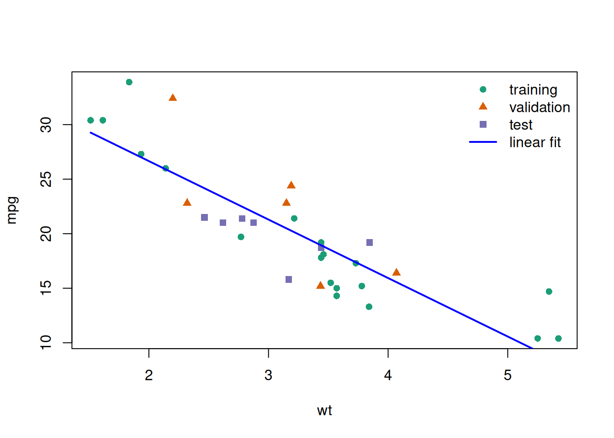
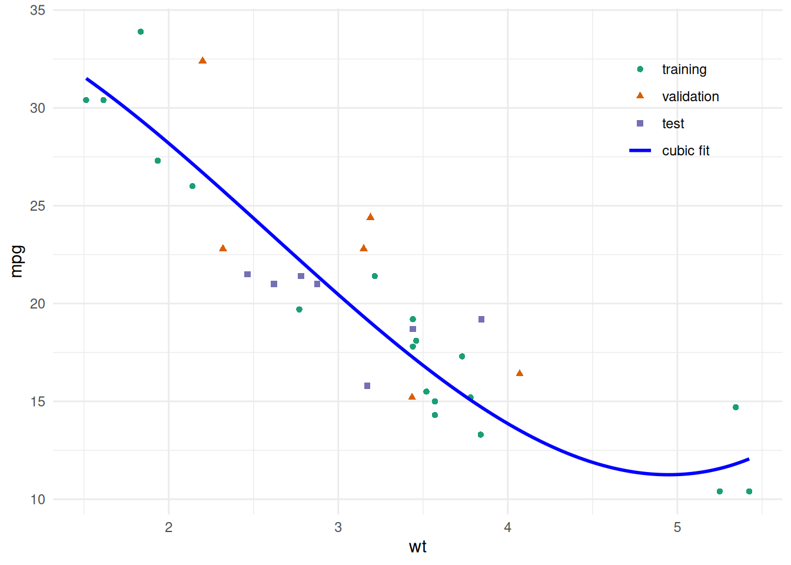
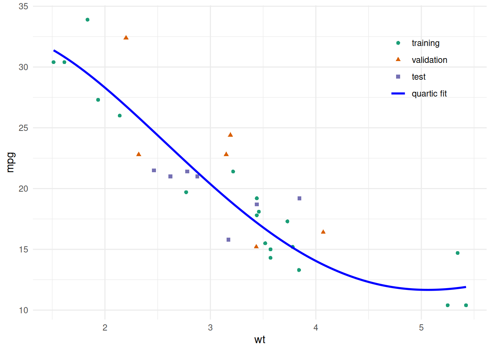
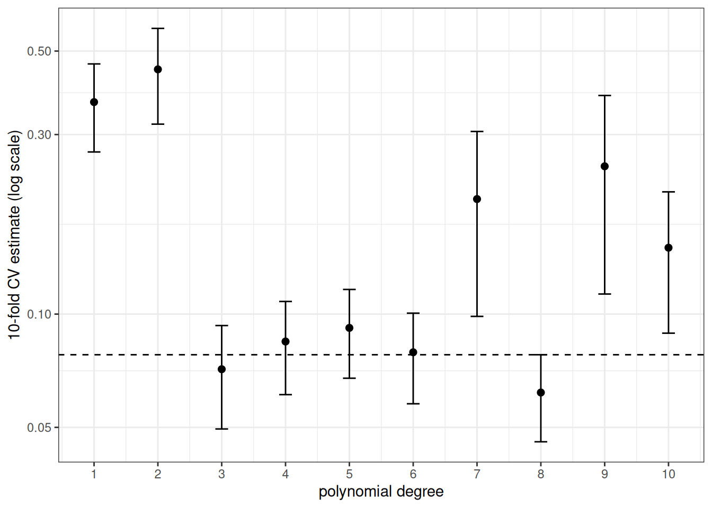

# Validating Predictions

Code

- [Show All Code](javascript:void(0))

- [Hide All Code](javascript:void(0))

- 

  ------------------------------------------------------------------------

- [View Source](javascript:void(0))

Published

Last modified: 2026-10-06 01:50:41 (PDT)

## 1 Fitting and scoring prediction rules

> **NOTE:**
>
> **Definition 1 (Fitting procedure)** A **fitting procedure** is a rule \\g\\ that, given any data \\\mathopen{}\left((x_i, y_i)\right)\mathclose{}\_{i \in I}\\ and any covariate value \\x\\, computes a [prediction](estimation.llms.md#def-prediction) of the outcome at \\x\\:
>
> \\ \mathopen{}\left(x; \mathopen{}\left((x_i, y_i)\right)\mathclose{}\_{i \in I}\right)\mathclose{} \mapsto g\mathopen{}\left(x; \mathopen{}\left((x_i, y_i)\right)\mathclose{}\_{i \in I}\right)\mathclose{}. \tag{1}\\
>
> > **NOTE:**
> >
> > The rule \\g\\ of the [definition of a prediction](estimation.llms.md#def-prediction). Hastie et al. ([2009, sec. 7.2](#ref-hastie2009elements)) write the model estimated from a training set as \\\hat f\\.

> **NOTE:**
>
> **Definition 2 (Training set)** A **training set** is the data to which a [fitting procedure](#def-fitting-procedure) is applied: \\n\\ observations, written as an ordered list indexed by a set \\I\\ of \\n\\ observation numbers:
>
> \\ \mathcal{T}\stackrel{\text{def}}{=}\mathopen{}\left((x_i, y_i)\right)\mathclose{}\_{i \in I}, \quad \mathopen{}\left\|I\right\|\mathclose{} = n. \tag{2}\\
>
> > **NOTE:**
> >
> > Hastie et al. ([2009, sec. 7.2](#ref-hastie2009elements)), who also write the training set as \\\mathcal{T}\\.

> **NOTE:**
>
> **Definition 3 (Prediction rule)** The **prediction rule** \\\hat y\\ that a [fitting procedure](#def-fitting-procedure) \\g\\ produces from a [training set](#def-training-set) \\\mathcal{T}\\ is the function that maps each covariate value \\x\\ to the [prediction](estimation.llms.md#def-prediction) that \\g\\ computes from \\x\\ and \\\mathcal{T}\\:
>
> \\ \hat y: x \mapsto g\mathopen{}\left(x; \mathcal{T}\right)\mathclose{}. \tag{3}\\

> **NOTE:**
>
> **Definition 4 (Held-out set)** A **held-out set** for a [training set](#def-training-set) \\\mathcal{T}\\ is a list of \\m\\ further observations, none of them in \\\mathcal{T}\\, that the [fitting procedure](#def-fitting-procedure) does not use and on which the [prediction rule](#def-prediction-rule) \\\hat y\\ is scored:
>
> \\ \mathopen{}\left((x\_{0,1}, y\_{0,1}), \ldots, (x\_{0,m}, y\_{0,m})\right)\mathclose{}. \tag{4}\\
>
> > **NOTE:**
> >
> > James et al. ([2021, sec. 5.1.1](#ref-james2021islr2e)), who call it a hold-out set.

> **NOTE:**
>
> **Definition 5 (Root mean squared error of predictions)** The **root mean squared error** (RMSE) of predictions \\\hat y_1, \ldots, \hat y_n\\ of observed outcomes \\y_1, \ldots, y_n\\ is the square root of their [mean squared error](estimation.llms.md#def-prediction-mse):
>
> \\ \operatorname{RMSE}\mathopen{}\left(\hat y\right)\mathclose{} \stackrel{\text{def}}{=}\sqrt{\operatorname{MSE}\mathopen{}\left(\hat y\right)\mathclose{}}. \tag{5}\\

> **NOTE:**
>
> **Definition 6 (Training error)** The **training error** of a [prediction rule](#def-prediction-rule) \\\hat y\\ fitted to a [training set](#def-training-set) \\\mathcal{T}\\ is the [mean squared error](estimation.llms.md#def-prediction-mse) of its [fitted values](estimation.llms.md#def-fitted-value) \\\hat y_i\\, \\i \in I\\, as predictions of the training outcomes \\y_i\\:
>
> \\ \overline{\operatorname{err}}\stackrel{\text{def}}{=}\frac{1}{n} \sum\_{i \in I} \mathopen{}\left(\hat y_i - y_i\right)^2\mathclose{}. \tag{6}\\
>
> > **NOTE:**
> >
> > Hastie et al. ([2009, sec. 7.2](#ref-hastie2009elements)), who write the training error as \\\overline{\text{err}}\\ and define it for any loss.

## 2 Overfitting

> **NOTE:**
>
> **Exercise 1 (Training error versus error on new cars)** The built-in `mtcars` data frame has \\n = 32\\ cars. Fit four models for fuel efficiency `mpg` as a polynomial in weight `wt`, of degree 1, 2, 3, and 4, using only the first 20 rows as the [training set](#def-training-set). For each model, compute the [RMSE](#def-prediction-rmse) of its predictions on the 20 training rows and on the remaining 12 rows, a [held-out set](#def-held-out-set).
>
> 1.  Which degree has the smallest training RMSE?
> 2.  Which degree has the smallest RMSE on the 12 held-out rows?
> 3.  Do the terms added beyond degree 2 improve predictions for the held-out cars?

> **NOTE:**
>
> *Solution 1*.
>
> ``` downlit
> train_cars <- mtcars[1:20, ]
> held_out_cars <- mtcars[21:32, ]
>
> prediction_mse <- function(model, data) {
>   response_only <- stats::update(stats::formula(model), . ~ 1)
>   y <- stats::model.response(stats::model.frame(response_only, data))
>   mean((predict(model, newdata = data) - y)^2)
> }
>
> rmse <- function(model, data) {
>   sqrt(prediction_mse(model, data))
> }
>
> overfitting_results <- tibble::tibble(degree = 1:4) |>
>   dplyr::mutate(
>     fit = purrr::map(
>       degree,
>       \(d) lm(mpg ~ poly(wt, d, raw = TRUE), data = train_cars)
>     ),
>     training_RMSE = purrr::map_dbl(fit, rmse, data = train_cars),
>     held_out_RMSE = purrr::map_dbl(fit, rmse, data = held_out_cars)
>   ) |>
>   dplyr::select(-fit)
>
> overfitting_results
> ```
>
> Show R code
>
> ``` downlit
> best_train <- overfitting_results$degree[
>   which.min(overfitting_results$training_RMSE)
> ]
> best_held_out <- overfitting_results$degree[
>   which.min(overfitting_results$held_out_RMSE)
> ]
>
> c(best_train = best_train, best_held_out = best_held_out)
> #>    best_train best_held_out 
> #>             4             2
> ```
>
> 1.  The smallest training RMSE is at degree 4. Each model contains the previous one as a special case, so its training RMSE cannot increase as the degree grows.
>
> 2.  The smallest held-out RMSE is at degree 2.
>
> 3.  No. Going from degree 2 to degree 3 or 4 lowers the training RMSE a little but leaves the held-out RMSE essentially unchanged (it does not fall below its degree-2 value). The terms beyond degree 2 improve the fit to the 20 training cars without improving predictions for the 12 held-out cars. Degree 1 to degree 2 is different: there the held-out RMSE also falls.

> **NOTE:**
>
> **Definition 7 (Overfitting)** **Overfitting** occurs when a [prediction rule](#def-prediction-rule) fits its [training set](#def-training-set) well but predicts poorly for new observations.

In [Exercise 1](#exr-overfitting), the terms beyond degree 2 fit the 20 training cars more closely but do not predict the 12 held-out cars better. The effect is small here: it is the beginning of overfitting, not a dramatic case.

## 3 Generalization error

> **NOTE:**
>
> **Exercise 2 (Score a fitted model on a car it has not seen)** A [prediction rule](#def-prediction-rule) \\\hat y\\ has been fitted to a [training set](#def-training-set) \\\mathcal{T}\\ of \\n\\ observations, such as the 20 training cars of [Exercise 1](#exr-overfitting). A new car \\(X_0, Y_0)\\ is then drawn from the same population, independently of \\\mathcal{T}\\.
>
> 1.  Holding \\\mathcal{T}\\ fixed, write the average squared [prediction error](estimation.llms.md#def-prediction-error) that \\\hat y\\ would make over all such new cars, as an expectation.
> 2.  Which parts of your expression do you know, and which do you not know?
> 3.  The training RMSE of [Exercise 1](#exr-overfitting) is the square root of the [training error](#def-training-mse) \\\overline{\operatorname{err}}\\. What does \\\overline{\operatorname{err}}\\ use in place of your expectation?

> **NOTE:**
>
> *Solution 2*.
>
> 1.  Average the squared prediction error over the distribution of \\(X_0, Y_0)\\, with \\\mathcal{T}\\, and so the rule \\\hat y\\, held fixed:
>
>     \\\operatorname{E}\mathopen{}\left\[\mathopen{}\left(\hat y(X_0) - Y_0\right)^2\mathclose{} \mid \mathcal{T}\right\]\mathclose{}.\\
>
> 2.  The rule \\\hat y\\ is known, because we fitted it. The joint distribution of \\(X_0, Y_0)\\ is unknown, so the expectation cannot be computed. If we knew that distribution, we would not need data to build a prediction rule.
>
> 3.  The training error \\\overline{\operatorname{err}}\\ replaces the expectation over new cars with an average over the \\n\\ training cars. Those cars are draws from the same population, but they are not independent of \\\mathcal{T}\\: they *are* \\\mathcal{T}\\, and \\\hat y\\ was chosen to fit them.

> **NOTE:**
>
> **Definition 8 (Generalization error)** The **generalization error** of a [prediction rule](#def-prediction-rule) \\\hat y\\ fitted to a [training set](#def-training-set) \\\mathcal{T}\\ is its expected squared [prediction error](estimation.llms.md#def-prediction-error) on a new observation \\(X_0, Y_0)\\ drawn from the same population independently of \\\mathcal{T}\\, with \\\mathcal{T}\\ held fixed:
>
> \\ \operatorname{Err}\_{\mathcal{T}} \stackrel{\text{def}}{=}\operatorname{E}\mathopen{}\left\[\mathopen{}\left(\hat y(X_0) - Y_0\right)^2\mathclose{} \mid \mathcal{T}\right\]\mathclose{}. \tag{7}\\
>
> > **NOTE:**
> >
> > The risk form follows Brian Hutchinson’s Fall 2025 lecture notes; the conditional form, with the training set held fixed, follows Hastie et al. ([2009, sec. 7.2](#ref-hastie2009elements)).

> **NOTE:**
>
> **Definition 9 (Expected generalization error)** The **expected generalization error** of a [fitting procedure](#def-fitting-procedure) \\g\\ at training-set size \\n\\ is the mean, over [training sets](#def-training-set) \\\mathcal{T}\\ of \\n\\ observations drawn independently from the population, of the [generalization error](#def-generalization-error) of the [prediction rule](#def-prediction-rule) that \\g\\ produces from \\\mathcal{T}\\:
>
> \\ \operatorname{Err}^{g}\mathopen{}\left(n\right)\mathclose{} \stackrel{\text{def}}{=}\operatorname{E}\mathopen{}\left\[\operatorname{Err}\_{\mathcal{T}}\right\]\mathclose{}, \quad \mathcal{T}= \mathopen{}\left((X_i, Y_i)\right)\mathclose{}\_{i \in I}, \quad \mathopen{}\left\|I\right\|\mathclose{} = n. \tag{8}\\
>
> > **NOTE:**
> >
> > Hastie et al. ([2009, sec. 7.2](#ref-hastie2009elements)) call this quantity the *expected prediction error* (or *expected test error*) and write it \\\operatorname{Err}\\, without the argument \\n\\.

> **NOTE:**
>
> **Definition 10 (Mean function)** The **mean function** \\\mu\\ of an outcome \\Y\\ given a covariate \\X\\ maps each covariate value \\x\\ to the mean of \\Y\\ given \\X = x\\:
>
> \\ \mu(x) \stackrel{\text{def}}{=}\operatorname{E}\mathopen{}\left\[Y \mid X = x\right\]\mathclose{}. \tag{9}\\

> **NOTE:**
>
> **Definition 11 (Expected squared prediction error at a covariate value)** The **expected squared prediction error at \\x\\** of a [fitting procedure](#def-fitting-procedure) \\g\\ at training-set size \\n\\ is the mean squared [prediction error](estimation.llms.md#def-prediction-error) of its prediction at \\x\\ for a new outcome \\Y_0\\ with \\X_0 = x\\, averaged over random [training sets](#def-training-set) \\\mathcal{T}\\ of \\n\\ observations drawn independently of \\(X_0, Y_0)\\, and over \\Y_0\\:
>
> \\ \operatorname{EPE}^{g}\_{n}\mathopen{}\left(x\right)\mathclose{} \stackrel{\text{def}}{=}\operatorname{E}\mathopen{}\left\[\mathopen{}\left(g\mathopen{}\left(x; \mathcal{T}\right)\mathclose{} - Y_0\right)^2\mathclose{} \mid X_0 = x\right\]\mathclose{}. \tag{10}\\
>
> > **NOTE:**
> >
> > Hastie et al. ([2009, sec. 7.3](#ref-hastie2009elements)), who write this quantity as \\\operatorname{Err}(x_0)\\.

> **NOTE:**
>
> **Exercise 3 (The expected generalization error, covariate value by covariate value)** Let \\g\\ be a [fitting procedure](#def-fitting-procedure), and let the random [training set](#def-training-set) \\\mathcal{T}\\ of \\n\\ observations be independent of the new observation \\(X_0, Y_0)\\. Show that the [expected generalization error](#def-expected-generalization-error) is the mean of the [expected squared prediction error at \\x\\](#def-epe) over the distribution of \\X_0\\:
>
> \\ \operatorname{Err}^{g}\mathopen{}\left(n\right)\mathclose{} = \operatorname{E}\mathopen{}\left\[\operatorname{EPE}^{g}\_{n}\mathopen{}\left(X_0\right)\mathclose{}\right\]\mathclose{}. \\

> **NOTE:**
>
> *Solution 3*. \\ \begin{aligned} & \operatorname{Err}^{g}\mathopen{}\left(n\right)\mathclose{} \\ &\quad = \operatorname{E}\mathopen{}\left\[\operatorname{Err}\_{\mathcal{T}}\right\]\mathclose{} && \text{(definition)} \\ &\quad = \operatorname{E}\mathopen{}\left\[\operatorname{E}\mathopen{}\left\[\mathopen{}\left(\hat y(X_0) - Y_0\right)^2\mathclose{} \mid \mathcal{T}\right\]\mathclose{}\right\]\mathclose{} && \text{(definition)} \\ &\quad = \operatorname{E}\mathopen{}\left\[\operatorname{E}\mathopen{}\left\[\mathopen{}\left(g\mathopen{}\left(X_0; \mathcal{T}\right)\mathclose{} - Y_0\right)^2\mathclose{} \mid \mathcal{T}\right\]\mathclose{}\right\]\mathclose{} && \text{(prediction rule)} \\ &\quad = \operatorname{E}\mathopen{}\left\[\mathopen{}\left(g\mathopen{}\left(X_0; \mathcal{T}\right)\mathclose{} - Y_0\right)^2\mathclose{}\right\]\mathclose{} && \text{(iterated expectations)} \\ &\quad = \operatorname{E}\mathopen{}\left\[\operatorname{E}\mathopen{}\left\[\mathopen{}\left(g\mathopen{}\left(X_0; \mathcal{T}\right)\mathclose{} - Y_0\right)^2\mathclose{} \mid X_0\right\]\mathclose{}\right\]\mathclose{} && \text{(iterated expectations)} \\ &\quad = \operatorname{E}\mathopen{}\left\[\operatorname{EPE}^{g}\_{n}\mathopen{}\left(X_0\right)\mathclose{}\right\]\mathclose{} && \text{(definition)} \end{aligned} \\
>
> The steps labeled “definition” apply [Equation 8](#eq-expected-generalization-error), [Equation 7](#eq-generalization-error) and [Equation 10](#eq-epe), in that order, and the step labeled “prediction rule” applies [Equation 3](#eq-prediction-rule), \\\hat y(X_0) = g\mathopen{}\left(X_0; \mathcal{T}\right)\mathclose{}\\. The two steps labeled “iterated expectations” use the [law of iterated expectations](https://morrison-lab.github.io/pds/expectation.html#thm-lie), the first conditioning on \\\mathcal{T}\\ and the second on \\X_0\\. The last line needs \\\mathcal{T}\\ to be independent of \\(X_0, Y_0)\\: then, given \\X_0 = x\\, \\\mathcal{T}\\ still has its unconditional distribution, as [Definition 11](#def-epe) requires.

> **NOTE:**
>
> **Theorem 1 (The expected generalization error averages the error at each covariate value)** If the random [training set](#def-training-set) \\\mathcal{T}\\ is independent of the new observation \\(X_0, Y_0)\\, the [expected generalization error](#def-expected-generalization-error) of a [fitting procedure](#def-fitting-procedure) \\g\\ is the mean of its [expected squared prediction error at \\x\\](#def-epe) over the distribution of \\X_0\\:
>
> \\ \operatorname{Err}^{g}\mathopen{}\left(n\right)\mathclose{} = \operatorname{E}\mathopen{}\left\[\operatorname{EPE}^{g}\_{n}\mathopen{}\left(X_0\right)\mathclose{}\right\]\mathclose{}. \tag{11}\\

> **NOTE:**
>
> *Proof*. This is [Solution 3](#sol-expected-error-epe).

> **NOTE:**
>
> **Theorem 2 (Bias, variance and noise)** Let \\\mu\\ be the [mean function](#def-mean-function) of the outcome given the covariate. Suppose that, given \\X_0 = x\\, the new outcome \\Y_0\\ has variance \\\sigma^2\\ and is independent of the random training set \\\mathcal{T}\\, and that \\\operatorname{E}\mathopen{}\left\[g\mathopen{}\left(x; \mathcal{T}\right)\mathclose{}^2\right\]\mathclose{} \< \infty\\. Then the [expected squared prediction error at \\x\\](#def-epe) is the squared [bias](https://morrison-lab.github.io/pds/variance-covariance.html#def-prediction-bias) of the prediction \\g\mathopen{}\left(x; \mathcal{T}\right)\mathclose{}\\ as a prediction of \\\mu(x)\\, plus its [variance](https://morrison-lab.github.io/pds/variance-covariance.html#def-variance), plus \\\sigma^2\\:
>
> \\ \operatorname{EPE}^{g}\_{n}\mathopen{}\left(x\right)\mathclose{} = \mathopen{}\left(\operatorname{E}\mathopen{}\left\[g\mathopen{}\left(x; \mathcal{T}\right)\mathclose{}\right\]\mathclose{} - \mu(x)\right)^2\mathclose{} + \operatorname{Var}\mathopen{}\left(g\mathopen{}\left(x; \mathcal{T}\right)\mathclose{}\right)\mathclose{} + \sigma^2. \tag{12}\\

> **NOTE:**
>
> *Proof*. This is the [expected squared prediction error theorem](https://morrison-lab.github.io/pds/variance-covariance.html#thm-prediction-error) of the pds notes, with \\f(x_0) = \mu(x)\\, prediction \\\hat f(x_0) = g\mathopen{}\left(x; \mathcal{T}\right)\mathclose{}\\, and noise \\\varepsilon = Y_0 - \mu(x)\\, applied conditionally on \\X_0 = x\\. Given \\X_0 = x\\, that noise has mean 0 by [Equation 9](#eq-mean-function) and variance \\\sigma^2\\, and it is independent of \\g\mathopen{}\left(x; \mathcal{T}\right)\mathclose{}\\ because \\Y_0\\ is independent of \\\mathcal{T}\\.

> **NOTE:**
>
> *Remark 1* (Other names, and how the expected error splits). Hastie et al. ([2009, sec. 7.2](#ref-hastie2009elements)) also call \\\operatorname{Err}\_{\mathcal{T}}\\ the *test error*, and in sec. 7.12 the *conditional* test error. It is the [risk](https://morrison-lab.github.io/pds/expectation.html#def-risk) of the prediction \\\hat y(X_0)\\ under squared error [loss](https://morrison-lab.github.io/pds/expectation.html#def-loss-function), computed with the training set held fixed.
>
> The argument \\n\\ of the [expected generalization error](#def-expected-generalization-error) \\\operatorname{Err}^{g}\mathopen{}\left(n\right)\mathclose{}\\ of a fitting procedure \\g\\ records that it depends on how many observations each training set has. By [Theorem 1](#thm-expected-error-epe), \\\operatorname{Err}^{g}\mathopen{}\left(n\right)\mathclose{}\\ averages the expected squared prediction error at each covariate value, and [Theorem 2](#thm-epe-decomposition) splits that error into a squared bias, a variance and a noise variance.

> **NOTE:**
>
> **Definition 12 (Flexibility)** Let \\g_1\\ and \\g_2\\ be [fitting procedures](#def-fitting-procedure) that each choose, by least squares, a [prediction rule](#def-prediction-rule) from a set of candidate functions, \\\mathcal{G}\_1\\ and \\\mathcal{G}\_2\\ respectively. The procedure \\g_2\\ is **at least as flexible** as \\g_1\\ if every candidate of \\g_1\\ is also a candidate of \\g_2\\:
>
> \\ \mathcal{G}\_1 \subseteq \mathcal{G}\_2. \tag{13}\\
>
> > **NOTE:**
> >
> > James et al. ([2021, sec. 2.1.3](#ref-james2021islr2e)) use flexibility without a formal definition.

> **NOTE:**
>
> *Remark 2* (Polynomial degree orders flexibility). Least-squares polynomial fits are ordered by degree: a polynomial of degree \\d\\ is also a polynomial of degree \\d + 1\\ whose coefficient of \\x^{d + 1}\\ is zero, so the fit of degree \\d + 1\\ is [at least as flexible](#def-flexibility) as the fit of degree \\d\\. The four fits of [Exercise 1](#exr-overfitting) are ordered this way. [Definition 12](#def-flexibility) is narrower than the informal use of the word in James et al. ([2021, sec. 2.1.3](#ref-james2021islr2e)): it orders only procedures whose candidate sets are nested. Other procedures can be compared by other measures, such as the effective number of parameters ([Hastie et al. 2009, sec. 7.6](#ref-hastie2009elements)).

> **NOTE:**
>
> **Definition 13 (Bias–variance trade-off)** Let \\g_1, \ldots, g_L\\ be [fitting procedures](#def-fitting-procedure), each [at least as flexible](#def-flexibility) as the one before, and let \\\mathcal{T}\\ be a random [training set](#def-training-set). At a covariate value \\x\\, with \\\mu\\ the [mean function](#def-mean-function), there is a **bias–variance trade-off** among them when, from each procedure to the next, the squared [bias](https://morrison-lab.github.io/pds/variance-covariance.html#def-prediction-bias) of the prediction, as a prediction of \\\mu(x)\\, does not rise and its [variance](https://morrison-lab.github.io/pds/variance-covariance.html#def-variance) does not fall:
>
> \\ \begin{aligned} \mathopen{}\left(\operatorname{Bias}\mathopen{}\left(g\_{l+1}\mathopen{}\left(x; \mathcal{T}\right)\mathclose{}\right)\mathclose{}\right)^2\mathclose{} &\le \mathopen{}\left(\operatorname{Bias}\mathopen{}\left(g_l\mathopen{}\left(x; \mathcal{T}\right)\mathclose{}\right)\mathclose{}\right)^2\mathclose{}, \\ \operatorname{Var}\mathopen{}\left(g\_{l+1}\mathopen{}\left(x; \mathcal{T}\right)\mathclose{}\right)\mathclose{} &\ge \operatorname{Var}\mathopen{}\left(g_l\mathopen{}\left(x; \mathcal{T}\right)\mathclose{}\right)\mathclose{}, \qquad l = 1, \ldots, L - 1. \end{aligned} \tag{14}\\
>
> > **NOTE:**
> >
> > James et al. ([2021, sec. 2.2.2](#ref-james2021islr2e)).

> **NOTE:**
>
> *Remark 3* (Overfitting and the trade-off). By [Theorem 2](#thm-epe-decomposition), \\\operatorname{EPE}^{g_l}\_{n}\mathopen{}\left(x\right)\mathclose{}\\ is the squared bias plus the variance plus \\\sigma^2\\. Under a [bias–variance trade-off](#def-bias-variance-tradeoff) among \\g_1, \ldots, g_L\\, moving from \\g_l\\ to \\g\_{l+1}\\ lowers the expected squared prediction error at \\x\\ when the squared bias falls by more than the variance rises, and raises it otherwise. The smallest of \\\operatorname{EPE}^{g_1}\_{n}\mathopen{}\left(x\right)\mathclose{}, \ldots, \operatorname{EPE}^{g_L}\_{n}\mathopen{}\left(x\right)\mathclose{}\\ is often at some \\g_l\\ with \\1 \< l \< L\\ ([James et al. 2021, sec. 2.2.2](#ref-james2021islr2e)), but not always: if the mean function \\\mu\\ is a candidate of \\g_1\\, the squared bias of \\g_1\\ can be zero, and then no later \\g_l\\ has a smaller squared bias and, under the trade-off, none has a smaller variance, so none has a smaller expected squared prediction error. The procedures past the smallest error have lowered their squared bias by less than they have raised their variance, and the rules they produce tend to [overfit](#def-overfitting): they fit their training sets more closely than the procedure with the smallest error but predict new observations worse.

> **NOTE:**
>
> *Remark 4* (Coefficients per observation). Adding coefficients to a least-squares fit makes it [at least as flexible](#def-flexibility) as before. With few observations per coefficient, the variance this adds can outweigh the squared bias it removes, which is the overfitting side of [Remark 3](#rem-overfitting-tradeoff). In [Exercise 1](#exr-overfitting), each added power of `wt`, like an added predictor, is one more coefficient fitted to the same 20 cars: the degree-4 fit has five coefficients for those 20 cars.

> **NOTE:**
>
> **Exercise 4 (A held-out set estimates the generalization error)** A [prediction rule](#def-prediction-rule) \\\hat y\\ is fitted to a [training set](#def-training-set) \\\mathcal{T}\\. A [held-out set](#def-held-out-set) of \\m\\ observations \\(X\_{0,1}, Y\_{0,1}), \ldots, (X\_{0,m}, Y\_{0,m})\\ is drawn from the same population as the new observation \\(X_0, Y_0)\\ of [Definition 8](#def-generalization-error), each independently of \\\mathcal{T}\\.
>
> Show that, given \\\mathcal{T}\\, the expected [mean squared error](estimation.llms.md#def-prediction-mse) of the held-out predictions is \\\operatorname{Err}\_{\mathcal{T}}\\:
>
> \\ \operatorname{E}\mathopen{}\left\[\frac{1}{m} \sum\_{j=1}^m \mathopen{}\left(\hat y(X\_{0,j}) - Y\_{0,j}\right)^2\mathclose{} \mid \mathcal{T}\right\]\mathclose{} = \operatorname{Err}\_{\mathcal{T}}. \\

> **NOTE:**
>
> *Solution 4*. Given \\\mathcal{T}\\, the rule \\\hat y\\ is fixed. Each held-out pair has the same distribution as \\(X_0, Y_0)\\ and is independent of \\\mathcal{T}\\, so each squared prediction error has conditional expectation \\\operatorname{E}\mathopen{}\left\[\mathopen{}\left(\hat y(X\_{0,j}) - Y\_{0,j}\right)^2\mathclose{} \mid \mathcal{T}\right\]\mathclose{} = \operatorname{Err}\_{\mathcal{T}}\\ by [Equation 7](#eq-generalization-error). Then
>
> \\ \begin{aligned} & \operatorname{E}\mathopen{}\left\[\frac{1}{m} \sum\_{j=1}^m \mathopen{}\left(\hat y(X\_{0,j}) - Y\_{0,j}\right)^2\mathclose{} \mid \mathcal{T}\right\]\mathclose{} \\ &\quad = \frac{1}{m} \operatorname{E}\mathopen{}\left\[\sum\_{j=1}^m \mathopen{}\left(\hat y(X\_{0,j}) - Y\_{0,j}\right)^2\mathclose{} \mid \mathcal{T}\right\]\mathclose{} && \text{(constant } 1/m \text{ out)} \\ &\quad = \frac{1}{m} \sum\_{j=1}^m \operatorname{E}\mathopen{}\left\[\mathopen{}\left(\hat y(X\_{0,j}) - Y\_{0,j}\right)^2\mathclose{} \mid \mathcal{T}\right\]\mathclose{} && \text{(linearity of } \operatorname{E}\text{)} \\ &\quad = \frac{1}{m} \sum\_{j=1}^m \operatorname{Err}\_{\mathcal{T}} && \text{(each term, as above)} \\ &\quad = \frac{1}{m} \mathopen{}\left(m \\ \operatorname{Err}\_{\mathcal{T}}\right)\mathclose{} && \text{(} m \text{ equal terms)} \\ &\quad = \mathopen{}\left(\frac{1}{m} \cdot m\right)\mathclose{} \operatorname{Err}\_{\mathcal{T}} && \text{(regroup the product)} \\ &\quad = 1 \cdot \operatorname{Err}\_{\mathcal{T}} && (\tfrac{1}{m} \cdot m = 1) \\ &\quad = \operatorname{Err}\_{\mathcal{T}} && (1 \cdot b = b) \end{aligned} \\
>
> The step labeled “each term, as above” is the one that needs the held-out set to be independent of \\\mathcal{T}\\.

> **NOTE:**
>
> **Theorem 3 (Held-out mean squared error estimates the generalization error)** Let a [prediction rule](#def-prediction-rule) \\\hat y\\ be fitted to a [training set](#def-training-set) \\\mathcal{T}\\, and let a [held-out set](#def-held-out-set) of \\m\\ observations \\(X\_{0,1}, Y\_{0,1}), \ldots, (X\_{0,m}, Y\_{0,m})\\ be drawn from the same population as \\(X_0, Y_0)\\, each independently of \\\mathcal{T}\\. Then, given \\\mathcal{T}\\, the expected [mean squared error](estimation.llms.md#def-prediction-mse) of the held-out predictions is the [generalization error](#def-generalization-error):
>
> \\ \operatorname{E}\mathopen{}\left\[\frac{1}{m} \sum\_{j=1}^m \mathopen{}\left(\hat y(X\_{0,j}) - Y\_{0,j}\right)^2\mathclose{} \mid \mathcal{T}\right\]\mathclose{} = \operatorname{Err}\_{\mathcal{T}}. \\

> **NOTE:**
>
> *Proof*. This is [Solution 4](#sol-held-out-unbiased).

> **NOTE:**
>
> *Remark 5* (Training error is optimistic). The same argument fails for the training set. The training pairs are not independent of \\\mathcal{T}\\: they are \\\mathcal{T}\\, and \\\hat y\\ was fitted to make their prediction errors small. So the step of [Solution 4](#sol-held-out-unbiased) labeled “each term, as above” does not hold for them, and the [training error](#def-training-mse) \\\overline{\operatorname{err}}\\ is typically *smaller* than \\\operatorname{Err}\_{\mathcal{T}}\\ ([Hastie et al. 2009, sec. 7.4](#ref-hastie2009elements)). [Exercise 1](#exr-overfitting) shows the pattern: training RMSE keeps falling as the degree grows, while held-out RMSE does not.

> **NOTE:**
>
> **Example 1 (Training error and generalization error by degree)** Real data never reveal \\\operatorname{Err}\_{\mathcal{T}}\\, but a simulation can, because it can draw as many new observations as we like. Here the population is known: \\X \sim \operatorname{Uniform}(0, 1)\\ and \\Y \mid X = x \sim \operatorname{N}\mathopen{}\left(\sin(2 \pi x), \sigma^2\right)\mathclose{}\\, with \\\sigma = 0.3\\. We draw one training set of \\n = 30\\ observations, fit a polynomial in \\x\\ of each degree from 1 to 10 by least squares, and score each fit on the training set and on \\10{,}000\\ new observations. By [Theorem 3](#thm-held-out-unbiased), the second score has expectation \\\operatorname{Err}\_{\mathcal{T}}\\ given the training set, and with \\10{,}000\\ observations it is a precise estimate of it.
>
> ``` downlit
> sim_sigma <- 0.3
> sim_truth <- function(x) sin(2 * pi * x)
> sim_draw <- function(n) {
>   x <- stats::runif(n)
>   tibble::tibble(x = x, y = sim_truth(x) + stats::rnorm(n, sd = sim_sigma))
> }
>
> set.seed(1)
> sim_train <- sim_draw(30)
> sim_new <- sim_draw(10000)
> sim_degrees <- 1:10
>
> sim_errors <- tibble::tibble(degree = sim_degrees) |>
>   dplyr::mutate(
>     fit = purrr::map(degree, \(d) lm(y ~ poly(x, d), data = sim_train)),
>     training = purrr::map_dbl(fit, prediction_mse, data = sim_train),
>     generalization = purrr::map_dbl(fit, prediction_mse, data = sim_new)
>   ) |>
>   dplyr::select(-fit)
>
> sim_errors
> ```
>
> Show R code
>
> ``` downlit
> sim_errors |>
>   tidyr::pivot_longer(
>     c(training, generalization),
>     names_to = "error",
>     values_to = "mse"
>   ) |>
>   ggplot2::ggplot(ggplot2::aes(degree, mse, colour = error, shape = error)) +
>   ggplot2::geom_hline(yintercept = sim_sigma^2, linetype = "dashed") +
>   ggplot2::geom_line() +
>   ggplot2::geom_point(size = 2) +
>   ggplot2::scale_x_continuous(breaks = sim_degrees) +
>   ggplot2::scale_y_log10() +
>   ggplot2::labs(
>     x = "polynomial degree",
>     y = "mean squared error (log scale)",
>     colour = NULL,
>     shape = NULL
>   ) +
>   ggplot2::theme_bw() +
>   ggplot2::theme(legend.position = "top")
> ```
>
> [](model-validation_files/figure-html/train-test-error-plot-1.png "Figure 1: Training mean squared error and estimated generalization error (mean squared error on 10{,}000 new observations) of polynomial fits to one simulated training set of n = 30. The dashed line is the noise variance \sigma^2, the irreducible error.")
>
> Figure 1: Training mean squared error and estimated generalization error (mean squared error on \\10{,}000\\ new observations) of polynomial fits to one simulated training set of \\n = 30\\. The dashed line is the noise variance \\\sigma^2\\, the [irreducible error](https://morrison-lab.github.io/pds/variance-covariance.html#def-irreducible-error).
>
> Show R code
>
> ``` downlit
> sim_best_generalization <-
>   sim_errors$degree[which.min(sim_errors$generalization)]
> sim_best_training <- sim_errors$degree[which.min(sim_errors$training)]
> sim_n_below <- c(
>   training = sum(sim_errors$training < sim_sigma^2),
>   generalization = sum(sim_errors$generalization < sim_sigma^2)
> )
> c(
>   best_by_training = sim_best_training,
>   best_by_generalization = sim_best_generalization,
>   n_below_sigma2 = sim_n_below
> )
> #>              best_by_training        best_by_generalization 
> #>                            10                             5 
> #>       n_below_sigma2.training n_below_sigma2.generalization 
> #>                             8                             0
> ```
>
> The training error is smallest at degree 10 and never rises as the degree grows, because each polynomial family contains the one before it. The estimated generalization error is smallest at degree 5. No prediction rule can have generalization error below \\\sigma^2 = 0.09\\. Yet the training error falls below \\\sigma^2\\ at 8 of the ten degrees, while the estimated generalization error falls below it at 0 of them: the training error is [optimistic](#rem-training-mse-optimistic).

## 4 Training, validation, and test sets

> **NOTE:**
>
> **Exercise 5 (Sizes of a three-way split)** The `mtcars` data frame has \\N = 32\\ cars. Suppose we assign \\\lfloor 0.6 N \rfloor\\ cars to a training set, \\\lfloor 0.2 N \rfloor\\ cars to a validation set, and all remaining cars to a test set. How many cars are in each set?

> **NOTE:**
>
> *Solution 5*. \\\lfloor 0.6 \cdot 32 \rfloor = \lfloor 19.2 \rfloor = 19\\ training cars, \\\lfloor 0.2 \cdot 32 \rfloor = \lfloor 6.4 \rfloor = 6\\ validation cars, and \\32 - 19 - 6 = 7\\ test cars.

> **NOTE:**
>
> **Definition 14 (Training/validation/test split)** A **training/validation/test split** divides the observations \\1, \ldots, N\\ of a data set into three disjoint sets of indices, \\I\_{\text{train}}\\, \\I\_{\text{val}}\\ and \\I\_{\text{test}}\\, and takes the observations in \\I\_{\text{train}}\\ as the [training set](#def-training-set):
>
> \\ \begin{aligned} & I\_{\text{train}} \cup I\_{\text{val}} \cup I\_{\text{test}} = \mathopen{}\left\\1, \ldots, N\right\\\mathclose{}, \\ & I\_{\text{train}} \cap I\_{\text{val}} = I\_{\text{train}} \cap I\_{\text{test}} = I\_{\text{val}} \cap I\_{\text{test}} = \emptyset, \\ & \mathcal{T}= \mathopen{}\left((x_i, y_i)\right)\mathclose{}\_{i \in I\_{\text{train}}}. \end{aligned} \tag{15}\\
>
> > **NOTE:**
> >
> > James et al. ([2021, 198–201](#ref-james2021islr2e)).

In [Exercise 5](#exr-data-splits), a rule of 60% / 20% / 20% on \\N = 32\\ cars gives sets of 19, 6, and 7 cars, and the 7 test cars are used only once, after the model is chosen.

> **NOTE:**
>
> **Definition 15 (Tuning parameter)** A **tuning parameter** of a [fitting procedure](#def-fitting-procedure) is a setting \\\lambda\\ that the procedure needs but does not compute from the [training set](#def-training-set):
>
> \\ \hat y(x) = g\_{\lambda}\mathopen{}\left(x; \mathcal{T}\right)\mathclose{}. \tag{16}\\

> **NOTE:**
>
> **Example 2 (Polynomial degree)** In [Exercise 1](#exr-overfitting), least squares computes the coefficients of each polynomial from the 20 training cars, but the degree \\d\\ is fixed before the fit. So the degree is a [tuning parameter](#def-tuning-parameter) of least-squares polynomial fitting, and the four fits are \\g_1, g_2, g_3, g_4\\ with \\\lambda = d\\.

> **NOTE:**
>
> **Definition 16 (Validation set)** The **validation set** of a [training/validation/test split](#def-data-splits) is the [held-out set](#def-held-out-set) of observations indexed by \\I\_{\text{val}}\\, used to choose among candidate [fitting procedures](#def-fitting-procedure) fitted to the training set:
>
> \\ \mathopen{}\left((x_i, y_i)\right)\mathclose{}\_{i \in I\_{\text{val}}}. \tag{17}\\

> **NOTE:**
>
> **Definition 17 (Validation choice)** Given candidate [fitting procedures](#def-fitting-procedure) \\g_1, \ldots, g_L\\, the **validation choice** \\\hat{l}\\ is the index of the candidate whose [prediction rule](#def-prediction-rule), fitted to the training set \\\mathcal{T}\\, has the smallest [mean squared error](estimation.llms.md#def-prediction-mse) on the [validation set](#def-validation-set):
>
> \\ \hat{l} \stackrel{\text{def}}{=}\arg \min\_{l} \frac{1}{\mathopen{}\left\|I\_{\text{val}}\right\|\mathclose{}} \sum\_{i \in I\_{\text{val}}} \mathopen{}\left(g_l\mathopen{}\left(x_i; \mathcal{T}\right)\mathclose{} - y_i\right)^2\mathclose{}. \tag{18}\\

> **NOTE:**
>
> **Definition 18 (Test set)** The **test set** of a [training/validation/test split](#def-data-splits) is the [held-out set](#def-held-out-set) of observations indexed by \\I\_{\text{test}}\\, on which the rule of the [validation choice](#def-validation-choice) \\g\_{\hat{l}}\\ is scored:
>
> \\ \mathopen{}\left((x_i, y_i)\right)\mathclose{}\_{i \in I\_{\text{test}}}. \tag{19}\\

> **NOTE:**
>
> *Remark 6* (What each set is for). Each set of a [training/validation/test split](#def-data-splits) has one job:
>
> - the training set is used to fit each candidate procedure, which estimates its parameters;
> - the validation set is used to compare the candidates, choose transformations, or choose values of a [tuning parameter](#def-tuning-parameter);
> - the test set is used once, after the validation choice is made, to estimate the [generalization error](#def-generalization-error) of the chosen rule.
>
> The chosen procedure won on the validation set partly because of that particular validation sample, so its validation error is optimistic. Keeping the test set out of every choice is what makes its score free of that optimism.

> **NOTE:**
>
> **Example 3 (Numerical example)** This example ([Example 3](#exm-train-validation-test-split)) uses R’s built-in `mtcars` dataset (\\n=32\\ cars) to predict fuel efficiency (`mpg`) from vehicle weight (`wt`). It uses one random split to compare linear, quadratic, cubic, and quartic models (`mpg ~ wt`, `mpg ~ wt + I(wt^2)`, `mpg ~ wt + I(wt^2) + I(wt^3)`, and `mpg ~ wt + I(wt^2) + I(wt^3) + I(wt^4)`) on a validation set, then reports the chosen model’s test RMSE on untouched test data ([James et al. 2021, 213](#ref-james2021islr2e)).
>
> ``` downlit
> set.seed(108)
> n <- nrow(mtcars)
>
> n_train <- floor(0.6 * n)
> n_valid <- floor(0.2 * n)
>
> idx_train <- sample.int(n, size = n_train)
> idx_remaining <- setdiff(seq_len(n), idx_train)
> idx_valid <- sample(idx_remaining, size = n_valid)
> idx_test <- setdiff(idx_remaining, idx_valid)
>
> split_sizes <- tibble::tibble(
>   split = c("training", "validation", "test"),
>   n = c(length(idx_train), length(idx_valid), length(idx_test))
> )
>
> split_sizes
> ```
>
> Table 1: Sizes of the training, validation, and test splits
>
> Show R code
>
> ``` downlit
> train_dat <- mtcars[idx_train, ]
> valid_dat <- mtcars[idx_valid, ]
> test_dat <- mtcars[idx_test, ]
>
> model_linear <- lm(mpg ~ wt, data = train_dat)
> model_quadratic <- lm(mpg ~ wt + I(wt^2), data = train_dat)
> model_cubic <- lm(mpg ~ wt + I(wt^2) + I(wt^3), data = train_dat)
> model_quartic <- lm(
>   mpg ~ wt + I(wt^2) + I(wt^3) + I(wt^4),
>   data = train_dat
> )
>
> candidate_models <- list(
>   linear = model_linear,
>   quadratic = model_quadratic,
>   cubic = model_cubic,
>   quartic = model_quartic
> )
>
> validation_results <- tibble::tibble(
>   model = names(candidate_models)
> ) |>
>   dplyr::mutate(
>     training_RMSE = purrr::map_dbl(
>       model,
>       \(model_name) rmse(candidate_models[[model_name]], train_dat)
>     ),
>     validation_RMSE = purrr::map_dbl(
>       model,
>       \(model_name) rmse(candidate_models[[model_name]], valid_dat)
>     )
>   )
>
> model_labels <- c(
>   linear = "linear model",
>   quadratic = "quadratic model",
>   cubic = "cubic model",
>   quartic = "quartic model"
> )
>
> chosen_model_name <-
>   validation_results |>
>   dplyr::arrange(validation_RMSE) |>
>   dplyr::slice(1) |>
>   dplyr::pull(model)
>
> chosen_model_label <- model_labels[[chosen_model_name]]
>
> chosen_model <- candidate_models[[chosen_model_name]]
> chosen_model_validation_rmse <- rmse(chosen_model, valid_dat)
>
> performance_comparison <- tibble::tibble(
>   split = c("validation", "test"),
>   model = chosen_model_name,
>   RMSE = c(
>     chosen_model_validation_rmse,
>     rmse(chosen_model, test_dat)
>   )
> )
>
> chosen_model_name
> #> [1] "linear"
> ```
>
> Show R code
>
> ``` downlit
> partition_colors <- c(
>   training = "#1b9e77",
>   validation = "#d95f02",
>   test = "#7570b3"
> )
> partition_shapes <- c(
>   training = 16,
>   validation = 17,
>   test = 15
> )
> wt_range <- range(c(train_dat$wt, valid_dat$wt, test_dat$wt))
> mpg_range <- range(c(train_dat$mpg, valid_dat$mpg, test_dat$mpg))
> wt_grid <- seq(wt_range[1], wt_range[2], length.out = 200)
>
> plot_partitions_with_fit <- function(model, fit_label) {
>   plot(
>     train_dat$wt,
>     train_dat$mpg,
>     xlab = "wt",
>     ylab = "mpg",
>     pch = partition_shapes[["training"]],
>     xlim = wt_range,
>     ylim = mpg_range,
>     col = partition_colors[["training"]]
>   )
>   points(
>     valid_dat$wt,
>     valid_dat$mpg,
>     pch = partition_shapes[["validation"]],
>     col = partition_colors[["validation"]]
>   )
>   points(
>     test_dat$wt,
>     test_dat$mpg,
>     pch = partition_shapes[["test"]],
>     col = partition_colors[["test"]]
>   )
>   fitted_curve <- predict(model, newdata = data.frame(wt = wt_grid))
>   lines(wt_grid, fitted_curve, col = "blue", lwd = 2)
>   legend(
>     "topright",
>     legend = c("training", "validation", "test", fit_label),
>     col = c(unname(partition_colors), "blue"),
>     pch = c(unname(partition_shapes), NA),
>     lty = c(NA, NA, NA, 1),
>     lwd = c(NA, NA, NA, 2),
>     bty = "n"
>   )
> }
>
> rbind(wt = wt_range, mpg = mpg_range)
> #>       [,1]   [,2]
> #> wt   1.513  5.424
> #> mpg 10.400 33.900
> ```
>
> Show R code
>
> ``` downlit
> plot_partitions_with_fit(model_linear, "linear fit")
> ```
>
> [](model-validation_files/figure-html/unnamed-chunk-3-1.png "Figure 2: Linear model fit superimposed on data partitions")
>
> Figure 2: Linear model fit superimposed on data partitions
>
> Show R code
>
> ``` downlit
> plot_partitions_with_fit(model_quadratic, "quadratic fit")
> ```
>
> [](model-validation_files/figure-html/unnamed-chunk-4-1.png "Figure 3: Quadratic model fit superimposed on data partitions")
>
> Figure 3: Quadratic model fit superimposed on data partitions
>
> Show R code
>
> ``` downlit
> plot_partitions_with_fit(model_cubic, "cubic fit")
> ```
>
> [](model-validation_files/figure-html/unnamed-chunk-5-1.png "Figure 4: Cubic model fit superimposed on data partitions")
>
> Figure 4: Cubic model fit superimposed on data partitions
>
> Show R code
>
> ``` downlit
> plot_partitions_with_fit(model_quartic, "quartic fit")
> ```
>
> [](model-validation_files/figure-html/unnamed-chunk-6-1.png "Figure 5: Quartic model fit superimposed on data partitions")
>
> Figure 5: Quartic model fit superimposed on data partitions
>
> Show R code
>
> ``` downlit
> validation_results
> ```
>
> Table 2: Training and validation RMSE for candidate models
>
> The chosen model is the linear model, because it has the lowest validation RMSE of the four. This split uses different cars from [Exercise 1](#exr-overfitting), and its validation set has only 6 cars, so the model it picks can differ from the one chosen there.
>
> Show R code
>
> ``` downlit
> performance_comparison
> ```
>
> Table 3: Validation and test RMSE for the chosen model
>
> > **NOTE:**
> >
> > The validation-set lab of James et al. ([2021, 213](#ref-james2021islr2e)).

## 5 \\k\\-fold cross-validation

> **NOTE:**
>
> **Exercise 6 (Folds of the `mtcars` data)** Suppose we use \\k = 4\\-fold cross-validation on the \\n = 32\\ cars in `mtcars`.
>
> 1.  How many cars are in each fold?
> 2.  Each time a model is fit, how many cars are used to fit it?
> 3.  How many models are fit in total?
> 4.  How many times is a given car used for fitting, and how many times for prediction?

> **NOTE:**
>
> *Solution 6*.
>
> 1.  \\32 / 4 = 8\\ cars per fold.
> 2.  Each fit leaves out one fold, so it uses \\32 - 8 = 24\\ cars.
> 3.  One model per fold, so \\4\\ models.
> 4.  A given car is in exactly one fold. It is used for prediction once, when its fold is left out, and for fitting in the other \\3\\ fits.

> **NOTE:**
>
> **Definition 19 (Folds)** A division of a [training set](#def-training-set) \\\mathcal{T}\\, indexed by \\I\\, into \\k\\ **folds** is a partition of \\I\\ into \\k\\ nonempty, disjoint subsets \\\mathcal{F}\_{1}, \ldots, \mathcal{F}\_{k}\\:
>
> \\ \mathcal{F}\_{1} \cup \cdots \cup \mathcal{F}\_{k} = I. \tag{20}\\
>
> > **NOTE:**
> >
> > James et al. ([2021, sec. 5.1.3](#ref-james2021islr2e)) and Hastie et al. ([2009, sec. 7.10.1](#ref-hastie2009elements)), who split the data into \\k\\ roughly equal-sized parts.

> **NOTE:**
>
> **Definition 20 (Fold size)** The **size** \\n\_{j}\\ of [fold](#def-folds) \\\mathcal{F}\_{j}\\ is the number of observations it contains:
>
> \\ n\_{j} \stackrel{\text{def}}{=}\mathopen{}\left\|\mathcal{F}\_{j}\right\|\mathclose{}. \tag{21}\\

> **NOTE:**
>
> **Definition 21 (Fold assignment)** Given [folds](#def-folds) \\\mathcal{F}\_{1}, \ldots, \mathcal{F}\_{k}\\, the **fold assignment** \\\kappa(i)\\ of observation \\i\\ is the index of the fold that contains it:
>
> \\ i \in \mathcal{F}\_{\kappa(i)}. \tag{22}\\
>
> > **NOTE:**
> >
> > The fold-assignment function \\\kappa(i)\\ follows Hastie et al. ([2009, sec. 7.10.1](#ref-hastie2009elements)).

> **NOTE:**
>
> **Definition 22 (Fold-out rule)** For [fold](#def-folds) \\\mathcal{F}\_{j}\\, the **fold-out rule** \\\hat y^{(-j)}\mathopen{}\left(\cdot\right)\mathclose{}\\ is the [prediction rule](#def-prediction-rule) that a [fitting procedure](#def-fitting-procedure) \\g\\ produces from the observations outside that fold:
>
> \\ \hat y^{(-j)}\mathopen{}\left(x\right)\mathclose{} \stackrel{\text{def}}{=}g\mathopen{}\left(x; \mathopen{}\left((x_i, y_i)\right)\mathclose{}\_{i \in I \setminus \mathcal{F}\_{j}}\right)\mathclose{}. \tag{23}\\
>
> > **NOTE:**
> >
> > Hastie et al. ([2009, sec. 7.10.1](#ref-hastie2009elements)), who write the fitted function with the \\k\\th part of the data removed as \\\hat f^{-k}\\.

> **NOTE:**
>
> **Definition 23 (\\k\\-fold cross-validation)** In **\\k\\-fold cross-validation**:
>
> 1.  The data are randomly divided into \\k\\ [folds](#def-folds) of equal, or nearly equal, size.
> 2.  For each fold \\\mathcal{F}\_{j}\\, \\j = 1, \ldots, k\\:
>     - Fit the model to all data *except* fold \\\mathcal{F}\_{j}\\, giving the [fold-out rule](#def-fold-out-rule) \\\hat y^{(-j)}\mathopen{}\left(\cdot\right)\mathclose{}\\.
>     - Compute predicted values for the observations in fold \\\mathcal{F}\_{j}\\.
> 3.  Compute a summary prediction-error measure across all folds.

If data are limited, \\k\\-fold cross-validation can replace the single validation set of [Definition 14](#def-data-splits) for more stable tuning. In [Exercise 6](#exr-kfold), \\k = 4\\ folds of 8 cars each give 4 fits on 24 cars each.

> **NOTE:**
>
> **Definition 24 (Cross-validation estimate)** The **\\k\\-fold cross-validation estimate** \\\widehat{\operatorname{Err}}\_{\text{CV}(k)}\\ is the [mean squared error](estimation.llms.md#def-prediction-mse) of the predictions that each observation \\i \in I\\ of the training set receives from the [fold-out rule](#def-fold-out-rule) of its [fold assignment](#def-fold-assignment) \\\kappa(i)\\ in [\\k\\-fold cross-validation](#def-kfold):
>
> \\ \widehat{\operatorname{Err}}\_{\text{CV}(k)} \stackrel{\text{def}}{=}\frac{1}{n} \sum\_{i \in I} \mathopen{}\left(\hat y^{(-\kappa(i))}\mathopen{}\left(x_i\right)\mathclose{} - y_i\right)^2\mathclose{}. \tag{24}\\
>
> > **NOTE:**
> >
> > Hastie et al. ([2009, sec. 7.10.1](#ref-hastie2009elements)), for the per-observation form with the fold index \\\kappa(i)\\.

> **NOTE:**
>
> **Exercise 7 (The cross-validation estimate, fold by fold)** Rewrite the [cross-validation estimate](#def-cv-estimate) [Equation 24](#eq-cv-estimate) as \\1/n\\ times a double sum: an outer sum over the fold numbers \\j = 1, \ldots, k\\ and an inner sum over the observations \\i\\ in [fold](#def-folds) \\\mathcal{F}\_{j}\\. Then simplify the summand, so that it no longer uses the fold assignment \\\kappa(i)\\.

> **NOTE:**
>
> *Solution 7*. The folds \\\mathcal{F}\_{1}, \ldots, \mathcal{F}\_{k}\\ partition \\I\\ ([Definition 19](#def-folds)), so summing over the observations of each fold and then over the folds adds each term of [Equation 24](#eq-cv-estimate) exactly once. For \\i \in \mathcal{F}\_{j}\\, [Equation 22](#eq-fold-assignment) also puts \\i\\ in \\\mathcal{F}\_{\kappa(i)}\\, and the folds are disjoint, so \\\kappa(i) = j\\. Then
>
> \\ \begin{aligned} \widehat{\operatorname{Err}}\_{\text{CV}(k)} &= \frac{1}{n} \sum\_{i \in I} \mathopen{}\left(\hat y^{(-\kappa(i))}\mathopen{}\left(x_i\right)\mathclose{} - y_i\right)^2\mathclose{} && \text{(definition)} \\ &= \frac{1}{n} \sum\_{j=1}^k \sum\_{i \in \mathcal{F}\_{j}} \mathopen{}\left(\hat y^{(-\kappa(i))}\mathopen{}\left(x_i\right)\mathclose{} - y_i\right)^2\mathclose{} && \text{(group by fold)} \\ &= \frac{1}{n} \sum\_{j=1}^k \sum\_{i \in \mathcal{F}\_{j}} \mathopen{}\left(\hat y^{(-j)}\mathopen{}\left(x_i\right)\mathclose{} - y_i\right)^2\mathclose{} && (\kappa(i) = j \text{ for } i \in \mathcal{F}\_{j}) \end{aligned} \\
>
> In the last line, the rule \\\hat y^{(-j)}\mathopen{}\left(\cdot\right)\mathclose{}\\ depends only on the outer index, so each inner sum uses a single fitted rule.

> **NOTE:**
>
> **Theorem 4 (The cross-validation estimate, fold by fold)** The [cross-validation estimate](#def-cv-estimate) sums, fold by fold, the squared errors of each fold’s observations under the rule fitted without that [fold](#def-folds), and divides the total by \\n\\:
>
> \\ \widehat{\operatorname{Err}}\_{\text{CV}(k)} = \frac{1}{n} \sum\_{j=1}^k \sum\_{i \in \mathcal{F}\_{j}} \mathopen{}\left(\hat y^{(-j)}\mathopen{}\left(x_i\right)\mathclose{} - y_i\right)^2\mathclose{}. \tag{25}\\

> **NOTE:**
>
> *Proof*. This is [Solution 7](#sol-cv-estimate-by-fold).

> **NOTE:**
>
> **Definition 25 (Fold mean squared error)** The **fold mean squared error** \\\operatorname{MSE}\_{j}\\ of [fold](#def-folds) \\\mathcal{F}\_{j}\\ is the [mean squared error](estimation.llms.md#def-prediction-mse) of the [fold-out rule](#def-fold-out-rule)’s predictions for the \\n\_{j}\\ ([fold size](#def-fold-size)) observations in that fold:
>
> \\ \operatorname{MSE}\_{j} \stackrel{\text{def}}{=}\frac{1}{n\_{j}} \sum\_{i \in \mathcal{F}\_{j}} \mathopen{}\left(\hat y^{(-j)}\mathopen{}\left(x_i\right)\mathclose{} - y_i\right)^2\mathclose{}. \tag{26}\\
>
> > **NOTE:**
> >
> > James et al. ([2021, sec. 5.1.3](#ref-james2021islr2e)), who write the fold mean squared errors as \\\text{MSE}\_1, \ldots, \text{MSE}\_k\\.

> **NOTE:**
>
> *Remark 7* (What the cross-validation estimate estimates). Each prediction in [Equation 24](#eq-cv-estimate) comes from a rule that did not see the observation it predicts, so each squared error is scored as in [Theorem 3](#thm-held-out-unbiased). But the rule for fold \\\mathcal{F}\_{j}\\ was fitted to \\n - n\_{j}\\ observations, not \\n\\, and the \\k\\ rules differ from one another and from the rule fitted to all \\n\\. So \\\widehat{\operatorname{Err}}\_{\text{CV}(k)}\\ estimates the [expected generalization error](#def-expected-generalization-error) of the fitting *procedure* \\g\\ at the smaller training-set sizes \\n - n\_{j}\\, which is \\\operatorname{Err}^{g}\mathopen{}\left(n (k - 1) / k\right)\mathclose{}\\ when every fold has \\n / k\\ observations, rather than \\\operatorname{Err}\_{\mathcal{T}}\\ for the one rule fitted to all the data ([Hastie et al. 2009, sec. 7.12](#ref-hastie2009elements)).
>
> When every [fold](#def-folds) has \\n\_{j} = n / k\\ observations, \\\widehat{\operatorname{Err}}\_{\text{CV}(k)}\\ is also the average of the \\k\\ [fold mean squared errors](#def-fold-mse) \\\operatorname{MSE}\_{1}, \ldots, \operatorname{MSE}\_{k}\\, the form James et al. ([2021, sec. 5.1.3](#ref-james2021islr2e)) use.

> **NOTE:**
>
> *Remark 8* (Choosing the number of folds). The number of folds \\k\\ trades bias against variance in the cross-validation estimate itself ([James et al. 2021, sec. 5.1.4](#ref-james2021islr2e)):
>
> - **Bias.** Each rule in [Equation 24](#eq-cv-estimate) is fitted to about \\n (k - 1) / k\\ observations. A rule fitted to fewer observations usually predicts worse, so \\\widehat{\operatorname{Err}}\_{\text{CV}(k)}\\ tends to overstate the error of a rule fitted to all \\n\\. The overstatement shrinks as \\k\\ grows.
> - **Variance.** As \\k\\ grows, the \\k\\ training sets overlap more, so the \\k\\ fitted rules are more alike and their errors are more strongly correlated. An average of strongly correlated errors varies more from one data set to another than an average of weakly correlated ones.
> - **Computation.** The model is fitted \\k\\ times.
>
> \\k = 5\\ or \\k = 10\\ is the usual compromise.

> **NOTE:**
>
> **Example 4 (Cross-validation versus the generalization error)** This example applies [\\k\\-fold cross-validation](#def-kfold) with \\k = 5\\ to the simulated training set of [Example 1](#exm-train-test-error-simulated), using only those 30 observations. The function `assign_folds()` assigns each observation to a fold at random, `cv_squared_errors()` fits the model once per fold without that fold and returns each observation’s squared prediction error, and `cv_mse()` averages them, which is [Equation 24](#eq-cv-estimate).
>
> ``` downlit
> assign_folds <- function(n, k) {
>   sample(rep_len(seq_len(k), n))
> }
>
> cv_squared_errors <- function(formula, data, folds) {
>   y <- stats::model.response(stats::model.frame(formula, data))
>   sq_errors <- numeric(nrow(data))
>   for (j in unique(folds)) {
>     in_fold <- folds == j
>     fit <- lm(formula, data = data[!in_fold, ])
>     pred <- predict(fit, newdata = data[in_fold, ])
>     sq_errors[in_fold] <- (pred - y[in_fold])^2
>   }
>   sq_errors
> }
>
> cv_mse <- function(formula, data, folds) {
>   mean(cv_squared_errors(formula, data, folds))
> }
>
> set.seed(5)
> sim_folds <- assign_folds(nrow(sim_train), k = 5)
> table(fold = sim_folds)
> #> fold
> #> 1 2 3 4 5 
> #> 6 6 6 6 6
> ```
>
> The same fold assignment is used for every degree, so the degrees are compared on the same splits.
>
> Show R code
>
> ``` downlit
> sim_errors_cv <- sim_errors |>
>   dplyr::mutate(
>     cv_5 = purrr::map_dbl(
>       degree,
>       \(d) cv_mse(y ~ poly(x, d), sim_train, sim_folds)
>     )
>   )
>
> sim_errors_cv
> ```
>
> Show R code
>
> ``` downlit
> sim_errors_cv |>
>   tidyr::pivot_longer(
>     c(training, generalization, cv_5),
>     names_to = "error",
>     values_to = "mse"
>   ) |>
>   dplyr::mutate(
>     error = factor(
>       error,
>       levels = c("training", "cv_5", "generalization"),
>       labels = c("training", "5-fold CV", "generalization")
>     )
>   ) |>
>   ggplot2::ggplot(ggplot2::aes(degree, mse, colour = error, shape = error)) +
>   ggplot2::geom_hline(yintercept = sim_sigma^2, linetype = "dashed") +
>   ggplot2::geom_line() +
>   ggplot2::geom_point(size = 2) +
>   ggplot2::scale_x_continuous(breaks = sim_degrees) +
>   ggplot2::scale_y_log10() +
>   ggplot2::labs(
>     x = "polynomial degree",
>     y = "mean squared error (log scale)",
>     colour = NULL,
>     shape = NULL
>   ) +
>   ggplot2::theme_bw() +
>   ggplot2::theme(legend.position = "top")
> ```
>
> [](model-validation_files/figure-html/cv-simulated-plot-1.png "Figure 6: Figure 1 with the 5-fold cross-validation estimate added. Only the training and cross-validation curves could be computed from real data.")
>
> Figure 6: [Figure 1](#fig-train-test-error) with the 5-fold cross-validation estimate added. Only the training and cross-validation curves could be computed from real data.
>
> Show R code
>
> ``` downlit
> sim_best_cv <- sim_errors_cv$degree[which.min(sim_errors_cv$cv_5)]
> sim_n_fit <- nrow(sim_train) - max(table(sim_folds))
> sim_top <- sim_errors_cv[sim_errors_cv$degree == max(sim_degrees), ]
> sim_cv_ratio_top <- sim_top$cv_5 / sim_top$generalization
> c(
>   best_by_cv = sim_best_cv,
>   best_by_generalization = sim_best_generalization,
>   n_per_fit = sim_n_fit,
>   cv_over_generalization_at_top_degree = sim_cv_ratio_top
> )
> #>                           best_by_cv               best_by_generalization 
> #>                               3.0000                               5.0000 
> #>                            n_per_fit cv_over_generalization_at_top_degree 
> #>                              24.0000                              16.5906
> ```
>
> The cross-validation estimate is smallest at degree 3, and the estimated generalization error at degree 5. Unlike the training error, the cross-validation estimate does not keep falling as the degree grows, so it does not simply reward higher degrees. It is not an estimate of \\\operatorname{Err}\_{\mathcal{T}}\\ for the fit to all 30 observations, though ([Remark 7](#rem-cv-estimate)). Each of its fits uses only 24 observations. At degree 10, polynomials fitted to 24 points predict their held-out points much worse than the fit to all 30 predicts new data: the cross-validation estimate is 16.6 times the estimated generalization error.
>
> Part of that gap is expected: by [Remark 7](#rem-cv-estimate), with \\g\\ the least-squares fit of a degree-10 polynomial, the cross-validation estimate targets \\\operatorname{Err}^{g}\mathopen{}\left(24\right)\mathclose{}\\, not the error of a fit to 30 points. A simulation of many training sets of each size shows how much the size alone matters at this degree.
>
> Show R code
>
> ``` downlit
> sim_generalization_draws <- function(
>   n_train, degree, n_reps, draw, new_data, score
> ) {
>   purrr::map_dbl(seq_len(n_reps), \(r) {
>     fit <- lm(y ~ poly(x, degree), data = draw(n_train))
>     score(fit, new_data)
>   })
> }
>
> sim_n_reps <- 500
> set.seed(24)
> sim_size_effect <- tibble::tibble(
>   n_train = c(sim_n_fit, nrow(sim_train))
> ) |>
>   dplyr::mutate(
>     draws = purrr::map(
>       n_train,
>       \(n) {
>         sim_generalization_draws(
>           n, max(sim_degrees), sim_n_reps,
>           draw = sim_draw, new_data = sim_new, score = prediction_mse
>         )
>       }
>     ),
>     median = purrr::map_dbl(draws, stats::median),
>     quantile_90 = purrr::map_dbl(draws, \(v) stats::quantile(v, 0.9)),
>     mean = purrr::map_dbl(draws, mean),
>     largest = purrr::map_dbl(draws, max),
>     top_two_share = purrr::map_dbl(
>       draws,
>       \(v) sum(sort(v, decreasing = TRUE)[1:2]) / sum(v)
>     )
>   ) |>
>   dplyr::select(-draws)
>
> sim_size_effect
> ```
>
> Over 500 simulated training sets of each size, degree-10 fits to 24 points have median generalization error 1.14, against 0.27 for fits to 30 points, and 90th percentiles of 207.31 and 40.65. The sample means are no guide to \\\operatorname{Err}^{g}\mathopen{}\left(24\right)\mathclose{}\\ here: the largest single value among the fits to 24 points is 18,000,000, from one fit that is wildly wrong away from the data, and the two largest values supply 97% and 51% of the two means. So fits of this degree to 24 points are much worse than fits to 30 points, and a large cross-validation estimate here is no surprise. How much of this particular gap comes from the training-set size, and how much from the chance of this one data set, a single run cannot say. The estimate also jumps around from one degree to the next, because it rests on only 30 observations rather than on \\10{,}000\\ new ones.

> **NOTE:**
>
> **Example 5 (Four-fold cross-validation of the `mtcars` polynomials)** This example applies the \\k = 4\\ folds of [Exercise 6](#exr-kfold) to the four polynomial models of [Exercise 1](#exr-overfitting), now using all \\n = 32\\ cars and the `cv_mse()` function of [Example 4](#exm-kfold-simulated). The fold assignment is random, so the estimate is too; to show how much, we repeat the whole procedure with 5 different random fold assignments.
>
> Show R code
>
> ``` downlit
> mtcars_degrees <- 1:4
> n_repeats <- 5
>
> set.seed(32)
> mtcars_cv <-
>   tidyr::expand_grid(repeat_id = seq_len(n_repeats), degree = mtcars_degrees) |>
>   dplyr::mutate(
>     rmse = {
>       folds <- assign_folds(nrow(mtcars), k = 4)
>       purrr::map_dbl(
>         degree,
>         \(d) sqrt(cv_mse(mpg ~ poly(wt, d), mtcars, folds))
>       )
>     },
>     .by = repeat_id
>   ) |>
>   tidyr::pivot_wider(
>     names_from = degree,
>     values_from = rmse,
>     names_prefix = "degree_"
>   )
>
> mtcars_cv
> ```
>
> Table 4: Square root of the 4-fold cross-validation estimate, by degree, for each of 5 random fold assignments
>
> Show R code
>
> ``` downlit
> mtcars_cv_best <-
>   mtcars_cv |>
>   tidyr::pivot_longer(
>     -repeat_id,
>     names_to = "degree",
>     names_prefix = "degree_",
>     values_to = "rmse"
>   ) |>
>   dplyr::slice_min(rmse, n = 1, by = repeat_id)
>
> mtcars_cv_best
> ```
>
> Table 5: Degree with the smallest 4-fold cross-validated RMSE in each of 5 random fold assignments
>
> Show R code
>
> ``` downlit
> mtcars_cv_range <-
>   mtcars_cv |>
>   dplyr::summarise(
>     dplyr::across(dplyr::starts_with("degree_"), \(v) diff(range(v)))
>   )
> mtcars_chosen <- sort(unique(mtcars_cv_best$degree))
> mtcars_choice_text <- if (length(mtcars_chosen) == 1) {
>   paste0(
>     "but every assignment chose degree ", mtcars_chosen,
>     ": the estimates moved, and the winner did not"
>   )
> } else {
>   paste0(
>     "and the chosen degree was ",
>     knitr::combine_words(mtcars_chosen, and = " or "),
>     ", depending on how the cars happened to be split"
>   )
> }
> mtcars_cv_range
> ```
>
> Each row of [Table 4](#tbl-cv-mtcars-repeats) holds, for each degree, the square root of \\\widehat{\operatorname{Err}}\_{\text{CV}(4)}\\ ([Equation 24](#eq-cv-estimate)) for one fold assignment. Across fold assignments, the estimate for one degree varied by as much as 0.32 mpg, but every assignment chose degree 2: the estimates moved, and the winner did not. A single run of \\k\\-fold cross-validation reports one of these rows, so a small difference between two models’ estimates may not survive a different split.

## 6 Leave-one-out cross-validation

> **NOTE:**
>
> **Exercise 8 (The largest number of folds)** Suppose we take \\k = n\\ in [\\k\\-fold cross-validation](#def-kfold) on the \\n = 32\\ cars in `mtcars`.
>
> 1.  How many cars are in each fold?
> 2.  How many models are fit, and how many cars is each fitted to?
> 3.  If we run the procedure twice, with two different random fold assignments, can the two values of \\\widehat{\operatorname{Err}}\_{\text{CV}(32)}\\ ([Equation 24](#eq-cv-estimate)) differ?

> **NOTE:**
>
> *Solution 8*.
>
> 1.  \\32 / 32 = 1\\ car per fold.
> 2.  One model per fold, so \\32\\ models, each fitted to the \\32 - 1 = 31\\ other cars.
> 3.  No. With one car per fold, every assignment of cars to folds produces the same 32 fits, only numbered differently, and [Equation 24](#eq-cv-estimate) does not depend on the numbering. Unlike [Example 5](#exm-kfold-mtcars), the estimate is not random.

> **NOTE:**
>
> **Definition 26 (Leave-one-out cross-validation)** **Leave-one-out cross-validation (LOOCV)** is [\\k\\-fold cross-validation](#def-kfold) with \\k = n\\, so that each of the \\n\\ [folds](#def-folds) holds one observation, and the [fold-out rule](#def-fold-out-rule) \\\hat y^{(-\kappa(i))}\mathopen{}\left(\cdot\right)\mathclose{}\\ of observation \\i\\’s [fold](#def-fold-assignment) is fitted to all observations except observation \\i\\. Its [cross-validation estimate](#def-cv-estimate) ([Equation 24](#eq-cv-estimate) with \\k = n\\) is
>
> \\ \widehat{\operatorname{Err}}\_{\text{CV}(n)} = \frac{1}{n} \sum\_{i \in I} \mathopen{}\left(\hat y^{(-\kappa(i))}\mathopen{}\left(x_i\right)\mathclose{} - y_i\right)^2\mathclose{}. \tag{27}\\
>
> > **NOTE:**
> >
> > James et al. ([2021, sec. 5.1.2](#ref-james2021islr2e)).

> **NOTE:**
>
> **Definition 27 (Term vector)** Consider a model whose mean is a linear combination of \\p\\ terms \\t_1(x), \ldots, t_p(x)\\ of the covariate value, such as \\1\\, \\x\\ and \\x^2\\. The **term vector** \\\tilde{t}\_{i}\\ of observation \\i\\ is the column of its terms:
>
> \\ \tilde{t}\_{i} \stackrel{\text{def}}{=}{\mathopen{}\left(t_1(x_i), \ldots, t_p(x_i)\right)\mathclose{}}^{\top}. \tag{28}\\

> **NOTE:**
>
> *Remark 9* (The term vector of simple linear regression). In simple linear regression the terms are \\1\\ and \\x\\, so the [term vector](#def-term-vector) \\\tilde{t}\_{i}\\ is the [covariate vector](correlation-regression.llms.md#def-slr-covariate-vector) \\\tilde{x}\_i\\.

> **NOTE:**
>
> **Definition 28 (Cross-product matrix)** The **cross-product matrix** \\A\\ of [term vectors](#def-term-vector) \\\tilde{t}\_{i}\\, \\i \in I\\, of a training set indexed by \\I\\, is the sum of their outer products:
>
> \\ A \stackrel{\text{def}}{=}\sum\_{i \in I} \tilde{t}\_{i} {\tilde{t}\_{i}}^{\top}. \tag{29}\\

> **NOTE:**
>
> **Definition 29 (Leverage)** Consider a linear model fitted by [ordinary least squares](correlation-regression.llms.md#def-ols), with [term vectors](#def-term-vector) \\\tilde{t}\_{i}\\, \\i \in I\\, and an invertible [cross-product matrix](#def-cross-product-matrix) \\A\\. The **leverage** of observation \\i\\ is
>
> \\ h\_{i} \stackrel{\text{def}}{=}{\tilde{t}\_{i}}^{\top} A^{-1} \tilde{t}\_{i}. \tag{30}\\
>
> > **NOTE:**
> >
> > James et al. ([2021, sec. 3.3.3](#ref-james2021islr2e)), written here with term vectors and the matrix \\A\\, as in [the vector form of the OLS estimates](correlation-regression.llms.md#thm-ols-slr-vector).

> **NOTE:**
>
> **Theorem 5 (Leave-one-out cross-validation for least squares)** For a linear model fitted by [ordinary least squares](correlation-regression.llms.md#def-ols) with every [leverage](#def-leverage) \\h\_{i} \< 1\\, the [leave-one-out estimate](#def-loocv) can be computed from the single fit to all \\n\\ observations, from its [fitted values](estimation.llms.md#def-fitted-value) \\\hat y_i\\, their [prediction errors](estimation.llms.md#def-prediction-error) \\e_i = \hat y_i - y_i\\, and the leverages:
>
> \\ \widehat{\operatorname{Err}}\_{\text{CV}(n)} = \frac{1}{n} \sum\_{i \in I} \mathopen{}\left(\frac{e_i}{1 - h\_{i}}\right)^2\mathclose{}. \tag{31}\\
>
> > **NOTE:**
> >
> > James et al. ([2021, sec. 5.1.2](#ref-james2021islr2e)) states this formula for least squares linear or polynomial regression, and Hastie et al. ([2009, sec. 7.10.1](#ref-hastie2009elements)) for many linear fitting methods.

> **NOTE:**
>
> *Proof*. Not derived here; see the sources named under the theorem. The derivation needs a formula for how the inverse of the [cross-product matrix](#def-cross-product-matrix) \\A\\ changes when one observation’s outer product \\\tilde{t}\_{i} {\tilde{t}\_{i}}^{\top}\\ is removed from it (the Sherman–Morrison formula), which this page does not develop.

> **NOTE:**
>
> **Example 6 (Leave-one-out cross-validation of the `mtcars` polynomials)** This example computes \\\widehat{\operatorname{Err}}\_{\text{CV}(32)}\\ for the four `mtcars` polynomials of [Exercise 1](#exr-overfitting) in two ways: by fitting each model 32 times, as in [Equation 27](#eq-loocv), and by the single-fit formula of [Theorem 5](#thm-loocv-shortcut), with the leverages from [`hatvalues()`](https://rdrr.io/r/stats/influence.measures.html).
>
> ``` downlit
> loocv_by_formula <- function(formula, data) {
>   fit <- lm(formula, data = data)
>   pred_error <- fitted(fit) - stats::model.response(model.frame(fit))
>   mean((pred_error / (1 - hatvalues(fit)))^2)
> }
>
> mtcars_loocv <- tibble::tibble(degree = mtcars_degrees) |>
>   dplyr::mutate(
>     refitting = purrr::map_dbl(
>       degree,
>       \(d) cv_mse(mpg ~ poly(wt, d), mtcars, folds = seq_len(nrow(mtcars)))
>     ),
>     formula = purrr::map_dbl(
>       degree,
>       \(d) loocv_by_formula(mpg ~ poly(wt, d), mtcars)
>     ),
>     loocv_rmse = sqrt(formula)
>   )
>
> mtcars_loocv
> ```
>
> Show R code
>
> ``` downlit
> loocv_max_diff <- max(abs(mtcars_loocv$refitting - mtcars_loocv$formula))
> mtcars_best_loocv <-
>   mtcars_loocv$degree[which.min(mtcars_loocv$formula)]
> c(max_difference = loocv_max_diff, best_degree = mtcars_best_loocv)
> #> max_difference    best_degree 
> #>    8.88178e-15    2.00000e+00
> ```
>
> The two columns differ by at most 8.9e-15, which is rounding error. The single-fit formula needs one fit per model instead of 32. LOOCV picks degree 2, and because LOOCV is not random ([Solution 8](#sol-loocv)), rerunning it always gives the same choice.

> **NOTE:**
>
> *Remark 10* (When to use leave-one-out cross-validation). LOOCV is the \\k = n\\ end of [Remark 8](#rem-choosing-k). By [Remark 7](#rem-cv-estimate), \\\widehat{\operatorname{Err}}\_{\text{CV}(n)}\\ estimates \\\operatorname{Err}^{g}\mathopen{}\left(n - 1\right)\mathclose{}\\ for the fitting procedure \\g\\: each rule is fitted to \\n - 1\\ observations, so the bias of \\\widehat{\operatorname{Err}}\_{\text{CV}(n)}\\ as an estimate of \\\operatorname{Err}^{g}\mathopen{}\left(n\right)\mathclose{}\\ is the smallest of any \\k\\. But the \\n\\ training sets are nearly identical, so the variance of \\\widehat{\operatorname{Err}}\_{\text{CV}(n)}\\ can be larger than that of 5- or 10-fold cross-validation ([James et al. 2021, sec. 5.1.4](#ref-james2021islr2e)). For least squares fits, [Theorem 5](#thm-loocv-shortcut) computes LOOCV from a single fit; for most other fitting methods, LOOCV requires \\n\\ fits.

## 7 Choosing a model by cross-validation

> **NOTE:**
>
> **Definition 30 (Cross-validation estimate of a named procedure)** Let a [training set](#def-training-set) \\\mathcal{T}\\, indexed by \\I\\, be divided into [folds](#def-folds) \\\mathcal{F}\_{1}, \ldots, \mathcal{F}\_{k}\\. The **cross-validation estimate of procedure** \\g\\ on \\\mathcal{T}\\, \\\widehat{\operatorname{Err}}^{g}\_{\text{CV}(k)}\mathopen{}\left(\mathcal{T}\right)\mathclose{}\\, is the [cross-validation estimate](#def-cv-estimate) computed with [fold-out rules](#def-fold-out-rule) that \\g\\ produces from \\\mathcal{T}\\:
>
> \\ \widehat{\operatorname{Err}}^{g}\_{\text{CV}(k)}\mathopen{}\left(\mathcal{T}\right)\mathclose{} \stackrel{\text{def}}{=}\frac{1}{n} \sum\_{i \in I} \mathopen{}\left(g\mathopen{}\left(x_i; \mathopen{}\left((x\_{i'}, y\_{i'})\right)\mathclose{}\_{i' \in I \setminus \mathcal{F}\_{\kappa(i)}}\right)\mathclose{} - y_i\right)^2\mathclose{}. \tag{32}\\

> **NOTE:**
>
> **Definition 31 (Cross-validation choice procedure)** Given candidate [fitting procedures](#def-fitting-procedure) \\g_1, \ldots, g_L\\, the **cross-validation choice procedure** \\g^{\text{CV}}\\ is the fitting procedure that, applied to a [training set](#def-training-set) \\\mathcal{T}\\, divides \\\mathcal{T}\\ into \\k\\ [folds](#def-folds), computes each candidate’s [cross-validation estimate](#def-cv-estimate-indexed) on \\\mathcal{T}\\ with those folds, and applies to \\\mathcal{T}\\ the candidate with the smallest estimate, taking the smallest \\l\\ if several tie:
>
> \\ g^{\text{CV}}\mathopen{}\left(x; \mathcal{T}\right)\mathclose{} \stackrel{\text{def}}{=} g\_{\min \arg \min\_{l} \widehat{\operatorname{Err}}^{g_l}\_{\text{CV}(k)}\mathopen{}\left(\mathcal{T}\right)\mathclose{}}\mathopen{}\left(x; \mathcal{T}\right)\mathclose{}. \tag{33}\\

> **NOTE:**
>
> **Definition 32 (Nested cross-validation)** **Nested cross-validation** is [\\k\\-fold cross-validation](#def-kfold) of the [cross-validation choice procedure](#def-cv-choice) \\g^{\text{CV}}\\: its estimate on a training set \\\mathcal{T}\\ is
>
> \\ \widehat{\operatorname{Err}}^{g^{\text{CV}}}\_{\text{CV}(k)}\mathopen{}\left(\mathcal{T}\right)\mathclose{}. \tag{34}\\
>
> > **NOTE:**
> >
> > Hastie et al. ([2009, sec. 7.10.2](#ref-hastie2009elements)) for cross-validating every step of a procedure, choices included.

> **NOTE:**
>
> *Remark 11* (What is nested). Each fold-out rule of \\g^{\text{CV}}\\ is computed from the observations outside one outer [fold](#def-folds) \\\mathcal{F}\_{j}\\, so the whole choice, including the cross-validation that \\g^{\text{CV}}\\ runs inside those observations, never sees \\\mathcal{F}\_{j}\\. That inner cross-validation is the nested one.

> **NOTE:**
>
> *Remark 12* (Cross-validation replaces the validation set, not the test set). Used to choose between models, cross-validation takes the place of the *validation* set of [Definition 14](#def-data-splits), the one consulted again and again, and not of the test set, which stays unused until the end. The cross-validation estimate of the winning model is optimistic: that model won partly because the particular sample and split happened to favor it, so its estimate is the smallest of several noisy estimates. An honest estimate of the chosen model’s error needs data that took no part in the choice ([Hastie et al. 2009, sec. 7.2](#ref-hastie2009elements)), such as a [test set](#def-test-set), or the outer folds of [nested cross-validation](#def-nested-cv).
>
> > **NOTE:**
> >
> > Based on a Spring 2025 lecture on generalization by Logan Sizemore.

> **NOTE:**
>
> **Definition 33 (Fold-based standard error)** The **fold-based standard error** \\\operatorname{SE}\_{\text{CV}(k)}\\ of a \\k\\-fold [cross-validation estimate](#def-cv-estimate) is the [sample standard deviation](exploratory-descriptive.llms.md#def-sample-sd) of the \\k\\ [fold mean squared errors](#def-fold-mse), divided by \\\sqrt{k}\\:
>
> \\ \operatorname{SE}\_{\text{CV}(k)} \stackrel{\text{def}}{=}\frac{\mathop{\widehat{\operatorname{SD}}}\nolimits\mathopen{}\left(\operatorname{MSE}\_{1}, \ldots, \operatorname{MSE}\_{k}\right)\mathclose{}}{\sqrt{k}}. \tag{35}\\
>
> > **NOTE:**
> >
> > Hastie et al. ([2009, sec. 7.10.1](#ref-hastie2009elements)), who call the result a standard error.

> **NOTE:**
>
> *Remark 13* (The fold-based standard error is only a rough guide). Hastie et al. ([2009, sec. 7.10.1](#ref-hastie2009elements)) draw standard-error bars computed from the per-fold errors as in [Equation 35](#eq-cv-se). That formula treats the \\k\\ fold errors as if they were independent, which they are not: every pair of folds shares \\k - 2\\ folds of training data. So \\\operatorname{SE}\_{\text{CV}(k)}\\ is a rough indication of how much \\\widehat{\operatorname{Err}}\_{\text{CV}(k)}\\ might change with a different sample, not a [standard error](estimation.llms.md#def-SE) of \\\widehat{\operatorname{Err}}\_{\text{CV}(k)}\\.

> **NOTE:**
>
> **Definition 34 (Fold mean squared error of a named procedure)** The **fold mean squared error of procedure** \\g\\ for [fold](#def-folds) \\\mathcal{F}\_{j}\\ of a training set \\\mathcal{T}\\, indexed by \\I\\, is the [fold mean squared error](#def-fold-mse) computed with the [fold-out rule](#def-fold-out-rule) that \\g\\ produces:
>
> \\ \operatorname{MSE}^{g}\_{j}\mathopen{}\left(\mathcal{T}\right)\mathclose{} \stackrel{\text{def}}{=}\frac{1}{n\_{j}} \sum\_{i \in \mathcal{F}\_{j}} \mathopen{}\left(g\mathopen{}\left(x_i; \mathopen{}\left((x\_{i'}, y\_{i'})\right)\mathclose{}\_{i' \in I \setminus \mathcal{F}\_{j}}\right)\mathclose{} - y_i\right)^2\mathclose{}. \tag{36}\\

> **NOTE:**
>
> **Definition 35 (Fold-based standard error of a named procedure)** The **fold-based standard error of procedure** \\g\\ on a training set \\\mathcal{T}\\, \\\operatorname{SE}^{g}\_{\text{CV}(k)}\mathopen{}\left(\mathcal{T}\right)\mathclose{}\\, is the [fold-based standard error](#def-cv-se) computed from the [fold mean squared errors of \\g\\](#def-fold-mse-indexed):
>
> \\ \operatorname{SE}^{g}\_{\text{CV}(k)}\mathopen{}\left(\mathcal{T}\right)\mathclose{} \stackrel{\text{def}}{=}\frac{\mathop{\widehat{\operatorname{SD}}}\nolimits\mathopen{}\left(\operatorname{MSE}^{g}\_{1}\mathopen{}\left(\mathcal{T}\right)\mathclose{}, \ldots, \operatorname{MSE}^{g}\_{k}\mathopen{}\left(\mathcal{T}\right)\mathclose{}\right)\mathclose{}}{\sqrt{k}}. \tag{37}\\

> **NOTE:**
>
> **Definition 36 (One-standard-error rule)** Let \\g_1, \ldots, g_L\\ be candidate [fitting procedures](#def-fitting-procedure), each [at least as flexible](#def-flexibility) as the one before, cross-validated on a training set \\\mathcal{T}\\ with the same folds, and let \\g\_{l^\*}\\ be the one with the smallest [cross-validation estimate](#def-cv-estimate-indexed). The **one-standard-error rule** chooses the smallest \\l\\ whose estimate is within one [fold-based standard error](#def-cv-se-indexed) of the smallest:
>
> \\ \widehat{\operatorname{Err}}^{g_l}\_{\text{CV}(k)}\mathopen{}\left(\mathcal{T}\right)\mathclose{} \le \widehat{\operatorname{Err}}^{g\_{l^\*}}\_{\text{CV}(k)}\mathopen{}\left(\mathcal{T}\right)\mathclose{} + \operatorname{SE}^{g\_{l^\*}}\_{\text{CV}(k)}\mathopen{}\left(\mathcal{T}\right)\mathclose{}. \tag{38}\\
>
> > **NOTE:**
> >
> > Hastie et al. ([2009, sec. 7.10.1](#ref-hastie2009elements)); James et al. ([2021, sec. 6.1.3](#ref-james2021islr2e)).

> **NOTE:**
>
> **Example 7 (The one-standard-error rule for the simulated polynomials)** This example applies 10-fold cross-validation to the simulated training set of [Example 1](#exm-train-test-error-simulated), records the mean squared error in each fold, and applies [Definition 36](#def-one-se-rule) to the ten degrees.
>
> Show R code
>
> ``` downlit
> set.seed(10)
> sim_folds_ten <- assign_folds(nrow(sim_train), k = 10)
>
> sim_cv_ten <- tibble::tibble(degree = sim_degrees) |>
>   dplyr::mutate(
>     fold_mse = purrr::map(
>       degree,
>       \(d) {
>         sq_errors <- cv_squared_errors(y ~ poly(x, d), sim_train, sim_folds_ten)
>         as.numeric(tapply(sq_errors, sim_folds_ten, mean))
>       }
>     ),
>     cv = purrr::map_dbl(fold_mse, mean),
>     se = purrr::map_dbl(fold_mse, \(v) sd(v) / sqrt(length(v)))
>   ) |>
>   dplyr::select(-fold_mse)
>
> sim_min <- dplyr::slice_min(sim_cv_ten, cv, n = 1)
> sim_one_se <-
>   sim_cv_ten |>
>   dplyr::filter(cv <= sim_min$cv + sim_min$se) |>
>   dplyr::slice_min(degree, n = 1)
>
> sim_cv_ten
> ```
>
> With 30 observations and 10 folds, each fold holds 3 observations, so all ten folds have equal size and `cv` is \\\widehat{\operatorname{Err}}\_{\text{CV}(10)}\\ ([Remark 7](#rem-cv-estimate)).
>
> Show R code
>
> ``` downlit
> sim_cv_ten |>
>   ggplot2::ggplot(ggplot2::aes(degree, cv)) +
>   ggplot2::geom_hline(
>     yintercept = sim_min$cv + sim_min$se,
>     linetype = "dashed"
>   ) +
>   ggplot2::geom_errorbar(
>     ggplot2::aes(ymin = cv - se, ymax = cv + se),
>     width = 0.2
>   ) +
>   ggplot2::geom_point(size = 2) +
>   ggplot2::scale_x_continuous(breaks = sim_degrees) +
>   ggplot2::scale_y_log10() +
>   ggplot2::labs(
>     x = "polynomial degree",
>     y = "10-fold CV estimate (log scale)"
>   ) +
>   ggplot2::theme_bw()
> ```
>
> [](model-validation_files/figure-html/one-se-rule-plot-1.png "Figure 7: 10-fold cross-validation estimates, with bars of one fold-based standard error (Equation 35). The dashed line is one fold-based standard error above the smallest estimate.")
>
> Figure 7: 10-fold cross-validation estimates, with bars of one [fold-based standard error](#def-cv-se) ([Equation 35](#eq-cv-se)). The dashed line is one fold-based standard error above the smallest estimate.
>
> The smallest estimate is at degree 8. The lowest degree within one fold-based standard error of it is degree 3, which is the one-standard-error rule’s choice. The rule prefers the simpler model when the data cannot clearly tell it apart from the degree with the smallest estimate. Because the data are simulated, we can check both choices against the estimated generalization errors of [Example 1](#exm-train-test-error-simulated): 0.112 for degree 8 and 0.099 for degree 3.

## 8 Cross-validating the whole procedure

> **NOTE:**
>
> **Exercise 9 (Screening predictors before cross-validating)** A data set has \\n = 50\\ observations of an outcome \\Y\\ and of \\p = 1000\\ candidate predictors. In fact every variable is independent standard normal noise, so no predictor carries any information about \\Y\\.
>
> An analyst
>
> 1.  picks the 10 predictors most correlated with \\Y\\ in all 50 observations, then
> 2.  estimates the prediction error of a linear model in those 10 predictors by 5-fold cross-validation.
>
> Answer the following:
>
> 1.  What is the smallest possible generalization error ([Equation 7](#eq-generalization-error)) of any prediction rule for \\Y\\ here?
> 2.  Simulate the analyst’s procedure. What cross-validation estimate does it report?
> 3.  Repeat the simulation, but carry out step 1 inside each fold, using only that fold’s training observations. What estimate does this give?
>
> > **NOTE:**
> >
> > A regression version of the classification example in Hastie et al. ([2009, sec. 7.10.2](#ref-hastie2009elements)), “The Wrong and Right Way to Do Cross-validation”.

> **NOTE:**
>
> *Solution 9*.
>
> 1.  \\Y\\ is independent of every predictor, with mean 0 and variance 1. The best prediction is the constant 0, and its generalization error is \\\operatorname{Var}\mathopen{}\left(Y\right)\mathclose{} = 1\\. Every other rule does worse, so any honest estimate should be near or above 1.
>
> 2.  and 3. The function below runs one data set through both procedures. The only difference is whether the screening step sees the whole data set (`"outside"`) or only the training folds (`"inside"`).
>
> ``` downlit
> top_predictors <- function(x, y, n_keep) {
>   order(abs(stats::cor(x, y)), decreasing = TRUE)[seq_len(n_keep)]
> }
>
> screened_cv <- function(x, y, folds, n_keep, screen) {
>   if (screen == "outside") {
>     keep <- top_predictors(x, y, n_keep)
>   }
>   sq_errors <- numeric(length(y))
>   for (j in unique(folds)) {
>     in_fold <- folds == j
>     if (screen == "inside") {
>       keep <- top_predictors(x[!in_fold, ], y[!in_fold], n_keep)
>     }
>     train <- data.frame(y = y[!in_fold], x[!in_fold, keep])
>     fit <- lm(y ~ ., data = train)
>     held_out <- data.frame(x[in_fold, keep])
>     sq_errors[in_fold] <- (predict(fit, newdata = held_out) - y[in_fold])^2
>   }
>   mean(sq_errors)
> }
>
> set.seed(7102)
> n_obs <- 50
> n_predictors <- 1000
> n_sims <- 50
>
> screening_results <- purrr::map(seq_len(n_sims), \(s) {
>   x <- matrix(stats::rnorm(n_obs * n_predictors), n_obs, n_predictors)
>   colnames(x) <- paste0("x", seq_len(n_predictors))
>   y <- stats::rnorm(n_obs)
>   folds <- assign_folds(n_obs, k = 5)
>   tibble::tibble(
>     sim = s,
>     outside = screened_cv(x, y, folds, n_keep = 10, screen = "outside"),
>     inside = screened_cv(x, y, folds, n_keep = 10, screen = "inside")
>   )
> }) |>
>   purrr::list_rbind()
>
> screening_summary <-
>   screening_results |>
>   dplyr::summarise(
>     dplyr::across(c(outside, inside), mean)
>   )
>
> screening_summary
> ```
>
> Averaged over 50 simulated data sets:
>
> - Screening outside the folds gives a mean CV estimate of 0.54, well below the smallest possible generalization error of 1. The procedure reports that pure noise predicts \\Y\\.
> - Screening inside the folds gives 1.52, above 1, as an honest estimate for a rule built from noise should be.
>
> The 10 predictors chosen from all 50 observations were chosen *because* they happen to correlate with \\Y\\ in the very observations that later serve as held-out folds. Those observations were not held out from the whole fitting procedure, so the independence that [Theorem 3](#thm-held-out-unbiased) needs fails.

> **NOTE:**
>
> *Remark 14* (Cross-validate the whole procedure). Every step that uses the outcome is part of fitting, and must be repeated inside each fold using only that fold’s training observations ([Hastie et al. 2009, sec. 7.10.2](#ref-hastie2009elements)). Such steps include:
>
> - screening or selecting predictors, as in [Exercise 9](#exr-cv-screening);
> - choosing transformations or a polynomial degree;
> - choosing a penalty or another [tuning parameter](#def-tuning-parameter).
>
> Hastie et al. ([2009, sec. 7.10.2](#ref-hastie2009elements)) note that steps using only the predictors, such as dropping predictors with almost no variation, can be done once on all the data before the folds are formed. Repeating such a step inside each fold is never wrong, though, and it scores each held-out fold the way new data would be scored. Examples are estimating the mean and standard deviation used for [standardization](exploratory-descriptive.llms.md#def-standardization), and the values used to fill in missing predictor values, when they are computed without the outcome.

## References

Hastie, Trevor, Robert Tibshirani, and Jerome Friedman. 2009. *The Elements of Statistical Learning: Data Mining, Inference, and Prediction*. 2nd ed. Springer. <https://doi.org/10.1007/978-0-387-84858-7>.

James, Gareth, Daniela Witten, Trevor Hastie, and Robert Tibshirani. 2021. *An Introduction to Statistical Learning: With Applications in R*. 2nd ed. Springer. <https://doi.org/10.1007/978-1-0716-1418-1>.

Back to top
