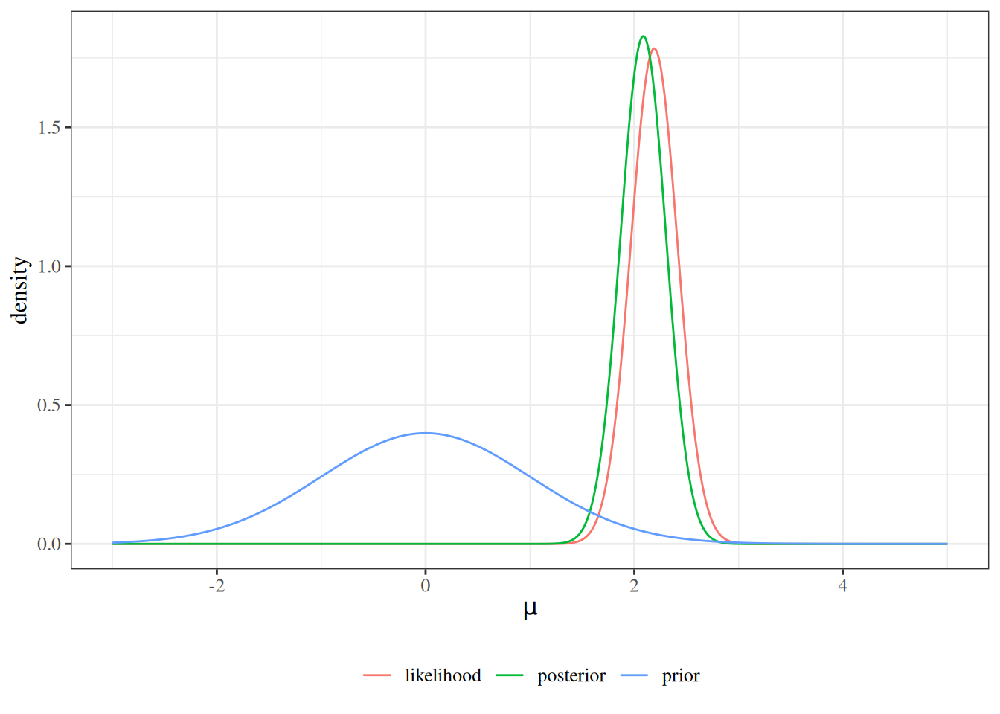

# Bayesian Inference

Code

Published

Last modified: 2026-09-28 17:49:41 (PDT)

This page introduces the Bayesian approach to statistical inference: it contrasts the frequentist and Bayesian paradigms, states Bayes’ theorem as a rule for updating beliefs about parameters, discusses how to choose a prior, and outlines hierarchical models ([Dobson and Barnett 2018, chap. 12](#ref-dobson4e)).

## 1 Frequentist and Bayesian paradigms

The [estimation](estimation.llms.md) and [inference](inference.llms.md) pages take the frequentist view of parameters.

> **NOTE:**
>
> **Definition 1 (Frequentist paradigm)** In the **frequentist** paradigm of statistical inference, an unknown parameter \\\theta\\ is a fixed constant, probability describes long-run frequencies over repetitions of the data-generating process, and uncertainty about \\\theta\\ is quantified by the sampling distribution of an estimator \\\hat\theta\\.

> **NOTE:**
>
> **Definition 2 (Bayesian paradigm)** In the **Bayesian** paradigm of statistical inference, an unknown parameter \\\theta\\ is a random variable with its own probability distribution, and probability measures degree of belief ([Dobson and Barnett 2018, chap. 12](#ref-dobson4e), p. 272).

> **NOTE:**
>
> **Example 1 (Two views of a success probability)** Suppose 55 of 91 independent trials succeed. A frequentist treats the success probability \\\pi\\ as a fixed number, estimates it by \\\hat\pi = 55/91 \approx 0.60\\, and describes uncertainty by how much \\\hat\pi\\ would vary over repeated sets of 91 trials, for example with a confidence interval. A Bayesian gives \\\pi\\ a probability distribution before seeing the trials, such as the uniform distribution on \\(0, 1)\\, and describes uncertainty by the distribution of \\\pi\\ given the 55 successes.

> **NOTE:**
>
> **Definition 3 (Prior distribution)** The **prior distribution** of a parameter \\\theta\\, with density or probability mass function \\\operatorname{p}(\theta)\\, is the probability distribution that describes what is believed about \\\theta\\ before the data are observed.

> **NOTE:**
>
> **Example 2 (A uniform prior for a probability)** Let \\\pi\\ be the probability that a randomly chosen adult in some population smokes. Before collecting any data, an analyst who considers every value of \\\pi\\ in \\(0, 1)\\ equally plausible could use the uniform prior
>
> \\\operatorname{p}(\pi) = 1, \quad 0 \< \pi \< 1.\\
>
> Under this prior, the prior probability that fewer than 10% of adults smoke is \\\Pr(\pi \< 0.1) = \int_0^{0.1} 1 \\ d\pi = 0.1\\.

The two paradigms answer different questions. A frequentist asks, “for which parameter values would these data be unsurprising?”; a Bayesian asks, “given these data, what should I now believe about the parameter?”. Neither question is wrong, and they call for different machinery.

## 2 Bayes’ theorem for parameters

> **NOTE:**
>
> **Definition 4 (Posterior distribution)** The **posterior distribution** of a parameter \\\theta\\, given observed data \\\tilde{Y}= \tilde{y}\\, is the [conditional distribution](https://morrison-lab.github.io/rme/chapters/probability.html#def-cond-pdf) of \\\theta\\ given \\\tilde{Y}= \tilde{y}\\. Its density or probability mass function is written \\\operatorname{p}(\theta \mid \tilde{y})\\.

> **NOTE:**
>
> **Example 3 (Posterior probability that a coin is biased)** A coin is either fair (\\\theta = 0.5\\) or biased toward heads (\\\theta = 0.8\\), where \\\theta\\ is its probability of heads, with prior probabilities \\\operatorname{p}(0.5) = 0.9\\ and \\\operatorname{p}(0.8) = 0.1\\. After three tosses that all land heads, the posterior distribution of \\\theta\\ is its conditional distribution given those tosses. Its probabilities are computed in [Example 4](#exm-marginal-likelihood).

> **NOTE:**
>
> **Definition 5 (Marginal likelihood)** Given a prior \\\operatorname{p}(\theta)\\ and a model \\\operatorname{p}(\tilde{y}\mid \theta)\\ for the data given \\\theta\\, the **marginal likelihood** (also called the **evidence**) of observed data \\\tilde{y}\\ is
>
> \\ \operatorname{p}(\tilde{y}) \stackrel{\text{def}}{=}\int \operatorname{p}(\tilde{y}\mid \theta)\\ \operatorname{p}(\theta)\\ d\theta, \\
>
> with the integral replaced by a sum over the possible values of \\\theta\\ when \\\theta\\ is discrete.

> **NOTE:**
>
> **Theorem 1 (Bayes’ theorem for parameters)** If \\\operatorname{p}(\tilde{y}) \> 0\\, then
>
> \\ \operatorname{p}(\theta \mid \tilde{y}) = \frac{\operatorname{p}(\tilde{y}\mid \theta)\\ \operatorname{p}(\theta)}{\operatorname{p}(\tilde{y})}. \tag{1}\\

> **NOTE:**
>
> *Proof*. By the definition of a conditional density, \\\operatorname{p}(\theta \mid \tilde{y}) = \operatorname{p}(\theta, \tilde{y}) / \operatorname{p}(\tilde{y})\\ and \\\operatorname{p}(\theta, \tilde{y}) = \operatorname{p}(\tilde{y}\mid \theta)\\ \operatorname{p}(\theta)\\, where \\\operatorname{p}(\tilde{y})\\ is the marginal density of \\\tilde{Y}\\ at \\\tilde{y}\\. That marginal density is
>
> \\ \begin{aligned} \operatorname{p}(\tilde{y}) &= \int \operatorname{p}(\theta, \tilde{y})\\ d\theta && \text{(marginalizing over \$\theta\$)}\\ &= \int \operatorname{p}(\tilde{y}\mid \theta)\\ \operatorname{p}(\theta)\\ d\theta && \text{(substituting the factorization of \$\operatorname{p}(\theta, \tilde{y})\$)}, \end{aligned} \\
>
> which is the [marginal likelihood](#def-marginal-likelihood). Substituting the factorization into the numerator of \\\operatorname{p}(\theta, \tilde{y}) / \operatorname{p}(\tilde{y})\\ gives [Equation 1](#eq-bayes-posterior).

> **NOTE:**
>
> **Example 4 (Posterior probability that a coin is biased, computed)** Continuing [Example 3](#exm-posterior), let \\\tilde{y}\\ be the three heads, so \\\operatorname{p}(\tilde{y}\mid \theta) = \theta^3\\. The [marginal likelihood](#def-marginal-likelihood) sums over the two possible values of \\\theta\\:
>
> \\ \begin{aligned} \operatorname{p}(\tilde{y}) &= \operatorname{p}(\tilde{y}\mid 0.5)\\ \operatorname{p}(0.5) + \operatorname{p}(\tilde{y}\mid 0.8)\\ \operatorname{p}(0.8)\\ &= 0.5^3 \cdot 0.9 + 0.8^3 \cdot 0.1\\ &= 0.1125 + 0.0512\\ &= 0.1637. \end{aligned} \\
>
> By [Theorem 1](#thm-bayes-posterior),
>
> \\ \operatorname{p}(0.8 \mid \tilde{y}) = \frac{\operatorname{p}(\tilde{y}\mid 0.8)\\ \operatorname{p}(0.8)}{\operatorname{p}(\tilde{y})} = \frac{0.0512}{0.1637} \approx 0.313, \\
>
> and \\\operatorname{p}(0.5 \mid \tilde{y}) = 0.1125 / 0.1637 \approx 0.687\\. Three heads in a row raise the probability that the coin is biased from \\0.1\\ to about \\0.31\\.

> **NOTE:**
>
> **Corollary 1 (The posterior is proportional to likelihood times prior)** As a function of \\\theta\\, with the data \\\tilde{y}\\ held fixed,
>
> \\ \underbrace{\operatorname{p}(\theta \mid \tilde{y})}\_{\text{posterior}} \\\propto\\ \underbrace{\operatorname{p}(\tilde{y}\mid \theta)}\_{\text{likelihood}} \cdot \underbrace{\operatorname{p}(\theta)}\_{\text{prior}}. \tag{2}\\

> **NOTE:**
>
> *Proof*. In [Equation 1](#eq-bayes-posterior), the denominator \\\operatorname{p}(\tilde{y})\\ does not depend on \\\theta\\.

[Theorem 1](#thm-bayes-posterior) is [Bayes’ theorem](https://morrison-lab.github.io/rme/chapters/probability.html#thm-bayes) for events, restated for densities. Here \\\operatorname{p}(\tilde{y}\mid \theta)\\, viewed as a function of \\\theta\\, is the [likelihood](intro-MLEs.llms.md#def-lik) \\\mathcal{L}(\theta)\\. [Corollary 1](#cor-bayes-proportional) is the workhorse of applied Bayesian analysis: it identifies the posterior from the shape of likelihood times prior, without computing the integral \\\operatorname{p}(\tilde{y})\\, and it is what makes the simulation methods of Markov chain Monte Carlo possible ([Dobson and Barnett 2018, chap. 12](#ref-dobson4e), p. 272).

### 2.1 A Gaussian mean with a Gaussian prior

> **NOTE:**
>
> **Example 5 (Posterior for a Gaussian mean)** Suppose that, given the mean \\\mu\\, \\X_1, \ldots, X_n \\ \sim\_{\operatorname{iid}}\\ \operatorname{N}\mathopen{}\left(\mu, 1\right)\mathclose{}\\, so the variance is known, and that the prior for \\\mu\\ is \\\operatorname{N}\mathopen{}\left(0, 1\right)\mathclose{}\\. Let \\\tilde{x}= (x_1, \ldots, x_n)\\ be the observed data, with sample mean \\\bar x\\.
>
> The likelihood is
>
> \\ \begin{aligned} \operatorname{p}(\tilde{x}\mid \mu) &= \prod\_{i=1}^n (2\pi)^{-1/2} \operatorname{exp}\mathopen{}\left\\-\frac{1}{2}(x_i - \mu)^2\right\\\mathclose{} && \text{(independent Gaussian observations)}\\ &= (2\pi)^{-n/2} \operatorname{exp}\mathopen{}\left\\-\frac{1}{2}\sum\_{i=1}^n (x_i - \mu)^2\right\\\mathclose{} && \text{(combining the exponents)}\\ &= (2\pi)^{-n/2} \operatorname{exp}\mathopen{}\left\\-\frac{1}{2}\mathopen{}\left(\sum\_{i=1}^n x_i^2 - 2 \mu n \bar x + n \mu^2\right)\mathclose{}\right\\\mathclose{} && \text{(expanding the square; \$\sum_i x_i = n \bar x\$)}\\ &\propto \operatorname{exp}\mathopen{}\left\\-\frac{1}{2}\mathopen{}\left(n \mu^2 - 2 \mu n \bar x\right)\mathclose{}\right\\\mathclose{} && \text{(dropping factors that do not involve \$\mu\$)}, \end{aligned} \\
>
> and the prior density is \\\operatorname{p}(\mu) \propto \operatorname{exp}\mathopen{}\left\\-\frac{1}{2}\mu^2\right\\\mathclose{}\\. Let \\m \stackrel{\text{def}}{=}\frac{n}{n+1} \bar x\\. By [Corollary 1](#cor-bayes-proportional),
>
> \\ \begin{aligned} \operatorname{p}(\mu \mid \tilde{x}) &\propto \operatorname{p}(\tilde{x}\mid \mu)\\ \operatorname{p}(\mu) && \text{(posterior is proportional to likelihood times prior)}\\ &\propto \operatorname{exp}\mathopen{}\left\\-\frac{1}{2}\mathopen{}\left(n \mu^2 - 2 \mu n \bar x\right)\mathclose{}\right\\\mathclose{} \cdot \operatorname{exp}\mathopen{}\left\\-\frac{1}{2}\mu^2\right\\\mathclose{} && \text{(substituting likelihood and prior)}\\ &= \operatorname{exp}\mathopen{}\left\\-\frac{1}{2}\mathopen{}\left((n+1)\mu^2 - 2 \mu n \bar x\right)\mathclose{}\right\\\mathclose{} && \text{(adding exponents)}\\ &= \operatorname{exp}\mathopen{}\left\\-\frac{1}{2}(n+1)\mathopen{}\left(\mu^2 - 2 \mu m\right)\mathclose{}\right\\\mathclose{} && \text{(factoring out \$n+1\$; definition of \$m\$)}\\ &= \operatorname{exp}\mathopen{}\left\\-\frac{1}{2}(n+1)\mathopen{}\left((\mu - m)^2 - m^2\right)\mathclose{}\right\\\mathclose{} && \text{(completing the square)}\\ &\propto \operatorname{exp}\mathopen{}\left\\-\frac{1}{2}(n+1)(\mu - m)^2\right\\\mathclose{} && \text{(dropping the factor \$\operatorname{exp}\mathopen{}\left\\\tfrac{1}{2}(n+1)m^2\right\\\mathclose{}\$)}. \end{aligned} \\
>
> The last line is, up to a constant, the density of a Gaussian distribution with mean \\m\\ and variance \\1/(n+1)\\, so the posterior is
>
> \\ \mu \mid \tilde{x}\\\sim\\ \operatorname{N}\mathopen{}\left(\frac{n}{n+1}\bar{x},\\ \frac{1}{n+1}\right)\mathclose{}. \\
>
> The posterior mean \\\frac{n}{n+1}\bar{x}\\ is the sample mean shrunk toward the prior mean \\0\\, and the shrinkage factor \\\frac{n}{n+1}\\ approaches \\1\\ as \\n \to \infty\\.

### 2.2 Two readings of an interval estimate

The two paradigms differ most visibly in how they interpret an interval estimate ([Dobson and Barnett 2018, chap. 12](#ref-dobson4e), p. 272). A frequentist 95% [confidence interval](inference.llms.md#def-confidence-interval) is a random interval whose coverage probability, over repeated samples with \\\theta\\ held fixed, is 0.95. Any one realized interval either contains \\\theta\\ or does not; the 0.95 describes the procedure, not that interval. A Bayesian interval estimate instead makes a probability statement about \\\theta\\ itself, given the data actually observed.

> **NOTE:**
>
> **Definition 6 (Credible interval)** A \\100(1-\alpha)\\\\ **credible interval** for a parameter \\\theta\\, given observed data \\\tilde{y}\\, is an interval \\\mathopen{}\left\[l(\tilde{y}),\\ r(\tilde{y})\right\]\mathclose{}\\ whose [posterior](#def-posterior) probability is \\1 - \alpha\\:
>
> \\ \Pr\mathopen{}\left(l(\tilde{y}) \le \theta \le r(\tilde{y}) \mid \tilde{Y}= \tilde{y}\right)\mathclose{} = 1 - \alpha. \\

In a credible interval, the data are fixed at their observed values and \\\theta\\ is random, so the probability statement is about \\\theta\\ directly. Many intervals have posterior probability \\1 - \alpha\\; the usual choice, and the one used on this page, is the equal-tailed interval.

> **NOTE:**
>
> **Definition 7 (Equal-tailed credible interval)** The \\100(1-\alpha)\\\\ **equal-tailed credible interval** for \\\theta\\ runs from the \\\alpha/2\\ quantile to the \\1 - \alpha/2\\ quantile of the posterior distribution of \\\theta\\.

> **NOTE:**
>
> **Example 6 (Equal-tailed interval for a Gaussian posterior)** In [Example 5](#exm-normal-normal), the posterior of \\\mu\\ is Gaussian with mean \\\frac{n}{n+1}\bar x\\ and standard deviation \\1/\sqrt{n+1}\\, so the 95% equal-tailed credible interval is \\\frac{n}{n+1}\bar x \pm 1.96/\sqrt{n+1}\\. With \\n = 20\\, the interval’s half-width is \\1.96/\sqrt{21} \approx 0.43\\.

> **NOTE:**
>
> **Example 7 (Credible and confidence intervals for a Gaussian mean)** We simulate \\n = 20\\ observations from the model of [Example 5](#exm-normal-normal), with true mean \\\mu = 2\\, and compute both a 95% confidence interval, \\\bar x \pm 1.96 / \sqrt{n}\\ (the variance is known to be 1), and the equal-tailed 95% credible interval from the \\\operatorname{N}\mathopen{}\left(\frac{n}{n+1}\bar{x},\\ \frac{1}{n+1}\right)\mathclose{}\\ posterior:
>
> ``` downlit
> set.seed(1)
> mu_true <- 2
> n <- 20
> x <- rnorm(n = n, mean = mu_true, sd = 1)
> xbar <- mean(x)
> ci_freq <- xbar + stats::qnorm(c(0.025, 0.975)) / sqrt(n)
> post_mean <- n / (n + 1) * xbar
> post_sd <- sqrt(1 / (n + 1))
> ci_bayes <- stats::qnorm(c(0.025, 0.975), mean = post_mean, sd = post_sd)
> rbind(confidence = ci_freq, credible = ci_bayes) |>
>   round(3) |>
>   `colnames<-`(c("lower", "upper"))
> #>            lower upper
> #> confidence 1.752 2.629
> #> credible   1.659 2.514
> ```
>
> The sample mean is \\\bar x = 2.191\\. The credible interval is slightly narrower than the confidence interval, because the prior adds information, and shifted toward the prior mean \\0\\.
>
> [Figure 1](#fig-normal-prior-lik-post) shows how the posterior combines prior and data. Completing the square in the likelihood of [Example 5](#exm-normal-normal) as a function of \\\mu\\ alone shows that the likelihood is proportional to a \\\operatorname{N}\mathopen{}\left(\bar x, 1/n\right)\mathclose{}\\ density, which is the curve drawn for it.
>
> Code
>
> ``` downlit
> mu_grid <- seq(-3, 5, length.out = 801)
> curves <- tibble::tibble(
>   mu = rep(mu_grid, times = 3),
>   curve = rep(c("prior", "likelihood", "posterior"), each = length(mu_grid)),
>   density = c(
>     stats::dnorm(mu_grid, mean = 0, sd = 1),
>     stats::dnorm(mu_grid, mean = xbar, sd = 1 / sqrt(n)),
>     stats::dnorm(mu_grid, mean = post_mean, sd = post_sd)
>   )
> )
> ggplot2::ggplot(curves) +
>   ggplot2::aes(x = mu, y = density, colour = curve) +
>   ggplot2::geom_line() +
>   ggplot2::labs(x = expression(mu), y = "density", colour = NULL)
> ```
>
> [](bayesian-inference_files/figure-html/unnamed-chunk-1-1.png "Figure 1: The \operatorname{N}\mathopen{}\left(0, 1\right)\mathclose{} prior, the likelihood (scaled to integrate to 1), and the posterior for the mean \mu, for the data of Example 7.")
>
> Figure 1: The \\\operatorname{N}\mathopen{}\left(0, 1\right)\mathclose{}\\ prior, the likelihood (scaled to integrate to 1), and the posterior for the mean \\\mu\\, for the data of [Example 7](#exm-normal-credible-vs-confidence).
>
> Because \\\mu\\ has a distribution, the Bayesian can also compute the posterior probability that \\\mu\\ lies in the realized *confidence* interval:
>
> ``` downlit
> pr_in_ci <- stats::pnorm(ci_freq, mean = post_mean, sd = post_sd) |> diff()
> round(pr_in_ci, 3)
> #> [1] 0.931
> ```
>
> That probability is 0.931, not 0.95: under this prior, the confidence interval sits slightly too far from \\0\\. A frequentist cannot assign any probability to the event that \\\mu\\ lies in one realized interval, since both are fixed.

### 2.3 The parameter space

> **NOTE:**
>
> **Definition 8 (Parameter space)** The **parameter space** \\\Theta\\ of a model is the set of values that its parameter \\\theta\\ can take.

Because the Bayesian treats \\\theta\\ as random, the prior and posterior are distributions over the parameter space ([Dobson and Barnett 2018, chap. 12](#ref-dobson4e), p. 273), and the prior has to respect it.

> **NOTE:**
>
> **Example 8 (Parameter spaces and priors that respect them)**  
>
> - A probability \\\pi\\ has parameter space \\(0, 1)\\, so its prior should be a distribution on the unit interval, such as the uniform prior of [Example 2](#exm-prior).
> - A variance \\\sigma^2\\ has parameter space \\(0, \infty)\\, so its prior should be a distribution on the positive half-line.
> - A vector of \\p\\ regression coefficients has parameter space \\\mathbb{R}^p\\, so its prior should be a distribution on \\\mathbb{R}^p\\.

> **NOTE:**
>
> **Corollary 2 (The posterior cannot put probability where the prior puts none)** If \\\operatorname{p}(\theta) = 0\\ for every \\\theta\\ in a set \\A \subset \Theta\\, then \\\operatorname{p}(\theta \mid \tilde{y}) = 0\\ for every \\\theta \in A\\, whatever the data \\\tilde{y}\\.

> **NOTE:**
>
> *Proof*. For \\\theta \in A\\, the numerator of [Equation 1](#eq-bayes-posterior) is \\\operatorname{p}(\tilde{y}\mid \theta) \cdot 0 = 0\\.

> **NOTE:**
>
> **Example 9 (A prior that rules out the truth)** An analyst sure that fewer than half of adults smoke might put a uniform prior on \\(0, 0.5)\\ for the smoking probability \\\pi\\. By [Corollary 2](#cor-prior-support), the posterior then gives probability 0 to \\\pi \> 0.5\\, even if 90 of 100 sampled adults smoke. The support of the prior is itself a modeling assumption, and one that no amount of data can correct.

## 3 Priors

The [prior](#def-prior) encodes what is known about \\\theta\\ before the current data are seen. Choosing it is the step that most distinguishes Bayesian practice from frequentist practice, and it is where most of the controversy and most of the craft lie ([Dobson and Barnett 2018, chap. 12](#ref-dobson4e), p. 276).

### 3.1 Conjugate priors

> **NOTE:**
>
> **Definition 9 (Conjugate prior)** A family of prior distributions is **conjugate** to a likelihood if, for every prior in the family and every possible data set, the [posterior](#def-posterior) is also in the family.

A conjugate prior gives the posterior in closed form: updating the prior only changes the family’s parameters. In [Example 5](#exm-normal-normal), a Gaussian prior for a Gaussian mean gave a Gaussian posterior.

> **NOTE:**
>
> **Example 10 (Beta-Bernoulli updating)** Let \\Y_1, \ldots, Y_n \\ \sim\_{\operatorname{iid}}\\ \operatorname{Bernoulli}(\pi)\\ given \\\pi\\, with \\r = \sum\_{i=1}^n y_i\\ successes, and let the prior for \\\pi\\ be a \\\operatorname{Beta}(a, b)\\ distribution, whose density is proportional to \\\pi^{a-1}(1-\pi)^{b-1}\\ on \\(0, 1)\\. The likelihood is
>
> \\ \begin{aligned} \operatorname{p}(\tilde{y}\mid \pi) &= \prod\_{i=1}^n \pi^{y_i}(1-\pi)^{1-y_i} && \text{(independent Bernoulli observations)}\\ &= \pi^{\sum_i y_i}(1-\pi)^{n - \sum_i y_i} && \text{(adding exponents)}\\ &= \pi^{r}(1-\pi)^{n-r} && \text{(definition of \$r\$)}. \end{aligned} \\
>
> By [Corollary 1](#cor-bayes-proportional),
>
> \\ \begin{aligned} \operatorname{p}(\pi \mid \tilde{y}) &\propto \pi^{r}(1-\pi)^{n-r} \cdot \pi^{a-1}(1-\pi)^{b-1} && \text{(likelihood times prior)}\\ &= \pi^{a + r - 1}(1-\pi)^{b + n - r - 1} && \text{(adding exponents)}, \end{aligned} \\
>
> which is proportional to the \\\operatorname{Beta}(a + r,\\ b + n - r)\\ density. So the Beta family is conjugate to the Bernoulli likelihood. The prior parameters \\a\\ and \\b\\ act as *pseudo-counts* of prior successes and failures: the posterior adds the \\r\\ observed successes and \\n - r\\ observed failures to them.
>
> The uniform prior of [Example 2](#exm-prior) is \\\operatorname{Beta}(1, 1)\\. With that prior and \\r = 55\\ successes in \\n = 91\\ trials, the posterior is \\\operatorname{Beta}(56, 37)\\, with this mean and equal-tailed 95% [credible interval](#def-credible-interval):
>
> ``` downlit
> a_post <- 1 + 55
> b_post <- 1 + 91 - 55
> c(
>   mean = a_post / (a_post + b_post),
>   lower = stats::qbeta(0.025, a_post, b_post),
>   upper = stats::qbeta(0.975, a_post, b_post)
> ) |>
>   round(3)
> #>  mean lower upper 
> #> 0.602 0.501 0.699
> ```
>
> The mean uses the \\\operatorname{Beta}(a, b)\\ mean \\a / (a + b)\\ ([Casella and Berger 2002, sec. 3.3](#ref-CaseBerg01), p. 107).

### 3.2 Informative, weakly informative, and flat priors

Priors range along a spectrum of how strongly they constrain \\\theta\\ ([Dobson and Barnett 2018, chap. 12](#ref-dobson4e), p. 276).

> **NOTE:**
>
> **Definition 10 (Informative prior)** An **informative prior** is a [prior](#def-prior) that concentrates its probability in a region of the parameter space singled out by knowledge from outside the current data, such as previous studies, biological limits, or expert judgment.

An informative prior pulls the posterior toward its region, most strongly when the data are sparse.

> **NOTE:**
>
> **Definition 11 (Weakly informative prior)** A **weakly informative prior** is a [prior](#def-prior) that gives little probability to implausible values of \\\theta\\, while spreading its probability nearly evenly across the range of scientifically plausible values.

> **NOTE:**
>
> **Definition 12 (Flat prior)** A **flat prior**, also called a **uniform** or **noninformative** prior, is a [prior](#def-prior) whose density is constant on the parameter space: \\\operatorname{p}(\theta) \propto 1\\ for \\\theta \in \Theta\\.

> **NOTE:**
>
> **Definition 13 (Improper prior)** An **improper prior** is a nonnegative function \\\operatorname{p}(\theta)\\, used in place of a prior density, whose integral over the parameter space is infinite, so that it is not a probability density.

> **NOTE:**
>
> **Example 11 (Three priors for a log odds ratio)** Let \\\beta\\ be the log odds ratio of disease for exposed versus unexposed people, so the odds ratio is \\e^\beta\\, and \\\beta\\ can be any real number.
>
> - [Informative](#def-informative-prior): a previous study estimated the odds ratio as 1.5, with a standard error of 0.2 for its logarithm, so an analyst adopts the prior \\\beta \sim \operatorname{N}\mathopen{}\left(\log 1.5,\\ 0.2^2\right)\mathclose{}\\.
> - [Weakly informative](#def-weakly-informative-prior): an analyst with no previous study, who nonetheless regards odds ratios above 100 as implausible, adopts \\\beta \sim \operatorname{N}\mathopen{}\left(0,\\ 2.5^2\right)\mathclose{}\\.
> - [Flat](#def-flat-prior): \\\operatorname{p}(\beta) \propto 1\\ on the whole real line. This prior is [improper](#def-improper-prior), since \\\int\_{-\infty}^{\infty} 1 \\ d\beta = \infty\\; it gives an odds ratio of \\10^6\\ the same density as an odds ratio of \\1\\.
>
> The two proper priors’ probabilities for large odds ratios:
>
> ``` downlit
> or_cutoffs <- c(10, 100, 1e6)
> rbind(
>   informative = stats::pnorm(log(or_cutoffs), log(1.5), 0.2,
>     lower.tail = FALSE
>   ),
>   weakly_informative = stats::pnorm(log(or_cutoffs), 0, 2.5,
>     lower.tail = FALSE
>   )
> ) |>
>   signif(2) |>
>   `colnames<-`(c("Pr(OR > 10)", "Pr(OR > 100)", "Pr(OR > 1e6)"))
> #>                    Pr(OR > 10) Pr(OR > 100) Pr(OR > 1e6)
> #> informative            1.2e-21      3.4e-98      0.0e+00
> #> weakly_informative     1.8e-01      3.3e-02      1.6e-08
> ```
>
> The informative prior all but rules out an odds ratio of 10; the weakly informative prior leaves a few percent of its probability above 100, and effectively none above \\10^6\\.

> **NOTE:**
>
> **Example 12 (A flat prior on a probability is not flat on its log-odds)** A [flat prior](#def-flat-prior) is flat only on the scale on which it is stated. Let \\\pi\\ have the uniform prior of [Example 2](#exm-prior), and let \\\eta \stackrel{\text{def}}{=}\operatorname{logit}(\pi)\\ be its log-odds, so that \\\pi = \operatorname{expit}(\eta) = 1 / (1 + e^{-\eta})\\. The derivative of \\\operatorname{expit}\\ is
>
> \\ \begin{aligned} \frac{d}{d\eta} \operatorname{expit}(\eta) &= \frac{d}{d\eta} (1 + e^{-\eta})^{-1}\\ &= -(1 + e^{-\eta})^{-2} \cdot (-e^{-\eta}) && \text{(chain rule)}\\ &= \frac{1}{1 + e^{-\eta}} \cdot \frac{e^{-\eta}}{1 + e^{-\eta}} && \text{(splitting the fraction)}\\ &= \operatorname{expit}(\eta)\\ \mathopen{}\left(1 - \operatorname{expit}(\eta)\right)\mathclose{} && \text{(\$\tfrac{e^{-\eta}}{1 + e^{-\eta}} = 1 - \tfrac{1}{1 + e^{-\eta}}\$)}. \end{aligned} \\
>
> By the change-of-variables formula for densities ([Casella and Berger 2002](#ref-CaseBerg01), Theorem 2.1.5), the prior density of \\\eta\\ is
>
> \\ \begin{aligned} \operatorname{p}\_\eta(\eta) &= \operatorname{p}\_\pi\mathopen{}\left(\operatorname{expit}(\eta)\right)\mathclose{} \cdot \mathopen{}\left\|\frac{d}{d\eta} \operatorname{expit}(\eta)\right\|\mathclose{} && \text{(change of variables)}\\ &= 1 \cdot \operatorname{expit}(\eta)\\ \mathopen{}\left(1 - \operatorname{expit}(\eta)\right)\mathclose{} && \text{(uniform density of \$\pi\$; derivative of \$\operatorname{expit}\$)}, \end{aligned} \\
>
> the standard logistic density, which peaks at \\\eta = 0\\ and decays in both directions. Under this prior, \\\Pr(-1 \< \eta \< 1) = \operatorname{expit}(1) - \operatorname{expit}(-1) \approx 0.46\\, whereas a flat prior on \\\eta\\ would make every interval of length 2 equally likely. “Noninformative” therefore depends on the parameterization.

> **NOTE:**
>
> **Corollary 3 (Under a flat prior, the posterior is proportional to the likelihood)** If the prior is [flat](#def-flat-prior) on a parameter space \\\Theta\\ of finite length (or volume), then, as a function of \\\theta \in \Theta\\,
>
> \\ \operatorname{p}(\theta \mid \tilde{y}) \propto \mathcal{L}(\theta), \\
>
> where \\\mathcal{L}\\ is the [likelihood](intro-MLEs.llms.md#def-lik), and any value of \\\theta\\ that maximizes the posterior density is a [maximum likelihood estimate](intro-MLEs.llms.md#def-mle).

> **NOTE:**
>
> *Proof*. By [Corollary 1](#cor-bayes-proportional), \\\operatorname{p}(\theta \mid \tilde{y}) \propto \mathcal{L}(\theta)\\ \operatorname{p}(\theta)\\, and \\\operatorname{p}(\theta)\\ is the same constant for every \\\theta \in \Theta\\. Multiplying a function by a positive constant does not change where it is maximized.

A flat prior on an unbounded parameter space, such as \\\mathbb{R}\\, is [improper](#def-improper-prior), so it does not define a joint distribution of \\\theta\\ and \\\tilde{Y}\\, and [Definition 4](#def-posterior) does not apply directly. In practice the posterior is then *defined* as likelihood times prior, normalized to integrate to 1, which is possible only when that product has a finite integral; the posterior is again proportional to the likelihood.

> **NOTE:**
>
> **Example 13 (Posterior mode and maximum likelihood estimate for a probability)** In [Example 10](#exm-beta-bernoulli) the prior is uniform on \\(0, 1)\\, so by [Corollary 3](#cor-flat-prior-posterior) the posterior density, proportional to \\\pi^{55}(1-\pi)^{36}\\, is maximized at the maximum likelihood estimate. Setting the derivative of the log-likelihood \\r \log \pi + (n - r)\log(1 - \pi)\\, which is \\r/\pi - (n - r)/(1 - \pi)\\, to zero gives \\\hat\pi = r/n = 55/91 \approx 0.604\\. The posterior *mean*, \\56/93 \approx 0.602\\, is not the maximum likelihood estimate: [Corollary 3](#cor-flat-prior-posterior) concerns the posterior’s shape, and so its mode, but a mean depends on the whole distribution.

### 3.3 A skeptical prior

> **NOTE:**
>
> **Definition 14 (Skeptical prior)** A **skeptical prior** is an [informative prior](#def-informative-prior) centered on the parameter value that represents no effect, and concentrated near that value ([Dobson and Barnett 2018, chap. 12](#ref-dobson4e), p. 277).

A skeptical prior asks how strong the data must be to overturn a default of no effect.

> **NOTE:**
>
> **Example 14 (A skeptical prior for a Gaussian mean)** In the model of [Example 5](#exm-normal-normal), replace the \\\operatorname{N}\mathopen{}\left(0, 1\right)\mathclose{}\\ prior by the [skeptical prior](#def-skeptical-prior) \\\mu \sim \operatorname{N}\mathopen{}\left(0, \tau^2\right)\mathclose{}\\, whose standard deviation \\\tau\\ sets how skeptical it is. Its density is proportional to \\\operatorname{exp}\mathopen{}\left\\-\frac{1}{2}\mu^2/\tau^2\right\\\mathclose{}\\. Let \\m\_\tau \stackrel{\text{def}}{=}\frac{n \bar x}{n + 1/\tau^2}\\. Reusing the likelihood from [Example 5](#exm-normal-normal):
>
> \\ \begin{aligned} \operatorname{p}(\mu \mid \tilde{x}) &\propto \operatorname{exp}\mathopen{}\left\\-\frac{1}{2}\mathopen{}\left(n \mu^2 - 2 \mu n \bar x\right)\mathclose{}\right\\\mathclose{} \cdot \operatorname{exp}\mathopen{}\left\\-\frac{1}{2}\frac{\mu^2}{\tau^2}\right\\\mathclose{} && \text{(likelihood times prior)}\\ &= \operatorname{exp}\mathopen{}\left\\-\frac{1}{2}\mathopen{}\left(\mathopen{}\left(n + \frac{1}{\tau^2}\right)\mathclose{}\mu^2 - 2 \mu n \bar x\right)\mathclose{}\right\\\mathclose{} && \text{(adding exponents)}\\ &= \operatorname{exp}\mathopen{}\left\\-\frac{1}{2}\mathopen{}\left(n + \frac{1}{\tau^2}\right)\mathclose{}\mathopen{}\left(\mu^2 - 2 \mu m\_\tau\right)\mathclose{}\right\\\mathclose{} && \text{(factoring; definition of \$m\_\tau\$)}\\ &= \operatorname{exp}\mathopen{}\left\\-\frac{1}{2}\mathopen{}\left(n + \frac{1}{\tau^2}\right)\mathclose{}\mathopen{}\left((\mu - m\_\tau)^2 - m\_\tau^2\right)\mathclose{}\right\\\mathclose{} && \text{(completing the square)}\\ &\propto \operatorname{exp}\mathopen{}\left\\-\frac{1}{2}\mathopen{}\left(n + \frac{1}{\tau^2}\right)\mathclose{}(\mu - m\_\tau)^2\right\\\mathclose{} && \text{(dropping a factor that does not involve \$\mu\$)}. \end{aligned} \\
>
> So \\\mu \mid \tilde{x}\sim \operatorname{N}\mathopen{}\left(m\_\tau,\\ 1 / (n + 1/\tau^2)\right)\mathclose{}\\, and \\\tau = 1\\ recovers [Example 5](#exm-normal-normal). The posterior mean
>
> \\ m\_\tau = \frac{n \cdot \bar x + \frac{1}{\tau^2} \cdot 0}{n + \frac{1}{\tau^2}} \\
>
> is a weighted average of the sample mean and the prior mean \\0\\, weighted by the precision \\n\\ of the data and the precision \\1/\tau^2\\ of the prior (a precision is a reciprocal variance). The more skeptical the prior (the smaller \\\tau\\), the more the posterior mean shrinks toward \\0\\. With \\\bar x = 2\\ and \\n = 20\\ held fixed:
>
> ``` downlit
> xbar <- 2
> n <- 20
> tau <- c(0.1, 0.25, 0.5, 1, 2, 10)
> data.frame(prior_sd = tau, posterior_mean = n * xbar / (n + 1 / tau^2)) |>
>   round(3)
> ```
>
> The most skeptical prior (\\\tau = 0.1\\) pulls the posterior mean down to one sixth of the sample mean, while the most diffuse (\\\tau = 10\\) leaves it essentially at \\\bar x\\.

## 4 Distributions and hierarchies

> **NOTE:**
>
> **Definition 15 (Hierarchical model)** A **hierarchical model**, also called a **multilevel model**, is a model in which the data depend on group-level parameters, and the group-level parameters are themselves random, with a distribution that depends on further unknown parameters ([Dobson and Barnett 2018, chap. 12](#ref-dobson4e), p. 281).

A hierarchical model is a model structure, not an inference method: it can be fit by maximum likelihood or by Bayesian inference. Bayesian inference also gives the further unknown parameters a prior (a *hyperprior*).

> **NOTE:**
>
> **Definition 16 (Hyperparameter)** In a [hierarchical model](#def-hierarchical-model), a **hyperparameter** is a parameter of the distribution of the group-level parameters.

> **NOTE:**
>
> **Definition 17 (Hyperprior)** In Bayesian inference for a [hierarchical model](#def-hierarchical-model), the **hyperprior** is the prior distribution of the [hyperparameters](#def-hyperparameter).

> **NOTE:**
>
> **Example 15 (A two-level Gaussian model)** Observations \\Y\_{ij}\\ come from groups \\j = 1, \ldots, J\\, and each group has its own mean \\\theta_j\\. A two-level model specifies
>
> \\ \begin{aligned} Y\_{ij} \mid \theta_j &\sim \operatorname{N}\mathopen{}\left(\theta_j,\\ \sigma^2\right)\mathclose{} && \text{(data given group means)}\\ \theta_j \mid \mu, \tau &\sim \operatorname{N}\mathopen{}\left(\mu,\\ \tau^2\right)\mathclose{} && \text{(group means given hyperparameters)}. \end{aligned} \\
>
> The group means \\\theta_j\\ are the group-level parameters, and \\\mu\\ and \\\tau\\ are the [hyperparameters](#def-hyperparameter). To fit this model by Bayesian inference, we add a [hyperprior](#def-hyperprior) for \\(\mu, \tau)\\ and a prior for the within-group standard deviation \\\sigma\\.

The middle level lets the groups *borrow strength* from one another: the posterior for each \\\theta_j\\ is pulled toward the overall mean \\\mu\\, by an amount that depends on the between-group standard deviation \\\tau\\, which the data themselves inform ([Dobson and Barnett 2018, chap. 12](#ref-dobson4e), p. 281). This random-effects *model structure* is the one fit by maximum likelihood in ([Dobson and Barnett 2018, chap. 11](#ref-dobson4e)) and in [an introduction to multilevel models](https://morrison-lab.github.io/rme/chapters/intro-multilevel-models.html). The Bayesian *inference method* differs only in placing a hyperprior on \\\mu\\ and \\\tau\\ and returning a full posterior for them, rather than point estimates of the variance components.

## 5 Further reading

The following resources cover Bayesian inference in more depth.

### 5.1 UC Davis courses

- [STA 015C](https://catalog.ucdavis.edu/search/?q=STA+015C): “Introduction to Statistical Data Science III”
- [STA 035C](https://catalog.ucdavis.edu/search/?q=STA+035C): “Statistical Data Science III”
- [STA 145](https://catalog.ucdavis.edu/search/?q=STA+145): “Bayesian Statistical Inference”
- [ECL 234](https://catalog.ucdavis.edu/search/?q=ECL+234): “Bayesian Models - A Statistical Primer”
- [PLS 207](https://catalog.ucdavis.edu/search/?q=PLS+207): “Applied Statistical Modeling for the Environmental Sciences”
- [PSC 205H](https://catalog.ucdavis.edu/search/?q=PSC+205H): “Applied Bayesian Statistics for Social Scientists”
- [POL 280](https://catalog.ucdavis.edu/search/?q=POL+280): “Bayesian Methods: for Social & Behavioral Sciences”
- [BAX 442](https://catalog.ucdavis.edu/search/?q=BAX+442): “Advanced Statistics”

### 5.2 Books

- Ross ([2022](#ref-rossbayes)), a free online textbook
- Aragon ([2018](#ref-aragon2018population)), on population health thinking with Bayesian networks
- McElreath ([2020](#ref-statrethink2e)), which [ECL 234](https://catalog.ucdavis.edu/search/?q=ECL+234) uses; its author was formerly a UC Davis professor, and has published [video lectures](https://www.youtube.com/playlist?list=PLDcUM9US4XdPz-KxHM4XHt7uUVGWWVSus) and [course materials](https://github.com/rmcelreath/stat_rethinking_2024)
- Korner-Nievergelt and Korner-Nievergelt ([2015](#ref-korner.bayes.ecology))
- Cowles ([2013](#ref-CowlesMaryKathryn2013ABSW))
- Kéry et al. ([2012](#ref-kery-bayes-pop))
- Hobbs and Hooten ([2015](#ref-HobbsN.Thompson2015Bmas)), which has been used in [PLS 207](https://catalog.ucdavis.edu/search/?q=PLS+207)

## References

Aragon, Tomas J. 2018. *Population Health Thinking with Bayesian Networks*. <https://escholarship.org/uc/item/8000r5m5>.

Casella, George, and Roger Berger. 2002. *Statistical Inference*. 2nd ed. Cengage Learning. <https://www.cengage.com/c/statistical-inference-2e-casella-berger/9780534243128/>.

Cowles, Mary Kathryn. 2013. *Applied Bayesian Statistics: With R and OpenBUGS Examples*. Vol. 98. Springer Texts in Statistics. Springer Nature. <https://doi.org/10.1007/978-1-4614-5696-4>.

Dobson, Annette J, and Adrian G Barnett. 2018. *An Introduction to Generalized Linear Models*. 4th ed. CRC press. <https://doi.org/10.1201/9781315182780>.

Hobbs, N. Thompson, and Mevin B Hooten. 2015. *Bayesian Models: A Statistical Primer for Ecologists*. STU - Student edition. Princeton University Press.

Kéry, Marc., Michael. Schaub, and Steven R. Beissinger. 2012. *Bayesian Population Analysis Using WinBUGS : A Hierarchical Perspective*. 1st ed. Academic Press. <https://shop.elsevier.com/books/bayesian-population-analysis-using-winbugs/kery/978-0-12-387020-9>.

Korner-Nievergelt, Fränzi, and Fränzi Korner-Nievergelt. 2015. *Bayesian Data Analysis in Ecology Using Linear Models with R, BUGS, and Stan*. 1st ed. Academic Press.

McElreath, Richard. 2020. *Statistical Rethinking : A Bayesian Course with Examples in R and Stan*. Second edition. Chapman & Hall/CRC Texts in Statistical Science Series. CRC Press.

Ross, Kevin. 2022. *An Introduction to Bayesian Reasoning and Methods*. Online. <https://bookdown.org/kevin_davisross/bayesian-reasoning-and-methods/>.

Back to top
