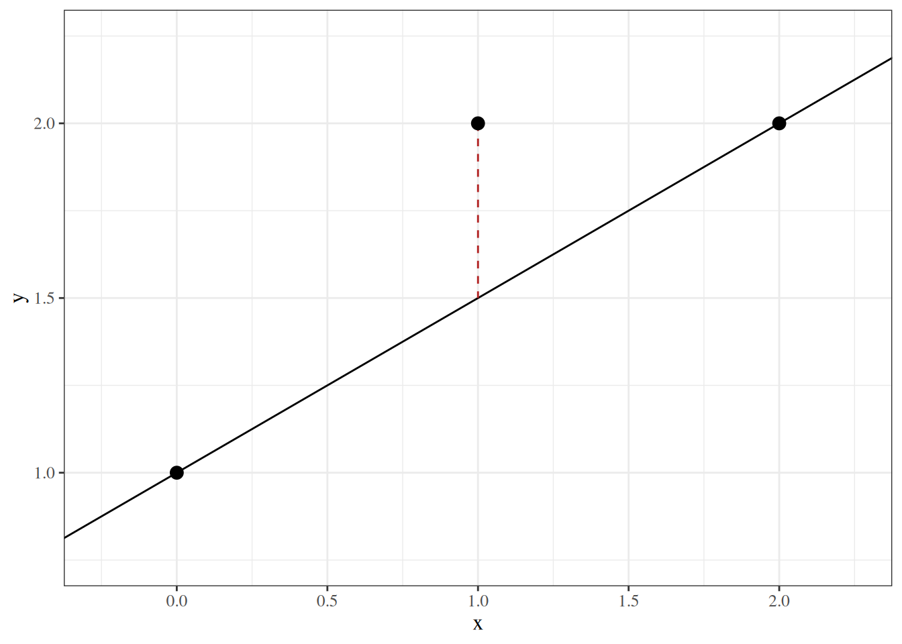
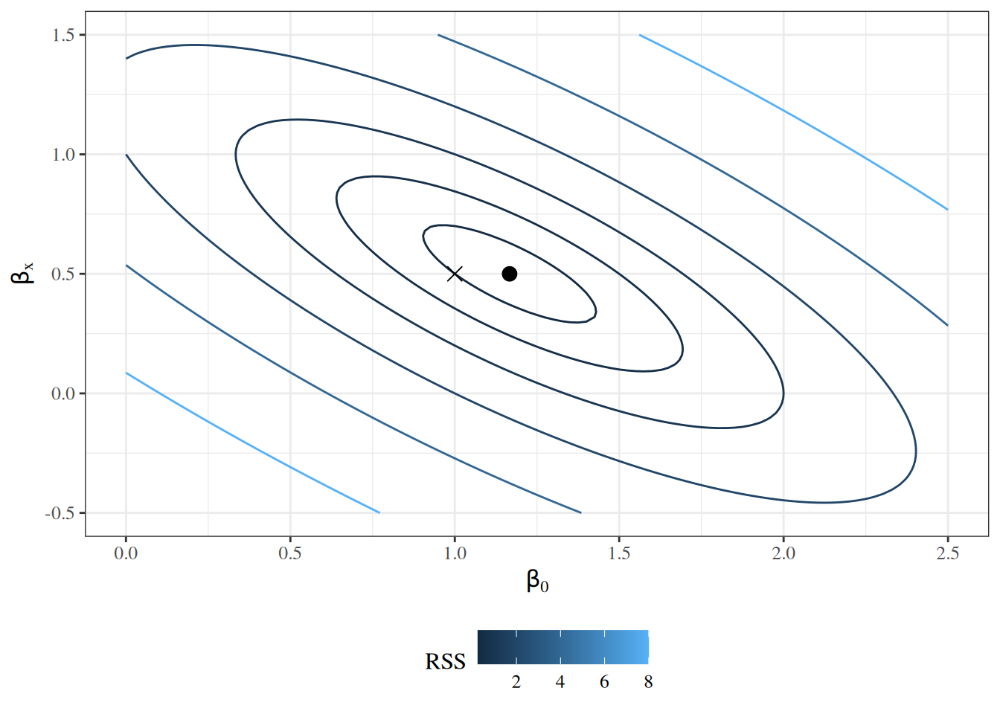
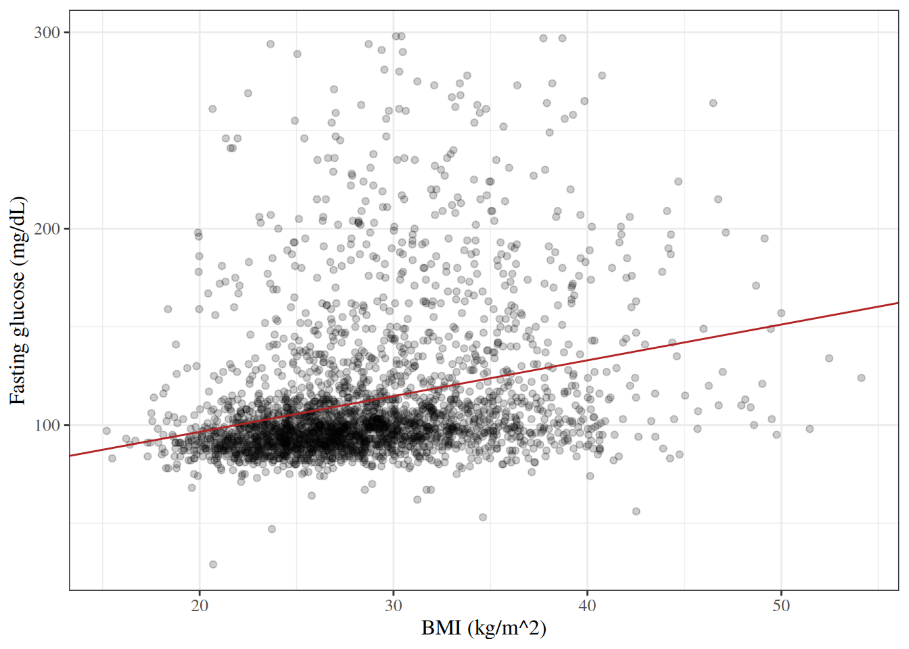

# Correlation and Simple Linear Regression

Code

Published

Last modified: 2026-10-05 02:17:34 (PDT)

This page reviews two ways to relate two continuous variables: correlation coefficients, with tests of whether they differ from zero, and simple linear regression. It uses the \\t\\ reference distribution defined on the [Statistical Inference](inference.llms.md#sec-reference-distributions) page. This page is adapted from Vittinghoff et al. ([2012](#ref-vittinghoff2e)), Chapter 3.

## 1 The HERS data

The examples on this page use the HERS data, which the [Comparing Means](basic-statistical-methods.llms.md#sec-hers-intro) page describes. The `rmb` R package includes the dataset; [`haven::as_factor()`](https://forcats.tidyverse.org/reference/as_factor.html) converts its Stata value labels to factors:

``` downlit
hers <- rmb::hers |> haven::as_factor()
hers |> head()
```

## 2 Correlation

### 2.1 Testing the Pearson correlation

> **NOTE:**
>
> **Definition 1 (Population correlation)** The **population correlation** of two random variables \\X\\ and \\Y\\ with positive variances is
>
> \\\rho \stackrel{\text{def}}{=}\frac{\operatorname{Cov}\mathopen{}\left(X, Y\right)\mathclose{}}{\sqrt{\operatorname{Var}\mathopen{}\left(X\right)\mathclose{} \operatorname{Var}\mathopen{}\left(Y\right)\mathclose{}}},\\
>
> where \\\operatorname{Cov}\mathopen{}\left(X, Y\right)\mathclose{}\\ is their [covariance](https://morrison-lab.github.io/pds/variance-covariance.html#def-cov).

The [Pearson correlation coefficient](exploratory-descriptive.llms.md#def-pearson-r) \\r\\ of a sample is the corresponding sample statistic, and estimates \\\rho\\.

> **NOTE:**
>
> **Definition 2 (Test of zero correlation)** Let \\r\\ be the [Pearson correlation coefficient](exploratory-descriptive.llms.md#def-pearson-r) of \\n \ge 3\\ pairs, with \\\mathopen{}\left\|r\right\|\mathclose{} \< 1\\. The **t-test of zero correlation** of \\H_0: \rho = 0\\ against \\H_1: \rho \neq 0\\ ([Definition 1](#def-population-correlation)) uses the statistic
>
> \\t \stackrel{\text{def}}{=}\frac{r \sqrt{n - 2}}{\sqrt{1 - r^2}}.\\
>
> Its p-value is \\\Pr(\mathopen{}\left\|T\right\|\mathclose{} \ge \mathopen{}\left\|t\right\|\mathclose{})\\, where \\T\\ has the \\t\_{n-2}\\ distribution ([t-distribution](inference.llms.md#def-t-dist)).

> **NOTE:**
>
> **Theorem 1 (Null distribution of the correlation t statistic)** Let the pairs \\(X_1, Y_1), \ldots, (X_n, Y_n)\\ be independent, and let each \\Y_i\\, given \\X_1, \ldots, X_n\\, be Gaussian with a mean and variance that do not depend on the \\X\\ values. Then the statistic \\t\\ of [Definition 2](#def-pearson-test) has the \\t\_{n-2}\\ distribution ([Hogg et al. 2019, sec. 9.6](#ref-hoggtanis2015), pp. 472-473):
>
> \\ t \sim t\_{n-2}. \\

The conditions of [Theorem 1](#thm-pearson-test-null) hold, for example, when the pairs are independent draws from a bivariate Gaussian distribution with \\\rho = 0\\.

> **NOTE:**
>
> **Example 1 (Correlation between BMI and fasting glucose in HERS)** [Figure 1](#fig-hers-scatter) plots baseline fasting glucose against BMI.
>
> Show R code
>
> ``` downlit
> hers |>
>   dplyr::filter(!is.na(BMI)) |>
>   ggplot2::ggplot() +
>   ggplot2::aes(x = BMI, y = glucose) +
>   ggplot2::geom_point(alpha = 0.3) +
>   ggplot2::geom_smooth(method = "lm", formula = y ~ x) +
>   ggplot2::labs(
>     x = "BMI (kg/m^2)",
>     y = "Fasting glucose (mg/dL)"
>   )
> ```
>
> [](correlation-regression_files/figure-html/unnamed-chunk-1-1.png "Figure 1: Baseline fasting glucose against BMI in HERS, with the least-squares line")
>
> Figure 1: Baseline fasting glucose against BMI in HERS, with the least-squares line
>
> The statistic of [Definition 2](#def-pearson-test), using the 2758 participants with a BMI measurement:
>
> ``` downlit
> hers_bmi <- hers |> dplyr::filter(!is.na(BMI))
> r <- cor(hers_bmi$BMI, hers_bmi$glucose)
> n <- nrow(hers_bmi)
> t_cor <- r * sqrt(n - 2) / sqrt(1 - r^2)
> c(r = r, t = t_cor, p_value = 2 * pt(-abs(t_cor), df = n - 2))
> #>           r           t     p_value 
> #> 2.72664e-01 1.48779e+01 3.24201e-48
> ```
>
> [`cor.test()`](https://rdrr.io/r/stats/cor.test.html) reports the same values, and a confidence interval for \\\rho\\:
>
> ``` downlit
> cor.test(hers$BMI, hers$glucose, method = "pearson")
> #> 
> #>  Pearson's product-moment correlation
> #> 
> #> data:  hers$BMI and hers$glucose
> #> t = 14.88, df = 2756, p-value <2e-16
> #> alternative hypothesis: true correlation is not equal to 0
> #> 95 percent confidence interval:
> #>  0.237760 0.306865
> #> sample estimates:
> #>      cor 
> #> 0.272664
> ```
>
> The correlation is positive but modest: glucose tends to be higher at higher BMI, with wide scatter around the line in [Figure 1](#fig-hers-scatter).

### 2.2 Spearman rank correlation

> **NOTE:**
>
> **Definition 3 (Spearman rank correlation)** Replace each \\x_i\\ by its rank \\u_i\\ among \\x_1, \ldots, x_n\\, and each \\y_i\\ by its rank \\v_i\\ among \\y_1, \ldots, y_n\\, giving tied values the average of the ranks they span. The **Spearman rank correlation** \\r_S\\ is the [Pearson correlation coefficient](exploratory-descriptive.llms.md#def-pearson-r) evaluated at the rank pairs:
>
> \\ r_S \stackrel{\text{def}}{=}r\mathopen{}\left((u_1, v_1), \ldots, (u_n, v_n)\right)\mathclose{}. \\

Because ranks depend only on the ordering of the values, \\r_S\\ measures how close the association is to monotone, whether or not it is linear, and a single extreme value moves \\r_S\\ less than it moves \\r\\.

> **NOTE:**
>
> **Example 2 (Spearman correlation between BMI and fasting glucose in HERS)** The Pearson correlation of the ranks ([Definition 3](#def-spearman-r)), and [`cor.test()`](https://rdrr.io/r/stats/cor.test.html)’s Spearman test (`exact = FALSE`, because tied values rule out the exact p-value):
>
> ``` downlit
> hers_bmi <- hers |> dplyr::filter(!is.na(BMI))
> cor(rank(hers_bmi$BMI), rank(hers_bmi$glucose))
> #> [1] 0.333751
> cor.test(hers_bmi$BMI, hers_bmi$glucose, method = "spearman", exact = FALSE)
> #> 
> #>  Spearman's rank correlation rho
> #> 
> #> data:  hers_bmi$BMI and hers_bmi$glucose
> #> S = 2.33e+09, p-value <2e-16
> #> alternative hypothesis: true rho is not equal to 0
> #> sample estimates:
> #>      rho 
> #> 0.333751
> ```
>
> \\r_S\\ is larger than the Pearson \\r\\ of [Example 1](#exm-hers-cor): the association is closer to monotone than to linear.

## 3 Simple linear regression

### 3.1 Model specification

> **NOTE:**
>
> **Definition 4 (Conditional Gaussian model)** A **conditional Gaussian model** for outcomes \\Y_1, \ldots, Y_n\\ with covariate values \\x_1, \ldots, x_n\\ (each a single value or a vector) says that, given the covariates, the outcomes are independent and Gaussian: outcome \\Y_i\\ is centered on a mean function \\\mu(x)\\ evaluated at \\x_i\\, and has its own variance \\\sigma_i^2\\:
>
> \\ \begin{aligned} Y_i \mid X_i = x_i &\\ \sim\_{\perp\\\\\\\perp}\\ \operatorname{N}\mathopen{}\left(\mu_i, \sigma_i^2\right)\mathclose{},\\ \mu_i &\stackrel{\text{def}}{=}\mu(x_i). \end{aligned} \\

> **NOTE:**
>
> **Definition 5 (Deviation from the conditional mean)** In a conditional Gaussian model ([Definition 4](#def-cond-gaussian)), the **deviation** \\\varepsilon_i\\ of outcome \\Y_i\\ is its [deviation from its mean](https://morrison-lab.github.io/pds/variance-covariance.html#def-deviation-pop-mean), taking the mean conditional on \\X_i = x_i\\:
>
> \\\varepsilon_i \stackrel{\text{def}}{=}Y_i - \mu(x_i).\\

> **NOTE:**
>
> **Exercise 1 (Outcome as mean plus deviation)** Show that each outcome in a conditional Gaussian model ([Definition 4](#def-cond-gaussian)) is its conditional mean plus its deviation ([Definition 5](#def-slr-deviation)): \\Y_i = \mu_i + \varepsilon_i\\.

> **NOTE:**
>
> *Solution 1*. Start from the right-hand side:
>
> \\ \begin{aligned} \mu_i + \varepsilon_i &= \mu(x_i) + \varepsilon_i && \text{(definition of \$\mu_i\$)}\\ &= \mu(x_i) + \mathopen{}\left(Y_i - \mu(x_i)\right)\mathclose{} && \text{(definition of \$\varepsilon_i\$)}\\ &= \mu(x_i) + Y_i - \mu(x_i) && \text{(remove the parentheses)}\\ &= Y_i + \mu(x_i) - \mu(x_i) && \text{(reorder the terms)}\\ &= Y_i + \mathopen{}\left(\mu(x_i) - \mu(x_i)\right)\mathclose{} && \text{(group the last two terms)}\\ &= Y_i + 0 && \text{(\$a - a = 0\$)}\\ &= Y_i && \text{(\$a + 0 = a\$)} \end{aligned} \\
>
> So \\Y_i = \mu_i + \varepsilon_i\\.
>
> Alternatively, solve the definition of \\\varepsilon_i\\ for \\Y_i\\:
>
> \\ \begin{aligned} \varepsilon_i &= Y_i - \mu(x_i) && \text{(definition of \$\varepsilon_i\$)}\\ \varepsilon_i + \mu(x_i) &= Y_i - \mu(x_i) + \mu(x_i) && \text{(add \$\mu(x_i)\$ to both sides)}\\ \varepsilon_i + \mu(x_i) &= Y_i + \mathopen{}\left(-\mu(x_i)\right)\mathclose{} + \mu(x_i) && \text{(subtracting is adding the negative)}\\ \varepsilon_i + \mu(x_i) &= Y_i + \mathopen{}\left(-\mu(x_i) + \mu(x_i)\right)\mathclose{} && \text{(group the last two terms)}\\ \varepsilon_i + \mu(x_i) &= Y_i + 0 && \text{(\$-a + a = 0\$)}\\ \varepsilon_i + \mu(x_i) &= Y_i && \text{(\$a + 0 = a\$)}\\ Y_i &= \varepsilon_i + \mu(x_i) && \text{(swap the two sides)}\\ Y_i &= \mu(x_i) + \varepsilon_i && \text{(reorder the terms)}\\ Y_i &= \mu_i + \varepsilon_i && \text{(definition of \$\mu_i\$)} \end{aligned} \\

> **NOTE:**
>
> **Theorem 2 (Additive form of the conditional Gaussian model)** In a conditional Gaussian model ([Definition 4](#def-cond-gaussian)), each outcome is its conditional mean plus its deviation ([Definition 5](#def-slr-deviation)):
>
> \\Y_i = \mu_i + \varepsilon_i.\\

> **NOTE:**
>
> *Proof*. This is the solution to [Exercise 1](#exr-slr-additive).

> **NOTE:**
>
> **Exercise 2 (Distribution of the deviations)** Show that in a conditional Gaussian model ([Definition 4](#def-cond-gaussian)), given the covariate values, the deviations ([Definition 5](#def-slr-deviation)) are independent and each is Gaussian with mean 0 and the same variance \\\sigma_i^2\\ as \\Y_i\\: \\\varepsilon_i \mid X_i = x_i \\ \sim\_{\perp\\\\\\\perp}\\ \operatorname{N}\mathopen{}\left(0, \sigma_i^2\right)\mathclose{}\\.

> **NOTE:**
>
> *Solution 2*. Every probability, CDF and density in this solution is [conditional](https://morrison-lab.github.io/pds/expectation.html#def-cond-pdf) on \\X_i = x_i\\; the condition is left out of the notation to keep the lines short. Write \\F\_{\varepsilon}\\ and \\f\_{\varepsilon}\\ for the CDF and density of \\\varepsilon_i\\, and \\F_Y\\ and \\f_Y\\ for those of \\Y_i\\.
>
> First, the CDF of \\\varepsilon_i\\:
>
> \\ \begin{aligned} F\_{\varepsilon}(t) &= \Pr\mathopen{}\left(\varepsilon_i \le t\right)\mathclose{} && \text{(definition of a CDF)}\\ &= \Pr\mathopen{}\left(Y_i - \mu(x_i) \le t\right)\mathclose{} && \text{(definition of \$\varepsilon_i\$)}\\ &= \Pr\mathopen{}\left(Y_i - \mu_i \le t\right)\mathclose{} && \text{(definition of \$\mu_i\$)}\\ &= \Pr\mathopen{}\left(Y_i \le t + \mu_i\right)\mathclose{} && \text{(add \$\mu_i\$ to both sides of the inequality)}\\ &= F_Y(t + \mu_i) && \text{(definition of a CDF)} \end{aligned} \\
>
> Differentiating gives the density:
>
> \\ \begin{aligned} f\_{\varepsilon}(t) &= \frac{\partial}{\partial t} F\_{\varepsilon}(t) && \text{(a density is the derivative of its CDF)}\\ &= \frac{\partial}{\partial t} F_Y(t + \mu_i) && \text{(CDF of \$\varepsilon_i\$)}\\ &= f_Y(t + \mu_i) \frac{\partial}{\partial t} (t + \mu_i) && \text{(chain rule)} \end{aligned} \\
>
> The inner derivative:
>
> \\ \begin{aligned} \frac{\partial}{\partial t} (t + \mu_i) &= \frac{\partial}{\partial t} t + \frac{\partial}{\partial t} \mu_i && \text{(derivative of a sum)}\\ &= 1 + 0 && \text{(\$\mu_i\$ does not depend on \$t\$)}\\ &= 1 && \text{(add)} \end{aligned} \\
>
> Plugging the inner derivative back in, and using the [Gaussian density](https://morrison-lab.github.io/pds/random-variables.html#def-normal) of \\Y_i\\, which has mean \\\mu_i = \mu(x_i)\\ and variance \\\sigma_i^2\\ ([Definition 4](#def-cond-gaussian)):
>
> \\ \begin{aligned} f\_{\varepsilon}(t) &= f_Y(t + \mu_i) \cdot 1 && \text{(inner derivative is 1)}\\ &= f_Y(t + \mu_i) && \text{(multiply by 1)}\\ &= \frac{1}{\sigma_i \sqrt{2 \pi}} \text{e}^{-\frac{\mathopen{}\left((t + \mu_i) - \mu_i\right)\mathclose{}^2}{2 \sigma_i^2}} && \text{(Gaussian density with mean \$\mu_i\$)}\\ &= \frac{1}{\sigma_i \sqrt{2 \pi}} \text{e}^{-\frac{t^2}{2 \sigma_i^2}} && \text{(subtract)} \end{aligned} \\
>
> The last line is the density of \\\operatorname{N}\mathopen{}\left(0, \sigma_i^2\right)\mathclose{}\\, so \\\varepsilon_i \mid X_i = x_i \sim \operatorname{N}\mathopen{}\left(0, \sigma_i^2\right)\mathclose{}\\.
>
> For independence, factor the joint CDF of \\\varepsilon_1, \ldots, \varepsilon_n\\, using the same CDF step as above for each \\i\\ and the independence of the \\Y_i\\ given the covariates ([Definition 4](#def-cond-gaussian)):
>
> \\ \begin{aligned} \Pr\mathopen{}\left(\varepsilon_1 \le t_1, \ldots, \varepsilon_n \le t_n\right)\mathclose{} &= \Pr\mathopen{}\left(Y_1 \le t_1 + \mu_1, \ldots, Y_n \le t_n + \mu_n\right)\mathclose{} && \text{(add \$\mu_i\$ to both sides of each inequality)}\\ &= \prod\_{i=1}^n \Pr\mathopen{}\left(Y_i \le t_i + \mu_i\right)\mathclose{} && \text{(the \$Y_i\$ are independent)}\\ &= \prod\_{i=1}^n \Pr\mathopen{}\left(\varepsilon_i \le t_i\right)\mathclose{} && \text{(subtract \$\mu_i\$ from both sides of each inequality)} \end{aligned} \\
>
> The joint CDF is the product of the marginal CDFs, so \\\varepsilon_1, \ldots, \varepsilon_n\\ are independent.

> **NOTE:**
>
> **Theorem 3 (Distribution of the deviations)** In a conditional Gaussian model ([Definition 4](#def-cond-gaussian)), given the covariates, the deviations ([Definition 5](#def-slr-deviation)) are independent and Gaussian with mean 0 and variance \\\sigma_i^2\\:
>
> \\\varepsilon_i \mid X_i = x_i \\ \sim\_{\perp\\\\\\\perp}\\ \operatorname{N}\mathopen{}\left(0, \sigma_i^2\right)\mathclose{}.\\

> **NOTE:**
>
> *Proof*. This is the solution to [Exercise 2](#exr-slr-deviation-dist).

> **NOTE:**
>
> **Definition 6 (Homoskedastic model)** A conditional Gaussian model ([Definition 4](#def-cond-gaussian)) is **homoskedastic** if all outcomes share one variance \\\sigma^2\\, which does not depend on \\i\\:
>
> \\\sigma_i^2 = \sigma^2 \text{ for all } i.\\

> **NOTE:**
>
> **Corollary 1 (Deviations in a homoskedastic model)** In a homoskedastic model ([Definition 6](#def-homoskedastic)), the deviations ([Definition 5](#def-slr-deviation)) all have the same variance \\\sigma^2\\:
>
> \\\varepsilon_i \mid X_i = x_i \\ \sim\_{\perp\\\\\\\perp}\\ \operatorname{N}\mathopen{}\left(0, \sigma^2\right)\mathclose{}.\\

> **NOTE:**
>
> *Proof*. By [Theorem 3](#thm-slr-deviation-dist), \\\varepsilon_i \mid X_i = x_i \\ \sim\_{\perp\\\\\\\perp}\\ \operatorname{N}\mathopen{}\left(0, \sigma_i^2\right)\mathclose{}\\, and [Definition 6](#def-homoskedastic) sets \\\sigma_i^2 = \sigma^2\\ for all \\i\\.

> **NOTE:**
>
> **Definition 7 (Linear regression model)** A **linear regression model** is a homoskedastic ([Definition 6](#def-homoskedastic)) conditional Gaussian model ([Definition 4](#def-cond-gaussian)) whose mean function is linear in \\p\\ covariates, where observation \\i\\ has covariate values \\x_i = (x\_{i1}, \ldots, x\_{ip})\\:
>
> \\\mu(x_1, \ldots, x_p) \stackrel{\text{def}}{=}\beta\_{0}+ \sum\_{j=1}^p \beta\_{x_j} x_j.\\

> **NOTE:**
>
> **Definition 8 (Simple linear regression model)** A **simple linear regression** model is a linear regression model ([Definition 7](#def-linear-regression)) with \\p = 1\\ covariate \\X\\, writing \\x_i\\ for \\x\_{i1}\\:
>
> \\\mu(x) \stackrel{\text{def}}{=}\beta\_{0}+ \beta\_{x} x.\\

> **NOTE:**
>
> *Remark 1* (Interpreting the parameters).
>
> - \\\beta\_{0}= \mu(0)\\ is the **intercept**: the mean of \\Y\\ among observations with \\X = 0\\.
> - \\\beta\_{x} = \mu(x + 1) - \mu(x)\\ is the **slope**: the difference in the mean of \\Y\\ between two groups whose values of \\X\\ differ by one unit.
> - \\\sigma^2\\ is the variance of \\Y\\ around its mean at each value of \\X\\.

### 3.2 Ordinary least squares estimation

> **NOTE:**
>
> **Definition 9 (Residual sum of squares)** For a regression model whose conditional mean \\\mu(x; \tilde{\theta})\\ depends on a parameter vector \\\tilde{\theta}\\, the **residual sum of squares** at \\\tilde{\theta}\\ is the sum of the squared residuals \\r_i(\tilde{\theta}) \stackrel{\text{def}}{=}y_i - \mu(x_i; \tilde{\theta})\\ that the model has when its parameters equal \\\tilde{\theta}\\:
>
> \\\text{RSS}(\tilde{\theta}) \stackrel{\text{def}}{=}\sum\_{i=1}^nr_i(\tilde{\theta})^2.\\
>
> At the estimate \\\hat{\tilde{\theta}}\\, \\r_i(\hat{\tilde{\theta}})\\ is the [residual](estimation.llms.md#def-residual) \\r_i\\ of the fitted model.

> **NOTE:**
>
> **Example 3 (Residual sum of squares of a simple linear regression)** The mean function of a [simple linear regression](#def-slr) model has parameter vector \\\tilde{\theta}= (\beta\_{0}, \beta\_{x})\\, so write \\\text{RSS}(\beta\_{0}, \beta\_{x})\\ for its residual sum of squares ([Definition 9](#def-rss)):
>
> \\ \begin{aligned} \text{RSS}(\beta\_{0}, \beta\_{x}) &= \sum\_{i=1}^nr_i(\beta\_{0}, \beta\_{x})^2 && \text{(definition of RSS)}\\ &= \sum\_{i=1}^n\mathopen{}\left(y_i - \mu(x_i; \beta\_{0}, \beta\_{x})\right)\mathclose{}^2 && \text{(definition of \$r_i(\tilde{\theta})\$)}\\ &= \sum\_{i=1}^n\mathopen{}\left(y_i - (\beta\_{0}+ \beta\_{x} x_i)\right)\mathclose{}^2 && \text{(definition of \$\mu(x)\$)}\\ &= \sum\_{i=1}^n(y_i - \beta\_{0}- \beta\_{x} x_i)^2 && \text{(distribute the minus sign)} \end{aligned} \\

> **NOTE:**
>
> **Example 4 (Residual sum of squares of a line through three points)** For the points \\(0, 1)\\, \\(1, 2)\\, \\(2, 2)\\ and the line with \\\beta\_{0}= 1\\ and \\\beta\_{x} = 0.5\\ ([Example 3](#exm-rss-slr)), the residuals are \\1 - 1 = 0\\, \\2 - 1.5 = 0.5\\, and \\2 - 2 = 0\\, so \\\text{RSS}(1, 0.5) = 0^2 + 0.5^2 + 0^2 = 0.25\\ ([Figure 2](#fig-rss-three-points)).
>
> Show R code
>
> ``` downlit
> rss_points <- tibble::tibble(x = c(0, 1, 2), y = c(1, 2, 2)) |>
>   dplyr::mutate(fitted = 1 + 0.5 * x)
>
> ggplot2::ggplot(rss_points, ggplot2::aes(x = x, y = y)) +
>   ggplot2::geom_abline(intercept = 1, slope = 0.5) +
>   ggplot2::geom_segment(
>     ggplot2::aes(xend = x, yend = fitted),
>     linetype = "dashed",
>     color = "firebrick"
>   ) +
>   ggplot2::geom_point(size = 3) +
>   ggplot2::coord_cartesian(xlim = c(-0.25, 2.25), ylim = c(0.75, 2.25))
> ```
>
> [](correlation-regression_files/figure-html/unnamed-chunk-5-1.png "Figure 2: The three points, the line with intercept 1 and slope 0.5, and the one nonzero residual (dashed)")
>
> Figure 2: The three points, the line with intercept 1 and slope 0.5, and the one nonzero residual (dashed)

> **NOTE:**
>
> **Exercise 3 (Mean squared error and residual sum of squares)** For a regression model with conditional mean \\\mu(x; \tilde{\theta})\\, let \\\hat y_i \stackrel{\text{def}}{=}\mu(x_i; \tilde{\theta})\\ be its predictions of \\n \ge 1\\ outcomes \\y_1, \ldots, y_n\\, and let \\\text{RSS}(\tilde{\theta})\\ ([Definition 9](#def-rss)) be taken over those same outcomes. Write the [mean squared error](estimation.llms.md#def-prediction-mse) of these predictions in terms of \\\text{RSS}(\tilde{\theta})\\, and \\\text{RSS}(\tilde{\theta})\\ in terms of that mean squared error.

> **NOTE:**
>
> *Solution 3*. First, each squared [prediction error](estimation.llms.md#def-prediction-error) equals the squared residual at \\\tilde{\theta}\\:
>
> \\ \begin{aligned} e_i^2 &= (\hat y_i - y_i)^2 && \text{(definition of prediction error)}\\ &= \mathopen{}\left(\mu(x_i; \tilde{\theta}) - y_i\right)\mathclose{}^2 && \text{(definition of \$\hat y_i\$)}\\ &= \mathopen{}\left(-\mathopen{}\left(y_i - \mu(x_i; \tilde{\theta})\right)\mathclose{}\right)\mathclose{}^2 && \text{(factor out \$-1\$)}\\ &= \mathopen{}\left(-r_i(\tilde{\theta})\right)\mathclose{}^2 && \text{(definition of \$r_i(\tilde{\theta})\$)}\\ &= r_i(\tilde{\theta})^2 && \text{(\$(-a)^2 = a^2\$)} \end{aligned} \\
>
> So the mean squared error is the residual sum of squares divided by \\n\\:
>
> \\ \begin{aligned} \operatorname{MSE}\mathopen{}\left(\hat y\right)\mathclose{} &= \frac{1}{n} \sum\_{i=1}^ne_i^2 && \text{(definition of mean squared error)}\\ &= \frac{1}{n} \sum\_{i=1}^nr_i(\tilde{\theta})^2 && \text{(\$e_i^2 = r_i(\tilde{\theta})^2\$)}\\ &= \frac{1}{n} \text{RSS}(\tilde{\theta}) && \text{(definition of RSS)} \end{aligned} \\
>
> Solving for \\\text{RSS}(\tilde{\theta})\\:
>
> \\ \begin{aligned} \operatorname{MSE}\mathopen{}\left(\hat y\right)\mathclose{} &= \frac{1}{n} \text{RSS}(\tilde{\theta}) && \text{(result above)}\\ n \\ \operatorname{MSE}\mathopen{}\left(\hat y\right)\mathclose{} &= \text{RSS}(\tilde{\theta}) && \text{(multiply both sides by \$n\$)}\\ \text{RSS}(\tilde{\theta}) &= n \\ \operatorname{MSE}\mathopen{}\left(\hat y\right)\mathclose{} && \text{(swap the two sides)} \end{aligned} \\

> **NOTE:**
>
> **Theorem 4 (Mean squared error is the residual sum of squares divided by \\n\\)** For a regression model with conditional mean \\\mu(x; \tilde{\theta})\\, the [mean squared error](estimation.llms.md#def-prediction-mse) of its predictions \\\hat y_i = \mu(x_i; \tilde{\theta})\\ of \\n \ge 1\\ outcomes \\y_1, \ldots, y_n\\ and the residual sum of squares \\\text{RSS}(\tilde{\theta})\\ ([Definition 9](#def-rss)) over those same \\n\\ outcomes satisfy
>
> \\\operatorname{MSE}\mathopen{}\left(\hat y\right)\mathclose{} = \frac{1}{n} \text{RSS}(\tilde{\theta}),\\
>
> and equivalently
>
> \\\text{RSS}(\tilde{\theta}) = n \\ \operatorname{MSE}\mathopen{}\left(\hat y\right)\mathclose{}.\\

> **NOTE:**
>
> *Proof*. Both equations are derived in [Exercise 3](#exr-mse-rss).

> **NOTE:**
>
> *Remark 2* (The same observations on both sides). The identities in [Theorem 4](#thm-mse-rss) need the mean squared error and the residual sum of squares to be taken over the same \\n\\ observations. The RSS minimized in fitting is taken over the fitting data, so dividing it by \\n\\ gives the mean squared error on the fitting data, not the mean squared error of predictions of new outcomes.

> **NOTE:**
>
> **Definition 10 (Ordinary least squares)** The **ordinary least squares (OLS) estimate** of a model’s parameter vector \\\tilde{\theta}\\ is the value of \\\tilde{\theta}\\ that minimizes the [residual sum of squares](#def-rss):
>
> \\\hat{\tilde{\theta}} \stackrel{\text{def}}{=}\arg \min\_{\tilde{\theta}} \text{RSS}(\tilde{\theta}).\\

> **NOTE:**
>
> **Example 5 (OLS estimates of a simple linear regression)** For a simple linear regression, the OLS estimates ([Definition 10](#def-ols)) \\\hat{\beta}\_{0}\\ and \\\hat{\beta}\_{x}\\ are the values of \\\beta\_{0}\\ and \\\beta\_{x}\\ that minimize \\\text{RSS}(\beta\_{0}, \beta\_{x})\\ from [Example 3](#exm-rss-slr). [Figure 3](#fig-rss-surface) shows \\\text{RSS}(\beta\_{0}, \beta\_{x})\\ for the three points of [Example 4](#exm-rss): the OLS estimates sit at the bottom of the bowl, and the line of [Example 4](#exm-rss) sits higher up.
>
> Show R code
>
> ``` downlit
> rss_grid <- expand.grid(
>   b0 = seq(0, 2.5, length.out = 101),
>   bx = seq(-0.5, 1.5, length.out = 101)
> )
> rss_grid$rss <- mapply(
>   function(b0, bx) sum((rss_points$y - b0 - bx * rss_points$x)^2),
>   rss_grid$b0,
>   rss_grid$bx
> )
> ols_coefs <- coef(lm(y ~ x, data = rss_points))
>
> ggplot2::ggplot(rss_grid, ggplot2::aes(x = b0, y = bx, z = rss)) +
>   ggplot2::geom_contour(
>     ggplot2::aes(color = ggplot2::after_stat(level)),
>     breaks = c(0.25, 0.5, 1, 2, 4, 8)
>   ) +
>   ggplot2::annotate(
>     "point",
>     x = ols_coefs[[1]], y = ols_coefs[[2]], size = 3
>   ) +
>   ggplot2::annotate("point", x = 1, y = 0.5, shape = 4, size = 3) +
>   ggplot2::labs(
>     x = expression(beta[0]),
>     y = expression(beta[x]),
>     color = "RSS"
>   )
> ```
>
> Show R code
>
> ``` downlit
>
> ols_coefs
> #> (Intercept)           x 
> #>     1.16667     0.50000
> ```
>
> [](correlation-regression_files/figure-html/unnamed-chunk-6-1.png "Figure 3: Contours of \text{RSS}(\beta_{0}, \beta_{x}) for the three points of Example 4. The dot marks the OLS estimates; the cross marks the line of Example 4.")
>
> Figure 3: Contours of \\\text{RSS}(\beta\_{0}, \beta\_{x})\\ for the three points of [Example 4](#exm-rss). The dot marks the OLS estimates; the cross marks the line of [Example 4](#exm-rss).

> **NOTE:**
>
> **Definition 11 (Normal equations)** For a model fitted by least squares with parameter vector \\\tilde{\theta}\\, the **normal equations** set the gradient of the [residual sum of squares](#def-rss) to zero:
>
> \\\frac{\partial}{\partial \tilde{\theta}} \text{RSS}(\tilde{\theta}) = \tilde{0}.\\

> **NOTE:**
>
> **Example 6 (Normal equations of a simple linear regression)** For a simple linear regression, the parameter vector is \\\tilde{\beta}\stackrel{\text{def}}{=}{\mathopen{}\left(\beta\_{0}, \beta\_{x}\right)\mathclose{}}^{\top}\\, and \\\text{RSS}(\tilde{\beta})\\ is \\\text{RSS}(\beta\_{0}, \beta\_{x})\\ from [Example 3](#exm-rss-slr). Its gradient has one entry per coefficient, so the normal equations ([Definition 11](#def-normal-equations)) are two scalar equations:
>
> \\ \frac{\partial \text{RSS}}{\partial \beta\_{0}} = 0, \qquad \frac{\partial \text{RSS}}{\partial \beta\_{x}} = 0. \\

> **NOTE:**
>
> **Definition 12 (Centered sums of squares and cross-products)** For data \\(x_1, y_1), \ldots, (x_n, y_n)\\, the **centered sums of squares** of the \\x_i\\ and of the \\y_i\\, and their **centered sum of cross-products**, are
>
> \\ \begin{aligned} S\_{xx} &\stackrel{\text{def}}{=}\sum\_{i=1}^n(x_i - \bar{x})^2, & S\_{yy} &\stackrel{\text{def}}{=}\sum\_{i=1}^n(y_i - \bar{y})^2, & S\_{xy} &\stackrel{\text{def}}{=}\sum\_{i=1}^n(x_i - \bar{x})(y_i - \bar{y}). \end{aligned} \\

> **NOTE:**
>
> **Exercise 4 (Deviations from the mean sum to zero)** Show that \\\sum\_{i=1}^n(x_i - \bar{x}) = 0\\.

> **NOTE:**
>
> *Solution 4*. \\ \begin{aligned} \sum\_{i=1}^n(x_i - \bar{x}) &= \sum\_{i=1}^nx_i - \sum\_{i=1}^n\bar{x} && \text{(split the sum)}\\ &= \sum\_{i=1}^nx_i - n \bar{x} && \text{(sum of a constant)}\\ &= n \bar{x} - n \bar{x} && \text{(\$\sum\_{i=1}^nx_i = n \bar{x}\$)}\\ &= 0 && \text{(subtract)} \end{aligned} \\
>
> The same steps with \\y_i\\ in place of \\x_i\\ show that \\\sum\_{i=1}^n(y_i - \bar{y}) = 0\\.

> **NOTE:**
>
> **Exercise 5 (Expanding the centered sum of squares)** Show that \\S\_{xx} = \sum\_{i=1}^nx_i^2 - n \bar{x}^2\\ ([Definition 12](#def-centered-sums)).

> **NOTE:**
>
> *Solution 5*. \\ \begin{aligned} S\_{xx} &= \sum\_{i=1}^n(x_i - \bar{x})^2 && \text{(definition of \$S\_{xx}\$)}\\ &= \sum\_{i=1}^n\mathopen{}\left(x_i^2 - 2 \bar{x} x_i + \bar{x}^2\right)\mathclose{} && \text{(expand the square)}\\ &= \sum\_{i=1}^nx_i^2 - \sum\_{i=1}^n2 \bar{x} x_i + \sum\_{i=1}^n\bar{x}^2 && \text{(split the sum)}\\ &= \sum\_{i=1}^nx_i^2 - 2 \bar{x} \sum\_{i=1}^nx_i + \sum\_{i=1}^n\bar{x}^2 && \text{(constant factor out of the sum)}\\ &= \sum\_{i=1}^nx_i^2 - 2 \bar{x} \sum\_{i=1}^nx_i + n \bar{x}^2 && \text{(sum of a constant)}\\ &= \sum\_{i=1}^nx_i^2 - 2 \bar{x} \cdot n \bar{x} + n \bar{x}^2 && \text{(\$\sum\_{i=1}^nx_i = n \bar{x}\$)}\\ &= \sum\_{i=1}^nx_i^2 - 2 n \bar{x}^2 + n \bar{x}^2 && \text{(multiply)}\\ &= \sum\_{i=1}^nx_i^2 - n \bar{x}^2 && \text{(collect the \$\bar{x}^2\$ terms)} \end{aligned} \\

> **NOTE:**
>
> **Exercise 6 (Derivative of RSS with respect to the intercept)** Find the partial derivative of the simple linear regression residual sum of squares \\\text{RSS}(\beta\_{0}, \beta\_{x})\\ ([Example 3](#exm-rss-slr)) with respect to the intercept, \\\partial \text{RSS} / \partial \beta\_{0}\\, and write it in terms of \\\bar{x}\\ and \\\bar{y}\\.

> **NOTE:**
>
> *Solution 6*. Differentiate one operation at a time, starting from the definition ([Example 3](#exm-rss-slr)):
>
> \\ \begin{aligned} \frac{\partial \text{RSS}}{\partial \beta\_{0}} &= \frac{\partial}{\partial \beta\_{0}} \sum\_{i=1}^n(y_i - \beta\_{0}- \beta\_{x} x_i)^2 && \text{(definition of RSS)}\\ &= \sum\_{i=1}^n\frac{\partial}{\partial \beta\_{0}} (y_i - \beta\_{0}- \beta\_{x} x_i)^2 && \text{(derivative of a sum)}\\ &= \sum\_{i=1}^n2 (y_i - \beta\_{0}- \beta\_{x} x_i) \frac{\partial}{\partial \beta\_{0}} (y_i - \beta\_{0}- \beta\_{x} x_i) && \text{(chain rule)} \end{aligned} \\
>
> The inner derivative:
>
> \\ \begin{aligned} \frac{\partial}{\partial \beta\_{0}} (y_i - \beta\_{0}- \beta\_{x} x_i) &= \frac{\partial y_i}{\partial \beta\_{0}} - \frac{\partial \beta\_{0}}{\partial \beta\_{0}} - \frac{\partial (\beta\_{x} x_i)}{\partial \beta\_{0}} && \text{(derivative of a sum)}\\ &= 0 - 1 - 0 && \text{(\$y_i\$ and \$\beta\_{x} x_i\$ do not depend on \$\beta\_{0}\$)}\\ &= -1 && \text{(subtract)} \end{aligned} \\
>
> Plugging the inner derivative back in:
>
> \\ \begin{aligned} \frac{\partial \text{RSS}}{\partial \beta\_{0}} &= \sum\_{i=1}^n2 (y_i - \beta\_{0}- \beta\_{x} x_i) (-1) && \text{(inner derivative is \$-1\$)}\\ &= \sum\_{i=1}^n-2 (y_i - \beta\_{0}- \beta\_{x} x_i) && \text{(multiply \$2\$ by \$-1\$)}\\ &= -2 \sum\_{i=1}^n(y_i - \beta\_{0}- \beta\_{x} x_i) && \text{(constant factor out of the sum)}\\ &= -2 \mathopen{}\left(\sum\_{i=1}^ny_i - \sum\_{i=1}^n\beta\_{0}- \sum\_{i=1}^n\beta\_{x} x_i\right)\mathclose{} && \text{(split the sum)}\\ &= -2 \mathopen{}\left(\sum\_{i=1}^ny_i - n \beta\_{0}- \sum\_{i=1}^n\beta\_{x} x_i\right)\mathclose{} && \text{(sum of a constant)}\\ &= -2 \mathopen{}\left(\sum\_{i=1}^ny_i - n \beta\_{0}- \beta\_{x} \sum\_{i=1}^nx_i\right)\mathclose{} && \text{(constant factor out of the sum)}\\ &= -2 \mathopen{}\left(n \bar{y} - n \beta\_{0}- \beta\_{x} \sum\_{i=1}^nx_i\right)\mathclose{} && \text{(\$\sum\_{i=1}^ny_i = n \bar{y}\$)}\\ &= -2 \mathopen{}\left(n \bar{y} - n \beta\_{0}- \beta\_{x} n \bar{x}\right)\mathclose{} && \text{(\$\sum\_{i=1}^nx_i = n \bar{x}\$)} \end{aligned} \\

> **NOTE:**
>
> **Exercise 7 (Derivative of RSS with respect to the slope)** Find the partial derivative of the simple linear regression residual sum of squares \\\text{RSS}(\beta\_{0}, \beta\_{x})\\ ([Example 3](#exm-rss-slr)) with respect to the slope, \\\partial \text{RSS} / \partial \beta\_{x}\\.

> **NOTE:**
>
> *Solution 7*. Differentiate one operation at a time, starting from the definition ([Example 3](#exm-rss-slr)):
>
> \\ \begin{aligned} \frac{\partial \text{RSS}}{\partial \beta\_{x}} &= \frac{\partial}{\partial \beta\_{x}} \sum\_{i=1}^n(y_i - \beta\_{0}- \beta\_{x} x_i)^2 && \text{(definition of RSS)}\\ &= \sum\_{i=1}^n\frac{\partial}{\partial \beta\_{x}} (y_i - \beta\_{0}- \beta\_{x} x_i)^2 && \text{(derivative of a sum)}\\ &= \sum\_{i=1}^n2 (y_i - \beta\_{0}- \beta\_{x} x_i) \frac{\partial}{\partial \beta\_{x}} (y_i - \beta\_{0}- \beta\_{x} x_i) && \text{(chain rule)} \end{aligned} \\
>
> The inner derivative:
>
> \\ \begin{aligned} \frac{\partial}{\partial \beta\_{x}} (y_i - \beta\_{0}- \beta\_{x} x_i) &= \frac{\partial y_i}{\partial \beta\_{x}} - \frac{\partial \beta\_{0}}{\partial \beta\_{x}} - \frac{\partial (\beta\_{x} x_i)}{\partial \beta\_{x}} && \text{(derivative of a sum)}\\ &= 0 - 0 - x_i && \text{(\$y_i\$ and \$\beta\_{0}\$ do not depend on \$\beta\_{x}\$)}\\ &= -x_i && \text{(subtract)} \end{aligned} \\
>
> Plugging the inner derivative back in:
>
> \\ \begin{aligned} \frac{\partial \text{RSS}}{\partial \beta\_{x}} &= \sum\_{i=1}^n2 (y_i - \beta\_{0}- \beta\_{x} x_i) (-x_i) && \text{(inner derivative is \$-x_i\$)}\\ &= \sum\_{i=1}^n-2 x_i (y_i - \beta\_{0}- \beta\_{x} x_i) && \text{(rearrange the product)}\\ &= -2 \sum\_{i=1}^nx_i (y_i - \beta\_{0}- \beta\_{x} x_i) && \text{(constant factor out of the sum)} \end{aligned} \\

> **NOTE:**
>
> **Exercise 8 (Solving the normal equations)** Using [Exercise 6](#exr-rss-deriv-intercept) and [Exercise 7](#exr-rss-deriv-slope), solve the normal equations of [Example 6](#exm-normal-equations-slr) for \\\beta\_{0}\\ and \\\beta\_{x}\\, assuming \\S\_{xx} \> 0\\ ([Definition 12](#def-centered-sums)).

> **NOTE:**
>
> *Solution 8*. **First normal equation.** Set the derivative from [Exercise 6](#exr-rss-deriv-intercept) to zero, then isolate \\\beta\_{0}\\:
>
> \\ \begin{aligned} 0 &= -2 \mathopen{}\left(n \bar{y} - n \beta\_{0}- \beta\_{x} n \bar{x}\right)\mathclose{} && \text{(first normal equation)}\\ 0 &= n \bar{y} - n \beta\_{0}- \beta\_{x} n \bar{x} && \text{(divide both sides by \$-2\$)}\\ 0 &= \bar{y} - \beta\_{0}- \beta\_{x} \bar{x} && \text{(divide both sides by \$n\$)}\\ \beta\_{0}&= \bar{y} - \beta\_{x} \bar{x} && \text{(add \$\beta\_{0}\$ to both sides)} \end{aligned} \\
>
> **Second normal equation.** Substitute that intercept into the derivative from [Exercise 7](#exr-rss-deriv-slope):
>
> \\ \begin{aligned} \frac{\partial \text{RSS}}{\partial \beta\_{x}} &= -2 \sum\_{i=1}^nx_i (y_i - \beta\_{0}- \beta\_{x} x_i) && \text{(derivative with respect to \$\beta\_{x}\$)}\\ &= -2 \sum\_{i=1}^nx_i \mathopen{}\left(y_i - (\bar{y} - \beta\_{x} \bar{x}) - \beta\_{x} x_i\right)\mathclose{} && \text{(substitute \$\beta\_{0}\$)}\\ &= -2 \sum\_{i=1}^nx_i \mathopen{}\left(y_i - \bar{y} + \beta\_{x} \bar{x} - \beta\_{x} x_i\right)\mathclose{} && \text{(remove the inner parentheses)}\\ &= -2 \sum\_{i=1}^nx_i \mathopen{}\left((y_i - \bar{y}) - (\beta\_{x} x_i - \beta\_{x} \bar{x})\right)\mathclose{} && \text{(group terms)}\\ &= -2 \sum\_{i=1}^nx_i \mathopen{}\left((y_i - \bar{y}) - \beta\_{x} (x_i - \bar{x})\right)\mathclose{} && \text{(factor out \$\beta\_{x}\$)} \end{aligned} \\
>
> To shorten the next steps, write \\d_i \stackrel{\text{def}}{=}(y_i - \bar{y}) - \beta\_{x} (x_i - \bar{x})\\, so that \\\partial \text{RSS} / \partial \beta\_{x} = -2 \sum\_{i=1}^nx_i d_i\\. The \\d_i\\ sum to zero, because deviations from a mean sum to zero ([Exercise 4](#exr-sum-deviations-zero)):
>
> \\ \begin{aligned} \sum\_{i=1}^nd_i &= \sum\_{i=1}^n\mathopen{}\left((y_i - \bar{y}) - \beta\_{x} (x_i - \bar{x})\right)\mathclose{} && \text{(definition of \$d_i\$)}\\ &= \sum\_{i=1}^n(y_i - \bar{y}) - \sum\_{i=1}^n\beta\_{x} (x_i - \bar{x}) && \text{(split the sum)}\\ &= \sum\_{i=1}^n(y_i - \bar{y}) - \beta\_{x} \sum\_{i=1}^n(x_i - \bar{x}) && \text{(constant factor out of the sum)}\\ &= 0 - \beta\_{x} \cdot 0 && \text{(deviations sum to zero)}\\ &= 0 - 0 && \text{(multiply)}\\ &= 0 && \text{(subtract)} \end{aligned} \\
>
> So subtracting \\\bar{x} \sum\_{i=1}^nd_i\\ from \\\sum\_{i=1}^nx_i d_i\\ does not change it:
>
> \\ \begin{aligned} \sum\_{i=1}^nx_i d_i &= \sum\_{i=1}^nx_i d_i - \bar{x} \sum\_{i=1}^nd_i && \text{(\$\sum\_{i=1}^nd_i = 0\$)}\\ &= \sum\_{i=1}^nx_i d_i - \sum\_{i=1}^n\bar{x} d_i && \text{(constant factor into the sum)}\\ &= \sum\_{i=1}^n(x_i - \bar{x}) d_i && \text{(combine the sums)}\\ &= \sum\_{i=1}^n(x_i - \bar{x}) \mathopen{}\left((y_i - \bar{y}) - \beta\_{x} (x_i - \bar{x})\right)\mathclose{} && \text{(definition of \$d_i\$)}\\ &= \sum\_{i=1}^n\mathopen{}\left((x_i - \bar{x})(y_i - \bar{y}) - \beta\_{x} (x_i - \bar{x})^2\right)\mathclose{} && \text{(distribute)}\\ &= \sum\_{i=1}^n(x_i - \bar{x})(y_i - \bar{y}) - \sum\_{i=1}^n\beta\_{x} (x_i - \bar{x})^2 && \text{(split the sum)}\\ &= \sum\_{i=1}^n(x_i - \bar{x})(y_i - \bar{y}) - \beta\_{x} \sum\_{i=1}^n(x_i - \bar{x})^2 && \text{(constant factor out of the sum)}\\ &= S\_{xy} - \beta\_{x} \sum\_{i=1}^n(x_i - \bar{x})^2 && \text{(definition of \$S\_{xy}\$)}\\ &= S\_{xy} - \beta\_{x} S\_{xx} && \text{(definition of \$S\_{xx}\$)} \end{aligned} \\
>
> So \\\partial \text{RSS} / \partial \beta\_{x} = -2 \mathopen{}\left(S\_{xy} - \beta\_{x} S\_{xx}\right)\mathclose{}\\. Set it to zero and isolate \\\beta\_{x}\\:
>
> \\ \begin{aligned} 0 &= -2 \mathopen{}\left(S\_{xy} - \beta\_{x} S\_{xx}\right)\mathclose{} && \text{(second normal equation)}\\ 0 &= S\_{xy} - \beta\_{x} S\_{xx} && \text{(divide both sides by \$-2\$)}\\ \beta\_{x} S\_{xx} &= S\_{xy} && \text{(add \$\beta\_{x} S\_{xx}\$ to both sides)}\\ \beta\_{x} &= \frac{S\_{xy}}{S\_{xx}} && \text{(divide both sides by \$S\_{xx} \> 0\$)} \end{aligned} \\
>
> So the normal equations have exactly one solution: \\\beta\_{x} = S\_{xy} / S\_{xx}\\ and \\\beta\_{0}= \bar{y} - \beta\_{x} \bar{x}\\.

> **NOTE:**
>
> **Exercise 9 (Second derivatives of RSS)** Find the matrix of second derivatives of \\\text{RSS}(\beta\_{0}, \beta\_{x})\\ ([Example 3](#exm-rss-slr)) with respect to \\\beta\_{0}\\ and \\\beta\_{x}\\, and show that it is positive definite when \\S\_{xx} \> 0\\ ([Definition 12](#def-centered-sums)).

> **NOTE:**
>
> *Solution 9*. Differentiate each first derivative again.
>
> **Derivatives of \\\partial \text{RSS} / \partial \beta\_{0}\\.** By [Exercise 6](#exr-rss-deriv-intercept), \\\partial \text{RSS} / \partial \beta\_{0} = -2 \mathopen{}\left(n \bar{y} - n \beta\_{0}- \beta\_{x} n \bar{x}\right)\mathclose{}\\. Differentiating with respect to \\\beta\_{0}\\:
>
> \\ \begin{aligned} \frac{\partial^2 \text{RSS}}{\partial \beta\_{0}^2} &= -2 \frac{\partial}{\partial \beta\_{0}} \mathopen{}\left(n \bar{y} - n \beta\_{0}- \beta\_{x} n \bar{x}\right)\mathclose{} && \text{(constant factor)}\\ &= -2 \mathopen{}\left( \frac{\partial (n \bar{y})}{\partial \beta\_{0}} - \frac{\partial (n \beta\_{0})}{\partial \beta\_{0}} - \frac{\partial (\beta\_{x} n \bar{x})}{\partial \beta\_{0}}\right)\mathclose{} && \text{(derivative of a sum)}\\ &= -2 (0 - n - 0) && \text{(differentiate each term)}\\ &= -2 (-n) && \text{(drop the zeros)}\\ &= 2n && \text{(multiply)} \end{aligned} \\
>
> Differentiating with respect to \\\beta\_{x}\\:
>
> \\ \begin{aligned} \frac{\partial^2 \text{RSS}}{\partial \beta\_{x} \\ \partial \beta\_{0}} &= -2 \frac{\partial}{\partial \beta\_{x}} \mathopen{}\left(n \bar{y} - n \beta\_{0}- \beta\_{x} n \bar{x}\right)\mathclose{} && \text{(constant factor)}\\ &= -2 \mathopen{}\left( \frac{\partial (n \bar{y})}{\partial \beta\_{x}} - \frac{\partial (n \beta\_{0})}{\partial \beta\_{x}} - \frac{\partial (\beta\_{x} n \bar{x})}{\partial \beta\_{x}}\right)\mathclose{} && \text{(derivative of a sum)}\\ &= -2 (0 - 0 - n \bar{x}) && \text{(differentiate each term)}\\ &= -2 (-n \bar{x}) && \text{(drop the zeros)}\\ &= 2 n \bar{x} && \text{(multiply)} \end{aligned} \\
>
> **Derivatives of \\\partial \text{RSS} / \partial \beta\_{x}\\.** By [Exercise 7](#exr-rss-deriv-slope), \\\partial \text{RSS} / \partial \beta\_{x} = -2 \sum\_{i=1}^nx_i (y_i - \beta\_{0}- \beta\_{x} x_i)\\. Differentiating with respect to \\\beta\_{0}\\, and reusing the inner derivative \\-1\\ from [Exercise 6](#exr-rss-deriv-intercept):
>
> \\ \begin{aligned} \frac{\partial^2 \text{RSS}}{\partial \beta\_{0}\\ \partial \beta\_{x}} &= -2 \frac{\partial}{\partial \beta\_{0}} \sum\_{i=1}^nx_i (y_i - \beta\_{0}- \beta\_{x} x_i) && \text{(constant factor)}\\ &= -2 \sum\_{i=1}^n\frac{\partial}{\partial \beta\_{0}} \mathopen{}\left(x_i (y_i - \beta\_{0}- \beta\_{x} x_i)\right)\mathclose{} && \text{(derivative of a sum)}\\ &= -2 \sum\_{i=1}^nx_i \frac{\partial}{\partial \beta\_{0}} (y_i - \beta\_{0}- \beta\_{x} x_i) && \text{(\$x_i\$ does not depend on \$\beta\_{0}\$)}\\ &= -2 \sum\_{i=1}^nx_i (-1) && \text{(inner derivative is \$-1\$)}\\ &= -2 \sum\_{i=1}^n(-x_i) && \text{(multiply)}\\ &= -2 \mathopen{}\left(-\sum\_{i=1}^nx_i\right)\mathclose{} && \text{(constant factor out of the sum)}\\ &= 2 \sum\_{i=1}^nx_i && \text{(multiply)}\\ &= 2 n \bar{x} && \text{(\$\sum\_{i=1}^nx_i = n \bar{x}\$)} \end{aligned} \\
>
> Differentiating with respect to \\\beta\_{x}\\, and reusing the inner derivative \\-x_i\\ from [Exercise 7](#exr-rss-deriv-slope):
>
> \\ \begin{aligned} \frac{\partial^2 \text{RSS}}{\partial \beta\_{x}^2} &= -2 \frac{\partial}{\partial \beta\_{x}} \sum\_{i=1}^nx_i (y_i - \beta\_{0}- \beta\_{x} x_i) && \text{(constant factor)}\\ &= -2 \sum\_{i=1}^n\frac{\partial}{\partial \beta\_{x}} \mathopen{}\left(x_i (y_i - \beta\_{0}- \beta\_{x} x_i)\right)\mathclose{} && \text{(derivative of a sum)}\\ &= -2 \sum\_{i=1}^nx_i \frac{\partial}{\partial \beta\_{x}} (y_i - \beta\_{0}- \beta\_{x} x_i) && \text{(\$x_i\$ does not depend on \$\beta\_{x}\$)}\\ &= -2 \sum\_{i=1}^nx_i (-x_i) && \text{(inner derivative is \$-x_i\$)}\\ &= -2 \sum\_{i=1}^n\mathopen{}\left(-x_i^2\right)\mathclose{} && \text{(multiply)}\\ &= -2 \mathopen{}\left(-\sum\_{i=1}^nx_i^2\right)\mathclose{} && \text{(constant factor out of the sum)}\\ &= 2 \sum\_{i=1}^nx_i^2 && \text{(multiply)} \end{aligned} \\
>
> **The matrix.** Collecting the four second derivatives, the matrix of second derivatives is
>
> \\ \begin{pmatrix} 2n & 2 n \bar{x} \\ 2 n \bar{x} & 2 \sum\_{i=1}^nx_i^2 \end{pmatrix}. \\
>
> Its top-left entry, \\2n\\, is positive. Its determinant, using the expanded form of \\S\_{xx}\\ from [Exercise 5](#exr-sxx-expand), is
>
> \\ \begin{aligned} \det \begin{pmatrix} 2n & 2 n \bar{x} \\ 2 n \bar{x} & 2 \sum\_{i=1}^nx_i^2 \end{pmatrix} &= (2n) \mathopen{}\left(2 \sum\_{i=1}^nx_i^2\right)\mathclose{} - (2 n \bar{x}) (2 n \bar{x}) && \text{(\$2 \times 2\$ determinant)}\\ &= 4 n \sum\_{i=1}^nx_i^2 - 4 n^2 \bar{x}^2 && \text{(multiply)}\\ &= 4 n \mathopen{}\left(\sum\_{i=1}^nx_i^2 - n \bar{x}^2\right)\mathclose{} && \text{(factor out \$4n\$)}\\ &= 4 n S\_{xx} && \text{(expanded form of \$S\_{xx}\$)} \end{aligned} \\
>
> which is positive when \\S\_{xx} \> 0\\. A symmetric \\2 \times 2\\ matrix with a positive top-left entry and a positive determinant is positive definite.

> **NOTE:**
>
> **Theorem 5 (Closed-form OLS estimates)** Suppose \\S\_{xx} \> 0\\ ([Definition 12](#def-centered-sums)), that is, not all \\x_i\\ are equal. Then the OLS estimates ([Example 5](#exm-ols-slr)) are unique, and
>
> \\\hat{\beta}\_{x} = \frac{S\_{xy}}{S\_{xx}}, \qquad \hat{\beta}\_{0}= \bar{y} - \hat{\beta}\_{x} \bar{x}.\\

> **NOTE:**
>
> *Proof*. \\\text{RSS}\\ is differentiable, so any point that minimizes it solves the [normal equations](#def-normal-equations). By [Exercise 8](#exr-solve-normal-equations), the normal equations have exactly one solution, \\\beta\_{x} = S\_{xy} / S\_{xx}\\ and \\\beta\_{0}= \bar{y} - \beta\_{x} \bar{x}\\. By [Exercise 9](#exr-rss-hessian), the matrix of second derivatives of \\\text{RSS}\\ is positive definite at every point, so \\\text{RSS}\\ is strictly convex and its only stationary point is its unique global minimum. So the OLS estimates exist, are unique, and equal that solution.

The same estimates follow from a derivation in vector notation, which treats \\(\beta\_{0}, \beta\_{x})\\ as a single vector instead of differentiating with respect to each component separately.

> **NOTE:**
>
> **Definition 13 (Covariate vector)** In simple linear regression ([Definition 8](#def-slr)), the **covariate vector** \\\tilde{x}\_i\\ of observation \\i\\ is its covariate value \\x_i\\, preceded by a 1 for the intercept:
>
> \\ \tilde{x}\_i\stackrel{\text{def}}{=}\begin{pmatrix} 1 \\ x_i \end{pmatrix}. \\

> **NOTE:**
>
> **Exercise 10 (Mean as a dot product)** Show that in simple linear regression ([Definition 8](#def-slr)), the conditional mean \\\mu(x_i)\\ is the dot product of the covariate vector \\\tilde{x}\_i\\ ([Definition 13](#def-slr-covariate-vector)) and the coefficient vector \\\tilde{\beta}= {\mathopen{}\left(\beta\_{0}, \beta\_{x}\right)\mathclose{}}^{\top}\\ ([Example 6](#exm-normal-equations-slr)): \\\mu(x_i) = \tilde{x}\_i \cdot \tilde{\beta}\\.

> **NOTE:**
>
> *Solution 10*. Start from the dot product:
>
> \\ \begin{aligned} \tilde{x}\_i \cdot \tilde{\beta} &= \begin{pmatrix} 1 \\ x_i \end{pmatrix} \cdot \tilde{\beta} && \text{(definition of \$\tilde{x}\_i\$)}\\ &= \begin{pmatrix} 1 \\ x_i \end{pmatrix} \cdot \begin{pmatrix} \beta\_{0}\\ \beta\_{x} \end{pmatrix} && \text{(definition of \$\tilde{\beta}\$, written as a column)}\\ &= 1 \cdot \beta\_{0}+ x_i \beta\_{x} && \text{(definition of the dot product)}\\ &= \beta\_{0}+ x_i \beta\_{x} && \text{(\$1 \cdot a = a\$)}\\ &= \beta\_{0}+ \beta\_{x} x_i && \text{(reorder the factors)}\\ &= \mu(x_i) && \text{(definition of \$\mu(x)\$)} \end{aligned} \\
>
> So \\\mu(x_i) = \tilde{x}\_i \cdot \tilde{\beta}\\.

> **NOTE:**
>
> **Lemma 1 (The conditional mean is a dot product)** In simple linear regression ([Definition 8](#def-slr)), the conditional mean of observation \\i\\ is the dot product of its covariate vector ([Definition 13](#def-slr-covariate-vector)) and the coefficient vector \\\tilde{\beta}\\ ([Example 6](#exm-normal-equations-slr)):
>
> \\\mu(x_i) = \tilde{x}\_i \cdot \tilde{\beta}.\\

> **NOTE:**
>
> *Proof*. This is the solution to [Exercise 10](#exr-slr-mean-dot-product).

> **NOTE:**
>
> **Example 7 (Residual sum of squares in vector notation)** In simple linear regression, take \\\tilde{\theta}= \tilde{\beta}\\ and substitute \\\mu(x_i) = \tilde{x}\_i \cdot \tilde{\beta}\\ ([Lemma 1](#lem-slr-mean-dot-product)) into each residual of the residual sum of squares ([Definition 9](#def-rss)). The residual sum of squares is then a function of the coefficient vector \\\tilde{\beta}\\, the same function as \\\text{RSS}(\beta\_{0}, \beta\_{x})\\ in [Example 3](#exm-rss-slr):
>
> \\ \text{RSS}(\tilde{\beta}) = \sum\_{i=1}^n\mathopen{}\left(y_i - \tilde{x}\_i \cdot \tilde{\beta}\right)\mathclose{}^2. \\

> **NOTE:**
>
> **Exercise 11 (Gradient of RSS in vector notation)** Find the gradient of the residual sum of squares in vector notation ([Example 7](#exm-rss-vector)), \\\frac{\partial}{\partial \tilde{\beta}} \text{RSS}(\tilde{\beta})\\, by differentiating with respect to the vector \\\tilde{\beta}\\ directly, rather than one component at a time.

> **NOTE:**
>
> *Solution 11*. Differentiate one operation at a time, starting from \\\text{RSS}(\tilde{\beta})\\ in vector notation ([Example 7](#exm-rss-vector)):
>
> \\ \begin{aligned} \frac{\partial}{\partial \tilde{\beta}} \text{RSS}(\tilde{\beta}) &= \frac{\partial}{\partial \tilde{\beta}} \sum\_{i=1}^n\mathopen{}\left(y_i - \tilde{x}\_i \cdot \tilde{\beta}\right)\mathclose{}^2 && \text{(RSS in vector form)}\\ &= \sum\_{i=1}^n\frac{\partial}{\partial \tilde{\beta}} \mathopen{}\left(y_i - \tilde{x}\_i \cdot \tilde{\beta}\right)\mathclose{}^2 && \text{(derivative of a sum)}\\ &= \sum\_{i=1}^n2 \mathopen{}\left(y_i - \tilde{x}\_i \cdot \tilde{\beta}\right)\mathclose{} \frac{\partial}{\partial \tilde{\beta}} \mathopen{}\left(y_i - \tilde{x}\_i \cdot \tilde{\beta}\right)\mathclose{} && \text{(chain rule)} \end{aligned} \\
>
> For the inner derivative, we need the gradient of a linear function. For any constant vector \\\tilde{a} = {(a_0, a_x)}^{\top}\\:
>
> \\ \begin{aligned} \frac{\partial}{\partial \tilde{\beta}} \tilde{a} \cdot \tilde{\beta} &= \frac{\partial}{\partial \tilde{\beta}} \mathopen{}\left(a_0 \beta\_{0}+ a_x \beta\_{x}\right)\mathclose{} && \text{(write out the dot product)}\\ &= \begin{pmatrix} \frac{\partial}{\partial \beta\_{0}} \mathopen{}\left(a_0 \beta\_{0}+ a_x \beta\_{x}\right)\mathclose{} \\ \frac{\partial}{\partial \beta\_{x}} \mathopen{}\left(a_0 \beta\_{0}+ a_x \beta\_{x}\right)\mathclose{} \end{pmatrix} && \text{(definition of the gradient)}\\ &= \begin{pmatrix} a_0 + 0 \\ 0 + a_x \end{pmatrix} && \text{(derivative of each term)}\\ &= \begin{pmatrix} a_0 \\ a_x \end{pmatrix} && \text{(add zero)}\\ &= \tilde{a} && \text{(definition of \$\tilde{a}\$)} \end{aligned} \\
>
> With \\\tilde{a} = \tilde{x}\_i\\:
>
> \\ \begin{aligned} \frac{\partial}{\partial \tilde{\beta}} \mathopen{}\left(y_i - \tilde{x}\_i \cdot \tilde{\beta}\right)\mathclose{} &= \frac{\partial}{\partial \tilde{\beta}} y_i - \frac{\partial}{\partial \tilde{\beta}} \tilde{x}\_i \cdot \tilde{\beta} && \text{(derivative of a difference)}\\ &= \tilde{0}- \frac{\partial}{\partial \tilde{\beta}} \tilde{x}\_i \cdot \tilde{\beta} && \text{(\$y_i\$ does not depend on \$\tilde{\beta}\$)}\\ &= \tilde{0}- \tilde{x}\_i && \text{(gradient of a linear function)}\\ &= -\tilde{x}\_i && \text{(subtract from zero)} \end{aligned} \\
>
> Plugging the inner derivative back in:
>
> \\ \begin{aligned} \frac{\partial}{\partial \tilde{\beta}} \text{RSS}(\tilde{\beta}) &= \sum\_{i=1}^n2 \mathopen{}\left(y_i - \tilde{x}\_i \cdot \tilde{\beta}\right)\mathclose{} \mathopen{}\left(-\tilde{x}\_i\right)\mathclose{} && \text{(inner derivative is \$-\tilde{x}\_i\$)}\\ &= \sum\_{i=1}^n2 \mathopen{}\left(-\tilde{x}\_i\right)\mathclose{} \mathopen{}\left(y_i - \tilde{x}\_i \cdot \tilde{\beta}\right)\mathclose{} && \text{(reorder the scalar and vector factors)}\\ &= \sum\_{i=1}^n\mathopen{}\left(-2\right)\mathclose{} \tilde{x}\_i\mathopen{}\left(y_i - \tilde{x}\_i \cdot \tilde{\beta}\right)\mathclose{} && \text{(\$2 \mathopen{}\left(-\tilde{x}\_i\right)\mathclose{} = -2 \tilde{x}\_i\$)}\\ &= -2 \sum\_{i=1}^n\tilde{x}\_i\mathopen{}\left(y_i - \tilde{x}\_i \cdot \tilde{\beta}\right)\mathclose{} && \text{(constant factor out of the sum)} \end{aligned} \\

> **NOTE:**
>
> **Exercise 12 (Normal equations in vector notation)** Define the matrix and vector
>
> \\ A \stackrel{\text{def}}{=}\sum\_{i=1}^n\tilde{x}\_i {\tilde{x}\_i}^{\top}, \qquad \tilde{c} \stackrel{\text{def}}{=}\sum\_{i=1}^n\tilde{x}\_iy_i. \\
>
> Using [Exercise 11](#exr-rss-gradient-vector), show that the [normal equations](#def-normal-equations) can be written as \\A \tilde{\beta}= \tilde{c}\\.

> **NOTE:**
>
> *Solution 12*. Distribute the sum in the gradient from [Exercise 11](#exr-rss-gradient-vector):
>
> \\ \begin{aligned} \frac{\partial}{\partial \tilde{\beta}} \text{RSS}(\tilde{\beta}) &= -2 \sum\_{i=1}^n\tilde{x}\_i\mathopen{}\left(y_i - \tilde{x}\_i \cdot \tilde{\beta}\right)\mathclose{} && \text{(gradient of RSS)}\\ &= -2 \sum\_{i=1}^n\mathopen{}\left(\tilde{x}\_iy_i - \tilde{x}\_i\mathopen{}\left(\tilde{x}\_i \cdot \tilde{\beta}\right)\mathclose{}\right)\mathclose{} && \text{(distribute \$\tilde{x}\_i\$)}\\ &= -2 \mathopen{}\left(\sum\_{i=1}^n\tilde{x}\_iy_i - \sum\_{i=1}^n\tilde{x}\_i\mathopen{}\left(\tilde{x}\_i \cdot \tilde{\beta}\right)\mathclose{}\right)\mathclose{} && \text{(sum of differences)} \end{aligned} \\
>
> Each term of the second sum regroups as a matrix times \\\tilde{\beta}\\:
>
> \\ \begin{aligned} \tilde{x}\_i\mathopen{}\left(\tilde{x}\_i \cdot \tilde{\beta}\right)\mathclose{} &= \tilde{x}\_i\mathopen{}\left({\tilde{x}\_i}^{\top} \tilde{\beta}\right)\mathclose{} && \text{(dot product as a transpose product)}\\ &= \mathopen{}\left(\tilde{x}\_i {\tilde{x}\_i}^{\top}\right)\mathclose{} \tilde{\beta} && \text{(matrix multiplication is associative)} \end{aligned} \\
>
> So the gradient is
>
> \\ \begin{aligned} \frac{\partial}{\partial \tilde{\beta}} \text{RSS}(\tilde{\beta}) &= -2 \mathopen{}\left(\tilde{c} - \sum\_{i=1}^n\tilde{x}\_i\mathopen{}\left(\tilde{x}\_i \cdot \tilde{\beta}\right)\mathclose{}\right)\mathclose{} && \text{(definition of \$\tilde{c}\$)}\\ &= -2 \mathopen{}\left(\tilde{c} - \sum\_{i=1}^n\mathopen{}\left(\tilde{x}\_i {\tilde{x}\_i}^{\top}\right)\mathclose{} \tilde{\beta}\right)\mathclose{} && \text{(regroup each term)}\\ &= -2 \mathopen{}\left(\tilde{c} - \mathopen{}\left(\sum\_{i=1}^n\tilde{x}\_i {\tilde{x}\_i}^{\top}\right)\mathclose{} \tilde{\beta}\right)\mathclose{} && \text{(factor \$\tilde{\beta}\$ out of the sum)}\\ &= -2 \mathopen{}\left(\tilde{c} - A \tilde{\beta}\right)\mathclose{} && \text{(definition of \$A\$)} \end{aligned} \\
>
> The normal equations set this gradient equal to \\\tilde{0}\\. Solving for \\A \tilde{\beta}\\ one operation at a time:
>
> \\ \begin{aligned} -2 \mathopen{}\left(\tilde{c} - A \tilde{\beta}\right)\mathclose{} &= \tilde{0} && \text{(normal equations)}\\ \tilde{c} - A \tilde{\beta}&= \tilde{0} && \text{(divide both sides by \$-2\$)}\\ \tilde{c} &= A \tilde{\beta} && \text{(add \$A \tilde{\beta}\$ to both sides)}\\ A \tilde{\beta}&= \tilde{c} && \text{(swap the sides)} \end{aligned} \\

> **NOTE:**
>
> **Exercise 13 (Solving the normal equations in vector notation)** Assuming \\S\_{xx} \> 0\\ ([Definition 12](#def-centered-sums)), show that \\A\\ from [Exercise 12](#exr-normal-equations-vector) is invertible, solve \\A \tilde{\beta}= \tilde{c}\\ for \\\tilde{\beta}\\, and compare the result with [Exercise 8](#exr-solve-normal-equations).

> **NOTE:**
>
> *Solution 13*. Write out the entries of each term of \\A\\ and \\\tilde{c}\\, then add them up:
>
> \\ \begin{aligned} A &= \sum\_{i=1}^n\tilde{x}\_i {\tilde{x}\_i}^{\top} && \text{(definition of \$A\$)}\\ &= \sum\_{i=1}^n\begin{pmatrix} 1 & x_i \\ x_i & x_i^2 \end{pmatrix} && \text{(outer product of \$\tilde{x}\_i\$)}\\ &= \begin{pmatrix} \sum\_{i=1}^n1 & \sum\_{i=1}^nx_i \\ \sum\_{i=1}^nx_i & \sum\_{i=1}^nx_i^2 \end{pmatrix} && \text{(matrices add entrywise)}\\ &= \begin{pmatrix} n & \sum\_{i=1}^nx_i \\ \sum\_{i=1}^nx_i & \sum\_{i=1}^nx_i^2 \end{pmatrix} && \text{(sum of a constant)}\\ &= \begin{pmatrix} n & n\bar{x} \\ n\bar{x} & \sum\_{i=1}^nx_i^2 \end{pmatrix} && \text{(\$\sum\_{i=1}^nx_i = n \bar{x}\$)} \end{aligned} \\
>
> \\ \begin{aligned} \tilde{c} &= \sum\_{i=1}^n\tilde{x}\_iy_i && \text{(definition of \$\tilde{c}\$)}\\ &= \sum\_{i=1}^n\begin{pmatrix} y_i \\ x_i y_i \end{pmatrix} && \text{(scalar times a vector)}\\ &= \begin{pmatrix} \sum\_{i=1}^ny_i \\ \sum\_{i=1}^nx_i y_i \end{pmatrix} && \text{(vectors add entrywise)}\\ &= \begin{pmatrix} n\bar{y} \\ \sum\_{i=1}^nx_i y_i \end{pmatrix} && \text{(\$\sum\_{i=1}^ny_i = n \bar{y}\$)} \end{aligned} \\
>
> The determinant of \\A\\ is
>
> \\ \begin{aligned} \det A &= n \sum\_{i=1}^nx_i^2 - \mathopen{}\left(n\bar{x}\right)\mathclose{} \mathopen{}\left(n\bar{x}\right)\mathclose{} && \text{(determinant of a \$2 \times 2\$ matrix)}\\ &= n \sum\_{i=1}^nx_i^2 - n^2 \bar{x}^2 && \text{(multiply)}\\ &= n \mathopen{}\left(\sum\_{i=1}^nx_i^2 - n \bar{x}^2\right)\mathclose{} && \text{(factor out \$n\$)}\\ &= n S\_{xx} && \text{(expansion of \$S\_{xx}\$)} \end{aligned} \\
>
> where the last step uses [Exercise 5](#exr-sxx-expand). Since \\n \> 0\\ and \\S\_{xx} \> 0\\, \\\det A \> 0\\, so \\A\\ is invertible, and \\A \tilde{\beta}= \tilde{c}\\ has exactly one solution, \\A^{-1} \tilde{c}\\.
>
> To simplify \\A^{-1} \tilde{c}\\, we need two expansions of uncentered sums. Adding \\n \bar{x}^2\\ to both sides of [Exercise 5](#exr-sxx-expand) gives \\\sum\_{i=1}^nx_i^2 = S\_{xx} + n \bar{x}^2\\. The cross-product sum expands the same way:
>
> \\ \begin{aligned} S\_{xy} &= \sum\_{i=1}^n(x_i - \bar{x})(y_i - \bar{y}) && \text{(definition of \$S\_{xy}\$)}\\ &= \sum\_{i=1}^n\mathopen{}\left(x_i y_i - x_i \bar{y} - \bar{x} y_i + \bar{x} \bar{y}\right)\mathclose{} && \text{(expand the product)}\\ &= \sum\_{i=1}^nx_i y_i - \sum\_{i=1}^nx_i \bar{y} - \sum\_{i=1}^n\bar{x} y_i + \sum\_{i=1}^n\bar{x} \bar{y} && \text{(sum of a sum)}\\ &= \sum\_{i=1}^nx_i y_i - \bar{y} \sum\_{i=1}^nx_i - \sum\_{i=1}^n\bar{x} y_i + \sum\_{i=1}^n\bar{x} \bar{y} && \text{(constant factor out of the sum)}\\ &= \sum\_{i=1}^nx_i y_i - \bar{y} \sum\_{i=1}^nx_i - \bar{x} \sum\_{i=1}^ny_i + \sum\_{i=1}^n\bar{x} \bar{y} && \text{(constant factor out of the sum)}\\ &= \sum\_{i=1}^nx_i y_i - \bar{y} \sum\_{i=1}^nx_i - \bar{x} \sum\_{i=1}^ny_i + n \bar{x} \bar{y} && \text{(sum of a constant)}\\ &= \sum\_{i=1}^nx_i y_i - \bar{y} \mathopen{}\left(n \bar{x}\right)\mathclose{} - \bar{x} \sum\_{i=1}^ny_i + n \bar{x} \bar{y} && \text{(\$\sum\_{i=1}^nx_i = n \bar{x}\$)}\\ &= \sum\_{i=1}^nx_i y_i - \bar{y} \mathopen{}\left(n \bar{x}\right)\mathclose{} - \bar{x} \mathopen{}\left(n \bar{y}\right)\mathclose{} + n \bar{x} \bar{y} && \text{(\$\sum\_{i=1}^ny_i = n \bar{y}\$)}\\ &= \sum\_{i=1}^nx_i y_i - n \bar{x} \bar{y} - n \bar{x} \bar{y} + n \bar{x} \bar{y} && \text{(reorder the factors)}\\ &= \sum\_{i=1}^nx_i y_i - n \bar{x} \bar{y} && \text{(combine like terms)} \end{aligned} \\
>
> Adding \\n \bar{x} \bar{y}\\ to both sides gives \\\sum\_{i=1}^nx_i y_i = S\_{xy} + n \bar{x} \bar{y}\\. Now compute the solution:
>
> \\ \begin{aligned} A^{-1} \tilde{c} &= \frac{1}{\det A} \begin{pmatrix} \sum\_{i=1}^nx_i^2 & -n\bar{x} \\ -n\bar{x} & n \end{pmatrix} \tilde{c} && \text{(inverse of a \$2 \times 2\$ matrix)}\\ &= \frac{1}{n S\_{xx}} \begin{pmatrix} \sum\_{i=1}^nx_i^2 & -n\bar{x} \\ -n\bar{x} & n \end{pmatrix} \tilde{c} && \text{(\$\det A = n S\_{xx}\$)}\\ &= \frac{1}{n S\_{xx}} \begin{pmatrix} \sum\_{i=1}^nx_i^2 & -n\bar{x} \\ -n\bar{x} & n \end{pmatrix} \begin{pmatrix} n\bar{y} \\ \sum\_{i=1}^nx_i y_i \end{pmatrix} && \text{(substitute \$\tilde{c}\$)}\\ &= \frac{1}{n S\_{xx}} \begin{pmatrix} \sum\_{i=1}^nx_i^2 \cdot n\bar{y} + \mathopen{}\left(-n\bar{x}\right)\mathclose{} \sum\_{i=1}^nx_i y_i \\ \mathopen{}\left(-n\bar{x}\right)\mathclose{} \cdot n\bar{y} + n \sum\_{i=1}^nx_i y_i \end{pmatrix} && \text{(matrix times a vector)}\\ &= \frac{1}{n S\_{xx}} \begin{pmatrix} n \bar{y} \sum\_{i=1}^nx_i^2 - n \bar{x} \sum\_{i=1}^nx_i y_i \\ -n^2 \bar{x} \bar{y} + n \sum\_{i=1}^nx_i y_i \end{pmatrix} && \text{(multiply out the products)}\\ &= \frac{1}{n S\_{xx}} \\ n \begin{pmatrix} \bar{y} \sum\_{i=1}^nx_i^2 - \bar{x} \sum\_{i=1}^nx_i y_i \\ -n \bar{x} \bar{y} + \sum\_{i=1}^nx_i y_i \end{pmatrix} && \text{(factor \$n\$ out of the vector)}\\ &= \frac{1}{S\_{xx}} \begin{pmatrix} \bar{y} \sum\_{i=1}^nx_i^2 - \bar{x} \sum\_{i=1}^nx_i y_i \\ -n \bar{x} \bar{y} + \sum\_{i=1}^nx_i y_i \end{pmatrix} && \text{(cancel \$n\$)}\\ &= \frac{1}{S\_{xx}} \begin{pmatrix} \bar{y} \sum\_{i=1}^nx_i^2 - \bar{x} \sum\_{i=1}^nx_i y_i \\ \sum\_{i=1}^nx_i y_i - n \bar{x} \bar{y} \end{pmatrix} && \text{(reorder the terms of the second entry)}\\ &= \frac{1}{S\_{xx}} \begin{pmatrix} \bar{y} \mathopen{}\left(S\_{xx} + n\bar{x}^2\right)\mathclose{} - \bar{x} \sum\_{i=1}^nx_i y_i \\ \sum\_{i=1}^nx_i y_i - n \bar{x} \bar{y} \end{pmatrix} && \text{(\$\sum\_{i=1}^nx_i^2 = S\_{xx} + n\bar{x}^2\$)}\\ &= \frac{1}{S\_{xx}} \begin{pmatrix} \bar{y} \mathopen{}\left(S\_{xx} + n\bar{x}^2\right)\mathclose{} - \bar{x} \mathopen{}\left(S\_{xy} + n\bar{x}\bar{y}\right)\mathclose{} \\ \mathopen{}\left(S\_{xy} + n\bar{x}\bar{y}\right)\mathclose{} - n \bar{x} \bar{y} \end{pmatrix} && \text{(\$\sum\_{i=1}^nx_i y_i = S\_{xy} + n\bar{x}\bar{y}\$)}\\ &= \frac{1}{S\_{xx}} \begin{pmatrix} \bar{y} S\_{xx} + \bar{y} n\bar{x}^2 - \bar{x} S\_{xy} - \bar{x} n\bar{x}\bar{y} \\ S\_{xy} + n\bar{x}\bar{y} - n \bar{x} \bar{y} \end{pmatrix} && \text{(distribute)}\\ &= \frac{1}{S\_{xx}} \begin{pmatrix} \bar{y} S\_{xx} + n\bar{x}^2\bar{y} - \bar{x} S\_{xy} - n\bar{x}\bar{x}\bar{y} \\ S\_{xy} + n\bar{x}\bar{y} - n \bar{x} \bar{y} \end{pmatrix} && \text{(reorder the factors)}\\ &= \frac{1}{S\_{xx}} \begin{pmatrix} \bar{y} S\_{xx} + n\bar{x}^2\bar{y} - \bar{x} S\_{xy} - n\bar{x}^2\bar{y} \\ S\_{xy} + n\bar{x}\bar{y} - n \bar{x} \bar{y} \end{pmatrix} && \text{(\$\bar{x} \bar{x} = \bar{x}^2\$)}\\ &= \frac{1}{S\_{xx}} \begin{pmatrix} \bar{y} S\_{xx} - \bar{x} S\_{xy} \\ S\_{xy} + n\bar{x}\bar{y} - n \bar{x} \bar{y} \end{pmatrix} && \text{(first entry: cancel \$\pm n\bar{x}^2\bar{y}\$)}\\ &= \frac{1}{S\_{xx}} \begin{pmatrix} \bar{y} S\_{xx} - \bar{x} S\_{xy} \\ S\_{xy} \end{pmatrix} && \text{(second entry: cancel \$\pm n\bar{x}\bar{y}\$)}\\ &= \begin{pmatrix} \bar{y} S\_{xx} / S\_{xx} - \bar{x} \\ S\_{xy} / S\_{xx} \\ S\_{xy} / S\_{xx} \end{pmatrix} && \text{(multiply each entry by \$1 / S\_{xx}\$)}\\ &= \begin{pmatrix} \bar{y} - \bar{x} \\ S\_{xy} / S\_{xx} \\ S\_{xy} / S\_{xx} \end{pmatrix} && \text{(cancel \$S\_{xx}\$)} \end{aligned} \\
>
> Its entries are \\\beta\_{0}= \bar{y} - \beta\_{x} \bar{x}\\ and \\\beta\_{x} = S\_{xy} / S\_{xx}\\, the same solution as [Exercise 8](#exr-solve-normal-equations).

> **NOTE:**
>
> **Exercise 14 (Hessian of RSS in vector notation)** Find the [Hessian](intro-MLEs.llms.md#def-hessian) \\\frac{\partial}{\partial \tilde{\beta}} \frac{\partial}{\partial {\tilde{\beta}}^{\top}} \text{RSS}(\tilde{\beta})\\, and show that it is positive definite when \\S\_{xx} \> 0\\ ([Definition 12](#def-centered-sums)).

> **NOTE:**
>
> *Solution 14*. Differentiate the gradient \\-2 \mathopen{}\left(\tilde{c} - A \tilde{\beta}\right)\mathclose{}\\ from [Exercise 12](#exr-normal-equations-vector) with respect to \\{\tilde{\beta}}^{\top}\\. \\\tilde{c}\\ does not depend on \\\tilde{\beta}\\. Each entry of \\A \tilde{\beta}\\ is the dot product of a row of \\A\\ with \\\tilde{\beta}\\, so by the gradient of a linear function ([Exercise 11](#exr-rss-gradient-vector)), the derivative of \\A \tilde{\beta}\\ with respect to \\{\tilde{\beta}}^{\top}\\ is \\A\\. So:
>
> \\ \begin{aligned} \frac{\partial}{\partial \tilde{\beta}} \frac{\partial}{\partial {\tilde{\beta}}^{\top}} \text{RSS}(\tilde{\beta}) &= \frac{\partial}{\partial {\tilde{\beta}}^{\top}} \mathopen{}\left(-2 \mathopen{}\left(\tilde{c} - A \tilde{\beta}\right)\mathclose{}\right)\mathclose{} && \text{(differentiate the gradient)}\\ &= -2 \frac{\partial}{\partial {\tilde{\beta}}^{\top}} \mathopen{}\left(\tilde{c} - A \tilde{\beta}\right)\mathclose{} && \text{(constant factor)}\\ &= -2 \mathopen{}\left(\frac{\partial}{\partial {\tilde{\beta}}^{\top}} \tilde{c} - \frac{\partial}{\partial {\tilde{\beta}}^{\top}} A \tilde{\beta}\right)\mathclose{} && \text{(derivative of a difference)}\\ &= -2 \mathopen{}\left(\mathbf{0} - \frac{\partial}{\partial {\tilde{\beta}}^{\top}} A \tilde{\beta}\right)\mathclose{} && \text{(\$\tilde{c}\$ does not depend on \$\tilde{\beta}\$)}\\ &= -2 \mathopen{}\left(\mathbf{0} - A\right)\mathclose{} && \text{(derivative of a linear function)}\\ &= -2 \mathopen{}\left(-A\right)\mathclose{} && \text{(subtract from zero)}\\ &= 2 A && \text{(multiply)}\\ &= 2 \sum\_{i=1}^n\tilde{x}\_i {\tilde{x}\_i}^{\top} && \text{(definition of \$A\$)} \end{aligned} \\
>
> To show it is positive definite, take any vector \\\tilde{v} = {(v_0, v_x)}^{\top} \neq \tilde{0}\\:
>
> \\ \begin{aligned} {\tilde{v}}^{\top} \mathopen{}\left(2 A\right)\mathclose{} \tilde{v} &= 2 \\ {\tilde{v}}^{\top} A \tilde{v} && \text{(constant factor)}\\ &= 2 \\ {\tilde{v}}^{\top} \mathopen{}\left(\sum\_{i=1}^n\tilde{x}\_i {\tilde{x}\_i}^{\top}\right)\mathclose{} \tilde{v} && \text{(definition of \$A\$)}\\ &= 2 \sum\_{i=1}^n{\tilde{v}}^{\top} \mathopen{}\left(\tilde{x}\_i {\tilde{x}\_i}^{\top}\right)\mathclose{} \tilde{v} && \text{(matrix multiplication distributes over the sum)}\\ &= 2 \sum\_{i=1}^n\mathopen{}\left({\tilde{v}}^{\top} \tilde{x}\_i\right)\mathclose{} \mathopen{}\left({\tilde{x}\_i}^{\top} \tilde{v}\right)\mathclose{} && \text{(matrix multiplication is associative)}\\ &= 2 \sum\_{i=1}^n\mathopen{}\left(\tilde{v} \cdot \tilde{x}\_i\right)\mathclose{} \mathopen{}\left(\tilde{x}\_i \cdot \tilde{v}\right)\mathclose{} && \text{(transpose products as dot products)}\\ &= 2 \sum\_{i=1}^n\mathopen{}\left(\tilde{v} \cdot \tilde{x}\_i\right)\mathclose{}^2 && \text{(dot product is symmetric)}\\ &= 2 \sum\_{i=1}^n\mathopen{}\left(v_0 + v_x x_i\right)\mathclose{}^2 && \text{(write out the dot product)}\\ &\ge 0 && \text{(sum of squares)} \end{aligned} \\
>
> Equality would need \\v_0 + v_x x_i = 0\\ for every \\i\\. If \\v_x \neq 0\\, that would force every \\x_i = -v_0 / v_x\\, contradicting \\S\_{xx} \> 0\\; if \\v_x = 0\\, it would force \\v_0 = 0\\, contradicting \\\tilde{v} \neq \tilde{0}\\. So the inequality is strict, and the Hessian is positive definite at every \\\tilde{\beta}\\.

> **NOTE:**
>
> **Theorem 6 (OLS estimates in vector notation)** Suppose \\S\_{xx} \> 0\\ ([Definition 12](#def-centered-sums)). Then the matrix \\A = \sum\_{i=1}^n\tilde{x}\_i {\tilde{x}\_i}^{\top}\\ is invertible, and the vector of OLS estimates ([Definition 10](#def-ols)) is
>
> \\ \hat{\tilde{\beta}}= A^{-1} \tilde{c}, \qquad \tilde{c} = \sum\_{i=1}^n\tilde{x}\_iy_i. \\
>
> Its entries are the estimates of [Theorem 5](#thm-ols-slr).

> **NOTE:**
>
> *Proof*. \\\text{RSS}\\ is differentiable, so any point that minimizes it solves the [normal equations](#def-normal-equations). By [Exercise 12](#exr-normal-equations-vector), the normal equations are \\A \tilde{\beta}= \tilde{c}\\. By [Exercise 13](#exr-solve-normal-equations-vector), \\A\\ is invertible, so their only solution is \\A^{-1} \tilde{c}\\, whose entries are those of [Theorem 5](#thm-ols-slr). By [Exercise 14](#exr-rss-hessian-vector), the Hessian of \\\text{RSS}\\ is positive definite at every \\\tilde{\beta}\\, so \\\text{RSS}\\ is strictly convex and \\A^{-1} \tilde{c}\\ is its unique global minimum.

> **NOTE:**
>
> **Exercise 15 (OLS slope and the correlation)** Assuming \\S\_{xx} \> 0\\ and \\S\_{yy} \> 0\\ ([Definition 12](#def-centered-sums)), write the OLS slope \\\hat{\beta}\_{x}\\ from [Theorem 5](#thm-ols-slr) in terms of the [Pearson correlation coefficient](exploratory-descriptive.llms.md#def-pearson-r) \\r\\ and the [sample standard deviations](exploratory-descriptive.llms.md#def-sample-sd) \\s_x\\ and \\s_y\\ of the \\x_i\\ and the \\y_i\\.

> **NOTE:**
>
> *Solution 15*. In terms of the centered sums ([Definition 12](#def-centered-sums)),
>
> \\ r = \frac{S\_{xy}}{\sqrt{S\_{xx} S\_{yy}}}, \qquad s_x = \sqrt{\frac{S\_{xx}}{n-1}}, \qquad s_y = \sqrt{\frac{S\_{yy}}{n-1}}. \\
>
> So:
>
> \\ \begin{aligned} r \\ \frac{s_y}{s_x} &= \frac{S\_{xy}}{\sqrt{S\_{xx} S\_{yy}}} \cdot \frac{\sqrt{S\_{yy} / (n-1)}}{\sqrt{S\_{xx} / (n-1)}} && \text{(substitute \$r\$, \$s_x\$, \$s_y\$)}\\ &= \frac{S\_{xy}}{\sqrt{S\_{xx}} \sqrt{S\_{yy}}} \cdot \frac{\sqrt{S\_{yy} / (n-1)}}{\sqrt{S\_{xx} / (n-1)}} && \text{(square root of a product)}\\ &= \frac{S\_{xy}}{\sqrt{S\_{xx}} \sqrt{S\_{yy}}} \cdot \frac{\sqrt{S\_{yy}} / \sqrt{n-1}}{\sqrt{S\_{xx}} / \sqrt{n-1}} && \text{(square root of a quotient)}\\ &= \frac{S\_{xy}}{\sqrt{S\_{xx}} \sqrt{S\_{yy}}} \cdot \frac{\sqrt{S\_{yy}}}{\sqrt{S\_{xx}}} && \text{(cancel the factors of \$\sqrt{n - 1}\$)}\\ &= \frac{S\_{xy} \sqrt{S\_{yy}}}{\sqrt{S\_{xx}} \sqrt{S\_{yy}} \sqrt{S\_{xx}}} && \text{(multiply the fractions)}\\ &= \frac{S\_{xy}}{\sqrt{S\_{xx}} \sqrt{S\_{xx}}} && \text{(cancel \$\sqrt{S\_{yy}}\$, which is positive)}\\ &= \frac{S\_{xy}}{S\_{xx}} && \text{(\$\sqrt{S\_{xx}} \sqrt{S\_{xx}} = S\_{xx}\$)}\\ &= \hat{\beta}\_{x} && \text{(closed-form OLS slope)} \end{aligned} \\

> **NOTE:**
>
> **Corollary 2 (OLS slope in terms of the correlation)** If \\S\_{xx} \> 0\\ and \\S\_{yy} \> 0\\ ([Definition 12](#def-centered-sums)), then
>
> \\\hat{\beta}\_{x} = r \\ \frac{s_y}{s_x},\\
>
> where \\r\\ is the [Pearson correlation coefficient](exploratory-descriptive.llms.md#def-pearson-r) and \\s_x\\ and \\s_y\\ are the [sample standard deviations](exploratory-descriptive.llms.md#def-sample-sd) of the \\x_i\\ and the \\y_i\\.

> **NOTE:**
>
> *Proof*. This is the solution to [Exercise 15](#exr-ols-slope-r).

> **TIP:**
>
> Hutchinson’s [Linear Regression (pt1)](https://facultyweb.cs.wwu.edu/~hutchib2/video_lectures/data371/#linear_regression) (17 min) covers fitting a linear regression by least squares, framed as machine learning ([Hutchinson, n.d.](#ref-hutchinson_wwu_ml_videos)). The login for the video site is posted [on Canvas](https://wwu.instructure.com/courses/1906010/modules#module_3922392).

### 3.3 Fitting a simple linear regression in R

> **NOTE:**
>
> **Example 8 (Regression of fasting glucose on BMI in HERS)** The OLS estimates from [Theorem 5](#thm-ols-slr), and the slope from [Corollary 2](#cor-ols-slope-r), for the participants with a BMI measurement:
>
> ``` downlit
> hers_bmi <- hers |> dplyr::filter(!is.na(BMI))
> x <- hers_bmi$BMI
> y <- hers_bmi$glucose
> b1 <- sum((x - mean(x)) * (y - mean(y))) / sum((x - mean(x))^2)
> c(
>   intercept = mean(y) - b1 * mean(x),
>   slope = b1,
>   slope_from_r = cor(x, y) * sd(y) / sd(x)
> )
> #>    intercept        slope slope_from_r 
> #>     60.07405      1.82218      1.82218
> ```
>
> [`lm()`](https://rdrr.io/r/stats/lm.html) gives the same estimates:
>
> ``` downlit
> slr_fit <- lm(glucose ~ BMI, data = hers)
> summary(slr_fit)
> #> 
> #> Call:
> #> lm(formula = glucose ~ BMI, data = hers)
> #> 
> #> Residuals:
> #>    Min     1Q Median     3Q    Max 
> #> -81.55 -18.98 -10.35   3.76 190.81 
> #> 
> #> Coefficients:
> #>             Estimate Std. Error t value Pr(>|t|)    
> #> (Intercept)   60.074      3.565    16.9   <2e-16 ***
> #> BMI            1.822      0.122    14.9   <2e-16 ***
> #> ---
> #> Signif. codes:  0 '***' 0.001 '**' 0.01 '*' 0.05 '.' 0.1 ' ' 1
> #> 
> #> Residual standard error: 35.5 on 2756 degrees of freedom
> #>   (5 observations deleted due to missingness)
> #> Multiple R-squared:  0.0743, Adjusted R-squared:  0.074 
> #> F-statistic:  221 on 1 and 2756 DF,  p-value: <2e-16
> ```
>
> [Figure 4](#fig-hers-slr) shows the data with the fitted line.
>
> Show R code
>
> ``` downlit
> ggplot2::ggplot(hers_bmi, ggplot2::aes(x = BMI, y = glucose)) +
>   ggplot2::geom_point(alpha = 0.2) +
>   ggplot2::geom_abline(
>     intercept = coef(slr_fit)[[1]],
>     slope = coef(slr_fit)[["BMI"]],
>     color = "firebrick"
>   ) +
>   ggplot2::labs(x = "BMI (kg/m^2)", y = "Fasting glucose (mg/dL)")
> ```
>
> [](correlation-regression_files/figure-html/unnamed-chunk-9-1.png "Figure 4: Fasting glucose against BMI in HERS, with the OLS line")
>
> Figure 4: Fasting glucose against BMI in HERS, with the OLS line
>
> The estimated slope is \\\hat{\beta}\_{\text{BMI}} = 1.82\\ mg/dL per kg/m²: mean fasting glucose is about 1.8 mg/dL higher among participants whose BMI is 1 kg/m² higher. The t statistic for the slope equals the correlation test statistic of [Example 1](#exm-hers-cor).

### 3.4 The coefficient of determination

> **NOTE:**
>
> **Definition 14 (Total sum of squares)** The **total sum of squares** of \\y_1, \ldots, y_n\\ is
>
> \\\text{TSS} \stackrel{\text{def}}{=}\sum\_{i=1}^n (y_i - \bar{y})^2.\\

> **NOTE:**
>
> **Example 9 (Total sum of squares of three values)** For \\y = 1, 2, 2\\, \\\bar y = 5/3\\, so
>
> \\ \begin{aligned} \text{TSS} &= \mathopen{}\left(1 - \tfrac{5}{3}\right)\mathclose{}^2 + 2\mathopen{}\left(2 - \tfrac{5}{3}\right)\mathclose{}^2 && \text{(definition)}\\ &= \tfrac{4}{9} + \tfrac{2}{9} && \text{(square the deviations)}\\ &= \tfrac{2}{3} && \text{(arithmetic)} \end{aligned} \\

> **NOTE:**
>
> **Definition 15 (Coefficient of determination)** The **coefficient of determination** of a model fitted with parameter estimate \\\hat{\tilde{\theta}}\\ is one minus the ratio of its [residual sum of squares](#def-rss) at \\\hat{\tilde{\theta}}\\ to the [total sum of squares](#def-tss) of its outcomes:
>
> \\R^2 \stackrel{\text{def}}{=}1 - \frac{\text{RSS}(\hat{\tilde{\theta}})}{\text{TSS}}.\\

\\R^2\\ is often described as the proportion of the variation in \\Y\\ explained by the regression on \\X\\.

> **NOTE:**
>
> **Exercise 16 (Residual sum of squares of the OLS fit)** Assuming \\S\_{xx} \> 0\\ ([Definition 12](#def-centered-sums)), write the [residual sum of squares](#def-rss) at the OLS estimates ([Theorem 5](#thm-ols-slr)), \\\text{RSS}(\hat{\beta}\_{0}, \hat{\beta}\_{x}) = \sum\_{i=1}^nr_i^2\\, in terms of \\S\_{xx}\\, \\S\_{yy}\\ and \\S\_{xy}\\.

> **NOTE:**
>
> *Solution 16*. The [fitted values](estimation.llms.md#def-fitted-value) of the OLS fit are \\\hat y_i = \hat{\beta}\_{0}+ \hat{\beta}\_{x} x_i\\, so each [residual](estimation.llms.md#def-residual) is
>
> \\ \begin{aligned} r_i &= y_i - \hat y_i && \text{(definition of a residual)}\\ &= y_i - \mathopen{}\left(\hat{\beta}\_{0}+ \hat{\beta}\_{x} x_i\right)\mathclose{} && \text{(substitute \$\hat y_i\$)}\\ &= y_i - \mathopen{}\left(\bar{y} - \hat{\beta}\_{x} \bar{x} + \hat{\beta}\_{x} x_i\right)\mathclose{} && \text{(substitute \$\hat{\beta}\_{0}\$)}\\ &= y_i - \bar{y} + \hat{\beta}\_{x} \bar{x} - \hat{\beta}\_{x} x_i && \text{(distribute the minus sign)}\\ &= (y_i - \bar{y}) - \mathopen{}\left(\hat{\beta}\_{x} x_i - \hat{\beta}\_{x} \bar{x}\right)\mathclose{} && \text{(group terms)}\\ &= (y_i - \bar{y}) - \hat{\beta}\_{x} (x_i - \bar{x}) && \text{(factor out \$\hat{\beta}\_{x}\$)} \end{aligned} \\
>
> Squaring and summing:
>
> \\ \begin{aligned} \sum\_{i=1}^nr_i^2 &= \sum\_{i=1}^n\mathopen{}\left((y_i - \bar{y}) - \hat{\beta}\_{x} (x_i - \bar{x})\right)\mathclose{}^2 && \text{(substitute \$r_i\$)}\\ &= \sum\_{i=1}^n\mathopen{}\left((y_i - \bar{y})^2 - 2 \hat{\beta}\_{x} (x_i - \bar{x})(y_i - \bar{y}) + \hat{\beta}\_{x}^2 (x_i - \bar{x})^2\right)\mathclose{} && \text{(expand the square)}\\ &= \sum\_{i=1}^n(y_i - \bar{y})^2 - \sum\_{i=1}^n2 \hat{\beta}\_{x} (x_i - \bar{x})(y_i - \bar{y}) + \sum\_{i=1}^n\hat{\beta}\_{x}^2 (x_i - \bar{x})^2 && \text{(sum of a sum)}\\ &= \sum\_{i=1}^n(y_i - \bar{y})^2 - 2 \hat{\beta}\_{x} \sum\_{i=1}^n(x_i - \bar{x})(y_i - \bar{y}) + \sum\_{i=1}^n\hat{\beta}\_{x}^2 (x_i - \bar{x})^2 && \text{(constant factor out of the sum)}\\ &= \sum\_{i=1}^n(y_i - \bar{y})^2 - 2 \hat{\beta}\_{x} \sum\_{i=1}^n(x_i - \bar{x})(y_i - \bar{y}) + \hat{\beta}\_{x}^2 \sum\_{i=1}^n(x_i - \bar{x})^2 && \text{(constant factor out of the sum)}\\ &= S\_{yy} - 2 \hat{\beta}\_{x} \sum\_{i=1}^n(x_i - \bar{x})(y_i - \bar{y}) + \hat{\beta}\_{x}^2 \sum\_{i=1}^n(x_i - \bar{x})^2 && \text{(definition of \$S\_{yy}\$)}\\ &= S\_{yy} - 2 \hat{\beta}\_{x} S\_{xy} + \hat{\beta}\_{x}^2 \sum\_{i=1}^n(x_i - \bar{x})^2 && \text{(definition of \$S\_{xy}\$)}\\ &= S\_{yy} - 2 \hat{\beta}\_{x} S\_{xy} + \hat{\beta}\_{x}^2 S\_{xx} && \text{(definition of \$S\_{xx}\$)}\\ &= S\_{yy} - 2 \frac{S\_{xy}}{S\_{xx}} S\_{xy} + \mathopen{}\left(\frac{S\_{xy}}{S\_{xx}}\right)\mathclose{}^2 S\_{xx} && \text{(substitute \$\hat{\beta}\_{x} = S\_{xy} / S\_{xx}\$)}\\ &= S\_{yy} - 2 \frac{S\_{xy}^2}{S\_{xx}} + \mathopen{}\left(\frac{S\_{xy}}{S\_{xx}}\right)\mathclose{}^2 S\_{xx} && \text{(multiply)}\\ &= S\_{yy} - 2 \frac{S\_{xy}^2}{S\_{xx}} + \frac{S\_{xy}^2}{S\_{xx}^2} S\_{xx} && \text{(square of a quotient)}\\ &= S\_{yy} - 2 \frac{S\_{xy}^2}{S\_{xx}} + \frac{S\_{xy}^2}{S\_{xx}} && \text{(cancel one factor of \$S\_{xx}\$)}\\ &= S\_{yy} - \frac{S\_{xy}^2}{S\_{xx}} && \text{(combine like terms)} \end{aligned} \\

> **NOTE:**
>
> **Exercise 17 (\\R^2\\ and the correlation)** Assuming \\S\_{xx} \> 0\\ and \\S\_{yy} \> 0\\ ([Definition 12](#def-centered-sums)), use [Exercise 16](#exr-rss-ols-fit) to write the [coefficient of determination](#def-r-squared) \\R^2\\ of the OLS fit in terms of the [Pearson correlation coefficient](exploratory-descriptive.llms.md#def-pearson-r) \\r\\, and show that \\0 \le R^2 \le 1\\.

> **NOTE:**
>
> *Solution 17*. The [total sum of squares](#def-tss) is \\S\_{yy}\\ ([Definition 12](#def-centered-sums)), and [Exercise 16](#exr-rss-ols-fit) gives the residual sum of squares, so:
>
> \\ \begin{aligned} R^2 &= 1 - \frac{\text{RSS}(\hat{\tilde{\theta}})}{\text{TSS}} && \text{(definition of \$R^2\$)}\\ &= 1 - \frac{\text{RSS}(\hat{\beta}\_{0}, \hat{\beta}\_{x})}{\text{TSS}} && \text{(the OLS estimate is \$(\hat{\beta}\_{0}, \hat{\beta}\_{x})\$)}\\ &= 1 - \frac{\text{RSS}(\hat{\beta}\_{0}, \hat{\beta}\_{x})}{S\_{yy}} && \text{(TSS is \$S\_{yy}\$)}\\ &= 1 - \frac{S\_{yy} - S\_{xy}^2 / S\_{xx}}{S\_{yy}} && \text{(residual sum of squares of the OLS fit)}\\ &= 1 - \mathopen{}\left(\frac{S\_{yy}}{S\_{yy}} - \frac{S\_{xy}^2 / S\_{xx}}{S\_{yy}}\right)\mathclose{} && \text{(split the fraction)}\\ &= 1 - \mathopen{}\left(1 - \frac{S\_{xy}^2 / S\_{xx}}{S\_{yy}}\right)\mathclose{} && \text{(\$S\_{yy} / S\_{yy} = 1\$)}\\ &= 1 - 1 + \frac{S\_{xy}^2 / S\_{xx}}{S\_{yy}} && \text{(distribute the minus sign)}\\ &= \frac{S\_{xy}^2 / S\_{xx}}{S\_{yy}} && \text{(\$1 - 1 = 0\$)}\\ &= \frac{S\_{xy}^2}{S\_{xx} S\_{yy}} && \text{(divide a fraction by \$S\_{yy}\$)}\\ &= \mathopen{}\left(\frac{S\_{xy}}{\sqrt{S\_{xx} S\_{yy}}}\right)\mathclose{}^2 && \text{(write as a square)}\\ &= r^2 && \text{(\$r = S\_{xy} / \sqrt{S\_{xx} S\_{yy}}\$)} \end{aligned} \\
>
> Since \\-1 \le r \le 1\\ ([range of the correlation coefficient](exploratory-descriptive.llms.md#thm-pearson-r-range)), \\0 \le r^2 \le 1\\.

> **NOTE:**
>
> **Theorem 7 (\\R^2\\ of a simple linear regression)** For the OLS fit of a simple linear regression, with \\S\_{xx} \> 0\\ and \\S\_{yy} \> 0\\ ([Definition 12](#def-centered-sums)), \\R^2\\ is the square of the [Pearson correlation coefficient](exploratory-descriptive.llms.md#def-pearson-r) \\r\\ of the \\x_i\\ and \\y_i\\, and so lies between 0 and 1:
>
> \\ \begin{aligned} R^2 &= r^2, & 0 \le R^2 &\le 1. \end{aligned} \\

> **NOTE:**
>
> *Proof*. This is the solution to [Exercise 17](#exr-r-squared-slr), which uses the residual sum of squares from [Exercise 16](#exr-rss-ols-fit).

> **NOTE:**
>
> **Example 10 (\\R^2\\ for the regression of glucose on BMI in HERS)** For the fit in [Example 8](#exm-hers-slr), \\R^2\\ computed from [Definition 15](#def-r-squared), the square of the Pearson correlation, and [`lm()`](https://rdrr.io/r/stats/lm.html)’s value agree:
>
> ``` downlit
> fit <- lm(glucose ~ BMI, data = hers)
> y <- fit$model$glucose
> c(
>   r_squared = 1 - sum(residuals(fit)^2) / sum((y - mean(y))^2),
>   cor_squared = cor(fit$model$BMI, y)^2,
>   lm = summary(fit)$r.squared
> )
> #>   r_squared cor_squared          lm 
> #>   0.0743455   0.0743455   0.0743455
> ```
>
> BMI accounts for only about 7% of the variation in baseline fasting glucose.

### 3.5 Further reading

[Linear Models Overview](https://morrison-lab.github.io/rme/chapters/Linear-models-overview.html) covers linear regression in depth, including inference for the coefficients and multiple predictors. Vittinghoff et al. ([2012](#ref-vittinghoff2e)) cover linear regression in Chapter 4.

## References

Hogg, Robert V., Elliot A. Tanis, and Dale L. Zimmerman. 2019. *Probability and Statistical Inference*. Tenth edition. Pearson.

Hutchinson, Brian. n.d. *DATA 471/571 (Machine Learning) and CSCI 481/581 (Deep Learning) Video Lectures*. Western Washington University. Accessed September 28, 2026. <https://facultyweb.cs.wwu.edu/~hutchib2/video_lectures/data371/>.

Vittinghoff, Eric, David V Glidden, Stephen C Shiboski, and Charles E McCulloch. 2012. *Regression Methods in Biostatistics: Linear, Logistic, Survival, and Repeated Measures Models*. 2nd ed. Springer. <https://doi.org/10.1007/978-1-4614-1353-0>.

Back to top
