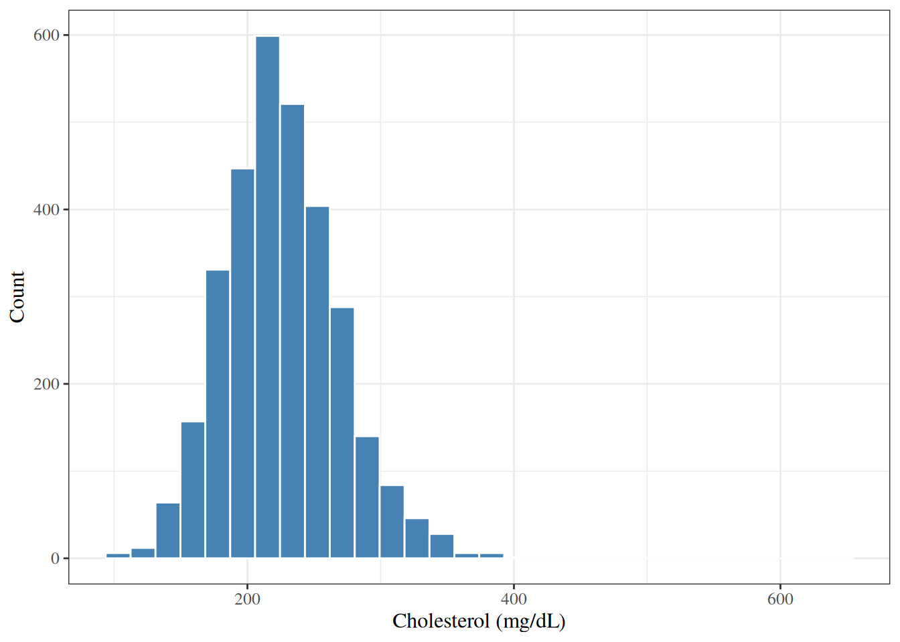
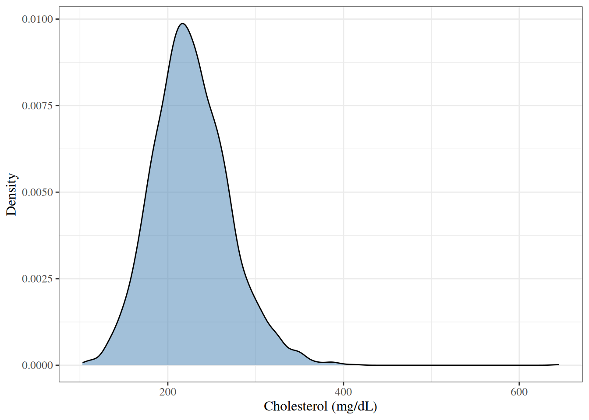
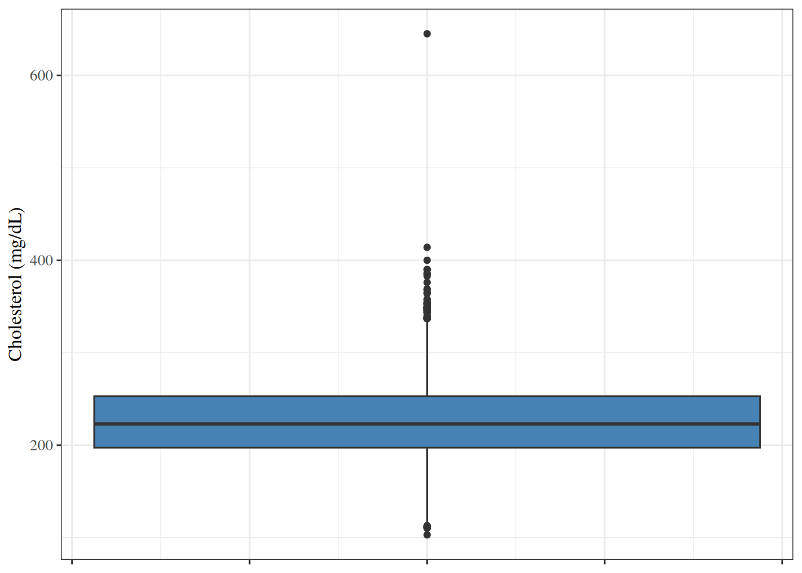
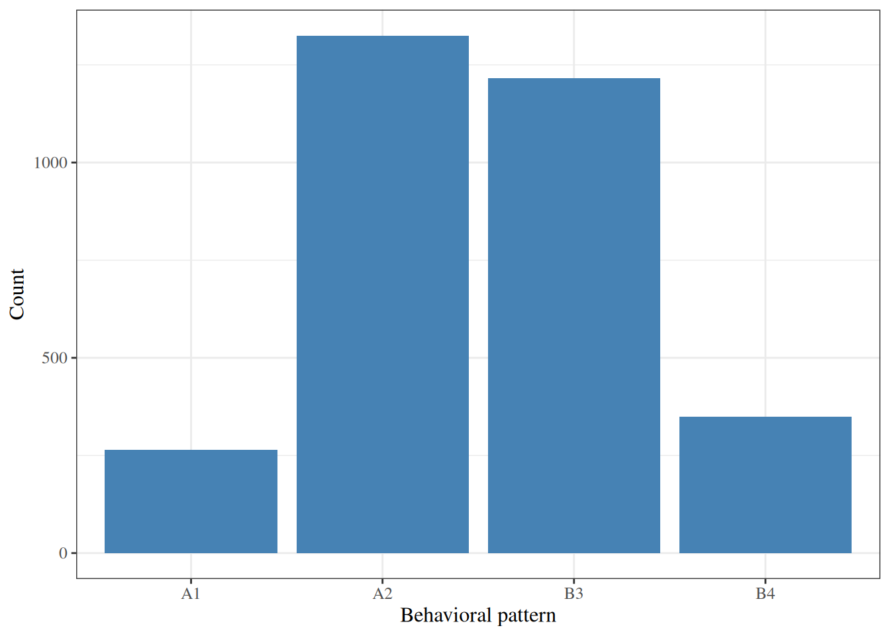
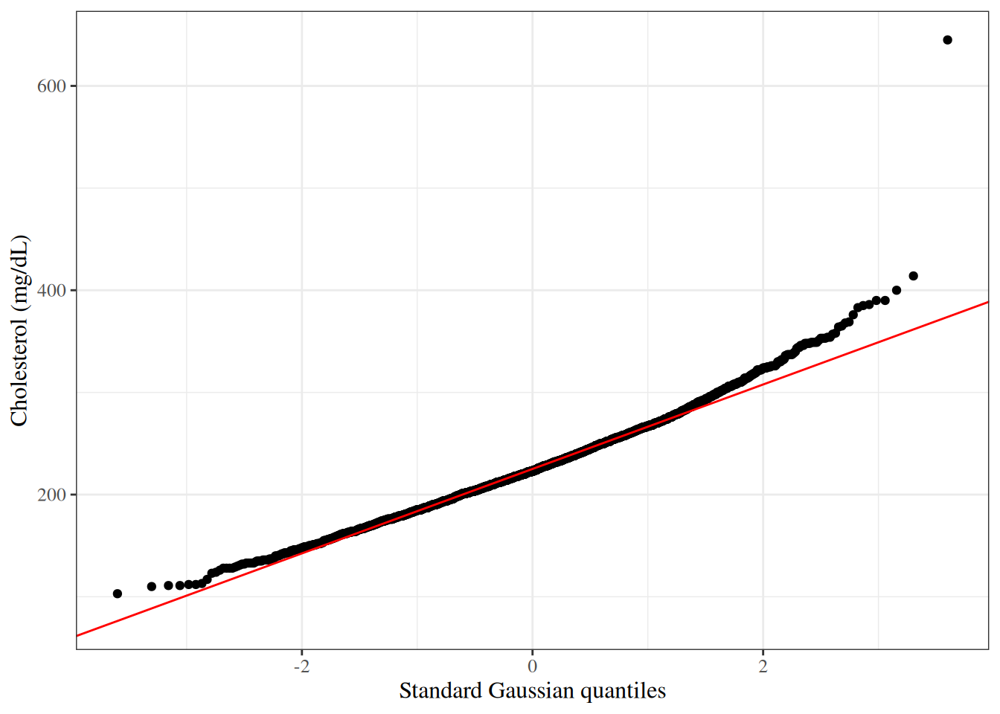
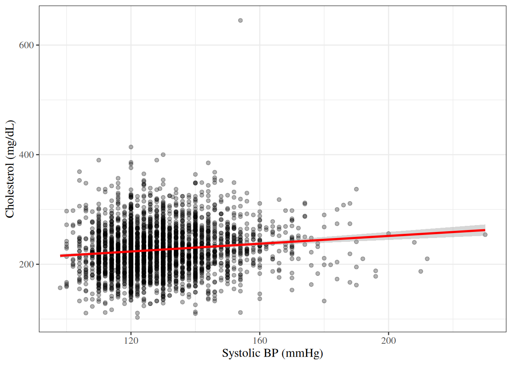
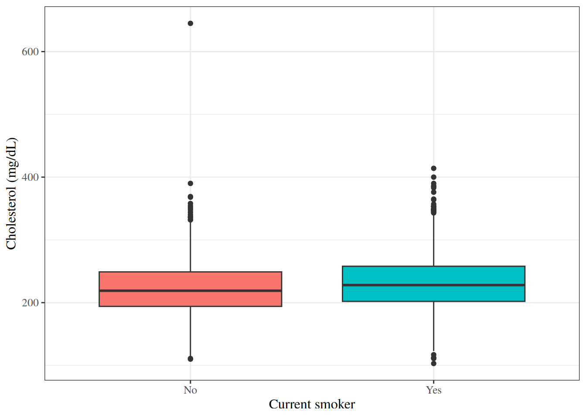
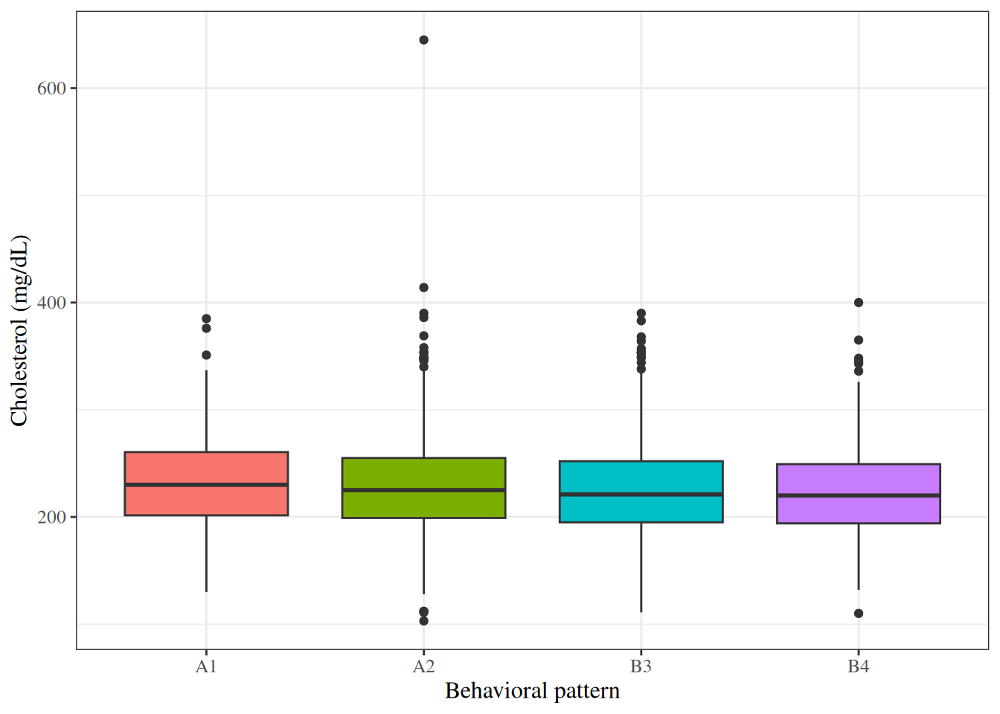
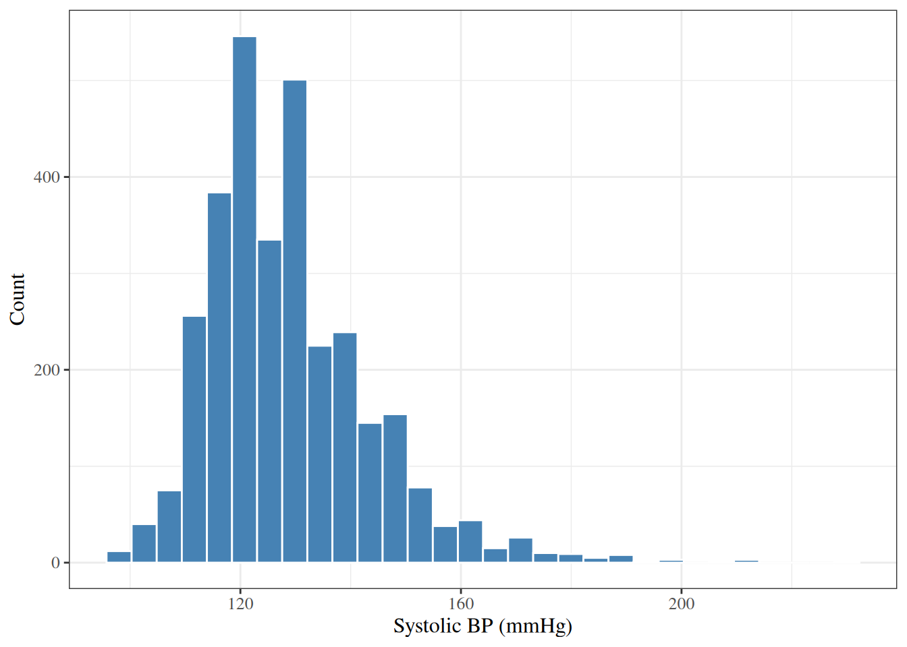
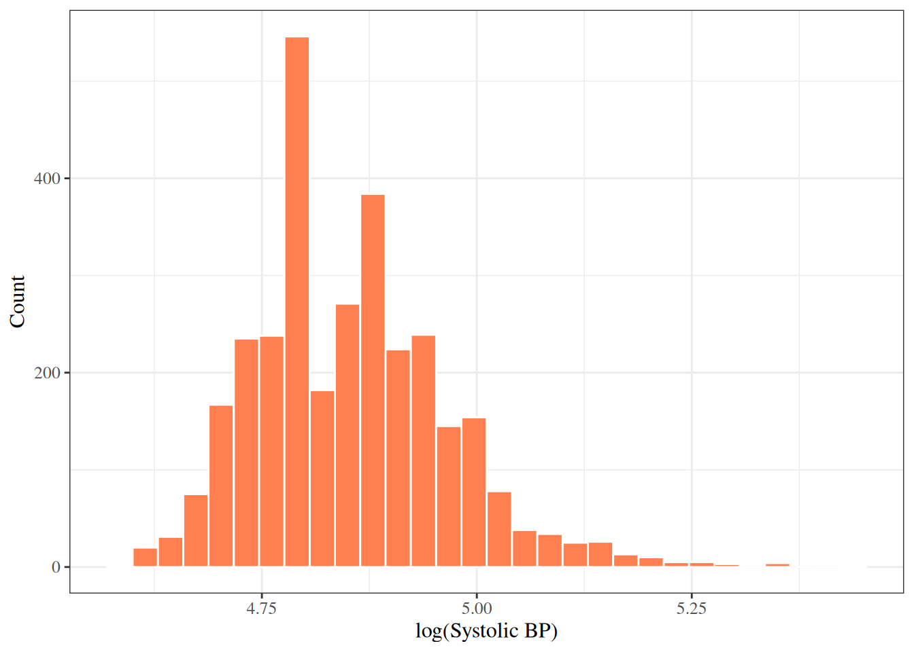

# Exploratory Data Analysis

Code

- [Show All Code](javascript:void(0))

- [Hide All Code](javascript:void(0))

- 

  ------------------------------------------------------------------------

- [View Source](javascript:void(0))

Published

Last modified: 2026-10-04 22:11:37 (PDT)

## 1 Introduction

Before fitting a model, it is good practice to explore and summarize the data. Exploratory data analysis (EDA) serves several purposes:

- understanding the distribution of each variable individually;
- detecting unusual values, outliers, and missing data;
- identifying patterns and relationships among variables;
- motivating choices of model structure, such as transformations;
- providing context for interpreting model results.

This page is adapted from ([Vittinghoff et al. 2012, chap. 2](#ref-vittinghoff2e)).

### 1.1 The WCGS data

This page illustrates exploratory data analysis using data from the Western Collaborative Group Study (WCGS) ([Rosenman et al. 1975](#ref-rosenman1975coronary)). Vittinghoff et al. ([2012, 9](#ref-vittinghoff2e)) describe the study this way:

> The Western Collaborative Group Study (WCGS) was a large epidemiological study designed to investigate the association between the “type A” behavior pattern and coronary heart disease (CHD).

> **NOTE:**
>
> **Exercise 1 (Type A behavior)** What is “type A” behavior?

> **NOTE:**
>
> *Solution 1*. From Wikipedia’s article [“Type A and Type B personality theory”](https://en.wikipedia.org/wiki/Type_A_and_Type_B_personality_theory):
>
> > The hypothesis describes Type A individuals as outgoing, ambitious, rigidly organized, highly status-conscious, impatient, anxious, proactive, and concerned with time management….
> >
> > The hypothesis describes Type B individuals as a contrast to those of Type A. Type B personalities, by definition, are noted to live at lower stress levels. They typically work steadily and may enjoy achievement, although they have a greater tendency to disregard physical or mental stress when they do not achieve.

### 1.2 Study design

The WCGS began in 1960 with 3,524 male volunteers employed by 11 California companies. Participants were 39 to 59 years old and free of heart disease, as determined by electrocardiogram. After the initial screening, various exclusions reduced the study population to 3,154 men and the number of companies to 10. The cohort comprised both blue- and white-collar employees. Average follow-up was 8.5 years, with repeat examinations.

This description paraphrases the help page for the `wcgs` dataset in the `faraway` R package.

At baseline, the study collected:

- socio-demographic characteristics: age, education, marital status, income, and occupation;
- physical and physiological measurements: height, weight, blood pressure, electrocardiogram, and corneal arcus;
- biochemical measurements: cholesterol and lipoprotein fractions;
- medical and family history, and use of medications;
- behavioral data: the Type A interview, smoking, exercise, and alcohol use.

Later surveys added anthropometry, triglycerides, the Jenkins Activity Survey, and caffeine use.

### 1.3 Loading the data

The WCGS data are distributed with Vittinghoff et al. ([2012](#ref-vittinghoff2e)) on the book’s companion website, as a Stata file that R can read directly:

``` downlit
# one unbroken string, so that link checkers test the whole URL:
url <- "https://regression.ucsf.edu/sites/g/files/tkssra16191/files/wysiwyg/home/data/wcgs.dta" # nolint: line_length_linter.
wcgs <- haven::read_dta(url)
```

The `rmb` R package includes the same file, which these notes use so that rendering does not depend on the website. [`haven::as_factor()`](https://forcats.tidyverse.org/reference/as_factor.html) converts the Stata value labels to factors:

``` downlit
wcgs <- rmb::wcgs |> haven::as_factor()
wcgs |> head()
```

Show R code

``` downlit
# attach a descriptive label to each variable;
# gtsummary tables print these labels instead of the column names:
wcgs_labels <- c(
  age = "Age (years)",
  chol = "Cholesterol (mg/dL)",
  sbp = "Systolic BP (mmHg)",
  dbp = "Diastolic BP (mmHg)",
  bmi = "BMI (kg/m^2)",
  weight = "Weight (lbs)",
  ncigs = "Cigarettes per day",
  chd69 = "CHD event by 1969",
  smoke = "Current smoker",
  arcus = "Arcus senilis",
  dibpat = "Behavioral pattern (A/B)",
  behpat = "Behavioral pattern (A1/A2/B3/B4)",
  wghtcat = "Weight category",
  agec = "Age group"
)
for (var in names(wcgs_labels)) {
  attr(wcgs[[var]], "label") <- wcgs_labels[[var]]
}

wcgs_labels
#>                                age                               chol 
#>                      "Age (years)"              "Cholesterol (mg/dL)" 
#>                                sbp                                dbp 
#>               "Systolic BP (mmHg)"              "Diastolic BP (mmHg)" 
#>                                bmi                             weight 
#>                     "BMI (kg/m^2)"                     "Weight (lbs)" 
#>                              ncigs                              chd69 
#>               "Cigarettes per day"                "CHD event by 1969" 
#>                              smoke                              arcus 
#>                   "Current smoker"                    "Arcus senilis" 
#>                             dibpat                             behpat 
#>         "Behavioral pattern (A/B)" "Behavioral pattern (A1/A2/B3/B4)" 
#>                            wghtcat                               agec 
#>                  "Weight category"                        "Age group"
```

The dataset has one row per participant:

``` downlit
dplyr::glimpse(wcgs)
#> Rows: 3,154
#> Columns: 22
#> $ age      <dbl> 50, 51, 59, 51, 44, 47, 40, 41, 50, 43, 59, 54, 48, 39, 49, 5…
#> $ arcus    <dbl> 1, 0, 1, 1, 0, 0, 0, 0, 1, 0, 0, 0, 0, 0, 0, 1, 0, 0, 0, 0, 1…
#> $ behpat   <fct> A1, A1, A1, A1, A1, A1, A1, A1, A1, A1, A1, A1, A1, A1, A1, A…
#> $ bmi      <dbl> 31.3210, 25.3286, 28.6939, 22.1487, 22.3130, 27.1177, 23.2420…
#> $ chd69    <fct> No, No, No, No, No, No, No, No, No, No, No, No, No, Yes, No, …
#> $ chol     <dbl> 249, 194, 258, 173, 214, 206, 190, 212, 130, 233, 181, 214, 2…
#> $ dbp      <dbl> 90, 74, 94, 80, 80, 76, 78, 84, 70, 80, 86, 76, 78, 74, 80, 7…
#> $ dibpat   <fct> Type A, Type A, Type A, Type A, Type A, Type A, Type A, Type …
#> $ height   <dbl> 67, 73, 70, 69, 71, 64, 70, 70, 71, 68, 72, 67, 71, 70, 73, 7…
#> $ id       <dbl> 2343, 3656, 3526, 22057, 12927, 16029, 3894, 11389, 12681, 10…
#> $ lnsbp    <dbl> 4.88280, 4.78749, 5.06259, 4.83628, 4.83628, 4.75359, 4.80402…
#> $ lnwght   <dbl> 5.29832, 5.25750, 5.29832, 5.01064, 5.07517, 5.06259, 5.08760…
#> $ ncigs    <dbl> 25, 25, 0, 0, 0, 80, 0, 25, 0, 25, 10, 0, 20, 0, 4, 0, 0, 20,…
#> $ sbp      <dbl> 132, 120, 158, 126, 126, 116, 122, 130, 112, 120, 130, 118, 1…
#> $ smoke    <fct> Yes, Yes, No, No, No, Yes, No, Yes, No, Yes, Yes, No, Yes, No…
#> $ t1       <dbl> -1.633353, -4.063366, 0.639729, 1.121768, 2.425011, -0.787520…
#> $ time169  <dbl> 1367, 2991, 2960, 3069, 3081, 2114, 2929, 3010, 3104, 2861, 2…
#> $ typchd69 <dbl> 0, 0, 0, 0, 0, 0, 0, 0, 0, 0, 0, 0, 0, 1, 0, 0, 0, 0, 0, 0, 0…
#> $ uni      <dbl> 0.4860738, 0.1859543, 0.7277991, 0.6244636, 0.3789776, 0.7355…
#> $ weight   <dbl> 200, 192, 200, 150, 160, 158, 162, 160, 195, 187, 206, 152, 1…
#> $ wghtcat  <fct> 170-200, 170-200, 170-200, 140-170, 140-170, 140-170, 140-170…
#> $ agec     <fct> 46-50, 51-55, 56-60, 51-55, 41-45, 46-50, 35-40, 41-45, 46-50…
```

## 2 Summarizing a single variable

### 2.1 Measures of center

> **NOTE:**
>
> **Definition 1 (Sample mean)** The **sample mean** of \\n\\ observations \\x_1, \ldots, x_n\\ is:
>
> \\\bar{x} \stackrel{\text{def}}{=}\frac{1}{n} \sum\_{i=1}^{n} x_i\\

> **NOTE:**
>
> **Example 1 (Mean cholesterol in the WCGS)** Total cholesterol (`chol`) is missing for 12 of the 3154 WCGS participants. The sample mean of the remaining 3142 values is:
>
> ``` downlit
> mean(wcgs$chol, na.rm = TRUE)
> #> [1] 226.372
> ```

> **NOTE:**
>
> **Definition 2 (Sample median)** The **sample median** is the middle value when the observations are sorted in increasing order. In terms of the [order statistics](nonparametric-models.llms.md#def-order-statistics) \\x\_{(1)} \le \cdots \le x\_{(n)}\\:
>
> - if \\n\\ is odd, the median is \\x\_{((n+1)/2)}\\;
> - if \\n\\ is even, the median is \\\frac{1}{2}\mathopen{}\left(x\_{(n/2)} + x\_{(n/2 + 1)}\right)\mathclose{}\\.

> **NOTE:**
>
> **Example 2 (Median cholesterol in the WCGS)**  
>
> ``` downlit
> median(wcgs$chol, na.rm = TRUE)
> #> [1] 223
> ```
>
> The median cholesterol is a little lower than the mean ([Example 1](#exm-sample-mean)). Cholesterol has a longer right tail than left tail (the maximum is 645 mg/dL), and the large values in that tail pull the mean upward but barely change which value is in the middle. A median is less sensitive to extreme values than a mean.

### 2.2 Measures of spread

> **NOTE:**
>
> **Definition 3 (Sample variance)** The **sample variance** of \\n \ge 2\\ observations is:
>
> \\s^2 \stackrel{\text{def}}{=}\frac{1}{n-1} \sum\_{i=1}^{n} (x_i - \bar{x})^2\\

> **NOTE:**
>
> **Definition 4 (Sample standard deviation)** The **sample standard deviation** is the square root of the [sample variance](#def-sample-variance):
>
> \\s \stackrel{\text{def}}{=}\sqrt{s^2}\\

The standard deviation has the same units as the observations, which makes it easier to interpret than the variance, whose units are squared.

> **NOTE:**
>
> **Example 3 (Variance and standard deviation of cholesterol in the WCGS)**  
>
> ``` downlit
> var(wcgs$chol, na.rm = TRUE)
> #> [1] 1885.33
> sd(wcgs$chol, na.rm = TRUE)
> #> [1] 43.4204
> ```
>
> The sample variance is in (mg/dL)², and the sample standard deviation is in mg/dL, like the cholesterol values themselves.

> **NOTE:**
>
> **Definition 5 (Quartiles)** The **first quartile** \\Q_1\\ and the **third quartile** \\Q_3\\ are the sample 0.25 and 0.75 quantiles ([sample quantile](nonparametric-models.llms.md#def-sample-quantile)), also called the 25th and 75th percentiles.

With an odd number of observations, the sample 0.5 quantile equals the [sample median](#def-sample-median); with an even number they can differ, because the median averages the two middle order statistics. Software packages compute quartiles with different quantile definitions, so they can disagree slightly for the same data ([quantile conventions](nonparametric-models.llms.md#quantile-conventions)); R’s `quantile(type = 1)` matches these notes’ definition, and R’s default, `type = 7`, interpolates.

> **NOTE:**
>
> **Definition 6 (Interquartile range)** The **interquartile range** (IQR) is the difference between the third and first [quartiles](#def-quartiles):
>
> \\\text{IQR} \stackrel{\text{def}}{=}Q_3 - Q_1\\

> **NOTE:**
>
> **Example 4 (Quartiles and IQR of cholesterol in the WCGS)**  
>
> ``` downlit
> quantile(wcgs$chol, probs = c(0.25, 0.75), na.rm = TRUE, type = 1)
> #> 25% 75% 
> #> 197 253
> IQR(wcgs$chol, na.rm = TRUE, type = 1)
> #> [1] 56
> ```
>
> The middle half of the cholesterol values span 56 mg/dL. Like the median, the IQR does not depend on the most extreme values, so it is less sensitive to outliers than the standard deviation.

### 2.3 Summary statistics in R

The [`summary()`](https://rdrr.io/r/base/summary.html) function reports the minimum, quartiles, mean, maximum, and number of missing values in one call; its quartiles use R’s default interpolating quantile rule (`type = 7`), so they can differ slightly from [Definition 5](#def-quartiles):

``` downlit
summary(wcgs$chol)
#>    Min. 1st Qu.  Median    Mean 3rd Qu.    Max.     NAs 
#>     103     197     223     226     253     645      12
```

For a formatted table of several variables at once, [`gtsummary::tbl_summary()`](https://www.danieldsjoberg.com/gtsummary/reference/tbl_summary.html) is useful ([Table 1](#tbl-wcgs-summary-continuous)).

``` downlit
wcgs |>
  dplyr::select(age, chol, sbp, dbp, bmi, weight) |>
  gtsummary::tbl_summary(
    statistic = list(
      gtsummary::all_continuous() ~
        "{mean} ({sd}); {median} [{p25}, {p75}]"
    ),
    digits = gtsummary::all_continuous() ~ 1
  )
```

| **Characteristic**             | **N = 3,154**¹                       |
|--------------------------------|--------------------------------------|
| Age (years)                    | 46.3 (5.5); 45.0 \[42.0, 50.0\]      |
| Cholesterol (mg/dL)            | 226.4 (43.4); 223.0 \[197.0, 253.0\] |
|     Unknown                    | 12                                   |
| Systolic BP (mmHg)             | 128.6 (15.1); 126.0 \[120.0, 136.0\] |
| Diastolic BP (mmHg)            | 82.0 (9.7); 80.0 \[76.0, 86.0\]      |
| BMI (kg/m^2)                   | 24.5 (2.6); 24.4 \[23.0, 25.8\]      |
| Weight (lbs)                   | 170.0 (21.1); 170.0 \[155.0, 182.0\] |
| ¹ Mean (SD); Median \[Q1, Q3\] |                                      |

Table 1: WCGS: descriptive statistics for continuous variables

### 2.4 Binary and categorical variables

> **NOTE:**
>
> **Definition 7 (Sample proportion)** For a binary variable with values coded 1 (“success”) and 0, the **sample proportion** of successes is:
>
> \\\hat{p} \stackrel{\text{def}}{=}\frac{k}{n}\\
>
> where \\k\\ is the number of successes and \\n\\ is the number of observations.

> **NOTE:**
>
> **Example 5 (Proportion of WCGS participants with a CHD event)**  
>
> ``` downlit
> table(wcgs$chd69)
> #> 
> #>   No  Yes 
> #> 2897  257
> mean(wcgs$chd69 == "Yes")
> #> [1] 0.0814838
> ```
>
> 257 of the 3154 participants had a CHD event by 1969, a sample proportion of 0.081.

For categorical variables with more than two levels, the natural descriptive statistics are the count of observations in each category and the corresponding proportions ([Table 2](#tbl-wcgs-summary-cat)).

Show R code

``` downlit
wcgs |>
  dplyr::select(chd69, smoke, dibpat, behpat, wghtcat) |>
  gtsummary::tbl_summary()
```

[TABLE]

Table 2: Frequency table for categorical variables in the WCGS dataset

## 3 Graphical methods

Graphs can reveal features of a distribution that summary statistics miss, such as skewness, multiple peaks, and outliers. Different types of graph suit different types of variable.

### 3.1 Histograms

> **NOTE:**
>
> **Definition 8 (Histogram)** A **histogram** displays the distribution of a continuous variable by dividing the variable’s range into intervals and drawing a bar over each interval whose height is the number (or proportion) of observations in that interval.

The intervals are often called *bins*.

Show R code

``` downlit
wcgs |>
  ggplot2::ggplot() +
  ggplot2::aes(x = chol) +
  ggplot2::geom_histogram(bins = 30, fill = "steelblue", color = "white") +
  ggplot2::labs(x = "Cholesterol (mg/dL)", y = "Count")
```

[](exploratory-descriptive_files/figure-html/unnamed-chunk-8-1.png "Figure 1: Histogram of total cholesterol in the WCGS dataset")

Figure 1: Histogram of total cholesterol in the WCGS dataset

[Figure 1](#fig-hist-chol) shows a single-peaked distribution with a longer right tail than left tail: 97% of the values lie between 150 and 350 mg/dL, but the largest value is 645 mg/dL.

### 3.2 Density plots

> **NOTE:**
>
> **Definition 9 (Density plot)** A **density plot** draws a smooth curve that estimates the probability density of a continuous variable, scaled so that the area under the curve is 1.

Show R code

``` downlit
wcgs |>
  ggplot2::ggplot() +
  ggplot2::aes(x = chol) +
  ggplot2::geom_density(fill = "steelblue", alpha = 0.5) +
  ggplot2::labs(x = "Cholesterol (mg/dL)", y = "Density")
```

[](exploratory-descriptive_files/figure-html/unnamed-chunk-9-1.png "Figure 2: Density plot of total cholesterol in the WCGS dataset")

Figure 2: Density plot of total cholesterol in the WCGS dataset

### 3.3 Box plots

> **NOTE:**
>
> **Definition 10 (Box plot)** A **box plot** (or box-and-whisker plot) summarizes the distribution of a continuous variable:
>
> - the box spans the first to the third [quartile](#def-quartiles), so its length is the [IQR](#def-IQR);
> - a line inside the box marks the [median](#def-sample-median);
> - the whiskers extend from the box to the most extreme observations within \\1.5 \times \text{IQR}\\ of the box;
> - observations beyond the whiskers are plotted individually, as potential outliers.

The \\1.5 \times \text{IQR}\\ whisker rule is the default in R’s [`boxplot()`](https://rdrr.io/r/graphics/boxplot.html) and [`ggplot2::geom_boxplot()`](https://ggplot2.tidyverse.org/reference/geom_boxplot.html); other software and authors use other rules, such as whiskers that run to the minimum and maximum.

Show R code

``` downlit
wcgs |>
  ggplot2::ggplot() +
  ggplot2::aes(y = chol) +
  ggplot2::geom_boxplot(fill = "steelblue") +
  ggplot2::labs(y = "Cholesterol (mg/dL)") +
  ggplot2::theme(axis.text.x = ggplot2::element_blank())
```

[](exploratory-descriptive_files/figure-html/unnamed-chunk-10-1.png "Figure 3: Box plot of total cholesterol in the WCGS dataset")

Figure 3: Box plot of total cholesterol in the WCGS dataset

### 3.4 Bar charts

> **NOTE:**
>
> **Definition 11 (Bar chart)** A **bar chart** displays the number or proportion of observations in each category of a categorical variable, as one bar per category.

Show R code

``` downlit
wcgs |>
  ggplot2::ggplot() +
  ggplot2::aes(x = behpat) +
  ggplot2::geom_bar(fill = "steelblue") +
  ggplot2::labs(x = "Behavioral pattern", y = "Count")
```

[](exploratory-descriptive_files/figure-html/unnamed-chunk-11-1.png "Figure 4: Bar chart of behavioral pattern in the WCGS dataset")

Figure 4: Bar chart of behavioral pattern in the WCGS dataset

### 3.5 Normal quantile-quantile plots

> **NOTE:**
>
> **Definition 12 (Normal quantile-quantile plot)** A **normal quantile-quantile (Q-Q) plot** plots the sorted observations ([order statistics](nonparametric-models.llms.md#def-order-statistics)) against the corresponding quantiles of a standard Gaussian distribution. If the variable is approximately Gaussian, the points fall close to a straight line.

Show R code

``` downlit
wcgs |>
  ggplot2::ggplot() +
  ggplot2::aes(sample = chol) +
  ggplot2::stat_qq() +
  ggplot2::stat_qq_line(color = "red") +
  ggplot2::labs(x = "Standard Gaussian quantiles", y = "Cholesterol (mg/dL)")
```

[](exploratory-descriptive_files/figure-html/unnamed-chunk-12-1.png "Figure 5: Normal Q-Q plot for total cholesterol in the WCGS dataset")

Figure 5: Normal Q-Q plot for total cholesterol in the WCGS dataset

In [Figure 5](#fig-qq-chol), the points curve above the reference line at the right, which matches the long right tail in [Figure 1](#fig-hist-chol).

## 4 Bivariate relationships

### 4.1 Two continuous variables

> **NOTE:**
>
> **Definition 13 (Scatter plot)** A **scatter plot** displays the joint distribution of two continuous variables by plotting each observation as a point, with one variable on each axis.

Show R code

``` downlit
wcgs |>
  ggplot2::ggplot() +
  ggplot2::aes(x = sbp, y = chol) +
  ggplot2::geom_point(alpha = 0.3) +
  ggplot2::geom_smooth(method = "lm", se = TRUE, color = "red") +
  ggplot2::labs(x = "Systolic BP (mmHg)", y = "Cholesterol (mg/dL)")
```

[](exploratory-descriptive_files/figure-html/unnamed-chunk-13-1.png "Figure 6: Cholesterol versus systolic blood pressure in the WCGS dataset, with a least-squares line")

Figure 6: Cholesterol versus systolic blood pressure in the WCGS dataset, with a least-squares line

> **NOTE:**
>
> **Definition 14 (Pearson correlation coefficient)** The **Pearson correlation coefficient** of \\n\\ paired observations \\(x_1, y_1), \ldots, (x_n, y_n)\\ is:
>
> \\r \stackrel{\text{def}}{=}\frac{\sum\_{i=1}^n (x_i - \bar{x})(y_i - \bar{y})} {\sqrt{\sum\_{i=1}^n (x_i - \bar{x})^2} \sqrt{\sum\_{i=1}^n (y_i - \bar{y})^2}}\\
>
> It is defined when neither variable is constant, so that both sums of squares are positive.

> **NOTE:**
>
> **Theorem 1 (Range of the correlation coefficient)** The Pearson correlation coefficient satisfies \\-1 \le r \le 1\\. Moreover, \\r = 1\\ if and only if the points \\(x_i, y_i)\\ lie on a straight line with positive slope, and \\r = -1\\ if and only if they lie on a straight line with negative slope.

> **NOTE:**
>
> *Proof*. Write \\a_i \stackrel{\text{def}}{=}x_i - \bar x\\ and \\b_i \stackrel{\text{def}}{=}y_i - \bar y\\, so that \\r = \sum_i a_i b_i / \mathopen{}\left(\sqrt{\sum_i a_i^2} \sqrt{\sum_i b_i^2}\right)\mathclose{}\\. The Cauchy–Schwarz inequality states that \\\mathopen{}\left\|\sum_i a_i b_i\right\|\mathclose{} \le \sqrt{\sum_i a_i^2} \sqrt{\sum_i b_i^2}\\, with equality if and only if one of the vectors \\(a_1, \ldots, a_n)\\ and \\(b_1, \ldots, b_n)\\ is a scalar multiple of the other. Dividing both sides by the (positive) right-hand side gives \\\mathopen{}\left\|r\right\|\mathclose{} \le 1\\.
>
> Equality \\\mathopen{}\left\|r\right\|\mathclose{} = 1\\ therefore holds if and only if \\b_i = c \\ a_i\\ for some constant \\c \ne 0\\ and every \\i\\, that is, \\y_i = \bar y + c(x_i - \bar x)\\: the points lie on a line with slope \\c\\. Then \\\sum_i a_i b_i = c \sum_i a_i^2\\ has the sign of \\c\\, so \\r = 1\\ when \\c \> 0\\ and \\r = -1\\ when \\c \< 0\\.

> **NOTE:**
>
> **Example 6 (Correlation between cholesterol and blood pressure in the WCGS)**  
>
> ``` downlit
> cor(wcgs$chol, wcgs$sbp, use = "complete.obs")
> #> [1] 0.123061
> ```
>
> The correlation is positive but small: cholesterol tends to be slightly higher in participants with higher systolic blood pressure, consistent with the shallow slope and wide scatter in [Figure 6](#fig-scatter-chol-sbp).

> **CAUTION:**
>
> Two variables can be strongly related and still have a correlation near zero, if the relationship is not linear. For example, if \\y_i = x_i^2\\, the \\x_i\\ are symmetric around 0, and the \\\mathopen{}\left\|x_i\right\|\mathclose{}\\ are not all equal, then \\r = 0\\, although \\y\\ is a function of \\x\\. Correlation also does not imply causation.

### 4.2 A continuous variable by a categorical variable

Side-by-side [box plots](#def-boxplot) compare the distribution of a continuous variable across the groups defined by a categorical variable ([Figure 7](#fig-box-chol-by-smoke) and [Figure 8](#fig-box-chol-by-behpat)).

Show R code

``` downlit
wcgs |>
  ggplot2::ggplot() +
  ggplot2::aes(x = smoke, y = chol, fill = smoke) +
  ggplot2::geom_boxplot() +
  ggplot2::labs(x = "Current smoker", y = "Cholesterol (mg/dL)") +
  ggplot2::theme(legend.position = "none")
```

[](exploratory-descriptive_files/figure-html/unnamed-chunk-14-1.png "Figure 7: Box plots of cholesterol by smoking status in the WCGS dataset")

Figure 7: Box plots of cholesterol by smoking status in the WCGS dataset

Show R code

``` downlit
wcgs |>
  ggplot2::ggplot() +
  ggplot2::aes(x = behpat, y = chol, fill = behpat) +
  ggplot2::geom_boxplot() +
  ggplot2::labs(x = "Behavioral pattern", y = "Cholesterol (mg/dL)") +
  ggplot2::theme(legend.position = "none")
```

[](exploratory-descriptive_files/figure-html/unnamed-chunk-15-1.png "Figure 8: Box plots of cholesterol by behavioral pattern in the WCGS dataset")

Figure 8: Box plots of cholesterol by behavioral pattern in the WCGS dataset

[Table 3](#tbl-chol-by-chd) computes summary statistics separately for each group.

Show R code

``` downlit
wcgs |>
  dplyr::select(chol, sbp, bmi, chd69) |>
  gtsummary::tbl_summary(
    by = chd69,
    statistic = list(
      gtsummary::all_continuous() ~
        "{mean} ({sd})"
    ),
    digits = gtsummary::all_continuous() ~ 1
  ) |>
  gtsummary::add_overall()
```

[TABLE]

Table 3: Cholesterol, systolic blood pressure, and BMI by CHD status in the WCGS

### 4.3 Two categorical variables

> **NOTE:**
>
> **Definition 15 (Contingency table)** A **contingency table** (or **cross-tabulation**) displays the joint frequencies of two categorical variables: each cell counts the observations with one combination of categories. For two binary variables, the contingency table is a \\2 \times 2\\ table with cells \\a\\, \\b\\, \\c\\, and \\d\\:
>
> |              | Outcome = 1 | Outcome = 0 |   Total   |
> |--------------|:-----------:|:-----------:|:---------:|
> | Exposure = 1 |    \\a\\    |    \\b\\    | \\a + b\\ |
> | Exposure = 0 |    \\c\\    |    \\d\\    | \\c + d\\ |
> | Total        |  \\a + c\\  |  \\b + d\\  |   \\n\\   |

> **NOTE:**
>
> **Example 7 (Smoking and CHD in the WCGS)**  
>
> ``` downlit
> table(Smoking = wcgs$smoke, CHD = wcgs$chd69)
> #>        CHD
> #> Smoking   No  Yes
> #>     No  1554   98
> #>     Yes 1343  159
> ```
>
> Row proportions give the distribution of CHD status within each smoking group:
>
> ``` downlit
> table(Smoking = wcgs$smoke, CHD = wcgs$chd69) |>
>   prop.table(margin = 1)
> #>        CHD
> #> Smoking       No      Yes
> #>     No  0.940678 0.059322
> #>     Yes 0.894141 0.105859
> ```
>
> [Table 4](#tbl-gtsummary-smoke-chd) shows the same counts as a formatted table.
>
> Show R code
>
> ``` downlit
> wcgs |>
>   dplyr::select(smoke, chd69) |>
>   gtsummary::tbl_summary(by = chd69) |>
>   gtsummary::add_overall()
> ```
>
> [TABLE]
>
> Table 4: Smoking status and CHD event in the WCGS

## 5 Data transformations

When a continuous variable has a right-skewed distribution (a longer tail to the right than to the left), a logarithmic transformation often makes the distribution more symmetric. A log-transformed variable also has a multiplicative interpretation: an increase of 1 in \\\log(x)\\ corresponds to multiplying \\x\\ by \\e \approx 2.72\\, because \\\log(x) + 1 = \log(e \cdot x)\\.

The WCGS dataset already contains log-transformed versions of two variables:

- `lnsbp`: \\\log(\text{SBP})\\;
- `lnwght`: \\\log(\text{weight})\\.

Show R code

``` downlit
wcgs |>
  ggplot2::ggplot() +
  ggplot2::aes(x = sbp) +
  ggplot2::geom_histogram(bins = 30, fill = "steelblue", color = "white") +
  ggplot2::labs(x = "Systolic BP (mmHg)", y = "Count")
```

[](exploratory-descriptive_files/figure-html/unnamed-chunk-18-1.png "Figure 9 (a): Raw scale")

\(a\) Raw scale

Show R code

``` downlit
wcgs |>
  ggplot2::ggplot() +
  ggplot2::aes(x = lnsbp) +
  ggplot2::geom_histogram(bins = 30, fill = "coral", color = "white") +
  ggplot2::labs(x = "log(Systolic BP)", y = "Count")
```

[](exploratory-descriptive_files/figure-html/unnamed-chunk-19-1.png "Figure 9 (b): Log scale")

\(b\) Log scale

Figure 9: Distribution of systolic blood pressure in the WCGS, on two scales

Show R code

``` downlit
# sample skewness: mean cubed deviation, divided by the cubed SD
skewness <- function(x) {
  x <- x[!is.na(x)]
  mean((x - mean(x))^3) / sd(x)^3
}
sbp_skew <- c(
  raw = skewness(wcgs$sbp),
  log = skewness(wcgs$lnsbp)
)
sbp_skew
#>      raw      log 
#> 1.203824 0.739911
```

The log-transformed SBP is less skewed than the raw SBP (sample skewness 0.74 versus 1.2), but still not symmetric. Whether to transform a variable in a regression model depends on the assumptions of that model and on the scientific question.

### 5.1 Rescaling a variable

> **NOTE:**
>
> **Exercise 2 (A standardized cholesterol value)** In the WCGS data, cholesterol (`chol`) is measured in mg/dL.
>
> 1.  Compute the sample mean and sample standard deviation of `chol`.
> 2.  A man has `chol` equal to 250 mg/dL. By how many standard deviations does his value differ from the sample mean, and in which direction?
> 3.  What are the units of your answer to part 2?

> **NOTE:**
>
> *Solution 2*.
>
> ``` downlit
> chol_mean <- mean(wcgs$chol, na.rm = TRUE)
> chol_sd <- sd(wcgs$chol, na.rm = TRUE)
> chol_z <- (250 - chol_mean) / chol_sd
> c(mean = chol_mean, sd = chol_sd, z_250 = chol_z)
> #>       mean         sd      z_250 
> #> 226.372374  43.420426   0.544159
> ```
>
> 1.  The sample mean is 226.4 mg/dL and the sample standard deviation is 43.4 mg/dL.
>
> 2.  \\(250 - \bar x) / s\\ is 0.54: his cholesterol is 0.54 standard deviations above the sample mean.
>
> 3.  The numerator is in mg/dL and the denominator is in mg/dL, so the answer has no units.

> **NOTE:**
>
> **Definition 16 (Standardization)** Let \\x_1, \ldots, x_n\\ be \\n \ge 2\\ observations of a variable with [sample mean](#def-sample-mean) \\\bar x\\ and [sample standard deviation](#def-sample-sd) \\s \> 0\\. The **standardized value** of \\x_i\\ is
>
> \\z_i \stackrel{\text{def}}{=}\frac{x_i - \bar x}{s}\\

> **NOTE:**
>
> *Remark 1* (Standardized values have no units). In [Exercise 2](#exr-standardize), the standardized value of a cholesterol of 250 mg/dL is the number of sample standard deviations between 250 and the sample mean. Standardizing puts variables measured in different units on a comparable scale. For example, a salary in dollars and an age in years both become unitless numbers of standard deviations.

> **NOTE:**
>
> **Theorem 2 (Standardized values have mean 0 and standard deviation 1)** For \\n \ge 2\\ observations with \\s \> 0\\, the [standardized values](#def-standardization) \\z_1, \ldots, z_n\\ have sample mean \\0\\ and sample standard deviation \\1\\.

> **NOTE:**
>
> *Proof*. The sample mean of the \\z_i\\ is \\\frac{1}{n} \sum\_{i=1}^n \frac{x_i - \bar x}{s} = \frac{1}{s} \mathopen{}\left(\frac{1}{n} \sum\_{i=1}^n x_i - \bar x\right)\mathclose{} = \frac{1}{s} (\bar x - \bar x) = 0.\\ Since the mean of the \\z_i\\ is \\0\\, their sample variance is \\\frac{1}{n-1} \sum\_{i=1}^n z_i^2 = \frac{1}{s^2} \cdot \frac{1}{n-1} \sum\_{i=1}^n (x_i - \bar x)^2 = \frac{s^2}{s^2} = 1,\\ so their sample standard deviation is \\\sqrt{1} = 1\\.

> **NOTE:**
>
> **Example 8 (Standardizing cholesterol in R)** In R, [`scale()`](https://rdrr.io/r/base/scale.html) returns the standardized values of a column, as a one-column matrix. For the WCGS cholesterol values:
>
> ``` downlit
> z <- scale(wcgs$chol)[, 1]
> mean(z, na.rm = TRUE)
> #> [1] 2.79926e-16
> sd(z, na.rm = TRUE)
> #> [1] 1
> ```
>
> The mean is \\0\\ up to rounding error, and the standard deviation is \\1\\, as [Theorem 2](#thm-standardized-mean-sd) says. The `na.rm = TRUE` is needed because 12 of the cholesterol values are missing.

> **NOTE:**
>
> **Definition 17 (Min-max scaling)** Let \\x_1, \ldots, x_n\\ be observations of a variable with minimum \\x\_{\min}\\ and maximum \\x\_{\max} \> x\_{\min}\\. The **min-max scaled value** of \\x_i\\ is
>
> \\\frac{x_i - x\_{\min}}{x\_{\max} - x\_{\min}}\\

> **NOTE:**
>
> *Remark 2* (Min-max scaling and outliers). Every min-max scaled value lies in \\\[0, 1\]\\: the minimum maps to \\0\\ and the maximum maps to \\1\\. For example, if median incomes range from 0 to 15, an income of 0 maps to \\0\\, and an income of 15 maps to \\1\\.
>
> Min-max scaling is sensitive to outliers. For example, suppose one income of 100 is recorded by mistake. The maximum is then 100, so min-max scaling maps all the other incomes into \\\[0, 0.15\]\\. [Standardization](#def-standardization) changes them much less ([Géron 2017, chap. 2](#ref-geron2017hands), “Feature Scaling”).

> **NOTE:**
>
> **Example 9 (Min-max scaling of cholesterol in the WCGS)**  
>
> ``` downlit
> chol_range <- range(wcgs$chol, na.rm = TRUE)
> chol_minmax <- (wcgs$chol - chol_range[1]) / diff(chol_range)
> range(chol_minmax, na.rm = TRUE)
> #> [1] 0 1
> ```
>
> The smallest cholesterol value maps to 0 and the largest maps to 1. The scaled values keep the shape of the distribution but have no units.

## 6 An exploratory data analysis workflow

A typical exploratory data analysis proceeds as follows:

1.  **Understand the dataset**: the number of observations and variables, and each variable’s type.
2.  **Examine each variable individually**:
    - continuous: histogram, box plot, mean, SD, median, IQR;
    - categorical: bar chart, frequency table;
    - note missing values, unusual values, and outliers.
3.  **Examine relationships between variables**:
    - two continuous variables: scatter plot, correlation;
    - continuous by categorical: side-by-side box plots, group means;
    - two categorical variables: contingency table.
4.  **Consider transformations** for skewed continuous variables.
5.  **Summarize the findings** to guide model-building decisions.

[Table 5](#tbl-wcgs-all-summary) summarizes selected WCGS variables in one table.

Show R code

``` downlit
wcgs |>
  dplyr::select(
    age, chol, sbp, dbp, bmi, weight, ncigs,
    chd69, smoke, dibpat, behpat
  ) |>
  gtsummary::tbl_summary()
```

[TABLE]

Table 5: Summary of selected WCGS variables

## References

Géron, Aurélien. 2017. *Hands-on Machine Learning with Scikit-Learn and TensorFlow*. 1st ed. O’Reilly Media.

Rosenman, Ray H, Richard J Brand, C David Jenkins, Meyer Friedman, Reuben Straus, and Moses Wurm. 1975. “Coronary Heart Disease in the Western Collaborative Group Study: Final Follow-up Experience of 8 1/2 Years.” *JAMA* 233 (8): 872–77. <https://doi.org/10.1001/jama.1975.03260080034016>.

Vittinghoff, Eric, David V Glidden, Stephen C Shiboski, and Charles E McCulloch. 2012. *Regression Methods in Biostatistics: Linear, Logistic, Survival, and Repeated Measures Models*. 2nd ed. Springer. <https://doi.org/10.1007/978-1-4614-1353-0>.

Back to top
