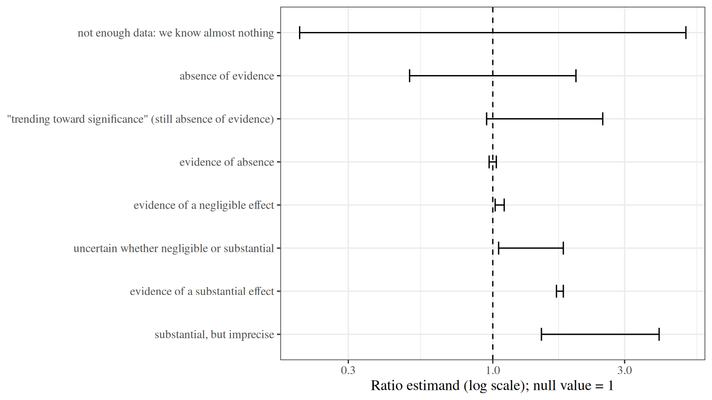

# Statistical Inference

Code

Published

Last modified: 2026-10-04 23:12:19 (PDT)

## 1 Inference

> **NOTE:**
>
> **Definition 1 (Statistical inference)** **Statistical inference** is the process of analyzing data to learn about the shape and structure of the probability distribution that generated those data.

This definition is adapted from Wikipedia’s ([Wikipedia contributors 2025](#ref-wp:statinference)).

> **NOTE:**
>
> **Example 1 (Inference about cholesterol in the WCGS population)** The [WCGS](exploratory-descriptive.llms.md#sec-wcgs-data) measured total cholesterol in 3,142 of its 3,154 participants. Using those measurements to learn about the distribution of cholesterol among men like the participants, for example its mean, and quantifying how uncertain that knowledge is, is statistical inference.

Statistical inference typically consists of two steps:

1.  fitting a statistical model to data;
2.  summarizing our uncertainty about the parameters of the fitted model, based on the data (and, in Bayesian inference, on prior beliefs).

There are two predominant paradigms for statistical inference:

- frequentist inference, which treats parameters as fixed unknown constants;
- Bayesian inference, which treats parameters as random variables with prior distributions.

## 2 Hypothesis tests

### 2.1 Hypotheses

> **NOTE:**
>
> **Definition 2 (Null hypothesis)** The **null hypothesis**, written \\H_0\\, is a specific claim about the parameters of a statistical model, which a hypothesis test assesses against the data.

> **NOTE:**
>
> **Definition 3 (Alternative hypothesis)** The **alternative hypothesis**, written \\H_1\\ or \\H_A\\, is the claim that a hypothesis test weighs the data as evidence *for*, against the [null hypothesis](#def-null-hypothesis).

> **NOTE:**
>
> **Definition 4 (Two-sided alternative)** For a null hypothesis that a parameter equals a value, such as \\H_0: \theta = \theta_0\\, the **two-sided alternative** is that the parameter differs from that value in either direction: \\H_1: \theta \ne \theta_0\\.

> **NOTE:**
>
> **Example 2 (Cholesterol and CHD in the WCGS)** Let \\\mu_1\\ and \\\mu_0\\ be the mean cholesterol of men who do and do not have a CHD event by 1969, in the population the WCGS sampled. A comparison of the two groups tests the null hypothesis that the means are equal against the [two-sided alternative](#def-two-sided-alternative) that they differ:
>
> \\H_0: \mu_1 = \mu_0 \qquad H_1: \mu_1 \ne \mu_0\\

### 2.2 p-values

> **NOTE:**
>
> **Definition 5 (Test statistic)** A **test statistic** \\T\\ is a function of the data whose distribution under the [null hypothesis](#def-null-hypothesis) is known, exactly or approximately, and whose larger values are more extreme, meaning less consistent with \\H_0\\ and more consistent with \\H_1\\.

> **NOTE:**
>
> **Definition 6 (p-value)** Given a [test statistic](#def-test-statistic) \\T\\ whose observed value is \\t\\, the **p-value** is the probability that \\T\\ is at least as extreme as the value observed, computed with the data distributed as the null hypothesis specifies:
>
> \\p \stackrel{\text{def}}{=}\Pr\_{H_0}(T \ge t)\\
>
> If the null hypothesis allows more than one distribution (a *composite* null hypothesis, such as \\H_0: \mu_1 = \mu_0\\ with unknown variances), the p-value is the largest such probability over those distributions, or an approximation to it.

A p-value is computed assuming \\H_0\\ is true, so it is not the probability that \\H_0\\ is true given the data.

> **NOTE:**
>
> **Definition 7 (Significance level)** A hypothesis test with **significance level** \\\alpha\\ rejects the [null hypothesis](#def-null-hypothesis) when the [p-value](#def-p-value) is at most \\\alpha\\.

\\\alpha = 0.05\\ is a common convention, not a rule. When \\H_0\\ is true and the p-value is computed exactly, a test with significance level \\\alpha\\ rejects \\H_0\\ with probability at most \\\alpha\\; for a test based on an approximate p-value, such as a large-sample test, this holds only approximately.

> **NOTE:**
>
> **Definition 8 (Statistically significant)** A result is **statistically significant** at level \\\alpha\\ if it leads a test with [significance level](#def-significance-level) \\\alpha\\ to reject the null hypothesis.

> **NOTE:**
>
> **Example 3 (Testing whether mean cholesterol differs by CHD status)** Continuing [Example 2](#exm-hypotheses-wcgs), let \\\bar x_1\\ and \\\bar x_0\\ be the two groups’ sample mean cholesterol, with sample variances \\s_1^2\\ and \\s_0^2\\ and sample sizes \\n_1\\ and \\n_0\\. By the [central limit theorem](https://morrison-lab.github.io/pds/limit-theorems.html#sec-clt), when \\H_0\\ holds and the samples are large, the statistic
>
> \\Z \stackrel{\text{def}}{=}\frac{\bar x_1 - \bar x_0}{\sqrt{s_1^2/n_1 + s_0^2/n_0}}\\
>
> has approximately a standard Gaussian distribution. Extreme values in either direction are evidence for the two-sided \\H_1\\, so the test statistic is \\T = \mathopen{}\left\|Z\right\|\mathclose{}\\, and the p-value is \\\Pr(\mathopen{}\left\|Z\right\|\mathclose{} \ge \mathopen{}\left\|z\right\|\mathclose{}) = 2\Phi(-\mathopen{}\left\|z\right\|\mathclose{})\\, where \\\Phi\\ is the standard Gaussian CDF.
>
> ``` downlit
> chol_by_chd <- split(wcgs$chol, wcgs$chd69) |>
>   lapply(function(x) x[!is.na(x)])
> x1 <- chol_by_chd[["Yes"]]
> x0 <- chol_by_chd[["No"]]
> diff_means <- mean(x1) - mean(x0)
> se_diff <- sqrt(var(x1) / length(x1) + var(x0) / length(x0))
> z <- diff_means / se_diff
> p_value <- 2 * pnorm(-abs(z))
> c(difference = diff_means, se = se_diff, z = z, p_value = p_value)
> #>  difference          se           z     p_value 
> #> 2.58087e+01 3.17988e+00 8.11626e+00 4.80780e-16
> ```
>
> The p-value is far below 0.05, so at significance level 0.05 the test rejects \\H_0\\: the data provide [statistically significant](#def-statistically-significant) evidence that mean cholesterol differs between the two groups.

## 3 Reference distributions

The tests on this page compare a test statistic with one of three families of distributions, each built from independent standard Gaussian random variables. Here, “independent” means mutually [independent](https://morrison-lab.github.io/pds/independence.html#def-indpt).

> **NOTE:**
>
> **Definition 9 (Chi-square distribution)** Let \\Z_1, \ldots, Z_k\\ be independent random variables, each with the standard Gaussian distribution. The distribution of \\\sum\_{j=1}^k Z_j^2\\ is the **chi-square distribution with \\k\\ degrees of freedom**, written \\\chi^2_k\\.

> **NOTE:**
>
> **Example 4 (The 0.95 quantile of \\\chi^2_1\\)** By [Definition 9](#def-chi-square-dist), a \\\chi^2_1\\ random variable is \\Z^2\\ for a standard Gaussian \\Z\\. So \\\Pr(Z^2 \le c) = \Pr(-\sqrt{c} \le Z \le \sqrt{c})\\, and the 0.95 quantile of \\\chi^2_1\\ is the square of the 0.975 quantile of the standard Gaussian distribution:
>
> ``` downlit
> c(chisq = qchisq(0.95, df = 1), gaussian_squared = qnorm(0.975)^2)
> #>            chisq gaussian_squared 
> #>          3.84146          3.84146
> ```

> **NOTE:**
>
> **Definition 10 (t-distribution)** Let \\Z\\ have the standard Gaussian distribution, let \\V\\ have the \\\chi^2_k\\ distribution ([Definition 9](#def-chi-square-dist)), and let \\Z\\ and \\V\\ be independent. The distribution of
>
> \\\frac{Z}{\sqrt{V/k}}\\
>
> is the **t-distribution with \\k\\ degrees of freedom** (or Student’s t-distribution), written \\t_k\\.

> **NOTE:**
>
> **Example 5 (t quantiles approach Gaussian quantiles)** The 0.975 quantile of \\t_k\\ is larger than the standard Gaussian’s 0.975 quantile, 1.96, and approaches it as \\k\\ grows:
>
> ``` downlit
> k <- c(4, 9, 29, 99, 2760)
> tibble::tibble(k = k, t_quantile = qt(0.975, df = k))
> ```
>
> So t-based intervals and tests differ noticeably from Gaussian-based ones only in small samples.

> **NOTE:**
>
> **Definition 11 (F-distribution)** Let \\U\\ have the \\\chi^2\_{k_1}\\ distribution, let \\V\\ have the \\\chi^2\_{k_2}\\ distribution, and let \\U\\ and \\V\\ be independent. The distribution of
>
> \\\frac{U / k_1}{V / k_2}\\
>
> is the **F-distribution with \\k_1\\ and \\k_2\\ degrees of freedom**, written \\F\_{k_1, k_2}\\.

> **NOTE:**
>
> **Example 6 (A squared t random variable has an F-distribution)** Let \\T = Z / \sqrt{V/k}\\ as in [Definition 10](#def-t-dist). Then
>
> \\T^2 = \frac{Z^2 / 1}{V / k},\\
>
> where \\Z^2\\ has the \\\chi^2_1\\ distribution ([Definition 9](#def-chi-square-dist)) and is independent of \\V\\. So \\T^2\\ has the \\F\_{1, k}\\ distribution ([Definition 11](#def-f-dist)), and the 0.95 quantile of \\F\_{1, k}\\ is the square of the 0.975 quantile of \\t_k\\:
>
> ``` downlit
> c(f = qf(0.95, df1 = 1, df2 = 9), t_squared = qt(0.975, df = 9)^2)
> #>         f t_squared 
> #>   5.11736   5.11736
> ```

## 4 Confidence intervals

> **NOTE:**
>
> **Definition 12 (Confidence interval)** A \\100(1-\alpha)\\\\ **confidence interval** for a parameter \\\theta\\ is a pair of statistics \\L\\ and \\U\\, computed from the data, such that for every possible value of \\\theta\\:
>
> \\\Pr(L \le \theta \le U) = 1 - \alpha\\
>
> The probability is over repeated samples from the data-generating process, with \\\theta\\ held fixed.

> **NOTE:**
>
> **Definition 13 (Coverage probability)** The **coverage probability** of an interval \\\[L, U\]\\ for a parameter \\\theta\\ is \\\Pr(L \le \theta \le U)\\, computed over repeated samples with \\\theta\\ held fixed. A \\100(1-\alpha)\\\\ [confidence interval](#def-confidence-interval) has coverage probability \\1 - \alpha\\.

> **NOTE:**
>
> **Definition 14 (Approximate confidence interval)** An **approximate** \\100(1-\alpha)\\\\ confidence interval is an interval whose [coverage probability](#def-coverage-probability) is approximately \\1 - \alpha\\, for example only in large samples.

> **NOTE:**
>
> **Example 7 (Confidence interval for mean cholesterol in the WCGS)** By the [central limit theorem](https://morrison-lab.github.io/pds/limit-theorems.html#sec-clt), the sample mean \\\bar X\\ of a large sample has approximately a Gaussian distribution with mean \\\mu\\ and [standard error](estimation.llms.md#def-SE) \\\sigma/\sqrt{n}\\, which we estimate by \\s/\sqrt{n}\\. So \\\bar x \pm z\_{0.975} \\ s/\sqrt{n}\\, where \\z\_{0.975} \approx 1.96\\ is the 0.975 quantile of the standard Gaussian distribution, is an [approximate](#def-approximate-ci) 95% confidence interval for \\\mu\\:
>
> ``` downlit
> chol <- wcgs$chol[!is.na(wcgs$chol)]
> se_chol <- sd(chol) / sqrt(length(chol))
> mean(chol) + c(lower = -1, upper = 1) * qnorm(0.975) * se_chol
> #>   lower   upper 
> #> 224.854 227.891
> ```

> **NOTE:**
>
> **Definition 15 (Margin of error)** The **margin of error** (or **radius**) of a [confidence interval](#def-confidence-interval) is half the interval’s width.

> **NOTE:**
>
> **Example 8 (Margin of error for mean cholesterol)** In [Example 7](#exm-confidence-interval-wcgs), the margin of error is \\z\_{0.975} \times s/\sqrt{n} \approx\\ 1.52 mg/dL.

## 5 Further reading on confidence intervals

For more on confidence intervals:

- [Anatomy of a confidence interval](https://wmed.edu/sites/default/files/ANATOMY%20OF%20A%20CONFIDENCE%20INTERVAL%20%28full%29.pdf) (PDF);

- # An error occurred.

  Unable to execute JavaScript.

## 6 Interpretation of negative findings

If a confidence interval includes the null value, or a hypothesis test fails to reject the null hypothesis, that result does not *necessarily* mean that the null hypothesis is true. (When the interval and the test are built from the same statistic, with coverage \\1 - \alpha\\ and significance level \\\alpha\\, the two results coincide.) So we should not interpret such results as “the odds (or risks, hazards, or means) are not significantly different”. Instead, we should write something like “the data do not provide statistically significant *evidence* that the odds (or risks, hazards, or means) differ”. Statistical significance is a property of evidence, not of the estimands.

P-values do not distinguish between absence of evidence and evidence of absence. Confidence intervals do:

- a narrow confidence interval that includes the null value is evidence of absence (of any effect large enough to matter);
- a confidence interval that includes the null value but also includes substantially non-null values represents absence of evidence.

Conversely, even statistically significant evidence of a non-null value does not mean the value is large enough to matter; that depends on what the estimand is. For example, we might have statistically significant evidence that an exercise program prolongs human lifespans by 20 seconds, but an effect that small would be negligible in practical terms.

[Figure 1](#fig-CI-interp) sketches these scenarios.

Show R code

``` downlit
ci_scenarios <- tibble::tribble(
  ~scenario, ~lower, ~upper,
  "not enough data: we know almost nothing", 0.2, 5,
  "absence of evidence", 0.5, 2,
  "\"trending toward significance\" (still absence of evidence)", 0.95, 2.5,
  "evidence of absence", 0.97, 1.03,
  "evidence of a negligible effect", 1.02, 1.1,
  "uncertain whether negligible or substantial", 1.05, 1.8,
  "evidence of a substantial effect", 1.7, 1.8,
  "substantial, but imprecise", 1.5, 4
) |>
  dplyr::mutate(scenario = factor(scenario, levels = rev(scenario)))

ci_scenarios |>
  ggplot2::ggplot() +
  ggplot2::aes(y = scenario, xmin = lower, xmax = upper) +
  ggplot2::geom_errorbarh(height = 0.3) +
  ggplot2::geom_vline(xintercept = 1, linetype = "dashed") +
  ggplot2::scale_x_log10() +
  ggplot2::labs(x = "Ratio estimand (log scale); null value = 1", y = NULL)
```

[](inference_files/figure-html/unnamed-chunk-6-1.png "Figure 1: Interpretations of hypothetical 95% confidence intervals for a ratio (such as an odds ratio), relative to the null value 1 (dashed line). Adapted from a whiteboard sketch made in office hours.")

Figure 1: Interpretations of hypothetical 95% confidence intervals for a ratio (such as an odds ratio), relative to the null value 1 (dashed line). Adapted from a whiteboard sketch made in office hours.

See also ([Vittinghoff et al. 2012, sec. 3.7](#ref-vittinghoff2e)).

## References

Vittinghoff, Eric, David V Glidden, Stephen C Shiboski, and Charles E McCulloch. 2012. *Regression Methods in Biostatistics: Linear, Logistic, Survival, and Repeated Measures Models*. 2nd ed. Springer. <https://doi.org/10.1007/978-1-4614-1353-0>.

Wikipedia contributors. 2025. *Statistical Inference — Wikipedia, the Free Encyclopedia*. <https://en.wikipedia.org/w/index.php?title=Statistical_inference&oldid=1304071803>.

Back to top
