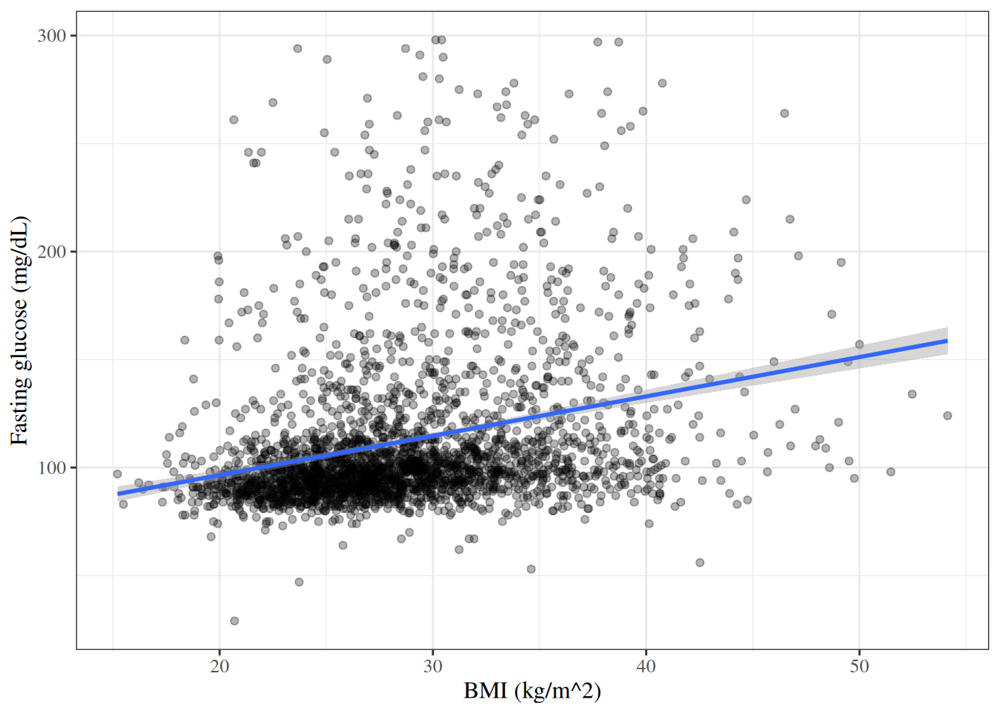

# Correlation and Simple Linear Regression

Code

Published

Last modified: 2026-10-04 10:41:46 (PDT)

This page reviews two ways to relate two continuous variables: correlation coefficients, with tests of whether they differ from zero, and simple linear regression. It uses the \\t\\ reference distribution defined on the [Statistical Inference](inference.llms.md#sec-reference-distributions) page. This page is adapted from Vittinghoff et al. ([2012](#ref-vittinghoff2e)), Chapter 3.

## 1 The HERS data

The examples on this page use the HERS data, which the [Comparing Means](basic-statistical-methods.llms.md#sec-hers-intro) page describes. The `rmb` R package includes the dataset; [`haven::as_factor()`](https://forcats.tidyverse.org/reference/as_factor.html) converts its Stata value labels to factors:

``` downlit
hers <- rmb::hers |> haven::as_factor()
```

## 2 Correlation

### 2.1 Testing the Pearson correlation

> **NOTE:**
>
> **Definition 1 (Population correlation)** The **population correlation** of two random variables \\X\\ and \\Y\\ with positive variances is
>
> \\\rho \stackrel{\text{def}}{=}\frac{\operatorname{Cov}\mathopen{}\left(X, Y\right)\mathclose{}}{\sqrt{\operatorname{Var}\mathopen{}\left(X\right)\mathclose{} \operatorname{Var}\mathopen{}\left(Y\right)\mathclose{}}},\\
>
> where \\\operatorname{Cov}\mathopen{}\left(X, Y\right)\mathclose{}\\ is their [covariance](https://morrison-lab.github.io/pds/variance-covariance.html#def-cov).

The [Pearson correlation coefficient](exploratory-descriptive.llms.md#def-pearson-r) \\r\\ of a sample is the corresponding sample statistic, and estimates \\\rho\\.

> **NOTE:**
>
> **Definition 2 (Test of zero correlation)** Let \\r\\ be the [Pearson correlation coefficient](exploratory-descriptive.llms.md#def-pearson-r) of \\n \ge 3\\ pairs, with \\\mathopen{}\left\|r\right\|\mathclose{} \< 1\\. The **t-test of zero correlation** of \\H_0: \rho = 0\\ against \\H_1: \rho \neq 0\\ ([Definition 1](#def-population-correlation)) uses the statistic
>
> \\t \stackrel{\text{def}}{=}\frac{r \sqrt{n - 2}}{\sqrt{1 - r^2}}.\\
>
> Its p-value is \\\Pr(\mathopen{}\left\|T\right\|\mathclose{} \ge \mathopen{}\left\|t\right\|\mathclose{})\\, where \\T\\ has the \\t\_{n-2}\\ distribution ([t-distribution](inference.llms.md#def-t-dist)).

> **NOTE:**
>
> **Theorem 1 (Null distribution of the correlation t statistic)** Let the pairs \\(X_1, Y_1), \ldots, (X_n, Y_n)\\ be independent, and let each \\Y_i\\, given \\X_1, \ldots, X_n\\, be Gaussian with a mean and variance that do not depend on the \\X\\ values. Then the statistic \\t\\ of [Definition 2](#def-pearson-test) has the \\t\_{n-2}\\ distribution ([Hogg et al. 2019, sec. 9.6](#ref-hoggtanis2015), pp. 472-473).

The conditions of [Theorem 1](#thm-pearson-test-null) hold, for example, when the pairs are independent draws from a bivariate Gaussian distribution with \\\rho = 0\\.

> **NOTE:**
>
> **Example 1 (Correlation between BMI and fasting glucose in HERS)** [Figure 1](#fig-hers-scatter) plots baseline fasting glucose against BMI.
>
> Show R code
>
> ``` downlit
> hers |>
>   dplyr::filter(!is.na(BMI)) |>
>   ggplot2::ggplot() +
>   ggplot2::aes(x = BMI, y = glucose) +
>   ggplot2::geom_point(alpha = 0.3) +
>   ggplot2::geom_smooth(method = "lm", formula = y ~ x) +
>   ggplot2::labs(
>     x = "BMI (kg/m^2)",
>     y = "Fasting glucose (mg/dL)"
>   )
> ```
>
> [](correlation-regression_files/figure-html/unnamed-chunk-1-1.png "Figure 1: Baseline fasting glucose against BMI in HERS, with the least-squares line")
>
> Figure 1: Baseline fasting glucose against BMI in HERS, with the least-squares line
>
> The statistic of [Definition 2](#def-pearson-test), using the 2758 participants with a BMI measurement:
>
> ``` downlit
> hers_bmi <- hers |> dplyr::filter(!is.na(BMI))
> r <- cor(hers_bmi$BMI, hers_bmi$glucose)
> n <- nrow(hers_bmi)
> t_cor <- r * sqrt(n - 2) / sqrt(1 - r^2)
> c(r = r, t = t_cor, p_value = 2 * pt(-abs(t_cor), df = n - 2))
> #>           r           t     p_value 
> #> 2.72664e-01 1.48779e+01 3.24201e-48
> ```
>
> [`cor.test()`](https://rdrr.io/r/stats/cor.test.html) reports the same values, and a confidence interval for \\\rho\\:
>
> ``` downlit
> cor.test(hers$BMI, hers$glucose, method = "pearson")
> #> 
> #>  Pearson's product-moment correlation
> #> 
> #> data:  hers$BMI and hers$glucose
> #> t = 14.88, df = 2756, p-value <2e-16
> #> alternative hypothesis: true correlation is not equal to 0
> #> 95 percent confidence interval:
> #>  0.237760 0.306865
> #> sample estimates:
> #>      cor 
> #> 0.272664
> ```
>
> The correlation is positive but modest: glucose tends to be higher at higher BMI, with wide scatter around the line in [Figure 1](#fig-hers-scatter).

### 2.2 Spearman rank correlation

> **NOTE:**
>
> **Definition 3 (Spearman rank correlation)** Replace each \\x_i\\ by its rank among \\x_1, \ldots, x_n\\, and each \\y_i\\ by its rank among \\y_1, \ldots, y_n\\, giving tied values the average of the ranks they span. The **Spearman rank correlation** \\r_S\\ is the [Pearson correlation coefficient](exploratory-descriptive.llms.md#def-pearson-r) of the ranks.

Because ranks depend only on the ordering of the values, \\r_S\\ measures how close the association is to monotone, whether or not it is linear, and a single extreme value moves \\r_S\\ less than it moves \\r\\.

> **NOTE:**
>
> **Example 2 (Spearman correlation between BMI and fasting glucose in HERS)** The Pearson correlation of the ranks ([Definition 3](#def-spearman-r)), and [`cor.test()`](https://rdrr.io/r/stats/cor.test.html)’s Spearman test (`exact = FALSE`, because tied values rule out the exact p-value):
>
> ``` downlit
> hers_bmi <- hers |> dplyr::filter(!is.na(BMI))
> cor(rank(hers_bmi$BMI), rank(hers_bmi$glucose))
> #> [1] 0.333751
> cor.test(hers_bmi$BMI, hers_bmi$glucose, method = "spearman", exact = FALSE)
> #> 
> #>  Spearman's rank correlation rho
> #> 
> #> data:  hers_bmi$BMI and hers_bmi$glucose
> #> S = 2.33e+09, p-value <2e-16
> #> alternative hypothesis: true rho is not equal to 0
> #> sample estimates:
> #>      rho 
> #> 0.333751
> ```
>
> \\r_S\\ is larger than the Pearson \\r\\ of [Example 1](#exm-hers-cor): the association is closer to monotone than to linear.

## 3 Simple linear regression

### 3.1 Model specification

> **NOTE:**
>
> **Definition 4 (Simple linear regression model)** A **simple linear regression** model relates a continuous outcome \\Y\\ to a single predictor \\X\\:
>
> \\Y_i = \beta\_{0}+ \beta\_{x} x_i + \varepsilon_i, \qquad \varepsilon_1, \ldots, \varepsilon_n \\ \sim\_{\operatorname{iid}}\\ \operatorname{N}\mathopen{}\left(0, \sigma^2\right)\mathclose{}.\\
>
> - \\\beta\_{0}\\ is the **intercept**: the mean of \\Y\\ among observations with \\X = 0\\.
> - \\\beta\_{x}\\ is the **slope**: the difference in the mean of \\Y\\ between two groups whose values of \\X\\ differ by one unit, \\\beta\_{x} = \operatorname{E}\mathopen{}\left\[Y \mid X = x + 1\right\]\mathclose{} - \operatorname{E}\mathopen{}\left\[Y \mid X = x\right\]\mathclose{}\\.
> - \\\sigma^2\\ is the variance of \\Y\\ around its mean at each value of \\X\\.

### 3.2 Ordinary least squares estimation

> **NOTE:**
>
> **Definition 5 (Residual sum of squares)** For data \\(x_1, y_1), \ldots, (x_n, y_n)\\, the **residual sum of squares** of a line with intercept \\\beta\_{0}\\ and slope \\\beta\_{x}\\ is
>
> \\\text{RSS}(\beta\_{0}, \beta\_{x}) \stackrel{\text{def}}{=}\sum\_{i=1}^n (y_i - \beta\_{0}- \beta\_{x} x_i)^2.\\
>
> Each term is the square of a [residual](estimation.llms.md#def-residual), with the line’s value \\\beta\_{0}+ \beta\_{x} x_i\\ as the fitted value.

> **NOTE:**
>
> **Example 3 (Residual sum of squares of a line through three points)** For the points \\(0, 1)\\, \\(1, 2)\\, \\(2, 2)\\ and the line with \\\beta\_{0}= 1\\ and \\\beta\_{x} = 0.5\\, the vertical distances from the points to the line are \\1 - 1 = 0\\, \\2 - 1.5 = 0.5\\, and \\2 - 2 = 0\\, so \\\text{RSS}(1, 0.5) = 0^2 + 0.5^2 + 0^2 = 0.25\\.

> **NOTE:**
>
> **Definition 6 (Ordinary least squares)** The **ordinary least squares (OLS) estimates** \\\hat{\beta}\_{0}\\ and \\\hat{\beta}\_{x}\\ are the values of \\\beta\_{0}\\ and \\\beta\_{x}\\ that minimize the [residual sum of squares](#def-rss) \\\text{RSS}(\beta\_{0}, \beta\_{x})\\.

> **NOTE:**
>
> **Theorem 2 (Closed-form OLS estimates)** Write
>
> \\ \begin{aligned} S\_{xx} &\stackrel{\text{def}}{=}\sum\_{i=1}^n (x_i - \bar{x})^2, & S\_{yy} &\stackrel{\text{def}}{=}\sum\_{i=1}^n (y_i - \bar{y})^2, & S\_{xy} &\stackrel{\text{def}}{=}\sum\_{i=1}^n (x_i - \bar{x})(y_i - \bar{y}), \end{aligned} \\
>
> and suppose \\S\_{xx} \> 0\\ (not all \\x_i\\ are equal). Then the OLS estimates ([Definition 6](#def-ols)) are unique, and
>
> \\\hat{\beta}\_{x} = \frac{S\_{xy}}{S\_{xx}}, \qquad \hat{\beta}\_{0}= \bar{y} - \hat{\beta}\_{x} \bar{x}.\\

> **NOTE:**
>
> *Proof*. \\\text{RSS}\\ is a quadratic function of \\(\beta\_{0}, \beta\_{x})\\, so we find where its partial derivatives are zero, then check that this point is the unique minimum.
>
> The derivative with respect to \\\beta\_{0}\\, by the chain rule applied to each term of the sum:
>
> \\ \frac{\partial \text{RSS}}{\partial \beta\_{0}} = \sum\_{i=1}^n 2 (y_i - \beta\_{0}- \beta\_{x} x_i) \frac{\partial}{\partial \beta\_{0}} (y_i - \beta\_{0}- \beta\_{x} x_i). \\
>
> The inner derivative:
>
> \\ \begin{aligned} \frac{\partial}{\partial \beta\_{0}} (y_i - \beta\_{0}- \beta\_{x} x_i) &= \frac{\partial y_i}{\partial \beta\_{0}} - \frac{\partial \beta\_{0}}{\partial \beta\_{0}} - \frac{\partial (\beta\_{x} x_i)}{\partial \beta\_{0}} && \text{(derivative of a sum)}\\ &= 0 - 1 - 0 && \text{(\$y_i\$ and \$\beta\_{x} x_i\$ do not depend on \$\beta\_{0}\$)}\\ &= -1 \end{aligned} \\
>
> Plugging the inner derivative back in:
>
> \\ \begin{aligned} \frac{\partial \text{RSS}}{\partial \beta\_{0}} &= -2 \sum\_{i=1}^n (y_i - \beta\_{0}- \beta\_{x} x_i) && \text{(inner derivative is \$-1\$)}\\ &= -2 \mathopen{}\left(n \bar{y} - n \beta\_{0}- \beta\_{x} n \bar{x}\right)\mathclose{} && \text{(\$\sum_i y_i = n\bar{y}\$, \$\sum_i x_i = n\bar{x}\$)} \end{aligned} \\
>
> Setting it to zero and dividing by \\-2n\\ gives \\\bar{y} - \beta\_{0}- \beta\_{x} \bar{x} = 0\\, so \\\beta\_{0}= \bar{y} - \beta\_{x} \bar{x}\\.
>
> The derivative with respect to \\\beta\_{x}\\, again by the chain rule applied to each term:
>
> \\ \frac{\partial \text{RSS}}{\partial \beta\_{x}} = \sum\_{i=1}^n 2 (y_i - \beta\_{0}- \beta\_{x} x_i) \frac{\partial}{\partial \beta\_{x}} (y_i - \beta\_{0}- \beta\_{x} x_i). \\
>
> The inner derivative:
>
> \\ \begin{aligned} \frac{\partial}{\partial \beta\_{x}} (y_i - \beta\_{0}- \beta\_{x} x_i) &= \frac{\partial y_i}{\partial \beta\_{x}} - \frac{\partial \beta\_{0}}{\partial \beta\_{x}} - \frac{\partial (\beta\_{x} x_i)}{\partial \beta\_{x}} && \text{(derivative of a sum)}\\ &= 0 - 0 - x_i && \text{(\$y_i\$ and \$\beta\_{0}\$ do not depend on \$\beta\_{x}\$)}\\ &= -x_i \end{aligned} \\
>
> Plugging the inner derivative back in, and substituting \\\beta\_{0}= \bar{y} - \beta\_{x} \bar{x}\\:
>
> \\ \begin{aligned} \frac{\partial \text{RSS}}{\partial \beta\_{x}} &= -2 \sum\_{i=1}^n x_i (y_i - \beta\_{0}- \beta\_{x} x_i) && \text{(inner derivative is \$-x_i\$)}\\ &= -2 \sum\_{i=1}^n x_i \mathopen{}\left((y_i - \bar{y}) - \beta\_{x} (x_i - \bar{x})\right)\mathclose{} && \text{(substitute \$\beta\_{0}\$)}\\ &= -2 \sum\_{i=1}^n (x_i - \bar{x}) \mathopen{}\left((y_i - \bar{y}) - \beta\_{x} (x_i - \bar{x})\right)\mathclose{} && \text{(subtract \$\bar{x} \sum_i \mathopen{}\left((y_i - \bar{y}) - \beta\_{x} (x_i - \bar{x})\right)\mathclose{} = 0\$)}\\ &= -2 \mathopen{}\left(S\_{xy} - \beta\_{x} S\_{xx}\right)\mathclose{} && \text{(definitions of \$S\_{xy}\$ and \$S\_{xx}\$)} \end{aligned} \\
>
> The subtracted sum in the third step is zero because \\\sum_i (y_i - \bar{y}) = 0\\ and \\\sum_i (x_i - \bar{x}) = 0\\. Setting the derivative to zero gives \\\beta\_{x} = S\_{xy} / S\_{xx}\\.
>
> This stationary point is the unique minimum. The matrix of second derivatives of \\\text{RSS}\\ is
>
> \\ 2 \begin{pmatrix} n & n\bar{x} \\ n\bar{x} & \sum_i x_i^2 \end{pmatrix}, \\
>
> whose top-left entry \\2n\\ is positive and whose determinant is \\4\mathopen{}\left(n \sum_i x_i^2 - n^2 \bar{x}^2\right)\mathclose{} = 4 n S\_{xx} \> 0\\. So the matrix is positive definite, \\\text{RSS}\\ is strictly convex, and its only stationary point is its global minimum.

The same result follows from a derivation in vector notation, which treats \\(\beta\_{0}, \beta\_{x})\\ as a single vector instead of differentiating with respect to each component separately.

> **NOTE:**
>
> *Proof*. Collect the coefficients and each observation’s covariates into vectors:
>
> \\ \tilde{\beta}\stackrel{\text{def}}{=}\begin{pmatrix} \beta\_{0}\\ \beta\_{x} \end{pmatrix}, \qquad \tilde{x}\_i\stackrel{\text{def}}{=}\begin{pmatrix} 1 \\ x_i \end{pmatrix}, \qquad\text{so}\qquad \beta\_{0}+ \beta\_{x} x_i = \tilde{x}\_i \cdot \tilde{\beta} \quad\text{and}\quad \text{RSS}(\tilde{\beta}) = \sum\_{i=1}^n\mathopen{}\left(y_i - \tilde{x}\_i \cdot \tilde{\beta}\right)\mathclose{}^2. \\
>
> **Gradient.** By the chain rule applied to each term of the sum:
>
> \\ \frac{\partial}{\partial \tilde{\beta}} \text{RSS}(\tilde{\beta}) = \sum\_{i=1}^n2 \mathopen{}\left(y_i - \tilde{x}\_i \cdot \tilde{\beta}\right)\mathclose{} \frac{\partial}{\partial \tilde{\beta}} \mathopen{}\left(y_i - \tilde{x}\_i \cdot \tilde{\beta}\right)\mathclose{}. \\
>
> For the inner derivative, we need the gradient of a linear function. For any constant vector \\\tilde{a} = {(a_0, a_x)}^{\top}\\, \\\tilde{a} \cdot \tilde{\beta} = a_0 \beta\_{0}+ a_x \beta\_{x}\\, whose partial derivatives with respect to \\\beta\_{0}\\ and \\\beta\_{x}\\ are \\a_0\\ and \\a_x\\; so \\\frac{\partial}{\partial \tilde{\beta}} \tilde{a} \cdot \tilde{\beta} = \tilde{a}\\. With \\\tilde{a} = \tilde{x}\_i\\:
>
> \\ \begin{aligned} \frac{\partial}{\partial \tilde{\beta}} \mathopen{}\left(y_i - \tilde{x}\_i \cdot \tilde{\beta}\right)\mathclose{} &= \frac{\partial}{\partial \tilde{\beta}} y_i - \frac{\partial}{\partial \tilde{\beta}} \tilde{x}\_i \cdot \tilde{\beta} && \text{(derivative of a difference)}\\ &= \tilde{0}- \tilde{x}\_i && \text{(\$y_i\$ does not depend on \$\tilde{\beta}\$; gradient of a linear function)}\\ &= -\tilde{x}\_i \end{aligned} \\
>
> Plugging the inner derivative back in:
>
> \\ \begin{aligned} \frac{\partial}{\partial \tilde{\beta}} \text{RSS}(\tilde{\beta}) &= -2 \sum\_{i=1}^n\tilde{x}\_i\mathopen{}\left(y_i - \tilde{x}\_i \cdot \tilde{\beta}\right)\mathclose{} && \text{(inner derivative is \$-\tilde{x}\_i\$)}\\ &= -2 \mathopen{}\left(\sum\_{i=1}^n\tilde{x}\_iy_i - \sum\_{i=1}^n\tilde{x}\_i\mathopen{}\left(\tilde{x}\_i \cdot \tilde{\beta}\right)\mathclose{}\right)\mathclose{} && \text{(distribute the sum)} \end{aligned} \\
>
> **Solve for \\\hat{\tilde{\beta}}\\.** Write \\A \stackrel{\text{def}}{=}\sum\_{i=1}^n\tilde{x}\_i {\tilde{x}\_i}^{\top}\\ and \\\tilde{c} \stackrel{\text{def}}{=}\sum\_{i=1}^n\tilde{x}\_iy_i\\. Since \\\tilde{x}\_i\mathopen{}\left(\tilde{x}\_i \cdot \tilde{\beta}\right)\mathclose{} = \mathopen{}\left(\tilde{x}\_i {\tilde{x}\_i}^{\top}\right)\mathclose{} \tilde{\beta}\\, the gradient is \\-2 \mathopen{}\left(\tilde{c} - A \tilde{\beta}\right)\mathclose{}\\. Setting it equal to \\\tilde{0}\\ gives the **normal equations** \\A \tilde{\beta}= \tilde{c}\\. Writing out the components of each term:
>
> \\ A = \sum\_{i=1}^n\begin{pmatrix} 1 & x_i \\ x_i & x_i^2 \end{pmatrix} = \begin{pmatrix} n & n\bar{x} \\ n\bar{x} & \sum\_{i=1}^nx_i^2 \end{pmatrix}, \qquad \tilde{c} = \sum\_{i=1}^n\begin{pmatrix} y_i \\ x_i y_i \end{pmatrix} = \begin{pmatrix} n\bar{y} \\ \sum\_{i=1}^nx_i y_i \end{pmatrix}. \\
>
> The determinant of \\A\\ is \\n \sum\_{i=1}^nx_i^2 - n^2 \bar{x}^2 = n S\_{xx} \> 0\\, so \\A\\ is invertible and the normal equations have the unique solution
>
> \\ \begin{aligned} \hat{\tilde{\beta}}= A^{-1} \tilde{c} &= \frac{1}{n S\_{xx}} \begin{pmatrix} \sum\_{i=1}^nx_i^2 & -n\bar{x} \\ -n\bar{x} & n \end{pmatrix} \begin{pmatrix} n\bar{y} \\ \sum\_{i=1}^nx_i y_i \end{pmatrix} && \text{(inverse of a \$2 \times 2\$ matrix)}\\ &= \frac{1}{S\_{xx}} \begin{pmatrix} \bar{y} \sum\_{i=1}^nx_i^2 - \bar{x} \sum\_{i=1}^nx_i y_i \\ \sum\_{i=1}^nx_i y_i - n \bar{x} \bar{y} \end{pmatrix} && \text{(multiply, cancel \$n\$)}\\ &= \frac{1}{S\_{xx}} \begin{pmatrix} \bar{y} \mathopen{}\left(S\_{xx} + n\bar{x}^2\right)\mathclose{} - \bar{x} \mathopen{}\left(S\_{xy} + n\bar{x}\bar{y}\right)\mathclose{} \\ S\_{xy} \end{pmatrix} && \text{(\$\sum\_{i=1}^nx_i^2 = S\_{xx} + n\bar{x}^2\$, \$\sum\_{i=1}^nx_i y_i = S\_{xy} + n\bar{x}\bar{y}\$)}\\ &= \begin{pmatrix} \bar{y} - \bar{x} \\ S\_{xy} / S\_{xx} \\ S\_{xy} / S\_{xx} \end{pmatrix} && \text{(first component: cancel \$\pm n\bar{x}^2\bar{y}\$)} \end{aligned} \\
>
> which matches \\\hat{\beta}\_{0}= \bar{y} - \hat{\beta}\_{x} \bar{x}\\ and \\\hat{\beta}\_{x} = S\_{xy} / S\_{xx}\\.
>
> **Second derivative.** Differentiating the gradient \\-2 \mathopen{}\left(\tilde{c} - A \tilde{\beta}\right)\mathclose{}\\ with respect to \\{\tilde{\beta}}^{\top}\\ gives the [Hessian](intro-MLEs.llms.md#def-hessian) of \\\text{RSS}\\:
>
> \\ \frac{\partial}{\partial \tilde{\beta}} \frac{\partial}{\partial {\tilde{\beta}}^{\top}} \text{RSS}(\tilde{\beta}) = 2 A = 2 \sum\_{i=1}^n\tilde{x}\_i {\tilde{x}\_i}^{\top}. \\
>
> It is positive definite. For any vector \\\tilde{v} = {(v_0, v_x)}^{\top} \neq \tilde{0}\\:
>
> \\ {\tilde{v}}^{\top} \mathopen{}\left(2 A\right)\mathclose{} \tilde{v} = 2 \sum\_{i=1}^n\mathopen{}\left(\tilde{v} \cdot \tilde{x}\_i\right)\mathclose{}^2 = 2 \sum\_{i=1}^n\mathopen{}\left(v_0 + v_x x_i\right)\mathclose{}^2 \ge 0, \\
>
> with equality only if \\v_0 + v_x x_i = 0\\ for every \\i\\. If \\v_x \neq 0\\, that would force every \\x_i = -v_0 / v_x\\, contradicting \\S\_{xx} \> 0\\; if \\v_x = 0\\, it would force \\v_0 = 0\\, contradicting \\\tilde{v} \neq \tilde{0}\\. So the inequality is strict, the Hessian is positive definite at every \\\tilde{\beta}\\, \\\text{RSS}\\ is strictly convex, and \\\hat{\tilde{\beta}}\\ is its unique global minimum.

> **NOTE:**
>
> **Corollary 1 (OLS slope in terms of the correlation)** If \\S\_{xx} \> 0\\ and \\S\_{yy} \> 0\\, then
>
> \\\hat{\beta}\_{x} = r \\ \frac{s_y}{s_x},\\
>
> where \\r\\ is the [Pearson correlation coefficient](exploratory-descriptive.llms.md#def-pearson-r) and \\s_x\\ and \\s_y\\ are the [sample standard deviations](exploratory-descriptive.llms.md#def-sample-sd) of the \\x_i\\ and the \\y_i\\.

> **NOTE:**
>
> *Proof*. With the notation of [Theorem 2](#thm-ols-slr), \\r = S\_{xy} / \sqrt{S\_{xx} S\_{yy}}\\, \\s_x = \sqrt{S\_{xx} / (n-1)}\\, and \\s_y = \sqrt{S\_{yy} / (n-1)}\\. So:
>
> \\ \begin{aligned} r \\ \frac{s_y}{s_x} &= \frac{S\_{xy}}{\sqrt{S\_{xx} S\_{yy}}} \cdot \frac{\sqrt{S\_{yy} / (n-1)}}{\sqrt{S\_{xx} / (n-1)}} && \text{(substitute \$r\$, \$s_x\$, \$s_y\$)}\\ &= \frac{S\_{xy}}{\sqrt{S\_{xx}} \sqrt{S\_{yy}}} \cdot \frac{\sqrt{S\_{yy}}}{\sqrt{S\_{xx}}} && \text{(cancel the factors of \$n - 1\$)}\\ &= \frac{S\_{xy}}{S\_{xx}} && \text{(cancel \$\sqrt{S\_{yy}}\$)}\\ &= \hat{\beta}\_{x} && \text{(closed-form OLS slope)} \end{aligned} \\

> **TIP:**
>
> Hutchinson’s [Linear Regression (pt1)](https://facultyweb.cs.wwu.edu/~hutchib2/video_lectures/data371/#linear_regression) (17 min) covers fitting a linear regression by least squares, framed as machine learning ([Hutchinson, n.d.](#ref-hutchinson_wwu_ml_videos)). The login for the video site is posted [on Canvas](https://wwu.instructure.com/courses/1906010/modules#module_3922392).

### 3.3 Fitting a simple linear regression in R

> **NOTE:**
>
> **Example 4 (Regression of fasting glucose on BMI in HERS)** The OLS estimates from [Theorem 2](#thm-ols-slr), and the slope from [Corollary 1](#cor-ols-slope-r), for the participants with a BMI measurement:
>
> ``` downlit
> hers_bmi <- hers |> dplyr::filter(!is.na(BMI))
> x <- hers_bmi$BMI
> y <- hers_bmi$glucose
> b1 <- sum((x - mean(x)) * (y - mean(y))) / sum((x - mean(x))^2)
> c(
>   intercept = mean(y) - b1 * mean(x),
>   slope = b1,
>   slope_from_r = cor(x, y) * sd(y) / sd(x)
> )
> #>    intercept        slope slope_from_r 
> #>     60.07405      1.82218      1.82218
> ```
>
> [`lm()`](https://rdrr.io/r/stats/lm.html) gives the same estimates:
>
> ``` downlit
> slr_fit <- lm(glucose ~ BMI, data = hers)
> summary(slr_fit)
> #> 
> #> Call:
> #> lm(formula = glucose ~ BMI, data = hers)
> #> 
> #> Residuals:
> #>    Min     1Q Median     3Q    Max 
> #> -81.55 -18.98 -10.35   3.76 190.81 
> #> 
> #> Coefficients:
> #>             Estimate Std. Error t value Pr(>|t|)    
> #> (Intercept)   60.074      3.565    16.9   <2e-16 ***
> #> BMI            1.822      0.122    14.9   <2e-16 ***
> #> ---
> #> Signif. codes:  0 '***' 0.001 '**' 0.01 '*' 0.05 '.' 0.1 ' ' 1
> #> 
> #> Residual standard error: 35.5 on 2756 degrees of freedom
> #>   (5 observations deleted due to missingness)
> #> Multiple R-squared:  0.0743, Adjusted R-squared:  0.074 
> #> F-statistic:  221 on 1 and 2756 DF,  p-value: <2e-16
> ```
>
> The estimated slope is \\\hat{\beta}\_{\text{BMI}} = 1.82\\ mg/dL per kg/m²: mean fasting glucose is about 1.8 mg/dL higher among participants whose BMI is 1 kg/m² higher. The t statistic for the slope equals the correlation test statistic of [Example 1](#exm-hers-cor).

### 3.4 The coefficient of determination

> **NOTE:**
>
> **Definition 7 (Total sum of squares)** The **total sum of squares** of \\y_1, \ldots, y_n\\ is
>
> \\\text{TSS} \stackrel{\text{def}}{=}\sum\_{i=1}^n (y_i - \bar{y})^2.\\

> **NOTE:**
>
> **Example 5 (Total sum of squares of three values)** For \\y = 1, 2, 2\\, \\\bar y = 5/3\\, so
>
> \\ \begin{aligned} \text{TSS} &= \mathopen{}\left(1 - \tfrac{5}{3}\right)\mathclose{}^2 + 2\mathopen{}\left(2 - \tfrac{5}{3}\right)\mathclose{}^2 && \text{(definition)}\\ &= \tfrac{4}{9} + \tfrac{2}{9} && \text{(square the deviations)}\\ &= \tfrac{2}{3} && \text{(arithmetic)} \end{aligned} \\

> **NOTE:**
>
> **Definition 8 (Coefficient of determination)** For a fitted regression with [fitted values](estimation.llms.md#def-fitted-value) \\\hat y_i\\, the **coefficient of determination** is
>
> \\R^2 \stackrel{\text{def}}{=}1 - \frac{\sum\_{i=1}^n (y_i - \hat y_i)^2}{\sum\_{i=1}^n (y_i - \bar{y})^2}.\\
>
> The numerator is the [residual sum of squares](#def-rss) of the fit, the sum of the squared [residuals](estimation.llms.md#def-residual), and the denominator is the [total sum of squares](#def-tss) of the \\y_i\\.

\\R^2\\ is often described as the proportion of the variation in \\Y\\ explained by the regression on \\X\\.

> **NOTE:**
>
> **Theorem 3 (\\R^2\\ of a simple linear regression)** For the OLS fit of a simple linear regression, with \\S\_{xx} \> 0\\ and \\S\_{yy} \> 0\\, \\R^2 = r^2\\, where \\r\\ is the [Pearson correlation coefficient](exploratory-descriptive.llms.md#def-pearson-r) of the \\x_i\\ and \\y_i\\. In particular, \\0 \le R^2 \le 1\\.

> **NOTE:**
>
> *Proof*. With the notation of [Theorem 2](#thm-ols-slr), the [fitted values](estimation.llms.md#def-fitted-value) are \\\hat y_i = \hat{\beta}\_{0}+ \hat{\beta}\_{x} x_i\\, so each [residual](estimation.llms.md#def-residual) is
>
> \\ \begin{aligned} r_i = y_i - \hat y_i &= y_i - (\bar{y} - \hat{\beta}\_{x} \bar{x}) - \hat{\beta}\_{x} x_i && \text{(substitute \$\hat{\beta}\_{0}\$)}\\ &= (y_i - \bar{y}) - \hat{\beta}\_{x} (x_i - \bar{x}) && \text{(regroup)} \end{aligned} \\
>
> Squaring and summing:
>
> \\ \begin{aligned} \sum\_{i=1}^n (y_i - \hat y_i)^2 &= \sum\_{i=1}^n \mathopen{}\left((y_i - \bar{y})^2 - 2 \hat{\beta}\_{x} (x_i - \bar{x})(y_i - \bar{y}) + \hat{\beta}\_{x}^2 (x_i - \bar{x})^2\right)\mathclose{} && \text{(expand the square)}\\ &= S\_{yy} - 2 \hat{\beta}\_{x} S\_{xy} + \hat{\beta}\_{x}^2 S\_{xx} && \text{(definitions of \$S\_{yy}\$, \$S\_{xy}\$, \$S\_{xx}\$)}\\ &= S\_{yy} - 2 \frac{S\_{xy}^2}{S\_{xx}} + \frac{S\_{xy}^2}{S\_{xx}} && \text{(substitute \$\hat{\beta}\_{x} = S\_{xy} / S\_{xx}\$)}\\ &= S\_{yy} - \frac{S\_{xy}^2}{S\_{xx}} && \text{(combine like terms)} \end{aligned} \\
>
> The total sum of squares is \\S\_{yy}\\, so:
>
> \\ \begin{aligned} R^2 &= 1 - \frac{S\_{yy} - S\_{xy}^2 / S\_{xx}}{S\_{yy}} && \text{(substitute into the definition of \$R^2\$)}\\ &= \frac{S\_{xy}^2}{S\_{xx} S\_{yy}} && \text{(simplify)}\\ &= r^2 && \text{(\$r = S\_{xy} / \sqrt{S\_{xx} S\_{yy}}\$)} \end{aligned} \\
>
> Since \\-1 \le r \le 1\\ ([range of the correlation coefficient](exploratory-descriptive.llms.md#thm-pearson-r-range)), \\0 \le r^2 \le 1\\.

> **NOTE:**
>
> **Example 6 (\\R^2\\ for the regression of glucose on BMI in HERS)** For the fit in [Example 4](#exm-hers-slr), \\R^2\\ computed from [Definition 8](#def-r-squared), the square of the Pearson correlation, and [`lm()`](https://rdrr.io/r/stats/lm.html)’s value agree:
>
> ``` downlit
> fit <- lm(glucose ~ BMI, data = hers)
> y <- fit$model$glucose
> c(
>   r_squared = 1 - sum(residuals(fit)^2) / sum((y - mean(y))^2),
>   cor_squared = cor(fit$model$BMI, y)^2,
>   lm = summary(fit)$r.squared
> )
> #>   r_squared cor_squared          lm 
> #>   0.0743455   0.0743455   0.0743455
> ```
>
> BMI accounts for only about 7% of the variation in baseline fasting glucose.

### 3.5 Further reading

[Linear Models Overview](https://morrison-lab.github.io/rme/chapters/Linear-models-overview.html) covers linear regression in depth, including inference for the coefficients and multiple predictors. Vittinghoff et al. ([2012](#ref-vittinghoff2e)) cover linear regression in Chapter 4.

## References

Hogg, Robert V., Elliot A. Tanis, and Dale L. Zimmerman. 2019. *Probability and Statistical Inference*. Tenth edition. Pearson.

Hutchinson, Brian. n.d. *DATA 471/571 (Machine Learning) and CSCI 481/581 (Deep Learning) Video Lectures*. Western Washington University. Accessed September 28, 2026. <https://facultyweb.cs.wwu.edu/~hutchib2/video_lectures/data371/>.

Vittinghoff, Eric, David V Glidden, Stephen C Shiboski, and Charles E McCulloch. 2012. *Regression Methods in Biostatistics: Linear, Logistic, Survival, and Repeated Measures Models*. 2nd ed. Springer. <https://doi.org/10.1007/978-1-4614-1353-0>.

Back to top
