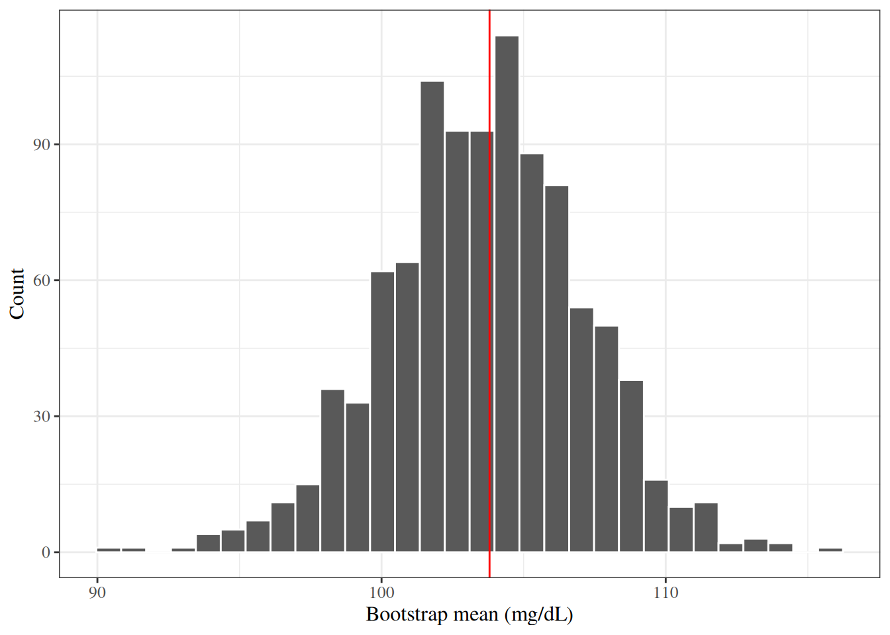

# Basic Statistical Methods

Code

Published

Last modified: 2026-09-28 01:41:08 (PDT)

## 1 Introduction

This page reviews the standard methods for comparing groups and for relating two variables:

- t-tests and one-way analysis of variance, for a continuous outcome;
- the chi-square test and Fisher’s exact test, for categorical variables;
- correlation coefficients and simple linear regression, for two continuous variables;
- bootstrap confidence intervals, for statistics whose sampling distribution has no convenient formula.

The page builds on three others:

- [Exploratory Data Analysis](exploratory-descriptive.llms.md) defines the sample statistics these methods use;
- [Statistical Inference](inference.llms.md) defines hypotheses, test statistics, p-values, and confidence intervals;
- [Estimation](estimation.llms.md) defines estimators and their standard errors.

This page is adapted from Vittinghoff et al. ([2012](#ref-vittinghoff2e)), Chapter 3.

## 2 The HERS data

The “heart and estrogen/progestin study” (HERS) was a clinical trial of hormone therapy for prevention of recurrent heart attacks and death among 2,763 post-menopausal women with existing coronary heart disease (CHD) ([Hulley et al. 1998](#ref-HulleyStephen1998RToE)).

The trial was conducted at 20 US clinical centers. Participants were randomized to receive either conjugated equine estrogens (0.625 mg/day) plus medroxyprogesterone acetate (2.5 mg/day) or a matching placebo ([Hulley et al. 1998](#ref-HulleyStephen1998RToE)). Women were followed for an average of 4.1 years ([Hulley et al. 1998](#ref-HulleyStephen1998RToE)).

The primary outcome was nonfatal myocardial infarction or CHD death ([Hulley et al. 1998](#ref-HulleyStephen1998RToE)).

The HERS data are distributed with Vittinghoff et al. ([2012](#ref-vittinghoff2e)) on the book’s companion website, as a Stata file that R can read directly:

``` downlit
# one unbroken string, so that link checkers test the whole URL:
url <- "https://regression.ucsf.edu/sites/g/files/tkssra16191/files/wysiwyg/home/data/hersdata.dta" # nolint: line_length_linter.
hers <- haven::read_dta(url)
```

The `rmb` R package includes the same file, which these notes use so that rendering does not depend on the website. [`haven::as_factor()`](https://forcats.tidyverse.org/reference/as_factor.html) converts the Stata value labels to factors:

``` downlit
hers <- rmb::hers |> haven::as_factor()
```

The examples on this page use these variables:

| Variable   | Meaning                                           |
|------------|---------------------------------------------------|
| `HT`       | Randomized treatment: placebo or hormone therapy  |
| `age`      | Age at baseline (years)                           |
| `raceth`   | Race/ethnicity: White, African American, or Other |
| `exercise` | Exercises at least three times per week (no/yes)  |
| `BMI`      | Body mass index at baseline (kg/m²)               |
| `SBP`      | Systolic blood pressure at baseline (mmHg)        |
| `glucose`  | Fasting glucose at baseline (mg/dL)               |
| `glucose1` | Fasting glucose at the year-1 visit (mg/dL)       |

``` downlit
hers |>
  dplyr::select(HT, age, raceth, exercise, BMI, SBP, glucose, glucose1) |>
  dplyr::glimpse()
#> Rows: 2,763
#> Columns: 8
#> $ HT       <fct> placebo, placebo, hormone therapy, placebo, placebo, hormone …
#> $ age      <dbl> 70, 62, 69, 64, 65, 68, 70, 69, 61, 62, 72, 73, 52, 57, 57, 6…
#> $ raceth   <fct> African American, African American, White, White, White, Afri…
#> $ exercise <fct> no, no, no, no, no, no, no, yes, yes, no, no, no, no, no, yes…
#> $ BMI      <dbl> 23.69, 28.62, 42.51, 24.39, 21.90, 29.05, 34.45, 23.16, 30.26…
#> $ SBP      <dbl> 138, 118, 134, 152, 175, 174, 119, 178, 162, 111, 122, 158, 1…
#> $ glucose  <dbl> 84, 111, 114, 94, 101, 116, 120, 95, 105, 98, 111, 95, 97, 10…
#> $ glucose1 <dbl> 94, 78, 98, 93, 92, 115, NA, 95, 113, 98, 96, 107, 90, 100, 1…
```

## 3 Descriptive statistics

The [Exploratory Data Analysis](exploratory-descriptive.llms.md) page defines the sample statistics used on this page, each with an example:

- the [sample mean](exploratory-descriptive.llms.md#def-sample-mean);
- the [sample median](exploratory-descriptive.llms.md#def-sample-median);
- the [sample variance](exploratory-descriptive.llms.md#def-sample-variance);
- the [sample standard deviation](exploratory-descriptive.llms.md#def-sample-sd);
- the [interquartile range](exploratory-descriptive.llms.md#def-IQR);
- the [sample proportion](exploratory-descriptive.llms.md#def-sample-proportion).

That page also defines the graphs used here, including [box plots](exploratory-descriptive.llms.md#def-boxplot) and [scatter plots](exploratory-descriptive.llms.md#def-scatterplot).

> **NOTE:**
>
> **Example 1 (HERS baseline characteristics by treatment group)** [Table 1](#tbl-hers-summary) summarizes the HERS participants at baseline, separately for each randomized group. Continuous variables are summarized by mean (standard deviation), and categorical variables by count (percent).
>
> Code
>
> ``` downlit
> hers |>
>   dplyr::select(
>     age, BMI, glucose, SBP, DBP,
>     HT, raceth, exercise, smoking, diabetes
>   ) |>
>   gtsummary::tbl_summary(
>     by = HT,
>     statistic = list(
>       gtsummary::all_continuous() ~ "{mean} ({sd})",
>       gtsummary::all_categorical() ~ "{n} ({p}%)"
>     ),
>     digits = gtsummary::all_continuous() ~ 1,
>     label = list(
>       age ~ "Age (years)",
>       BMI ~ "BMI (kg/m^2)",
>       glucose ~ "Fasting glucose (mg/dL)",
>       SBP ~ "Systolic BP (mmHg)",
>       DBP ~ "Diastolic BP (mmHg)",
>       raceth ~ "Race/ethnicity",
>       exercise ~ "Exercises regularly",
>       smoking ~ "Current smoker",
>       diabetes ~ "Diabetes"
>     )
>   ) |>
>   gtsummary::add_overall() |>
>   gtsummary::bold_labels()
> ```
>
> [TABLE]
>
> Table 1: HERS: baseline characteristics by treatment group
>
> Because treatment was assigned at random, the two groups differ at baseline only by chance, and their summaries are close.

## 4 Reference distributions

The tests on this page compare a test statistic with one of three families of distributions, each built from independent standard Gaussian random variables. Here, “independent” means mutually [independent](https://morrison-lab.github.io/rme/chapters/probability.html#def-indpt).

> **NOTE:**
>
> **Definition 1 (Chi-square distribution)** Let \\Z_1, \ldots, Z_k\\ be independent random variables, each with the standard Gaussian distribution. The distribution of \\\sum\_{j=1}^k Z_j^2\\ is the **chi-square distribution with \\k\\ degrees of freedom**, written \\\chi^2_k\\.

> **NOTE:**
>
> **Example 2 (The 0.95 quantile of \\\chi^2_1\\)** By [Definition 1](#def-chi-square-dist), a \\\chi^2_1\\ random variable is \\Z^2\\ for a standard Gaussian \\Z\\. So \\\Pr(Z^2 \le c) = \Pr(-\sqrt{c} \le Z \le \sqrt{c})\\, and the 0.95 quantile of \\\chi^2_1\\ is the square of the 0.975 quantile of the standard Gaussian distribution:
>
> ``` downlit
> c(chisq = qchisq(0.95, df = 1), gaussian_squared = qnorm(0.975)^2)
> #>            chisq gaussian_squared 
> #>          3.84146          3.84146
> ```

> **NOTE:**
>
> **Definition 2 (t-distribution)** Let \\Z\\ have the standard Gaussian distribution, let \\V\\ have the \\\chi^2_k\\ distribution ([Definition 1](#def-chi-square-dist)), and let \\Z\\ and \\V\\ be independent. The distribution of
>
> \\\frac{Z}{\sqrt{V/k}}\\
>
> is the **t-distribution with \\k\\ degrees of freedom** (or Student’s t-distribution), written \\t_k\\.

> **NOTE:**
>
> **Example 3 (t quantiles approach Gaussian quantiles)** The 0.975 quantile of \\t_k\\ is larger than the standard Gaussian’s 0.975 quantile, 1.96, and approaches it as \\k\\ grows:
>
> ``` downlit
> k <- c(4, 9, 29, 99, 2760)
> tibble::tibble(k = k, t_quantile = qt(0.975, df = k))
> ```
>
> So t-based intervals and tests differ noticeably from Gaussian-based ones only in small samples.

> **NOTE:**
>
> **Definition 3 (F-distribution)** Let \\U\\ have the \\\chi^2\_{k_1}\\ distribution, let \\V\\ have the \\\chi^2\_{k_2}\\ distribution, and let \\U\\ and \\V\\ be independent. The distribution of
>
> \\\frac{U / k_1}{V / k_2}\\
>
> is the **F-distribution with \\k_1\\ and \\k_2\\ degrees of freedom**, written \\F\_{k_1, k_2}\\.

> **NOTE:**
>
> **Example 4 (A squared t random variable has an F-distribution)** Let \\T = Z / \sqrt{V/k}\\ as in [Definition 2](#def-t-dist). Then
>
> \\T^2 = \frac{Z^2 / 1}{V / k},\\
>
> where \\Z^2\\ has the \\\chi^2_1\\ distribution ([Definition 1](#def-chi-square-dist)) and is independent of \\V\\. So \\T^2\\ has the \\F\_{1, k}\\ distribution ([Definition 3](#def-f-dist)), and the 0.95 quantile of \\F\_{1, k}\\ is the square of the 0.975 quantile of \\t_k\\:
>
> ``` downlit
> c(f = qf(0.95, df1 = 1, df2 = 9), t_squared = qt(0.975, df = 9)^2)
> #>         f t_squared 
> #>   5.11736   5.11736
> ```

## 5 Comparing two groups: continuous outcomes

### 5.1 Hypotheses

The [Statistical Inference](inference.llms.md) page defines the [null hypothesis](inference.llms.md#def-null-hypothesis), the [alternative hypothesis](inference.llms.md#def-alternative-hypothesis), [test statistics](inference.llms.md#def-test-statistic), [p-values](inference.llms.md#def-p-value), and [significance levels](inference.llms.md#def-significance-level). In a comparison of two groups with means \\\mu_1\\ and \\\mu_2\\, the null hypothesis is usually \\H_0: \mu_1 = \mu_2\\, and the two-sided alternative is \\H_1: \mu_1 \neq \mu_2\\.

### 5.2 One-sample t-test

> **NOTE:**
>
> **Definition 4 (One-sample t-test)** Let \\x_1, \ldots, x_n\\ be observations with \\n \ge 2\\, sample mean \\\bar{x}\\, and sample standard deviation \\s\\. The **one-sample t-test** of \\H_0: \mu = \mu_0\\ against \\H_1: \mu \neq \mu_0\\ uses the statistic
>
> \\t \stackrel{\text{def}}{=}\frac{\bar{x} - \mu_0}{s / \sqrt{n}}.\\
>
> Its p-value is \\\Pr(\mathopen{}\left\|T\right\|\mathclose{} \ge \mathopen{}\left\|t\right\|\mathclose{})\\, where \\T\\ has the \\t\_{n-1}\\ distribution ([Definition 2](#def-t-dist)).

> **NOTE:**
>
> **Theorem 1 (Null distribution of the one-sample t statistic)** Let \\X_1, \ldots, X_n\\ be independent, each Gaussian with mean \\\mu_0\\ and variance \\\sigma^2\\, with \\n \ge 2\\. Then the statistic \\T \stackrel{\text{def}}{=}(\bar X - \mu_0) / (S / \sqrt{n})\\ of [Definition 4](#def-one-sample-t-test), computed from these random variables, has the \\t\_{n-1}\\ distribution.

> **NOTE:**
>
> *Proof*. We use a standard fact about Gaussian samples ([Hogg et al. 2015](#ref-hoggtanis2015)): \\\bar X\\ and \\S^2\\ are independent, and \\V \stackrel{\text{def}}{=}(n-1) S^2 / \sigma^2\\ has the \\\chi^2\_{n-1}\\ distribution. Also, \\Z \stackrel{\text{def}}{=}(\bar X - \mu_0) / (\sigma / \sqrt{n})\\ has the standard Gaussian distribution, and \\Z\\ is independent of \\V\\ because \\\bar X\\ is independent of \\S^2\\. So by [Definition 2](#def-t-dist), \\Z / \sqrt{V / (n-1)}\\ has the \\t\_{n-1}\\ distribution, and this ratio equals \\T\\:
>
> \\ \begin{aligned} \frac{Z}{\sqrt{V/(n-1)}} &= \frac{(\bar X - \mu_0) / (\sigma / \sqrt{n})}{\sqrt{S^2 / \sigma^2}} && \text{(substitute \$Z\$ and \$V\$)}\\ &= \frac{(\bar X - \mu_0) / (\sigma / \sqrt{n})}{S / \sigma} && \text{(\$\sqrt{S^2} = S\$, since \$S \ge 0\$)}\\ &= \frac{\bar X - \mu_0}{S / \sqrt{n}} && \text{(the factors of \$\sigma\$ cancel)}\\ &= T. \end{aligned} \\

When the observations are not Gaussian, \\T\\ still has approximately the standard Gaussian distribution when \\n\\ is large, by the [central limit theorem](https://morrison-lab.github.io/rme/chapters/probability.html#the-central-limit-theorem), and then \\t\_{n-1}\\ is close to the standard Gaussian distribution ([Example 3](#exm-t-dist)).

### 5.3 Paired t-test

> **NOTE:**
>
> **Definition 5 (Paired t-test)** Let \\(x\_{1,1}, x\_{1,2}), \ldots, (x\_{n,1}, x\_{n,2})\\ be pairs of related measurements, such as the same participants measured at two times, and let \\d_i \stackrel{\text{def}}{=}x\_{i,2} - x\_{i,1}\\ be the within-pair differences, with population mean \\\mu_d\\. The **paired t-test** of \\H_0: \mu_d = 0\\ against \\H_1: \mu_d \neq 0\\ is the one-sample t-test ([Definition 4](#def-one-sample-t-test)) of \\H_0: \mu = 0\\ applied to \\d_1, \ldots, d_n\\.

> **NOTE:**
>
> **Example 5 (Change in fasting glucose over the first year of HERS)** We test whether mean fasting glucose changed between baseline (`glucose`) and the year-1 visit (`glucose1`), across both treatment groups. Participants missing either measurement are dropped. The t statistic of [Definition 4](#def-one-sample-t-test), computed on the differences:
>
> ``` downlit
> glucose_change <- hers |>
>   dplyr::filter(!is.na(glucose), !is.na(glucose1)) |>
>   dplyr::mutate(d = glucose1 - glucose) |>
>   dplyr::pull(d)
> n_pairs <- length(glucose_change)
> t_paired <- mean(glucose_change) / (sd(glucose_change) / sqrt(n_pairs))
> c(
>   n = n_pairs,
>   mean_change = mean(glucose_change),
>   t = t_paired,
>   p_value = 2 * pt(-abs(t_paired), df = n_pairs - 1)
> )
> #>           n mean_change           t     p_value 
> #> 2.61300e+03 2.62036e+00 4.15081e+00 3.41911e-05
> ```
>
> [`t.test()`](https://rdrr.io/r/stats/t.test.html) with `paired = TRUE` gives the same statistic, along with a confidence interval for \\\mu_d\\:
>
> ``` downlit
> t.test(hers$glucose1, hers$glucose, paired = TRUE)
> #> 
> #>  Paired t-test
> #> 
> #> data:  hers$glucose1 and hers$glucose
> #> t = 4.151, df = 2612, p-value = 3.42e-05
> #> alternative hypothesis: true mean difference is not equal to 0
> #> 95 percent confidence interval:
> #>  1.38248 3.85824
> #> sample estimates:
> #> mean difference 
> #>         2.62036
> ```
>
> Mean fasting glucose rose by about 2.6 mg/dL over the year, and the p-value is far below 0.05.

### 5.4 Two-sample t-tests

> **NOTE:**
>
> **Definition 6 (Welch’s two-sample t-test)** Let two independent groups have sample sizes \\n_1, n_2 \ge 2\\, sample means \\\bar{x}\_1\\ and \\\bar{x}\_2\\, and sample variances \\s_1^2\\ and \\s_2^2\\. **Welch’s two-sample t-test** of \\H_0: \mu_1 = \mu_2\\ against \\H_1: \mu_1 \neq \mu_2\\ uses the statistic
>
> \\t \stackrel{\text{def}}{=}\frac{\bar{x}\_1 - \bar{x}\_2}{\sqrt{\dfrac{s_1^2}{n_1} + \dfrac{s_2^2}{n_2}}}\\
>
> and the Welch–Satterthwaite degrees of freedom
>
> \\\hat\nu \stackrel{\text{def}}{=}\frac{\mathopen{}\left(\dfrac{s_1^2}{n_1} + \dfrac{s_2^2}{n_2}\right)\mathclose{}^2} {\dfrac{(s_1^2 / n_1)^2}{n_1 - 1} + \dfrac{(s_2^2 / n_2)^2}{n_2 - 1}}.\\
>
> Its p-value is \\\Pr(\mathopen{}\left\|T\right\|\mathclose{} \ge \mathopen{}\left\|t\right\|\mathclose{})\\, where \\T\\ has the \\t\_{\hat\nu}\\ distribution ([Definition 2](#def-t-dist)).

Welch’s test does not assume that the two groups have equal variances. Even for Gaussian data, \\t\_{\hat\nu}\\ is only an approximation to the null distribution of \\t\\. For large groups, the central limit theorem makes the statistic approximately standard Gaussian under \\H_0\\, as in [the WCGS cholesterol example](inference.llms.md#exm-p-value-wcgs). Welch’s test is the default in R’s [`t.test()`](https://rdrr.io/r/stats/t.test.html).

> **NOTE:**
>
> **Example 6 (Baseline fasting glucose by treatment group in HERS)** We test \\H_0: \mu\_\text{HT} = \mu\_\text{placebo}\\ against \\H_1: \mu\_\text{HT} \neq \mu\_\text{placebo}\\, where \\\mu\_\text{HT}\\ and \\\mu\_\text{placebo}\\ are the mean baseline fasting glucose levels in the hormone therapy and placebo populations. [Figure 1](#fig-hers-boxplot) compares the two groups’ distributions.
>
> Code
>
> ``` downlit
> hers |>
>   ggplot2::ggplot() +
>   ggplot2::aes(x = HT, y = glucose) +
>   ggplot2::geom_boxplot() +
>   ggplot2::labs(
>     x = "Treatment group",
>     y = "Fasting glucose (mg/dL)"
>   )
> ```
>
> [](basic-statistical-methods_files/figure-html/unnamed-chunk-7-1.png "Figure 1: Baseline fasting glucose by treatment group in HERS")
>
> Figure 1: Baseline fasting glucose by treatment group in HERS
>
> The statistic and degrees of freedom of [Definition 6](#def-two-sample-t-test):
>
> ``` downlit
> glucose_ht <- hers |>
>   dplyr::filter(HT == "hormone therapy") |>
>   dplyr::pull(glucose)
> glucose_placebo <- hers |>
>   dplyr::filter(HT == "placebo") |>
>   dplyr::pull(glucose)
> v_ht <- var(glucose_ht) / length(glucose_ht)
> v_placebo <- var(glucose_placebo) / length(glucose_placebo)
> t_welch <- (mean(glucose_ht) - mean(glucose_placebo)) / sqrt(v_ht + v_placebo)
> df_welch <- (v_ht + v_placebo)^2 /
>   (v_ht^2 / (length(glucose_ht) - 1) +
>      v_placebo^2 / (length(glucose_placebo) - 1))
> c(t = t_welch, df = df_welch, p_value = 2 * pt(-abs(t_welch), df_welch))
> #>           t          df     p_value 
> #>   -0.424594 2760.978546    0.671165
> ```
>
> [`t.test()`](https://rdrr.io/r/stats/t.test.html) reports the same values:
>
> ``` downlit
> t.test(glucose_ht, glucose_placebo)
> #> 
> #>  Welch Two Sample t-test
> #> 
> #> data:  glucose_ht and glucose_placebo
> #> t = -0.4246, df = 2761, p-value = 0.671
> #> alternative hypothesis: true difference in means is not equal to 0
> #> 95 percent confidence interval:
> #>  -3.34503  2.15423
> #> sample estimates:
> #> mean of x mean of y 
> #>   111.854   112.449
> ```
>
> The p-value is large, so the data give no evidence against \\H_0\\. That result is expected here: treatment was randomized, so the groups’ baseline means differ only by chance.

> **NOTE:**
>
> **Definition 7 (Pooled two-sample t-test)** With the notation of [Definition 6](#def-two-sample-t-test), the **pooled variance** is
>
> \\s_p^2 \stackrel{\text{def}}{=}\frac{(n_1 - 1) s_1^2 + (n_2 - 1) s_2^2}{n_1 + n_2 - 2},\\
>
> and the **pooled two-sample t-test** of \\H_0: \mu_1 = \mu_2\\ uses the statistic
>
> \\t_p \stackrel{\text{def}}{=}\frac{\bar{x}\_1 - \bar{x}\_2}{s_p \sqrt{\dfrac{1}{n_1} + \dfrac{1}{n_2}}}.\\
>
> Its p-value is \\\Pr(\mathopen{}\left\|T\right\|\mathclose{} \ge \mathopen{}\left\|t_p\right\|\mathclose{})\\, where \\T\\ has the \\t\_{n_1 + n_2 - 2}\\ distribution.

> **NOTE:**
>
> **Theorem 2 (Null distribution of the pooled t statistic)** Let the observations in both groups be independent and Gaussian, all with the same mean and the same variance \\\sigma^2\\. Then \\t_p\\ ([Definition 7](#def-pooled-t-test)), computed from these random variables, has the \\t\_{n_1 + n_2 - 2}\\ distribution ([Hogg et al. 2015](#ref-hoggtanis2015)).

[Theorem 2](#thm-pooled-t-null) needs equal variances in the two groups, and Welch’s test ([Definition 6](#def-two-sample-t-test)) does not, so these notes use Welch’s test by default.

> **NOTE:**
>
> **Example 7 (Pooled t-test of baseline glucose in HERS)** In HERS, the two groups have nearly equal sizes (1380 and 1383) and nearly equal standard deviations (36.9 and 36.8 mg/dL), so the pooled test gives almost the same result as Welch’s test in [Example 6](#exm-hers-ttest):
>
> ``` downlit
> t.test(glucose_ht, glucose_placebo, var.equal = TRUE)
> #> 
> #>  Two Sample t-test
> #> 
> #> data:  glucose_ht and glucose_placebo
> #> t = -0.4246, df = 2761, p-value = 0.671
> #> alternative hypothesis: true difference in means is not equal to 0
> #> 95 percent confidence interval:
> #>  -3.34502  2.15422
> #> sample estimates:
> #> mean of x mean of y 
> #>   111.854   112.449
> ```

### 5.5 Confidence intervals for the difference in means

> **NOTE:**
>
> **Definition 8 (Welch confidence interval for a difference in means)** With the notation of [Definition 6](#def-two-sample-t-test), the **Welch \\100(1-\alpha)\\\\ confidence interval** for \\\mu_1 - \mu_2\\ is
>
> \\(\bar{x}\_1 - \bar{x}\_2) \pm t\_{\hat\nu,\\ 1 - \alpha/2} \sqrt{\frac{s_1^2}{n_1} + \frac{s_2^2}{n_2}},\\
>
> where \\t\_{\hat\nu,\\ 1 - \alpha/2}\\ is the \\1 - \alpha/2\\ quantile of the \\t\_{\hat\nu}\\ distribution. It is an approximate [confidence interval](inference.llms.md#def-confidence-interval).

> **NOTE:**
>
> **Example 8 (Confidence interval for the HERS baseline glucose difference)** Continuing [Example 6](#exm-hers-ttest), the 95% interval of [Definition 8](#def-ci-diff-means) is:
>
> ``` downlit
> (mean(glucose_ht) - mean(glucose_placebo)) +
>   c(lower = -1, upper = 1) * qt(0.975, df_welch) * sqrt(v_ht + v_placebo)
> #>    lower    upper 
> #> -3.34503  2.15423
> ```
>
> This interval matches the one [`t.test()`](https://rdrr.io/r/stats/t.test.html) reports in [Example 6](#exm-hers-ttest). It contains 0, consistent with the large p-value there.

## 6 One-way analysis of variance

> **NOTE:**
>
> **Definition 9 (One-way analysis of variance)** Let \\y\_{j1}, \ldots, y\_{jn_j}\\ be the \\n_j\\ observations in group \\j\\, for \\k \ge 2\\ groups with \\n \stackrel{\text{def}}{=}\sum\_{j=1}^k n_j \> k\\ observations in all. Let \\\bar{y}\_j\\ be the sample mean of group \\j\\ and \\\bar{y}\\ the sample mean of all \\n\\ observations. The **between-group** and **within-group sums of squares** are
>
> \\ \begin{aligned} \text{SS}\_\text{between} &\stackrel{\text{def}}{=}\sum\_{j=1}^k n_j (\bar{y}\_j - \bar{y})^2,\\ \text{SS}\_\text{within} &\stackrel{\text{def}}{=}\sum\_{j=1}^k \sum\_{i=1}^{n_j} (y\_{ji} - \bar{y}\_j)^2. \end{aligned} \\
>
> The **one-way analysis of variance (ANOVA)** F-test of \\H_0: \mu_1 = \mu_2 = \cdots = \mu_k\\ against the alternative that at least two group means differ uses the statistic
>
> \\F \stackrel{\text{def}}{=}\frac{\text{SS}\_\text{between} / (k - 1)}{\text{SS}\_\text{within} / (n - k)}.\\
>
> Its p-value is \\\Pr(F^\* \ge F)\\, where \\F^\*\\ has the \\F\_{k-1,\\ n-k}\\ distribution ([Definition 3](#def-f-dist)).

The numerator and denominator of \\F\\ are called the between-group and within-group **mean squares**. Large values of \\F\\ mean that the group means are spread out more than the variation within groups would explain.

> **NOTE:**
>
> **Theorem 3 (Null distribution of the ANOVA F statistic)** Let all \\n\\ observations be independent, with observation \\y\_{ji}\\ Gaussian with mean \\\mu_j\\ and the same variance \\\sigma^2\\ in every group. If \\H_0: \mu_1 = \cdots = \mu_k\\ holds, then \\F\\ ([Definition 9](#def-one-way-anova)), computed from these random variables, has the \\F\_{k-1,\\ n-k}\\ distribution ([Hogg et al. 2015](#ref-hoggtanis2015)).

> **NOTE:**
>
> **Example 9 (Fasting glucose by race/ethnicity in HERS)** The group sizes, means, and standard deviations of baseline fasting glucose:
>
> ``` downlit
> hers |>
>   dplyr::summarize(
>     .by = raceth,
>     n = dplyr::n(),
>     mean = mean(glucose),
>     sd = sd(glucose)
>   )
> ```
>
> The F statistic of [Definition 9](#def-one-way-anova), computed step by step:
>
> ``` downlit
> anova_parts <- hers |>
>   dplyr::mutate(grand_mean = mean(glucose)) |>
>   dplyr::mutate(.by = raceth, group_mean = mean(glucose)) |>
>   dplyr::summarize(
>     ss_between = sum((group_mean - grand_mean)^2),
>     ss_within = sum((glucose - group_mean)^2),
>     k = dplyr::n_distinct(raceth),
>     n = dplyr::n()
>   ) |>
>   dplyr::mutate(
>     f = (ss_between / (k - 1)) / (ss_within / (n - k)),
>     p_value = pf(f, k - 1, n - k, lower.tail = FALSE)
>   )
> anova_parts
> ```
>
> \\\text{SS}\_\text{between}\\ is summed here over observations rather than groups: each observation in group \\j\\ contributes \\(\bar{y}\_j - \bar{y})^2\\, which gives the \\n_j\\ weights of [Definition 9](#def-one-way-anova). [`aov()`](https://rdrr.io/r/stats/aov.html) reports the same sums of squares, F statistic, and p-value:
>
> ``` downlit
> aov(glucose ~ raceth, data = hers) |> summary()
> #>               Df  Sum Sq Mean Sq F value  Pr(>F)    
> #> raceth         2   45919   22959    17.1 4.1e-08 ***
> #> Residuals   2760 3704543    1342                    
> #> ---
> #> Signif. codes:  0 '***' 0.001 '**' 0.01 '*' 0.05 '.' 0.1 ' ' 1
> ```
>
> The p-value is far below 0.05: mean fasting glucose differs among the three race/ethnicity groups.

The group standard deviations differ, from 36 to 44 mg/dL, so the equal-variance condition of [Theorem 3](#thm-anova-null) is questionable. [`oneway.test()`](https://rdrr.io/r/stats/oneway.test.html) performs Welch’s version of the F-test, which does not assume equal variances, and reaches the same conclusion:

``` downlit
oneway.test(glucose ~ raceth, data = hers)
#> 
#>  One-way analysis of means (not assuming equal variances)
#> 
#> data:  glucose and raceth
#> F = 12.49, num df = 2.0, denom df = 185.7, p-value = 8.17e-06
```

One-way ANOVA is a special case of linear regression: it is the F-test comparing a linear regression model with a single categorical predictor to the model with an intercept only ([Linear Models Overview](https://morrison-lab.github.io/rme/chapters/Linear-models-overview.html#sec-understand-LMs)). [`lm()`](https://rdrr.io/r/stats/lm.html) gives the same F statistic as [`aov()`](https://rdrr.io/r/stats/aov.html):

``` downlit
lm(glucose ~ raceth, data = hers) |> anova()
```

With \\k = 2\\ groups, the ANOVA F statistic equals the square of the pooled t statistic ([Definition 7](#def-pooled-t-test)), as the two treatment groups of [Example 7](#exm-hers-pooled-ttest) show:

``` downlit
c(
  f = anova(lm(glucose ~ HT, data = hers))[["F value"]][[1]],
  t_squared =
    t.test(glucose_ht, glucose_placebo, var.equal = TRUE)$statistic[[1]]^2
)
#>         f t_squared 
#>  0.180281  0.180281
```

## 7 Comparing two groups: categorical outcomes

### 7.1 Contingency tables

> **NOTE:**
>
> **Example 10 (Exercise by treatment group in HERS)** [Table 2](#tbl-hers-crosstab) cross-tabulates regular exercise at baseline by treatment group, as a [contingency table](exploratory-descriptive.llms.md#def-contingency-table) with row percentages.
>
> Code
>
> ``` downlit
> hers |>
>   gtsummary::tbl_cross(
>     row = exercise,
>     col = HT,
>     label = list(
>       exercise ~ "Exercises regularly",
>       HT ~ "Treatment group"
>     ),
>     percent = "row"
>   )
> ```
>
> [TABLE]
>
> Table 2: Exercise by treatment group in HERS

### 7.2 The chi-square test

> **NOTE:**
>
> **Definition 10 (Pearson’s chi-square test of independence)** Let a contingency table have \\r\\ rows and \\c\\ columns, with observed count \\O\_{ij}\\ in row \\i\\ and column \\j\\, row totals \\R_i\\, column totals \\C_j\\, and grand total \\n\\. The **expected count** in cell \\(i, j)\\ under independence is
>
> \\E\_{ij} \stackrel{\text{def}}{=}\frac{R_i \\ C_j}{n}.\\
>
> **Pearson’s chi-square test** of the null hypothesis that the row and column variables are independent uses the statistic
>
> \\X^2 \stackrel{\text{def}}{=}\sum\_{i=1}^r \sum\_{j=1}^c \frac{(O\_{ij} - E\_{ij})^2}{E\_{ij}}.\\
>
> Its p-value is \\\Pr(W \ge X^2)\\, where \\W\\ has the \\\chi^2\_{(r-1)(c-1)}\\ distribution ([Definition 1](#def-chi-square-dist)).

> **NOTE:**
>
> **Theorem 4 (Large-sample null distribution of the chi-square statistic)** Let \\n\\ observations be sampled independently and classified by two categorical variables, and let the two variables be independent. Then as \\n \to \infty\\, the distribution of \\X^2\\ ([Definition 10](#def-chi-square-test)) converges to the \\\chi^2\_{(r-1)(c-1)}\\ distribution ([Hogg et al. 2015](#ref-hoggtanis2015)).

The chi-square approximation is poor when some expected counts are small. A common rule of thumb asks for every \\E\_{ij}\\ to be at least 5.

> **NOTE:**
>
> **Example 11 (Chi-square test of exercise by treatment group in HERS)** The expected counts and statistic of [Definition 10](#def-chi-square-test) for [Table 2](#tbl-hers-crosstab):
>
> ``` downlit
> observed <- table(hers$exercise, hers$HT)
> expected <- outer(rowSums(observed), colSums(observed)) / sum(observed)
> x_squared <- sum((observed - expected)^2 / expected)
> expected
> #>     placebo hormone therapy
> #> no   848.42          846.58
> #> yes  534.58          533.42
> c(
>   x_squared = x_squared,
>   p_value = pchisq(x_squared, df = 1, lower.tail = FALSE)
> )
> #> x_squared   p_value 
> #>  0.128054  0.720458
> ```
>
> Every expected count is large, so the \\\chi^2_1\\ approximation of [Theorem 4](#thm-chi-square-null) is reasonable. [`chisq.test()`](https://rdrr.io/r/stats/chisq.test.html) with `correct = FALSE` reports the same values:
>
> ``` downlit
> chisq.test(hers$exercise, hers$HT, correct = FALSE)
> #> 
> #>  Pearson's Chi-squared test
> #> 
> #> data:  hers$exercise and hers$HT
> #> X-squared = 0.1281, df = 1, p-value = 0.72
> ```
>
> The p-value is large: the data give no evidence that exercise depends on treatment group, as randomization would lead us to expect.

For a \\2 \times 2\\ table, [`chisq.test()`](https://rdrr.io/r/stats/chisq.test.html) applies Yates’ continuity correction by default, which subtracts 0.5 from each \\\mathopen{}\left\|O\_{ij} - E\_{ij}\right\|\mathclose{}\\ before squaring, and so gives a smaller statistic than [Definition 10](#def-chi-square-test). `correct = FALSE` turns the correction off.

### 7.3 Fisher’s exact test

> **NOTE:**
>
> **Definition 11 (Fisher’s exact test)** Take a \\2 \times 2\\ contingency table with cells \\a\\, \\b\\, \\c\\, and \\d\\ as in [the contingency table definition](exploratory-descriptive.llms.md#def-contingency-table), and hold its row and column totals fixed. Under independence of the row and column variables, the probability that the top-left cell equals \\x\\ is the hypergeometric probability
>
> \\p(x) \stackrel{\text{def}}{=}\frac{\binom{a+b}{x} \binom{c+d}{a+c-x}}{\binom{n}{a+c}}.\\
>
> **Fisher’s exact test** of independence has p-value
>
> \\\sum\_{x \\:\\ p(x) \le p(a)} p(x),\\
>
> the total probability of the tables with the same totals that are no more probable than the observed table.

The p-value is exact: it comes from the null distribution itself, not from a large-sample approximation, so the test is valid even when expected counts are small, and it is often used for \\2 \times 2\\ tables in which some expected count is below 5 ([Theorem 4](#thm-chi-square-null)). Other two-sided versions exist; this one is the version that R’s [`fisher.test()`](https://rdrr.io/r/stats/fisher.test.html) computes.

> **NOTE:**
>
> **Example 12 (Fisher’s exact test of exercise by treatment group in HERS)** The p-value of [Definition 11](#def-fishers-exact) for [Table 2](#tbl-hers-crosstab), computed from the hypergeometric probabilities with [`dhyper()`](https://rdrr.io/r/stats/Hypergeometric.html):
>
> ``` downlit
> a <- observed[1, 1]
> row1 <- sum(observed[1, ])
> row2 <- sum(observed[2, ])
> col1 <- sum(observed[, 1])
> x <- max(0, col1 - row2):min(row1, col1)
> p_x <- dhyper(x, m = row1, n = row2, k = col1)
> p_a <- dhyper(a, m = row1, n = row2, k = col1)
> sum(p_x[p_x <= p_a * (1 + 1e-7)])
> #> [1] 0.72528
> ```
>
> The tolerance `1e-7` keeps tables whose probability equals \\p(a)\\ up to rounding error, as [`fisher.test()`](https://rdrr.io/r/stats/fisher.test.html) does. [`fisher.test()`](https://rdrr.io/r/stats/fisher.test.html) reports the same p-value:
>
> ``` downlit
> fisher.test(hers$exercise, hers$HT)
> #> 
> #>  Fisher's Exact Test for Count Data
> #> 
> #> data:  hers$exercise and hers$HT
> #> p-value = 0.725
> #> alternative hypothesis: true odds ratio is not equal to 1
> #> 95 percent confidence interval:
> #>  0.879664 1.202192
> #> sample estimates:
> #> odds ratio 
> #>    1.02836
> ```
>
> With counts this large, the exact p-value is close to the chi-square p-value of [Example 11](#exm-hers-chisq).

### 7.4 Measures of association for \\2 \times 2\\ tables

Tests of independence say whether two binary variables are associated, but not how strongly. Risk differences, risk ratios, and odds ratios measure the strength of the association; see [Odds Ratios and Relative Risks](https://morrison-lab.github.io/rme/chapters/binary-outcome-associations.html#sec-OR-RR).

## 8 Correlation

### 8.1 Testing the Pearson correlation

> **NOTE:**
>
> **Definition 12 (Population correlation)** The **population correlation** of two random variables \\X\\ and \\Y\\ with positive variances is
>
> \\\rho \stackrel{\text{def}}{=}\frac{\operatorname{Cov}\mathopen{}\left(X, Y\right)\mathclose{}}{\sqrt{\operatorname{Var}\mathopen{}\left(X\right)\mathclose{} \operatorname{Var}\mathopen{}\left(Y\right)\mathclose{}}},\\
>
> where \\\operatorname{Cov}\mathopen{}\left(X, Y\right)\mathclose{}\\ is their [covariance](https://morrison-lab.github.io/rme/chapters/probability.html#def-cov).

The [Pearson correlation coefficient](exploratory-descriptive.llms.md#def-pearson-r) \\r\\ of a sample is the corresponding sample statistic, and estimates \\\rho\\.

> **NOTE:**
>
> **Definition 13 (Test of zero correlation)** Let \\r\\ be the [Pearson correlation coefficient](exploratory-descriptive.llms.md#def-pearson-r) of \\n \ge 3\\ pairs, with \\\mathopen{}\left\|r\right\|\mathclose{} \< 1\\. The **t-test of zero correlation** of \\H_0: \rho = 0\\ against \\H_1: \rho \neq 0\\ ([Definition 12](#def-population-correlation)) uses the statistic
>
> \\t \stackrel{\text{def}}{=}\frac{r \sqrt{n - 2}}{\sqrt{1 - r^2}}.\\
>
> Its p-value is \\\Pr(\mathopen{}\left\|T\right\|\mathclose{} \ge \mathopen{}\left\|t\right\|\mathclose{})\\, where \\T\\ has the \\t\_{n-2}\\ distribution ([Definition 2](#def-t-dist)).

> **NOTE:**
>
> **Theorem 5 (Null distribution of the correlation t statistic)** Let the pairs \\(X_1, Y_1), \ldots, (X_n, Y_n)\\ be independent, and let each \\Y_i\\, given \\X_1, \ldots, X_n\\, be Gaussian with a mean and variance that do not depend on the \\X\\ values. Then the statistic \\t\\ of [Definition 13](#def-pearson-test) has the \\t\_{n-2}\\ distribution ([Hogg et al. 2015](#ref-hoggtanis2015)).

The conditions of [Theorem 5](#thm-pearson-test-null) hold, for example, when the pairs are independent draws from a bivariate Gaussian distribution with \\\rho = 0\\.

> **NOTE:**
>
> **Example 13 (Correlation between BMI and fasting glucose in HERS)** [Figure 2](#fig-hers-scatter) plots baseline fasting glucose against BMI.
>
> Code
>
> ``` downlit
> hers |>
>   dplyr::filter(!is.na(BMI)) |>
>   ggplot2::ggplot() +
>   ggplot2::aes(x = BMI, y = glucose) +
>   ggplot2::geom_point(alpha = 0.3) +
>   ggplot2::geom_smooth(method = "lm", formula = y ~ x) +
>   ggplot2::labs(
>     x = "BMI (kg/m^2)",
>     y = "Fasting glucose (mg/dL)"
>   )
> ```
>
> [](basic-statistical-methods_files/figure-html/unnamed-chunk-23-1.png "Figure 2: Baseline fasting glucose against BMI in HERS, with the least-squares line")
>
> Figure 2: Baseline fasting glucose against BMI in HERS, with the least-squares line
>
> The statistic of [Definition 13](#def-pearson-test), using the 2758 participants with a BMI measurement:
>
> ``` downlit
> hers_bmi <- hers |> dplyr::filter(!is.na(BMI))
> r <- cor(hers_bmi$BMI, hers_bmi$glucose)
> n <- nrow(hers_bmi)
> t_cor <- r * sqrt(n - 2) / sqrt(1 - r^2)
> c(r = r, t = t_cor, p_value = 2 * pt(-abs(t_cor), df = n - 2))
> #>           r           t     p_value 
> #> 2.72664e-01 1.48779e+01 3.24201e-48
> ```
>
> [`cor.test()`](https://rdrr.io/r/stats/cor.test.html) reports the same values, and a confidence interval for \\\rho\\:
>
> ``` downlit
> cor.test(hers$BMI, hers$glucose, method = "pearson")
> #> 
> #>  Pearson's product-moment correlation
> #> 
> #> data:  hers$BMI and hers$glucose
> #> t = 14.88, df = 2756, p-value <2e-16
> #> alternative hypothesis: true correlation is not equal to 0
> #> 95 percent confidence interval:
> #>  0.237760 0.306865
> #> sample estimates:
> #>      cor 
> #> 0.272664
> ```
>
> The correlation is positive but modest: glucose tends to be higher at higher BMI, with wide scatter around the line in [Figure 2](#fig-hers-scatter).

### 8.2 Spearman rank correlation

> **NOTE:**
>
> **Definition 14 (Spearman rank correlation)** Replace each \\x_i\\ by its rank among \\x_1, \ldots, x_n\\, and each \\y_i\\ by its rank among \\y_1, \ldots, y_n\\, giving tied values the average of the ranks they span. The **Spearman rank correlation** \\r_S\\ is the [Pearson correlation coefficient](exploratory-descriptive.llms.md#def-pearson-r) of the ranks.

Because ranks depend only on the ordering of the values, \\r_S\\ measures how close the association is to monotone, whether or not it is linear, and a single extreme value moves \\r_S\\ less than it moves \\r\\.

> **NOTE:**
>
> **Example 14 (Spearman correlation between BMI and fasting glucose in HERS)** The Pearson correlation of the ranks ([Definition 14](#def-spearman-r)), and [`cor.test()`](https://rdrr.io/r/stats/cor.test.html)’s Spearman test (`exact = FALSE`, because tied values rule out the exact p-value):
>
> ``` downlit
> hers_bmi <- hers |> dplyr::filter(!is.na(BMI))
> cor(rank(hers_bmi$BMI), rank(hers_bmi$glucose))
> #> [1] 0.333751
> cor.test(hers_bmi$BMI, hers_bmi$glucose, method = "spearman", exact = FALSE)
> #> 
> #>  Spearman's rank correlation rho
> #> 
> #> data:  hers_bmi$BMI and hers_bmi$glucose
> #> S = 2.33e+09, p-value <2e-16
> #> alternative hypothesis: true rho is not equal to 0
> #> sample estimates:
> #>      rho 
> #> 0.333751
> ```
>
> \\r_S\\ is larger than the Pearson \\r\\ of [Example 13](#exm-hers-cor): the association is closer to monotone than to linear.

## 9 Simple linear regression

### 9.1 Model specification

> **NOTE:**
>
> **Definition 15 (Simple linear regression model)** A **simple linear regression** model relates a continuous outcome \\Y\\ to a single predictor \\X\\:
>
> \\Y_i = \beta_0 + \beta_1 x_i + \varepsilon_i, \qquad \varepsilon_1, \ldots, \varepsilon_n \\ \sim\_{\operatorname{iid}}\\ \operatorname{N}\mathopen{}\left(0, \sigma^2\right)\mathclose{}.\\
>
> - \\\beta_0\\ is the **intercept**: the mean of \\Y\\ among observations with \\X = 0\\.
> - \\\beta_1\\ is the **slope**: the difference in the mean of \\Y\\ between two groups whose values of \\X\\ differ by one unit, \\\beta_1 = \operatorname{E}\mathopen{}\left\[Y \mid X = x + 1\right\]\mathclose{} - \operatorname{E}\mathopen{}\left\[Y \mid X = x\right\]\mathclose{}\\.
> - \\\sigma^2\\ is the variance of \\Y\\ around its mean at each value of \\X\\.

### 9.2 Ordinary least squares estimation

> **NOTE:**
>
> **Definition 16 (Ordinary least squares)** For data \\(x_1, y_1), \ldots, (x_n, y_n)\\, the **residual sum of squares** of a candidate line with intercept \\b_0\\ and slope \\b_1\\ is
>
> \\\text{RSS}(b_0, b_1) \stackrel{\text{def}}{=}\sum\_{i=1}^n (y_i - b_0 - b_1 x_i)^2.\\
>
> The **ordinary least squares (OLS) estimates** \\\hat\beta_0\\ and \\\hat\beta_1\\ are the values of \\b_0\\ and \\b_1\\ that minimize \\\text{RSS}(b_0, b_1)\\.

> **NOTE:**
>
> **Theorem 6 (Closed-form OLS estimates)** Write
>
> \\ \begin{aligned} S\_{xx} &\stackrel{\text{def}}{=}\sum\_{i=1}^n (x_i - \bar{x})^2, & S\_{yy} &\stackrel{\text{def}}{=}\sum\_{i=1}^n (y_i - \bar{y})^2, & S\_{xy} &\stackrel{\text{def}}{=}\sum\_{i=1}^n (x_i - \bar{x})(y_i - \bar{y}), \end{aligned} \\
>
> and suppose \\S\_{xx} \> 0\\ (not all \\x_i\\ are equal). Then the OLS estimates ([Definition 16](#def-ols)) are unique, and
>
> \\\hat\beta_1 = \frac{S\_{xy}}{S\_{xx}}, \qquad \hat\beta_0 = \bar{y} - \hat\beta_1 \bar{x}.\\

> **NOTE:**
>
> *Proof*. \\\text{RSS}\\ is a quadratic function of \\(b_0, b_1)\\, so we find where its partial derivatives are zero, then check that this point is the unique minimum.
>
> The derivative with respect to \\b_0\\:
>
> \\ \begin{aligned} \frac{\partial \text{RSS}}{\partial b_0} &= -2 \sum\_{i=1}^n (y_i - b_0 - b_1 x_i) && \text{(chain rule, term by term)}\\ &= -2 \mathopen{}\left(n \bar{y} - n b_0 - b_1 n \bar{x}\right)\mathclose{} && \text{(\$\sum_i y_i = n\bar{y}\$, \$\sum_i x_i = n\bar{x}\$)} \end{aligned} \\
>
> Setting it to zero and dividing by \\-2n\\ gives \\\bar{y} - b_0 - b_1 \bar{x} = 0\\, so \\b_0 = \bar{y} - b_1 \bar{x}\\.
>
> The derivative with respect to \\b_1\\, after substituting \\b_0 = \bar{y} - b_1 \bar{x}\\:
>
> \\ \begin{aligned} \frac{\partial \text{RSS}}{\partial b_1} &= -2 \sum\_{i=1}^n x_i (y_i - b_0 - b_1 x_i) && \text{(chain rule, term by term)}\\ &= -2 \sum\_{i=1}^n x_i \mathopen{}\left((y_i - \bar{y}) - b_1 (x_i - \bar{x})\right)\mathclose{} && \text{(substitute \$b_0\$)}\\ &= -2 \sum\_{i=1}^n (x_i - \bar{x}) \mathopen{}\left((y_i - \bar{y}) - b_1 (x_i - \bar{x})\right)\mathclose{} && \text{(subtract \$\bar{x} \sum_i \mathopen{}\left((y_i - \bar{y}) - b_1 (x_i - \bar{x})\right)\mathclose{} = 0\$)}\\ &= -2 \mathopen{}\left(S\_{xy} - b_1 S\_{xx}\right)\mathclose{} && \text{(definitions of \$S\_{xy}\$ and \$S\_{xx}\$)} \end{aligned} \\
>
> The subtracted sum in the third step is zero because \\\sum_i (y_i - \bar{y}) = 0\\ and \\\sum_i (x_i - \bar{x}) = 0\\. Setting the derivative to zero gives \\b_1 = S\_{xy} / S\_{xx}\\.
>
> This stationary point is the unique minimum. The matrix of second derivatives of \\\text{RSS}\\ is
>
> \\ 2 \begin{pmatrix} n & n\bar{x} \\ n\bar{x} & \sum_i x_i^2 \end{pmatrix}, \\
>
> whose top-left entry \\2n\\ is positive and whose determinant is \\4\mathopen{}\left(n \sum_i x_i^2 - n^2 \bar{x}^2\right)\mathclose{} = 4 n S\_{xx} \> 0\\. So the matrix is positive definite, \\\text{RSS}\\ is strictly convex, and its only stationary point is its global minimum.

> **NOTE:**
>
> **Corollary 1 (OLS slope in terms of the correlation)** If \\S\_{xx} \> 0\\ and \\S\_{yy} \> 0\\, then
>
> \\\hat\beta_1 = r \\ \frac{s_y}{s_x},\\
>
> where \\r\\ is the [Pearson correlation coefficient](exploratory-descriptive.llms.md#def-pearson-r) and \\s_x\\ and \\s_y\\ are the [sample standard deviations](exploratory-descriptive.llms.md#def-sample-sd) of the \\x_i\\ and the \\y_i\\.

> **NOTE:**
>
> *Proof*. With the notation of [Theorem 6](#thm-ols-slr), \\r = S\_{xy} / \sqrt{S\_{xx} S\_{yy}}\\, \\s_x = \sqrt{S\_{xx} / (n-1)}\\, and \\s_y = \sqrt{S\_{yy} / (n-1)}\\. So:
>
> \\ \begin{aligned} r \\ \frac{s_y}{s_x} &= \frac{S\_{xy}}{\sqrt{S\_{xx} S\_{yy}}} \cdot \frac{\sqrt{S\_{yy} / (n-1)}}{\sqrt{S\_{xx} / (n-1)}} && \text{(substitute \$r\$, \$s_x\$, \$s_y\$)}\\ &= \frac{S\_{xy}}{\sqrt{S\_{xx}} \sqrt{S\_{yy}}} \cdot \frac{\sqrt{S\_{yy}}}{\sqrt{S\_{xx}}} && \text{(cancel the factors of \$n - 1\$)}\\ &= \frac{S\_{xy}}{S\_{xx}} && \text{(cancel \$\sqrt{S\_{yy}}\$)}\\ &= \hat\beta_1 && \text{(closed-form OLS slope)} \end{aligned} \\

### 9.3 Fitting a simple linear regression in R

> **NOTE:**
>
> **Example 15 (Regression of fasting glucose on BMI in HERS)** The OLS estimates from [Theorem 6](#thm-ols-slr), and the slope from [Corollary 1](#cor-ols-slope-r), for the participants with a BMI measurement:
>
> ``` downlit
> hers_bmi <- hers |> dplyr::filter(!is.na(BMI))
> x <- hers_bmi$BMI
> y <- hers_bmi$glucose
> b1 <- sum((x - mean(x)) * (y - mean(y))) / sum((x - mean(x))^2)
> c(
>   intercept = mean(y) - b1 * mean(x),
>   slope = b1,
>   slope_from_r = cor(x, y) * sd(y) / sd(x)
> )
> #>    intercept        slope slope_from_r 
> #>     60.07405      1.82218      1.82218
> ```
>
> [`lm()`](https://rdrr.io/r/stats/lm.html) gives the same estimates:
>
> ``` downlit
> slr_fit <- lm(glucose ~ BMI, data = hers)
> summary(slr_fit)
> #> 
> #> Call:
> #> lm(formula = glucose ~ BMI, data = hers)
> #> 
> #> Residuals:
> #>    Min     1Q Median     3Q    Max 
> #> -81.55 -18.98 -10.35   3.76 190.81 
> #> 
> #> Coefficients:
> #>             Estimate Std. Error t value Pr(>|t|)    
> #> (Intercept)   60.074      3.565    16.9   <2e-16 ***
> #> BMI            1.822      0.122    14.9   <2e-16 ***
> #> ---
> #> Signif. codes:  0 '***' 0.001 '**' 0.01 '*' 0.05 '.' 0.1 ' ' 1
> #> 
> #> Residual standard error: 35.5 on 2756 degrees of freedom
> #>   (5 observations deleted due to missingness)
> #> Multiple R-squared:  0.0743, Adjusted R-squared:  0.074 
> #> F-statistic:  221 on 1 and 2756 DF,  p-value: <2e-16
> ```
>
> The estimated slope is \\\hat\beta_1 = 1.82\\ mg/dL per kg/m²: mean fasting glucose is about 1.8 mg/dL higher among participants whose BMI is 1 kg/m² higher. The t statistic for the slope equals the correlation test statistic of [Example 13](#exm-hers-cor).

### 9.4 The coefficient of determination

> **NOTE:**
>
> **Definition 17 (Coefficient of determination)** For a fitted regression with fitted values \\\hat{y}\_i\\, the **coefficient of determination** is
>
> \\R^2 \stackrel{\text{def}}{=}1 - \frac{\sum\_{i=1}^n (y_i - \hat{y}\_i)^2}{\sum\_{i=1}^n (y_i - \bar{y})^2}.\\
>
> The numerator is the residual sum of squares of the fit, and the denominator is the **total sum of squares** of the \\y_i\\.

\\R^2\\ is often described as the proportion of the variation in \\Y\\ explained by the regression on \\X\\.

> **NOTE:**
>
> **Theorem 7 (\\R^2\\ of a simple linear regression)** For the OLS fit of a simple linear regression, with \\S\_{xx} \> 0\\ and \\S\_{yy} \> 0\\, \\R^2 = r^2\\, where \\r\\ is the [Pearson correlation coefficient](exploratory-descriptive.llms.md#def-pearson-r) of the \\x_i\\ and \\y_i\\. In particular, \\0 \le R^2 \le 1\\.

> **NOTE:**
>
> *Proof*. With the notation of [Theorem 6](#thm-ols-slr), the fitted values are \\\hat{y}\_i = \hat\beta_0 + \hat\beta_1 x_i\\, so each residual is
>
> \\ \begin{aligned} y_i - \hat{y}\_i &= y_i - (\bar{y} - \hat\beta_1 \bar{x}) - \hat\beta_1 x_i && \text{(substitute \$\hat\beta_0\$)}\\ &= (y_i - \bar{y}) - \hat\beta_1 (x_i - \bar{x}) && \text{(regroup)} \end{aligned} \\
>
> Squaring and summing:
>
> \\ \begin{aligned} \sum\_{i=1}^n (y_i - \hat{y}\_i)^2 &= \sum\_{i=1}^n \mathopen{}\left((y_i - \bar{y})^2 - 2 \hat\beta_1 (x_i - \bar{x})(y_i - \bar{y}) + \hat\beta_1^2 (x_i - \bar{x})^2\right)\mathclose{} && \text{(expand the square)}\\ &= S\_{yy} - 2 \hat\beta_1 S\_{xy} + \hat\beta_1^2 S\_{xx} && \text{(definitions of \$S\_{yy}\$, \$S\_{xy}\$, \$S\_{xx}\$)}\\ &= S\_{yy} - 2 \frac{S\_{xy}^2}{S\_{xx}} + \frac{S\_{xy}^2}{S\_{xx}} && \text{(substitute \$\hat\beta_1 = S\_{xy} / S\_{xx}\$)}\\ &= S\_{yy} - \frac{S\_{xy}^2}{S\_{xx}} && \text{(combine like terms)} \end{aligned} \\
>
> The total sum of squares is \\S\_{yy}\\, so:
>
> \\ \begin{aligned} R^2 &= 1 - \frac{S\_{yy} - S\_{xy}^2 / S\_{xx}}{S\_{yy}} && \text{(substitute into the definition of \$R^2\$)}\\ &= \frac{S\_{xy}^2}{S\_{xx} S\_{yy}} && \text{(simplify)}\\ &= r^2 && \text{(\$r = S\_{xy} / \sqrt{S\_{xx} S\_{yy}}\$)} \end{aligned} \\
>
> Since \\-1 \le r \le 1\\ ([range of the correlation coefficient](exploratory-descriptive.llms.md#thm-pearson-r-range)), \\0 \le r^2 \le 1\\.

> **NOTE:**
>
> **Example 16 (\\R^2\\ for the regression of glucose on BMI in HERS)** For the fit in [Example 15](#exm-hers-slr), \\R^2\\ computed from [Definition 17](#def-r-squared), the square of the Pearson correlation, and [`lm()`](https://rdrr.io/r/stats/lm.html)’s value agree:
>
> ``` downlit
> fit <- lm(glucose ~ BMI, data = hers)
> y <- fit$model$glucose
> c(
>   r_squared = 1 - sum(residuals(fit)^2) / sum((y - mean(y))^2),
>   cor_squared = cor(fit$model$BMI, y)^2,
>   lm = summary(fit)$r.squared
> )
> #>   r_squared cor_squared          lm 
> #>   0.0743455   0.0743455   0.0743455
> ```
>
> BMI accounts for only about 7% of the variation in baseline fasting glucose.

### 9.5 Further reading

[Linear Models Overview](https://morrison-lab.github.io/rme/chapters/Linear-models-overview.html) covers linear regression in depth, including inference for the coefficients and multiple predictors. Vittinghoff et al. ([2012](#ref-vittinghoff2e)) cover linear regression in Chapter 4.

## 10 Bootstrap confidence intervals

### 10.1 When to use the bootstrap

The bootstrap ([Efron 1979](#ref-efron1979bootstrap); [Efron and Tibshirani 1993](#ref-efron1993introduction)) estimates the sampling distribution of a statistic by resampling the observed data. It gives standard errors and confidence intervals in three situations where the usual formulas fall short ([Vittinghoff et al. 2012, chap. 3](#ref-vittinghoff2e)):

- approximate methods for valid confidence intervals exist, but standard software does not implement them conveniently;
- no closed-form approximate method has been found;
- the data violate the assumptions of the established methods badly enough that their confidence intervals would be unreliable.

### 10.2 The bootstrap procedure

> **NOTE:**
>
> **Definition 18 (Bootstrap sample)** A **bootstrap sample** from observed data \\x_1, \ldots, x_n\\ is a sample of size \\n\\ drawn **with replacement** from \\\mathopen{}\left\\x_1, \ldots, x_n\right\\\mathclose{}\\, each draw choosing each of the \\n\\ observations with probability \\1/n\\.

Because the draws are with replacement, a bootstrap sample usually contains some observations more than once and omits others.

> **NOTE:**
>
> **Example 17 (Bootstrap samples of five glucose values)** Take the baseline fasting glucose values of the first five HERS participants, and draw two bootstrap samples from them:
>
> ``` downlit
> glucose5 <- hers$glucose[1:5]
> glucose5
> #> [1]  84 111 114  94 101
> set.seed(1)
> list(
>   sample_1 = sample(glucose5, replace = TRUE),
>   sample_2 = sample(glucose5, replace = TRUE)
> )
> #> $sample_1
> #> [1]  84  94  84 111 101
> #> 
> #> $sample_2
> #> [1] 114 111 114 114  84
> ```
>
> Each bootstrap sample has five values, but some original values appear more than once and others do not appear at all.

> **NOTE:**
>
> **Definition 19 (Bootstrap distribution)** Let \\\hat\theta\\ be a statistic computed from the observed data. Draw \\B\\ independent [bootstrap samples](#def-bootstrap-sample), and compute the statistic on each one, giving \\\hat\theta^\*\_1, \ldots, \hat\theta^\*\_B\\. The **bootstrap distribution** of \\\hat\theta\\ is the empirical distribution of \\\hat\theta^\*\_1, \ldots, \hat\theta^\*\_B\\.

The bootstrap distribution estimates the sampling distribution of \\\hat\theta\\. The observed sample stands in for the population, and resampling from it stands in for drawing new samples from the population.

> **NOTE:**
>
> **Definition 20 (Bootstrap standard error)** The **bootstrap standard error** of a statistic \\\hat\theta\\, written \\\widehat{\text{SE}}\_\text{boot}\\, is the sample standard deviation of the bootstrap replicates \\\hat\theta^\*\_1, \ldots, \hat\theta^\*\_B\\ ([Definition 19](#def-bootstrap-distribution)). It estimates the [standard error](estimation.llms.md#def-SE) of \\\hat\theta\\.

> **NOTE:**
>
> **Example 18 (Bootstrap distribution of a mean of ten glucose values)** Take the baseline fasting glucose values of the first ten HERS participants, and compute the sample mean of each of \\B = 1{,}000\\ bootstrap samples:
>
> ``` downlit
> glucose10 <- hers$glucose[1:10]
> set.seed(42)
> boot_means10 <- replicate(1000, mean(sample(glucose10, replace = TRUE)))
> c(
>   observed_mean = mean(glucose10),
>   bootstrap_se = sd(boot_means10),
>   formula_se = sd(glucose10) / sqrt(10),
>   divide_by_n_se = sqrt(mean((glucose10 - mean(glucose10))^2) / 10)
> )
> #>  observed_mean   bootstrap_se     formula_se divide_by_n_se 
> #>      103.80000        3.47992        3.61417        3.42870
> ```
>
> The bootstrap standard error ([Definition 20](#def-bootstrap-se)) is close to the usual estimate \\s / \sqrt{n}\\. Each bootstrap draw has variance \\\hat\sigma^2 \stackrel{\text{def}}{=}\frac{1}{n} \sum\_{i=1}^n (x_i - \bar{x})^2\\ around \\\bar{x}\\, and the \\n\\ draws are independent, so as \\B\\ grows the bootstrap standard error of the mean approaches \\\hat\sigma / \sqrt{n}\\ (`divide_by_n_se`), which is smaller than \\s / \sqrt{n}\\ by the factor \\\sqrt{(n-1)/n}\\. [Figure 3](#fig-boot-dist-toy) shows the bootstrap distribution.
>
> Code
>
> ``` downlit
> tibble::tibble(mean = boot_means10) |>
>   ggplot2::ggplot() +
>   ggplot2::aes(x = mean) +
>   ggplot2::geom_histogram(bins = 30, color = "white") +
>   ggplot2::geom_vline(xintercept = mean(glucose10), color = "red") +
>   ggplot2::labs(x = "Bootstrap mean (mg/dL)", y = "Count")
> ```
>
> [](basic-statistical-methods_files/figure-html/unnamed-chunk-32-1.png "Figure 3: Bootstrap distribution of the mean fasting glucose of the first ten HERS participants (B = 1{,}000). The red line marks the observed mean.")
>
> Figure 3: Bootstrap distribution of the mean fasting glucose of the first ten HERS participants (\\B = 1{,}000\\). The red line marks the observed mean.

### 10.3 Bootstrap confidence interval methods

There are three common methods for turning a bootstrap distribution into a \\100(1-\alpha)\\\\ confidence interval for a parameter \\\theta\\ ([Vittinghoff et al. 2012, chap. 3](#ref-vittinghoff2e); [Efron and Tibshirani 1993](#ref-efron1993introduction)). Each is an approximate [confidence interval](inference.llms.md#def-confidence-interval). Throughout, \\z_q\\ is the \\q\\ quantile of the standard Gaussian distribution and \\\Phi\\ is its CDF.

#### 10.3.1 Normal approximation

> **NOTE:**
>
> **Definition 21 (Normal bootstrap confidence interval)** The **normal bootstrap confidence interval** is
>
> \\\hat\theta \pm z\_{1 - \alpha/2} \\ \widehat{\text{SE}}\_\text{boot},\\
>
> where \\\widehat{\text{SE}}\_\text{boot}\\ is the bootstrap standard error ([Definition 20](#def-bootstrap-se)).

This interval assumes that the sampling distribution of \\\hat\theta\\ is approximately Gaussian and centered at \\\theta\\, so it can be unreliable when that distribution is skewed. It needs only a standard error, which takes fewer bootstrap replicates to estimate well than the tail quantiles used by the next two intervals ([Efron and Tibshirani 1993](#ref-efron1993introduction)).

> **NOTE:**
>
> **Example 19 (Normal bootstrap interval for the mean of ten glucose values)** Continuing [Example 18](#exm-bootstrap-distribution-toy), the 95% interval of [Definition 21](#def-bootstrap-ci-normal) is:
>
> ``` downlit
> mean(glucose10) +
>   c(lower = -1, upper = 1) * qnorm(0.975) * sd(boot_means10)
> #>    lower    upper 
> #>  96.9795 110.6205
> ```

#### 10.3.2 Percentile method

> **NOTE:**
>
> **Definition 22 (Percentile bootstrap confidence interval)** The **percentile bootstrap confidence interval** runs from the \\\alpha/2\\ quantile to the \\1 - \alpha/2\\ quantile of the bootstrap replicates \\\hat\theta^\*\_1, \ldots, \hat\theta^\*\_B\\ ([Definition 19](#def-bootstrap-distribution)).

The extreme quantiles of \\B\\ replicates are noisy estimates, so percentile-based intervals need more replicates than the normal interval; \\B\\ of at least \\1{,}000\\ is a common choice.

> **NOTE:**
>
> **Example 20 (Percentile bootstrap interval for the mean of ten glucose values)** Continuing [Example 18](#exm-bootstrap-distribution-toy), the 95% interval of [Definition 22](#def-bootstrap-ci-percentile) is:
>
> ``` downlit
> quantile(boot_means10, c(0.025, 0.975))
> #>  2.5% 97.5% 
> #>  96.5 110.4
> ```

#### 10.3.3 Bias-corrected and accelerated method

> **NOTE:**
>
> **Definition 23 (Bias-corrected and accelerated bootstrap confidence interval)** Let \\\hat\theta\_{(i)}\\ be the statistic computed with observation \\i\\ deleted, and let \\\hat\theta\_{(\cdot)}\\ be the mean of \\\hat\theta\_{(1)}, \ldots, \hat\theta\_{(n)}\\. The **bias correction** and the **acceleration** are
>
> \\ \begin{aligned} \hat{z}\_0 &\stackrel{\text{def}}{=}\Phi^{-1}\mathopen{}\left(\frac{\\\mathopen{}\left\\b : \hat\theta^\*\_b \< \hat\theta\right\\\mathclose{}}{B}\right)\mathclose{},\\ \hat{a} &\stackrel{\text{def}}{=}\frac{\sum\_{i=1}^n \mathopen{}\left(\hat\theta\_{(\cdot)} - \hat\theta\_{(i)}\right)\mathclose{}^3} {6 \mathopen{}\left(\sum\_{i=1}^n \mathopen{}\left(\hat\theta\_{(\cdot)} - \hat\theta\_{(i)}\right)\mathclose{}^2\right)\mathclose{}^{3/2}}. \end{aligned} \\
>
> For \\q \in \mathopen{}\left\\\alpha/2, 1 - \alpha/2\right\\\mathclose{}\\, let
>
> \\\alpha_q \stackrel{\text{def}}{=}\Phi\mathopen{}\left(\hat{z}\_0 + \frac{\hat{z}\_0 + z_q}{1 - \hat{a}(\hat{z}\_0 + z_q)}\right)\mathclose{}.\\
>
> The **bias-corrected and accelerated (BCa) bootstrap confidence interval** runs from the \\\alpha\_{\alpha/2}\\ quantile to the \\\alpha\_{1 - \alpha/2}\\ quantile of the bootstrap replicates ([Efron and Tibshirani 1993, chap. 14](#ref-efron1993introduction)).

When \\\hat{z}\_0 = 0\\ and \\\hat{a} = 0\\, \\\alpha_q = q\\ and the BCa interval is the percentile interval ([Definition 22](#def-bootstrap-ci-percentile)). \\\hat{z}\_0\\ measures how far the bootstrap distribution’s median sits from \\\hat\theta\\, and \\\hat{a}\\ measures its skewness, so the BCa interval shifts the percentile interval to correct for both.

> **NOTE:**
>
> **Example 21 (BCa bootstrap interval for the mean of ten glucose values)** Continuing [Example 18](#exm-bootstrap-distribution-toy), the quantities of [Definition 23](#def-bootstrap-ci-bca), step by step:
>
> ``` downlit
> z0 <- qnorm(mean(boot_means10 < mean(glucose10)))
> jackknife_means <- vapply(1:10, \(i) mean(glucose10[-i]), numeric(1))
> dev <- mean(jackknife_means) - jackknife_means
> a_hat <- sum(dev^3) / (6 * sum(dev^2)^(3 / 2))
> z_q <- qnorm(c(0.025, 0.975))
> alpha_q <- pnorm(z0 + (z0 + z_q) / (1 - a_hat * (z0 + z_q)))
> c(z_0 = z0, a_hat = a_hat, alpha_lower = alpha_q[1], alpha_upper = alpha_q[2])
> #>         z_0       a_hat alpha_lower alpha_upper 
> #>  0.01002668 -0.00867722  0.02422093  0.97422713
> quantile(boot_means10, alpha_q)
> #> 2.422093% 97.42271% 
> #>      96.5     110.4
> ```
>
> The acceleration \\\hat{a}\\ is nearly 0 here, and \\\hat{z}\_0\\ is small, so the BCa interval is close to the percentile interval of [Example 20](#exm-bootstrap-percentile-toy).

### 10.4 Bootstrap confidence intervals in R

The `boot` package ([Davison and Hinkley 1997](#ref-davison1997bootstrap)), a recommended package distributed with R, provides [`boot::boot()`](https://rdrr.io/pkg/boot/man/boot.html) to draw the bootstrap replicates and [`boot::boot.ci()`](https://rdrr.io/pkg/boot/man/boot.ci.html) to compute the three intervals. [`boot::boot.ci()`](https://rdrr.io/pkg/boot/man/boot.ci.html) differs from the definitions on this page in two small ways:

- its normal interval (`type = "norm"`) is centered at \\\hat\theta\\ minus the bootstrap estimate of bias, \\\hat\theta - (\bar\theta^\* - \hat\theta)\\, where \\\bar\theta^\*\\ is the mean of the replicates, rather than at \\\hat\theta\\;
- it estimates quantiles of the replicates by interpolation, so its percentile and BCa endpoints can differ slightly from those computed with [`quantile()`](https://rdrr.io/r/stats/quantile.html).

### 10.5 Example: slope of SBP on age in HERS

> **NOTE:**
>
> **Example 22 (Bootstrap confidence intervals for the slope of SBP on age in HERS)** We regress systolic blood pressure (`SBP`) on `age` by OLS ([Definition 16](#def-ols)), and bootstrap the slope, resampling participants (adapted from [Vittinghoff et al. 2012, chap. 3](#ref-vittinghoff2e)). The statistic function takes the data and the row indices of one bootstrap sample:
>
> ``` downlit
> slope_sbp_age <- function(data, indices) {
>   fit <- lm(SBP ~ age, data = data[indices, ])
>   coef(fit)[["age"]]
> }
>
> set.seed(42)
> boot_result <- boot::boot(data = hers, statistic = slope_sbp_age, R = 1000)
> boot_result
> #> 
> #> ORDINARY NONPARAMETRIC BOOTSTRAP
> #> 
> #> 
> #> Call:
> #> boot::boot(data = hers, statistic = slope_sbp_age, R = 1000)
> #> 
> #> 
> #> Bootstrap Statistics :
> #>     original       bias    std. error
> #> t1* 0.471728 -0.000635537   0.0536514
> ```
>
> The bootstrap standard error is close to the model-based standard error from [`lm()`](https://rdrr.io/r/stats/lm.html), and the three bootstrap intervals are close to the model-based 95% confidence interval:
>
> ``` downlit
> fit_sbp_age <- lm(SBP ~ age, data = hers)
> summary(fit_sbp_age)$coefficients["age", ]
> #>    Estimate  Std. Error     t value    Pr(>|t|) 
> #> 4.71728e-01 5.36838e-02 8.78716e+00 2.64196e-18
> confint(fit_sbp_age)["age", ]
> #>    2.5 %   97.5 % 
> #> 0.366464 0.576993
> boot::boot.ci(boot_result, type = c("norm", "perc", "bca"))
> #> BOOTSTRAP CONFIDENCE INTERVAL CALCULATIONS
> #> Based on 1000 bootstrap replicates
> #> 
> #> CALL : 
> #> boot::boot.ci(boot.out = boot_result, type = c("norm", "perc", 
> #>     "bca"))
> #> 
> #> Intervals : 
> #> Level      Normal             Percentile            BCa          
> #> 95%   ( 0.3672,  0.5775 )   ( 0.3607,  0.5811 )   ( 0.3624,  0.5824 )  
> #> Calculations and Intervals on Original Scale
> ```
>
> All three intervals are similar here. When the bootstrap distribution is skewed, the intervals differ more, and the BCa interval, which corrects for skewness, is the better choice ([Efron and Tibshirani 1993, chap. 14](#ref-efron1993introduction)).

## References

Davison, Anthony C., and David V. Hinkley. 1997. *Bootstrap Methods and Their Application*. Cambridge Series in Statistical and Probabilistic Mathematics 1. Cambridge University Press. <https://doi.org/10.1017/CBO9780511802843>.

Efron, Bradley. 1979. “Bootstrap Methods: Another Look at the Jackknife.” *The Annals of Statistics* 7 (1): 1–26. <https://doi.org/10.1214/aos/1176344552>.

Efron, Bradley, and Robert J. Tibshirani. 1993. *An Introduction to the Bootstrap*. Monographs on Statistics and Applied Probability 57. Chapman & Hall/CRC. <https://doi.org/10.1201/9780429246593>.

Hogg, Robert V., Elliot A. Tanis, and Dale L. Zimmerman. 2015. *Probability and Statistical Inference*. Ninth edition. Pearson.

Hulley, Stephen, Deborah Grady, Trudy Bush, et al. 1998. “Randomized Trial of Estrogen Plus Progestin for Secondary Prevention of Coronary Heart Disease in Postmenopausal Women.” *JAMA : The Journal of the American Medical Association* (Chicago, IL) 280 (7): 605–13.

Vittinghoff, Eric, David V Glidden, Stephen C Shiboski, and Charles E McCulloch. 2012. *Regression Methods in Biostatistics: Linear, Logistic, Survival, and Repeated Measures Models*. 2nd ed. Springer. <https://doi.org/10.1007/978-1-4614-1353-0>.

Back to top
