# Introduction to Maximum Likelihood Inference

Code

Published

Last modified: 2026-09-28 01:33:18 (PDT)

These notes are derived primarily from ([Dobson and Barnett 2018, chaps. 1–5](#ref-dobson4e)), with some material from ([McLachlan and Krishnan 2007](#ref-mclachlan2007em)) and ([Casella and Berger 2002](#ref-CaseBerg01)).

# 1 Overview of maximum likelihood estimation

## 1.1 The likelihood function

> **NOTE:**
>
> **Definition 1 (Likelihood of a single observation)** Let \\X\\ be a random variable, with observed value \\x\\, and let \\\operatorname{p}\_{\Theta}(X = x)\\ be a probability model for the distribution of \\X\\, with parameter vector \\\Theta\\. The **likelihood** of the parameter value \\\theta\\, for model \\\operatorname{p}\_{\Theta}(X = x)\\ and data \\X = x\\, is the probability of the event \\X = x\\ when \\\Theta= \theta\\:
>
> \\\mathcal{L}(\theta) \stackrel{\text{def}}{=}\operatorname{p}\_{\theta}(X = x)\\
>
> For a continuous random variable, the likelihood is the probability density of \\X\\ at \\x\\ instead.

> **NOTE:**
>
> **Example 1 (Likelihood of one Bernoulli observation)** If \\X \sim \operatorname{Ber}(\pi)\\, then \\\operatorname{p}\_{\pi}(X = x) = \pi^x (1 - \pi)^{1 - x}\\ for \\x \in \mathopen{}\left\\0, 1\right\\\mathclose{}\\. If we observe \\x = 1\\, the likelihood is \\\mathcal{L}(\pi) = \pi\\: for example, \\\mathcal{L}(0.2) = 0.2\\ and \\\mathcal{L}(0.7) = 0.7\\, so the observation \\x = 1\\ is more likely under \\\pi = 0.7\\ than under \\\pi = 0.2\\.

> **NOTE:**
>
> **Definition 2 (Likelihood of a dataset)** Let \\\tilde{x}\stackrel{\text{def}}{=}x_1, \ldots, x_n\\ be a dataset with corresponding random vector \\\tilde{X}\\, and let \\\operatorname{p}\_{\Theta}(\tilde{X}= \tilde{x})\\ be a probability model for the distribution of \\\tilde{X}\\, with unknown parameter vector \\\Theta\\. The **likelihood** of the parameter value \\\theta\\, for model \\\operatorname{p}\_{\Theta}\\ and data \\\tilde{X}= \tilde{x}\\, is the *joint probability* (or joint density) of \\\tilde{X}= \tilde{x}\\ when \\\Theta= \theta\\:
>
> \\ \begin{aligned} \mathcal{L}(\theta) &\stackrel{\text{def}}{=}\operatorname{p}(\tilde{X}= \tilde{x}\mid \Theta = \theta)\\ &= \operatorname{p}(X_1 = x_1, \ldots, X_n = x_n \mid \Theta = \theta) \end{aligned} \\

> **NOTE:**
>
> Sources write the likelihood function in several ways, all meaning the same function:
>
> - \\\mathcal{L}(\theta)\\;
> - \\\mathcal{L}(\tilde{x}; \theta)\\ or \\\mathcal{L}(\theta; \tilde{x})\\;
> - \\\mathcal{L}\_{\tilde{x}}(\theta)\\ or \\\mathcal{L}\_{\theta}(\tilde{x})\\;
> - \\\mathcal{L}(\tilde{x}\mid \theta)\\.
>
> These notes mostly write \\\mathcal{L}(\theta)\\, leaving the data implicit, to emphasize that the likelihood is a function of the parameters, with the data held fixed at their observed values.

> **NOTE:**
>
> **Theorem 1 (Likelihood of an independent sample)** For [mutually independent](https://morrison-lab.github.io/rme/chapters/probability.html#def-indpt) data \\X_1, \ldots, X_n\\:
>
> \\\mathcal{L}(\theta) = \prod\_{i=1}^n \operatorname{p}(X_i = x_i \mid \theta) \tag{1}\\

> **NOTE:**
>
> *Proof*. \\ \begin{aligned} \mathcal{L}(\theta) &\stackrel{\text{def}}{=}\operatorname{p}(X_1 = x_1, \ldots, X_n = x_n \mid \theta) && \text{(definition of likelihood)}\\ &= \prod\_{i=1}^n \operatorname{p}(X_i = x_i \mid \theta) && \text{(definition of mutual independence)} \end{aligned} \\

> **NOTE:**
>
> **Definition 3 (Likelihood components)** For a dataset \\\tilde{x}\\ of mutually independent observations, the **likelihood component** (or **likelihood factor**) of observation \\X_i = x_i\\ is the likelihood of that observation alone:
>
> \\\mathcal{L}\_i(\theta) \stackrel{\text{def}}{=}\operatorname{p}(X_i = x_i \mid \theta)\\

> **NOTE:**
>
> **Theorem 2 (Dataset likelihood as a product of observation likelihoods)** For mutually independent data \\\tilde{x}\stackrel{\text{def}}{=}x_1, \ldots, x_n\\, the likelihood of the dataset is the product of the observations’ [likelihood components](#def-lik-factor):
>
> \\\mathcal{L}(\theta) = \prod\_{i=1}^n\mathcal{L}\_i(\theta)\\

> **NOTE:**
>
> *Proof*. By [Theorem 1](#thm-lik-iid), \\\mathcal{L}(\theta) = \prod\_{i=1}^n \operatorname{p}(X_i = x_i \mid \theta)\\, and by [Definition 3](#def-lik-factor), each factor \\\operatorname{p}(X_i = x_i \mid \theta)\\ is \\\mathcal{L}\_i(\theta)\\.

### 1.1.1 Binary outcomes: one group, no covariates

> **NOTE:**
>
> **Exercise 1 (Likelihood of binary outcomes with one event probability)** A binary outcome \\Y\\ with event probability \\\pi\\ has
>
> \\ \begin{aligned} \Pr(Y = 1) &= \pi\\ \Pr(Y = 0) &= 1 - \pi\\ \Pr(Y = y) &= \pi^y (1 - \pi)^{1 - y}, \quad y \in \mathopen{}\left\\0, 1\right\\\mathclose{}. \end{aligned} \\
>
> Let \\\tilde{y}\stackrel{\text{def}}{=}(y_1, \ldots, y_n)\\ be a dataset of mutually independent binary outcomes, all with the same event probability \\\pi\\: \\Y_i \\ \sim\_{\perp\\\\\\\perp}\\ \operatorname{Ber}(\pi)\\. Write the likelihood of \\\tilde{y}\\.

> **NOTE:**
>
> *Solution 1*. \\ \begin{aligned} \mathcal{L}(\pi; \tilde{y}) &= \prod\_{i=1}^n \mathcal{L}\_i(\pi) && \text{(product of likelihood components)}\\ &= \prod\_{i=1}^n \Pr(Y_i = y_i) && \text{(definition of likelihood components)}\\ &= \prod\_{i=1}^n\pi^{y_i} (1 - \pi)^{1 - y_i} && \text{(Bernoulli PMF)}\\ &= \pi^{\sum\_{i=1}^ny_i} (1 - \pi)^{\sum\_{i=1}^n(1 - y_i)} && \text{(product of powers of a common base)}\\ &= \pi^{\sum\_{i=1}^ny_i} (1 - \pi)^{n - \sum\_{i=1}^ny_i} && \text{(\$\textstyle\sum\_{i=1}^n1 = n\$)} \end{aligned} \\

## 1.2 The maximum likelihood estimate

> **NOTE:**
>
> **Definition 4 (Maximum likelihood estimate)** The **maximum likelihood estimate** (MLE) of a parameter vector \\\Theta\\, written \\\hat\theta\_{\text{ML}}\\, is the value of \\\Theta\\ that maximizes the likelihood:
>
> \\\hat\theta\_{\text{ML}}\stackrel{\text{def}}{=}\arg \max\_\Theta\mathcal{L}(\Theta) \tag{2}\\

> **NOTE:**
>
> **Example 2 (MLE for one Bernoulli observation)** In [Example 1](#exm-lik-obs), the likelihood of the observation \\x = 1\\ is \\\mathcal{L}(\pi) = \pi\\ for \\\pi \in \[0, 1\]\\. This function is increasing, so it is maximized at the upper edge of the parameter space: \\\hat\pi\_{\text{ML}} = 1\\.

## 1.3 Finding the maximum of a function

> **NOTE:**
>
> **Definition 5 (Critical point)** A **critical point** of a differentiable function \\f\\ is an input value \\x_0\\ where \\f'(x_0) = 0\\; for a function of a vector, a point where the gradient is the zero vector.

From calculus: if \\f(x)\\ is differentiable, its maximum over an interval of input values can occur only at an endpoint of the interval or at a [critical point](#def-critical-point). At a critical point \\x_0\\, \\f''(x_0) \< 0\\ is sufficient for \\x_0\\ to be a local maximum, but not necessary: \\f(x) = -x^4\\ has a maximum at \\x_0 = 0\\, where \\f''(0) = 0\\. For a function of a vector, a negative definite Hessian matrix at a critical point is sufficient for a local maximum.

## 1.4 Directly maximizing the likelihood function for independent data

To find the maximizer of the likelihood function, we solve \\\mathcal{L}'(\theta) = 0\\ for \\\theta\\. For mutually independent data, [Equation 1](#eq-Lik) gives:

\\ \begin{aligned} \mathcal{L}'(\theta) &= \frac{\partial}{\partial \theta} \mathcal{L}(\theta)\\ &= \frac{\partial}{\partial \theta} \prod\_{i=1}^n \operatorname{p}(X_i = x_i \mid \theta) \end{aligned} \tag{3}\\

[Equation 3](#eq-deriv-Lik) is the derivative of a product of \\n\\ factors, which takes \\n - 1\\ applications of the [product rule](https://morrison-lab.github.io/rme/chapters/math-prereqs.html#thm-product-rule) and produces \\n\\ terms. The log-likelihood avoids this work.

## 1.5 The log-likelihood function

> **NOTE:**
>
> **Definition 6 (Log-likelihood)** The **log-likelihood** of parameter value \\\theta\\, for model \\\operatorname{p}\_{\Theta}(\tilde{X})\\ and data \\\tilde{X}= \tilde{x}\\, is the natural logarithm of the likelihood:
>
> \\\ell\stackrel{\text{def}}{=}\operatorname{log}\mathopen{}\left\\\mathcal{L}(\tilde{x}\|\theta)\right\\\mathclose{} \tag{4}\\

> **NOTE:**
>
> **Example 3 (Log-likelihood of one Bernoulli observation)** In [Example 1](#exm-lik-obs), \\\mathcal{L}(\pi) = \pi\\, so \\\ell(\pi) = \log \pi\\; for example, \\\ell(0.7) = \log 0.7 \approx -0.357\\.

> **NOTE:**
>
> **Theorem 3 (Maximize the log-likelihood instead of the likelihood)** If \\\mathcal{L}(\theta) \> 0\\ for every \\\theta\\, the likelihood and log-likelihood have the same maximizers:
>
> \\ \arg \max\_\theta\mathcal{L}(\theta) = \arg \max\_\theta\ell(\theta) \\

> **NOTE:**
>
> *Proof*. The natural logarithm is strictly increasing on \\(0, \infty)\\, so for any \\\theta_1\\ and \\\theta_2\\, \\\mathcal{L}(\theta_1) \ge \mathcal{L}(\theta_2)\\ if and only if \\\log \mathcal{L}(\theta_1) \ge \log \mathcal{L}(\theta_2)\\, that is, \\\ell(\theta_1) \ge \ell(\theta_2)\\. So \\\theta^\*\\ satisfies \\\mathcal{L}(\theta^\*) \ge \mathcal{L}(\theta)\\ for every \\\theta\\ if and only if it satisfies \\\ell(\theta^\*) \ge \ell(\theta)\\ for every \\\theta\\.

> **NOTE:**
>
> **Theorem 4 (Log-likelihood of an independent sample)** For mutually independent data \\X_1, \ldots, X_n\\:
>
> \\\ell(\theta) = \sum\_{i=1}^n \log{\operatorname{p}(X_i = x_i \mid \theta)} \tag{5}\\
>
> If the \\X_i\\ also share a common distribution \\\operatorname{p}(X = x \mid \theta)\\, each term is \\\log{\operatorname{p}(X = x_i \mid \theta)}\\.

> **NOTE:**
>
> *Proof*. \\ \begin{aligned} \ell(\theta) &\stackrel{\text{def}}{=}\log{\mathcal{L}(\theta)} && \text{(definition of log-likelihood)}\\ &= \log{\prod\_{i=1}^n \operatorname{p}(X_i = x_i \mid \theta)} && \text{(likelihood of an independent sample)}\\ &= \sum\_{i=1}^n \log{\operatorname{p}(X_i = x_i \mid \theta)} && \text{(log of a product is a sum of logs)} \end{aligned} \\
>
> With a common distribution, \\\operatorname{p}(X_i = x_i \mid \theta) = \operatorname{p}(X = x_i \mid \theta)\\.

> **NOTE:**
>
> **Theorem 5 (Derivative of the log-likelihood function for \\\operatorname{iid}\\ data)** For \\\operatorname{iid}\\ data:
>
> \\\ell'(\theta) = \sum\_{i=1}^n\frac{\partial}{\partial \theta} \log{\operatorname{p}(X = x_i \mid \theta)} \tag{6}\\

> **NOTE:**
>
> *Proof*. \\ \begin{aligned} \ell'(\theta) &= \frac{\partial}{\partial \theta} \ell(\theta) && \text{(notation for the derivative)}\\ &= \frac{\partial}{\partial \theta} \sum\_{i=1}^n \log{\operatorname{p}(X = x_i \mid \theta)} && \text{(log-likelihood of an \$\operatorname{iid}\$ sample)}\\ &= \sum\_{i=1}^n \frac{\partial}{\partial \theta} \log{\operatorname{p}(X = x_i \mid \theta)} && \text{(derivative of a sum is the sum of derivatives)} \end{aligned} \\
>
> Unlike [Equation 3](#eq-deriv-Lik), each term involves only one observation, so no product rule is needed.

> **NOTE:**
>
> **Exercise 2 (Log-likelihood of binary outcomes with one event probability)** Write the log-likelihood of \\\tilde{y}\\ from [Exercise 1](#exr-bernoulli-likelihood-one-group).

> **NOTE:**
>
> *Solution 2*. Starting from the likelihood in [Solution 1](#sol-bernoulli-likelihood-one-group):
>
> \\ \begin{aligned} \ell(\pi; \tilde{y}) &= \operatorname{log}\mathopen{}\left\\\pi^{\sum\_{i=1}^ny_i} (1 - \pi)^{n - \sum\_{i=1}^ny_i}\right\\\mathclose{} && \text{(log of the likelihood)}\\ &= \mathopen{}\left(\sum\_{i=1}^ny_i\right)\mathclose{} \operatorname{log}\mathopen{}\left\\\pi\right\\\mathclose{} + \mathopen{}\left(n - \sum\_{i=1}^ny_i\right)\mathclose{} \operatorname{log}\mathopen{}\left\\1 - \pi\right\\\mathclose{} && \text{(log of a product; log of a power)}\\ &= \mathopen{}\left(\sum\_{i=1}^ny_i\right)\mathclose{} \mathopen{}\left(\operatorname{log}\mathopen{}\left\\\pi\right\\\mathclose{} - \operatorname{log}\mathopen{}\left\\1 - \pi\right\\\mathclose{}\right)\mathclose{} + n \operatorname{log}\mathopen{}\left\\1 - \pi\right\\\mathclose{} && \text{(collect the terms in \$\textstyle\sum\_{i=1}^ny_i\$)}\\ &= \mathopen{}\left(\sum\_{i=1}^ny_i\right)\mathclose{} \operatorname{log}\mathopen{}\left\\\frac{\pi}{1 - \pi}\right\\\mathclose{} + n \operatorname{log}\mathopen{}\left\\1 - \pi\right\\\mathclose{} && \text{(log of a quotient)}\\ &= \mathopen{}\left(\sum\_{i=1}^ny_i\right)\mathclose{} \operatorname{logit}(\pi) + n \operatorname{log}\mathopen{}\left\\1 - \pi\right\\\mathclose{} && \text{(definition of \$\operatorname{logit}\$)} \end{aligned} \\

## 1.6 The score function

> **NOTE:**
>
> **Definition 7 (Score function)** The **score function** of a statistical model \\\operatorname{p}(\tilde{X}= \tilde{x})\\ is the gradient (vector of first derivatives) of the model’s log-likelihood with respect to the parameters:
>
> \\\ell'\stackrel{\text{def}}{=}\frac{\partial}{\partial \theta} \ell(\tilde{x}\|\theta) \tag{7}\\

We often omit the arguments \\\tilde{x}\\ and \\\theta\\, writing \\\ell' \stackrel{\text{def}}{=}\ell'(\tilde{x}\mid \theta) \stackrel{\text{def}}{=}\ell'(\theta)\\. Some sources write \\U\\ or \\S\\ for the score function instead of \\\ell'\\; for example, Dobson and Barnett ([2018](#ref-dobson4e)) write \\U\\. These notes use \\\ell'\\, which keeps \\U\\ and \\S\\ free for other uses and needs no extra symbol to memorize.

> **NOTE:**
>
> **Exercise 3 (Score function of a Bernoulli variable)** Derive the score function for a single Bernoulli random variable \\X\\. In other words, differentiate the log-likelihood of a single Bernoulli random variable \\X\\ with respect to the event probability parameter \\\pi\\. Simplify as much as possible.

> **NOTE:**
>
> *Solution 3*. With \\n = 1\\, [Solution 2](#sol-bernoulli-loglik-one-group) gives \\\ell= x \operatorname{log}\mathopen{}\left\\\pi\right\\\mathclose{} + (1 - x) \operatorname{log}\mathopen{}\left\\1 - \pi\right\\\mathclose{}\\, so:
>
> \\ \begin{aligned} \ell' &\stackrel{\text{def}}{=}\frac{\partial}{\partial \pi} \ell && \text{(definition of the score)}\\ &= \frac{\partial}{\partial \pi} \mathopen{}\left(x \operatorname{log}\mathopen{}\left\\\pi\right\\\mathclose{} + (1 - x) \operatorname{log}\mathopen{}\left\\1 - \pi\right\\\mathclose{}\right)\mathclose{} && \text{(Bernoulli log-likelihood)}\\ &= x \frac{\partial}{\partial \pi} \operatorname{log}\mathopen{}\left\\\pi\right\\\mathclose{} + (1 - x) \frac{\partial}{\partial \pi} \operatorname{log}\mathopen{}\left\\1 - \pi\right\\\mathclose{} && \text{(linearity of differentiation)}\\ &= x \frac{1}{\pi} - (1 - x) \frac{1}{1 - \pi} && \text{(derivative of log; chain rule)}\\ &= \frac{x(1 - \pi) - (1 - x)\pi}{\pi(1 - \pi)} && \text{(common denominator)}\\ &= \frac{x - x\pi - \pi + x\pi}{\pi(1 - \pi)} && \text{(expand the numerator)}\\ &= \frac{x - \pi}{\pi(1 - \pi)} && \text{(cancel \$x\pi\$)}\\ &= \frac{x - \operatorname{E}\mathopen{}\left\[X\right\]\mathclose{}}{\operatorname{Var}\mathopen{}\left(X\right)\mathclose{}} && \text{(\$\operatorname{E}\mathopen{}\left\[X\right\]\mathclose{} = \pi\$ and \$\operatorname{Var}\mathopen{}\left(X\right)\mathclose{} = \pi(1 - \pi)\$)} \end{aligned} \\

> **NOTE:**
>
> **Exercise 4 (Score function of a Poisson variable)** Derive the score function for a single Poisson random variable \\X\\, with respect to its mean parameter \\{\lambda}\\.

> **NOTE:**
>
> *Solution 4*. The log-likelihood of one Poisson observation is \\\ell= x \operatorname{log}\mathopen{}\left\\{\lambda}\right\\\mathclose{} - {\lambda}- \operatorname{log}\mathopen{}\left\\x!\right\\\mathclose{}\\, so:
>
> \\ \begin{aligned} \ell' &\stackrel{\text{def}}{=}\frac{\partial}{\partial {\lambda}}\mathopen{}\left(x\operatorname{log}\mathopen{}\left\\{\lambda}\right\\\mathclose{} - {\lambda}- \operatorname{log}\mathopen{}\left\\x!\right\\\mathclose{}\right)\mathclose{} && \text{(definition of the score)}\\ &= x\frac{\partial}{\partial {\lambda}}\operatorname{log}\mathopen{}\left\\{\lambda}\right\\\mathclose{} - \frac{\partial}{\partial {\lambda}}{\lambda}- \frac{\partial}{\partial {\lambda}}\operatorname{log}\mathopen{}\left\\x!\right\\\mathclose{} && \text{(linearity of differentiation)}\\ &= \frac{x}{{\lambda}} - 1 - 0 && \text{(derivatives of \$\log {\lambda}\$, \${\lambda}\$, and a constant)}\\ &= \frac{x - {\lambda}}{{\lambda}} && \text{(common denominator)}\\ &= \frac{x - \operatorname{E}\mathopen{}\left\[X\right\]\mathclose{}}{\operatorname{Var}\mathopen{}\left(X\right)\mathclose{}} && \text{(\$\operatorname{E}\mathopen{}\left\[X\right\]\mathclose{} = \operatorname{Var}\mathopen{}\left(X\right)\mathclose{} = {\lambda}\$)} \end{aligned} \\

> **NOTE:**
>
> **Exercise 5 (Score function of a Gaussian variable)** Derive the score function for a single Gaussian random variable \\X\\, with respect to the mean parameter \\\mu\\, treating the variance \\\sigma^2\\ as known.

> **NOTE:**
>
> *Solution 5*. \\ \begin{aligned} \ell' &\stackrel{\text{def}}{=}\frac{\partial}{\partial \mu}\ell && \text{(definition of the score)}\\ &= \frac{\partial}{\partial \mu}\mathopen{}\left(\frac{-1}{2}\mathopen{}\left(\operatorname{log}\mathopen{}\left\\2\pi\sigma^2\right\\\mathclose{} + \frac{(x - \mu)^2}{\sigma^2}\right)\mathclose{}\right)\mathclose{} && \text{(Gaussian log-likelihood)}\\ &= \frac{-1}{2}\mathopen{}\left(\frac{\partial}{\partial \mu}\operatorname{log}\mathopen{}\left\\2\pi\sigma^2\right\\\mathclose{} + \frac{\partial}{\partial \mu}\frac{(x - \mu)^2}{\sigma^2}\right)\mathclose{} && \text{(linearity of differentiation)}\\ &= \frac{-1}{2}\mathopen{}\left(0 + \frac{-2(x - \mu)}{\sigma^2}\right)\mathclose{} && \text{(constant; chain rule)}\\ &= \frac{x - \mu}{\sigma^2} && \text{(simplify)}\\ &= \frac{x - \operatorname{E}\mathopen{}\left\[X\right\]\mathclose{}}{\operatorname{Var}\mathopen{}\left(X\right)\mathclose{}} && \text{(\$\operatorname{E}\mathopen{}\left\[X\right\]\mathclose{} = \mu\$ and \$\operatorname{Var}\mathopen{}\left(X\right)\mathclose{} = \sigma^2\$)} \end{aligned} \\

> **NOTE:**
>
> **Exercise 6 (Score function of an exponential variable)** Derive the score function for a single exponential random variable \\X\\, with respect to the mean parameter \\\mu\\.

> **NOTE:**
>
> *Solution 6*. The exponential density with mean \\\mu\\ is \\\operatorname{p}(X = x) = \mu^{-1} e^{-x/\mu}\\ for \\x \> 0\\, so \\\ell= -\operatorname{log}\mathopen{}\left\\\mu\right\\\mathclose{} - \frac{x}{\mu}\\, and:
>
> \\ \begin{aligned} \ell' &\stackrel{\text{def}}{=}\frac{\partial}{\partial \mu}\ell && \text{(definition of the score)}\\ &= \frac{\partial}{\partial \mu}\mathopen{}\left(-\operatorname{log}\mathopen{}\left\\\mu\right\\\mathclose{}\right)\mathclose{} - \frac{\partial}{\partial \mu} \frac{x}{\mu} && \text{(exponential log-likelihood; linearity)}\\ &= -\frac{1}{\mu} + \frac{x}{\mu^2} && \text{(derivatives of \$\log \mu\$ and \$\mu^{-1}\$)}\\ &= \frac{x - \mu}{\mu^2} && \text{(common denominator)}\\ &= \frac{x - \operatorname{E}\mathopen{}\left\[X\right\]\mathclose{}}{\operatorname{Var}\mathopen{}\left(X\right)\mathclose{}} && \text{(\$\operatorname{E}\mathopen{}\left\[X\right\]\mathclose{} = \mu\$ and \$\operatorname{Var}\mathopen{}\left(X\right)\mathclose{} = \mu^2\$)} \end{aligned} \\

In all four examples ([Exercise 3](#exr-derive-bernoulli-score), [Exercise 4](#exr-pois-score-fn), [Exercise 5](#exr-gauss-score-fn), and [Exercise 6](#exr-exp-score-fn)), the score function with respect to the mean turned out to be:

\\\ell'= \frac{x - \operatorname{E}\mathopen{}\left\[X\right\]\mathclose{}}{\operatorname{Var}\mathopen{}\left(X\right)\mathclose{}}\\

This pattern is no coincidence. With the mean as the parameter, each of these four models is a one-parameter *natural* (or linear) exponential family, whose log-density is linear in \\x\\; for every such family, the score with respect to the mean is \\(x - \operatorname{E}\mathopen{}\left\[X\right\]\mathclose{})/\operatorname{Var}\mathopen{}\left(X\right)\mathclose{}\\. Other members of the broader [exponential family](https://en.wikipedia.org/wiki/Exponential_family), such as the Weibull distribution with known shape \\k \ne 1\\, do not have this form. Exponential-family distributions share many special properties ([Hogg et al. 2015, sec. 6.7](#ref-hoggtanis2015); [Dobson and Barnett 2018, chap. 3](#ref-dobson4e)).

## 1.7 Information matrices

> **NOTE:**
>
> **Definition 8 (Hessian)** The **Hessian matrix** of the log-likelihood function is the matrix of its second derivatives with respect to the parameters:
>
> \\ \ell''\stackrel{\text{def}}{=}\frac{\partial}{\partial \tilde{\theta}}\frac{\partial}{\partial \tilde{\theta}^{\top}} \ell(\tilde{x}\| \tilde{\theta}) \tag{8}\\

The Hessian is named after the mathematician [Otto Hesse](https://en.wikipedia.org/wiki/Otto_Hesse).

> **NOTE:**
>
> **Theorem 6 (Elements of the Hessian matrix)** If \\\tilde{\theta}\\ is a \\p \times 1\\ vector, then the Hessian is a \\p \times p\\ matrix, whose \\ij\\th entry is:
>
> \\ \ell\_{ij}''= \frac{\partial}{\partial \theta_i}\frac{\partial}{\partial \theta_j} \ell(\tilde{X}= \tilde{x}\| \tilde{\theta}) \tag{9}\\

> **NOTE:**
>
> *Proof*. \\\frac{\partial}{\partial \tilde{\theta}^{\top}}\ell\\ is the \\1 \times p\\ row vector whose \\j\\th entry is \\\frac{\partial}{\partial \theta_j}\ell\\. Differentiating each entry with respect to the \\p \times 1\\ vector \\\tilde{\theta}\\ gives a \\p \times 1\\ column of derivatives per entry, so \\\frac{\partial}{\partial \tilde{\theta}}\frac{\partial}{\partial \tilde{\theta}^{\top}}\ell\\ is \\p \times p\\, with \\ij\\th entry \\\frac{\partial}{\partial \theta_i}\frac{\partial}{\partial \theta_j}\ell\\.

> **NOTE:**
>
> **Theorem 7 (Hessian is the derivative of the transposed score)** \\ \ell''(\tilde{x}\mid \tilde{\theta}) = \frac{\partial}{\partial \tilde{\theta}} \mathopen{}\left(\ell'(\tilde{x}\mid \tilde{\theta})\right)\mathclose{}^{\top} \\

> **NOTE:**
>
> *Proof*. By [Definition 7](#def-score), \\\ell'= \frac{\partial}{\partial \tilde{\theta}}\ell\\, so \\\mathopen{}\left(\ell'\right)\mathclose{}^{\top} = \frac{\partial}{\partial \tilde{\theta}^{\top}}\ell\\, and \\\frac{\partial}{\partial \tilde{\theta}}\mathopen{}\left(\ell'\right)\mathclose{}^{\top} = \frac{\partial}{\partial \tilde{\theta}}\frac{\partial}{\partial \tilde{\theta}^{\top}}\ell= \ell''\\ by [Definition 8](#def-hessian).

> **NOTE:**
>
> **Definition 9 (Observed information matrix)** The **observed information matrix**, written \\I\\, is the negative of the [Hessian](#def-hessian) of the log-likelihood:
>
> \\I\stackrel{\text{def}}{=}-\ell''(\tilde{x}\|\tilde{\theta}) \tag{10}\\

> **NOTE:**
>
> **Definition 10 (Expected information)** The **expected information matrix**, also called the **Fisher information matrix** or just the **information matrix**, is written \\\mathcal{I}\\, and is the expected value of the [observed information matrix](#def-oinf), with the data \\\tilde{X}\\ treated as random:
>
> \\\mathcal{I}(\tilde{\theta}) \stackrel{\text{def}}{=}\operatorname{E}\mathopen{}\left\[I(\tilde{X}\mid \tilde{\theta})\right\]\mathclose{} \tag{11}\\

> **NOTE:**
>
> **Example 4 (Information for Poisson data)** For \\X_1, \ldots, X_n \\ \sim\_{\operatorname{iid}}\\ \operatorname{Pois}({\lambda})\\, one observation’s score is \\x/{\lambda}- 1\\ ([Exercise 4](#exr-pois-score-fn)), whose derivative with respect to \\{\lambda}\\ is \\-x/{\lambda}^2\\. Summing over the observations ([Theorem 5](#thm-deriv-llik-iid)), the Hessian is \\\ell''= -\sum\_{i=1}^n x_i / {\lambda}^2\\, so:
>
> \\ \begin{aligned} I({\lambda}) &= \frac{\sum\_{i=1}^n x_i}{{\lambda}^2} && \text{(observed information: negative Hessian)}\\ \mathcal{I}({\lambda}) &= \operatorname{E}\mathopen{}\left\[\frac{\sum\_{i=1}^n X_i}{{\lambda}^2}\right\]\mathclose{} && \text{(expected information)}\\ &= \frac{\sum\_{i=1}^n \operatorname{E}\mathopen{}\left\[X_i\right\]\mathclose{}}{{\lambda}^2} && \text{(linearity of expectation)}\\ &= \frac{n{\lambda}}{{\lambda}^2} && \text{(\$\operatorname{E}\mathopen{}\left\[X_i\right\]\mathclose{} = {\lambda}\$)}\\ &= \frac{n}{{\lambda}} && \text{(cancel one factor of \${\lambda}\$)} \end{aligned} \\

> **NOTE:**
>
> **Theorem 8 (Mean and variance of the score)** Suppose the set of possible data values does not depend on \\\tilde{\theta}\\, and the order of differentiation with respect to \\\tilde{\theta}\\ and integration over the data can be exchanged. Then the score has mean zero, and its variance is the expected information:
>
> \\\operatorname{E}\mathopen{}\left\[\ell'(\tilde{X}\mid \tilde{\theta})\right\]\mathclose{} = \mathbf{0}\_{p \times 1} \tag{12}\\
>
> \\\mathcal{I}(\tilde{\theta}) = \operatorname{Cov}\mathopen{}\left(\ell'(\tilde{X}\mid \tilde{\theta})\right)\mathclose{} = \operatorname{E}\mathopen{}\left\[\ell'{\ell'}^{\top}\right\]\mathclose{} \tag{13}\\

> **NOTE:**
>
> *Proof*. We give the proof for a scalar \\\theta\\ and a continuous \\\tilde{X}\\ with density \\\operatorname{p}(\tilde{x}\mid \theta)\\; the vector case applies the same steps to each pair of entries, and a discrete \\\tilde{X}\\ replaces integrals with sums.
>
> For [Equation 12](#eq-score-mean-zero):
>
> \\ \begin{aligned} \operatorname{E}\mathopen{}\left\[\ell'\right\]\mathclose{} &= \int \mathopen{}\left(\frac{\partial}{\partial \theta} \log \operatorname{p}(\tilde{x}\mid \theta)\right)\mathclose{} \operatorname{p}(\tilde{x}\mid \theta) \\ d\tilde{x} && \text{(definition of expectation)}\\ &= \int \frac{\frac{\partial}{\partial \theta} \operatorname{p}(\tilde{x}\mid \theta)}{\operatorname{p}(\tilde{x}\mid \theta)} \operatorname{p}(\tilde{x}\mid \theta) \\ d\tilde{x} && \text{(chain rule for \$\log\$)}\\ &= \int \frac{\partial}{\partial \theta} \operatorname{p}(\tilde{x}\mid \theta) \\ d\tilde{x} && \text{(cancel \$\operatorname{p}(\tilde{x}\mid \theta)\$)}\\ &= \frac{\partial}{\partial \theta} \int \operatorname{p}(\tilde{x}\mid \theta) \\ d\tilde{x} && \text{(exchange derivative and integral)}\\ &= \frac{\partial}{\partial \theta} 1 && \text{(a density integrates to 1)}\\ &= 0 \end{aligned} \\
>
> For [Equation 13](#eq-information-equality), differentiate the identity \\0 = \int \mathopen{}\left(\frac{\partial}{\partial \theta} \log \operatorname{p}(\tilde{x}\mid \theta)\right)\mathclose{} \operatorname{p}(\tilde{x}\mid \theta) \\ d\tilde{x}\\ from the first line with respect to \\\theta\\:
>
> \\ \begin{aligned} 0 &= \int \frac{\partial}{\partial \theta}\mathopen{}\left\[\mathopen{}\left(\frac{\partial}{\partial \theta} \log \operatorname{p}(\tilde{x}\mid \theta)\right)\mathclose{} \operatorname{p}(\tilde{x}\mid \theta)\right\]\mathclose{} d\tilde{x} && \text{(exchange derivative and integral)}\\ &= \int \mathopen{}\left(\frac{\partial^2}{\partial \theta^2} \log \operatorname{p}(\tilde{x}\mid \theta)\right)\mathclose{} \operatorname{p}(\tilde{x}\mid \theta) \\ d\tilde{x} + \int \mathopen{}\left(\frac{\partial}{\partial \theta} \log \operatorname{p}(\tilde{x}\mid \theta)\right)\mathclose{} \frac{\partial}{\partial \theta}\operatorname{p}(\tilde{x}\mid \theta) \\ d\tilde{x} && \text{(product rule)}\\ &= \operatorname{E}\mathopen{}\left\[\ell''\right\]\mathclose{} + \int \mathopen{}\left(\frac{\partial}{\partial \theta} \log \operatorname{p}(\tilde{x}\mid \theta)\right)\mathclose{}^2 \operatorname{p}(\tilde{x}\mid \theta) \\ d\tilde{x} && \text{(\$\frac{\partial}{\partial \theta}\operatorname{p}= \mathopen{}\left(\frac{\partial}{\partial \theta}\log \operatorname{p}\right)\mathclose{} \operatorname{p}\$)}\\ &= \operatorname{E}\mathopen{}\left\[\ell''\right\]\mathclose{} + \operatorname{E}\mathopen{}\left\[\ell'^2\right\]\mathclose{} && \text{(definition of expectation)} \end{aligned} \\
>
> So \\\mathcal{I}(\theta) = \operatorname{E}\mathopen{}\left\[-\ell''\right\]\mathclose{} = \operatorname{E}\mathopen{}\left\[\ell'^2\right\]\mathclose{}\\, and because \\\operatorname{E}\mathopen{}\left\[\ell'\right\]\mathclose{} = 0\\, \\\operatorname{E}\mathopen{}\left\[\ell'^2\right\]\mathclose{} = \operatorname{E}\mathopen{}\left\[\ell'^2\right\]\mathclose{} - \mathopen{}\left(\operatorname{E}\mathopen{}\left\[\ell'\right\]\mathclose{}\right)^2\mathclose{} = \operatorname{Var}\mathopen{}\left(\ell'\right)\mathclose{}\\.

> **NOTE:**
>
> **Example 5 (Checking the information equality for Poisson data)** For \\X_1, \ldots, X_n \\ \sim\_{\operatorname{iid}}\\ \operatorname{Pois}({\lambda})\\, the score is \\\ell'= \sum\_{i=1}^n X_i/{\lambda}- n\\ ([Example 4](#exm-information-poisson)). Then:
>
> \\ \begin{aligned} \operatorname{E}\mathopen{}\left\[\ell'\right\]\mathclose{} &= \frac{\sum\_{i=1}^n \operatorname{E}\mathopen{}\left\[X_i\right\]\mathclose{}}{{\lambda}} - n && \text{(linearity of expectation)}\\ &= \frac{n{\lambda}}{{\lambda}} - n = 0 && \text{(\$\operatorname{E}\mathopen{}\left\[X_i\right\]\mathclose{} = {\lambda}\$)}\\ \operatorname{Var}\mathopen{}\left(\ell'\right)\mathclose{} &= \frac{\sum\_{i=1}^n \operatorname{Var}\mathopen{}\left(X_i\right)\mathclose{}}{{\lambda}^2} && \text{(variance of a sum of independent variables; constants)}\\ &= \frac{n{\lambda}}{{\lambda}^2} = \frac{n}{{\lambda}} && \text{(\$\operatorname{Var}\mathopen{}\left(X_i\right)\mathclose{} = {\lambda}\$)} \end{aligned} \\
>
> which matches \\\mathcal{I}({\lambda}) = n/{\lambda}\\ from [Example 4](#exm-information-poisson).

> **NOTE:**
>
> **Example 6 (When the support depends on the parameter)** Let \\X_1, \ldots, X_n \\ \sim\_{\operatorname{iid}}\\ \text{Uniform}(0, \theta)\\. The likelihood is \\\mathcal{L}(\theta) = \theta^{-n}\\ for \\\theta\ge \max_i x_i\\ (and 0 otherwise), so on that range \\\ell(\theta) = -n \log \theta\\ and \\\ell'(\theta) = -n/\theta\\. The score is a nonzero constant, so \\\operatorname{E}\mathopen{}\left\[\ell'\right\]\mathclose{} = -n/\theta\ne 0\\: [Equation 12](#eq-score-mean-zero) fails, because the set of possible data values, \\(0, \theta)\\, depends on \\\theta\\.

### 1.7.1 Notation for information matrices

Sources disagree on the symbols for the observed and expected information ([Table 1](#tbl-info-mat-symbols)).

| Source | Observed information | Expected information |
|----|----|----|
| These notes | \\I\\ | \\\mathcal{I}\\ |
| Dobson and Barnett ([2018](#ref-dobson4e)) | \\-U'\\ | \\\mathfrak{I}\\ |
| Dunn and Smyth ([2018](#ref-dunn2018generalized)) | \\\mathfrak{I}\\ | \\\mathcal{I}\\ |
| McLachlan and Krishnan ([2007](#ref-mclachlan2007em)) | \\I\\ | \\\mathcal{I}\\ |
| Wood ([2017](#ref-wood2017generalized)) | \\\hat{I}\\ | \\\mathcal{I}\\ |

Table 1: Notation for information matrices in several sources

## 1.8 Asymptotic distribution of the maximum likelihood estimate

> **NOTE:**
>
> **Theorem 9 (Central limit theorem for MLEs)** For \\\operatorname{iid}\\ data from a correctly specified model satisfying regularity conditions (including those of [Theorem 8](#thm-information-equality), an identifiable parameter, a true parameter value in the interior of the parameter space, and a positive definite information matrix), a consistent solution \\\hat\theta\_{\text{ML}}\\ of the score equation exists, and for large \\n\\ it has approximately a Gaussian distribution, centered at the true parameter value \\\tilde{\theta}\\, with covariance matrix equal to the inverse of the expected information:
>
> \\ \hat\theta\_{\text{ML}}\\ \dot{\sim} \\ \operatorname{N}\mathopen{}\left(\tilde{\theta}, \mathopen{}\left(\mathcal{I}(\tilde{\theta})\right)^{-1}\mathclose{}\right)\mathclose{} \tag{14}\\

> **NOTE:**
>
> *Proof*. The proof is beyond the scope of these notes; see ([Lehmann 1999](#ref-lehmannELST), Theorem 7.3.2) and ([Newey and McFadden 1994](#ref-newey1994large)).

These conditions guarantee a consistent root of the score equation; that root is the global maximizer of the likelihood under further conditions, for example when the log-likelihood is strictly concave, as for Poisson data, whose Hessian is negative for every \\{\lambda}\\ ([Example 4](#exm-information-poisson)).

> **NOTE:**
>
> **Example 7 (Approximate distribution of the Poisson MLE)** For \\X_1, \ldots, X_n \\ \sim\_{\operatorname{iid}}\\ \operatorname{Pois}({\lambda})\\, setting the score \\\sum\_{i=1}^n X_i/{\lambda}- n\\ ([Example 5](#exm-information-equality)) to zero gives \\\hat{\lambda}\_{\text{ML}} = \bar X\\, and \\\mathcal{I}({\lambda}) = n/{\lambda}\\ ([Example 4](#exm-information-poisson)), so [Theorem 9](#thm-dist-mle) says that for large \\n\\:
>
> \\\hat{\lambda}\_{\text{ML}} \\ \dot{\sim} \\ \operatorname{N}\mathopen{}\left({\lambda}, \frac{{\lambda}}{n}\right)\mathclose{}\\
>
> In this example the mean and variance are exact: \\\operatorname{E}\mathopen{}\left\[\bar X\right\]\mathclose{} = {\lambda}\\ and \\\operatorname{Var}\mathopen{}\left(\bar X\right)\mathclose{} = {\lambda}/n\\. The approximation is in the Gaussian shape.

[Theorem 9](#thm-dist-mle) involves the unknown \\\tilde{\theta}\\, so to use it we estimate \\\mathcal{I}(\tilde{\theta})\\, by either the expected information at the MLE, \\\mathcal{I}(\hat\theta\_{\text{ML}})\\, or the observed information at the MLE, \\I(\tilde{x}; \hat\theta\_{\text{ML}})\\. Either way, the estimated standard error of the \\k\\th entry of \\\hat\theta\_{\text{ML}}\\ is:

\\ \mathop{\widehat{\operatorname{SE}}}\nolimits\mathopen{}\left(\hat\theta_k\right)\mathclose{} = \sqrt{\mathopen{}\left\[\mathopen{}\left(\hat{\mathcal{I}}\right)^{-1}\mathclose{}\right\]\mathclose{}\_{kk}} \\

where \\\hat{\mathcal{I}}\\ is whichever estimate of \\\mathcal{I}(\tilde{\theta})\\ we chose.

Using the observed information is often more convenient, and there are settings where it is provably better by some criteria ([Efron and Hinkley 1978](#ref-efron1978assessing)).

## 1.9 Quantifying uncertainty about MLEs

### 1.9.1 Confidence intervals for MLEs

> **NOTE:**
>
> **Definition 11 (Wald confidence interval)** The approximate \\100(1-\alpha)\\\\ **Wald confidence interval** for the \\k\\th entry \\\theta_k\\ of a parameter vector is
>
> \\ \hat\theta_k \pm z\_{1 - \alpha/2} \times \mathop{\widehat{\operatorname{SE}}}\nolimits\mathopen{}\left(\hat\theta_k\right)\mathclose{} \\
>
> where \\\hat\theta_k\\ is the \\k\\th entry of \\\hat\theta\_{\text{ML}}\\, \\\mathop{\widehat{\operatorname{SE}}}\nolimits\mathopen{}\left(\hat\theta_k\right)\mathclose{}\\ is its estimated standard error, and \\z\_{\beta}\\ is the \\\beta\\ quantile of the standard Gaussian distribution.

By [Theorem 9](#thm-dist-mle), \\(\hat\theta_k - \theta_k)/\mathop{\widehat{\operatorname{SE}}}\nolimits\mathopen{}\left(\hat\theta_k\right)\mathclose{}\\ has approximately a standard Gaussian distribution in large samples, so the Wald interval is an [approximate confidence interval](inference.llms.md#def-approximate-ci) for \\\theta_k\\. For a 95% interval, \\z\_{0.975} \approx 1.96\\.

### 1.9.2 Wald tests

> **NOTE:**
>
> **Definition 12 (Wald test)** The **Wald test** of \\H_0: \theta_k = \theta\_{k,0}\\ uses the test statistic
>
> \\Z \stackrel{\text{def}}{=}\frac{\hat\theta_k - \theta\_{k,0}}{\mathop{\widehat{\operatorname{SE}}}\nolimits\mathopen{}\left(\hat\theta_k\right)\mathclose{}}\\
>
> which, by [Theorem 9](#thm-dist-mle), has approximately a standard Gaussian distribution under \\H_0\\ in large samples. For \\q\\ constraints \\H_0: \tilde{\theta}\_{(q)} = \tilde{\theta}\_{(q),0}\\ on a \\q \times 1\\ subvector, the Wald statistic is \\{\mathopen{}\left(\hat\tilde{\theta}\_{(q)} - \tilde{\theta}\_{(q),0}\right)\mathclose{}}^{\top}\\\mathopen{}\left(\hat{V}\_{(q)}\right)^{-1}\mathclose{}\\\mathopen{}\left(\hat\tilde{\theta}\_{(q)} - \tilde{\theta}\_{(q),0}\right)\mathclose{}\\, where \\\hat V\_{(q)}\\ is the corresponding \\q \times q\\ block of \\\mathopen{}\left(\hat{\mathcal{I}}\right)^{-1}\mathclose{}\\; it has approximately a \\\chi^2_q\\ distribution under \\H_0\\.

> **NOTE:**
>
> **Example 8 (Wald interval and test for a Poisson rate)** For \\X_1, \ldots, X_n \\ \sim\_{\operatorname{iid}}\\ \operatorname{Pois}({\lambda})\\, \\\hat{\lambda}\_{\text{ML}} = \bar x\\ and \\\mathcal{I}({\lambda}) = n/{\lambda}\\ ([Example 7](#exm-dist-mle-poisson)), so \\\mathop{\widehat{\operatorname{SE}}}\nolimits\mathopen{}\left(\hat{\lambda}\right)\mathclose{} = \sqrt{\bar x/n}\\. With \\n = 13\\ and \\\bar x = 72/13\\, the 95% Wald interval for \\{\lambda}\\, and the Wald test of \\H_0: {\lambda}= 4\\, are:
>
> ``` downlit
> n_obs <- 13
> xbar_obs <- 72 / 13
> se_rate <- sqrt(xbar_obs / n_obs)
> z_wald <- (xbar_obs - 4) / se_rate
> c(
>   lower = xbar_obs - qnorm(0.975) * se_rate,
>   upper = xbar_obs + qnorm(0.975) * se_rate,
>   z = z_wald,
>   p_value = 2 * pnorm(-abs(z_wald))
> )
> #>     lower     upper         z   p_value 
> #> 4.2591657 6.8177574 2.3570226 0.0184221
> ```

### 1.9.3 Likelihood ratio tests for MLEs

> **NOTE:**
>
> **Theorem 10 (Wilks’ theorem)** Suppose the conditions of [Theorem 9](#thm-dist-mle) hold, and a null hypothesis \\H_0\\ imposes \\q\\ constraints on the parameter vector \\\tilde{\theta}\\. Let \\\hat\theta\_{\text{ML}}\\ be the unrestricted MLE and \\\hat\theta_0\\ the MLE under \\H_0\\. Then, if \\H_0\\ is true, as \\n \to \infty\\:
>
> \\ \Lambda \stackrel{\text{def}}{=}2\mathopen{}\left(\ell(\hat\theta\_{\text{ML}}) - \ell(\hat\theta_0)\right)\mathclose{} \overset{d}{\to} \chi^2_q \\

> **NOTE:**
>
> *Proof*. We sketch the argument for a scalar parameter and the point null hypothesis \\H_0: \theta= \theta_0\\, which imposes \\q = 1\\ constraint. Then the restricted MLE is \\\hat\theta_0 = \theta_0\\, and \\\Lambda = 2\mathopen{}\left(\ell(\hat\theta\_{\text{ML}}) - \ell(\theta_0)\right)\mathclose{}\\. For the full proof, see ([Wilks 1938](#ref-wilks1938)) or ([Dobson and Barnett 2018, sec. 5.7](#ref-dobson4e)).
>
> *Step 1: expand the log-likelihood around the MLE.* The MLE maximizes \\\ell\\ at an interior point, so \\\ell'(\hat\theta\_{\text{ML}}) = 0\\. A second-order Taylor expansion of \\\ell(\theta_0)\\ around \\\hat\theta\_{\text{ML}}\\ gives:
>
> \\ \begin{aligned} \ell(\theta_0) &\approx \ell(\hat\theta\_{\text{ML}}) + \ell'(\hat\theta\_{\text{ML}})(\theta_0 - \hat\theta\_{\text{ML}}) + \frac{1}{2}\ell''(\hat\theta\_{\text{ML}})(\theta_0 - \hat\theta\_{\text{ML}})^2 && \text{(Taylor expansion)}\\ &= \ell(\hat\theta\_{\text{ML}}) + \frac{1}{2}\ell''(\hat\theta\_{\text{ML}})(\theta_0 - \hat\theta\_{\text{ML}})^2 && \text{(\$\ell'(\hat\theta\_{\text{ML}}) = 0\$)} \end{aligned} \\
>
> Rearranging:
>
> \\ \begin{aligned} \Lambda &= 2\mathopen{}\left(\ell(\hat\theta\_{\text{ML}}) - \ell(\theta_0)\right)\mathclose{} && \text{(definition of \$\Lambda\$)}\\ &\approx -\ell''(\hat\theta\_{\text{ML}})(\hat\theta\_{\text{ML}}- \theta_0)^2 && \text{(substitute the expansion)}\\ &= I(\hat\theta\_{\text{ML}})(\hat\theta\_{\text{ML}}- \theta_0)^2 && \text{(observed information is the negative Hessian)} \end{aligned} \\
>
> *Step 2: replace the observed information by the expected information.* Under the regularity conditions, \\I(\hat\theta\_{\text{ML}})/\mathcal{I}(\theta_0) \to 1\\ in probability, by the law of large numbers and the consistency of \\\hat\theta\_{\text{ML}}\\, so:
>
> \\\Lambda \approx \mathcal{I}(\theta_0)(\hat\theta\_{\text{ML}}- \theta_0)^2\\
>
> *Step 3: recognize a squared standard Gaussian variable.* Define \\Z \stackrel{\text{def}}{=}\sqrt{\mathcal{I}(\theta_0)}\\(\hat\theta\_{\text{ML}}- \theta_0)\\, so that \\\Lambda \approx Z^2\\. By [Theorem 9](#thm-dist-mle), \\\hat\theta\_{\text{ML}}\\ \dot{\sim} \\ \operatorname{N}\mathopen{}\left(\theta_0, \mathcal{I}(\theta_0)^{-1}\right)\mathclose{}\\ under \\H_0\\, so \\Z \\ \dot{\sim} \\ \operatorname{N}\mathopen{}\left(0, 1\right)\mathclose{}\\, and therefore \\\Lambda \approx Z^2\\ has approximately a \\\chi^2_1\\ distribution.
>
> With \\q\\ constraints, the same argument in matrix form makes \\\Lambda\\ approximately a sum of \\q\\ squared, independent standard Gaussian variables, which has a \\\chi^2_q\\ distribution.

Equivalently, in terms of nested models: if a full model \\M_1\\ has \\p\\ free parameters, and a nested model \\M_0 \subset M_1\\, obtained by imposing \\q\\ constraints on \\M_1\\, has \\p_0 = p - q\\ free parameters, then when \\M_0\\ is true, \\\Lambda = 2\mathopen{}\left(\ell\_{M_1}(\hat\theta\_{\text{ML}}) - \ell\_{M_0}(\hat\theta_0)\right)\mathclose{}\\ converges in distribution to \\\chi^2_q\\.

> **NOTE:**
>
> **Example 9 (Likelihood ratio test for a Poisson rate)** For \\X_1, \ldots, X_n \\ \sim\_{\operatorname{iid}}\\ \operatorname{Pois}({\lambda})\\ and \\H_0: {\lambda}= {\lambda}\_0\\, the log-likelihood is \\\ell({\lambda}) = n\bar x \log{\lambda}- n{\lambda}- \sum_i \log x_i!\\ and \\\hat{\lambda}\_{\text{ML}} = \bar x\\, so:
>
> \\ \begin{aligned} \Lambda &= 2\mathopen{}\left(\ell(\bar x) - \ell({\lambda}\_0)\right)\mathclose{} && \text{(definition of \$\Lambda\$)}\\ &= 2\mathopen{}\left(n\bar x \log \bar x - n\bar x - n\bar x \log{\lambda}\_0 + n{\lambda}\_0\right)\mathclose{} && \text{(substitute; the \$\log x_i!\$ terms cancel)}\\ &= 2n\mathopen{}\left(\bar x \log\frac{\bar x}{{\lambda}\_0} - \bar x + {\lambda}\_0\right)\mathclose{} && \text{(factor out \$n\$; log of a quotient)} \end{aligned} \\
>
> For example, with \\n = 13\\, \\\bar x = 72/13\\, and \\{\lambda}\_0 = 4\\:
>
> ``` downlit
> n_obs <- 13
> xbar_obs <- 72 / 13
> lambda0 <- 4
> lr_stat <- 2 * n_obs *
>   (xbar_obs * log(xbar_obs / lambda0) - xbar_obs + lambda0)
> c(
>   statistic = lr_stat,
>   p_value = pchisq(lr_stat, df = 1, lower.tail = FALSE)
> )
> #>  statistic    p_value 
> #> 6.86082566 0.00881058
> ```

See also ([Dobson and Barnett 2018, sec. 5.7](#ref-dobson4e)) and <https://online.stat.psu.edu/stat504/Lesson02>.

### 1.9.4 Exact and approximate tests

| Inference goal | Exact test (Gaussian outcomes) | Null distribution | Approximate test (MLE) | Approximate null distribution |
|----|----|----|----|----|
| Single coefficient | t-test | \\T\_{n-p}\\ | [Wald](#def-wald-test) z-test | \\Z \sim N(0,1)\\ |
| Linear combination of coefficients | t-test | \\T\_{n-p}\\ | [Wald](#def-wald-test) z-test | \\Z \sim N(0,1)\\ |
| Nested models (\\q\\ constraints) | Partial F-test | \\F\_{q,\\ n-p}\\ | [Likelihood ratio test](#thm-wilks) or [Wald test](#def-wald-test) | \\\chi^2_q\\ |
| One-sample mean | One-sample t-test | \\T\_{n-1}\\ | z-test | \\Z \sim N(0,1)\\ |
| Two-sample means | Two-sample t-test (pooled variance) | \\T\_{n_1+n_2-2}\\ | z-test | \\Z \sim N(0,1)\\ |
| \\K\\-group means (ANOVA) | F-test | \\F\_{K-1,\\ n-K}\\ | [Likelihood ratio test](#thm-wilks) or [Wald test](#def-wald-test) | \\\chi^2\_{K-1}\\ |

Table 2: Exact tests that assume Gaussian outcomes, and their approximate, large-sample counterparts based on maximum likelihood. \\p\\ is the number of regression coefficients.

The t, F and ANOVA tests are covered in [basic statistical methods](basic-statistical-methods.llms.md). The exact tests assume \\Y_i \\ \sim\_{\perp\\\\\\\perp}\\ N(\mu_i, \sigma^2)\\, with a common variance. The approximate tests hold asymptotically, for any model that is correctly specified and satisfies the regularity conditions of [Theorem 9](#thm-dist-mle), Gaussian or not.

### 1.9.5 Prediction intervals

> **NOTE:**
>
> **Definition 13 (Prediction interval)** A \\100(1-\alpha)\\\\ **prediction interval** for a future random quantity \\Y^\*\\ is a pair of statistics \\L\\ and \\U\\, computed from the observed data, such that \\\Pr(L \le Y^\* \le U) = 1 - \alpha\\, where the probability accounts for the randomness of both the observed data and \\Y^\*\\.

Suppose \\X_1, \ldots, X_n \\ \sim\_{\operatorname{iid}}\\ \operatorname{N}\mathopen{}\left(\mu, \sigma^2\right)\mathclose{}\\ with \\\sigma^2\\ known, and we want to predict the mean \\\bar X^\*\\ of \\m\\ new observations from the same distribution, independent of the first \\n\\. The MLE of \\\mu\\ is \\\hat\mu = \bar X\\, and the prediction error \\\bar X^\* - \hat\mu\\ is a difference of independent Gaussian variables, so:

\\ \begin{aligned} \operatorname{Var}\mathopen{}\left(\bar X^\* - \hat\mu\right)\mathclose{} &= \operatorname{Var}\mathopen{}\left(\bar X^\*\right)\mathclose{} + \operatorname{Var}\mathopen{}\left(\hat\mu\right)\mathclose{} && \text{(variance of a difference of independent variables)}\\ &= \frac{\sigma^2}{m} + \frac{\sigma^2}{n} && \text{(variance of a sample mean)} \end{aligned} \\

and \\\bar X^\* - \hat\mu \sim \operatorname{N}\mathopen{}\left(0, \sigma^2\mathopen{}\left(\frac{1}{m} + \frac{1}{n}\right)\mathclose{}\right)\mathclose{}\\. So a \\100(1 - \alpha)\\\\ prediction interval for \\\bar X^\*\\ is:

\\\hat\mu \pm z\_{1 - \alpha/2} \\ \sigma \sqrt{\frac{1}{m} + \frac{1}{n}}\\

Usually \\m = 1\\. The term \\1/n\\ accounts for the uncertainty in \\\hat\mu\\, and becomes negligible when \\n\\ is much larger than \\m\\.

# 2 Example: maximum likelihood for tropical cyclones in Australia

Adapted from ([Dobson and Barnett 2018, sec. 1.6.5](#ref-dobson4e)).

## 2.1 Data

[Table 3](#tbl-cyclones-data) records the number of tropical cyclones in northeastern Australia during 13 November-to-April cyclone seasons, from 1956/57 to 1968/69 ([Dobson and Barnett 2018, sec. 1.6.5](#ref-dobson4e)). [Figure 1](#fig-dobson-cyclone-time-series) graphs the number of cyclones by season. Let \\X_i\\ represent the number of cyclones in season \\i\\, and \\x_i\\ its observed value.

``` downlit
cyclones <- tibble::tibble(
  years = c(
    "1956/7", "1957/8", "1958/9", "1959/60", "1960/1", "1961/2", "1962/3",
    "1963/4", "1964/5", "1965/6", "1966/7", "1967/8", "1968/9"
  ),
  season = 1:13,
  number = c(6, 5, 4, 6, 6, 3, 12, 7, 4, 2, 6, 7, 4)
)
cyclones |> knitr::kable()
```

| years   | season | number |
|:--------|-------:|-------:|
| 1956/7  |      1 |      6 |
| 1957/8  |      2 |      5 |
| 1958/9  |      3 |      4 |
| 1959/60 |      4 |      6 |
| 1960/1  |      5 |      6 |
| 1961/2  |      6 |      3 |
| 1962/3  |      7 |     12 |
| 1963/4  |      8 |      7 |
| 1964/5  |      9 |      4 |
| 1965/6  |     10 |      2 |
| 1966/7  |     11 |      6 |
| 1967/8  |     12 |      7 |
| 1968/9  |     13 |      4 |

Table 3: Number of tropical cyclones during each November-to-April season in northeastern Australia ([Dobson and Barnett 2018, sec. 1.6.5](#ref-dobson4e))

### 2.1.1 Exploratory analysis

Suppose we want to learn how many cyclones to expect per season.

``` downlit
cyclones |>
  dplyr::mutate(years = factor(years, levels = years)) |>
  ggplot2::ggplot() +
  ggplot2::aes(x = years, y = number, group = 1) +
  ggplot2::geom_point() +
  ggplot2::geom_line() +
  ggplot2::xlab("Season") +
  ggplot2::ylab("Number of cyclones") +
  ggplot2::expand_limits(y = 0) +
  ggplot2::theme(axis.text.x = ggplot2::element_text(vjust = .5, angle = 45))
```

[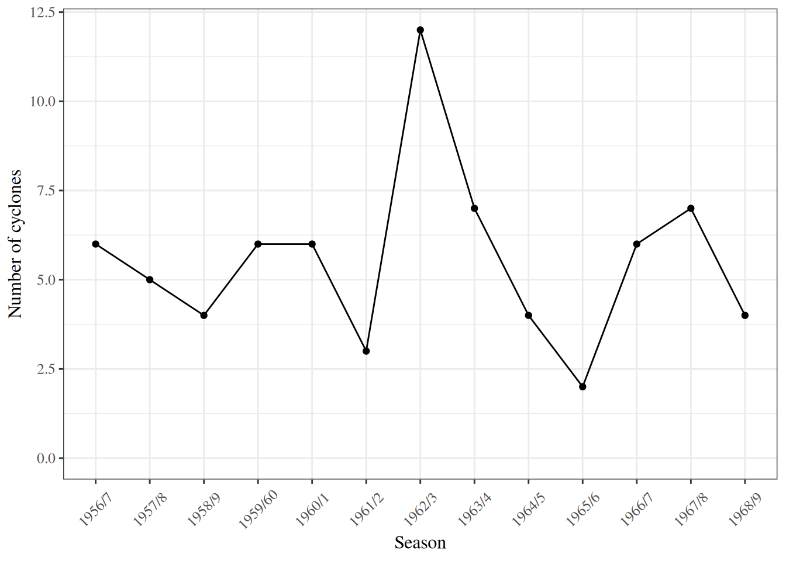](intro-MLEs_files/figure-html/unnamed-chunk-4-1.png "Figure 1: Number of tropical cyclones per season in northeastern Australia, 1956/57 to 1968/69")

Figure 1: Number of tropical cyclones per season in northeastern Australia, 1956/57 to 1968/69

[Figure 1](#fig-dobson-cyclone-time-series) shows no obvious trend, and no obvious correlation between adjacent seasons, so we assume that the seasons’ counts are mutually independent. We also assume that they are identically distributed, with a common distribution \\\Pr(X = x)\\; the expression has no index \\i\\, because the distribution is the same for every season.

[Figure 2](#fig-cyclones-bar-plot) shows the empirical distribution of the counts.

``` downlit
cyclones |>
  ggplot2::ggplot() +
  ggplot2::aes(x = number) +
  ggplot2::geom_bar() +
  ggplot2::expand_limits(x = 0) +
  ggplot2::xlab("Number of cyclones") +
  ggplot2::ylab("Count (number of seasons)")
```

[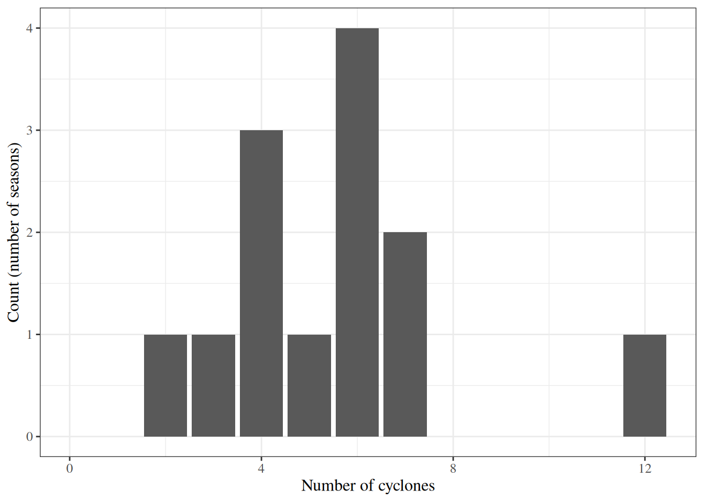](intro-MLEs_files/figure-html/unnamed-chunk-5-1.png "Figure 2: Bar plot of cyclones per season")

Figure 2: Bar plot of cyclones per season

[Table 4](#tbl-dobson-cyclones-sumstat) provides summary statistics.

``` downlit
n <- nrow(cyclones)
sumx <- sum(cyclones$number)
xbar <- mean(cyclones$number)
tibble::tibble(
  seasons = n,
  total = sumx,
  mean = xbar,
  variance = var(cyclones$number)
) |>
  knitr::kable(digits = 2)
```

| seasons | total | mean | variance |
|--------:|------:|-----:|---------:|
|      13 |    72 | 5.54 |      6.1 |

Table 4: Summary statistics for the `cyclones` data

### 2.1.2 Model

We want to estimate \\\Pr(X = x)\\; that is, \\\Pr(X = x)\\ is our [estimand](estimation.llms.md#def-estimand).

We could estimate \\\Pr(X = x)\\ for each value of \\x\\ in \\0, 1, 2, \ldots\\ separately (“nonparametrically”), using the fraction of our data with \\X_i = x\\; but then we would be estimating an infinite set of parameters from 13 observations, and each estimate would be imprecise. A parametric model, with a few parameters, will probably do better.

> **NOTE:**
>
> **Exercise 7 (Choosing a distribution family)** What parametric family of probability distributions might we use to model this empirical distribution?

> **NOTE:**
>
> *Solution*. The Poisson family. The data are counts, which can take any non-negative integer value. The binomial family also models counts, but a binomial count has an upper limit (its number of trials), and there is no natural upper limit on the number of cyclones in a season.

> **NOTE:**
>
> **Exercise 8 (The Poisson probability mass function)** Write down the Poisson distribution’s probability mass function.

> **NOTE:**
>
> *Solution*. \\\Pr(X = x) = \frac{\lambda^{x} e^{-\lambda}}{x!}, \quad x \in \mathopen{}\left\\0, 1, 2, \ldots\right\\\mathclose{} \tag{15}\\

### 2.1.3 Estimating the model parameters using maximum likelihood

We can estimate the parameter \\\lambda\\ using maximum likelihood estimation.

> **NOTE:**
>
> **Exercise 9 (Likelihood of one observation)** Write down the [likelihood](intro-MLEs.llms.md#def-lik-obs) of a single observation \\x\\, according to the Poisson model.

> **NOTE:**
>
> *Solution*. \\ \begin{aligned} \mathcal{L}(\lambda; x) &\stackrel{\text{def}}{=}\Pr(X = x) && \text{(definition of likelihood)}\\ &= \frac{\lambda^x e^{-\lambda}}{x!} && \text{(Poisson PMF)} \end{aligned} \\

> **NOTE:**
>
> **Exercise 10 (Model parameters)** Write down the vector of parameters in the model.

> **NOTE:**
>
> *Solution*. There is only one parameter, \\\lambda\\:
>
> \\\theta = (\lambda)\\

> **NOTE:**
>
> **Exercise 11 (Mean and variance)** Write down the population mean and variance of a single observation from the model, as functions of the parameters.

> **NOTE:**
>
> *Solution*.
>
> - Population mean: \\\operatorname{E}\mathopen{}\left\[X\right\]\mathclose{} = \lambda\\.
> - Population variance: \\\operatorname{Var}\mathopen{}\left(X\right)\mathclose{} = \lambda\\.
>
> The sample mean and variance in [Table 4](#tbl-dobson-cyclones-sumstat) are of similar size, as the model implies.

> **NOTE:**
>
> **Exercise 12 (Likelihood of the dataset)** Write down the likelihood of the full dataset.

> **NOTE:**
>
> *Solution*. \\ \begin{aligned} \mathcal{L}(\lambda; \tilde{x}) &\stackrel{\text{def}}{=}\Pr(\tilde{X}= \tilde{x}) && \text{(definition of likelihood)}\\ &= \Pr(X_1 = x_1, X_2 = x_2, \ldots, X\_{13} = x\_{13}) && \text{(write out the vector)}\\ &= \prod\_{i=1}^{13} \Pr(X_i = x_i) && \text{(independence)}\\ &= \prod\_{i=1}^{13} \frac{\lambda^{x_i} e^{-\lambda}}{x_i!} && \text{(Poisson PMF)} \end{aligned} \\

> **NOTE:**
>
> **Exercise 13 (Graphing the likelihood)** Graph the likelihood as a function of \\\lambda\\.

> **NOTE:**
>
> *Solution*.
>
> ``` downlit
> # `cyclones` is defined earlier on the page:
> # nolint next: object_usage_linter.
> lik <- function(lambda, y = cyclones$number, n = length(y)) {
>   lambda^sum(y) * exp(-n * lambda) / prod(factorial(y))
> }
>
> lik_plot <-
>   ggplot2::ggplot() +
>   ggplot2::geom_function(fun = lik, n = 1001) +
>   ggplot2::xlim(min(cyclones$number), max(cyclones$number)) +
>   ggplot2::ylab("likelihood") +
>   ggplot2::xlab("lambda")
>
> print(lik_plot)
> ```
>
> [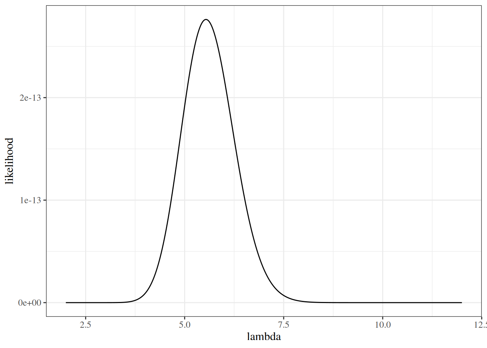](intro-MLEs_files/figure-html/unnamed-chunk-7-1.png "Figure 3: Likelihood of the cyclone data")
>
> Figure 3: Likelihood of the cyclone data

> **NOTE:**
>
> **Exercise 14 (Log-likelihood of the dataset)** Write down the log-likelihood of the full dataset.

> **NOTE:**
>
> *Solution*. \\ \begin{aligned} \ell(\lambda; \tilde{x}) &\stackrel{\text{def}}{=}\operatorname{log}\mathopen{}\left\\\mathcal{L}(\lambda; \tilde{x})\right\\\mathclose{} && \text{(definition of log-likelihood)}\\ &= \operatorname{log}\mathopen{}\left\\\prod\_{i = 1}^n \frac{\lambda^{x_i} e^{-\lambda}}{x_i!}\right\\\mathclose{} && \text{(likelihood of the dataset)}\\ &= \sum\_{i = 1}^n \operatorname{log}\mathopen{}\left\\\frac{\lambda^{x_i} e^{-\lambda}}{x_i!}\right\\\mathclose{} && \text{(log of a product)}\\ &= \sum\_{i = 1}^n \mathopen{}\left(\operatorname{log}\mathopen{}\left\\\lambda^{x_i}\right\\\mathclose{} + \operatorname{log}\mathopen{}\left\\e^{-\lambda}\right\\\mathclose{} - \operatorname{log}\mathopen{}\left\\x_i!\right\\\mathclose{}\right)\mathclose{} && \text{(log of a product and of a quotient)}\\ &= \sum\_{i = 1}^n \mathopen{}\left(x_i \operatorname{log}\mathopen{}\left\\\lambda\right\\\mathclose{} - \lambda - \operatorname{log}\mathopen{}\left\\x_i!\right\\\mathclose{}\right)\mathclose{} && \text{(log of a power; \$\log e^{a} = a\$)}\\ &= \mathopen{}\left(\sum\_{i = 1}^n x_i\right)\mathclose{} \operatorname{log}\mathopen{}\left\\\lambda\right\\\mathclose{} - n\lambda - \sum\_{i = 1}^n \operatorname{log}\mathopen{}\left\\x_i!\right\\\mathclose{} && \text{(split the sum)} \end{aligned} \\

> **NOTE:**
>
> **Exercise 15 (Graphing the log-likelihood)** Graph the log-likelihood as a function of \\\lambda\\.

> **NOTE:**
>
> *Solution*.
>
> ``` downlit
> # `cyclones` is defined earlier on the page:
> # nolint next: object_usage_linter.
> loglik <- function(lambda, y = cyclones$number, n = length(y)) {
>   sum(y) * log(lambda) - n * lambda - sum(lfactorial(y))
> }
>
> ll_plot <- ggplot2::ggplot() +
>   ggplot2::geom_function(fun = loglik, n = 1001) +
>   ggplot2::xlim(min(cyclones$number), max(cyclones$number)) +
>   ggplot2::ylab("log-likelihood") +
>   ggplot2::xlab("lambda")
> ll_plot
> ```
>
> [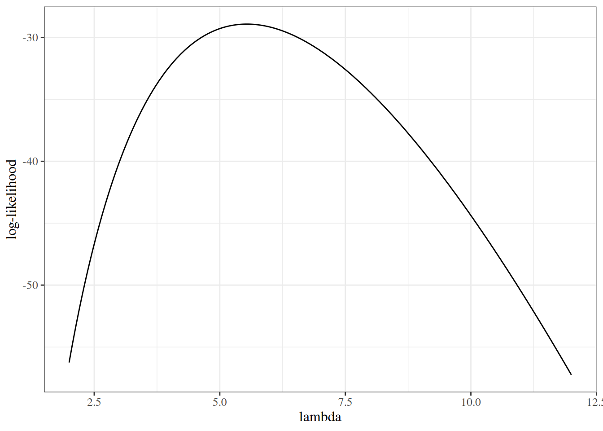](intro-MLEs_files/figure-html/unnamed-chunk-8-1.png "Figure 4: Log-likelihood of the cyclone data")
>
> Figure 4: Log-likelihood of the cyclone data

#### The score function

> **NOTE:**
>
> **Exercise 16 (Score function of the dataset)** Derive the [score function](intro-MLEs.llms.md#def-score) for the dataset.

> **NOTE:**
>
> *Solution*. The score function is the first derivative of the log-likelihood from [Exercise 14](#exr-sample-llik):
>
> \\ \begin{aligned} \ell'(\lambda; \tilde{x}) &\stackrel{\text{def}}{=}\frac{\partial}{\partial \lambda}\mathopen{}\left(\mathopen{}\left(\sum\_{i = 1}^n x_i\right)\mathclose{}\operatorname{log}\mathopen{}\left\\\lambda\right\\\mathclose{} - n\lambda - \sum\_{i = 1}^n \operatorname{log}\mathopen{}\left\\x_i!\right\\\mathclose{}\right)\mathclose{} && \text{(definition of the score)}\\ &= \mathopen{}\left(\sum\_{i = 1}^n x_i\right)\mathclose{}\frac{\partial}{\partial \lambda}\operatorname{log}\mathopen{}\left\\\lambda\right\\\mathclose{} - n\frac{\partial}{\partial \lambda}\lambda - \frac{\partial}{\partial \lambda}\sum\_{i = 1}^n \operatorname{log}\mathopen{}\left\\x_i!\right\\\mathclose{} && \text{(linearity of differentiation)}\\ &= \mathopen{}\left(\sum\_{i = 1}^n x_i\right)\mathclose{}\frac{1}{\lambda} - n - 0 && \text{(derivatives of \$\log \lambda\$, \$\lambda\$, and a constant)}\\ &= \frac{n \bar x}{\lambda} - n && \text{(\$\textstyle\sum\_{i=1}^n x_i = n \bar x\$)} \end{aligned} \\
>
> For the cyclone data, \\n = 13\\ and \\n \bar x = 72\\, so \\\ell'(\lambda; \tilde{x}) = 72/\lambda - 13\\.

> **NOTE:**
>
> **Exercise 17 (Graphing the score function)** Graph the score function.

> **NOTE:**
>
> *Solution*.
>
> ``` downlit
> # `cyclones` is defined earlier on the page:
> # nolint next: object_usage_linter.
> score <- function(lambda, y = cyclones$number, n = length(y)) {
>   (sum(y) / lambda) - n
> }
>
> ggplot2::ggplot() +
>   ggplot2::geom_function(fun = score, n = 1001) +
>   ggplot2::xlim(min(cyclones$number), max(cyclones$number)) +
>   ggplot2::ylab("l'(lambda)") +
>   ggplot2::xlab("lambda") +
>   ggplot2::geom_hline(yintercept = 0, col = "red")
> ```
>
> [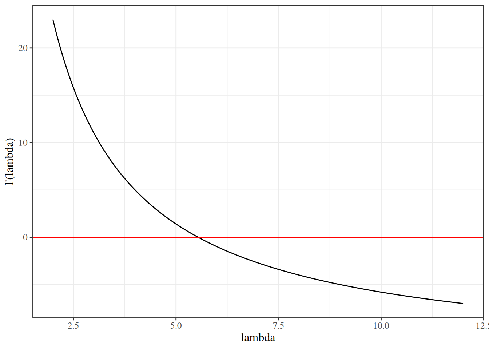](intro-MLEs_files/figure-html/unnamed-chunk-9-1.png "Figure 5: Score function of the cyclone data")
>
> Figure 5: Score function of the cyclone data

#### The Hessian

> **NOTE:**
>
> **Exercise 18 (Hessian)** Derive the [Hessian](intro-MLEs.llms.md#def-hessian).

> **NOTE:**
>
> *Solution*. With one parameter, the Hessian is the second derivative of the log-likelihood, which is the derivative of the score from [Exercise 16](#exr-cyclone-score-fn):
>
> \\ \begin{aligned} \ell''(\lambda; \tilde{x}) &= \frac{\partial}{\partial \lambda}\mathopen{}\left(\frac{n \bar x}{\lambda} - n\right)\mathclose{} && \text{(differentiate the score)}\\ &= n \bar x \frac{\partial}{\partial \lambda}\frac{1}{\lambda} - \frac{\partial}{\partial \lambda} n && \text{(linearity of differentiation)}\\ &= -\frac{n \bar x}{\lambda^2} && \text{(\$\tfrac{d}{d\lambda}\lambda^{-1} = -\lambda^{-2}\$; \$n\$ is constant)} \end{aligned} \\
>
> For the cyclone data, \\\ell''(\lambda; \tilde{x}) = -72/\lambda^2\\.

> **NOTE:**
>
> **Exercise 19 (Graphing the Hessian)** Graph the Hessian.

> **NOTE:**
>
> *Solution*.
>
> ``` downlit
> # `cyclones` is defined earlier on the page:
> # nolint next: object_usage_linter.
> hessian <- function(lambda, y = cyclones$number, n = length(y)) {
>   -sum(y) / (lambda^2)
> }
>
> ggplot2::ggplot() +
>   ggplot2::geom_function(fun = hessian, n = 1001) +
>   ggplot2::xlim(min(cyclones$number), max(cyclones$number)) +
>   ggplot2::ylab("l''(lambda)") +
>   ggplot2::xlab("lambda") +
>   ggplot2::geom_hline(yintercept = 0, col = "red")
> ```
>
> [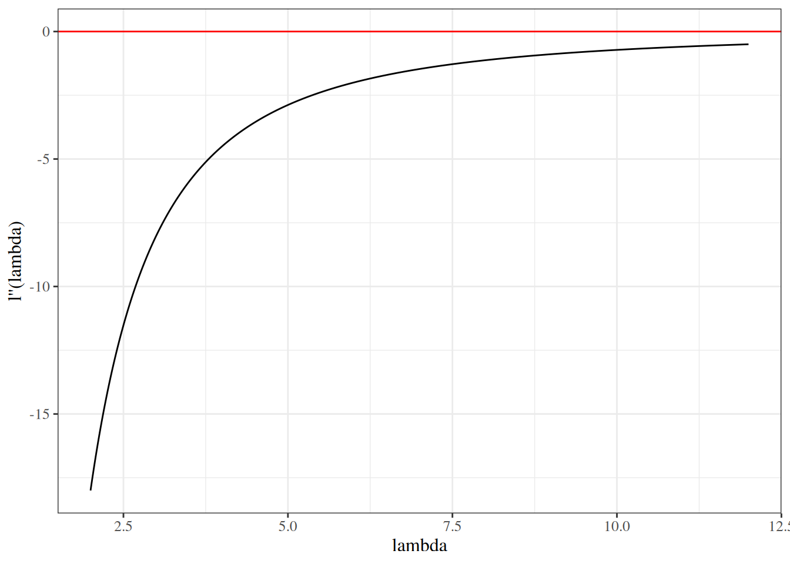](intro-MLEs_files/figure-html/unnamed-chunk-10-1.png "Figure 6: Hessian of the cyclone data’s log-likelihood")
>
> Figure 6: Hessian of the cyclone data’s log-likelihood

> **NOTE:**
>
> **Exercise 20 (Score equation)** Write the score equation (also called the estimating equation).

> **NOTE:**
>
> *Solution*. \\\ell'(\lambda; \tilde{x}) = 0\\

### 2.1.4 Finding the MLE analytically

In this example, we can find the MLE of \\\lambda\\ by solving the score equation algebraically.

> **NOTE:**
>
> **Exercise 21 (Solving the score equation)** Solve the score equation from [Exercise 20](#exr-score-equation) for \\\lambda\\, using the score from [Exercise 16](#exr-cyclone-score-fn).

> **NOTE:**
>
> *Solution*. \\ \begin{aligned} 0 &= \frac{n \bar x}{\lambda} - n && \text{(score of the dataset)}\\ n &= \frac{n \bar x}{\lambda} && \text{(add \$n\$ to both sides)}\\ n\lambda &= n \bar x && \text{(multiply both sides by \$\lambda \> 0\$)}\\ \lambda &= \bar x && \text{(divide both sides by \$n\$)} \end{aligned} \\

Call this solution of the score equation \\\tilde \lambda\\ for now:

\\\tilde \lambda \stackrel{\text{def}}{=}\bar x\\

> **NOTE:**
>
> **Exercise 22 (Checking the second derivative)** Confirm that the Hessian \\\ell''(\lambda; \tilde{x})\\ is negative when evaluated at \\\tilde \lambda\\, using [Exercise 18](#exr-hessian).

> **NOTE:**
>
> *Solution*. \\ \begin{aligned} \ell''(\tilde\lambda; \tilde{x}) &= -\frac{n \bar x}{\tilde\lambda^2} && \text{(Hessian of the log-likelihood)}\\ &= -\frac{n \bar x}{\bar x^2} && \text{(substitute \$\tilde\lambda = \bar x\$)}\\ &= -\frac{n}{\bar x} && \text{(cancel one factor of \$\bar x\$)}\\ &\< 0 && \text{(\$n \> 0\$ and \$\bar x \> 0\$)} \end{aligned} \\

> **NOTE:**
>
> **Exercise 23 (Identifying the MLE)** Draw conclusions about the MLE of \\\lambda\\.

> **NOTE:**
>
> *Solution*. Since \\\ell''(\tilde \lambda; \tilde{x}) \< 0\\, \\\tilde \lambda\\ is a local maximizer of the log-likelihood. Moreover, \\\ell''(\lambda; \tilde{x}) = -n\bar x/\lambda^2 \< 0\\ for every \\\lambda \> 0\\, so the log-likelihood is strictly concave, and a local maximizer of a strictly concave function is its unique global maximizer. So \\\tilde \lambda\\ maximizes \\\ell\\, and therefore \\\mathcal{L}\\:
>
> ``` downlit
> mle <- mean(cyclones$number)
> ```
>
> \\\hat{\lambda}\_{\text{ML}} = \bar x = 5.538\\

> **NOTE:**
>
> **Exercise 24 (Graphing the MLE)** Graph the log-likelihood with the MLE superimposed.

> **NOTE:**
>
> *Solution*.
>
> ``` downlit
> mle_data <- tibble::tibble(x = mle, y = loglik(mle))
> ll_plot +
>   ggplot2::geom_point(data = mle_data, ggplot2::aes(x = x, y = y), col = "red")
> ```
>
> [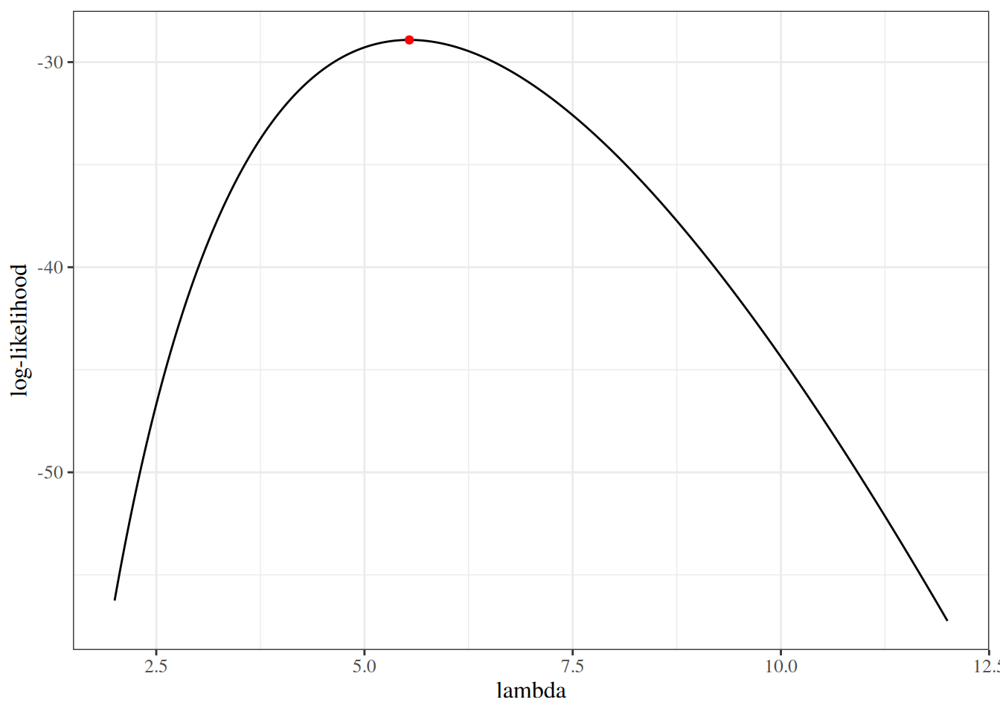](intro-MLEs_files/figure-html/unnamed-chunk-11-1.png "Figure 7: Log-likelihood of the cyclone data, with the MLE marked in red")
>
> Figure 7: Log-likelihood of the cyclone data, with the MLE marked in red

#### Observed information

[Figure 8](#fig-obs-inf-matrix) graphs the [observed information](intro-MLEs.llms.md#def-oinf), \\I(\lambda; \tilde{x}) = -\ell''(\lambda; \tilde{x})\\.

``` downlit
obs_inf <- function(...) -hessian(...) # nolint: object_usage_linter.
ggplot2::ggplot() +
  ggplot2::geom_function(fun = obs_inf, n = 1001) +
  ggplot2::xlim(min(cyclones$number), max(cyclones$number)) +
  ggplot2::ylab("I(lambda)") +
  ggplot2::xlab("lambda") +
  ggplot2::geom_hline(yintercept = 0, col = "red")
```

[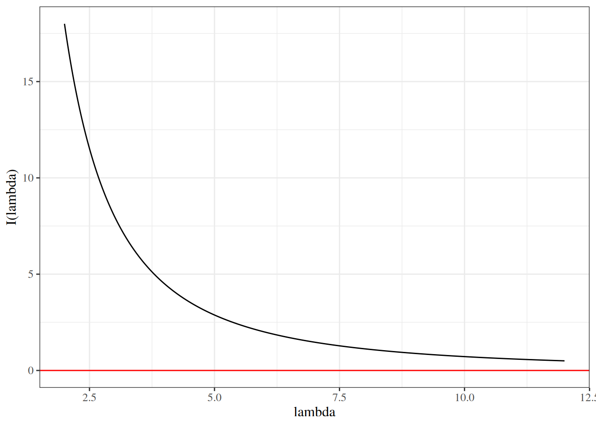](intro-MLEs_files/figure-html/unnamed-chunk-12-1.png "Figure 8: Observed information of the cyclone data")

Figure 8: Observed information of the cyclone data

## 2.2 Finding the MLE using the Newton-Raphson algorithm

### 2.2.1 Iterative maximization

When we cannot solve the score equation \\\ell'(\theta) = 0\\ algebraically, we can search for its solution numerically ([Dobson and Barnett 2018, chap. 4](#ref-dobson4e)).

> **NOTE:**
>
> **Definition 14 (Newton-Raphson algorithm)** The **Newton-Raphson algorithm** for solving the score equation \\\ell'(\theta) = 0\\ starts from an initial guess \\{\widehat{\theta}}^\*\\ and repeats the update
>
> \\ \begin{aligned} {\widehat{\theta}}^\* &\leftarrow {\widehat{\theta}}^\* - \mathopen{}\left(\ell''\mathopen{}\left(\tilde{x}; {\widehat{\theta}}^\*\right)\mathclose{}\right)^{-1}\mathclose{} \ell'\mathopen{}\left(\tilde{x}; {\widehat{\theta}}^\*\right)\mathclose{}\\ &= {\widehat{\theta}}^\* + \mathopen{}\left(I\mathopen{}\left(\tilde{x}; {\widehat{\theta}}^\*\right)\mathclose{}\right)^{-1}\mathclose{} \ell'\mathopen{}\left(\tilde{x}; {\widehat{\theta}}^\*\right)\mathclose{} \end{aligned} \\
>
> until the estimate stops changing.

The second line of the update uses \\I= -\ell''\\ ([observed information](#def-oinf)).

The update comes from approximating the score function near \\{\widehat{\theta}}^\*\\ by its first-order [Taylor polynomial](https://en.wikipedia.org/wiki/Taylor%27s_theorem):

\\ \begin{aligned} \ell'(\theta) &\approx \ell'^\*(\theta)\\ &\stackrel{\text{def}}{=}\ell'({\widehat{\theta}}^\*) + \ell''({\widehat{\theta}}^\*)(\theta- {\widehat{\theta}}^\*) \end{aligned} \\

The approximate score function \\\ell'^\*(\theta)\\ is linear in \\\theta\\, so the approximate score equation \\\ell'^\*(\theta) = 0\\ is easy to solve:

\\ \begin{aligned} 0 &= \ell'({\widehat{\theta}}^\*) + \ell''({\widehat{\theta}}^\*)(\theta- {\widehat{\theta}}^\*) && \text{(set \$\ell'^\*(\theta) = 0\$)}\\ -\ell'({\widehat{\theta}}^\*) &= \ell''({\widehat{\theta}}^\*)(\theta- {\widehat{\theta}}^\*) && \text{(subtract \$\ell'({\widehat{\theta}}^\*)\$)}\\ -\mathopen{}\left(\ell''({\widehat{\theta}}^\*)\right)^{-1}\mathclose{}\ell'({\widehat{\theta}}^\*) &= \theta- {\widehat{\theta}}^\* && \text{(multiply by \$\mathopen{}\left(\ell''({\widehat{\theta}}^\*)\right)^{-1}\mathclose{}\$ on the left)}\\ \theta&= {\widehat{\theta}}^\* - \mathopen{}\left(\ell''({\widehat{\theta}}^\*)\right)^{-1}\mathclose{}\ell'({\widehat{\theta}}^\*) && \text{(add \${\widehat{\theta}}^\*\$)} \end{aligned} \\

and the solution becomes the next guess.

> **NOTE:**
>
> **Definition 15 (Fisher scoring)** **Fisher scoring** (also called the method of scoring) is the [Newton-Raphson algorithm](#def-newton-raphson) with the observed information \\I(\tilde{x}; {\widehat{\theta}}^\*)\\ in the update replaced by the [expected information](#def-einf) \\\mathcal{I}({\widehat{\theta}}^\*)\\:
>
> \\ {\widehat{\theta}}^\* \leftarrow {\widehat{\theta}}^\* + \mathopen{}\left(\mathcal{I}\mathopen{}\left({\widehat{\theta}}^\*\right)\mathclose{}\right)^{-1}\mathclose{} \ell'\mathopen{}\left(\tilde{x}; {\widehat{\theta}}^\*\right)\mathclose{} \\

The expected information is sometimes simpler to compute than the observed information.

> **NOTE:**
>
> **Example 10 (Fisher scoring for Poisson data)** For \\X_1, \ldots, X_n \\ \sim\_{\operatorname{iid}}\\ \operatorname{Pois}({\lambda})\\, the score is \\\ell'({\lambda}) = n\bar x/{\lambda}- n\\ and the expected information is \\\mathcal{I}({\lambda}) = n/{\lambda}\\ ([Example 4](#exm-information-poisson)), so one Fisher scoring step from any \\{\widehat{\lambda}}^\*\> 0\\ gives:
>
> \\ \begin{aligned} {\widehat{\lambda}}^\*+ \mathopen{}\left(\mathcal{I}({\widehat{\lambda}}^\*)\right)^{-1}\mathclose{} \ell'({\widehat{\lambda}}^\*) &= {\widehat{\lambda}}^\*+ \frac{{\widehat{\lambda}}^\*}{n}\mathopen{}\left(\frac{n\bar x}{{\widehat{\lambda}}^\*} - n\right)\mathclose{} && \text{(substitute \$\mathcal{I}\$ and \$\ell'\$)}\\ &= {\widehat{\lambda}}^\*+ \bar x - {\widehat{\lambda}}^\* && \text{(distribute \${\widehat{\lambda}}^\*/n\$)}\\ &= \bar x && \text{(cancel \${\widehat{\lambda}}^\*\$)} \end{aligned} \\
>
> So Fisher scoring reaches the MLE \\\bar x\\ in one step, while Newton-Raphson needs several ([Table 5](#tbl-mle-converge)).

> **NOTE:**
>
> **Definition 16 (Empirical information matrix)** For mutually independent observations, the **empirical information matrix** is ([McLachlan and Krishnan 2007](#ref-mclachlan2007em)):
>
> \\ I_e(\theta; \tilde{x}) \stackrel{\text{def}}{=} \sum\_{i = 1}^{n} \ell'\_i {\ell'\_i}^{\top} - \frac{1}{n} \ell'{\ell'}^{\top} \\
>
> where \\\ell'\_i\\ is the score of the \\i\\th observation’s log-likelihood, and \\\ell'= \sum\_{i = 1}^{n} \ell'\_i\\.

For \\\operatorname{iid}\\ data, \\\frac{1}{n}I_e(\theta; \tilde{x})\\ is the sample covariance matrix (with divisor \\n\\) of the observations’ scores, so it estimates the covariance matrix of one observation’s score, \\\mathcal{I}(\theta)/n\\ ([Theorem 8](#thm-information-equality)). The empirical information needs only first derivatives, so it can be easier to compute than the observed information, and it can replace the observed information in the Newton-Raphson update.

### 2.2.2 Applying Newton-Raphson to the cyclone data

> **NOTE:**
>
> **Example 11 (Finding the MLE using the Newton-Raphson algorithm)** We found the MLE \\\hat{\lambda} = \bar{x}\\ by solving the score equation \\\ell'(\lambda) = 0\\ algebraically ([Exercise 21](#exr-solve-score-equation)). If we could not have solved it, we could instead start from an initial guess such as \\{\widehat{\lambda}}^\*= 3\\ and apply the [Newton-Raphson algorithm](#sec-newton-raphson).
>
> ``` downlit
> cur_lambda_est <- 3
> ```

From [Exercise 16](#exr-cyclone-score-fn) and [Exercise 18](#exr-hessian), the score function and Hessian are:

\\ \begin{aligned} \ell'(\lambda; \tilde{x}) &= \frac{72}{\lambda} - 13\\ \ell''(\lambda; \tilde{x}) &= -\frac{72}{\lambda^2} \end{aligned} \\

So the first-order Taylor approximation of the score function around \\{\widehat{\lambda}}^\*\\ is:

\\ \begin{aligned} \ell'(\lambda) &\approx \ell'^\*(\lambda)\\ &\stackrel{\text{def}}{=}\ell'({\widehat{\lambda}}^\*) + \ell''({\widehat{\lambda}}^\*)(\lambda - {\widehat{\lambda}}^\*)\\ &= \mathopen{}\left(\frac{72}{{\widehat{\lambda}}^\*} - 13\right)\mathclose{} + \mathopen{}\left(-\frac{72}{\mathopen{}\left({\widehat{\lambda}}^\*\right)^2\mathclose{}}\right)\mathclose{} (\lambda - {\widehat{\lambda}}^\*) \end{aligned} \\

[Figure 9](#fig-cyclone-newton-step1) compares the score function and the approximate score function at \\{\widehat{\lambda}}^\*= 3\\.

``` downlit
# score(), hessian() and loglik() are defined earlier on the page
# nolint start: object_usage_linter.
approx_score <- function(lambda, lhat, ...) {
  score(lambda = lhat, ...) +
    hessian(lambda = lhat, ...) * (lambda - lhat)
}
# nolint end

point_size <- 5

plot1 <- ggplot2::ggplot() +
  ggplot2::geom_function(
    fun = score,
    ggplot2::aes(col = "score function"),
    n = 1001
  ) +
  ggplot2::geom_function(
    fun = approx_score,
    ggplot2::aes(col = "approximate score function"),
    n = 1001,
    args = list(lhat = cur_lambda_est)
  ) +
  ggplot2::geom_point(
    size = point_size,
    ggplot2::aes(
      x = cur_lambda_est, y = score(lambda = cur_lambda_est),
      col = "current estimate"
    )
  ) +
  ggplot2::geom_point(
    size = point_size,
    ggplot2::aes(x = xbar, y = 0, col = "MLE")
  ) +
  ggplot2::xlim(min(cyclones$number), max(cyclones$number)) +
  ggplot2::ylab("l'(lambda)") +
  ggplot2::xlab("lambda") +
  ggplot2::geom_hline(yintercept = 0)

print(plot1)
```

[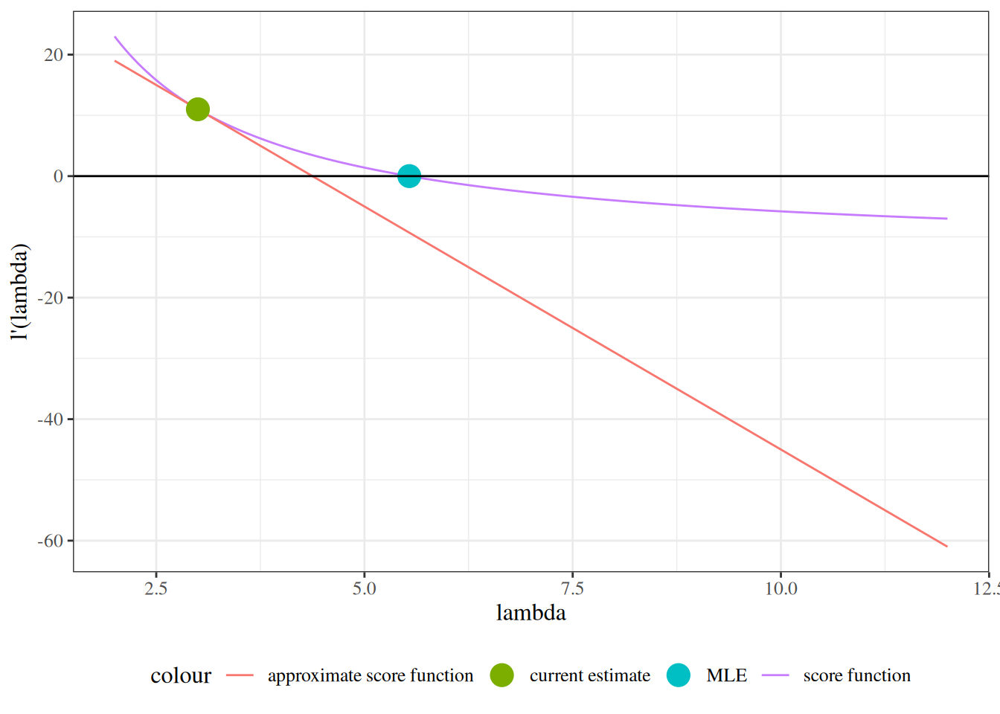](intro-MLEs_files/figure-html/unnamed-chunk-13-1.png "Figure 9: Score function of the cyclone data and its first-order approximation at the initial guess")

Figure 9: Score function of the cyclone data and its first-order approximation at the initial guess

Approximating the score function by a linear function is equivalent to approximating the log-likelihood by a second-order Taylor polynomial ([Figure 10](#fig-cyclone-newton-step1-loglik)):

\\ \ell^\*(\lambda) \stackrel{\text{def}}{=} \ell({\widehat{\lambda}}^\*) + (\lambda - {\widehat{\lambda}}^\*) \ell'({\widehat{\lambda}}^\*) + \frac{1}{2}\ell''({\widehat{\lambda}}^\*)(\lambda - {\widehat{\lambda}}^\*)^2 \\

``` downlit
# nolint start: object_usage_linter.
approx_loglik <- function(lambda, lhat, ...) {
  loglik(lambda = lhat, ...) +
    score(lambda = lhat, ...) * (lambda - lhat) +
    1 / 2 * hessian(lambda = lhat, ...) * (lambda - lhat)^2
}
# nolint end

plot_loglik <- ggplot2::ggplot() +
  ggplot2::geom_function(
    fun = loglik,
    ggplot2::aes(col = "log-likelihood"),
    n = 1001
  ) +
  ggplot2::geom_function(
    fun = approx_loglik,
    ggplot2::aes(col = "approximate log-likelihood"),
    n = 1001,
    args = list(lhat = cur_lambda_est)
  ) +
  ggplot2::geom_point(
    size = point_size,
    ggplot2::aes(
      x = cur_lambda_est, y = loglik(lambda = cur_lambda_est),
      col = "current estimate"
    )
  ) +
  ggplot2::geom_point(
    size = point_size,
    ggplot2::aes(x = xbar, y = loglik(xbar), col = "MLE")
  ) +
  ggplot2::xlim(min(cyclones$number) - 1, max(cyclones$number)) +
  ggplot2::ylab("log-likelihood") +
  ggplot2::xlab("lambda")

print(plot_loglik)
```

[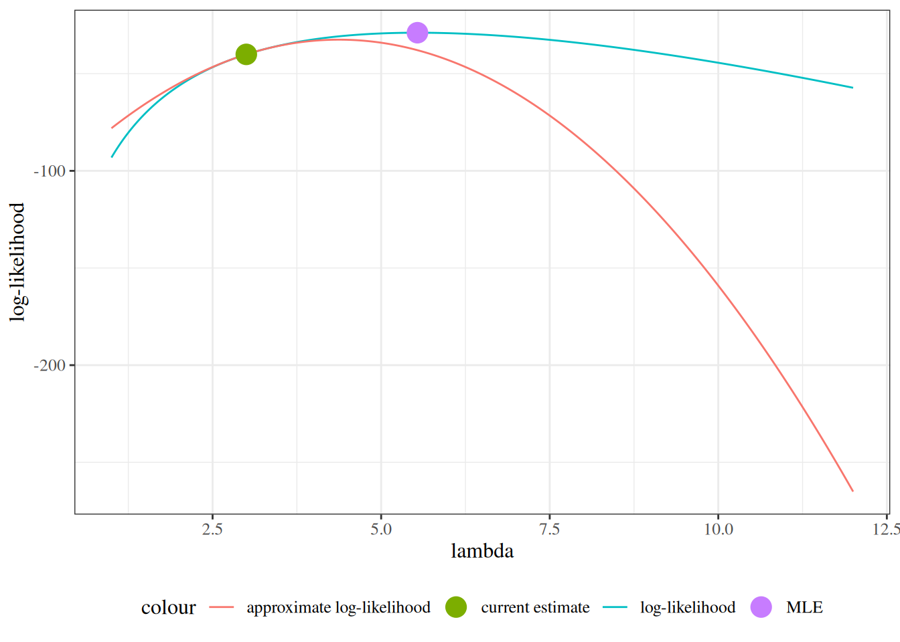](intro-MLEs_files/figure-html/unnamed-chunk-14-1.png "Figure 10: Log-likelihood of the cyclone data and its second-order approximation at the initial guess")

Figure 10: Log-likelihood of the cyclone data and its second-order approximation at the initial guess

Solving the approximate score equation \\\ell'^\*(\lambda) = 0\\ gives the next estimate:

\\ \begin{aligned} \lambda &= {\widehat{\lambda}}^\*- \ell'({\widehat{\lambda}}^\*) \cdot\mathopen{}\left(\ell''({\widehat{\lambda}}^\*)\right)^{-1}\mathclose{}\\ &= 4.375 \end{aligned} \\

``` downlit
new_lambda_est <-
  cur_lambda_est - score(cur_lambda_est) / hessian(cur_lambda_est)
```

``` downlit
plot2 <- plot1 +
  ggplot2::geom_point(
    size = point_size,
    ggplot2::aes(x = new_lambda_est, y = 0, col = "new estimate")
  ) +
  ggplot2::geom_segment(
    arrow = grid::arrow(),
    linewidth = 2,
    alpha = .7,
    ggplot2::aes(
      x = cur_lambda_est,
      y = approx_score(lhat = cur_lambda_est, lambda = cur_lambda_est),
      xend = new_lambda_est,
      yend = 0,
      col = "update"
    )
  )
print(plot2)
```

[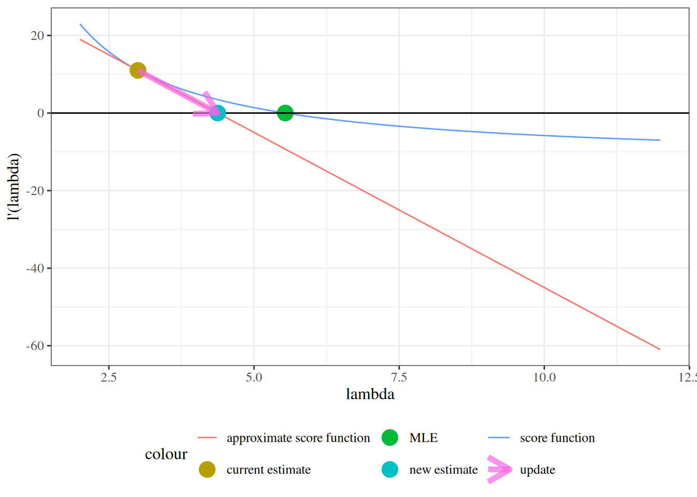](intro-MLEs_files/figure-html/unnamed-chunk-15-1.png "Figure 11: The first Newton-Raphson update: the new estimate is where the approximate score function crosses zero")

Figure 11: The first Newton-Raphson update: the new estimate is where the approximate score function crosses zero

We update \\{\widehat{\lambda}}^\*\leftarrow 4.375\\ and repeat the process ([Figure 12](#fig-cyclone-newton-step2)).

``` downlit
plot2 +
  ggplot2::geom_function(
    fun = approx_score,
    ggplot2::aes(col = "new approximate score function"),
    n = 1001,
    args = list(lhat = new_lambda_est)
  ) +
  ggplot2::geom_point(
    size = point_size,
    ggplot2::aes(
      x = new_lambda_est, y = score(lambda = new_lambda_est),
      col = "new estimate"
    )
  )
```

[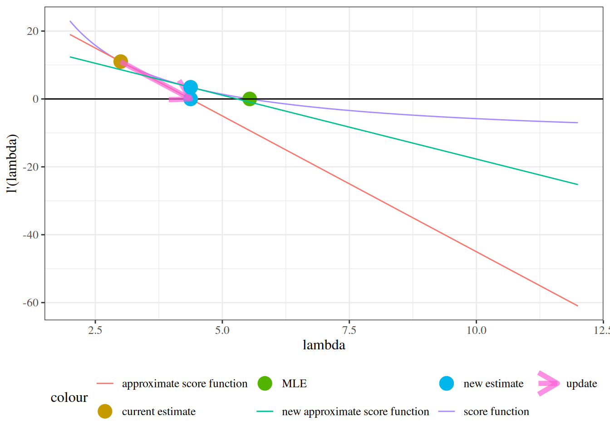](intro-MLEs_files/figure-html/unnamed-chunk-16-1.png "Figure 12: The approximate score function at the updated estimate")

Figure 12: The approximate score function at the updated estimate

We repeat this process until the log-likelihood stops changing ([Table 5](#tbl-mle-converge)).

``` downlit
cur_lambda_est <- 3 # restart from the initial guess
tolerance <- 10^-4
max_iter <- 100
nr_info <- tibble::tibble(
  iteration = 0,
  lambda = cur_lambda_est,
  `log(likelihood)` = loglik(cur_lambda_est),
  score = score(cur_lambda_est),
  hessian = hessian(cur_lambda_est)
)

for (cur_iter in 1:max_iter) {
  new_lambda_est <-
    cur_lambda_est - score(cur_lambda_est) / hessian(cur_lambda_est)

  diff_loglik <- loglik(new_lambda_est) - loglik(cur_lambda_est)

  nr_info <- nr_info |>
    dplyr::bind_rows(
      tibble::tibble(
        iteration = cur_iter,
        lambda = new_lambda_est,
        `log(likelihood)` = loglik(new_lambda_est),
        score = score(new_lambda_est),
        hessian = hessian(new_lambda_est),
        `diff(loglik)` = diff_loglik
      )
    )

  cur_lambda_est <- new_lambda_est

  if (abs(diff_loglik) < tolerance) {
    break
  }
}

nr_info |> knitr::kable(digits = 5)
```

| iteration |  lambda | log(likelihood) |    score |  hessian | diff(loglik) |
|----------:|--------:|----------------:|---------:|---------:|-------------:|
|         0 | 3.00000 |        -40.0610 | 11.00000 | -8.00000 |           NA |
|         1 | 4.37500 |        -30.7708 |  3.45714 | -3.76163 |      9.29018 |
|         2 | 5.29405 |        -28.9897 |  0.60016 | -2.56895 |      1.78110 |
|         3 | 5.52768 |        -28.9176 |  0.02537 | -2.35639 |      0.07210 |
|         4 | 5.53844 |        -28.9175 |  0.00005 | -2.34724 |      0.00014 |
|         5 | 5.53846 |        -28.9175 |  0.00000 | -2.34722 |      0.00000 |

Table 5: Convergence of the Newton-Raphson algorithm to the MLE for the cyclone data

The final estimate matches the closed-form MLE, \\\bar x = 5.53846\\ ([Exercise 23](#exr-find-mle)).

``` downlit
ll_plot +
  ggplot2::geom_segment(
    data = nr_info,
    arrow = grid::arrow(),
    alpha = .7,
    ggplot2::aes(
      x = lambda,
      xend = dplyr::lead(lambda),
      y = `log(likelihood)`,
      yend = dplyr::lead(`log(likelihood)`),
      col = factor(iteration)
    )
  ) +
  ggplot2::labs(col = "iteration")
```

[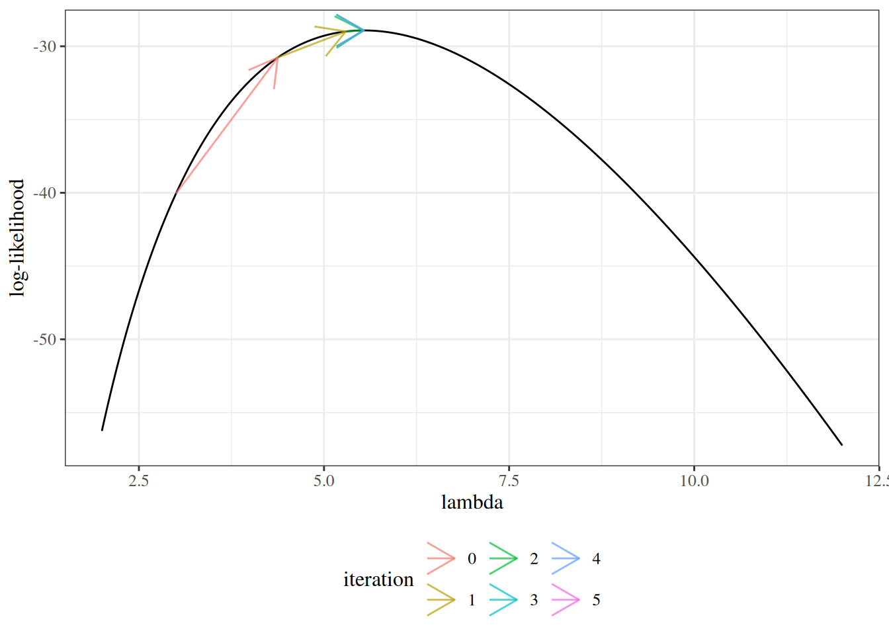](intro-MLEs_files/figure-html/unnamed-chunk-18-1.png "Figure 13: Newton-Raphson steps toward the MLE of the Poisson model (Equation 15) for the cyclone data")

Figure 13: Newton-Raphson steps toward the MLE of the Poisson model ([Equation 15](#eq-iid-model)) for the cyclone data

# 3 Maximum likelihood for univariate Gaussian models

Suppose \\X_1, \ldots, X_n \\ \sim\_{\operatorname{iid}}\\ \operatorname{N}\mathopen{}\left(\mu, \sigma^2\right)\mathclose{}\\, and let \\x_1, \ldots, x_n\\ be the observed values. The parameter vector is \\\tilde{\theta}= (\mu, \sigma^2)\\. We treat \\\sigma^2\\, rather than \\\sigma\\, as the second parameter, and differentiate with respect to \\\sigma^2\\ directly.

By [Theorem 1](#thm-lik-iid), the likelihood is:

\\ \mathcal{L}(\mu, \sigma^2) = \prod\_{i=1}^n (2\pi\sigma^2)^{-1/2} \operatorname{exp}\mathopen{}\left\\-\frac{(x_i - \mu)^2}{2\sigma^2}\right\\\mathclose{} \\

and by [Theorem 4](#thm-loglik-iid), the log-likelihood is:

\\ \begin{aligned} \ell(\mu, \sigma^2) &= \sum\_{i=1}^n \mathopen{}\left(-\frac{1}{2}\operatorname{log}\mathopen{}\left\\2\pi\sigma^2\right\\\mathclose{} - \frac{(x_i - \mu)^2}{2\sigma^2}\right)\mathclose{} && \text{(log of each Gaussian density)}\\ &= -\frac{n}{2}\operatorname{log}\mathopen{}\left\\2\pi\right\\\mathclose{} - \frac{n}{2}\operatorname{log}\mathopen{}\left\\\sigma^2\right\\\mathclose{} - \frac{1}{2\sigma^2}\sum\_{i=1}^n (x_i - \mu)^2 && \text{(split the sum; log of a product)} \end{aligned} \\

## 3.1 The score function

The score function is the vector of the two partial derivatives:

\\ \ell'(\mu, \sigma^2) = \begin{pmatrix} \frac{\partial}{\partial \mu}\ell(\mu, \sigma^2) \\ \frac{\partial}{\partial \sigma^2}\ell(\mu, \sigma^2) \end{pmatrix} \\

For the first entry, only the last term of \\\ell\\ depends on \\\mu\\:

\\ \begin{aligned} \frac{\partial}{\partial \mu}\ell &= -\frac{1}{2\sigma^2}\sum\_{i=1}^n \frac{\partial}{\partial \mu}(x_i - \mu)^2 && \text{(linearity of differentiation)}\\ &= -\frac{1}{2\sigma^2}\sum\_{i=1}^n -2(x_i - \mu) && \text{(chain rule)}\\ &= \frac{1}{\sigma^2}\mathopen{}\left(\sum\_{i=1}^n x_i - n\mu\right)\mathclose{} && \text{(simplify; split the sum)} \end{aligned} \\

For the second entry, write \\\sigma^2\\ as a single variable \\v\\, so that \\\ell\\ contains \\-\frac{n}{2}\log v\\ and \\-\frac{1}{2}v^{-1}\sum_i (x_i - \mu)^2\\:

\\ \begin{aligned} \frac{\partial}{\partial \sigma^2}\ell &= -\frac{n}{2}\mathopen{}\left(\sigma^2\right)\mathclose{}^{-1} + \frac{1}{2}\mathopen{}\left(\sigma^2\right)\mathclose{}^{-2}\sum\_{i=1}^n (x_i - \mu)^2 && \text{(derivatives of \$\log v\$ and \$v^{-1}\$)} \end{aligned} \\

## 3.2 MLE of \\\mu\\

Setting \\\frac{\partial}{\partial \mu}\ell = 0\\:

\\ \begin{aligned} 0 &= \frac{1}{\sigma^2}\mathopen{}\left(\sum\_{i=1}^n x_i - n\mu\right)\mathclose{} && \text{(score for \$\mu\$)}\\ n\mu &= \sum\_{i=1}^n x_i && \text{(multiply by \$\sigma^2\$; add \$n\mu\$)}\\ \mu &= \bar x && \text{(divide by \$n\$)} \end{aligned} \\

This solution does not depend on \\\sigma^2\\. The second derivative is

\\\frac{\partial^2 \ell}{\partial \mu^2} = \frac{\partial}{\partial \mu}\frac{1}{\sigma^2}\mathopen{}\left(\sum\_{i=1}^n x_i - n\mu\right)\mathclose{} = -\frac{n}{\sigma^2} \< 0,\\

so for every fixed \\\sigma^2\\, \\\ell\\ is maximized over \\\mu\\ at \\\bar x\\, and \\\hat\mu\_{\text{ML}} = \bar x\\.

## 3.3 MLE of \\\sigma^2\\

Setting \\\frac{\partial}{\partial \sigma^2}\ell = 0\\:

\\ \begin{aligned} 0 &= -\frac{n}{2}\mathopen{}\left(\sigma^2\right)\mathclose{}^{-1} + \frac{1}{2}\mathopen{}\left(\sigma^2\right)\mathclose{}^{-2}\sum\_{i=1}^n (x_i - \mu)^2 && \text{(score for \$\sigma^2\$)}\\ \frac{n}{2}\mathopen{}\left(\sigma^2\right)\mathclose{}^{-1} &= \frac{1}{2}\mathopen{}\left(\sigma^2\right)\mathclose{}^{-2}\sum\_{i=1}^n (x_i - \mu)^2 && \text{(add \$\tfrac{n}{2}(\sigma^2)^{-1}\$)}\\ \sigma^2 &= \frac{1}{n}\sum\_{i=1}^n (x_i - \mu)^2 && \text{(multiply by \$2(\sigma^2)^2/n\$)} \end{aligned} \\

Substituting the maximizer \\\mu = \bar x\\, which does not depend on \\\sigma^2\\ (a technique called profiling), gives:

\\\hat{\sigma}^2\_{\text{ML}} = \frac{1}{n}\sum\_{i=1}^n (x_i - \bar x)^2\\

The profile log-likelihood \\\ell(\bar x, \sigma^2) = -\frac{n}{2}\operatorname{log}\mathopen{}\left\\2\pi\right\\\mathclose{} - \frac{n}{2}\operatorname{log}\mathopen{}\left\\\sigma^2\right\\\mathclose{} - \frac{n\hat\sigma^2\_{\text{ML}}}{2\sigma^2}\\ increases for \\\sigma^2 \< \hat\sigma^2\_{\text{ML}}\\ and decreases for \\\sigma^2 \> \hat\sigma^2\_{\text{ML}}\\, because its derivative, \\\frac{n}{2}\mathopen{}\left(\sigma^2\right)\mathclose{}^{-2}\mathopen{}\left(\hat\sigma^2\_{\text{ML}} - \sigma^2\right)\mathclose{}\\, has the sign of \\\hat\sigma^2\_{\text{ML}} - \sigma^2\\. So \\(\bar x, \hat\sigma^2\_{\text{ML}})\\ is the global maximizer, provided the \\x_i\\ are not all equal.

Differentiating with respect to \\\sigma^2\\ as a single variable, rather than with respect to \\\sigma\\, keeps the algebra short. Replacing \\\sigma^2\\ with the precision \\\tau \stackrel{\text{def}}{=}1/\sigma^2\\ and differentiating with respect to \\\tau\\ can be shorter still, because \\\tau\\ enters the log-likelihood as \\\frac{n}{2}\log\tau - \frac{\tau}{2}\sum\_{i=1}^n (x_i - \mu)^2\\. By the invariance of maximum likelihood estimates, \\\hat\tau\_{\text{ML}} = 1/\hat\sigma^2\_{\text{ML}}\\.

This MLE divides by \\n\\, so it is a biased estimator of \\\sigma^2\\ ([bias of the divide-by-\\n\\ estimator](estimation.llms.md#exm-biased-variance-mle)).

## 3.4 Second derivatives

The remaining second derivatives are:

\\ \begin{aligned} \frac{\partial^2 \ell}{\partial (\sigma^2)^2} &= \frac{\partial}{\partial \sigma^2}\mathopen{}\left(-\frac{n}{2}\mathopen{}\left(\sigma^2\right)\mathclose{}^{-1} + \frac{1}{2}\mathopen{}\left(\sigma^2\right)\mathclose{}^{-2}\sum\_{i=1}^n (x_i - \mu)^2\right)\mathclose{} && \text{(differentiate the score for \$\sigma^2\$)}\\ &= \frac{n}{2}\mathopen{}\left(\sigma^2\right)\mathclose{}^{-2} - \mathopen{}\left(\sigma^2\right)\mathclose{}^{-3}\sum\_{i=1}^n (x_i - \mu)^2 && \text{(power rule)}\\ \frac{\partial^2 \ell}{\partial \mu \\ \partial \sigma^2} &= \frac{\partial}{\partial \mu}\mathopen{}\left(\frac{1}{2}\mathopen{}\left(\sigma^2\right)\mathclose{}^{-2}\sum\_{i=1}^n (x_i - \mu)^2\right)\mathclose{} && \text{(only this term depends on \$\mu\$)}\\ &= -\mathopen{}\left(\sigma^2\right)\mathclose{}^{-2}\sum\_{i=1}^n (x_i - \mu) && \text{(chain rule)} \end{aligned} \\

At the MLE, \\\sum\_{i=1}^n (x_i - \bar x) = 0\\ and \\\sum\_{i=1}^n (x_i - \bar x)^2 = n\hat\sigma^2\\ (writing \\\hat\sigma^2\\ for \\\hat\sigma^2\_{\text{ML}}\\), so:

\\ \begin{aligned} \frac{\partial^2 \ell}{\partial (\sigma^2)^2}\bigg\|\_{\text{MLE}} &= \frac{n}{2}\mathopen{}\left(\hat\sigma^2\right)\mathclose{}^{-2} - \mathopen{}\left(\hat\sigma^2\right)\mathclose{}^{-3} n\hat\sigma^2 && \text{(substitute)}\\ &= -\frac{n}{2}\mathopen{}\left(\hat\sigma^2\right)\mathclose{}^{-2} && \text{(simplify)}\\ \frac{\partial^2 \ell}{\partial \mu \\ \partial \sigma^2}\bigg\|\_{\text{MLE}} &= 0 && \text{(substitute)} \end{aligned} \\

## 3.5 Information matrix and standard errors

Collecting the second derivatives at the MLE, the [observed information](#def-oinf) is

\\ I(\hat\mu, \hat\sigma^2) = \begin{bmatrix} \frac{n}{\hat\sigma^2} & 0 \\ 0 & \frac{n}{2\mathopen{}\left(\hat\sigma^2\right)\mathclose{}^2} \end{bmatrix} \\

Its diagonal entries are positive and its off-diagonal entries are zero, so it is positive definite, consistent with the MLE being a maximum. The inverse of a diagonal matrix inverts each diagonal entry, so:

\\ \mathopen{}\left(I(\hat\mu, \hat\sigma^2)\right)^{-1}\mathclose{} = \begin{bmatrix} \frac{\hat\sigma^2}{n} & 0 \\ 0 & \frac{2\mathopen{}\left(\hat\sigma^2\right)\mathclose{}^2}{n} \end{bmatrix} \\

By [Theorem 9](#thm-dist-mle), the estimated standard errors are \\\mathop{\widehat{\operatorname{SE}}}\nolimits\mathopen{}\left(\hat\mu\right)\mathclose{} = \hat\sigma/\sqrt{n}\\ and \\\mathop{\widehat{\operatorname{SE}}}\nolimits\mathopen{}\left(\hat\sigma^2\right)\mathclose{} = \hat\sigma^2 \sqrt{2/n}\\, and the two estimates are approximately uncorrelated in large samples.

See also ([Casella and Berger 2002](#ref-CaseBerg01), Example 7.2.12).

# 4 Example: hormone therapy study

This example fits a Gaussian model to real data by maximum likelihood, and then uses simulation to examine the properties of maximum likelihood estimation for that model.

## 4.1 Data

The “heart and estrogen/progestin study” (HERS) was a clinical trial of hormone therapy for prevention of recurrent heart attacks and death among 2,763 post-menopausal women with existing coronary heart disease (CHD) ([Hulley et al. 1998](#ref-HulleyStephen1998RToE)).

The trial was conducted at 20 US clinical centers. Participants were randomized to receive either conjugated equine estrogens (0.625 mg/day) plus medroxyprogesterone acetate (2.5 mg/day) or a matching placebo ([Hulley et al. 1998](#ref-HulleyStephen1998RToE)). Women were followed for an average of 4.1 years ([Hulley et al. 1998](#ref-HulleyStephen1998RToE)).

The primary outcome was nonfatal myocardial infarction or CHD death ([Hulley et al. 1998](#ref-HulleyStephen1998RToE)).

We model the distribution of fasting glucose among HERS participants who do not have diabetes and do not exercise.

The HERS data are distributed with Vittinghoff et al. ([2012](#ref-vittinghoff2e)) on the book’s companion website:

``` downlit
# one unbroken string, so that link checkers test the whole URL:
url <- "https://regression.ucsf.edu/sites/g/files/tkssra16191/files/wysiwyg/home/data/hersdata.dta" # nolint: line_length_linter.
hers <- haven::read_dta(url)
```

The `rmb` R package includes the same file, which these notes use so that rendering does not depend on the website ([Table 6](#tbl-HERS)):

``` downlit
hers <- rmb::hers |> haven::zap_labels()
```

``` downlit
hers |> head()
```

Table 6: The first rows of the HERS dataset

To keep the likelihood graphs readable, we use only the first 100 eligible participants ([Figure 14](#fig-hers-glucose-hist)); with the whole subset, the likelihood would be too concentrated to graph clearly.

``` downlit
n_obs <- 100

data1 <-
  hers |>
  dplyr::filter(
    diabetes == 0,
    exercise == 0
  ) |>
  head(n_obs)

glucose_data <- data1$glucose
```

``` downlit
plot1 <-
  data1 |>
  ggplot2::ggplot() +
  ggplot2::aes(x = glucose) +
  ggplot2::geom_histogram(
    ggplot2::aes(y = ggplot2::after_stat(density)),
    bins = 20
  ) +
  ggplot2::xlab("Fasting glucose (mg/dL)")

print(plot1)
```

[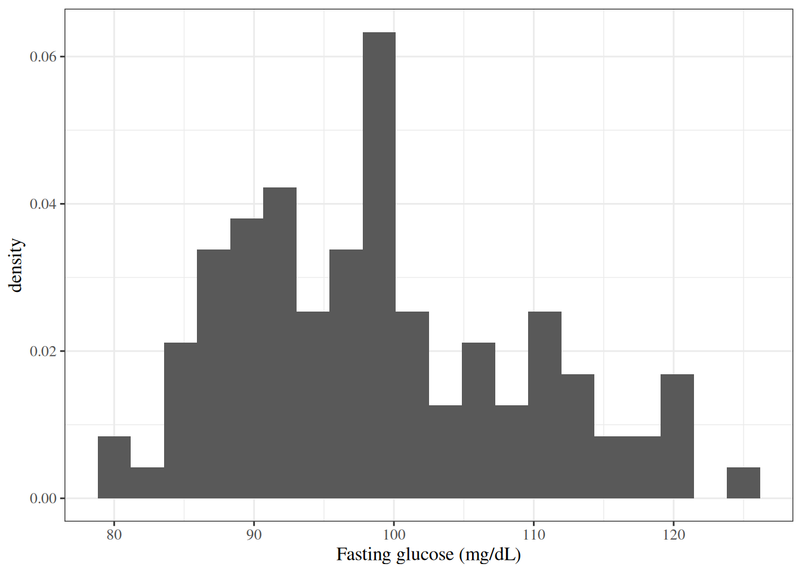](intro-MLEs_files/figure-html/unnamed-chunk-23-1.png "Figure 14: Fasting glucose among 100 HERS participants without diabetes who do not exercise")

Figure 14: Fasting glucose among 100 HERS participants without diabetes who do not exercise

The histogram is irregular, as histograms of 100 observations often are, with a somewhat longer right tail than left tail. A Gaussian model is a rough but usable starting point.

## 4.2 Maximum likelihood estimates

By the [Gaussian MLEs](#sec-gaussian-mle), \\\hat\mu\_{\text{ML}} = \bar x\\ and \\\hat\sigma^2\_{\text{ML}} = \frac{1}{n}\sum_i (x_i - \bar x)^2\\:

``` downlit
mu_hat <- mean(glucose_data)
sigma_sq_hat <- mean((glucose_data - mu_hat)^2)
sigma_hat <- sqrt(sigma_sq_hat)
c(mu_hat = mu_hat, sigma_sq_hat = sigma_sq_hat)
#>       mu_hat sigma_sq_hat 
#>       98.660      104.744
```

[Figure 15](#fig-hers-fitted) superimposes the fitted Gaussian density on the histogram.

``` downlit
plot1 +
  ggplot2::geom_function(
    fun = function(x) dnorm(x, mean = mu_hat, sd = sigma_hat),
    col = "red"
  )
```

[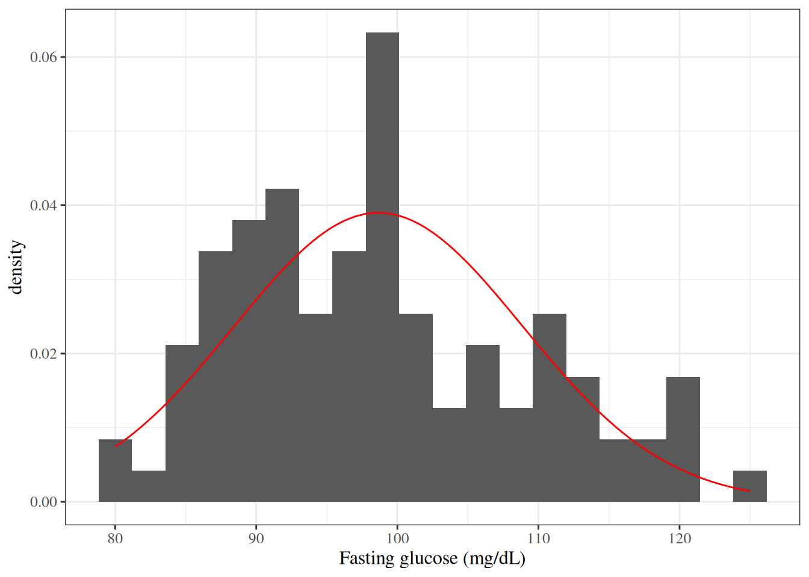](intro-MLEs_files/figure-html/unnamed-chunk-25-1.png "Figure 15: Fasting glucose, with the fitted Gaussian density in red")

Figure 15: Fasting glucose, with the fitted Gaussian density in red

The fitted curve follows the overall shape of the histogram, but it underestimates the frequency of values between 110 and 122 mg/dL, consistent with the histogram’s longer right tail.

## 4.3 Likelihood and log-likelihood functions

It is numerically better to compute the log-likelihood first and exponentiate it to get the likelihood, because a product of 100 densities can underflow to zero:

``` downlit
loglik <- function(mu, sigma, x) {
  n <- length(x)
  normalizing_constant <- -n / 2 * log(2 * pi * sigma^2)
  # written with sum(x), sum(x^2) so that `mu` can be a vector of values:
  kernel <- -1 / (2 * sigma^2) * (sum(x^2) - 2 * sum(x) * mu + n * mu^2)
  normalizing_constant + kernel
}

lik <- function(...) exp(loglik(...))
```

[Figure 16](#fig-hers-lik-mu) graphs the likelihood and log-likelihood as functions of \\\mu\\, with \\\sigma\\ fixed at \\\hat\sigma\_{\text{ML}}\\.

``` downlit
ggplot2::ggplot() +
  ggplot2::geom_function(
    fun = lik,
    args = list(sigma = sigma_hat, x = glucose_data)
  ) +
  ggplot2::xlim(mu_hat + c(-1, 1) * sigma_hat) +
  ggplot2::xlab("mu") +
  ggplot2::ylab("likelihood") +
  ggplot2::geom_vline(xintercept = mu_hat, col = "red")
```

[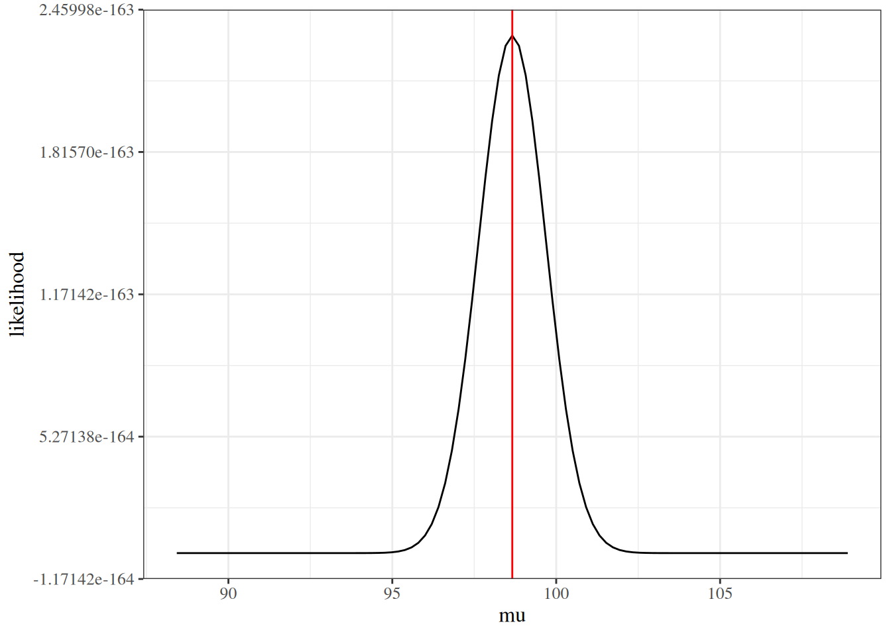](intro-MLEs_files/figure-html/unnamed-chunk-27-1.png "Figure 16 (a): Likelihood")

\(a\) Likelihood

``` downlit
ggplot2::ggplot() +
  ggplot2::geom_function(
    fun = loglik,
    args = list(sigma = sigma_hat, x = glucose_data)
  ) +
  ggplot2::xlim(mu_hat + c(-1, 1) * sigma_hat) +
  ggplot2::xlab("mu") +
  ggplot2::ylab("log-likelihood") +
  ggplot2::geom_vline(xintercept = mu_hat, col = "red")
```

[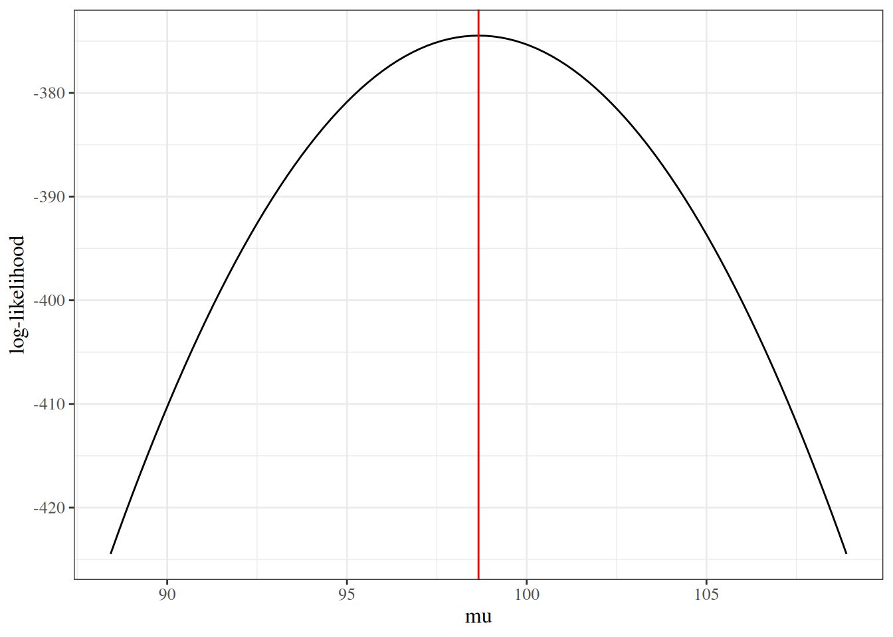](intro-MLEs_files/figure-html/unnamed-chunk-28-1.png "Figure 16 (b): Log-likelihood")

\(b\) Log-likelihood

Figure 16: Likelihood and log-likelihood of the HERS glucose data as functions of \\\mu\\, with \\\sigma = \hat\sigma\_{\text{ML}}\\; the red line marks \\\hat\mu\_{\text{ML}}\\

[Figure 17](#fig-hers-lik-sigma) graphs them as functions of \\\sigma\\, with \\\mu\\ fixed at \\\hat\mu\_{\text{ML}}\\.

``` downlit
ggplot2::ggplot() +
  ggplot2::geom_function(
    fun = lik,
    args = list(mu = mu_hat, x = glucose_data)
  ) +
  ggplot2::xlim(sigma_hat * c(0.9, 1.1)) +
  ggplot2::geom_vline(xintercept = sigma_hat, col = "red") +
  ggplot2::xlab("sigma") +
  ggplot2::ylab("likelihood")
```

[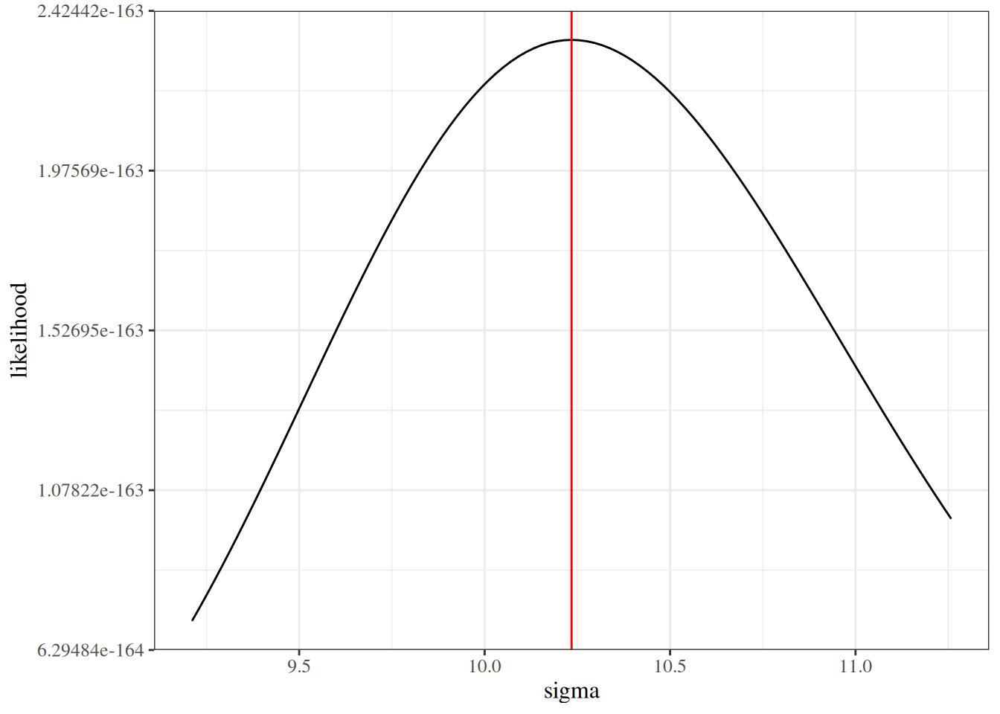](intro-MLEs_files/figure-html/unnamed-chunk-29-1.png "Figure 17 (a): Likelihood")

\(a\) Likelihood

``` downlit
ggplot2::ggplot() +
  ggplot2::geom_function(
    fun = loglik,
    args = list(mu = mu_hat, x = glucose_data)
  ) +
  ggplot2::xlim(sigma_hat * c(0.9, 1.1)) +
  ggplot2::geom_vline(xintercept = sigma_hat, col = "red") +
  ggplot2::xlab("sigma") +
  ggplot2::ylab("log-likelihood")
```

[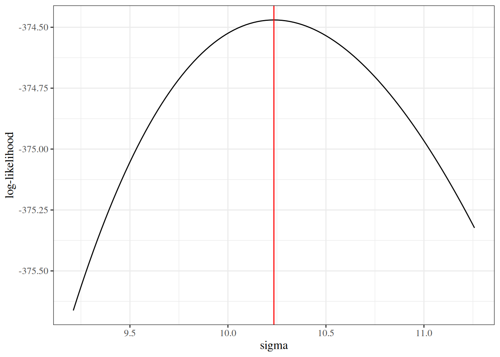](intro-MLEs_files/figure-html/unnamed-chunk-30-1.png "Figure 17 (b): Log-likelihood")

\(b\) Log-likelihood

Figure 17: Likelihood and log-likelihood of the HERS glucose data as functions of \\\sigma\\, with \\\mu = \hat\mu\_{\text{ML}}\\; the red line marks \\\hat\sigma\_{\text{ML}}\\

## 4.4 Log-likelihood surface

[Figure 18](#fig-3d-llik) graphs the log-likelihood over both parameters at once.

``` downlit
n_points <- 25
mu_grid <- seq(94, 104, length.out = n_points)
sigma_grid <- seq(7, 15, length.out = n_points)
lliks <- outer(mu_grid, sigma_grid, loglik, x = glucose_data)

plotly::plot_ly(
  type = "surface",
  x = ~mu_grid,
  y = ~sigma_grid,
  # plot_ly() expects rows of z to correspond to y values,
  # so the matrix is transposed;
  # see https://stackoverflow.com/questions/69472185
  z = ~ t(lliks)
) |>
  plotly::layout(
    scene = list(
      xaxis = list(title = "mu"),
      yaxis = list(title = "sigma"),
      zaxis = list(title = "log-likelihood")
    )
  )
```

Figure 18: Log-likelihood of the HERS glucose data as a function of \\\mu\\ and \\\sigma\\ (interactive: drag to rotate)

## 4.5 Standard errors by sample size

By [Section 3.5](#sec-covariance-matrix), the estimated standard error of \\\hat\mu\_{\text{ML}}\\ is

\\ \mathop{\widehat{\operatorname{SE}}}\nolimits\mathopen{}\left(\hat\mu\right)\mathclose{} = \sqrt{\mathopen{}\left\[\mathopen{}\left(I(\hat\mu, \hat\sigma^2)\right)^{-1}\mathclose{}\right\]\mathclose{}\_{11}} = \frac{\hat\sigma}{\sqrt{n}} \\

which shrinks in proportion to \\1/\sqrt{n}\\ ([Figure 19](#fig-hers-se-by-n)).

``` downlit
se_mu_hat <- function(n, sigma) sigma / sqrt(n)
ggplot2::ggplot() +
  ggplot2::geom_function(fun = se_mu_hat, args = list(sigma = sigma_hat)) +
  ggplot2::scale_x_log10(
    limits = c(10, 10^5), name = "Sample size",
    labels = scales::label_comma()
  ) +
  ggplot2::ylab("Standard error of mu-hat (mg/dL)")
```

[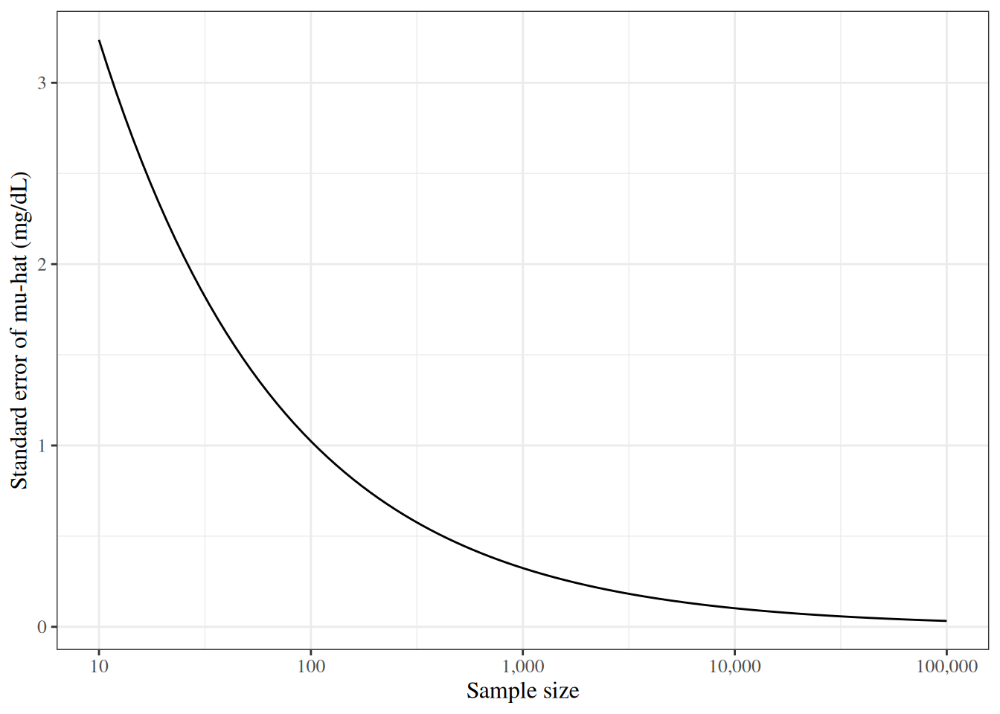](intro-MLEs_files/figure-html/unnamed-chunk-33-1.png "Figure 19: Standard error of \hat\mu_{\text{ML}} as a function of sample size, with \sigma = \hat\sigma_{\text{ML}}")

Figure 19: Standard error of \\\hat\mu\_{\text{ML}}\\ as a function of sample size, with \\\sigma = \hat\sigma\_{\text{ML}}\\

## 4.6 Power

Suppose we test the null hypothesis \\H_0: \mu = \mu_0\\, with \\\mu_0 = 95\\ mg/dL, at significance level \\\alpha = 0.05\\, and suppose for simplicity that \\\sigma\\ is known, equal to \\\hat\sigma\_{\text{ML}}\\. Then under \\H_0\\, \\\bar X \sim \operatorname{N}\mathopen{}\left(\mu_0, \sigma^2/n\right)\mathclose{}\\, and the test rejects \\H_0\\ when \\\bar x\\ falls outside the non-rejection interval

\\\mu_0 \pm z\_{1 - \alpha/2} \frac{\sigma}{\sqrt{n}}\\

``` downlit
mu0 <- 95
se <- se_mu_hat(n = n_obs, sigma = sigma_hat)
margin <- qnorm(0.975) * se
bounds <- mu0 + c(lower = -1, upper = 1) * margin
bounds
#>   lower   upper 
#> 92.9941 97.0059
```

> **NOTE:**
>
> **Definition 17 (Power)** The **power** of a hypothesis test against an alternative parameter value is the probability that the test rejects the null hypothesis when the parameter equals that alternative value.

For this test, under \\\mu = \mu_1\\, \\\bar X \sim \operatorname{N}\mathopen{}\left(\mu_1, \sigma^2/n\right)\mathclose{}\\, so:

\\ \text{power}(\mu_1) = \Phi\mathopen{}\left(\frac{\mu_0 - z\_{1-\alpha/2}\\\sigma/\sqrt{n} - \mu_1}{\sigma/\sqrt{n}}\right)\mathclose{} + 1 - \Phi\mathopen{}\left(\frac{\mu_0 + z\_{1-\alpha/2}\\\sigma/\sqrt{n} - \mu_1}{\sigma/\sqrt{n}}\right)\mathclose{} \\

where \\\Phi\\ is the standard Gaussian CDF. For example, the power against \\\mu_1 = 100\\ mg/dL is:

``` downlit
power <- function(n, null, alt, sigma) {
  se <- sigma / sqrt(n)
  lower <- null - qnorm(0.975) * se
  upper <- null + qnorm(0.975) * se
  pnorm((lower - alt) / se) + pnorm((upper - alt) / se, lower.tail = FALSE)
}
mu1 <- 100
power(n = n_obs, null = mu0, alt = mu1, sigma = sigma_hat)
#> [1] 0.99828
```

[Figure 20](#fig-hers-power) graphs the power as a function of the sample size.

``` downlit
ggplot2::ggplot() +
  ggplot2::geom_function(
    fun = power,
    args = list(null = mu0, alt = mu1, sigma = sigma_hat),
    n = 199
  ) +
  ggplot2::xlim(c(2, 200)) +
  ggplot2::ylim(0, 1) +
  ggplot2::ylab("Power") +
  ggplot2::xlab("n")
```

[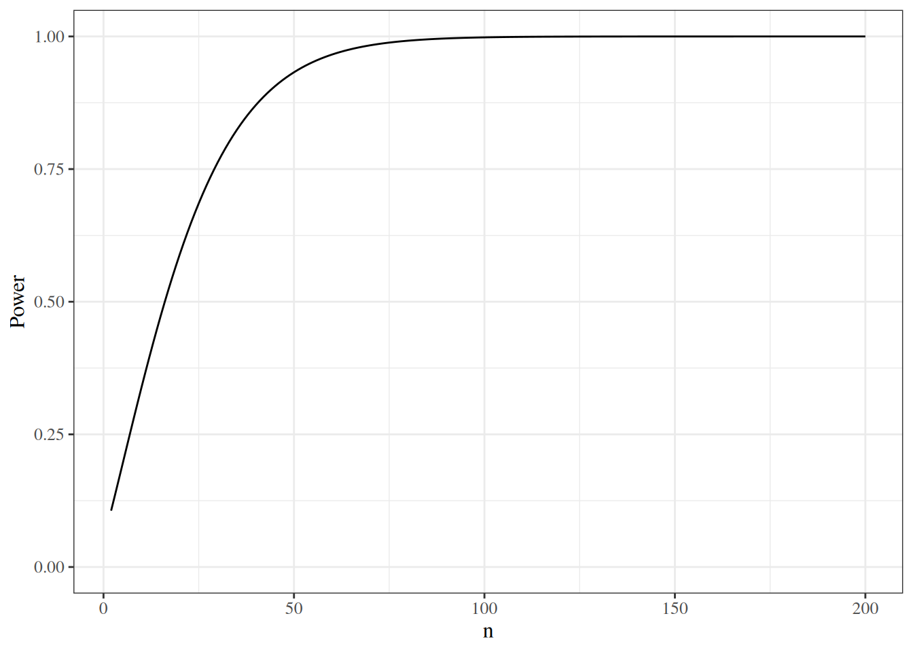](intro-MLEs_files/figure-html/unnamed-chunk-36-1.png "Figure 20: Power of the test of H_0: \mu = 95 against \mu_1 = 100 mg/dL, by sample size")

Figure 20: Power of the test of \\H_0: \mu = 95\\ against \\\mu_1 = 100\\ mg/dL, by sample size

The alternative \\\mu_1\\ should be chosen before seeing the data, as a difference worth detecting. Power computed at \\\mu_1 = \hat\mu\\ (“observed power”) is a function of the p-value, so it adds no information about the data already analyzed.

## 4.7 Simulation

To check how maximum likelihood estimation behaves for this model, we simulate many datasets from a Gaussian distribution whose parameters equal the HERS estimates, analyze each one, and summarize the results.

`do_one_sim()` simulates and analyzes one dataset: it computes \\\hat\mu\\, its estimated standard error, a 95% \\t\\-based confidence interval for \\\mu\\, and the \\t\\-test of \\H_0: \mu = \mu_0\\.

``` downlit
do_one_sim <- function(n, mu, mu0, sigma2, return_data = FALSE) {
  # generate data
  x <- rnorm(n = n, mean = mu, sd = sqrt(sigma2))

  # analyze data
  est <- mean(x)
  se_est <- sd(x) / sqrt(n)
  confint <- est + c(-1, 1) * se_est * qt(0.975, df = n - 1)
  tstat <- abs(est - mu0) / se_est
  pval <- 2 * pt(q = tstat, df = n - 1, lower.tail = FALSE)

  results <- tibble::tibble(
    mu_hat = est,
    sigma_hat = sd(x),
    se_hat = se_est,
    confint_left = confint[1],
    confint_right = confint[2],
    tstat = tstat,
    pval = pval,
    confint_covers = dplyr::between(mu, confint[1], confint[2]),
    test_rejects = pval < 0.05
  )

  if (return_data) {
    list(data = x, results = results)
  } else {
    results
  }
}
```

To check `do_one_sim()`, we compare its output with [`stats::t.test()`](https://rdrr.io/r/stats/t.test.html) on the same simulated data:

``` downlit
set.seed(1)
sim_output <- do_one_sim(
  n = 100, mu = mu_hat, mu0 = 80, sigma2 = sigma_sq_hat,
  return_data = TRUE
)
t_test <- t.test(sim_output$data, mu = 80)

dplyr::bind_rows(
  `do_one_sim()` = sim_output$results |>
    dplyr::select(mu_hat, se_hat, confint_left, confint_right, pval),
  `t.test()` = tibble::tibble(
    mu_hat = unname(t_test$estimate),
    se_hat = t_test$stderr,
    confint_left = t_test$conf.int[1],
    confint_right = t_test$conf.int[2],
    pval = t_test$p.value
  ),
  .id = "source"
)
```

The two rows agree.

`do_n_sims()` repeats the simulation `n_sims` times, with a different random seed for each dataset:

``` downlit
do_n_sims <- function(n_sims = 1000, ...) {
  lapply(seq_len(n_sims), function(i) {
    set.seed(i)
    do_one_sim(...) |>
      dplyr::mutate(sim_number = i, .before = dplyr::everything())
  }) |>
    dplyr::bind_rows()
}

sim_results <- do_n_sims(
  n_sims = 1000,
  n = 100, mu = mu_hat, mu0 = 0.9 * mu_hat, sigma2 = sigma_sq_hat
)
sim_results
```

`summarize_sim()` compares the simulation results with the true data-generating parameters:

``` downlit
summarize_sim <- function(sim_results, mu, sigma2, n) {
  true_se <- sqrt(sigma2 / n)
  tibble::tibble(
    bias_mu_hat = mean(sim_results$mu_hat) - mu,
    sd_mu_hat = sd(sim_results$mu_hat),
    true_se = true_se,
    bias_se_hat = mean(sim_results$se_hat) - true_se,
    coverage = mean(sim_results$confint_covers),
    power = mean(sim_results$test_rejects)
  )
}

sim_summary <- summarize_sim(
  sim_results,
  mu = mu_hat, sigma2 = sigma_sq_hat, n = 100
)
sim_summary
```

Across 1000 simulated datasets:

- the average error of \\\hat\mu\\ is -0.005 mg/dL, small relative to its standard error of 1.02 mg/dL, consistent with \\\hat\mu\\ being unbiased;
- the standard deviation of the \\\hat\mu\\ values, 0.996, is close to the true standard error;
- the 95% confidence intervals covered the true \\\mu\\ in 95.9% of datasets, close to their nominal 95%;
- the test of \\H_0: \mu = 0.9\\\hat\mu\\ rejected in 100% of datasets: with \\n = 100\\, a 10% difference in the mean is easy to detect.

Changing the sample size, the true \\\mu\\, or \\\sigma^2\\ in `do_n_sims()` shows how these properties depend on them.

# 5 Practice exercises

> **NOTE:**
>
> **Exercise 25 (Binomial likelihood (adapted from Dobson and Barnett ([2018](#ref-dobson4e)), Chapter 3))** Let \\Y \sim \text{Binomial}(n, \pi)\\, so that
>
> \\ \operatorname{p}(Y = y \mid \pi) = \binom{n}{y} \pi^y (1-\pi)^{n-y}, \quad y \in \\0, 1, \ldots, n\\. \\
>
> Assume \\0 \< y \< n\\ so the MLE lies in the interior of \\(0, 1)\\.
>
> **(a)** Write the log-likelihood \\\ell(\pi; y)\\ for a single observation \\y\\.
>
> **(b)** Derive the score function \\\ell'(\pi; y) \stackrel{\text{def}}{=}\frac{\partial}{\partial \pi}\ell(\pi; y)\\.
>
> **(c)** Set the score equal to zero and solve for \\\hat\pi\_{ML}\\. Confirm that \\\hat\pi\_{ML} = y/n\\.
>
> **(d)** Compute the second derivative \\\ell''(\pi; y)\\ and verify that it is negative, confirming a maximum.

> **NOTE:**
>
> *Solution*. **(a)**
>
> \\ \begin{aligned} \ell(\pi; y) &= \operatorname{log}\mathopen{}\left\\\binom{n}{y} \pi^y (1-\pi)^{n-y}\right\\\mathclose{} \\ &= \operatorname{log}\mathopen{}\left\\\binom{n}{y}\right\\\mathclose{} + y\operatorname{log}\mathopen{}\left\\\pi\right\\\mathclose{} + (n-y)\operatorname{log}\mathopen{}\left\\1-\pi\right\\\mathclose{} \end{aligned} \\
>
> The first term does not depend on \\\pi\\, so it drops out of every derivative with respect to \\\pi\\.
>
> **(b)**
>
> \\ \begin{aligned} \ell'(\pi; y) &= \frac{\partial}{\partial \pi}\mathopen{}\left\[\operatorname{log}\mathopen{}\left\\\binom{n}{y}\right\\\mathclose{} + y\operatorname{log}\mathopen{}\left\\\pi\right\\\mathclose{} + (n-y)\operatorname{log}\mathopen{}\left\\1-\pi\right\\\mathclose{}\right\]\mathclose{} \\ &= \frac{y}{\pi} - \frac{n-y}{1-\pi} \\ &= \frac{y(1-\pi) - (n-y)\pi}{\pi(1-\pi)} \\ &= \frac{y - n\pi}{\pi(1-\pi)} \end{aligned} \\
>
> **(c)**
>
> Setting \\\ell'(\pi; y) = 0\\:
>
> \\ \begin{aligned} 0 &= \frac{y - n\pi}{\pi(1-\pi)} \\ y &= n\pi \\ \hat\pi\_{ML} &= \frac{y}{n} \end{aligned} \\
>
> **(d)**
>
> \\ \begin{aligned} \ell''(\pi; y) &= \frac{\partial}{\partial \pi}\mathopen{}\left\[\frac{y}{\pi} - \frac{n-y}{1-\pi}\right\]\mathclose{} \\ &= -\frac{y}{\pi^2} - \frac{n-y}{(1-\pi)^2} \end{aligned} \\
>
> Since \\y \geq 0\\, \\n - y \geq 0\\, and \\y\\ and \\n - y\\ are not both zero, \\\ell''(\pi; y) \< 0\\ for every \\\pi \in (0,1)\\. So \\\ell\\ is strictly concave, and its critical point \\\hat\pi\_{ML} = y/n\\ is its global maximum.

> **NOTE:**
>
> **Exercise 26 (Gaussian log-likelihood (adapted from Kleinbaum et al. ([2014](#ref-kleinbaum2014applied)), Chapter 5))** Let \\X_1, \ldots, X_n \\ \sim\_{\operatorname{iid}}\\ \operatorname{N}(\mu, \sigma^2)\\.
>
> **(a)** Write the likelihood \\\mathcal{L}(\mu, \sigma^2; \tilde{x})\\ for the observed data \\\tilde{x}= (x_1, \ldots, x_n)\\.
>
> **(b)** Write the log-likelihood \\\ell(\mu, \sigma^2; \tilde{x})\\. Show that it can be written as
>
> \\ \ell(\mu, \sigma^2; \tilde{x}) = -\frac{n}{2}\operatorname{log}\mathopen{}\left\\2\pi\sigma^2\right\\\mathclose{} - \frac{1}{2\sigma^2}\sum\_{i=1}^n (x_i - \mu)^2. \\
>
> **(c)** Derive the MLE \\\hat\mu\_{ML}\\ and \\\hat\sigma^2\_{ML}\\.

> **NOTE:**
>
> *Solution*. **(a)**
>
> \\ \mathcal{L}(\mu, \sigma^2; \tilde{x}) = \prod\_{i=1}^n (2\pi\sigma^2)^{-1/2} \operatorname{exp}\mathopen{}\left\\-\frac{(x_i - \mu)^2}{2\sigma^2}\right\\\mathclose{} = (2\pi\sigma^2)^{-n/2} \operatorname{exp}\mathopen{}\left\\-\frac{1}{2\sigma^2}\sum\_{i=1}^n (x_i-\mu)^2\right\\\mathclose{} \\
>
> **(b)**
>
> \\ \begin{aligned} \ell(\mu, \sigma^2; \tilde{x}) &= \operatorname{log}\mathopen{}\left\\\mathcal{L}(\mu, \sigma^2; \tilde{x})\right\\\mathclose{} \\ &= -\frac{n}{2}\operatorname{log}\mathopen{}\left\\2\pi\sigma^2\right\\\mathclose{} - \frac{1}{2\sigma^2}\sum\_{i=1}^n (x_i - \mu)^2 \end{aligned} \\
>
> **(c)**
>
> **Deriving \\\hat\mu\_{ML}\\:**
>
> \\ \begin{aligned} \frac{\partial}{\partial \mu}\ell &= \frac{\partial}{\partial \mu}\mathopen{}\left\[-\frac{1}{2\sigma^2}\sum\_{i=1}^n (x_i - \mu)^2\right\]\mathclose{} \\ &= \frac{1}{\sigma^2}\sum\_{i=1}^n (x_i - \mu) \\ &= \frac{1}{\sigma^2}\mathopen{}\left(\sum\_{i=1}^n x_i - n\mu\right)\mathclose{} \end{aligned} \\
>
> Setting this to zero: \\\hat\mu\_{ML} = \bar{x} \stackrel{\text{def}}{=}\frac{1}{n}\sum\_{i=1}^n x_i\\.
>
> **Deriving \\\hat\sigma^2\_{ML}\\:**
>
> \\ \begin{aligned} \frac{\partial}{\partial \sigma^2}\ell &= -\frac{n}{2\sigma^2} + \frac{1}{2(\sigma^2)^2}\sum\_{i=1}^n (x_i - \mu)^2 \end{aligned} \\
>
> Setting this to zero and solving:
>
> \\ \begin{aligned} \frac{n}{2\sigma^2} &= \frac{1}{2(\sigma^2)^2}\sum\_{i=1}^n (x_i - \mu)^2 \\ \sigma^2 &= \frac{1}{n}\sum\_{i=1}^n (x_i - \mu)^2 \end{aligned} \\
>
> Substituting \\\hat\mu\_{ML} = \bar{x}\\:
>
> \\ \hat\sigma^2\_{ML} = \frac{1}{n}\sum\_{i=1}^n (x_i - \bar{x})^2 \\
>
> Note: this maximum likelihood estimator is a biased estimator of \\\sigma^2\\; the unbiased sample variance divides by \\n-1\\.

> **NOTE:**
>
> **Exercise 27 (Score at the MLE (adapted from Dobson and Barnett ([2018](#ref-dobson4e)), Chapter 3))** Let \\X_1, \ldots, X_n \\ \sim\_{\operatorname{iid}}\\ \operatorname{Pois}({\lambda})\\.
>
> **(a)** Write the log-likelihood \\\ell({\lambda}; \tilde{x})\\.
>
> **(b)** Derive the score function \\\ell'({\lambda}; \tilde{x})\\.
>
> **(c)** Show that \\\hat{\lambda}\_{ML} = \bar{x}\\, and verify that the score equals zero at the MLE.
>
> **(d)** Provide an intuitive interpretation: why does the score being zero at \\\hat{\lambda}\_{ML}\\ make sense?

> **NOTE:**
>
> *Solution*. **(a)**
>
> \\ \begin{aligned} \ell({\lambda}; \tilde{x}) &= \operatorname{log}\mathopen{}\left\\\prod\_{i=1}^n \frac{{\lambda}^{x_i} e^{-{\lambda}}}{x_i!}\right\\\mathclose{} \\ &= \sum\_{i=1}^n \mathopen{}\left(x_i \operatorname{log}\mathopen{}\left\\{\lambda}\right\\\mathclose{} - {\lambda}- \operatorname{log}\mathopen{}\left\\x_i!\right\\\mathclose{}\right)\mathclose{} \\ &= \mathopen{}\left(\sum\_{i=1}^n x_i\right)\mathclose{}\operatorname{log}\mathopen{}\left\\{\lambda}\right\\\mathclose{} - n{\lambda}- \sum\_{i=1}^n \operatorname{log}\mathopen{}\left\\x_i!\right\\\mathclose{} \end{aligned} \\
>
> **(b)**
>
> \\ \begin{aligned} \ell'({\lambda}; \tilde{x}) &= \frac{\partial}{\partial {\lambda}}\mathopen{}\left\[\mathopen{}\left(\sum\_{i=1}^n x_i\right)\mathclose{}\operatorname{log}\mathopen{}\left\\{\lambda}\right\\\mathclose{} - n{\lambda}\right\]\mathclose{} \\ &= \frac{\sum\_{i=1}^n x_i}{{\lambda}} - n \\ &= \frac{n\bar{x}}{{\lambda}} - n \end{aligned} \\
>
> **(c)**
>
> Setting \\\ell'({\lambda}; \tilde{x}) = 0\\:
>
> \\ \begin{aligned} \frac{n\bar{x}}{{\lambda}} &= n \\ \hat{\lambda}\_{ML} &= \bar{x} \end{aligned} \\
>
> If \\\bar{x} \> 0\\ (equivalently, at least one \\x_i \> 0\\), then
>
> \\ \begin{aligned} \ell'(\bar{x}; \tilde{x}) &= \frac{n\bar{x}}{\bar{x}} - n \\ &= n - n \\ &= 0. \end{aligned} \\
>
> If instead all \\x_i = 0\\, then \\\bar{x} = 0\\ and \\\hat{\lambda}\_{ML} = 0\\ is a boundary value. In that case, the score formula \\\ell'({\lambda}; \tilde{x}) = \frac{n\bar{x}}{{\lambda}} - n\\ is not defined at \\{\lambda}= 0\\, so the usual interior verification \\\ell'(\hat{\lambda}\_{ML}; \tilde{x}) = 0\\ does not apply.
>
> **(d)**
>
> The score measures the rate of change of the log-likelihood. When it equals zero, increasing or decreasing \\{\lambda}\\ slightly would not improve the fit; we are at a “flat” point. Intuitively, \\\hat{\lambda}\_{ML} = \bar{x}\\ is the value of \\{\lambda}\\ that makes the expected count per observation (\\{\lambda}\\) exactly equal to the observed average count (\\\bar{x}\\).

> **NOTE:**
>
> **Exercise 28 (Standard error of an MLE (adapted from Dobson and Barnett ([2018](#ref-dobson4e)), Chapter 5))** Let \\X_1, \ldots, X_n \\ \sim\_{\operatorname{iid}}\\ \operatorname{Pois}({\lambda})\\.
>
> **(a)** Derive the Hessian \\\ell''({\lambda}; \tilde{x}) = \frac{\partial}{\partial \[}2\]{{\lambda}}\ell({\lambda};\tilde{x})\\.
>
> **(b)** Derive the observed information \\I({\lambda}; \tilde{x}) = -\ell''({\lambda}; \tilde{x})\\.
>
> **(c)** Evaluate \\I(\hat{\lambda}\_{ML}; \tilde{x})\\.
>
> **(d)** Give an approximate 95% confidence interval for \\{\lambda}\\ using the asymptotic normal distribution of the MLE.

> **NOTE:**
>
> *Solution*. **(a)**
>
> From [Exercise 27](#exr-prac-score-zero), \\\ell'({\lambda}; \tilde{x}) = \frac{n\bar{x}}{{\lambda}} - n\\.
>
> \\ \begin{aligned} \ell''({\lambda}; \tilde{x}) &= \frac{\partial}{\partial {\lambda}}\mathopen{}\left\[\frac{n\bar{x}}{{\lambda}} - n\right\]\mathclose{} \\ &= -\frac{n\bar{x}}{{\lambda}^2} \end{aligned} \\
>
> **(b)**
>
> \\ I({\lambda}; \tilde{x}) = -\ell''({\lambda}; \tilde{x}) = \frac{n\bar{x}}{{\lambda}^2} \\
>
> **(c)**
>
> Assuming \\\bar{x} \> 0\\ (i.e., at least one \\x_i \> 0\\), substituting \\\hat{\lambda}\_{ML} = \bar{x}\\:
>
> \\ I(\hat{\lambda}\_{ML}; \tilde{x}) = \frac{n\bar{x}}{\bar{x}^2} = \frac{n}{\bar{x}} \\
>
> **(d)**
>
> By the asymptotic theory of MLEs:
>
> \\ \hat{\lambda}\_{ML} \\\dot\sim\\ \operatorname{N}\\\mathopen{}\left({\lambda},\\ \mathopen{}\left(\mathcal{I}({\lambda})\right)^{-1}\mathclose{}\right)\mathclose{} \\
>
> We estimate this asymptotic variance using the observed information evaluated at the MLE. Since \\I(\hat{\lambda}\_{ML};\tilde{x})^{-1} = \bar{x}/n\\:
>
> \\ \operatorname{SE}\mathopen{}\left(\hat{\lambda}\_{ML}\right)\mathclose{} \approx \sqrt{\frac{\bar{x}}{n}} \\
>
> An approximate 95% CI for \\{\lambda}\\ is:
>
> \\ \hat{\lambda}\_{ML} \pm 1.96 \times \sqrt{\frac{\bar{x}}{n}} = \bar{x} \pm 1.96\sqrt{\frac{\bar{x}}{n}} \\

> **NOTE:**
>
> **Exercise 29 (Exponential MLE (adapted from Dobson and Barnett ([2018](#ref-dobson4e)), Chapter 3))** Let \\X_1, \ldots, X_n \\ \sim\_{\operatorname{iid}}\\ \text{Exponential}(\mu)\\, so that \\ \operatorname{p}(X = x \mid \mu) = \frac{1}{\mu} e^{-x/\mu}, \quad x \> 0, \quad \mu\> 0. \\
>
> **(a)** Write the log-likelihood \\\ell(\mu; \tilde{x})\\ for the observed data \\\tilde{x}= (x_1, \ldots, x_n)\\.
>
> **(b)** Derive the score function \\\ell'(\mu; \tilde{x}) = \frac{\partial}{\partial \mu}\ell(\mu; \tilde{x})\\.
>
> **(c)** Set the score equal to zero and show that \\\hat\mu\_{ML} = \bar{x}\\. Compute the second derivative and verify this critical point is a maximum.
>
> **(d)** Derive the observed information \\I(\mu; \tilde{x}) = -\ell''(\mu; \tilde{x})\\, evaluate it at \\\hat\mu\_{ML}\\, and give an approximate 95% confidence interval for \\\mu\\.

> **NOTE:**
>
> *Solution*. **(a)**
>
> \\ \begin{aligned} \ell(\mu; \tilde{x}) &= \operatorname{log}\mathopen{}\left\\\prod\_{i=1}^n \frac{1}{\mu} e^{-x_i/\mu}\right\\\mathclose{} \\ &= \sum\_{i=1}^n \operatorname{log}\mathopen{}\left\\\frac{1}{\mu} e^{-x_i/\mu}\right\\\mathclose{} \\ &= \sum\_{i=1}^n \mathopen{}\left(-\operatorname{log}\mathopen{}\left\\\mu\right\\\mathclose{} - \frac{x_i}{\mu}\right)\mathclose{} \\ &= -n\operatorname{log}\mathopen{}\left\\\mu\right\\\mathclose{} - \frac{1}{\mu}\sum\_{i=1}^n x_i \\ &= -n\operatorname{log}\mathopen{}\left\\\mu\right\\\mathclose{} - \frac{n\bar{x}}{\mu} \end{aligned} \\
>
> **(b)**
>
> \\ \begin{aligned} \ell'(\mu; \tilde{x}) &= \frac{\partial}{\partial \mu}\mathopen{}\left(-n\operatorname{log}\mathopen{}\left\\\mu\right\\\mathclose{} - \frac{n\bar{x}}{\mu}\right)\mathclose{} \\ &= -\frac{n}{\mu} + \frac{n\bar{x}}{\mu^2} \\ &= \frac{n}{\mu^2}\mathopen{}\left(\bar{x} - \mu\right)\mathclose{} \end{aligned} \\
>
> **(c)**
>
> Setting \\\ell'(\mu; \tilde{x}) = 0\\:
>
> \\ \begin{aligned} 0 &= \frac{n}{\mu^2}\mathopen{}\left(\bar{x} - \mu\right)\mathclose{} \\ \hat\mu\_{ML} &= \bar{x} \end{aligned} \\
>
> The second derivative is:
>
> \\ \begin{aligned} \ell''(\mu; \tilde{x}) &= \frac{\partial}{\partial \mu}\mathopen{}\left(-\frac{n}{\mu} + \frac{n\bar{x}}{\mu^2}\right)\mathclose{} \\ &= \frac{n}{\mu^2} - \frac{2n\bar{x}}{\mu^3} \end{aligned} \\
>
> Evaluated at \\\hat\mu\_{ML} = \bar{x}\\:
>
> \\ \ell''(\bar{x}; \tilde{x}) = \frac{n}{\bar{x}^2} - \frac{2n\bar{x}}{\bar{x}^3} = \frac{n}{\bar{x}^2} - \frac{2n}{\bar{x}^2} = -\frac{n}{\bar{x}^2} \< 0 \\
>
> Since the second derivative is negative, \\\hat\mu\_{ML} = \bar{x}\\ is a maximum.
>
> **(d)**
>
> The observed information is:
>
> \\ I(\mu; \tilde{x}) = -\ell''(\mu; \tilde{x}) = \frac{2n\bar{x}}{\mu^3} - \frac{n}{\mu^2} \\
>
> Evaluated at \\\hat\mu\_{ML} = \bar{x}\\:
>
> \\ I(\hat\mu\_{ML}; \tilde{x}) = \frac{2n\bar{x}}{\bar{x}^3} - \frac{n}{\bar{x}^2} = \frac{2n}{\bar{x}^2} - \frac{n}{\bar{x}^2} = \frac{n}{\bar{x}^2} \\
>
> So \\\operatorname{SE}\mathopen{}\left(\hat\mu\_{ML}\right)\mathclose{} \approx \sqrt{I(\hat\mu\_{ML}; \tilde{x})^{-1}} = \frac{\bar{x}}{\sqrt{n}}\\.
>
> An approximate 95% CI for \\\mu\\ is:
>
> \\ \hat\mu\_{ML} \pm 1.96 \times \frac{\bar{x}}{\sqrt{n}} = \bar{x} \pm \frac{1.96\bar{x}}{\sqrt{n}} \\
>
> Note: the exponential distribution has \\\operatorname{Var}\mathopen{}\left(X\right)\mathclose{} = \mu^2\\, so \\\operatorname{SE}\mathopen{}\left(\hat\mu\_{ML}\right)\mathclose{} = \mu/\sqrt{n}\\, which is estimated by \\\bar{x}/\sqrt{n}\\. More generally, the standard error of a sample mean is \\\operatorname{SD}\mathopen{}\left(X\right)\mathclose{}/\sqrt{n}\\; here that reduces to \\\mu/\sqrt{n}\\ because \\\operatorname{SD}\mathopen{}\left(X\right)\mathclose{} = \mu\\ for the exponential distribution.

# References

Casella, George, and Roger Berger. 2002. *Statistical Inference*. 2nd ed. Cengage Learning. <https://www.cengage.com/c/statistical-inference-2e-casella-berger/9780534243128/>.

Dobson, Annette J, and Adrian G Barnett. 2018. *An Introduction to Generalized Linear Models*. 4th ed. CRC press. <https://doi.org/10.1201/9781315182780>.

Dunn, Peter K, and Gordon K Smyth. 2018. *Generalized Linear Models with Examples in R*. Vol. 53. Springer. <https://doi.org/10.1007/978-1-4419-0118-7>.

Efron, Bradley, and David V Hinkley. 1978. “Assessing the Accuracy of the Maximum Likelihood Estimator: Observed Versus Expected Fisher Information.” *Biometrika* 65 (3): 457–83.

Hogg, Robert V., Elliot A. Tanis, and Dale L. Zimmerman. 2015. *Probability and Statistical Inference*. Ninth edition. Pearson.

Hulley, Stephen, Deborah Grady, Trudy Bush, et al. 1998. “Randomized Trial of Estrogen Plus Progestin for Secondary Prevention of Coronary Heart Disease in Postmenopausal Women.” *JAMA : The Journal of the American Medical Association* (Chicago, IL) 280 (7): 605–13.

Kleinbaum, David G, Lawrence L Kupper, Azhar Nizam, K Muller, and ES Rosenberg. 2014. *Applied Regression Analysis and Other Multivariable Methods*. 5th ed. Cengage Learning. <https://www.cengage.com/c/applied-regression-analysis-and-other-multivariable-methods-5e-kleinbaum/9781285051086/>.

Lehmann, E. L. 1999. *Elements of Large-Sample Theory*. Springer Texts in Statistics. Springer. <https://doi.org/10.1007/b98855>.

McLachlan, Geoffrey J, and Thriyambakam Krishnan. 2007. *The EM Algorithm and Extensions*. 2nd ed. John Wiley & Sons. <https://doi.org/10.1002/9780470191613>.

Newey, Whitney K, and Daniel McFadden. 1994. “Large Sample Estimation and Hypothesis Testing.” In *Handbook of Econometrics*, edited by Robert Engle and Dan McFadden, vol. 4. Elsevier. <https://doi.org/10.1016/S1573-4412(05)80005-4>.

Vittinghoff, Eric, David V Glidden, Stephen C Shiboski, and Charles E McCulloch. 2012. *Regression Methods in Biostatistics: Linear, Logistic, Survival, and Repeated Measures Models*. 2nd ed. Springer. <https://doi.org/10.1007/978-1-4614-1353-0>.

Wilks, Samuel S. 1938. “The Large-Sample Distribution of the Likelihood Ratio for Testing Composite Hypotheses.” *The Annals of Mathematical Statistics* 9 (1): 60–62. <https://doi.org/10.1214/aoms/1177732360>.

Wood, Simon N. 2017. *Generalized Additive Models: An Introduction with r*. 2nd ed. Chapman; Hall/CRC. <https://doi.org/10.1201/9781315370279>.

Back to top
