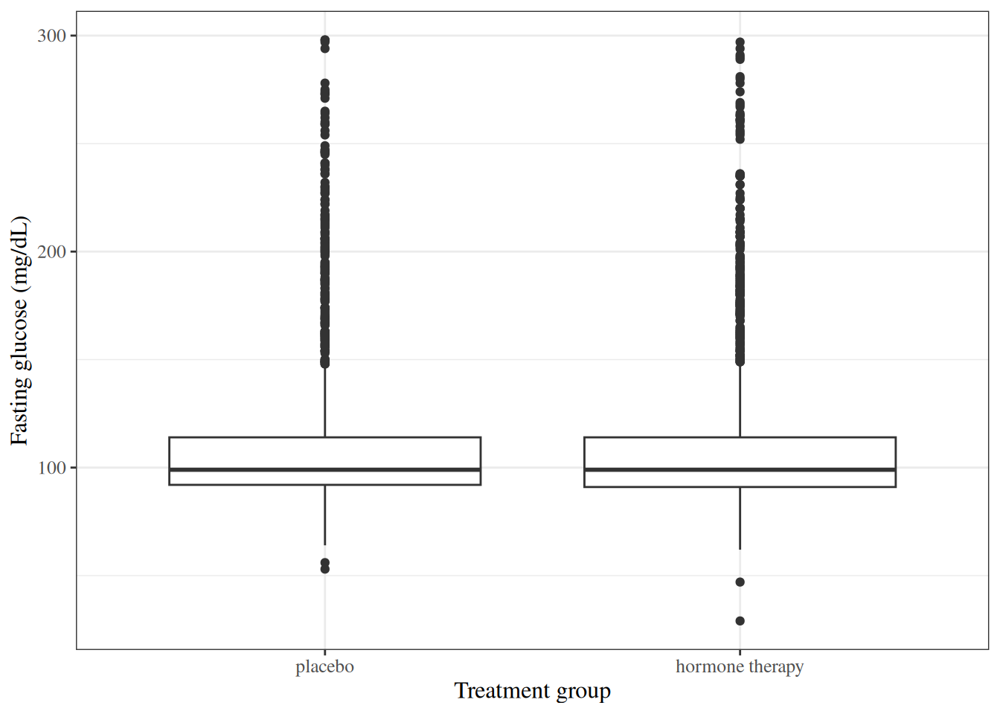

# Comparing Means

Code

Published

Last modified: 2026-10-05 17:25:05 (PDT)

## 1 Introduction

This page reviews the standard methods for comparing the mean of a continuous outcome between groups: t-tests, confidence intervals for a difference in means, and one-way analysis of variance.

This page builds on three others:

- [Exploratory Data Analysis](exploratory-descriptive.llms.md) defines the sample statistics these methods use;
- [Statistical Inference](inference.llms.md) defines hypotheses, test statistics, p-values, confidence intervals, and the t, chi-square, and F reference distributions;
- [Estimation](estimation.llms.md) defines estimators and their standard errors.

The t-tests and ANOVA on this page are the exact, Gaussian-outcome tests in the [table of exact and approximate tests](intro-MLEs.llms.md#tbl-gaussian-vs-mle-tests) on the Maximum Likelihood page, which pairs each one with its large-sample counterpart.

This page is adapted from Vittinghoff et al. ([2012](#ref-vittinghoff2e)), Chapter 3.

## 2 The HERS data

The “heart and estrogen/progestin study” (HERS) was a clinical trial of hormone therapy for prevention of recurrent heart attacks and death among 2,763 post-menopausal women with existing coronary heart disease (CHD) ([Hulley et al. 1998](#ref-HulleyStephen1998RToE)).

The trial was conducted at 20 US clinical centers. Participants were randomized to receive either conjugated equine estrogens (0.625 mg/day) plus medroxyprogesterone acetate (2.5 mg/day) or a matching placebo ([Hulley et al. 1998](#ref-HulleyStephen1998RToE)). Women were followed for an average of 4.1 years ([Hulley et al. 1998](#ref-HulleyStephen1998RToE)).

The primary outcome was nonfatal myocardial infarction or CHD death ([Hulley et al. 1998](#ref-HulleyStephen1998RToE)).

The HERS data are distributed with Vittinghoff et al. ([2012](#ref-vittinghoff2e)) on the book’s companion website, as a Stata file that R can read directly:

``` downlit
# one unbroken string, so that link checkers test the whole URL:
url <- "https://regression.ucsf.edu/sites/g/files/tkssra16191/files/wysiwyg/home/data/hersdata.dta" # nolint: line_length_linter.
hers <- haven::read_dta(url)
```

The `rmb` R package includes the same file, which these notes use so that rendering does not depend on the website. [`haven::as_factor()`](https://forcats.tidyverse.org/reference/as_factor.html) converts the Stata value labels to factors:

``` downlit
hers <- rmb::hers |> haven::as_factor()
hers |> head()
```

The examples on this page use these variables:

| Variable   | Meaning                                           |
|------------|---------------------------------------------------|
| `HT`       | Randomized treatment: placebo or hormone therapy  |
| `age`      | Age at baseline (years)                           |
| `raceth`   | Race/ethnicity: White, African American, or Other |
| `exercise` | Exercises at least three times per week (no/yes)  |
| `BMI`      | Body mass index at baseline (kg/m²)               |
| `SBP`      | Systolic blood pressure at baseline (mmHg)        |
| `glucose`  | Fasting glucose at baseline (mg/dL)               |
| `glucose1` | Fasting glucose at the year-1 visit (mg/dL)       |

``` downlit
hers |>
  dplyr::select(HT, age, raceth, exercise, BMI, SBP, glucose, glucose1) |>
  dplyr::glimpse()
#> Rows: 2,763
#> Columns: 8
#> $ HT       <fct> placebo, placebo, hormone therapy, placebo, placebo, hormone …
#> $ age      <dbl> 70, 62, 69, 64, 65, 68, 70, 69, 61, 62, 72, 73, 52, 57, 57, 6…
#> $ raceth   <fct> African American, African American, White, White, White, Afri…
#> $ exercise <fct> no, no, no, no, no, no, no, yes, yes, no, no, no, no, no, yes…
#> $ BMI      <dbl> 23.69, 28.62, 42.51, 24.39, 21.90, 29.05, 34.45, 23.16, 30.26…
#> $ SBP      <dbl> 138, 118, 134, 152, 175, 174, 119, 178, 162, 111, 122, 158, 1…
#> $ glucose  <dbl> 84, 111, 114, 94, 101, 116, 120, 95, 105, 98, 111, 95, 97, 10…
#> $ glucose1 <dbl> 94, 78, 98, 93, 92, 115, NA, 95, 113, 98, 96, 107, 90, 100, 1…
```

## 3 Descriptive statistics

The [Exploratory Data Analysis](exploratory-descriptive.llms.md) page defines the sample statistics used on this page, each with an example:

- the [sample mean](exploratory-descriptive.llms.md#def-sample-mean);
- the [sample median](exploratory-descriptive.llms.md#def-sample-median);
- the [sample variance](exploratory-descriptive.llms.md#def-sample-variance);
- the [sample standard deviation](exploratory-descriptive.llms.md#def-sample-sd);
- the [interquartile range](exploratory-descriptive.llms.md#def-IQR);
- the [sample proportion](exploratory-descriptive.llms.md#def-sample-proportion).

That page also defines the graphs used here, including [box plots](exploratory-descriptive.llms.md#def-boxplot) and [scatter plots](exploratory-descriptive.llms.md#def-scatterplot).

> **NOTE:**
>
> **Example 1 (HERS baseline characteristics by treatment group)** [Table 1](#tbl-hers-summary) summarizes the HERS participants at baseline, separately for each randomized group. Continuous variables are summarized by mean (standard deviation), and categorical variables by count (percent).
>
> Show R code
>
> ``` downlit
> hers |>
>   dplyr::select(
>     age, BMI, glucose, SBP, DBP,
>     HT, raceth, exercise, smoking, diabetes
>   ) |>
>   gtsummary::tbl_summary(
>     by = HT,
>     statistic = list(
>       gtsummary::all_continuous() ~ "{mean} ({sd})",
>       gtsummary::all_categorical() ~ "{n} ({p}%)"
>     ),
>     digits = gtsummary::all_continuous() ~ 1,
>     label = list(
>       age ~ "Age (years)",
>       BMI ~ "BMI (kg/m^2)",
>       glucose ~ "Fasting glucose (mg/dL)",
>       SBP ~ "Systolic BP (mmHg)",
>       DBP ~ "Diastolic BP (mmHg)",
>       raceth ~ "Race/ethnicity",
>       exercise ~ "Exercises regularly",
>       smoking ~ "Current smoker",
>       diabetes ~ "Diabetes"
>     )
>   ) |>
>   gtsummary::add_overall() |>
>   gtsummary::bold_labels()
> ```
>
> [TABLE]
>
> Table 1: HERS: baseline characteristics by treatment group
>
> Because treatment was assigned at random, the two groups differ at baseline only by chance, and their summaries are close.

## 4 Comparing two groups: continuous outcomes

### 4.1 Hypotheses

The [Statistical Inference](inference.llms.md) page defines the [null hypothesis](inference.llms.md#def-null-hypothesis), the [alternative hypothesis](inference.llms.md#def-alternative-hypothesis), [test statistics](inference.llms.md#def-test-statistic), [p-values](inference.llms.md#def-p-value), and [significance levels](inference.llms.md#def-significance-level). In a comparison of two groups with means \\\mu_1\\ and \\\mu_2\\, the null hypothesis is usually \\H_0: \mu_1 = \mu_2\\, and the two-sided alternative is \\H_1: \mu_1 \neq \mu_2\\.

### 4.2 One-sample t-test

> **NOTE:**
>
> **Definition 1 (One-sample t-test)** Let \\x_1, \ldots, x_n\\ be observations with \\n \ge 2\\, sample mean \\\bar{x}\\, and sample standard deviation \\s\\. The **one-sample t-test** of \\H_0: \mu = \mu_0\\ against \\H_1: \mu \neq \mu_0\\ uses the statistic
>
> \\t \stackrel{\text{def}}{=}\frac{\bar{x} - \mu_0}{s / \sqrt{n}}.\\
>
> Its p-value is \\\Pr(\mathopen{}\left\|T\right\|\mathclose{} \ge \mathopen{}\left\|t\right\|\mathclose{})\\, where \\T\\ has the \\t\_{n-1}\\ distribution ([t-distribution](inference.llms.md#def-t-dist)).

> **NOTE:**
>
> **Theorem 1 (Null distribution of the one-sample t statistic)** Let \\X_1, \ldots, X_n\\ be independent, each Gaussian with mean \\\mu_0\\ and variance \\\sigma^2\\, with \\n \ge 2\\. Then the statistic \\T \stackrel{\text{def}}{=}(\bar X - \mu_0) / (S / \sqrt{n})\\ of [Definition 1](#def-one-sample-t-test), computed from these random variables, has the \\t\_{n-1}\\ distribution.

> **NOTE:**
>
> *Proof*. We use a standard fact about Gaussian samples ([Hogg et al. 2019, sec. 5.5](#ref-hoggtanis2015), pp. 203-205): \\\bar X\\ and \\S^2\\ are independent, and \\V \stackrel{\text{def}}{=}(n-1) S^2 / \sigma^2\\ has the \\\chi^2\_{n-1}\\ distribution. Also, \\Z \stackrel{\text{def}}{=}(\bar X - \mu_0) / (\sigma / \sqrt{n})\\ has the standard Gaussian distribution, and \\Z\\ is independent of \\V\\ because \\\bar X\\ is independent of \\S^2\\. So by the [definition of the t-distribution](inference.llms.md#def-t-dist), \\Z / \sqrt{V / (n-1)}\\ has the \\t\_{n-1}\\ distribution, and this ratio equals \\T\\:
>
> \\ \begin{aligned} \frac{Z}{\sqrt{V/(n-1)}} &= \frac{(\bar X - \mu_0) / (\sigma / \sqrt{n})}{\sqrt{S^2 / \sigma^2}} && \text{(substitute \$Z\$ and \$V\$)}\\ &= \frac{(\bar X - \mu_0) / (\sigma / \sqrt{n})}{S / \sigma} && \text{(\$\sqrt{S^2} = S\$, since \$S \ge 0\$)}\\ &= \frac{\bar X - \mu_0}{S / \sqrt{n}} && \text{(the factors of \$\sigma\$ cancel)}\\ &= T. \end{aligned} \\

When the observations are not Gaussian, \\T\\ still has approximately the standard Gaussian distribution when \\n\\ is large, by the [central limit theorem](https://morrison-lab.github.io/pds/limit-theorems.html#sec-clt), and then \\t\_{n-1}\\ is close to the standard Gaussian distribution ([t quantiles approach Gaussian quantiles](inference.llms.md#exm-t-dist)).

### 4.3 Paired t-test

> **NOTE:**
>
> **Definition 2 (Paired t-test)** Let \\(x\_{1,1}, x\_{1,2}), \ldots, (x\_{n,1}, x\_{n,2})\\ be pairs of related measurements, such as the same participants measured at two times, and let \\d_i \stackrel{\text{def}}{=}x\_{i,2} - x\_{i,1}\\ be the within-pair differences, with population mean \\\mu_d\\. The **paired t-test** of \\H_0: \mu_d = 0\\ against \\H_1: \mu_d \neq 0\\ is the one-sample t-test ([Definition 1](#def-one-sample-t-test)) of \\H_0: \mu = 0\\ applied to \\d_1, \ldots, d_n\\.

> **NOTE:**
>
> **Example 2 (Change in fasting glucose over the first year of HERS)** We test whether mean fasting glucose changed between baseline (`glucose`) and the year-1 visit (`glucose1`), across both treatment groups. Participants missing either measurement are dropped. The t statistic of [Definition 1](#def-one-sample-t-test), computed on the differences:
>
> ``` downlit
> glucose_change <- hers |>
>   dplyr::filter(!is.na(glucose), !is.na(glucose1)) |>
>   dplyr::mutate(d = glucose1 - glucose) |>
>   dplyr::pull(d)
> n_pairs <- length(glucose_change)
> t_paired <- mean(glucose_change) / (sd(glucose_change) / sqrt(n_pairs))
> c(
>   n = n_pairs,
>   mean_change = mean(glucose_change),
>   t = t_paired,
>   p_value = 2 * pt(-abs(t_paired), df = n_pairs - 1)
> )
> #>           n mean_change           t     p_value 
> #> 2.61300e+03 2.62036e+00 4.15081e+00 3.41911e-05
> ```
>
> [`t.test()`](https://rdrr.io/r/stats/t.test.html) with `paired = TRUE` gives the same statistic, along with a confidence interval for \\\mu_d\\:
>
> ``` downlit
> t.test(hers$glucose1, hers$glucose, paired = TRUE)
> #> 
> #>  Paired t-test
> #> 
> #> data:  hers$glucose1 and hers$glucose
> #> t = 4.151, df = 2612, p-value = 3.42e-05
> #> alternative hypothesis: true mean difference is not equal to 0
> #> 95 percent confidence interval:
> #>  1.38248 3.85824
> #> sample estimates:
> #> mean difference 
> #>         2.62036
> ```
>
> Mean fasting glucose rose by about 2.6 mg/dL over the year, and the p-value is far below 0.05.

### 4.4 Two-sample t-tests

> **NOTE:**
>
> **Definition 3 (Welch’s two-sample t-test)** Let two independent groups have sample sizes \\n_1, n_2 \ge 2\\, sample means \\\bar{x}\_1\\ and \\\bar{x}\_2\\, and sample variances \\s_1^2\\ and \\s_2^2\\. **Welch’s two-sample t-test** of \\H_0: \mu_1 = \mu_2\\ against \\H_1: \mu_1 \neq \mu_2\\ uses the statistic
>
> \\t \stackrel{\text{def}}{=}\frac{\bar{x}\_1 - \bar{x}\_2}{\sqrt{\dfrac{s_1^2}{n_1} + \dfrac{s_2^2}{n_2}}}\\
>
> and the Welch–Satterthwaite degrees of freedom
>
> \\\hat\nu \stackrel{\text{def}}{=}\frac{\mathopen{}\left(\dfrac{s_1^2}{n_1} + \dfrac{s_2^2}{n_2}\right)\mathclose{}^2} {\dfrac{(s_1^2 / n_1)^2}{n_1 - 1} + \dfrac{(s_2^2 / n_2)^2}{n_2 - 1}}.\\
>
> Its p-value is \\\Pr(\mathopen{}\left\|T\right\|\mathclose{} \ge \mathopen{}\left\|t\right\|\mathclose{})\\, where \\T\\ has the \\t\_{\hat\nu}\\ distribution ([t-distribution](inference.llms.md#def-t-dist)).

Welch’s test does not assume that the two groups have equal variances. Even for Gaussian data, \\t\_{\hat\nu}\\ is only an approximation to the null distribution of \\t\\. For large groups, the central limit theorem makes the statistic approximately standard Gaussian under \\H_0\\, as in [the WCGS cholesterol example](inference.llms.md#exm-p-value-wcgs). Welch’s test is the default in R’s [`t.test()`](https://rdrr.io/r/stats/t.test.html).

> **NOTE:**
>
> **Example 3 (Baseline fasting glucose by treatment group in HERS)** We test \\H_0: \mu\_\text{HT} = \mu\_\text{placebo}\\ against \\H_1: \mu\_\text{HT} \neq \mu\_\text{placebo}\\, where \\\mu\_\text{HT}\\ and \\\mu\_\text{placebo}\\ are the mean baseline fasting glucose levels in the hormone therapy and placebo populations. [Figure 1](#fig-hers-boxplot) compares the two groups’ distributions.
>
> Show R code
>
> ``` downlit
> hers |>
>   ggplot2::ggplot() +
>   ggplot2::aes(x = HT, y = glucose) +
>   ggplot2::geom_boxplot() +
>   ggplot2::labs(
>     x = "Treatment group",
>     y = "Fasting glucose (mg/dL)"
>   )
> ```
>
> [](basic-statistical-methods_files/figure-html/unnamed-chunk-4-1.png "Figure 1: Baseline fasting glucose by treatment group in HERS")
>
> Figure 1: Baseline fasting glucose by treatment group in HERS
>
> The statistic and degrees of freedom of [Definition 3](#def-two-sample-t-test):
>
> ``` downlit
> glucose_ht <- hers |>
>   dplyr::filter(HT == "hormone therapy") |>
>   dplyr::pull(glucose)
> glucose_placebo <- hers |>
>   dplyr::filter(HT == "placebo") |>
>   dplyr::pull(glucose)
> v_ht <- var(glucose_ht) / length(glucose_ht)
> v_placebo <- var(glucose_placebo) / length(glucose_placebo)
> t_welch <- (mean(glucose_ht) - mean(glucose_placebo)) / sqrt(v_ht + v_placebo)
> df_welch <- (v_ht + v_placebo)^2 /
>   (v_ht^2 / (length(glucose_ht) - 1) +
>      v_placebo^2 / (length(glucose_placebo) - 1))
> c(t = t_welch, df = df_welch, p_value = 2 * pt(-abs(t_welch), df_welch))
> #>           t          df     p_value 
> #>   -0.424594 2760.978546    0.671165
> ```
>
> [`t.test()`](https://rdrr.io/r/stats/t.test.html) reports the same values:
>
> ``` downlit
> t.test(glucose_ht, glucose_placebo)
> #> 
> #>  Welch Two Sample t-test
> #> 
> #> data:  glucose_ht and glucose_placebo
> #> t = -0.4246, df = 2761, p-value = 0.671
> #> alternative hypothesis: true difference in means is not equal to 0
> #> 95 percent confidence interval:
> #>  -3.34503  2.15423
> #> sample estimates:
> #> mean of x mean of y 
> #>   111.854   112.449
> ```
>
> The p-value is large, so the data give no evidence against \\H_0\\. That result is expected here: treatment was randomized, so the groups’ baseline means differ only by chance.

> **NOTE:**
>
> **Definition 4 (Pooled variance)** For two samples of sizes \\n_1\\ and \\n_2\\ with sample variances \\s_1^2\\ and \\s_2^2\\, the **pooled variance** is
>
> \\s_p^2 \stackrel{\text{def}}{=}\frac{(n_1 - 1) s_1^2 + (n_2 - 1) s_2^2}{n_1 + n_2 - 2}.\\

> **NOTE:**
>
> **Example 4 (Pooled variance of two small samples)** With \\n_1 = 3\\, \\s_1^2 = 4\\, \\n_2 = 5\\, and \\s_2^2 = 9\\:
>
> \\ \begin{aligned} s_p^2 &= \frac{(3 - 1) \cdot 4 + (5 - 1) \cdot 9}{3 + 5 - 2} && \text{(definition of pooled variance)}\\ &= \frac{8 + 36}{6} && \text{(arithmetic)}\\ &\approx 7.33 && \text{(arithmetic)} \end{aligned} \\
>
> The pooled variance lies between the two sample variances, closer to \\s_2^2\\, whose sample is larger.

> **NOTE:**
>
> **Definition 5 (Pooled two-sample t-test)** With the notation of [Definition 3](#def-two-sample-t-test) and the [pooled variance](#def-pooled-variance) \\s_p^2\\, the **pooled two-sample t-test** of \\H_0: \mu_1 = \mu_2\\ uses the statistic
>
> \\t_p \stackrel{\text{def}}{=}\frac{\bar{x}\_1 - \bar{x}\_2}{s_p \sqrt{\dfrac{1}{n_1} + \dfrac{1}{n_2}}}.\\
>
> Its p-value is \\\Pr(\mathopen{}\left\|T\right\|\mathclose{} \ge \mathopen{}\left\|t_p\right\|\mathclose{})\\, where \\T\\ has the \\t\_{n_1 + n_2 - 2}\\ distribution.

> **NOTE:**
>
> **Theorem 2 (Null distribution of the pooled t statistic)** Let the observations in both groups be independent and Gaussian, all with the same mean and the same variance \\\sigma^2\\. Then \\t_p\\ ([Definition 5](#def-pooled-t-test)), computed from these random variables, has the \\t\_{n_1 + n_2 - 2}\\ distribution ([Hogg et al. 2019, sec. 8.2](#ref-hoggtanis2015), p. 371).

[Theorem 2](#thm-pooled-t-null) needs equal variances in the two groups, and Welch’s test ([Definition 3](#def-two-sample-t-test)) does not, so these notes use Welch’s test by default.

> **NOTE:**
>
> **Example 5 (Pooled t-test of baseline glucose in HERS)** In HERS, the two groups have nearly equal sizes (1380 and 1383) and nearly equal standard deviations (36.9 and 36.8 mg/dL), so the pooled test gives almost the same result as Welch’s test in [Example 3](#exm-hers-ttest):
>
> ``` downlit
> t.test(glucose_ht, glucose_placebo, var.equal = TRUE)
> #> 
> #>  Two Sample t-test
> #> 
> #> data:  glucose_ht and glucose_placebo
> #> t = -0.4246, df = 2761, p-value = 0.671
> #> alternative hypothesis: true difference in means is not equal to 0
> #> 95 percent confidence interval:
> #>  -3.34502  2.15422
> #> sample estimates:
> #> mean of x mean of y 
> #>   111.854   112.449
> ```

### 4.5 Confidence intervals for the difference in means

> **NOTE:**
>
> **Definition 6 (Welch confidence interval for a difference in means)** With the notation of [Definition 3](#def-two-sample-t-test), the **Welch \\100(1-\alpha)\\\\ confidence interval** for \\\mu_1 - \mu_2\\ is
>
> \\(\bar{x}\_1 - \bar{x}\_2) \pm t\_{\hat\nu,\\ 1 - \alpha/2} \sqrt{\frac{s_1^2}{n_1} + \frac{s_2^2}{n_2}},\\
>
> where \\t\_{\hat\nu,\\ 1 - \alpha/2}\\ is the \\1 - \alpha/2\\ quantile of the \\t\_{\hat\nu}\\ distribution. It is an approximate [confidence interval](inference.llms.md#def-confidence-interval).

> **NOTE:**
>
> **Example 6 (Confidence interval for the HERS baseline glucose difference)** Continuing [Example 3](#exm-hers-ttest), the 95% interval of [Definition 6](#def-ci-diff-means) is:
>
> ``` downlit
> (mean(glucose_ht) - mean(glucose_placebo)) +
>   c(lower = -1, upper = 1) * qt(0.975, df_welch) * sqrt(v_ht + v_placebo)
> #>    lower    upper 
> #> -3.34503  2.15423
> ```
>
> This interval matches the one [`t.test()`](https://rdrr.io/r/stats/t.test.html) reports in [Example 3](#exm-hers-ttest). It contains 0, consistent with the large p-value there.

## 5 One-way analysis of variance

> **NOTE:**
>
> **Definition 7 (Between-group sum of squares)** Let \\y\_{j1}, \ldots, y\_{jn_j}\\ be the \\n_j\\ observations in group \\j\\, for \\k \ge 2\\ groups with \\n \stackrel{\text{def}}{=}\sum\_{j=1}^k n_j\\ observations in all, let \\\bar{y}\_j\\ be the sample mean of group \\j\\, and let \\\bar{y}\\ be the sample mean of all \\n\\ observations. The **between-group sum of squares** is
>
> \\\text{SS}\_\text{between} \stackrel{\text{def}}{=}\sum\_{j=1}^k n_j (\bar{y}\_j - \bar{y})^2.\\

> **NOTE:**
>
> **Example 7 (Between-group sum of squares of two small groups)** Let group 1 be \\\mathopen{}\left\\1, 2, 3\right\\\mathclose{}\\ and group 2 be \\\mathopen{}\left\\4, 5, 6\right\\\mathclose{}\\, so \\\bar y_1 = 2\\, \\\bar y_2 = 5\\, and \\\bar y = 3.5\\. Then:
>
> \\ \begin{aligned} \text{SS}\_\text{between} &= 3(2 - 3.5)^2 + 3(5 - 3.5)^2 && \text{(definition)}\\ &= 3(2.25) + 3(2.25) && \text{(square the deviations)}\\ &= 13.5 && \text{(arithmetic)} \end{aligned} \\

> **NOTE:**
>
> **Definition 8 (Within-group sum of squares)** With the notation of [Definition 7](#def-ss-between), the **within-group sum of squares** is
>
> \\\text{SS}\_\text{within} \stackrel{\text{def}}{=}\sum\_{j=1}^k \sum\_{i=1}^{n_j} (y\_{ji} - \bar{y}\_j)^2.\\

> **NOTE:**
>
> **Example 8 (Within-group sum of squares of two small groups)** For the groups of [Example 7](#exm-ss-between):
>
> \\ \begin{aligned} \text{SS}\_\text{within} &= \mathopen{}\left\[(1-2)^2 + (2-2)^2 + (3-2)^2\right\]\mathclose{} + \mathopen{}\left\[(4-5)^2 + (5-5)^2 + (6-5)^2\right\]\mathclose{} && \text{(definition)}\\ &= 2 + 2 && \text{(arithmetic)}\\ &= 4 && \text{(arithmetic)} \end{aligned} \\

> **NOTE:**
>
> **Definition 9 (Mean squares)** In one-way analysis of variance, the **mean squares** are the sums of squares divided by their degrees of freedom: \\\text{MS}\_\text{between} \stackrel{\text{def}}{=}\text{SS}\_\text{between} / (k - 1)\\ and \\\text{MS}\_\text{within} \stackrel{\text{def}}{=}\text{SS}\_\text{within} / (n - k)\\.

> **NOTE:**
>
> **Example 9 (Mean squares of two small groups)** For the groups of [Example 7](#exm-ss-between), \\k = 2\\ and \\n = 6\\, so \\\text{MS}\_\text{between} = 13.5 / 1 = 13.5\\ and \\\text{MS}\_\text{within} = 4 / 4 = 1\\.

> **NOTE:**
>
> **Definition 10 (One-way analysis of variance)** With the [mean squares](#def-mean-squares) of \\k \ge 2\\ groups and \\n \> k\\ observations in all, the **one-way analysis of variance (ANOVA)** F-test of \\H_0: \mu_1 = \mu_2 = \cdots = \mu_k\\ against the alternative that at least two group means differ uses the statistic
>
> \\F \stackrel{\text{def}}{=}\frac{\text{MS}\_\text{between}}{\text{MS}\_\text{within}}.\\
>
> Its p-value is \\\Pr(F^\* \ge F)\\, where \\F^\*\\ has the \\F\_{k-1,\\ n-k}\\ distribution ([F-distribution](inference.llms.md#def-f-dist)).

Large values of \\F\\ mean that the group means are spread out more than the variation within groups would explain. For the groups of [Example 9](#exm-mean-squares), \\F = 13.5 / 1 = 13.5\\.

> **NOTE:**
>
> **Theorem 3 (Null distribution of the ANOVA F statistic)** Let all \\n\\ observations be independent, with observation \\y\_{ji}\\ Gaussian with mean \\\mu_j\\ and the same variance \\\sigma^2\\ in every group. If \\H_0: \mu_1 = \cdots = \mu_k\\ holds, then \\F\\ ([Definition 10](#def-one-way-anova)), computed from these random variables, has the \\F\_{k-1,\\ n-k}\\ distribution ([Hogg et al. 2019, sec. 9.3](#ref-hoggtanis2015), p. 449).

> **NOTE:**
>
> **Example 10 (Fasting glucose by race/ethnicity in HERS)** The group sizes, means, and standard deviations of baseline fasting glucose:
>
> ``` downlit
> hers |>
>   dplyr::summarize(
>     .by = raceth,
>     n = dplyr::n(),
>     mean = mean(glucose),
>     sd = sd(glucose)
>   )
> ```
>
> The F statistic of [Definition 10](#def-one-way-anova), computed step by step:
>
> ``` downlit
> anova_parts <- hers |>
>   dplyr::mutate(grand_mean = mean(glucose)) |>
>   dplyr::mutate(.by = raceth, group_mean = mean(glucose)) |>
>   dplyr::summarize(
>     ss_between = sum((group_mean - grand_mean)^2),
>     ss_within = sum((glucose - group_mean)^2),
>     k = dplyr::n_distinct(raceth),
>     n = dplyr::n()
>   ) |>
>   dplyr::mutate(
>     f = (ss_between / (k - 1)) / (ss_within / (n - k)),
>     p_value = pf(f, k - 1, n - k, lower.tail = FALSE)
>   )
> anova_parts
> ```
>
> \\\text{SS}\_\text{between}\\ is summed here over observations rather than groups: each observation in group \\j\\ contributes \\(\bar{y}\_j - \bar{y})^2\\, which gives the \\n_j\\ weights of [Definition 10](#def-one-way-anova). [`aov()`](https://rdrr.io/r/stats/aov.html) reports the same sums of squares, F statistic, and p-value:
>
> ``` downlit
> aov(glucose ~ raceth, data = hers) |> summary()
> #>               Df  Sum Sq Mean Sq F value  Pr(>F)    
> #> raceth         2   45919   22959    17.1 4.1e-08 ***
> #> Residuals   2760 3704543    1342                    
> #> ---
> #> Signif. codes:  0 '***' 0.001 '**' 0.01 '*' 0.05 '.' 0.1 ' ' 1
> ```
>
> The p-value is far below 0.05: mean fasting glucose differs among the three race/ethnicity groups.

The group standard deviations differ, from 36 to 44 mg/dL, so the equal-variance condition of [Theorem 3](#thm-anova-null) is questionable. [`oneway.test()`](https://rdrr.io/r/stats/oneway.test.html) performs Welch’s version of the F-test, which does not assume equal variances, and reaches the same conclusion:

``` downlit
oneway.test(glucose ~ raceth, data = hers)
#> 
#>  One-way analysis of means (not assuming equal variances)
#> 
#> data:  glucose and raceth
#> F = 12.49, num df = 2.0, denom df = 185.7, p-value = 8.17e-06
```

One-way ANOVA is a special case of linear regression: it is the F-test comparing a linear regression model with a single categorical predictor to the model with an intercept only ([Linear Models Overview](https://morrison-lab.github.io/rme/chapters/Linear-models-overview.html#sec-understand-LMs)). [`lm()`](https://rdrr.io/r/stats/lm.html) gives the same F statistic as [`aov()`](https://rdrr.io/r/stats/aov.html):

``` downlit
lm(glucose ~ raceth, data = hers) |> anova()
```

With \\k = 2\\ groups, the ANOVA F statistic equals the square of the pooled t statistic ([Definition 5](#def-pooled-t-test)), as the two treatment groups of [Example 5](#exm-hers-pooled-ttest) show:

``` downlit
c(
  f = anova(lm(glucose ~ HT, data = hers))[["F value"]][[1]],
  t_squared =
    t.test(glucose_ht, glucose_placebo, var.equal = TRUE)$statistic[[1]]^2
)
#>         f t_squared 
#>  0.180281  0.180281
```

## References

Hogg, Robert V., Elliot A. Tanis, and Dale L. Zimmerman. 2019. *Probability and Statistical Inference*. Tenth edition. Pearson.

Hulley, Stephen, Deborah Grady, Trudy Bush, et al. 1998. “Randomized Trial of Estrogen Plus Progestin for Secondary Prevention of Coronary Heart Disease in Postmenopausal Women.” *JAMA : The Journal of the American Medical Association* (Chicago, IL) 280 (7): 605–13. <https://doi.org/10.1001/jama.280.7.605>.

Vittinghoff, Eric, David V Glidden, Stephen C Shiboski, and Charles E McCulloch. 2012. *Regression Methods in Biostatistics: Linear, Logistic, Survival, and Repeated Measures Models*. 2nd ed. Springer. <https://doi.org/10.1007/978-1-4614-1353-0>.

Back to top
