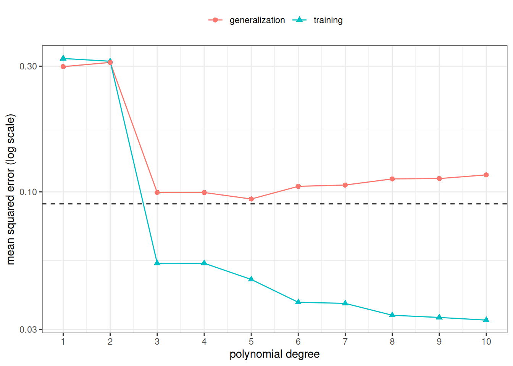
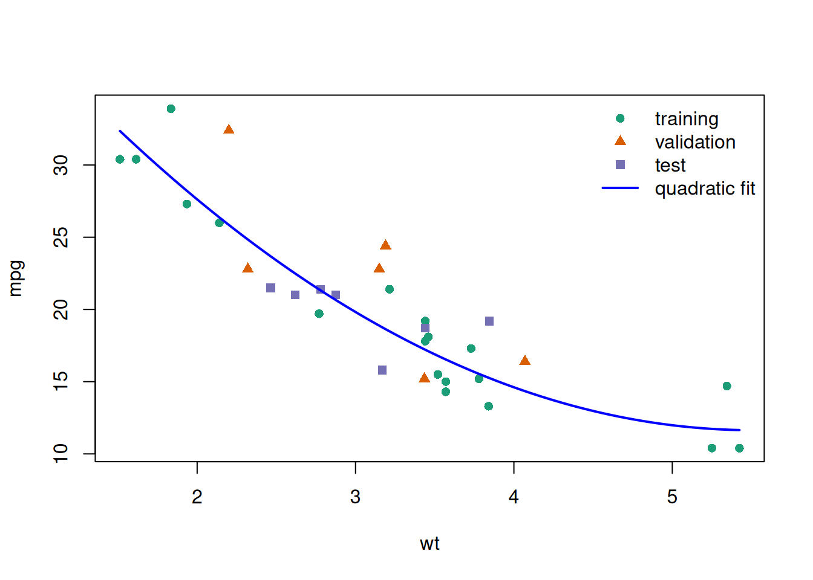
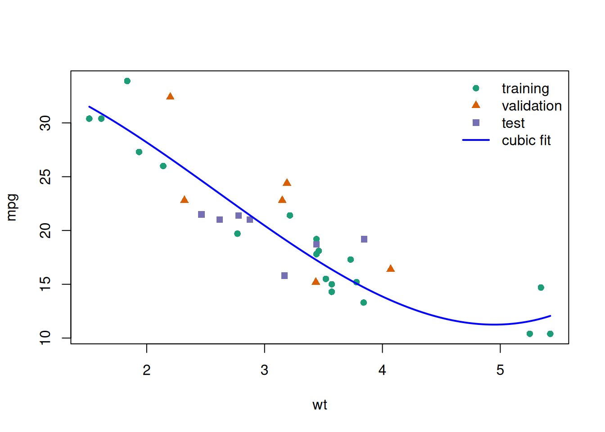
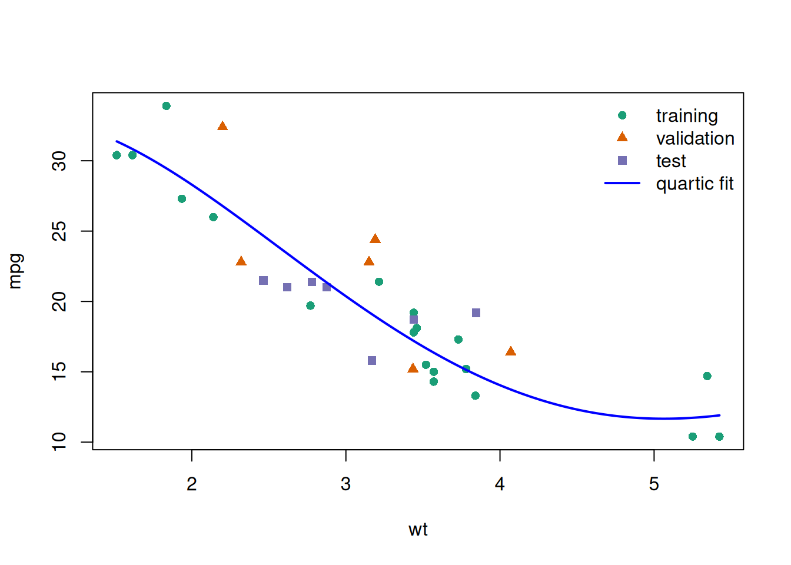
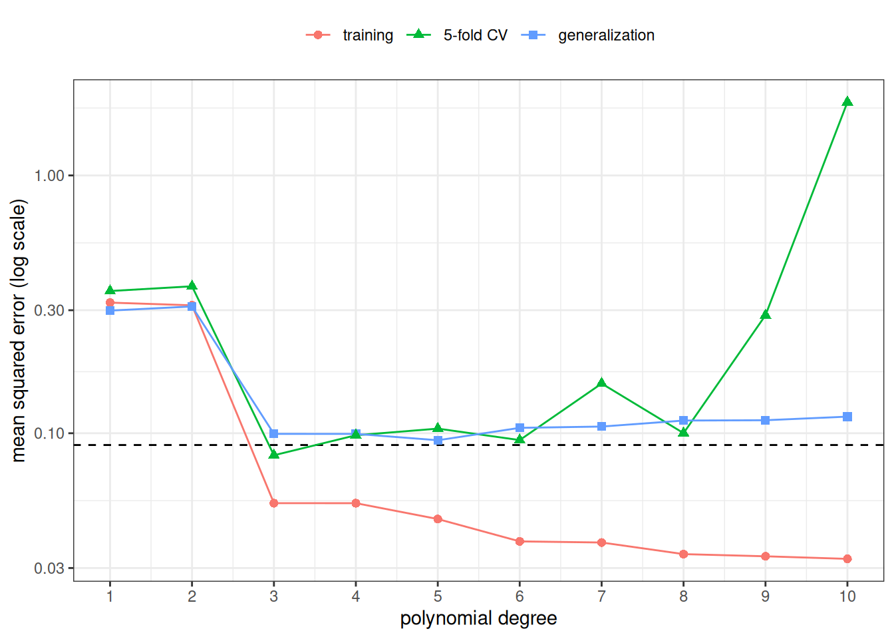

# Validating Predictions

Code

- [Show All Code](javascript:void(0))

- [Hide All Code](javascript:void(0))

- 

  ------------------------------------------------------------------------

- [View Source](javascript:void(0))

Published

Last modified: 2026-10-05 03:46:28 (PDT)

## 1 Overfitting

> **NOTE:**
>
> **Exercise 1 (Training error versus error on new cars)** The built-in `mtcars` data frame has \\n = 32\\ cars. Fit four models for fuel efficiency `mpg` as a polynomial in weight `wt`, of degree 1, 2, 3, and 4, using only the first 20 rows as the training set. For each model, compute the root mean squared error (RMSE), the square root of the [mean squared error of its predictions](estimation.llms.md#def-prediction-mse), on the 20 training rows and on the remaining 12 rows.
>
> 1.  Which degree has the smallest training RMSE?
> 2.  Which degree has the smallest RMSE on the 12 held-out rows?
> 3.  Do the terms added beyond degree 2 improve predictions for the held-out cars?

> **NOTE:**
>
> *Solution 1*.
>
> ``` downlit
> train_cars <- mtcars[1:20, ]
> held_out_cars <- mtcars[21:32, ]
>
> rmse <- function(model, data) {
>   sqrt(mean((data$mpg - predict(model, newdata = data))^2))
> }
>
> overfitting_results <- tibble::tibble(degree = 1:4) |>
>   dplyr::mutate(
>     fit = purrr::map(
>       degree,
>       \(d) lm(mpg ~ poly(wt, d, raw = TRUE), data = train_cars)
>     ),
>     training_RMSE = purrr::map_dbl(fit, rmse, data = train_cars),
>     held_out_RMSE = purrr::map_dbl(fit, rmse, data = held_out_cars)
>   ) |>
>   dplyr::select(-fit)
>
> overfitting_results
> ```
>
> Show R code
>
> ``` downlit
> best_train <- overfitting_results$degree[
>   which.min(overfitting_results$training_RMSE)
> ]
> best_held_out <- overfitting_results$degree[
>   which.min(overfitting_results$held_out_RMSE)
> ]
>
> c(best_train = best_train, best_held_out = best_held_out)
> #>    best_train best_held_out 
> #>             4             2
> ```
>
> 1.  The smallest training RMSE is at degree 4. Each model contains the previous one as a special case, so its training RMSE cannot increase as the degree grows.
>
> 2.  The smallest held-out RMSE is at degree 2.
>
> 3.  No. Going from degree 2 to degree 3 or 4 lowers the training RMSE a little but leaves the held-out RMSE essentially unchanged (it does not fall below its degree-2 value). The terms beyond degree 2 improve the fit to the 20 training cars without improving predictions for the 12 held-out cars. Degree 1 to degree 2 is different: there the held-out RMSE also falls.

> **NOTE:**
>
> **Definition 1 (Overfitting)** **Overfitting** occurs when a model fits the training data well but predicts poorly for new observations. It results from including too many predictors relative to the effective sample size.

In [Exercise 1](#exr-overfitting), the terms beyond degree 2 fit the 20 training cars more closely but do not predict the 12 held-out cars better. The effect is small here: it is the beginning of overfitting, not a dramatic case.

## 2 Generalization error

> **NOTE:**
>
> **Exercise 2 (Score a fitted model on a car it has not seen)** A prediction rule \\\hat y(\cdot)\\ has been fitted to a training set \\\mathcal{T}\\ of \\n\\ observations \\(x_1, y_1), \ldots, (x_n, y_n)\\, such as the 20 training cars of [Exercise 1](#exr-overfitting). A new car \\(X_0, Y_0)\\ is then drawn from the same population, independently of \\\mathcal{T}\\.
>
> 1.  Holding \\\mathcal{T}\\ fixed, write the average squared [prediction error](estimation.llms.md#def-prediction-error) that \\\hat y\\ would make over all such new cars, as an expectation.
> 2.  Which parts of your expression do you know, and which do you not know?
> 3.  The training RMSE of [Exercise 1](#exr-overfitting) is the square root of the [mean squared error of the predictions](estimation.llms.md#def-prediction-mse) \\\hat y(x_1), \ldots, \hat y(x_n)\\. What does that mean squared error use in place of your expectation?

> **NOTE:**
>
> *Solution 2*.
>
> 1.  Average the squared prediction error over the distribution of \\(X_0, Y_0)\\, with \\\mathcal{T}\\, and so the rule \\\hat y\\, held fixed:
>
>     \\\operatorname{E}\mathopen{}\left\[\mathopen{}\left(\hat y(X_0) - Y_0\right)^2\mathclose{} \mid \mathcal{T}\right\]\mathclose{}.\\
>
> 2.  The rule \\\hat y\\ is known, because we fitted it. The joint distribution of \\(X_0, Y_0)\\ is unknown, so the expectation cannot be computed. If we knew that distribution, we would not need data to build a prediction rule.
>
> 3.  The training mean squared error replaces the expectation over new cars with an average over the \\n\\ training cars. Those cars are draws from the same population, but they are not independent of \\\mathcal{T}\\: they *are* \\\mathcal{T}\\, and \\\hat y\\ was chosen to fit them.

> **NOTE:**
>
> **Definition 2 (Generalization error)** The **generalization error** of a prediction rule \\\hat y\\ fitted to a training set \\\mathcal{T}\\ is its expected squared [prediction error](estimation.llms.md#def-prediction-error) on a new observation \\(X_0, Y_0)\\ drawn from the same population independently of \\\mathcal{T}\\, with \\\mathcal{T}\\ held fixed:
>
> \\ \operatorname{Err}\_{\mathcal{T}} \stackrel{\text{def}}{=}\operatorname{E}\mathopen{}\left\[\mathopen{}\left(\hat y(X_0) - Y_0\right)^2\mathclose{} \mid \mathcal{T}\right\]\mathclose{}. \tag{1}\\

> **NOTE:**
>
> *Remark 1* (Other names, and where the error comes from). Hastie et al. ([2009, sec. 7.2](#ref-hastie2009elements)) also call \\\operatorname{Err}\_{\mathcal{T}}\\ the *test error*, and in sec. 7.12 the *conditional* test error. It is the [risk](https://morrison-lab.github.io/pds/expectation.html#def-risk) of the prediction \\\hat y(X_0)\\ under squared error [loss](https://morrison-lab.github.io/pds/expectation.html#def-loss-function), computed with the training set held fixed.
>
> Averaging \\\operatorname{Err}\_{\mathcal{T}}\\ over training sets as well gives the expected squared prediction error of the fitting *procedure*. At a fixed covariate value, that average splits into a squared bias, a variance and an irreducible noise term ([expected squared prediction error theorem](https://morrison-lab.github.io/pds/variance-covariance.html#thm-prediction-error)). A more flexible model usually lowers the bias and raises the variance, so the generalization error is smallest at an intermediate flexibility: the *bias–variance trade-off* ([James et al. 2021, sec. 2.2.2](#ref-james2021islr2e)). [Overfitting](#def-overfitting) is the flexible end of that trade-off.

> **NOTE:**
>
> **Exercise 3 (A held-out set estimates the generalization error)** A prediction rule \\\hat y\\ is fitted to a training set \\\mathcal{T}\\. A held-out set of \\m\\ observations \\(x\_{0,1}, y\_{0,1}), \ldots, (x\_{0,m}, y\_{0,m})\\ is drawn from the same population as the new observation \\(X_0, Y_0)\\ of [Definition 2](#def-generalization-error), each independently of \\\mathcal{T}\\. Write \\e\_{0,j} \stackrel{\text{def}}{=}\hat y(x\_{0,j}) - y\_{0,j}\\ for the [prediction error](estimation.llms.md#def-prediction-error) on held-out observation \\j\\.
>
> Show that, given \\\mathcal{T}\\, the expected [mean squared error](estimation.llms.md#def-prediction-mse) of the held-out predictions is \\\operatorname{Err}\_{\mathcal{T}}\\.

> **NOTE:**
>
> *Solution 3*. Given \\\mathcal{T}\\, the rule \\\hat y\\ is fixed. Each held-out pair has the same distribution as \\(X_0, Y_0)\\ and is independent of \\\mathcal{T}\\, so each squared prediction error has conditional expectation \\\operatorname{E}\mathopen{}\left\[e\_{0,j}^2 \mid \mathcal{T}\right\]\mathclose{} = \operatorname{Err}\_{\mathcal{T}}\\ by [Equation 1](#eq-generalization-error). Then
>
> \\ \begin{aligned} \operatorname{E}\mathopen{}\left\[\frac{1}{m} \sum\_{j=1}^m e\_{0,j}^2 \mid \mathcal{T}\right\]\mathclose{} &= \frac{1}{m} \operatorname{E}\mathopen{}\left\[\sum\_{j=1}^m e\_{0,j}^2 \mid \mathcal{T}\right\]\mathclose{} && \text{(factor out the constant } 1/m \text{)} \\ &= \frac{1}{m} \sum\_{j=1}^m \operatorname{E}\mathopen{}\left\[e\_{0,j}^2 \mid \mathcal{T}\right\]\mathclose{} && \text{(expectation of a sum)} \\ &= \frac{1}{m} \sum\_{j=1}^m \operatorname{Err}\_{\mathcal{T}} && \text{(each term, as above)} \\ &= \frac{1}{m} \mathopen{}\left(m \\ \operatorname{Err}\_{\mathcal{T}}\right)\mathclose{} && \text{(sum of } m \text{ equal terms)} \\ &= \mathopen{}\left(\frac{1}{m} \cdot m\right)\mathclose{} \operatorname{Err}\_{\mathcal{T}} && \text{(regroup the product)} \\ &= 1 \cdot \operatorname{Err}\_{\mathcal{T}} && (\tfrac{1}{m} \cdot m = 1) \\ &= \operatorname{Err}\_{\mathcal{T}} && (1 \cdot b = b) \end{aligned} \\
>
> The third line is the one that needs the held-out set to be independent of \\\mathcal{T}\\.

> **NOTE:**
>
> **Theorem 1 (Held-out mean squared error is unbiased)** Let a prediction rule \\\hat y\\ be fitted to a training set \\\mathcal{T}\\, and let a held-out set of \\m\\ observations \\(x\_{0,1}, y\_{0,1}), \ldots, (x\_{0,m}, y\_{0,m})\\ be drawn from the same population as \\(X_0, Y_0)\\, each independently of \\\mathcal{T}\\, with [prediction errors](estimation.llms.md#def-prediction-error) \\e\_{0,j} = \hat y(x\_{0,j}) - y\_{0,j}\\. Then the [mean squared error](estimation.llms.md#def-prediction-mse) of the held-out predictions is a conditionally [unbiased](estimation.llms.md#def-unbiased) estimator of the [generalization error](#def-generalization-error):
>
> \\ \operatorname{E}\mathopen{}\left\[\frac{1}{m} \sum\_{j=1}^m e\_{0,j}^2 \mid \mathcal{T}\right\]\mathclose{} = \operatorname{Err}\_{\mathcal{T}}. \\

> **NOTE:**
>
> *Proof*. This is [Solution 3](#sol-held-out-unbiased).

> **NOTE:**
>
> *Remark 2* (Training error is optimistic). The same argument fails for the training set. The training pairs are not independent of \\\mathcal{T}\\: they are \\\mathcal{T}\\, and \\\hat y\\ was fitted to make their prediction errors small. So the third line of [Solution 3](#sol-held-out-unbiased) does not hold for them, and the training mean squared error is typically *smaller* than \\\operatorname{Err}\_{\mathcal{T}}\\ ([Hastie et al. 2009, sec. 7.4](#ref-hastie2009elements)). [Exercise 1](#exr-overfitting) shows the pattern: training RMSE keeps falling as the degree grows, while held-out RMSE does not.

> **NOTE:**
>
> **Example 1 (Training error and generalization error by degree)** Real data never reveal \\\operatorname{Err}\_{\mathcal{T}}\\, but a simulation can, because it can draw as many new observations as we like. Here the population is known: \\X \sim \text{Uniform}(0, 1)\\ and, given \\X = x\\, \\Y\\ is normal with mean \\\sin(2 \pi x)\\ and standard deviation \\\sigma = 0.3\\. We draw one training set of \\n = 30\\ observations, fit a polynomial in \\x\\ of each degree from 1 to 10 by least squares, and score each fit on the training set and on \\10{,}000\\ new observations. By [Theorem 1](#thm-held-out-unbiased), the second score is an unbiased estimate of \\\operatorname{Err}\_{\mathcal{T}}\\, and with \\10{,}000\\ observations it is a precise one.
>
> ``` downlit
> sim_sigma <- 0.3
> sim_truth <- function(x) sin(2 * pi * x)
> sim_draw <- function(n) {
>   x <- stats::runif(n)
>   tibble::tibble(x = x, y = sim_truth(x) + stats::rnorm(n, sd = sim_sigma))
> }
> mse <- function(model, data) {
>   mean((predict(model, newdata = data) - data$y)^2)
> }
>
> set.seed(1)
> sim_train <- sim_draw(30)
> sim_new <- sim_draw(10000)
> sim_degrees <- 1:10
>
> sim_errors <- tibble::tibble(degree = sim_degrees) |>
>   dplyr::mutate(
>     fit = purrr::map(degree, \(d) lm(y ~ poly(x, d), data = sim_train)),
>     training = purrr::map_dbl(fit, mse, data = sim_train),
>     generalization = purrr::map_dbl(fit, mse, data = sim_new)
>   ) |>
>   dplyr::select(-fit)
>
> sim_errors
> ```
>
> Show R code
>
> ``` downlit
> sim_errors |>
>   tidyr::pivot_longer(
>     c(training, generalization),
>     names_to = "error",
>     values_to = "mse"
>   ) |>
>   ggplot2::ggplot(ggplot2::aes(degree, mse, colour = error, shape = error)) +
>   ggplot2::geom_hline(yintercept = sim_sigma^2, linetype = "dashed") +
>   ggplot2::geom_line() +
>   ggplot2::geom_point(size = 2) +
>   ggplot2::scale_x_continuous(breaks = sim_degrees) +
>   ggplot2::scale_y_log10() +
>   ggplot2::labs(
>     x = "polynomial degree",
>     y = "mean squared error (log scale)",
>     colour = NULL,
>     shape = NULL
>   ) +
>   ggplot2::theme_bw() +
>   ggplot2::theme(legend.position = "top")
> ```
>
> [](model-validation_files/figure-html/train-test-error-plot-1.png "Figure 1: Training mean squared error and estimated generalization error (mean squared error on 10{,}000 new observations) of polynomial fits to one simulated training set of n = 30. The dashed line is the noise variance \sigma^2, the irreducible error.")
>
> Figure 1: Training mean squared error and estimated generalization error (mean squared error on \\10{,}000\\ new observations) of polynomial fits to one simulated training set of \\n = 30\\. The dashed line is the noise variance \\\sigma^2\\, the [irreducible error](https://morrison-lab.github.io/pds/variance-covariance.html#def-irreducible-error).
>
> Show R code
>
> ``` downlit
> sim_best_generalization <-
>   sim_errors$degree[which.min(sim_errors$generalization)]
> sim_best_training <- sim_errors$degree[which.min(sim_errors$training)]
> sim_n_below <- c(
>   training = sum(sim_errors$training < sim_sigma^2),
>   generalization = sum(sim_errors$generalization < sim_sigma^2)
> )
> c(
>   best_by_training = sim_best_training,
>   best_by_generalization = sim_best_generalization,
>   n_below_sigma2 = sim_n_below
> )
> #>              best_by_training        best_by_generalization 
> #>                            10                             5 
> #>       n_below_sigma2.training n_below_sigma2.generalization 
> #>                             8                             0
> ```
>
> The training error is smallest at degree 10 and never rises as the degree grows, because each polynomial family contains the one before it. The generalization error is smallest at degree 5. No prediction rule can have generalization error below \\\sigma^2 = 0.09\\. Yet the training error falls below \\\sigma^2\\ at 8 of the ten degrees, while the estimated generalization error falls below it at 0 of them: the training error is [optimistic](#rem-training-mse-optimistic).

## 3 Training, validation, and test sets

> **NOTE:**
>
> **Exercise 4 (Sizes of a three-way split)** The `mtcars` data frame has \\n = 32\\ cars. Suppose we assign \\\lfloor 0.6 n \rfloor\\ cars to a training set, \\\lfloor 0.2 n \rfloor\\ cars to a validation set, and all remaining cars to a test set. How many cars are in each set?

> **NOTE:**
>
> *Solution 4*. \\\lfloor 0.6 \cdot 32 \rfloor = \lfloor 19.2 \rfloor = 19\\ training cars, \\\lfloor 0.2 \cdot 32 \rfloor = \lfloor 6.4 \rfloor = 6\\ validation cars, and \\32 - 19 - 6 = 7\\ test cars.

> **NOTE:**
>
> **Definition 3 (Training/validation/test split)** A **training/validation/test split** divides the data into three sets:
>
> - Use the *training set* to estimate model parameters.
> - Use the *validation set* to compare candidate models, choose transformations, or tune hyperparameters.
> - Use the *test set* once at the end to estimate final out-of-sample performance.

This validation approach extends the basic train/test split by separating model tuning from final model assessment. It follows James et al. ([2021, 198–201](#ref-james2021islr2e)).

Keeping the test set untouched during model building helps avoid optimistic bias from repeatedly trying many models. In [Exercise 4](#exr-data-splits), a rule of 60% / 20% / 20% on \\n = 32\\ cars gives sets of 19, 6, and 7 cars, and the 7 test cars are used only once, after the model is chosen.

> **NOTE:**
>
> **Example 2 (Numerical example)** This example ([Example 2](#exm-train-validation-test-split)) uses R’s built-in `mtcars` dataset (\\n=32\\ cars) to predict fuel efficiency (`mpg`) from vehicle weight (`wt`). It uses one random split to compare linear, quadratic, cubic, and quartic models (`mpg ~ wt`, `mpg ~ wt + I(wt^2)`, `mpg ~ wt + I(wt^2) + I(wt^3)`, and `mpg ~ wt + I(wt^2) + I(wt^3) + I(wt^4)`) on a validation set, then reports the chosen model’s test RMSE on untouched test data ([James et al. 2021, 213](#ref-james2021islr2e)).
>
> ``` downlit
> set.seed(108)
> n <- nrow(mtcars)
>
> n_train <- floor(0.6 * n)
> n_valid <- floor(0.2 * n)
>
> idx_train <- sample.int(n, size = n_train)
> idx_remaining <- setdiff(seq_len(n), idx_train)
> idx_valid <- sample(idx_remaining, size = n_valid)
> idx_test <- setdiff(idx_remaining, idx_valid)
>
> split_sizes <- tibble::tibble(
>   split = c("training", "validation", "test"),
>   n = c(length(idx_train), length(idx_valid), length(idx_test))
> )
>
> split_sizes
> ```
>
> Table 1: Sizes of the training, validation, and test splits
>
> Show R code
>
> ``` downlit
> train_dat <- mtcars[idx_train, ]
> valid_dat <- mtcars[idx_valid, ]
> test_dat <- mtcars[idx_test, ]
>
> model_linear <- lm(mpg ~ wt, data = train_dat)
> model_quadratic <- lm(mpg ~ wt + I(wt^2), data = train_dat)
> model_cubic <- lm(mpg ~ wt + I(wt^2) + I(wt^3), data = train_dat)
> model_quartic <- lm(
>   mpg ~ wt + I(wt^2) + I(wt^3) + I(wt^4),
>   data = train_dat
> )
>
> compute_rmse <- function(model, data) {
>   sqrt(mean((data$mpg - predict(model, newdata = data))^2))
> }
>
> candidate_models <- list(
>   linear = model_linear,
>   quadratic = model_quadratic,
>   cubic = model_cubic,
>   quartic = model_quartic
> )
>
> validation_results <- tibble::tibble(
>   model = names(candidate_models)
> ) |>
>   dplyr::mutate(
>     training_RMSE = purrr::map_dbl(
>       model,
>       \(model_name) compute_rmse(candidate_models[[model_name]], train_dat)
>     ),
>     validation_RMSE = purrr::map_dbl(
>       model,
>       \(model_name) compute_rmse(candidate_models[[model_name]], valid_dat)
>     )
>   )
>
> model_labels <- c(
>   linear = "linear model",
>   quadratic = "quadratic model",
>   cubic = "cubic model",
>   quartic = "quartic model"
> )
>
> chosen_model_name <-
>   validation_results |>
>   dplyr::arrange(validation_RMSE) |>
>   dplyr::slice(1) |>
>   dplyr::pull(model)
>
> chosen_model_label <- model_labels[[chosen_model_name]]
>
> chosen_model <- candidate_models[[chosen_model_name]]
> chosen_model_validation_rmse <- compute_rmse(chosen_model, valid_dat)
>
> performance_comparison <- tibble::tibble(
>   split = c("validation", "test"),
>   model = chosen_model_name,
>   RMSE = c(
>     chosen_model_validation_rmse,
>     compute_rmse(chosen_model, test_dat)
>   )
> )
>
> chosen_model_name
> #> [1] "linear"
> ```
>
> Show R code
>
> ``` downlit
> partition_colors <- c(
>   training = "#1b9e77",
>   validation = "#d95f02",
>   test = "#7570b3"
> )
> partition_shapes <- c(
>   training = 16,
>   validation = 17,
>   test = 15
> )
> wt_range <- range(c(train_dat$wt, valid_dat$wt, test_dat$wt))
> mpg_range <- range(c(train_dat$mpg, valid_dat$mpg, test_dat$mpg))
> wt_grid <- seq(wt_range[1], wt_range[2], length.out = 200)
>
> plot_partitions_with_fit <- function(model, fit_label) {
>   plot(
>     train_dat$wt,
>     train_dat$mpg,
>     xlab = "wt",
>     ylab = "mpg",
>     pch = partition_shapes[["training"]],
>     xlim = wt_range,
>     ylim = mpg_range,
>     col = partition_colors[["training"]]
>   )
>   points(
>     valid_dat$wt,
>     valid_dat$mpg,
>     pch = partition_shapes[["validation"]],
>     col = partition_colors[["validation"]]
>   )
>   points(
>     test_dat$wt,
>     test_dat$mpg,
>     pch = partition_shapes[["test"]],
>     col = partition_colors[["test"]]
>   )
>   fitted_curve <- predict(model, newdata = data.frame(wt = wt_grid))
>   lines(wt_grid, fitted_curve, col = "blue", lwd = 2)
>   legend(
>     "topright",
>     legend = c("training", "validation", "test", fit_label),
>     col = c(unname(partition_colors), "blue"),
>     pch = c(unname(partition_shapes), NA),
>     lty = c(NA, NA, NA, 1),
>     lwd = c(NA, NA, NA, 2),
>     bty = "n"
>   )
> }
>
> rbind(wt = wt_range, mpg = mpg_range)
> #>       [,1]   [,2]
> #> wt   1.513  5.424
> #> mpg 10.400 33.900
> ```
>
> Show R code
>
> ``` downlit
> plot_partitions_with_fit(model_linear, "linear fit")
> ```
>
> [](model-validation_files/figure-html/unnamed-chunk-3-1.png "Figure 2: Linear model fit superimposed on data partitions")
>
> Figure 2: Linear model fit superimposed on data partitions
>
> Show R code
>
> ``` downlit
> plot_partitions_with_fit(model_quadratic, "quadratic fit")
> ```
>
> [](model-validation_files/figure-html/unnamed-chunk-4-1.png "Figure 3: Quadratic model fit superimposed on data partitions")
>
> Figure 3: Quadratic model fit superimposed on data partitions
>
> Show R code
>
> ``` downlit
> plot_partitions_with_fit(model_cubic, "cubic fit")
> ```
>
> [](model-validation_files/figure-html/unnamed-chunk-5-1.png "Figure 4: Cubic model fit superimposed on data partitions")
>
> Figure 4: Cubic model fit superimposed on data partitions
>
> Show R code
>
> ``` downlit
> plot_partitions_with_fit(model_quartic, "quartic fit")
> ```
>
> [](model-validation_files/figure-html/unnamed-chunk-6-1.png "Figure 5: Quartic model fit superimposed on data partitions")
>
> Figure 5: Quartic model fit superimposed on data partitions
>
> Show R code
>
> ``` downlit
> validation_results
> ```
>
> Table 2: Training and validation RMSE for candidate models
>
> The chosen model is the linear model, because it has the lowest validation RMSE of the four. This split uses different cars from [Exercise 1](#exr-overfitting), and its validation set has only 6 cars, so the model it picks can differ from the one chosen there.
>
> Show R code
>
> ``` downlit
> performance_comparison
> ```
>
> Table 3: Validation and test RMSE for the chosen model

## 4 \\k\\-fold cross-validation

> **NOTE:**
>
> **Exercise 5 (Folds of the `mtcars` data)** Suppose we use \\k = 4\\-fold cross-validation on the \\n = 32\\ cars in `mtcars`.
>
> 1.  How many cars are in each fold?
> 2.  Each time a model is fit, how many cars are used to fit it?
> 3.  How many models are fit in total?
> 4.  How many times is a given car used for fitting, and how many times for prediction?

> **NOTE:**
>
> *Solution 5*.
>
> 1.  \\32 / 4 = 8\\ cars per fold.
> 2.  Each fit leaves out one fold, so it uses \\32 - 8 = 24\\ cars.
> 3.  One model per fold, so \\4\\ models.
> 4.  A given car is in exactly one fold. It is used for prediction once, when its fold is left out, and for fitting in the other \\3\\ fits.

> **NOTE:**
>
> **Definition 4 (\\k\\-fold cross-validation)** In **\\k\\-fold cross-validation**:
>
> 1.  The data are randomly divided into \\k\\ equal-sized subsets (“folds”).
> 2.  For each fold \\i = 1, \ldots, k\\:
>     - Fit the model using all data *except* fold \\i\\.
>     - Compute predicted values for the observations in fold \\i\\.
> 3.  Compute a summary prediction-error measure across all folds.
>
> Values of \\k = 5\\ or \\k = 10\\ are typical.

If data are limited, \\k\\-fold cross-validation can replace the single validation set of [Definition 3](#def-data-splits) for more stable tuning. In [Exercise 5](#exr-kfold), \\k = 4\\ folds of 8 cars each give 4 fits on 24 cars each.

> **NOTE:**
>
> **Definition 5 (Cross-validation estimate)** Let \\\kappa(i) \in \mathopen{}\left\\1, \ldots, k\right\\\mathclose{}\\ be the fold that observation \\i\\ is assigned to in [\\k\\-fold cross-validation](#def-kfold), and let \\\hat y^{(-j)}\mathopen{}\left(\cdot\right)\mathclose{}\\ be the prediction rule fitted to all observations except those in fold \\j\\. The **\\k\\-fold cross-validation estimate** of prediction error is the [mean squared error](estimation.llms.md#def-prediction-mse) of the predictions that each observation receives from the rule fitted without its fold:
>
> \\ \operatorname{CV}\_{(k)} \stackrel{\text{def}}{=}\frac{1}{n} \sum\_{i=1}^n\mathopen{}\left(\hat y^{(-\kappa(i))}\mathopen{}\left(x_i\right)\mathclose{} - y_i\right)^2\mathclose{}. \tag{2}\\

> **NOTE:**
>
> *Remark 3* (What the cross-validation estimate estimates). Each prediction in [Equation 2](#eq-cv-estimate) comes from a rule that did not see the observation it predicts, so each squared error is scored as in [Theorem 1](#thm-held-out-unbiased). But each of those rules was fitted to about \\n (k - 1) / k\\ observations, not \\n\\, and the \\k\\ rules differ from one another and from the rule fitted to all \\n\\. So \\\operatorname{CV}\_{(k)}\\ estimates the generalization error of the fitting *procedure* applied to training sets of that smaller size, averaged over training sets, rather than \\\operatorname{Err}\_{\mathcal{T}}\\ for the one rule fitted to all the data ([Hastie et al. 2009, sec. 7.12](#ref-hastie2009elements)).
>
> When the folds all have \\n / k\\ observations, \\\operatorname{CV}\_{(k)}\\ is also the average of the \\k\\ per-fold mean squared errors, the form James et al. ([2021, sec. 5.1.3](#ref-james2021islr2e)) use.

> **NOTE:**
>
> *Remark 4* (Choosing the number of folds). The number of folds \\k\\ trades bias against variance in the cross-validation estimate itself ([James et al. 2021, sec. 5.1.4](#ref-james2021islr2e)):
>
> - **Bias.** Each rule in [Equation 2](#eq-cv-estimate) is fitted to about \\n (k - 1) / k\\ observations. A rule fitted to fewer observations usually predicts worse, so \\\operatorname{CV}\_{(k)}\\ tends to overstate the error of a rule fitted to all \\n\\. The overstatement shrinks as \\k\\ grows.
> - **Variance.** As \\k\\ grows, the \\k\\ training sets overlap more, so the \\k\\ fitted rules are more alike and their errors are more strongly correlated. An average of strongly correlated errors varies more from one data set to another than an average of weakly correlated ones.
> - **Computation.** The model is fitted \\k\\ times.
>
> \\k = 5\\ or \\k = 10\\ is the usual compromise. The largest choice, \\k = n\\, is the subject of [Section 5](#sec-loocv).

> **NOTE:**
>
> **Example 3 (Cross-validation versus the generalization error)** This example applies [\\k\\-fold cross-validation](#def-kfold) with \\k = 5\\ to the simulated training set of [Example 1](#exm-train-test-error-simulated), using only those 30 observations. The function `cv_mse()` computes [Equation 2](#eq-cv-estimate): it assigns each observation to a fold, fits the model once per fold without that fold, and averages the squared prediction errors.
>
> ``` downlit
> assign_folds <- function(n, k) {
>   sample(rep_len(seq_len(k), n))
> }
>
> cv_mse <- function(formula, data, folds) {
>   y <- stats::model.response(stats::model.frame(formula, data))
>   sq_errors <- numeric(nrow(data))
>   for (j in unique(folds)) {
>     in_fold <- folds == j
>     fit <- lm(formula, data = data[!in_fold, ])
>     pred <- predict(fit, newdata = data[in_fold, ])
>     sq_errors[in_fold] <- (pred - y[in_fold])^2
>   }
>   mean(sq_errors)
> }
>
> set.seed(5)
> sim_folds <- assign_folds(nrow(sim_train), k = 5)
> table(fold = sim_folds)
> #> fold
> #> 1 2 3 4 5 
> #> 6 6 6 6 6
> ```
>
> The same fold assignment is used for every degree, so the degrees are compared on the same splits.
>
> Show R code
>
> ``` downlit
> sim_errors <- sim_errors |>
>   dplyr::mutate(
>     cv_5 = purrr::map_dbl(
>       degree,
>       \(d) cv_mse(y ~ poly(x, d), sim_train, sim_folds)
>     )
>   )
>
> sim_errors
> ```
>
> Show R code
>
> ``` downlit
> sim_errors |>
>   tidyr::pivot_longer(
>     c(training, generalization, cv_5),
>     names_to = "error",
>     values_to = "mse"
>   ) |>
>   dplyr::mutate(
>     error = factor(
>       error,
>       levels = c("training", "cv_5", "generalization"),
>       labels = c("training", "5-fold CV", "generalization")
>     )
>   ) |>
>   ggplot2::ggplot(ggplot2::aes(degree, mse, colour = error, shape = error)) +
>   ggplot2::geom_hline(yintercept = sim_sigma^2, linetype = "dashed") +
>   ggplot2::geom_line() +
>   ggplot2::geom_point(size = 2) +
>   ggplot2::scale_x_continuous(breaks = sim_degrees) +
>   ggplot2::scale_y_log10() +
>   ggplot2::labs(
>     x = "polynomial degree",
>     y = "mean squared error (log scale)",
>     colour = NULL,
>     shape = NULL
>   ) +
>   ggplot2::theme_bw() +
>   ggplot2::theme(legend.position = "top")
> ```
>
> [](model-validation_files/figure-html/cv-simulated-plot-1.png "Figure 6: Figure 1 with the 5-fold cross-validation estimate added. Only the training and cross-validation curves could be computed from real data.")
>
> Figure 6: [Figure 1](#fig-train-test-error) with the 5-fold cross-validation estimate added. Only the training and cross-validation curves could be computed from real data.
>
> Show R code
>
> ``` downlit
> sim_best_cv <- sim_errors$degree[which.min(sim_errors$cv_5)]
> sim_n_fit <- nrow(sim_train) - max(table(sim_folds))
> sim_top <- sim_errors[sim_errors$degree == max(sim_degrees), ]
> sim_cv_ratio_top <- sim_top$cv_5 / sim_top$generalization
> c(
>   best_by_cv = sim_best_cv,
>   best_by_generalization = sim_best_generalization,
>   n_per_fit = sim_n_fit,
>   cv_over_generalization_at_top_degree = sim_cv_ratio_top
> )
> #>                           best_by_cv               best_by_generalization 
> #>                               3.0000                               5.0000 
> #>                            n_per_fit cv_over_generalization_at_top_degree 
> #>                              24.0000                              16.5906
> ```
>
> The cross-validation estimate is smallest at degree 3, and the estimated generalization error at degree 5. Unlike the training error, the cross-validation estimate does not keep falling as the degree grows, so it does not simply reward flexibility. It is not an estimate of \\\operatorname{Err}\_{\mathcal{T}}\\ for the fit to all 30 observations, though ([Remark 3](#rem-cv-estimate)). Each of its fits uses only 24 observations. At degree 10, polynomials fitted to 24 points predict their held-out points much worse than the fit to all 30 predicts new data: the cross-validation estimate is 16.6 times the estimated generalization error. Much of this gap is the bias described in [Remark 4](#rem-choosing-k); the rest is the noise of one run on 30 points. The estimate also jumps around from one degree to the next, because it rests on only 30 observations rather than on \\10{,}000\\ new ones.

> **NOTE:**
>
> **Example 4 (Four-fold cross-validation of the `mtcars` polynomials)** This example applies the \\k = 4\\ folds of [Exercise 5](#exr-kfold) to the four polynomial models of [Exercise 1](#exr-overfitting), now using all \\n = 32\\ cars and the `cv_mse()` function of [Example 3](#exm-kfold-simulated). The fold assignment is random, so the estimate is too; to show how much, we repeat the whole procedure with 5 different random fold assignments.
>
> Show R code
>
> ``` downlit
> mtcars_degrees <- 1:4
> n_repeats <- 5
>
> set.seed(32)
> mtcars_cv <-
>   tidyr::expand_grid(repeat_id = seq_len(n_repeats), degree = mtcars_degrees) |>
>   dplyr::group_by(repeat_id) |>
>   dplyr::mutate(
>     rmse = {
>       folds <- assign_folds(nrow(mtcars), k = 4)
>       purrr::map_dbl(
>         degree,
>         \(d) sqrt(cv_mse(mpg ~ poly(wt, d), mtcars, folds))
>       )
>     }
>   ) |>
>   dplyr::ungroup() |>
>   tidyr::pivot_wider(
>     names_from = degree,
>     values_from = rmse,
>     names_prefix = "degree_"
>   )
>
> mtcars_cv
> ```
>
> Show R code
>
> ``` downlit
> mtcars_cv_best <-
>   mtcars_cv |>
>   tidyr::pivot_longer(
>     -repeat_id,
>     names_to = "degree",
>     names_prefix = "degree_",
>     values_to = "rmse"
>   ) |>
>   dplyr::group_by(repeat_id) |>
>   dplyr::slice_min(rmse, n = 1) |>
>   dplyr::ungroup()
>
> mtcars_cv_best
> ```
>
> Table 4: Degree with the smallest 4-fold cross-validated RMSE in each of 5 random fold assignments
>
> Show R code
>
> ``` downlit
> mtcars_cv_range <-
>   mtcars_cv |>
>   dplyr::summarise(
>     dplyr::across(dplyr::starts_with("degree_"), \(v) diff(range(v)))
>   )
> mtcars_chosen <- sort(unique(mtcars_cv_best$degree))
> mtcars_choice_text <- if (length(mtcars_chosen) == 1) {
>   paste0(
>     "but every assignment chose degree ", mtcars_chosen,
>     ": the estimates moved, and the winner did not"
>   )
> } else {
>   paste0(
>     "and the chosen degree was ",
>     knitr::combine_words(mtcars_chosen, and = " or "),
>     ", depending on how the cars happened to be split"
>   )
> }
> mtcars_cv_range
> ```
>
> Each row of the first table holds, for each degree, the square root of \\\operatorname{CV}\_{(4)}\\ ([Equation 2](#eq-cv-estimate)) for one fold assignment. Across fold assignments, the estimate for one degree varied by as much as 0.32 mpg, but every assignment chose degree 2: the estimates moved, and the winner did not. A single run of \\k\\-fold cross-validation reports one of these rows, so a small difference between two models’ estimates may not survive a different split.

## 5 Leave-one-out cross-validation

> **NOTE:**
>
> **Exercise 6 (The largest number of folds)** Suppose we take \\k = n\\ in [\\k\\-fold cross-validation](#def-kfold) on the \\n = 32\\ cars in `mtcars`.
>
> 1.  How many cars are in each fold?
> 2.  How many models are fit, and how many cars is each fitted to?
> 3.  If we run the procedure twice, with two different random fold assignments, can the two values of \\\operatorname{CV}\_{(32)}\\ ([Equation 2](#eq-cv-estimate)) differ?

> **NOTE:**
>
> *Solution 6*.
>
> 1.  \\32 / 32 = 1\\ car per fold.
> 2.  One model per fold, so \\32\\ models, each fitted to the \\32 - 1 = 31\\ other cars.
> 3.  No. With one car per fold, every assignment of cars to folds produces the same 32 fits, only numbered differently, and [Equation 2](#eq-cv-estimate) does not depend on the numbering. Unlike [Example 4](#exm-kfold-mtcars), the estimate is not random.

> **NOTE:**
>
> **Definition 6 (Leave-one-out cross-validation)** **Leave-one-out cross-validation (LOOCV)** is [\\k\\-fold cross-validation](#def-kfold) with \\k = n\\, so that each fold holds one observation. Writing \\\hat y^{(-i)}\mathopen{}\left(\cdot\right)\mathclose{}\\ for the rule fitted to all observations except observation \\i\\, its [cross-validation estimate](#def-cv-estimate) ([Equation 2](#eq-cv-estimate) with \\k = n\\) is
>
> \\ \operatorname{CV}\_{(n)} = \frac{1}{n} \sum\_{i=1}^n\mathopen{}\left(\hat y^{(-i)}\mathopen{}\left(x_i\right)\mathclose{} - y_i\right)^2\mathclose{}. \tag{3}\\

> **NOTE:**
>
> **Definition 7 (Leverage)** Consider a linear model fitted by [ordinary least squares](correlation-regression.llms.md#def-ols), in which observation \\i\\ has [covariate vector](correlation-regression.llms.md#def-slr-covariate-vector) \\\tilde{x}\_i\\ (the model’s terms at observation \\i\\; for a model with an intercept, a 1 followed by terms such as \\x_i\\ and \\x_i^2\\), and \\A \stackrel{\text{def}}{=}\sum\_{i=1}^n\tilde{x}\_i {\tilde{x}\_i}^{\top}\\ is invertible. The **leverage** of observation \\i\\ is
>
> \\ h\_{i} \stackrel{\text{def}}{=}\tilde{x}\_i^{\top} A^{-1} \tilde{x}\_i. \tag{4}\\

> **NOTE:**
>
> **Theorem 2 (Leave-one-out cross-validation for least squares)** For a linear model fitted by [ordinary least squares](correlation-regression.llms.md#def-ols) with every [leverage](#def-leverage) \\h\_{i} \< 1\\, the [leave-one-out estimate](#def-loocv) can be computed from the single fit to all \\n\\ observations, from its [prediction errors](estimation.llms.md#def-prediction-error) \\e_i = \hat y_i - y_i\\ and its leverages:
>
> \\ \operatorname{CV}\_{(n)} = \frac{1}{n} \sum\_{i=1}^n\mathopen{}\left(\frac{e_i}{1 - h\_{i}}\right)^2\mathclose{}. \tag{5}\\

> **NOTE:**
>
> *Proof*. See James et al. ([2021, sec. 5.1.2](#ref-james2021islr2e)) and Hastie et al. ([2009, sec. 7.10.1](#ref-hastie2009elements)); [Remark 5](#rem-loocv-shortcut-proof) says why it is not derived here.

> **NOTE:**
>
> *Remark 5* (Why the shortcut is cited rather than derived). The derivation needs a formula for how the inverse of the matrix \\A\\ of [Definition 7](#def-leverage) changes when one observation’s outer product \\\tilde{x}\_i {\tilde{x}\_i}^{\top}\\ is removed from it (the Sherman–Morrison formula), which this page does not develop. [Example 5](#exm-loocv-shortcut) checks [Equation 5](#eq-loocv-shortcut) numerically instead, against refitting the model \\n\\ times.

> **NOTE:**
>
> **Example 5 (Leave-one-out cross-validation of the `mtcars` polynomials)** This example computes \\\operatorname{CV}\_{(32)}\\ for the four `mtcars` polynomials of [Exercise 1](#exr-overfitting) in two ways: by fitting each model 32 times, as in [Equation 3](#eq-loocv), and by the single-fit formula of [Theorem 2](#thm-loocv-shortcut), with the leverages from [`hatvalues()`](https://rdrr.io/r/stats/influence.measures.html).
>
> ``` downlit
> loocv_by_refitting <- function(formula, data) {
>   y <- stats::model.response(stats::model.frame(formula, data))
>   sq_errors <- purrr::map_dbl(seq_len(nrow(data)), \(i) {
>     fit <- lm(formula, data = data[-i, ])
>     (predict(fit, newdata = data[i, ]) - y[i])^2
>   })
>   mean(sq_errors)
> }
>
> loocv_by_formula <- function(formula, data) {
>   fit <- lm(formula, data = data)
>   pred_error <- fitted(fit) - stats::model.response(model.frame(fit))
>   mean((pred_error / (1 - hatvalues(fit)))^2)
> }
>
> mtcars_loocv <- tibble::tibble(degree = mtcars_degrees) |>
>   dplyr::mutate(
>     refitting = purrr::map_dbl(
>       degree,
>       \(d) loocv_by_refitting(mpg ~ poly(wt, d), mtcars)
>     ),
>     formula = purrr::map_dbl(
>       degree,
>       \(d) loocv_by_formula(mpg ~ poly(wt, d), mtcars)
>     ),
>     loocv_rmse = sqrt(formula)
>   )
>
> mtcars_loocv
> ```
>
> Show R code
>
> ``` downlit
> loocv_max_diff <- max(abs(mtcars_loocv$refitting - mtcars_loocv$formula))
> mtcars_best_loocv <-
>   mtcars_loocv$degree[which.min(mtcars_loocv$formula)]
> c(max_difference = loocv_max_diff, best_degree = mtcars_best_loocv)
> #> max_difference    best_degree 
> #>    7.10543e-15    2.00000e+00
> ```
>
> The two columns differ by at most 7.1e-15, which is rounding error. The single-fit formula needs one fit per model instead of 32. LOOCV picks degree 2, and because LOOCV is not random ([Solution 6](#sol-loocv)), rerunning it always gives the same choice.

> **NOTE:**
>
> *Remark 6* (When to use leave-one-out cross-validation). LOOCV is the \\k = n\\ end of [Remark 4](#rem-choosing-k): each rule is fitted to \\n - 1\\ observations, so its bias is the smallest of any \\k\\, but the \\n\\ training sets are nearly identical, so its variance can be larger than that of 5- or 10-fold cross-validation ([James et al. 2021, sec. 5.1.4](#ref-james2021islr2e)). For least squares fits, [Theorem 2](#thm-loocv-shortcut) removes its computational cost; for most other fitting methods, it requires \\n\\ fits.

## 6 Choosing a model by cross-validation

> **NOTE:**
>
> *Remark 7* (Cross-validation replaces the validation set, not the test set). Used to choose between models, cross-validation takes the place of the *validation* set of [Definition 3](#def-data-splits), the one consulted again and again, and not of the test set, which stays unused until the end. The cross-validation estimate of the winning model is optimistic: that model won partly because the particular sample and split happened to favor it, so its estimate is the smallest of several noisy estimates. An honest estimate of the chosen model’s error needs data that took no part in the choice ([Hastie et al. 2009, sec. 7.2](#ref-hastie2009elements)), such as a test set, or an outer cross-validation loop that repeats the whole selection inside each of its folds.

> **NOTE:**
>
> **Definition 8 (Standard error of a cross-validation estimate)** Let \\\operatorname{MSE}\_{1}, \ldots, \operatorname{MSE}\_{k}\\ be the [mean squared errors](estimation.llms.md#def-prediction-mse) of the predictions for the observations in folds \\1, \ldots, k\\ of [\\k\\-fold cross-validation](#def-kfold), and let \\s\_{\text{CV}}\\ be their [sample standard deviation](exploratory-descriptive.llms.md#def-sample-sd). The **standard error** of the cross-validation estimate is
>
> \\ \operatorname{SE}\_{\text{CV}}\stackrel{\text{def}}{=}\frac{s\_{\text{CV}}}{\sqrt{k}}. \tag{6}\\

> **NOTE:**
>
> *Remark 8* (The standard error is only a rough guide). Hastie et al. ([2009, sec. 7.10.1](#ref-hastie2009elements)) draw standard-error bars computed from the per-fold errors as in [Equation 6](#eq-cv-se). That formula treats the \\k\\ fold errors as if they were independent, which they are not: every pair of folds shares \\k - 2\\ folds of training data. So \\\operatorname{SE}\_{\text{CV}}\\ is a rough indication of how much \\\operatorname{CV}\_{(k)}\\ might change with a different sample, not an exact [standard error](estimation.llms.md#def-SE).

> **NOTE:**
>
> **Definition 9 (One-standard-error rule)** Let \\M_1, \ldots, M_L\\ be candidate models ordered from least to most flexible. Write \\\operatorname{CV}\_{(k)}(M_l)\\ for the [cross-validation estimate](#def-cv-estimate) of model \\M_l\\ and \\\operatorname{SE}\_{\text{CV}}(M_l)\\ for its [standard error](#def-cv-se), all computed with the same folds, and let \\M\_{l^\*}\\ be the model with the smallest estimate. The **one-standard-error rule** chooses the least flexible model \\M_l\\ whose estimate is within one standard error of the smallest:
>
> \\ \operatorname{CV}\_{(k)}(M_l) \le \operatorname{CV}\_{(k)}(M\_{l^\*}) + \operatorname{SE}\_{\text{CV}}(M\_{l^\*}). \tag{7}\\

> **NOTE:**
>
> **Example 6 (The one-standard-error rule for the simulated polynomials)** This example applies 10-fold cross-validation to the simulated training set of [Example 1](#exm-train-test-error-simulated), records the mean squared error in each fold, and applies [Definition 9](#def-one-se-rule) to the ten degrees.
>
> Show R code
>
> ``` downlit
> cv_fold_mse <- function(formula, data, folds) {
>   y <- stats::model.response(stats::model.frame(formula, data))
>   purrr::map_dbl(sort(unique(folds)), \(j) {
>     in_fold <- folds == j
>     fit <- lm(formula, data = data[!in_fold, ])
>     mean((predict(fit, newdata = data[in_fold, ]) - y[in_fold])^2)
>   })
> }
>
> set.seed(10)
> sim_folds_ten <- assign_folds(nrow(sim_train), k = 10)
>
> sim_cv_ten <- tibble::tibble(degree = sim_degrees) |>
>   dplyr::mutate(
>     fold_mse = purrr::map(
>       degree,
>       \(d) cv_fold_mse(y ~ poly(x, d), sim_train, sim_folds_ten)
>     ),
>     cv = purrr::map_dbl(fold_mse, mean),
>     se = purrr::map_dbl(fold_mse, \(v) sd(v) / sqrt(length(v)))
>   ) |>
>   dplyr::select(-fold_mse)
>
> sim_min <- dplyr::slice_min(sim_cv_ten, cv, n = 1)
> sim_one_se <-
>   sim_cv_ten |>
>   dplyr::filter(cv <= sim_min$cv + sim_min$se) |>
>   dplyr::slice_min(degree, n = 1)
>
> sim_cv_ten
> ```
>
> With 30 observations and 10 folds, each fold holds 3 observations, so all ten folds have equal size and `cv` is \\\operatorname{CV}\_{(10)}\\ ([Remark 3](#rem-cv-estimate)).
>
> Show R code
>
> ``` downlit
> sim_cv_ten |>
>   ggplot2::ggplot(ggplot2::aes(degree, cv)) +
>   ggplot2::geom_hline(
>     yintercept = sim_min$cv + sim_min$se,
>     linetype = "dashed"
>   ) +
>   ggplot2::geom_errorbar(
>     ggplot2::aes(ymin = cv - se, ymax = cv + se),
>     width = 0.2
>   ) +
>   ggplot2::geom_point(size = 2) +
>   ggplot2::scale_x_continuous(breaks = sim_degrees) +
>   ggplot2::scale_y_log10() +
>   ggplot2::labs(
>     x = "polynomial degree",
>     y = "10-fold CV estimate (log scale)"
>   ) +
>   ggplot2::theme_bw()
> ```
>
> [](model-validation_files/figure-html/one-se-rule-plot-1.png "Figure 7: 10-fold cross-validation estimates, with bars of one standard error (Equation 6). The dashed line is one standard error above the smallest estimate.")
>
> Figure 7: 10-fold cross-validation estimates, with bars of one standard error ([Equation 6](#eq-cv-se)). The dashed line is one standard error above the smallest estimate.
>
> The smallest estimate is at degree 8. The least flexible degree within one standard error of it is degree 3, which is the one-standard-error rule’s choice. The rule prefers the simpler model when the data cannot clearly tell the two apart. Because the data are simulated, we can check both choices against the estimated generalization errors of [Example 1](#exm-train-test-error-simulated): 0.112 for degree 8 and 0.099 for degree 3.

## 7 Cross-validating the whole procedure

> **NOTE:**
>
> **Exercise 7 (Screening predictors before cross-validating)** A data set has \\n = 50\\ observations of an outcome \\Y\\ and of \\p = 1000\\ candidate predictors. In fact every variable is independent standard normal noise, so no predictor carries any information about \\Y\\.
>
> An analyst
>
> 1.  picks the 10 predictors most correlated with \\Y\\ in all 50 observations, then
> 2.  estimates the prediction error of a linear model in those 10 predictors by 5-fold cross-validation.
>
> Answer the following:
>
> 1.  What is the smallest possible generalization error ([Equation 1](#eq-generalization-error)) of any prediction rule for \\Y\\ here?
> 2.  Simulate the analyst’s procedure. What cross-validation estimate does it report?
> 3.  Repeat the simulation, but carry out step 1 inside each fold, using only that fold’s training observations. What estimate does this give?

> **NOTE:**
>
> *Solution 7*.
>
> 1.  \\Y\\ is independent of every predictor, with mean 0 and variance 1. The best prediction is the constant 0, and its generalization error is \\\operatorname{Var}\mathopen{}\left(Y\right)\mathclose{} = 1\\. Every other rule does worse, so any honest estimate should be near or above 1.
>
> 2.  and 3. The function below runs one data set through both procedures. The only difference is whether the screening step sees the whole data set (`"outside"`) or only the training folds (`"inside"`).
>
> ``` downlit
> top_predictors <- function(x, y, n_keep) {
>   order(abs(stats::cor(x, y)), decreasing = TRUE)[seq_len(n_keep)]
> }
>
> screened_cv <- function(x, y, folds, n_keep, screen) {
>   if (screen == "outside") {
>     keep <- top_predictors(x, y, n_keep)
>   }
>   sq_errors <- numeric(length(y))
>   for (j in unique(folds)) {
>     in_fold <- folds == j
>     if (screen == "inside") {
>       keep <- top_predictors(x[!in_fold, ], y[!in_fold], n_keep)
>     }
>     train <- data.frame(y = y[!in_fold], x[!in_fold, keep])
>     fit <- lm(y ~ ., data = train)
>     held_out <- data.frame(x[in_fold, keep])
>     sq_errors[in_fold] <- (predict(fit, newdata = held_out) - y[in_fold])^2
>   }
>   mean(sq_errors)
> }
>
> set.seed(7102)
> n_obs <- 50
> n_predictors <- 1000
> n_sims <- 50
>
> screening_results <- purrr::map(seq_len(n_sims), \(s) {
>   x <- matrix(stats::rnorm(n_obs * n_predictors), n_obs, n_predictors)
>   colnames(x) <- paste0("x", seq_len(n_predictors))
>   y <- stats::rnorm(n_obs)
>   folds <- assign_folds(n_obs, k = 5)
>   tibble::tibble(
>     sim = s,
>     outside = screened_cv(x, y, folds, n_keep = 10, screen = "outside"),
>     inside = screened_cv(x, y, folds, n_keep = 10, screen = "inside")
>   )
> }) |>
>   purrr::list_rbind()
>
> screening_summary <-
>   screening_results |>
>   dplyr::summarise(
>     dplyr::across(c(outside, inside), mean)
>   )
>
> screening_summary
> ```
>
> Averaged over 50 simulated data sets:
>
> - Screening outside the folds gives a mean CV estimate of 0.54, well below the smallest possible generalization error of 1. The procedure reports that pure noise predicts \\Y\\.
> - Screening inside the folds gives 1.52, above 1, as an honest estimate for a rule built from noise should be.
>
> The 10 predictors chosen from all 50 observations were chosen *because* they happen to correlate with \\Y\\ in the very observations that later serve as held-out folds. Those observations were not held out from the whole fitting procedure, so the independence that [Theorem 1](#thm-held-out-unbiased) needs fails.

> **NOTE:**
>
> *Remark 9* (Cross-validate the whole procedure). Every step that uses the outcome is part of fitting, and must be repeated inside each fold using only that fold’s training observations ([Hastie et al. 2009, sec. 7.10.2](#ref-hastie2009elements)). Such steps include:
>
> - screening or selecting predictors, as in [Exercise 7](#exr-cv-screening);
> - choosing transformations or a polynomial degree;
> - tuning a penalty or other hyperparameter.
>
> Hastie et al. ([2009, sec. 7.10.2](#ref-hastie2009elements)) note that steps using only the predictors, such as dropping predictors with almost no variation, can be done once on all the data before the folds are formed. Repeating such a step inside each fold is never wrong, though, and it scores each held-out fold the way new data would be scored. Examples are estimating the mean and standard deviation used for [standardization](exploratory-descriptive.llms.md#def-standardization), and the values used to fill in missing predictor values, when they are computed without the outcome.

## References

Hastie, Trevor, Robert Tibshirani, and Jerome Friedman. 2009. *The Elements of Statistical Learning: Data Mining, Inference, and Prediction*. 2nd ed. Springer. <https://doi.org/10.1007/978-0-387-84858-7>.

James, Gareth, Daniela Witten, Trevor Hastie, and Robert Tibshirani. 2021. *An Introduction to Statistical Learning: With Applications in R*. 2nd ed. Springer. <https://doi.org/10.1007/978-1-0716-1418-1>.

Back to top
