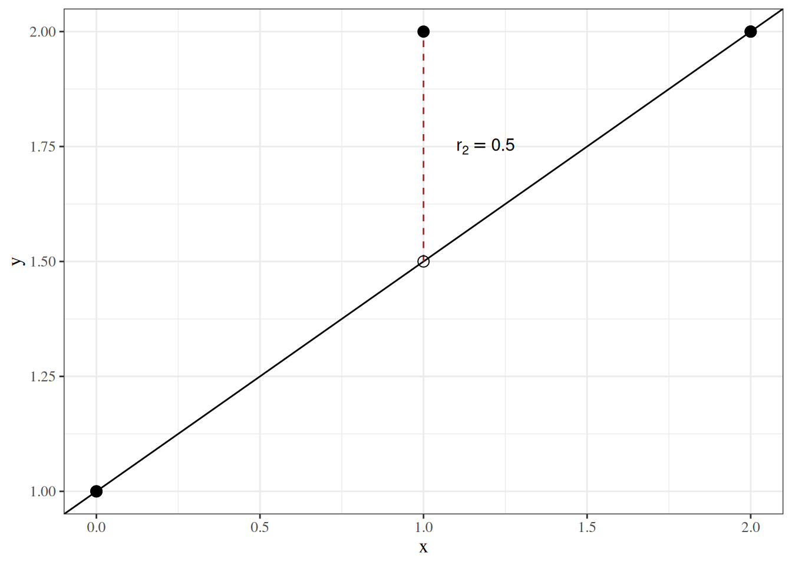

# Estimation

Code

Published

Last modified: 2026-10-08 23:42:35 (UTC)

## 1 Scientific models

> **NOTE:**
>
> **Definition 1 (Scientific models)** **Scientific models** are attempts to describe *physical conditions or changes* that occur in the world and universe around us.

> **NOTE:**
>
> **Example 1 (Scientific models in epidemiology)** Epidemiologists typically study *biological conditions and changes*, such as the spread of infectious diseases through populations, or the effects of environmental factors on individuals.

### 1.1 Models as approximations

> …Essentially, all models are wrong, but some are useful. **However, the approximate nature of the model must always be borne in mind.**

\[Box and Draper ([1987](#ref-box_draper_1987)), p. 424; emphasis added\]

See also ([Dunn and Smyth 2018, sec. 1.8](#ref-dunn2018generalized)).

### 1.2 Statistical analysis of scientific models

When we perform statistical analyses, we use data to help us choose between models; specifically, to determine which models best explain those data.

Physical processes do not produce data on their own. Data are only produced when scientists implement an *observation process* (that is, a *scientific study*), which is distinct from the underlying *physical process*. In some cases, the observation process and the physical process interact with each other; this interaction is called the [“observer effect”](https://en.wikipedia.org/wiki/Observer_effect).

To learn about the physical processes we are ultimately interested in, we often need to account for the observation process that produced the data we are analyzing. In particular, if some of the planned observations in the study design were not completed, we will likely need to account for the incompleteness of the resulting data set in our analysis. If we are not sure why some observations are incomplete, we may need to model the observation process in addition to the physical process we were originally interested in. For example, if some participants in a study dropped out part-way through, we may need to investigate why those participants dropped out, as opposed to other participants who completed the study.

These kinds of *missing data* issues are outside the scope of these notes; see Van Buuren ([2018](#ref-van2018flexible)) for more details.

## 2 Estimands, estimates, and estimators

### 2.1 Estimands

> **NOTE:**
>
> **Definition 2 (Estimand)** An **estimand** is an unknown quantity \\\theta\\ whose value we want to know ([Pohl et al. 2021](#ref-pohl2021estimands); [Lawrance et al. 2020](#ref-lawrance2020estimand)).

> **NOTE:**
>
> **Example 2 (Mean height of students)** If we are trying to determine the mean height of students at our school, then the *population mean* is our [estimand](#def-estimand).

In statistical contexts, most estimands are parameters of probabilistic models, or functions of model parameters.

> **NOTE:**
>
> Model parameters and other estimands are often symbolized using lower-case Greek letters: \\\alpha, \beta, \gamma, \delta\\, etc.

### 2.2 Estimates

> **NOTE:**
>
> **Definition 3 (Estimate/estimated value)** In statistics, an **estimate** or **estimated value** \\\hat{\theta}\\ is an informed guess of an [estimand](#def-estimand) \\\theta\\’s value, computed from the observed data \\x_1, \ldots, x_n\\:
>
> \\ \hat{\theta}= \hat{\theta}(x_1, \ldots, x_n). \\

> **NOTE:**
>
> **Example 3 (Mean height of students)** Suppose we measure the heights of 50 randomly sampled students from our school, and their [sample mean](exploratory-descriptive.llms.md#def-sample-mean) is 175 cm. We might use 175 cm as an [*estimate*](#def-estimate) of the population mean.

### 2.3 Estimators

> **NOTE:**
>
> **Definition 4 (Estimator)** An **estimator** is the function \\\hat{\theta}(\cdot)\\ that transforms data into an [estimate](#def-estimate); applied to a random sample \\X_1, \ldots, X_n\\, it is a random variable:
>
> \\ \hat{\theta}(X_1, \ldots, X_n). \\

> **NOTE:**
>
> When an estimator is applied to random variables \\X_1, \ldots, X_n\\ rather than to their observed values, the result \\\hat{\theta}(X_1, \ldots, X_n)\\ is also a random variable.

> **NOTE:**
>
> Estimators are often symbolized by placing a ^ (“hat”) symbol on top of the corresponding estimand; for example, \\\hat{\theta}\\.
>
> Usually, their dependence on the data is implicit:
>
> \\\hat{\theta}\stackrel{\text{def}}{=}\hat{\theta}(x_1, \ldots, x_n)\\

> **NOTE:**
>
> **Example 4 (Mean height of students)** Suppose we want to estimate the mean height of students at our school, which we will represent as \\\mu\\, and we measure the heights of \\n = 50\\ randomly sampled students as random variables \\X_1, \ldots, X_n\\. Then we could use the function
>
> \\\hat{\mu}(X_1, \ldots, X_n) \stackrel{\text{def}}{=}\frac{1}{n}\sum\_{i=1}^nX_i \stackrel{\text{def}}{=}\bar X\\
>
> as an [*estimator*](#def-estimator) to produce an *estimate* \\\hat{\mu}= \bar x\\ of \\\mu\\.
>
> Another estimator would be just the height of the first student sampled:
>
> \\\hat{\mu}^{(2)}(X_1, \ldots, X_n) \stackrel{\text{def}}{=}X_1\\
>
> A third possible estimator would be the mean of all sampled students’ heights, except for the two most extreme. Using the [order statistics](nonparametric-models.llms.md#def-order-statistics) \\X\_{(1)} \le X\_{(2)} \le \cdots \le X\_{(n)}\\ (the observations sorted in increasing order), this estimator drops \\X\_{(1)}\\ and \\X\_{(n)}\\ and averages the remaining \\n - 2\\ observations:
>
> \\\hat{\mu}^{(3)}(X_1, \ldots, X_n) \stackrel{\text{def}}{=}\frac{1}{n-2}\sum\_{i=2}^{n-1} X\_{(i)}\\
>
> Which of these estimators is best? The answer depends on how we evaluate them (see [Section 3](#sec-est-accuracy)).

### 2.4 Contrasting estimands, estimates, and estimators

It’s helpful to keep in mind the mathematical type of each estimation concept:

- [estimands](#def-estimand) are numbers (or vectors of numbers);
- [estimates](#def-estimate) are also numbers (or vectors);
- [estimators](#def-estimator) are functions; an estimator applied to random data, \\\hat{\theta}(X_1, \ldots, X_n)\\, is a random variable.

## 3 Accuracy of estimators

### 3.1 Accuracy

To determine which estimator is best, we need to define *best*. Accuracy is usually most important, and ease of computation is usually secondary.

### 3.2 Estimation error

> **NOTE:**
>
> **Definition 5 (Estimation error)** The **estimation error** of an estimate \\\hat{\theta}\\ of a true value \\\theta\\ is the difference between the estimate and the estimand \\\theta\\:
>
> \\\varepsilon\mathopen{}\left(\hat{\theta}\right)\mathclose{} \stackrel{\text{def}}{=}\hat{\theta}- \theta\\

> **NOTE:**
>
> **Example 5 (Estimation error of a mean height)** Continuing [Example 3](#exm-estimate), suppose the population mean height of students at our school were actually \\\mu= 172\\ cm. Then the estimate \\\hat{\mu}= 175\\ cm would have estimation error:
>
> \\ \begin{aligned} \varepsilon\mathopen{}\left(\hat{\mu}\right)\mathclose{} &= \hat{\mu}- \mu && \text{(definition of estimation error)}\\ &= 175 - 172 && \text{(substitute the estimate and the estimand)}\\ &= 3 \text{ cm} && \text{(subtract)} \end{aligned} \\
>
> In practice we never observe an estimation error, because we do not know the estimand’s value; if we did, we would not need to estimate it.

The accuracy of an estimator has no single, agreed formal definition. The usual measures of accuracy, including the bias, mean squared error, and mean absolute error defined in this section, are all functions of the distribution of the estimator’s [estimation error](#def-estimation-error).

### 3.3 Predictions, fitted values, residuals, and prediction errors

> **NOTE:**
>
> **Definition 6 (Prediction)** A **prediction** (or **predicted value**) \\\hat y(x)\\ of an outcome \\Y\\ with covariate value \\X = x\\ is a number computed from \\x\\ and from data \\(x_1, y_1), \ldots, (x_n, y_n)\\ by a rule \\g\\, and used as a guess of \\Y\\:
>
> \\\hat y(x) \stackrel{\text{def}}{=}g\mathopen{}\left(x; (x_1, y_1), \ldots, (x_n, y_n)\right)\mathclose{}.\\

> **NOTE:**
>
> **Example 6 (Predicting with an estimated conditional mean)** Suppose a model specifies the conditional mean \\\operatorname{E}\mathopen{}\left\[Y \mid X = x\right\]\mathclose{}\\ as a function \\\mu(x; \tilde{\theta})\\ of a parameter vector \\\tilde{\theta}\\, and \\\hat{\tilde{\theta}}\\ is an estimate of \\\tilde{\theta}\\. The usual prediction ([Definition 6](#def-prediction)) of \\Y\\ at \\X = x\\ is the estimated conditional mean:
>
> \\\hat y(x) = \mu(x; \hat{\tilde{\theta}}).\\

> **NOTE:**
>
> **Definition 7 (Fitted value)** The **fitted value** \\\hat y_i\\ of observation \\i\\ is the [prediction](#def-prediction) at its own covariate value \\x_i\\:
>
> \\\hat y_i \stackrel{\text{def}}{=}\hat y(x_i).\\

> **NOTE:**
>
> **Definition 8 (Residual)** The **residual** for observation \\i\\ is its observed outcome minus its [fitted value](#def-fitted-value):
>
> \\r_i \stackrel{\text{def}}{=}y_i - \hat y_i\\

> **NOTE:**
>
> **Definition 9 (Prediction error)** The **prediction error** of a [prediction](#def-prediction) \\\hat y\\ (such as \\\hat y(x)\\ or a fitted value \\\hat y_i\\) of an observed outcome \\y\\ is the prediction minus the outcome:
>
> \\e\stackrel{\text{def}}{=}\hat y- y.\\

> **NOTE:**
>
> **Exercise 1 (Prediction error and residual of a fitted observation)** For an observation \\i\\ that was used to fit the model, write its [prediction error](#def-prediction-error) \\e_i\\ in terms of its [residual](#def-residual) \\r_i\\.

> **NOTE:**
>
> *Solution 1*. \\ \begin{aligned} e_i &= \hat y_i - y_i && \text{(definition of prediction error)}\\ &= -(y_i - \hat y_i) && \text{(factor out \$-1\$)}\\ &= -r_i && \text{(definition of residual)} \end{aligned} \\

> **NOTE:**
>
> **Theorem 1 (Prediction error is the negative of the residual)** For an observation \\i\\ that was used to fit the model, the [prediction error](#def-prediction-error) of its [fitted value](#def-fitted-value) is the negative of its [residual](#def-residual):
>
> \\e_i = -r_i.\\

> **NOTE:**
>
> *Proof*. This is the solution to [Exercise 1](#exr-prediction-error-residual).

> **NOTE:**
>
> *Remark 1* (Prediction errors and residuals). The prediction in [Definition 9](#def-prediction-error) can be a [fitted value](#def-fitted-value), for an observation used to fit the model, or a prediction for an observation that was not used to fit the model. Prediction error is oriented the same way as [estimation error](#def-estimation-error): estimate minus true value.
>
> \\ \begin{aligned} e&= \hat y- y && \text{(prediction error)}\\ \varepsilon\mathopen{}\left(\hat{\theta}\right)\mathclose{} &= \hat{\theta}- \theta && \text{(estimation error)} \end{aligned} \\
>
> For an observation used to fit the model, the prediction error is the negative of the residual ([Theorem 1](#thm-prediction-error-residual)), so the two differ only in orientation.

> **NOTE:**
>
> **Definition 10 (Mean squared error of predictions)** The **mean squared error** of predictions \\\hat y_1, \ldots, \hat y_n\\ of observed outcomes \\y_1, \ldots, y_n\\ is the mean of their squared [prediction errors](#def-prediction-error):
>
> \\\operatorname{MSE}\mathopen{}\left(\hat y\right)\mathclose{} \stackrel{\text{def}}{=}\frac{1}{n}\sum\_{i=1}^ne_i^2.\\

> **NOTE:**
>
> *Remark 2* (Prediction MSE, estimator MSE and RSS). [Definition 10](#def-prediction-mse) averages squared errors over observations, where the [mean squared error of an estimator](#def-mse) takes an expectation over repeated samples. On the data used to fit the model, the mean squared error of the fitted values is the [residual sum of squares](correlation-regression.llms.md#def-rss) divided by \\n\\ ([mean squared error and RSS](correlation-regression.llms.md#thm-mse-rss)):
>
> \\\operatorname{MSE}\mathopen{}\left(\hat y\right)\mathclose{} = \frac{1}{n} \text{RSS}(\hat{\tilde{\theta}}), \qquad \text{RSS}(\hat{\tilde{\theta}}) = n \\ \operatorname{MSE}\mathopen{}\left(\hat y\right)\mathclose{}.\\

> **NOTE:**
>
> **Example 7 (Fitted values, residuals, and prediction errors for three points)** Take the points \\(0, 1)\\, \\(1, 2)\\, \\(2, 2)\\ and the line with \\\beta\_{0}= 1\\ and \\\beta\_{x} = 0.5\\ from [the residual sum of squares example](correlation-regression.llms.md#exm-rss), and treat the line as the fitted model.
>
> | \\x_i\\ | \\y_i\\ | \\\hat y_i = 1 + 0.5 x_i\\ | \\r_i = y_i - \hat y_i\\ | \\e_i = \hat y_i - y_i\\ |
> |:--:|:--:|:--:|:--:|:--:|
> | 0 | 1 | 1 | 0 | 0 |
> | 1 | 2 | 1.5 | 0.5 | \\-0.5\\ |
> | 2 | 2 | 2 | 0 | 0 |
>
> [Figure 1](#fig-fitted-residual-error) shows the observed outcomes, the fitted values on the line, and the residual of the second point.
>
> Show R code
>
> ``` downlit
> fre_points <- tibble::tibble(x = c(0, 1, 2), y = c(1, 2, 2)) |>
>   dplyr::mutate(fitted = 1 + 0.5 * x)
>
> ggplot2::ggplot(fre_points, ggplot2::aes(x = x)) +
>   ggplot2::geom_abline(intercept = 1, slope = 0.5) +
>   ggplot2::geom_segment(
>     ggplot2::aes(y = fitted, xend = x, yend = y),
>     linetype = "dashed",
>     color = "firebrick"
>   ) +
>   ggplot2::geom_point(ggplot2::aes(y = fitted), shape = 1, size = 3) +
>   ggplot2::geom_point(ggplot2::aes(y = y), size = 3) +
>   ggplot2::annotate(
>     "text",
>     x = 1.1, y = 1.75, hjust = 0,
>     label = "r[2] == 0.5", parse = TRUE
>   ) +
>   ggplot2::labs(y = "y")
> ```
>
> [](estimation_files/figure-html/unnamed-chunk-1-1.png "Figure 1: Observed outcomes (filled), fitted values on the line (open), and the residual of the second point (dashed), which points up from its fitted value to its observed outcome")
>
> Figure 1: Observed outcomes (filled), fitted values on the line (open), and the residual of the second point (dashed), which points up from its fitted value to its observed outcome
>
> The mean squared error of these predictions is
>
> \\ \operatorname{MSE}\mathopen{}\left(\hat y\right)\mathclose{} = \frac{0^2 + (-0.5)^2 + 0^2}{3} = \frac{0.25}{3} \approx 0.083, \\
>
> the residual sum of squares, \\0.25\\, divided by \\n = 3\\.

### 3.4 Bias

> **NOTE:**
>
> **Definition 11 (Bias)** The **bias** of an estimator \\\hat{\theta}\\ for an estimand \\\theta\\ is the expected value of the [estimation error](#def-estimation-error):
>
> \\\operatorname{Bias}\mathopen{}\left(\hat{\theta}\right)\mathclose{} \stackrel{\text{def}}{=}\operatorname{E}\mathopen{}\left\[\varepsilon\mathopen{}\left(\hat{\theta}\right)\mathclose{}\right\]\mathclose{} \tag{1}\\

> **NOTE:**
>
> **Exercise 2 (Bias in terms of the expectation)** Write the [bias](#def-bias) \\\operatorname{Bias}\mathopen{}\left(\hat{\theta}\right)\mathclose{}\\ of an estimator \\\hat{\theta}\\ in terms of its expected value \\\operatorname{E}\mathopen{}\left\[\hat{\theta}\right\]\mathclose{}\\ and the estimand \\\theta\\.

> **NOTE:**
>
> *Solution 2*. \\ \begin{aligned} \operatorname{Bias}\mathopen{}\left(\hat{\theta}\right)\mathclose{} &\stackrel{\text{def}}{=}\operatorname{E}\mathopen{}\left\[\varepsilon\mathopen{}\left(\hat{\theta}\right)\mathclose{}\right\]\mathclose{} && \text{(definition of bias)}\\ &= \operatorname{E}\mathopen{}\left\[\hat{\theta}- \theta\right\]\mathclose{} && \text{(definition of estimation error)}\\ &= \operatorname{E}\mathopen{}\left\[\hat{\theta}\right\]\mathclose{} - \operatorname{E}\mathopen{}\left\[\theta\right\]\mathclose{} && \text{(linearity of expectation)}\\ &= \operatorname{E}\mathopen{}\left\[\hat{\theta}\right\]\mathclose{} - \theta && \text{(\$\theta\$ is a constant)} \end{aligned} \\

> **NOTE:**
>
> **Theorem 2 (Bias equals expectation minus truth)** \\\operatorname{Bias}\mathopen{}\left(\hat{\theta}\right)\mathclose{} = \operatorname{E}\mathopen{}\left\[\hat{\theta}\right\]\mathclose{} - \theta\\

> **NOTE:**
>
> *Proof*. This is the solution to [Exercise 2](#exr-bias-exprs).

> **NOTE:**
>
> **Example 8 (Bias of two estimators of a mean)** Let \\X_1, \ldots, X_n\\ each have expectation \\\operatorname{E}\mathopen{}\left\[X_i\right\]\mathclose{} = \mu\\, as in [Example 4](#exm-estimator). By [Theorem 2](#thm-bias-exprs), the bias of the sample mean \\\bar X\\ is:
>
> \\ \begin{aligned} \operatorname{Bias}\mathopen{}\left(\bar X\right)\mathclose{} &= \operatorname{E}\mathopen{}\left\[\bar X\right\]\mathclose{} - \mu && \text{(bias equals expectation minus truth)}\\ &= \operatorname{E}\mathopen{}\left\[\frac{1}{n}\sum\_{i=1}^nX_i\right\]\mathclose{} - \mu && \text{(definition of \$\bar X\$)}\\ &= \frac{1}{n}\operatorname{E}\mathopen{}\left\[\sum\_{i=1}^nX_i\right\]\mathclose{} - \mu && \text{(factor the constant \$\tfrac{1}{n}\$ out of the expectation)}\\ &= \frac{1}{n}\sum\_{i=1}^n\operatorname{E}\mathopen{}\left\[X_i\right\]\mathclose{} - \mu && \text{(linearity of expectation)}\\ &= \frac{1}{n}\sum\_{i=1}^n\mu- \mu && \text{(\$\operatorname{E}\mathopen{}\left\[X_i\right\]\mathclose{} = \mu\$ for every \$i\$)}\\ &= \frac{1}{n} \cdot n\mu- \mu && \text{(sum of \$n\$ copies of \$\mu\$)}\\ &= \mu- \mu && \text{(cancel \$n\$)}\\ &= 0 && \text{(subtract)} \end{aligned} \\
>
> and the bias of the single-observation estimator \\\hat{\mu}^{(2)} = X_1\\ is:
>
> \\ \begin{aligned} \operatorname{Bias}\mathopen{}\left(X_1\right)\mathclose{} &= \operatorname{E}\mathopen{}\left\[X_1\right\]\mathclose{} - \mu && \text{(bias equals expectation minus truth)}\\ &= \mu- \mu && \text{(\$\operatorname{E}\mathopen{}\left\[X_1\right\]\mathclose{} = \mu\$)}\\ &= 0 && \text{(subtract)} \end{aligned} \\
>
> So both estimators have zero bias, even though \\\bar X\\ uses all \\n\\ observations and \\X_1\\ uses only one.

### 3.5 Mean squared error

> **NOTE:**
>
> **Definition 12 (Mean squared error)** The **mean squared error** of an estimator \\\hat{\theta}\\, denoted \\\operatorname{MSE}\mathopen{}\left(\hat{\theta}\right)\mathclose{}\\, is the expectation of the square of the [estimation error](#def-estimation-error):
>
> \\\operatorname{MSE}\mathopen{}\left(\hat{\theta}\right)\mathclose{} \stackrel{\text{def}}{=}\operatorname{E}\mathopen{}\left\[\mathopen{}\left(\varepsilon\mathopen{}\left(\hat{\theta}\right)\mathclose{}\right)^2\mathclose{}\right\]\mathclose{}\\

> **NOTE:**
>
> **Exercise 3 (Expanding the squared bias)** Using [Theorem 2](#thm-bias-exprs), expand the squared [bias](#def-bias) \\\mathopen{}\left(\operatorname{Bias}\mathopen{}\left(\hat{\theta}\right)\mathclose{}\right)^2\mathclose{}\\ in terms of \\\operatorname{E}\mathopen{}\left\[\hat{\theta}\right\]\mathclose{}\\ and the estimand \\\theta\\.

> **NOTE:**
>
> *Solution 3*. \\ \begin{aligned} \mathopen{}\left(\operatorname{Bias}\mathopen{}\left(\hat{\theta}\right)\mathclose{}\right)^2\mathclose{} &= \mathopen{}\left(\operatorname{E}\mathopen{}\left\[\hat{\theta}\right\]\mathclose{} - \theta\right)^2\mathclose{} && \text{(bias equals expectation minus truth)}\\ &= \mathopen{}\left(\operatorname{E}\mathopen{}\left\[\hat{\theta}\right\]\mathclose{}\right)^2\mathclose{} - 2\operatorname{E}\mathopen{}\left\[\hat{\theta}\right\]\mathclose{}\theta+ \theta^2 && \text{(expand the binomial square)} \end{aligned} \\

> **NOTE:**
>
> **Exercise 4 (Squared bias plus variance)** Using [Exercise 3](#exr-sq-bias-expand), write \\\mathopen{}\left(\operatorname{Bias}\mathopen{}\left(\hat{\theta}\right)\mathclose{}\right)^2\mathclose{} + \operatorname{Var}\mathopen{}\left(\hat{\theta}\right)\mathclose{}\\ in terms of \\\operatorname{E}\mathopen{}\left\[\hat{\theta}^2\right\]\mathclose{}\\, \\\operatorname{E}\mathopen{}\left\[\hat{\theta}\right\]\mathclose{}\\, and the estimand \\\theta\\.

> **NOTE:**
>
> *Solution 4*. The variance is ([simplified expression for variance](https://morrison-lab.github.io/pds/variance-covariance.html#thm-variance)):
>
> \\\operatorname{Var}\mathopen{}\left(\hat{\theta}\right)\mathclose{} = \operatorname{E}\mathopen{}\left\[\hat{\theta}^2\right\]\mathclose{} - \mathopen{}\left(\operatorname{E}\mathopen{}\left\[\hat{\theta}\right\]\mathclose{}\right)^2\mathclose{}\\
>
> Add it to the squared bias from [Exercise 3](#exr-sq-bias-expand) and simplify:
>
> \\ \begin{aligned} \mathopen{}\left(\operatorname{Bias}\mathopen{}\left(\hat{\theta}\right)\mathclose{}\right)^2\mathclose{} + \operatorname{Var}\mathopen{}\left(\hat{\theta}\right)\mathclose{} &= \mathopen{}\left(\operatorname{E}\mathopen{}\left\[\hat{\theta}\right\]\mathclose{}\right)^2\mathclose{} - 2\operatorname{E}\mathopen{}\left\[\hat{\theta}\right\]\mathclose{}\theta+ \theta^2 + \operatorname{Var}\mathopen{}\left(\hat{\theta}\right)\mathclose{} && \text{(substitute the squared bias)}\\ &= \mathopen{}\left(\operatorname{E}\mathopen{}\left\[\hat{\theta}\right\]\mathclose{}\right)^2\mathclose{} - 2\operatorname{E}\mathopen{}\left\[\hat{\theta}\right\]\mathclose{}\theta+ \theta^2 + \operatorname{E}\mathopen{}\left\[\hat{\theta}^2\right\]\mathclose{} - \mathopen{}\left(\operatorname{E}\mathopen{}\left\[\hat{\theta}\right\]\mathclose{}\right)^2\mathclose{} && \text{(substitute the variance)}\\ &= - 2\operatorname{E}\mathopen{}\left\[\hat{\theta}\right\]\mathclose{}\theta+ \theta^2 + \operatorname{E}\mathopen{}\left\[\hat{\theta}^2\right\]\mathclose{} && \text{(cancel \$\mathopen{}\left(\operatorname{E}\mathopen{}\left\[\hat{\theta}\right\]\mathclose{}\right)^2\mathclose{}\$)}\\ &= \operatorname{E}\mathopen{}\left\[\hat{\theta}^2\right\]\mathclose{} - 2\operatorname{E}\mathopen{}\left\[\hat{\theta}\right\]\mathclose{}\theta+ \theta^2 && \text{(reorder the terms)} \end{aligned} \\

> **NOTE:**
>
> **Exercise 5 (Expanding the mean squared error)** Write the [mean squared error](#def-mse) \\\operatorname{MSE}\mathopen{}\left(\hat{\theta}\right)\mathclose{}\\ in terms of \\\operatorname{E}\mathopen{}\left\[\hat{\theta}^2\right\]\mathclose{}\\, \\\operatorname{E}\mathopen{}\left\[\hat{\theta}\right\]\mathclose{}\\, and the estimand \\\theta\\.

> **NOTE:**
>
> *Solution 5*. \\ \begin{aligned} \operatorname{MSE}\mathopen{}\left(\hat{\theta}\right)\mathclose{} &\stackrel{\text{def}}{=}\operatorname{E}\mathopen{}\left\[\mathopen{}\left(\varepsilon\mathopen{}\left(\hat{\theta}\right)\mathclose{}\right)^2\mathclose{}\right\]\mathclose{} && \text{(definition of MSE)}\\ &= \operatorname{E}\mathopen{}\left\[(\hat{\theta}- \theta)^2\right\]\mathclose{} && \text{(definition of estimation error)}\\ &= \operatorname{E}\mathopen{}\left\[\hat{\theta}^2 - 2\hat{\theta}\theta+ \theta^2\right\]\mathclose{} && \text{(expand the binomial square)}\\ &= \operatorname{E}\mathopen{}\left\[\hat{\theta}^2\right\]\mathclose{} - \operatorname{E}\mathopen{}\left\[2\hat{\theta}\theta\right\]\mathclose{} + \operatorname{E}\mathopen{}\left\[\theta^2\right\]\mathclose{} && \text{(linearity of expectation)}\\ &= \operatorname{E}\mathopen{}\left\[\hat{\theta}^2\right\]\mathclose{} - 2\operatorname{E}\mathopen{}\left\[\hat{\theta}\right\]\mathclose{}\theta+ \operatorname{E}\mathopen{}\left\[\theta^2\right\]\mathclose{} && \text{(factor the constant \$2\theta\$ out of the middle expectation)}\\ &= \operatorname{E}\mathopen{}\left\[\hat{\theta}^2\right\]\mathclose{} - 2\operatorname{E}\mathopen{}\left\[\hat{\theta}\right\]\mathclose{}\theta+ \theta^2 && \text{(the expectation of a constant is that constant)} \end{aligned} \\

> **NOTE:**
>
> **Theorem 3 (Mean squared error equals bias squared plus variance)** For any one-dimensional estimator \\\hat{\theta}\\:
>
> \\\operatorname{MSE}\mathopen{}\left(\hat{\theta}\right)\mathclose{} = \mathopen{}\left(\operatorname{Bias}\mathopen{}\left(\hat{\theta}\right)\mathclose{}\right)^2\mathclose{} + \operatorname{Var}\mathopen{}\left(\hat{\theta}\right)\mathclose{} \tag{2}\\

> **NOTE:**
>
> *Proof*. By [Exercise 5](#exr-mse-expand) and [Exercise 4](#exr-bias-sq-plus-var), \\\operatorname{MSE}\mathopen{}\left(\hat{\theta}\right)\mathclose{}\\ and \\\mathopen{}\left(\operatorname{Bias}\mathopen{}\left(\hat{\theta}\right)\mathclose{}\right)^2\mathclose{} + \operatorname{Var}\mathopen{}\left(\hat{\theta}\right)\mathclose{}\\ both equal \\\operatorname{E}\mathopen{}\left\[\hat{\theta}^2\right\]\mathclose{} - 2\operatorname{E}\mathopen{}\left\[\hat{\theta}\right\]\mathclose{}\theta+ \theta^2\\, so they are equal to each other.

> **NOTE:**
>
> **Example 9 (Mean squared error of two estimators of a mean)** Continuing [Example 8](#exm-bias-sample-mean), suppose also that \\X_1, \ldots, X_n\\ are mutually independent, each with variance \\\operatorname{Var}\mathopen{}\left(X_i\right)\mathclose{} = \sigma^2\\. Both \\\bar X\\ and \\X_1\\ have zero bias, so by [Theorem 3](#thm-mse-bias-variance) each estimator’s mean squared error equals its variance.
>
> For \\X_1\\, \\\operatorname{MSE}\mathopen{}\left(X_1\right)\mathclose{} = 0^2 + \operatorname{Var}\mathopen{}\left(X_1\right)\mathclose{} = \sigma^2\\.
>
> For \\\bar X\\:
>
> \\ \begin{aligned} \operatorname{MSE}\mathopen{}\left(\bar X\right)\mathclose{} &= \mathopen{}\left(\operatorname{Bias}\mathopen{}\left(\bar X\right)\mathclose{}\right)^2\mathclose{} + \operatorname{Var}\mathopen{}\left(\bar X\right)\mathclose{} && \text{(MSE equals bias squared plus variance)}\\ &= 0^2 + \operatorname{Var}\mathopen{}\left(\bar X\right)\mathclose{} && \text{(zero bias)}\\ &= \operatorname{Var}\mathopen{}\left(\bar X\right)\mathclose{} && \text{(\$0^2 = 0\$)}\\ &= \operatorname{Var}\mathopen{}\left(\frac{1}{n}\sum\_{i=1}^nX_i\right)\mathclose{} && \text{(definition of \$\bar X\$)}\\ &= \frac{1}{n^2}\sum\_{i=1}^n\operatorname{Var}\mathopen{}\left(X_i\right)\mathclose{} && \text{(variance of a linear combination of independent variables)}\\ &= \frac{1}{n^2}\sum\_{i=1}^n\sigma^2 && \text{(\$\operatorname{Var}\mathopen{}\left(X_i\right)\mathclose{} = \sigma^2\$ for every \$i\$)}\\ &= \frac{1}{n^2} \cdot n\sigma^2 && \text{(sum of \$n\$ copies of \$\sigma^2\$)}\\ &= \frac{\sigma^2}{n} && \text{(cancel one factor of \$n\$)} \end{aligned} \\
>
> The step to \\\frac{1}{n^2}\sum\_{i=1}^n\operatorname{Var}\mathopen{}\left(X_i\right)\mathclose{}\\ uses the [variance of a linear combination](https://morrison-lab.github.io/pds/variance-covariance.html#thm-var-lincom), whose covariance terms are all zero for independent variables.
>
> So for any sample size \\n \> 1\\, \\\operatorname{MSE}\mathopen{}\left(\bar X\right)\mathclose{} = \sigma^2/n \< \sigma^2= \operatorname{MSE}\mathopen{}\left(X_1\right)\mathclose{}\\: by mean squared error, the sample mean is the more accurate estimator. With \\n = 50\\ students, as in [Example 4](#exm-estimator), the sample mean’s mean squared error is \\1/50\\ of \\X_1\\’s.

> **NOTE:**
>
> **Definition 13 (Root mean squared error)** The **root mean squared error** of an estimator \\\hat{\theta}\\ is the square root of its [mean squared error](#def-mse):
>
> \\\operatorname{RMSE}\mathopen{}\left(\hat{\theta}\right)\mathclose{} \stackrel{\text{def}}{=}\sqrt{\operatorname{MSE}\mathopen{}\left(\hat{\theta}\right)\mathclose{}}\\
>
> It has the same units as the estimand. In [Example 9](#exm-mse-sample-mean), the root mean squared error of \\\bar X\\ is \\\sigma/\sqrt{n}\\.

### 3.6 Unbiased estimators

> **NOTE:**
>
> **Definition 14 (Unbiased estimator)** An estimator \\\hat{\theta}\\ is **unbiased** if its [bias](#def-bias) is zero:
>
> \\ \operatorname{Bias}\mathopen{}\left(\hat{\theta}\right)\mathclose{} = 0 \\
>
> An estimator whose bias is not zero is **biased**.

> **NOTE:**
>
> **Example 10 (The sample mean is unbiased)** By [Example 8](#exm-bias-sample-mean), \\\operatorname{Bias}\mathopen{}\left(\bar X\right)\mathclose{} = 0\\ and \\\operatorname{Bias}\mathopen{}\left(X_1\right)\mathclose{} = 0\\, so both the sample mean \\\bar X\\ and the single-observation estimator \\X_1\\ are [unbiased](#def-unbiased) estimators of \\\mu\\.

> **NOTE:**
>
> **Example 11 (A biased estimator of the variance)** Let \\X_1, \ldots, X_n\\ be mutually independent, each with expectation \\\mu\\ and variance \\\sigma^2\\, and let \\n \ge 2\\. Consider two estimators of \\\sigma^2\\:
>
> - the [sample variance](exploratory-descriptive.llms.md#def-sample-variance) \\S^2 \stackrel{\text{def}}{=}\frac{1}{n-1} \sum\_{i=1}^n(X_i - \bar X)^2\\;
> - the divide-by-\\n\\ estimator \\\hat{\sigma}^2\stackrel{\text{def}}{=}\frac{1}{n}\sum\_{i=1}^n(X_i - \bar X)^2\\.
>
> Both estimators are built from the sum of squared deviations \\\sum\_{i=1}^n(X_i - \bar X)^2\\, so we first find its expectation. Using \\\operatorname{E}\mathopen{}\left\[X_i^2\right\]\mathclose{} = \operatorname{Var}\mathopen{}\left(X_i\right)\mathclose{} + \mathopen{}\left(\operatorname{E}\mathopen{}\left\[X_i\right\]\mathclose{}\right)^2\mathclose{} = \sigma^2+ \mu^2\\ and \\\operatorname{E}\mathopen{}\left\[\bar X^2\right\]\mathclose{} = \operatorname{Var}\mathopen{}\left(\bar X\right)\mathclose{} + \mathopen{}\left(\operatorname{E}\mathopen{}\left\[\bar X\right\]\mathclose{}\right)^2\mathclose{} = \sigma^2/n + \mu^2\\ (by [Example 9](#exm-mse-sample-mean) and [Example 8](#exm-bias-sample-mean)):
>
> \\ \begin{aligned} \operatorname{E}\mathopen{}\left\[\sum\_{i=1}^n(X_i - \bar X)^2\right\]\mathclose{} &= \operatorname{E}\mathopen{}\left\[\sum\_{i=1}^n\mathopen{}\left(X_i^2 - 2 X_i \bar X + \bar X^2\right)\mathclose{}\right\]\mathclose{} && \text{(expand each square)}\\ &= \operatorname{E}\mathopen{}\left\[\sum\_{i=1}^nX_i^2 - \sum\_{i=1}^n2 X_i \bar X + \sum\_{i=1}^n\bar X^2\right\]\mathclose{} && \text{(split the sum)}\\ &= \operatorname{E}\mathopen{}\left\[\sum\_{i=1}^nX_i^2 - 2\bar X \sum\_{i=1}^nX_i + \sum\_{i=1}^n\bar X^2\right\]\mathclose{} && \text{(factor \$2\bar X\$ out of the middle sum)}\\ &= \operatorname{E}\mathopen{}\left\[\sum\_{i=1}^nX_i^2 - 2\bar X \sum\_{i=1}^nX_i + n \bar X^2\right\]\mathclose{} && \text{(sum of \$n\$ copies of \$\bar X^2\$)}\\ &= \operatorname{E}\mathopen{}\left\[\sum\_{i=1}^nX_i^2 - 2\bar X \cdot n \bar X + n \bar X^2\right\]\mathclose{} && \text{(\$\textstyle\sum\_{i=1}^nX_i = n \bar X\$)}\\ &= \operatorname{E}\mathopen{}\left\[\sum\_{i=1}^nX_i^2 - 2n \bar X^2 + n \bar X^2\right\]\mathclose{} && \text{(multiply \$2\bar X \cdot n \bar X\$)}\\ &= \operatorname{E}\mathopen{}\left\[\sum\_{i=1}^nX_i^2 - n \bar X^2\right\]\mathclose{} && \text{(collect the \$\bar X^2\$ terms)}\\ &= \operatorname{E}\mathopen{}\left\[\sum\_{i=1}^nX_i^2\right\]\mathclose{} - \operatorname{E}\mathopen{}\left\[n \bar X^2\right\]\mathclose{} && \text{(linearity of expectation)}\\ &= \sum\_{i=1}^n\operatorname{E}\mathopen{}\left\[X_i^2\right\]\mathclose{} - \operatorname{E}\mathopen{}\left\[n \bar X^2\right\]\mathclose{} && \text{(linearity of expectation)}\\ &= \sum\_{i=1}^n\operatorname{E}\mathopen{}\left\[X_i^2\right\]\mathclose{} - n \operatorname{E}\mathopen{}\left\[\bar X^2\right\]\mathclose{} && \text{(factor the constant \$n\$ out of the expectation)}\\ &= \sum\_{i=1}^n(\sigma^2+ \mu^2) - n \operatorname{E}\mathopen{}\left\[\bar X^2\right\]\mathclose{} && \text{(substitute \$\operatorname{E}\mathopen{}\left\[X_i^2\right\]\mathclose{}\$)}\\ &= n(\sigma^2+ \mu^2) - n \operatorname{E}\mathopen{}\left\[\bar X^2\right\]\mathclose{} && \text{(sum of \$n\$ copies of \$\sigma^2+ \mu^2\$)}\\ &= n(\sigma^2+ \mu^2) - n\mathopen{}\left(\frac{\sigma^2}{n} + \mu^2\right)\mathclose{} && \text{(substitute \$\operatorname{E}\mathopen{}\left\[\bar X^2\right\]\mathclose{}\$)}\\ &= n\sigma^2+ n\mu^2 - n\mathopen{}\left(\frac{\sigma^2}{n} + \mu^2\right)\mathclose{} && \text{(distribute \$n\$ over \$\sigma^2+ \mu^2\$)}\\ &= n\sigma^2+ n\mu^2 - \mathopen{}\left(n \cdot \frac{\sigma^2}{n} + n\mu^2\right)\mathclose{} && \text{(distribute \$n\$ over \$\frac{\sigma^2}{n} + \mu^2\$)}\\ &= n\sigma^2+ n\mu^2 - \mathopen{}\left(\sigma^2+ n\mu^2\right)\mathclose{} && \text{(cancel \$n\$ in \$n \cdot \frac{\sigma^2}{n}\$)}\\ &= n\sigma^2+ n\mu^2 - \sigma^2- n\mu^2 && \text{(distribute the minus sign)}\\ &= n\sigma^2- \sigma^2 && \text{(cancel \$n\mu^2\$)}\\ &= (n - 1)\sigma^2 && \text{(factor out \$\sigma^2\$)} \end{aligned} \\
>
> So \\\operatorname{E}\mathopen{}\left\[S^2\right\]\mathclose{} = \frac{1}{n-1}(n-1)\sigma^2= \sigma^2\\, and by [Theorem 2](#thm-bias-exprs), \\\operatorname{Bias}\mathopen{}\left(S^2\right)\mathclose{} = 0\\: the sample variance is [unbiased](#def-unbiased).
>
> For the divide-by-\\n\\ estimator, \\\operatorname{E}\mathopen{}\left\[\hat{\sigma}^2\right\]\mathclose{} = \frac{1}{n}(n-1)\sigma^2\\, so:
>
> \\ \begin{aligned} \operatorname{Bias}\mathopen{}\left(\hat{\sigma}^2\right)\mathclose{} &= \operatorname{E}\mathopen{}\left\[\hat{\sigma}^2\right\]\mathclose{} - \sigma^2 && \text{(bias equals expectation minus truth)}\\ &= \frac{n-1}{n}\sigma^2- \sigma^2 && \text{(substitute \$\operatorname{E}\mathopen{}\left\[\hat{\sigma}^2\right\]\mathclose{}\$)}\\ &= \frac{n-1}{n}\sigma^2- \frac{n}{n}\sigma^2 && \text{(write \$\sigma^2\$ over the common denominator \$n\$)}\\ &= \frac{n - 1 - n}{n}\sigma^2 && \text{(combine the fractions)}\\ &= \frac{-1}{n}\sigma^2 && \text{(\$n - 1 - n = -1\$)}\\ &= -\frac{\sigma^2}{n} && \text{(multiply)} \end{aligned} \\
>
> This estimator is biased: on average it underestimates \\\sigma^2\\, by an amount that shrinks to zero as \\n\\ grows.

> **NOTE:**
>
> **Exercise 6 (Expected value of an unbiased estimator)** Using [Theorem 2](#thm-bias-exprs), find \\\operatorname{E}\mathopen{}\left\[\hat{\theta}\right\]\mathclose{}\\ for an [unbiased](#def-unbiased) estimator \\\hat{\theta}\\ of \\\theta\\.

> **NOTE:**
>
> *Solution 6*. \\ \begin{aligned} 0 &= \operatorname{Bias}\mathopen{}\left(\hat{\theta}\right)\mathclose{} && \text{(definition of unbiased)}\\ &= \operatorname{E}\mathopen{}\left\[\hat{\theta}\right\]\mathclose{} - \theta && \text{(bias equals expectation minus truth)} \end{aligned} \\
>
> Adding \\\theta\\ to both sides gives \\\operatorname{E}\mathopen{}\left\[\hat{\theta}\right\]\mathclose{} = \theta\\.

> **NOTE:**
>
> **Exercise 7 (Mean squared error of an unbiased estimator)** Using [Theorem 3](#thm-mse-bias-variance), write the [mean squared error](#def-mse) of an [unbiased](#def-unbiased) estimator \\\hat{\theta}\\ in terms of its variance.

> **NOTE:**
>
> *Solution 7*. \\ \begin{aligned} \operatorname{MSE}\mathopen{}\left(\hat{\theta}\right)\mathclose{} &= \mathopen{}\left(\operatorname{Bias}\mathopen{}\left(\hat{\theta}\right)\mathclose{}\right)^2\mathclose{} + \operatorname{Var}\mathopen{}\left(\hat{\theta}\right)\mathclose{} && \text{(MSE equals bias squared plus variance)}\\ &= 0^2 + \operatorname{Var}\mathopen{}\left(\hat{\theta}\right)\mathclose{} && \text{(definition of unbiased)}\\ &= \operatorname{Var}\mathopen{}\left(\hat{\theta}\right)\mathclose{} && \text{(\$0^2 = 0\$)} \end{aligned} \\

> **NOTE:**
>
> **Theorem 4 (Properties of unbiased estimators)** If \\\hat{\theta}\\ is an [unbiased](#def-unbiased) estimator of \\\theta\\, then:
>
> \\\operatorname{E}\mathopen{}\left\[\hat{\theta}\right\]\mathclose{} = \theta \tag{3}\\
>
> \\\operatorname{MSE}\mathopen{}\left(\hat{\theta}\right)\mathclose{} = \operatorname{Var}\mathopen{}\left(\hat{\theta}\right)\mathclose{} \tag{4}\\

> **NOTE:**
>
> *Proof*. [Equation 3](#eq-unbiased-exp) is the solution to [Exercise 6](#exr-unbiased-exp), and [Equation 4](#eq-unbiased-mse) is the solution to [Exercise 7](#exr-unbiased-mse).

### 3.7 Mean absolute error

> **NOTE:**
>
> **Definition 15 (Mean absolute error)** The **mean absolute error** of an estimator is the expectation of the absolute value of the [estimation error](#def-estimation-error):
>
> \\ \operatorname{MAE}\mathopen{}\left(\hat{\theta}\right)\mathclose{} \stackrel{\text{def}}{=}\operatorname{E}\mathopen{}\left\[\mathopen{}\left\|\varepsilon\mathopen{}\left(\hat{\theta}\right)\mathclose{}\right\|\mathclose{}\right\]\mathclose{} \\

> **NOTE:**
>
> **Example 12 (Mean absolute error of a Gaussian estimator)** Suppose an estimator \\\hat{\theta}\\ has a Gaussian distribution with mean \\\theta\\ and standard deviation \\\tau\\, so that its estimation error \\\varepsilon\mathopen{}\left(\hat{\theta}\right)\mathclose{} = \hat{\theta}- \theta\\ has the same distribution as \\\tau Z\\, where \\Z\\ has a standard Gaussian distribution with density \\\phi(z) = (2\pi)^{-1/2} e^{-z^2/2}\\. Then:
>
> \\ \begin{aligned} \operatorname{MAE}\mathopen{}\left(\hat{\theta}\right)\mathclose{} &= \operatorname{E}\mathopen{}\left\[\mathopen{}\left\|\tau Z\right\|\mathclose{}\right\]\mathclose{} && \text{(definition of MAE)}\\ &= \operatorname{E}\mathopen{}\left\[\tau\mathopen{}\left\|Z\right\|\mathclose{}\right\]\mathclose{} && \text{(\$\mathopen{}\left\|\tau Z\right\|\mathclose{} = \tau\mathopen{}\left\|Z\right\|\mathclose{}\$ because \$\tau\> 0\$)}\\ &= \tau\operatorname{E}\mathopen{}\left\[\mathopen{}\left\|Z\right\|\mathclose{}\right\]\mathclose{} && \text{(factor the constant \$\tau\$ out of the expectation)}\\ &= \tau\int\_{-\infty}^{\infty} \mathopen{}\left\|z\right\|\mathclose{} \phi(z) \\ dz && \text{(expectation of a function of \$Z\$)}\\ &= \tau\cdot 2 \int\_{0}^{\infty} \mathopen{}\left\|z\right\|\mathclose{} \phi(z) \\ dz && \text{(\$\mathopen{}\left\|z\right\|\mathclose{}\phi(z)\$ is symmetric about 0)}\\ &= \tau\cdot 2 \int\_{0}^{\infty} z \phi(z) \\ dz && \text{(\$\mathopen{}\left\|z\right\|\mathclose{} = z\$ for \$z \ge 0\$)}\\ &= \tau\cdot 2 \mathopen{}\left\[-\phi(z)\right\]\mathclose{}\_{0}^{\infty} && \text{(\$\phi'(z) = -z\phi(z)\$)}\\ &= \tau\cdot 2 \mathopen{}\left(\lim\_{z \to \infty} \mathopen{}\left\[-\phi(z)\right\]\mathclose{} - \mathopen{}\left(-\phi(0)\right)\mathclose{}\right)\mathclose{} && \text{(evaluate at the limits)}\\ &= \tau\cdot 2 \mathopen{}\left(\lim\_{z \to \infty} \mathopen{}\left\[-\phi(z)\right\]\mathclose{} + \phi(0)\right)\mathclose{} && \text{(subtracting a negative is adding)}\\ &= \tau\cdot 2 \mathopen{}\left(0 + \phi(0)\right)\mathclose{} && \text{(\$\phi(z) \to 0\$ as \$z \to \infty\$)}\\ &= \tau\cdot 2 \phi(0) && \text{(drop the zero term)}\\ &= \tau\cdot 2 (2\pi)^{-1/2} && \text{(\$\phi(0) = (2\pi)^{-1/2}\$)}\\ &= \tau\cdot 2 \cdot \frac{1}{\sqrt{2\pi}} && \text{(write \$(2\pi)^{-1/2}\$ as \$1/\sqrt{2\pi}\$)}\\ &= \tau\cdot \frac{2}{\sqrt{2\pi}} && \text{(multiply)}\\ &= \tau\cdot \frac{\sqrt{4}}{\sqrt{2\pi}} && \text{(write \$2\$ as \$\sqrt{4}\$)}\\ &= \tau\sqrt{4/(2\pi)} && \text{(quotient of square roots)}\\ &= \tau\sqrt{2/\pi} && \text{(cancel the common factor 2 in \$4/(2\pi)\$)} \end{aligned} \\
>
> So for an [unbiased](#def-unbiased) Gaussian estimator, the mean absolute error is about \\0.80\\ times the standard deviation \\\tau\\, while the [root mean squared error](#def-rmse) is \\\tau\\ itself ([Theorem 4](#thm-unbiased-props)).

### 3.8 Standard error

> **NOTE:**
>
> **Definition 16 (Standard error)** The **standard error** of an estimator \\\hat{\theta}\\ is the [standard deviation](https://morrison-lab.github.io/pds/variance-covariance.html#def-sd) of \\\hat{\theta}\\:
>
> \\\operatorname{SE}\mathopen{}\left(\hat{\theta}\right)\mathclose{} \stackrel{\text{def}}{=}\operatorname{SD}\mathopen{}\left(\hat{\theta}\right)\mathclose{}\\

> **NOTE:**
>
> **Example 13 (Standard error of the sample mean)** In [Example 9](#exm-mse-sample-mean), \\\operatorname{Var}\mathopen{}\left(\bar X\right)\mathclose{} = \sigma^2/ n\\, so \\\operatorname{SE}\mathopen{}\left(\bar X\right)\mathclose{} = \sqrt{\sigma^2 / n} = \sigma/ \sqrt{n}\\. With \\n = 50\\ students, the standard error of the sample mean height is \\\sigma/ \sqrt{50} \approx 0.14\sigma\\.

> **NOTE:**
>
> **Exercise 8 (Spread of the estimation error)** Show that the [standard deviation](https://morrison-lab.github.io/pds/variance-covariance.html#def-sd) of the [estimation error](#def-estimation-error) \\\varepsilon\mathopen{}\left(\hat{\theta}\right)\mathclose{}\\ equals the [standard error](#def-SE) of \\\hat{\theta}\\.

> **NOTE:**
>
> *Solution 8*. \\ \begin{aligned} \operatorname{Var}\mathopen{}\left(\varepsilon\mathopen{}\left(\hat{\theta}\right)\mathclose{}\right)\mathclose{} &= \operatorname{Var}\mathopen{}\left(\hat{\theta}- \theta\right)\mathclose{} && \text{(definition of estimation error)}\\ &= \operatorname{Var}\mathopen{}\left(\hat{\theta}\right)\mathclose{} && \text{(subtracting a constant does not change a variance)} \end{aligned} \\
>
> Taking square roots of both sides, \\\operatorname{SD}\mathopen{}\left(\varepsilon\mathopen{}\left(\hat{\theta}\right)\mathclose{}\right)\mathclose{} = \operatorname{SD}\mathopen{}\left(\hat{\theta}\right)\mathclose{} = \operatorname{SE}\mathopen{}\left(\hat{\theta}\right)\mathclose{}\\.

> **NOTE:**
>
> **Theorem 5 (Standard error is the spread of the estimation error)** \\\operatorname{SE}\mathopen{}\left(\hat{\theta}\right)\mathclose{} = \operatorname{SD}\mathopen{}\left(\varepsilon\mathopen{}\left(\hat{\theta}\right)\mathclose{}\right)\mathclose{}\\

> **NOTE:**
>
> *Proof*. This is the solution to [Exercise 8](#exr-se-error-sd).

> **NOTE:**
>
> *Remark 3* (The name “standard error”). “Standard error” is a confusing name in two ways. It is defined through the estimator’s own spread, not through the [estimation error](#def-estimation-error) (although [Theorem 5](#thm-se-error-sd) shows that the two spreads are equal). It is also a synonym for the standard deviation of an estimator, so it can look redundant. The name persists because standard errors are the building blocks of p-values and confidence intervals, so they come up often enough to deserve their own name.

> **NOTE:**
>
> **Exercise 9 (Squared standard error from MSE and bias)** Using [Theorem 3](#thm-mse-bias-variance), write the squared [standard error](#def-SE) \\\mathopen{}\left(\operatorname{SE}\mathopen{}\left(\hat{\theta}\right)\mathclose{}\right)^2\mathclose{}\\ in terms of the [mean squared error](#def-mse) and the [bias](#def-bias) of \\\hat{\theta}\\.

> **NOTE:**
>
> *Solution 9*. \\ \begin{aligned} \operatorname{MSE}\mathopen{}\left(\hat{\theta}\right)\mathclose{} &= \mathopen{}\left(\operatorname{Bias}\mathopen{}\left(\hat{\theta}\right)\mathclose{}\right)^2\mathclose{} + \operatorname{Var}\mathopen{}\left(\hat{\theta}\right)\mathclose{} && \text{(MSE equals bias squared plus variance)}\\ \operatorname{Var}\mathopen{}\left(\hat{\theta}\right)\mathclose{} &= \operatorname{MSE}\mathopen{}\left(\hat{\theta}\right)\mathclose{} - \mathopen{}\left(\operatorname{Bias}\mathopen{}\left(\hat{\theta}\right)\mathclose{}\right)^2\mathclose{} && \text{(subtract \$\mathopen{}\left(\operatorname{Bias}\mathopen{}\left(\hat{\theta}\right)\mathclose{}\right)^2\mathclose{}\$ from both sides)}\\ \mathopen{}\left(\operatorname{SD}\mathopen{}\left(\hat{\theta}\right)\mathclose{}\right)^2\mathclose{} &= \operatorname{MSE}\mathopen{}\left(\hat{\theta}\right)\mathclose{} - \mathopen{}\left(\operatorname{Bias}\mathopen{}\left(\hat{\theta}\right)\mathclose{}\right)^2\mathclose{} && \text{(\$\operatorname{Var}\mathopen{}\left(\hat{\theta}\right)\mathclose{} = \mathopen{}\left(\operatorname{SD}\mathopen{}\left(\hat{\theta}\right)\mathclose{}\right)^2\mathclose{}\$)}\\ \mathopen{}\left(\operatorname{SE}\mathopen{}\left(\hat{\theta}\right)\mathclose{}\right)^2\mathclose{} &= \operatorname{MSE}\mathopen{}\left(\hat{\theta}\right)\mathclose{} - \mathopen{}\left(\operatorname{Bias}\mathopen{}\left(\hat{\theta}\right)\mathclose{}\right)^2\mathclose{} && \text{(definition of standard error: \$\operatorname{SE}\mathopen{}\left(\hat{\theta}\right)\mathclose{} = \operatorname{SD}\mathopen{}\left(\hat{\theta}\right)\mathclose{}\$)} \end{aligned} \\

> **NOTE:**
>
> **Corollary 1 (Standard error squared equals MSE minus squared bias)** The squared standard error is what remains of the mean squared error after the squared bias is removed:
>
> \\\mathopen{}\left(\operatorname{SE}\mathopen{}\left(\hat{\theta}\right)\mathclose{}\right)^2\mathclose{} = \operatorname{MSE}\mathopen{}\left(\hat{\theta}\right)\mathclose{} - \mathopen{}\left(\operatorname{Bias}\mathopen{}\left(\hat{\theta}\right)\mathclose{}\right)^2\mathclose{}\\

> **NOTE:**
>
> *Proof*. This is the solution to [Exercise 9](#exr-var-mse-bias).

> **NOTE:**
>
> **Exercise 10 (Standard error of an unbiased estimator)** Using [Equation 4](#eq-unbiased-mse), write the [standard error](#def-SE) of an [unbiased](#def-unbiased) estimator \\\hat{\theta}\\ in terms of its [mean squared error](#def-mse).

> **NOTE:**
>
> *Solution 10*. By [Equation 4](#eq-unbiased-mse), \\\operatorname{MSE}\mathopen{}\left(\hat{\theta}\right)\mathclose{} = \operatorname{Var}\mathopen{}\left(\hat{\theta}\right)\mathclose{}\\. Taking square roots of both sides, \\\sqrt{\operatorname{MSE}\mathopen{}\left(\hat{\theta}\right)\mathclose{}} = \operatorname{SD}\mathopen{}\left(\hat{\theta}\right)\mathclose{} = \operatorname{SE}\mathopen{}\left(\hat{\theta}\right)\mathclose{}\\.

> **NOTE:**
>
> **Corollary 2 (For unbiased estimators, SE equals root MSE)** If \\\hat{\theta}\\ is [unbiased](#def-unbiased), then its standard error equals its [root mean squared error](#def-rmse):
>
> \\\operatorname{SE}\mathopen{}\left(\hat{\theta}\right)\mathclose{} = \sqrt{\operatorname{MSE}\mathopen{}\left(\hat{\theta}\right)\mathclose{}}\\

> **NOTE:**
>
> *Proof*. This is the solution to [Exercise 10](#exr-se-rmse-unbiased).

## References

Box, George E. P., and Norman Richard. Draper. 1987. *Empirical Model-Building and Response Surfaces*. Wiley Series in Probability and Mathematical Statistics. Applied Probability and Statistics. Wiley.

Dunn, Peter K, and Gordon K Smyth. 2018. *Generalized Linear Models with Examples in R*. Vol. 53. Springer. <https://doi.org/10.1007/978-1-4419-0118-7>.

Lawrance, Rachael, Evgeny Degtyarev, Philip Griffiths, et al. 2020. “What Is an Estimand, and How Does It Relate to Quantifying the Effect of Treatment on Patient-Reported Quality of Life Outcomes in Clinical Trials?” *Journal of Patient-Reported Outcomes* 4 (1): 1–8. <https://doi.org/10.1186/s41687-020-00218-5>.

Pohl, Moritz, Lukas Baumann, Rouven Behnisch, Marietta Kirchner, Johannes Krisam, and Anja Sander. 2021. “Estimands—A Basic Element for Clinical Trials.” *Deutsches Ärzteblatt International* 118 (51-52): 883–88. <https://doi.org/10.3238/arztebl.m2021.0373>.

Van Buuren, Stef. 2018. *Flexible Imputation of Missing Data*. CRC press. <https://stefvanbuuren.name/fimd/>.

Back to top
