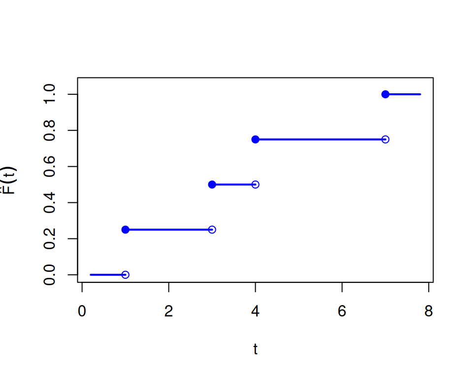
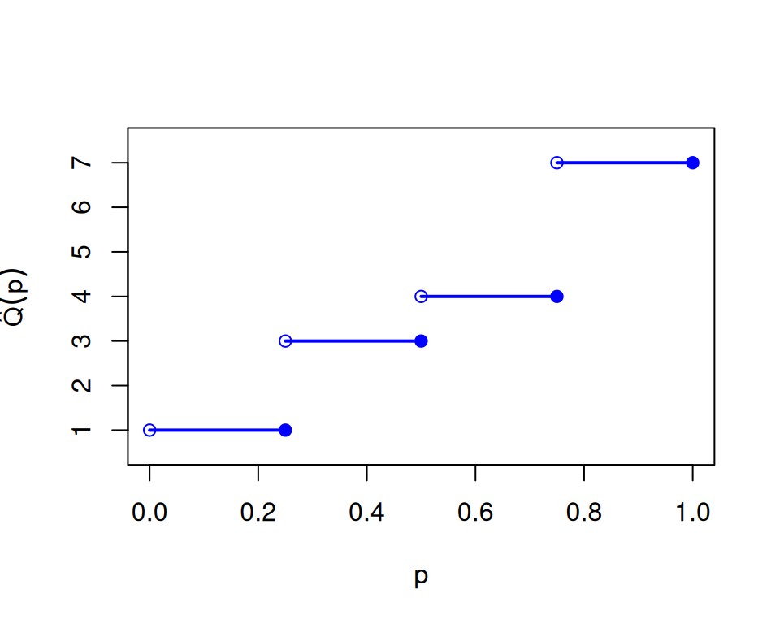

# Nonparametric Models

Code

Published

Last modified: 2026-10-08 19:32:38 (PDT)

## 1 Empirical CDF

> **NOTE:**
>
> **Definition 1 (Empirical CDF)** For observed values \\x_1, \ldots, x_n\\, the **empirical cumulative distribution function** (**empirical CDF**) is the function
>
> \\\hat F(t) \stackrel{\text{def}}{=}\frac{1}{n}\sum\_{j=1}^nI(x_j \le t), \quad t \in \mathbb{R},\\
>
> where \\I(A)\\ is the indicator function: \\I(A) = 1\\ if \\A\\ holds, and \\I(A) = 0\\ otherwise.

> **NOTE:**
>
> **Example 1 (Numerical example: empirical CDF)** Suppose the observed values are \\4, 1, 7, 3\\, so \\n = 4\\. Two of the four values (1 and 3) are at most 3.5, so:
>
> \\ \begin{aligned} \hat F(3.5) &= \frac{1}{4}\mathopen{}\left(I(4 \le 3.5) + I(1 \le 3.5) + I(7 \le 3.5) + I(3 \le 3.5)\right)\mathclose{} && \text{(definition of \$\hat F\$)}\\ &= \frac{1}{4}(0 + 1 + 0 + 1) && \text{(evaluate each indicator)}\\ &= 0.5 && \text{(arithmetic)} \end{aligned} \\
>
> Similarly, \\\hat F(0) = 0\\, because no value is at most 0, and \\\hat F(7) = 1\\, because every value is at most 7.

## 2 Order statistics

> **NOTE:**
>
> **Definition 2 (Order statistics)** For observed values \\x_1, \ldots, x_n\\, the **order statistics** are the same values sorted in increasing order, written
>
> \\x\_{(1)} \le x\_{(2)} \le \cdots \le x\_{(n)}.\\
>
> So \\x\_{(1)}\\ is the smallest value and \\x\_{(n)}\\ is the largest.

> **NOTE:**
>
> **Example 2 (Numerical example: order statistics)** If the observed values are \\4, 1, 7, 3\\, then the order statistics are \\x\_{(1)} = 1\\, \\x\_{(2)} = 3\\, \\x\_{(3)} = 4\\, and \\x\_{(4)} = 7\\.

## 3 Sample quantiles

> **NOTE:**
>
> **Definition 3 (Sample quantile function)** Given an [empirical CDF](#def-empirical-cdf) \\\hat F\\, the **sample quantile function** (also called the **empirical quantile function**) is
>
> \\\hat Q(p) \stackrel{\text{def}}{=}\inf\mathopen{}\left\\t : \hat F(t) \ge p\right\\\mathclose{}, \quad 0 \< p \le 1.\\
>
> For a given \\p\\, the value \\\hat Q(p)\\ is the **sample \\p\\ quantile**, also called the **sample \\100p\\th percentile**.

The [CDF](https://morrison-lab.github.io/pds/random-variables.html#def-cdf) \\F\\ and the [quantile function](https://morrison-lab.github.io/pds/random-variables.html#def-quantile-function) \\Q\\ describe a probability distribution, while \\\hat F\\ and \\\hat Q\\ describe a sample, and serve as estimates of \\F\\ and \\Q\\.

> **NOTE:**
>
> **Theorem 1 (Order-statistics form of the sample quantile)** If \\x\_{(1)} \le \cdots \le x\_{(n)}\\ are the [order statistics](#def-order-statistics) and \\i \in \mathopen{}\left\\1, \ldots, n\right\\\mathclose{}\\, then \\\hat Q(p) = x\_{(i)}\\ for every \\p\\ with \\(i-1)/n \< p \le i/n\\. In particular, \\\hat Q(i/n) = x\_{(i)}\\.

> **NOTE:**
>
> *Proof*. Fix \\p\\ with \\(i-1)/n \< p \le i/n\\.
>
> For any \\t \< x\_{(i)}\\, the \\n - i + 1\\ values \\x\_{(i)}, \ldots, x\_{(n)}\\ all exceed \\t\\, so at most \\i - 1\\ values are at most \\t\\, and:
>
> \\ \begin{aligned} \hat F(t) &\le \frac{i-1}{n} && \text{(at most \$i - 1\$ indicators equal 1)}\\ &\< p && \text{(choice of \$p\$)} \end{aligned} \\
>
> So no \\t \< x\_{(i)}\\ belongs to the set \\\mathopen{}\left\\t : \hat F(t) \ge p\right\\\mathclose{}\\.
>
> At \\t = x\_{(i)}\\, the \\i\\ values \\x\_{(1)}, \ldots, x\_{(i)}\\ are all at most \\x\_{(i)}\\, so:
>
> \\ \begin{aligned} \hat F\mathopen{}\left(x\_{(i)}\right)\mathclose{} &\ge \frac{i}{n} && \text{(at least \$i\$ indicators equal 1)}\\ &\ge p && \text{(choice of \$p\$)} \end{aligned} \\
>
> So \\x\_{(i)}\\ belongs to the set, and it is the smallest member of the set, because no smaller \\t\\ belongs to it. Therefore \\\hat Q(p) = x\_{(i)}\\.

> **NOTE:**
>
> **Example 3 (Numerical example: sample quantiles)** Using the same data \\4, 1, 7, 3\\, with order statistics \\1, 3, 4, 7\\, [Theorem 1](#thm-sample-quantile-order-statistics) says the sample quantile function is a step function:
>
> - \\\hat Q(p) = 1\\ for \\0 \< p \le 1/4\\;
> - \\\hat Q(p) = 3\\ for \\1/4 \< p \le 1/2\\;
> - \\\hat Q(p) = 4\\ for \\1/2 \< p \le 3/4\\;
> - \\\hat Q(p) = 7\\ for \\3/4 \< p \le 1\\.
>
> So \\\hat Q(0.5) = 3\\ and \\\hat Q(0.9) = 7\\. R’s [`quantile()`](https://rdrr.io/r/stats/quantile.html) function computes this definition when called with `type = 1`:
>
> ``` downlit
> quantile(c(4, 1, 7, 3), probs = c(0.5, 0.9), type = 1)
> #> 50% 90% 
> #>   3   7
> ```

> **NOTE:**
>
> *Remark 1* (Quantile conventions). Other sources, and other software defaults, define sample quantiles differently, mostly by interpolating between order statistics. R’s [`quantile()`](https://rdrr.io/r/stats/quantile.html) offers nine definitions through its `type` argument, and its default (`type = 7`) interpolates, so `quantile(c(4, 1, 7, 3), 0.5)` returns 3.5, not 3. The usual sample median is another interpolated quantile: for an even number of observations, it averages the two middle order statistics. These notes use [Definition 3](#def-sample-quantile), which always returns one of the observed values.

## 4 The empirical CDF and quantile function as generalized inverses

Show R code

``` downlit
x <- c(4, 1, 7, 3)
n <- length(x)
x_ord <- sort(x)
p_ord <- seq_len(n) / n
ecdf_x_padding <- 0.8
x_min <- min(x_ord) - ecdf_x_padding
x_max <- max(x_ord) + ecdf_x_padding

x_left <- c(x_min, x_ord)
x_right <- c(x_ord, x_max)
f_levels <- c(0, p_ord)

plot(
  0,
  0,
  type = "n",
  xlim = c(x_min, x_max),
  ylim = c(0, 1.05),
  xlab = "t",
  ylab = expression(hat(plain("F"))(t))
)
segments(x_left, f_levels, x_right, f_levels, lwd = 2, col = "blue")
points(x_ord, f_levels[seq_len(n)], pch = 1, col = "blue")
points(x_ord, f_levels[seq_len(n) + 1], pch = 19, col = "blue")
```

[](nonparametric-models_files/figure-html/unnamed-chunk-2-1.png "Figure 1 (a): Empirical CDF, horizontal pieces only. Closed circles mark included endpoints; open circles mark excluded endpoints.")

\(a\) Empirical CDF, horizontal pieces only. Closed circles mark included endpoints; open circles mark excluded endpoints.

Show R code

``` downlit
eqf_y_padding <- 0.5
q_left <- c(0, p_ord[-n])
q_right <- p_ord
plot(
  0,
  0,
  type = "n",
  xlim = c(0, 1),
  ylim = c(min(x_ord) - eqf_y_padding, max(x_ord) + eqf_y_padding),
  xlab = "p",
  ylab = expression(hat(Q)(p))
)
segments(q_left, x_ord, q_right, x_ord, lwd = 2, col = "blue")
points(q_left, x_ord, pch = 1, col = "blue")
points(q_right, x_ord, pch = 19, col = "blue")
```

[](nonparametric-models_files/figure-html/unnamed-chunk-3-1.png "Figure 1 (b): Sample quantile function, horizontal pieces only. Open circles mark excluded left endpoints; closed circles mark included right endpoints.")

\(b\) Sample quantile function, horizontal pieces only. Open circles mark excluded left endpoints; closed circles mark included right endpoints.

Figure 1: The empirical CDF and the sample quantile function for the data 4, 1, 7, 3 (order statistics 1, 3, 4, 7).

Both functions in [Figure 1](#fig-ecdf-sample-quantile-example) are step functions, so neither is one-to-one. Each flat piece of one function corresponds to a jump of the other: for example, \\\hat F(t) = 0.5\\ for every \\t \in \[3, 4)\\, and \\\hat Q\\ jumps from 3 to 4 at \\p = 0.5\\. So \\\hat Q\\ is a *generalized* inverse of \\\hat F\\, not an inverse in the usual sense: \\\hat Q(\hat F(t)) \le t\\ for every \\t \ge x\_{(1)}\\, with equality only at the observed values.

Back to top
